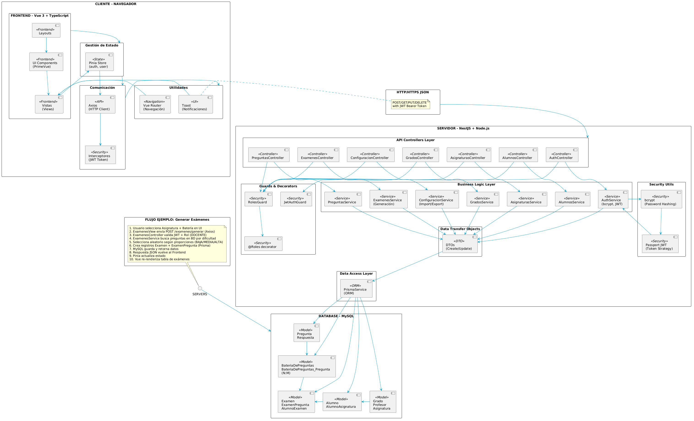

# Análisis, diseño e implementación de Sistema de Gestión de Exámenes Universitarios

Sistema web para la gestión de exámenes universitarios. Permite a docentes y administradores gestionar grados, asignaturas, alumnos, preguntas, respuestas y exámenes, incluyendo generación automática y corrección.

**Proyecto** — IDSW2 · gII · UNEATLANTICO

## Tecnologías

| Capa | Stack |
|------|-------|
| **Frontend** | Vue 3 + TypeScript + PrimeVue + Pinia + Vite + axios |
| **Backend** | NestJS + TypeScript + Prisma ORM |
| **Base de datos** | MYSQL |
| **Autenticación** | JWT + Passport + bcrypt |

## Arquitectura

Monorepo Turborepo con aplicaciones independientes frontend y backend:

```
src/
├── apps/
│   ├── backend/          # NestJS API REST
│   │   ├── prisma/       # Schema y migraciones
│   │   └── src/
│   │       ├── auth/         # AuthController, AuthService, JwtStrategy
│   │       ├── alumnos/     # CRUD alumnos + importación
│   │       ├── asignaturas/ # CRUD asignaturas
│   │       ├── grados/      # CRUD grados
│   │       ├── profesores/  # CRUD docentes
│   │       ├── preguntas/   # CRUD preguntas + respuestas anidadas
│   │       ├── examenes/    # Generación y corrección
│   │       ├── bateria/     # Asignación de exámenes
│   │       ├── respuestas/  # CRUD respuestas
│   │       ├── common/      # Guards, decorators (JwtAuthGuard, RolesGuard, @Roles, @CurrentUser)
│   │       └── prisma/      # PrismaService
│   └── frontend/         # Vue 3 SPA
│       └── src/
│           ├── views/       # LoginView y vistas por módulo
│           ├── stores/      # Pinia (auth)
│           ├── api/         # Axios instance con interceptors
│           ├── router/      # Vue Router con guards
│           └── layouts/     # MainLayout con toolbar y sesión
```

### Diagrama de Arquitectura Completa



**Componentes por capa:**

**FRONTEND (Vue 3)**
- Componentes: DashboardView, GradosView, AsignaturasView, AlumnosView, PreguntasView, ExamenesView
- Estado: Pinia Store (auth, user)
- HTTP: Axios + Interceptores JWT
- Navegación: Vue Router con guards

**BACKEND (NestJS)**
- Controladores: Auth, Grados, Asignaturas, Alumnos, Preguntas, Exámenes, Configuración
- Servicios: Lógica de negocio, validaciones, generación de exámenes
- DTOs: Validación de entrada (class-validator)
- Guards: JwtAuthGuard, RolesGuard (DOCENTE/ADMIN)
- ORM: Prisma para consultas a MySQL

**BASE DE DATOS (MySQL)**
- 11 Modelos: Profesor, Alumno, Grado, Asignatura, Pregunta, Respuesta, Examen, BateriaDePreguntas, AlumnoExamen, ExamenPregunta, AlumnoAsignatura
- Relaciones: N:M con tablas intermedias
- Índices: Optimizados para FK y búsquedas

**SEGURIDAD**
- JWT Token (Bearer en headers)
- bcrypt para hashing de contraseñas
- RolesGuard para control de acceso (DOCENTE vs ADMIN)
- CORS configurado

### Flujo de Datos Ejemplo: Generar Exámenes

```
1. Usuario (Browser)
   ↓
2. ExamenesView (Vue component)
   - User selecciona asignatura, batería, cantidad
   ↓
3. API call (Axios POST /examenes/generar)
   - Headers: Authorization: Bearer {JWT_TOKEN}
   ↓
4. ExamenesController.generar()
   - Valida rol: @Roles(Rol.DOCENTE)
   - Recibe GenerarExamenesDto
   ↓
5. ExamenesService.generar()
   - Busca BateriaDePreguntas por ID
   - Filtra preguntas por dificultad (BAJA/MEDIA/ALTA)
   - Selecciona aleatoriamente según proporciones
   - Crea Examen + ExamenPregunta (N:M)
   ↓
6. Prisma Queries
   - SELECT * FROM BateriaDePreguntas_Pregunta WHERE bateriaId = ?
   - INSERT INTO Examen (...)
   - INSERT INTO ExamenPregunta (...)
   ↓
7. MySQL Database
   - Almacena registros
   - Retorna IDs generados
   ↓
8. ExamenesService retorna examen creado
   ↓
9. ExamenesController retorna JSON
   ↓
10. Axios interceptor (token válido)
    ↓
11. Pinia store actualiza estado
    ↓
12. Vue component re-renderiza tabla
    ↓
13. Usuario ve nuevo examen en pantalla
```

### Tecnologías por Capa

| Capa | Tecnología | Responsabilidad |
|------|------------|-----------------|
| **UI/Presentación** | Vue 3 + PrimeVue + Tailwind | Componentes visuales, layouts, interacción usuario |
| **Estado** | Pinia | Almacenar estado global (autenticación, usuario) |
| **Comunicación** | Axios + JWT | Requests HTTP, autenticación, interceptores |
| **Routing** | Vue Router | Navegación, guards, protección de rutas |
| **API** | NestJS Controllers | Endpoints REST, validación de requests |
| **Lógica** | NestJS Services | Reglas de negocio, orquestación |
| **Datos** | Prisma ORM | Queries tipadas, migraciones, relaciones |
| **Seguridad** | bcrypt + Passport JWT | Hashing de contraseñas, validación de tokens |
| **DB** | MySQL | Persistencia de datos |

## Artefactos

| # | Artefacto | Descripción |
|---|-----------|-------------|
| 0 | `QUE_HACE.md` | Primer commit del repositorio |
| 1 | **README.md** | Este archivo |
| 2 | `src/` | Código fuente (monorepo frontend + backend) |
| 3 | `modelosUML/` | Diagramas de análisis y diseño en PlantUML |
| 4 | `images/` | Diagramas renderizados en SVG |
| 5 | `documents/` | Documentación de análisis y diseño RUP |
| 6 | `conversation-log.md` | Registro cronológico del proceso de creación |

## Navegación

| Sección | Enlace |
|---------|--------|
| Análisis RUP | [`documents/analisis/README.md`](documents/analisis/README.md) |
| Diseño RUP | [`documents/diseño/README.md`](documents/diseño/README.md) |
| Código fuente | [`src/README.md`](src/README.md) |
| Modelos UML | [`modelosUML/`](modelosUML/) |
| Diagramas renderizados | [`images/`](images/) |
| Registro del proceso | [`conversation-log.md`](conversation-log.md) |

## Funcionalidades principales

- **Gestión de grados, asignaturas, alumnos, docentes, preguntas** (CRUD completo + importación/exportación CSV)
- **Gestión de respuestas** (hasta 5 por pregunta)
- **Generación automática de exámenes** (selección por dificultad y tema, Fisher-Yates shuffle)
- **Asignación de exámenes** a alumnos con clave de corrección única
- **Corrección de exámenes** con retroalimentación detallada
- **Autenticación JWT** con roles DOCENTE y ADMIN
- **Importación/exportación** masiva desde CSV

## Roles de usuario

- **Docente**: gestiona grados, asignaturas, alumnos, preguntas, respuestas y exámenes.
- **Administrador institucional**: gestiona docentes y completa la puesta en disponibilidad del sistema.

## Cómo ejecutar

```bash
# Backend (NestJS)
cd src/apps/backend
npm install
npx prisma migrate dev
npm run start:dev

# Frontend (Vue 3)
cd src/apps/frontend
npm install
npm run dev
```

El frontend se sirve en `http://localhost:5173` y proxy al backend en `http://localhost:3000`.
