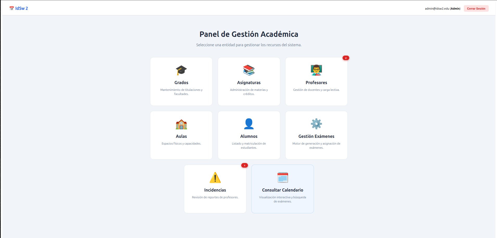

<h1 align="center">Sistema de Generación de Calendarios de Exámenes</h1>

<div align="center">

[](/README.md)
[](/RUP/00-requisitos/00-modelo-del-dominio/README.md)
[](/RUP/00-requisitos/01-casos-de-uso/0-Actores/README.md)
[](/RUP/00-requisitos/01-casos-de-uso/2-DiagramaDeContexto/README.md)
[](/RUP/00-requisitos/01-casos-de-uso/4-DetallarCasosDeUso/README.md)
[](/RUP/01-analisis/casos-uso/README.md)
[](/RUP/02-diseño/README.md)
[](/RUP/03-desarrollo/README.md)
[](/conversation-log.md)


</div>

<p align="center">
  
  <br>
  <i>Panel de Gestión Académica: gestión académica, generación y consulta del calendario de exámenes.</i>
</p>

Este proyecto consiste en una **plataforma web académica integrada** para la automatización, gestión y consulta de calendarios de exámenes, desarrollada bajo la metodología **RUP (Rational Unified Process)** y siguiendo las pautas de arquitectura limpia de **pySigHor**.

El sistema resuelve la distribución temporal y espacial de evaluaciones utilizando un motor greedy con soft constraints y validaciones automáticas de conflictos en tiempo real.
---

<div align="center">

### 🛠️ Stack Tecnológico

#### Backend
[](https://nestjs.com/)
[](https://nodejs.org/)
[](https://www.typescriptlang.org/)
[](https://typeorm.io/)
[](https://www.mysql.com/)

#### Frontend
[](https://angular.dev/)
[](https://rxjs.dev/)
[](https://developer.mozilla.org/es/docs/Web/HTML)
[](https://developer.mozilla.org/es/docs/Web/CSS)

</div>


---

## 📂 Estructura del Proyecto

```text
├── RUP/                      # Documentación RUP organizada por disciplinas
│   ├── 00-requisitos/        # Requisitos (Casos de Uso, Contexto)
│   ├── 01-analisis/          # Análisis (Diagramas MVC de Colaboración)
│   ├── 02-diseño/            # Diseño (Diagramas de Secuencia, Arquitectura)
│   └── 03-desarrollo/        # Desarrollo e Implementación
├── modelosUML/               # Modelos técnicos en formato fuente PlantUML (.puml)
├── images/                   # Diagramas y activos visuales generados (.svg)
├── src/                      # Código fuente de la aplicación
│   ├── backend/              # API REST en NestJS
│   │   ├── src/
│   │   │   ├── common/       # DTOs, filtros y utilidades compartidas
│   │   │   ├── entities/     # Modelos de base de datos TypeORM
│   │   │   └── modules/      # Módulos de negocio (examenes, incidencias, etc.)
│   │   └── sql/              # Scripts de migración y población de datos SQL
│   └── frontend/             # Single Page Application en Angular 21
│       └── src/app/
│           ├── core/         # Guardas, interceptores y servicios singleton
│           └── features/     # Componentes y vistas por funcionalidad
└── conversation-log.md       # Bitácora histórica incremental de vibecoding
```

---

## 🚀 Características Principales

### 1. Gestión Administrativa (CRUD & Carga Masiva)
*   **Gestión Integral**: Mantenimiento completo de **Grados, Asignaturas, Profesores, Alumnos y Aulas** en tablas interactivas de gran escala con paginación integrada.
*   **Importación Masiva**: Carga rápida de registros mediante archivos CSV y Excel estructurados, con validación sintáctica de formatos y de claves foráneas antes de persistir en base de datos.

### 2. Motor de Programación Inteligente (`CalendarioEngine`)
*   **Restricciones Duras (Hard Constraints)**: Valida en tiempo real y evita la superposición de exámenes en la misma aula física o la doble asignación horaria para supervisión docente.
*   **Heurística de Dispersión Académica**: Algoritmo que penaliza la asignación de múltiples exámenes en días consecutivos para un mismo curso y grado, garantizando la salud pedagógica de los calendarios.
*   **Postura B de Validación (Asignación Manual Libre)**: Permite a los administradores ignorar de forma intencionada las advertencias en la edición manual para poder forzar y gestionar colisiones, las cuales fluyen hacia los paneles correspondientes.

### 3. Portal del Profesor (Preferencias e Incidencias)
*   **Gestión de Preferencias**: Calendario interactivo semanal donde el docente registra sus franjas de indisponibilidad horaria para evitar asignaciones conflictivas.
*   **Buzón de Incidencias**: Módulo responsivo de doble columna donde el profesor reporta colisiones sobre exámenes asignados y sigue el estado de la revisión en tiempo real.

### 4. Portal del Alumno (Consulta Contextual)
*   **Seguridad y Privacidad**: Los estudiantes acceden a una vista personalizada adaptada a su rol, que restringe los calendarios únicamente a las asignaturas de su propia titulación.
*   **Exportación Multiformato**: Descarga directa de calendarios en PDF y Excel, estructurada bajo el patrón *Strategy* y DTOs desacoplados.

---

## 🔑 Credenciales de Prueba

| Rol | Correo Electrónico | Descripción de Acceso |
|---|---|---|
| **Administrador** | `admin@idsw2.edu` | Panel total de gestión y motor de calendarización. |
| **Profesor** | `manuel.masias@uneatlantico.es` | Registro de preferencias y reporte de incidencias. |
| **Alumno** | `pedro.sanchez@alumnos.uneatlantico.es` | Portal de consulta de fechas, horarios y aulas. |

---

## ⚙️ Instalación y Ejecución

### Requisitos Previos
*   **Node.js**: Versión 20 o superior.
*   **MySQL Server**: Base de datos vacía llamada `generador_calendarios`.

### Paso 1: Configurar el Backend (NestJS)
1. Navega a `src/backend`.
2. Instala dependencias:
   ```bash
   npm install
   ```
3. Crea un archivo `.env` en la raíz de `src/backend` con los accesos a tu base de datos:
   ```env
   DB_HOST=localhost
   DB_PORT=3306
   DB_USERNAME=tu_usuario
   DB_PASSWORD=tu_contraseña
   DB_DATABASE=generador_calendarios
   JWT_SECRET=secret_key_idsw2_2026_dev_only
   ```
4. Inicializa y puebla la base de datos importando los scripts SQL en el siguiente orden:
   1. `sql/initial_schema.sql` (Esquema de tablas e inserción del Admin inicial).
   2. `sql/add_profesor.sql` (Carga inicial de docentes de prueba).
   3. `sql/create_incidencia.sql` (Estructura de la tabla de incidencias).
   4. `sql/create_preferencia.sql` (Estructura de la tabla de preferencias).
5. Inicia el servidor de desarrollo:
   ```bash
   npm run start:dev
   ```
   *El backend se ejecutará en http://localhost:3000.*

### Paso 2: Configurar el Frontend (Angular)
1. Navega a `src/frontend`.
2. Instala dependencias:
   ```bash
   npm install
   ```
3. Inicia el servidor local:
   ```bash
   npm start
   ```
   *El frontend se ejecutará en http://localhost:4200.*

---

## 🗺️ Mapa de Trazabilidad RUP

*   **Disciplina de Requisitos**:
    *   [Diagramas de Contexto e Hilos por Actor](/RUP/00-requisitos/01-casos-de-uso/2-DiagramaDeContexto/README.md)
    *   [Especificaciones Detalladas de Casos de Uso](/RUP/00-requisitos/01-casos-de-uso/4-DetallarCasosDeUso/README.md)
*   **Disciplina de Análisis**:
    *   [Diagramas de Colaboración MVC](/RUP/01-analisis/casos-uso/README.md)
*   **Disciplina de Diseño**:
    *   [Diagrama de Arquitectura y Clases](/RUP/02-diseño/README.md)
    *   [Diagramas de Secuencia Detallados por Caso de Uso](/RUP/02-diseño/casos-uso)
*   **Disciplina de Implementación**:
    *   [Mapeado de Desarrollo](/RUP/03-desarrollo/README.md)
*   **Registro Histórico**:
    *   [Bitácora de Sesiones de VibeCoding](/conversation-log.md)
