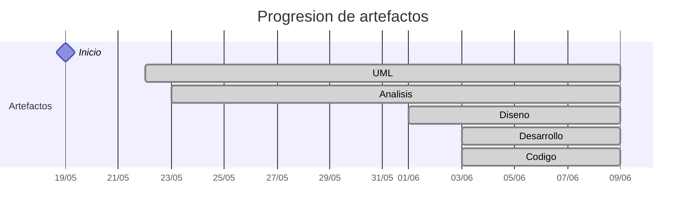

# Timeline - Alejandrojuarez0105

> Repo: [Alejandrojuarez0105/25-26-idsw2-sdVC](https://github.com/Alejandrojuarez0105/25-26-idsw2-sdVC)
> Commits: 84 | Días activos: 17 | Sesiones log: 75

## Patrón observado

| Métrica | Valor |
|---|---|
| Commits propios | 84 (67 feat / 1 fix / 16 other) |
| Ratio fix/feat | 0.01 |
| Días activos | 17 |
| Sesiones documentadas | 75 |
| Días log+commits | 16 |
| Días solo log | 0 |
| Días solo commits | 1 |

<!-- trazabilidad: manual -->
## Trazabilidad por caso de uso

| Caso de uso | D5 | D6 | D7 | D10 | D12 | D13 | D14 | D15 | D16 | D17 | D18 |
|---|:---:|:---:|:---:|:---:|:---:|:---:|:---: | :---: | :---: | :---: | :---: |
| `iniciarSesion` | A |   |   |   |   |   | | D | d | |     |
| `cerrarSesion` | A |   |   |   |   |   | | D | d | |     |
| `abrirGrados` |   | A |   |   |   |   | | | Dd | |     |
| `importarGrados` |   | A |   |   |   |   | | | Dd | |     |
| `eliminarGrado` |   | A |   |   |   |   | | | Dd | |     |
| `crearGrado` |   | A |   |   |   |   | | | Dd | |     |
| `editarGrado` |   | A |   |   |   |   | | | D | d |     |
| `abrirAsignaturas` |   |   | A |   |   |   | | | | Dd |     |
| `importarAsignaturas` |   |   | A |   |   |   | | | | Dd |     |
| `eliminarAsignatura` |   |   | A |   |   |   | | | | Dd |     |
| `crearAsignatura` |   |   | A |   |   |   | | | | Dd |     |
| `editarAsignatura` |   |   | A |   |   |   | | | | Dd |     |
| `abrirExamenes` |   |   | A |   |   |   | | | | | D |
| `eliminarExamen` |   |   | A |   |   |   | | | | | D |
| `crearExamen` |   |   | A |   |   |   | | | | | D |
| `abrirAulas` |   |   |   | A |   |   | | | | |     |
| `importarAulas` |   |   |   | A |   |   | | | | |     |
| `crearAula` |   |   |   | A |   |   | | | | |     |
| `editarAula` |   |   |   | A |   |   | | | | |     |
| `eliminarAula` |   |   |   | A |   |   | | | | |     |
| `abrirProfesores` |   |   |   |   | A |   | | | | |     |
| `importarProfesores` |   |   |   |   | A |   | | | | |     |
| `crearProfesor` |   |   |   |   | A |   | | | | |     |
| `editarProfesor` |   |   |   |   | A |   | | | | |     |
| `eliminarProfesor` |   |   |   |   | A |   | | | | |     |
| `generarCalendario` |   |   |   |   |   | A | | | | |     |
| `completarProceso` |   |   |   |   |   | A | | | | |     |
| `consultarCalendario` |   |   |   |   |   | A | | | | |     |
| `completarConsulta` |   |   |   |   |   | A | | | | |     |
| `descargarCalendarioExamenes` |   |   |   |   |   | A | | | | |     |
| `completarGestion` |   |   |   |   |   | A | | | | |     |
| `asignarProfesorAExamen` |   |   |   |   |   |   | A | | | |     |
| `completarComunicacion` |   |   |   |   |   |   | A | | | |     |
| `comunicarIncidenciasHorario` |   |   |   |   |   |   | A | | | |     |

| `editarExamen` |     |     |     |     |     |     |     |     |     |     | D |

---

## Día 3 · 2026-05-21

### Commits (3: 0 feat / 0 fix)

| Hora | Mensaje |
|---|---|
| 23:23 | [refactor: corregir estructura de conversation-log.md sin modificar el contenido](https://github.com/Alejandrojuarez0105/25-26-idsw2-sdVC/commit/0a1b8f83b4e3b9a0c34818d5ee276aaf3167874b) |
| 23:09 | [chore: migración de la estructura RUP, corrección de rutas de imágenes y enlaces, README con enlace a Davidario](https://github.com/Alejandrojuarez0105/25-26-idsw2-sdVC/commit/925a477f3f436320a68a376aac42651f97db99c0) |
| 11:41 | [docs: primer commit, QUE_HACE.md](https://github.com/Alejandrojuarez0105/25-26-idsw2-sdVC/commit/7dc2e48dada807135c363a4c185de5b2d12ff50e) |

### 💬 Conversation-log (2 sesiónes)

- Sesión 1: Migración inicial de artefactos RUP
- Sesión 2: Corrección de migración y refactorización de enlaces

> 💬 + commits = proceso documentado

---

## Día 4 · 2026-05-22

### Commits (1: 0 feat / 0 fix)

| Hora | Mensaje |
|---|---|
| 18:25 | [refactor: centralizar imágenes y modelos UML para una estructura global organizada](https://github.com/Alejandrojuarez0105/25-26-idsw2-sdVC/commit/b10f76784adf63ee46501898f03c93dd2e6d7087) |

### 💬 Conversation-log (1 sesión)

- Sesión 3: Centralización de recursos y reorganización estructural

**Artefactos nuevos:** 📐 

> 💬 + commits = proceso documentado

---

## Día 5 · 2026-05-23

### Commits (4: 2 feat / 0 fix)

| Hora | Mensaje |
|---|---|
| 01:44 | [feat: análisis del caso de uso cerrarSesion y registrar cierre de sesión 4](https://github.com/Alejandrojuarez0105/25-26-idsw2-sdVC/commit/b8f159081c0ba3d3b6b44ca8e42f23ddf5a343e2) |
| 15:37 | [docs: cierre de sesión 3 con actualización de conversation-log.md](https://github.com/Alejandrojuarez0105/25-26-idsw2-sdVC/commit/57a8555189f3a740f802c18f26a19e6a0c9083ee) |
| 15:34 | [feat: crear estructura de la disciplina de análisis de requisitos y primer caso de uso iniciarSesion](https://github.com/Alejandrojuarez0105/25-26-idsw2-sdVC/commit/6a78461489578c4a183be59925828d578e5afdee) |
| 12:59 | [docs: añadir AGENTES.md y actualizar conservation-log.md con nueva estructura de sesiones](https://github.com/Alejandrojuarez0105/25-26-idsw2-sdVC/commit/f0166f7851878e684b5ff7825ae440a57b9c79df) |

### 💬 Conversation-log (2 sesiónes)

- Sesión 4: Fase de Análisis e iniciarSesion()
- Sesión 5: Análisis de cerrarSesion()

**Artefactos nuevos:** 🔍 

> 💬 + commits = proceso documentado

---

## Día 6 · 2026-05-24

### Commits (8: 5 feat / 1 fix)

| Hora | Mensaje |
|---|---|
| 01:54 | [feat: desarrollar el análisis del caso de uso editarGrado y cierre de sesión 9](https://github.com/Alejandrojuarez0105/25-26-idsw2-sdVC/commit/dcd8b61a2422e04c7ef50a812f07ff7299f1b749) |
| 18:25 | [feat: desarrollar el análisis del caso de uso crearGrado y cierre de sesión 8](https://github.com/Alejandrojuarez0105/25-26-idsw2-sdVC/commit/16217bdeef18f608d8ec0a5191b77e878bfdb45c) |
| 16:43 | [fix: agregar importarGrados a los README de RUP/01-analisis y RUP/01-analisis/caso-uso](https://github.com/Alejandrojuarez0105/25-26-idsw2-sdVC/commit/c92ae4c52f749bb27dbf29917bea31487aedafac) |
| 16:36 | [feat: desarrollar el análisis del caso de uso eliminarGrado y cierre de sesión 7](https://github.com/Alejandrojuarez0105/25-26-idsw2-sdVC/commit/98fc54daa3ac8fd942a35e1131383035eea78b8e) |
| 14:56 | [docs: cierre de sesión 6 y actualización de conversation-log.md](https://github.com/Alejandrojuarez0105/25-26-idsw2-sdVC/commit/d5fedf58f1a767492548f8e8fbdcc34ee532bce2) |
| 14:36 | [feat: desarrollar caso de uso importarGrados](https://github.com/Alejandrojuarez0105/25-26-idsw2-sdVC/commit/2ff4a42a5ca9a72b91550dde87da4a9ad6de345e) |
| 12:38 | [docs: registrar cierre de sesión 5](https://github.com/Alejandrojuarez0105/25-26-idsw2-sdVC/commit/b6d8e4a69a25f02af543cab4c0db14a1f62f936c) |
| 12:05 | [feat: desarrollar caso de uso abrirGrados y estandarizar estructura de casos de uso](https://github.com/Alejandrojuarez0105/25-26-idsw2-sdVC/commit/088c23044edfac42c844e365fa5a8502ffb2298e) |

### 💬 Conversation-log (4 sesiónes)

- Sesión 6: Análisis RUP - abrirGrados()
- Sesión 7: Análisis RUP - importarGrados()
- Sesión 8: Análisis RUP - eliminarGrado()
- Sesión 9: Análisis RUP - crearGrado()

> 💬 + commits = proceso documentado

---

## Día 7 · 2026-05-25

### Commits (8: 8 feat / 0 fix)

| Hora | Mensaje |
|---|---|
| 22:13 | [feat: desarrollar el análisis del caso de uso crearExamen y cierre de sesión 17](https://github.com/Alejandrojuarez0105/25-26-idsw2-sdVC/commit/1521f3b2f90e93ce16de887162438c5b6ceec817) |
| 16:44 | [feat: desarrollar el análisis del caso de uso eliminarExamen y cierre de sesión 16](https://github.com/Alejandrojuarez0105/25-26-idsw2-sdVC/commit/f3c5a6fe42e020642cc5ce902a840b08b7c2cf8a) |
| 15:34 | [feat: desarrollar el análisis del caso de uso abrirExamenes y cierre de sesión 15](https://github.com/Alejandrojuarez0105/25-26-idsw2-sdVC/commit/ad96aff5c9c93b7b710cce932a18bca9f1f6b6e2) |
| 13:58 | [feat: desarrollar el análisis del caso de uso editarAsignatura y cierre de sesión 14](https://github.com/Alejandrojuarez0105/25-26-idsw2-sdVC/commit/a2136121123ec6f8d838eb13ec5b88a3478a503d) |
| 13:38 | [feat: desarrollar el análisis del caso de uso crearAsignatura y cierre de sesión 13](https://github.com/Alejandrojuarez0105/25-26-idsw2-sdVC/commit/3b73bcf4f825e7e466d2550fc47d167a9d07d700) |
| 12:43 | [feat: desarrollar el análisis del caso de uso eliminarAsignatura y cierre de sesión 12](https://github.com/Alejandrojuarez0105/25-26-idsw2-sdVC/commit/587cf475acd867627ef471f76246136805903d03) |
| 11:36 | [feat: desarrollar el análisis del caso de uso importarAsignaturas y cierre de sesión 11](https://github.com/Alejandrojuarez0105/25-26-idsw2-sdVC/commit/eab8390704ae4c57c72e046ff09b139ada9a625c) |
| 10:51 | [feat: desarrollar el análisis del caso de uso abrirAsignaturas y cierre de sesión 10](https://github.com/Alejandrojuarez0105/25-26-idsw2-sdVC/commit/a9ae9246e530ffc562947c47cfe431b2b991e8a3) |

### 💬 Conversation-log (9 sesiónes)

- Sesión 10: Análisis RUP - editarGrado()
- Sesión 11: Análisis RUP - abrirAsignaturas()
- Sesión 12: Análisis RUP - importarAsignaturas()
- Sesión 13: Análisis RUP - eliminarAsignatura()
- Sesión 14: Análisis RUP - crearAsignatura()
- Sesión 15: Análisis RUP - editarAsignatura()
- Sesión 16: Análisis RUP - abrirExamenes()
- Sesión 17: Análisis RUP - eliminarExamen()
- Sesión 18: Análisis RUP - crearExamen() y expansión no solicitada de casos de uso

> 💬 + commits = proceso documentado

---

## Día 10 · 2026-05-28

### Commits (1: 1 feat / 0 fix)

| Hora | Mensaje |
|---|---|
| 23:24 | [feat: desarrollar la rama Aulas y cierre de sesión 18](https://github.com/Alejandrojuarez0105/25-26-idsw2-sdVC/commit/d7c2f163ca3cc271e963307d3e7501f60f2ac312) |

### 💬 Conversation-log (1 sesión)

- Sesión 19: Análisis RUP - Rama Aulas

> 💬 + commits = proceso documentado

---

## Día 11 · 2026-05-29

### Commits (1: 0 feat / 0 fix)

| Hora | Mensaje |
|---|---|
| 00:51 | [Modificación diagrama de contexto Administrador](https://github.com/Alejandrojuarez0105/25-26-idsw2-sdVC/commit/5f0fc153b14b0b76a5be13c437f0751355f7220f) |

> ⚠️ Commits sin entrada en log

---

## Día 12 · 2026-05-30

### Commits (1: 1 feat / 0 fix)

| Hora | Mensaje |
|---|---|
| 18:11 | [feat: desarrollar la rama Profesor y cierre de sesión 19](https://github.com/Alejandrojuarez0105/25-26-idsw2-sdVC/commit/d161c5207d50e4d840a86bca3e5365bada779ac6) |

### 💬 Conversation-log (1 sesión)

- Sesión 20: Análisis RUP - Rama Profesores

> 💬 + commits = proceso documentado

---

## Día 13 · 2026-05-31

### Commits (4: 3 feat / 0 fix)

| Hora | Mensaje |
|---|---|
| 00:23 | [feat: desarrollar el análisis del caso completarGestion y cierre de sesión 22](https://github.com/Alejandrojuarez0105/25-26-idsw2-sdVC/commit/62cb5d4b92c9c37888400eb6b3e4d00aa539447f) |
| 20:12 | [docs: añadiendo cambios faltantes en el README de completarConsulta](https://github.com/Alejandrojuarez0105/25-26-idsw2-sdVC/commit/173f0cc5ffaef26183f785b087f67a7d5568bf31) |
| 20:08 | [feat: desarrollar la rama Consulta de Calendario y cierre de sesión 21](https://github.com/Alejandrojuarez0105/25-26-idsw2-sdVC/commit/d44882cfd41407df13b3543e928ca333365431e4) |
| 18:05 | [feat: desarrollar la rama Calendario y cierre de sesión 20](https://github.com/Alejandrojuarez0105/25-26-idsw2-sdVC/commit/8e3bda3a4ceec59a4c9d508b68e077c9464b97c3) |

### 💬 Conversation-log (3 sesiónes)

- Sesión 21: Análisis RUP - Rama Calendario
- Sesión 22: Análisis RUP - Rama Consulta de Calendario
- Sesión 23: Análisis RUP - completarGestion()

> 💬 + commits = proceso documentado

---

## Día 14 · 2026-06-01

### Commits (5: 2 feat / 0 fix)

| Hora | Mensaje |
|---|---|
| 01:18 | [refactor: refinamiento de la documentación de diseño y cierre de sesión 27](https://github.com/Alejandrojuarez0105/25-26-idsw2-sdVC/commit/b92e9783c774bf93bbae22a38d71c5b7755d986e) |
| 00:28 | [docs: Creación de carpetas y del README principal de diseño](https://github.com/Alejandrojuarez0105/25-26-idsw2-sdVC/commit/6b6b23a6b83e0c61505bb368ad178422a3dacb3f) |
| 21:31 | [feat: desarrollar analisis de todo el actor Alumno y cierre de sesión 25](https://github.com/Alejandrojuarez0105/25-26-idsw2-sdVC/commit/2953b62848dbd737b1d93b4fd2da4927407df829) |
| 20:57 | [feat: desarrollar analisis de todo el actor Profesor y cierre de sesión 24](https://github.com/Alejandrojuarez0105/25-26-idsw2-sdVC/commit/11eff8ff6b89b00e2d4befca22b32f875b39aebb) |
| 16:21 | [refactor: agrupar todos los analisis de los casos de uso de administrador en 0-Administrador](https://github.com/Alejandrojuarez0105/25-26-idsw2-sdVC/commit/c370a98c98428bfee1ebaf8a53e002b2ca88d860) |

### 💬 Conversation-log (3 sesiónes)

- Sesión 24: Reorganización estructural - Actor Administrador
- Sesión 25: Análisis RUP - Actor Profesor
- Sesión 26: Análisis RUP - Actor Alumno

**Artefactos nuevos:** 🧩 

> 💬 + commits = proceso documentado

---

## Día 15 · 2026-06-02

### Commits (2: 1 feat / 0 fix)

| Hora | Mensaje |
|---|---|
| 21:30 | [feat: desarrollar diseño de iniciar y cerrar sesion y cierre de sesión 29](https://github.com/Alejandrojuarez0105/25-26-idsw2-sdVC/commit/3fb8c79bb692d33e79befa7b3eff5da5f8743a2c) |
| 19:25 | [docs: agregado configuración-proyecto.md y cierre de sesión 28](https://github.com/Alejandrojuarez0105/25-26-idsw2-sdVC/commit/520e9469257e4e70f4884d9d8d1b7220d2b23de1) |

### 💬 Conversation-log (4 sesiónes)

- Sesión 27: Inicio de la fase de Diseño RUP
- Sesión 28: Refinamiento de la Documentación de Diseño
- Sesión 29: Configuración y Scaffolding del Proyecto
- Sesión 30: Diseño RUP - Autenticación

> 💬 + commits = proceso documentado

---

## Día 16 · 2026-06-03

### Commits (10: 9 feat / 0 fix)

| Hora | Mensaje |
|---|---|
| 01:43 | [feat: desarrollar implementación y documentación del caso de uso crearGrado y cierre de sesión 38](https://github.com/Alejandrojuarez0105/25-26-idsw2-sdVC/commit/eebf873e804b19495a119676820bbcf3fff4e8a5) |
| 01:20 | [feat: desarrollar implementación y documentación del caso de uso importarGrados y cierre de sesión 37](https://github.com/Alejandrojuarez0105/25-26-idsw2-sdVC/commit/ec47913e6a631ffddf35d76ff6c8712347cdce9f) |
| 00:40 | [feat: desarrollar implementación y documentación del caso de uso eliminarGrado y cierre de sesión 36](https://github.com/Alejandrojuarez0105/25-26-idsw2-sdVC/commit/b70951fae768f81d254b237a5ad72344d48a65c1) |
| 00:01 | [feat: desarrollar implementación y documentación del caso de uso abrirGrados y cierre de sesión 35](https://github.com/Alejandrojuarez0105/25-26-idsw2-sdVC/commit/4737f652c17146e6f10baf898fc7f802c9b50f51) |
| 20:34 | [feat: desarrollar implementación y documentación del caso de uso cerrarSesion y cierre de sesión 34](https://github.com/Alejandrojuarez0105/25-26-idsw2-sdVC/commit/8f0b2b6997e5d057c1e9ef016101669924508006) |
| 19:47 | [docs: creacion de carpeta 03-desarrollo y el primer caso de uso iniciarSesion, cierre de sesión 33](https://github.com/Alejandrojuarez0105/25-26-idsw2-sdVC/commit/cbce41d98ffb7f53f451a0deab6be918dd2062d6) |
| 19:16 | [feat: implementados los dashboard de cada actor y cierre de sesión 32](https://github.com/Alejandrojuarez0105/25-26-idsw2-sdVC/commit/65d578adbcb400a7697013b4d9ea013b947c29b5) |
| 18:09 | [feat: desarrollar implementación de iniciarSesión y cierre de sesión 31](https://github.com/Alejandrojuarez0105/25-26-idsw2-sdVC/commit/ed99a1b1bc2ab7c6e8343b695f8bf0e569c70703) |
| 16:38 | [feat: Modificación diseño eliminarGrado y añadiendo carpeta extraDocs con los Prototipos en HTML](https://github.com/Alejandrojuarez0105/25-26-idsw2-sdVC/commit/cd6dec17b2938f3d1cd336c8db79176ae1bf1329) |
| 02:11 | [feat: desarrollar diseño de la rama Grados y cierre de sesión 30](https://github.com/Alejandrojuarez0105/25-26-idsw2-sdVC/commit/150afb9dd4cff57fbca050934faa90c56aed9ce4) |

### 💬 Conversation-log (6 sesiónes)

- Sesión 31: Diseño RUP - Rama Grados
- Sesión 32: Inicio de Implementación RUP - iniciarSesion()
- Sesión 33: Ajuste de Dashboards según Prototipos
- Sesión 34: Inicio de la fase de Desarrollo (Documentación)
- Sesión 35: Implementación de cerrarSesion()
- Sesión 36: Implementación de abrirGrados()

**Artefactos nuevos:** 🔌 ⚙️ 

> 💬 + commits = proceso documentado

---

## Día 17 · 2026-06-04

### Commits (8: 7 feat / 0 fix)

| Hora | Mensaje |
|---|---|
| 23:28 | [feat: desarrollar implementación y documentación del caso de uso editarAsignatura y cierre de sesión 45](https://github.com/Alejandrojuarez0105/25-26-idsw2-sdVC/commit/56436360d394c30f524800dffb4038bba26f25d9) |
| 23:00 | [feat: desarrollar implementación y documentación del caso de uso crearAsignatura y cierre de sesión 44](https://github.com/Alejandrojuarez0105/25-26-idsw2-sdVC/commit/eeaf192a2b79230035dcbf6c7a697a7abfcee840) |
| 22:31 | [feat: desarrollar implementación y documentación del caso de uso importarAsignaturas y cierre de sesión 43](https://github.com/Alejandrojuarez0105/25-26-idsw2-sdVC/commit/e5bd91b670ba9c9da990db3e972dfe8632bfcc7b) |
| 22:07 | [docs: corrección de enlaces en eliminarAsignatura](https://github.com/Alejandrojuarez0105/25-26-idsw2-sdVC/commit/8137a2eda5419ae4f6e687189b4966fe81b78a87) |
| 22:02 | [feat: desarrollar implementación y documentación del caso de uso eliminarAsignatura y cierre de sesión 42](https://github.com/Alejandrojuarez0105/25-26-idsw2-sdVC/commit/888fb47d41942317aeda8343ff9e9ee200a81c3a) |
| 21:46 | [feat: desarrollar implementación y documentación del caso de uso abrirAsignaturas y cierre de sesión 41](https://github.com/Alejandrojuarez0105/25-26-idsw2-sdVC/commit/2038a06152bd6218035075d4a0d05f37f6f4a50b) |
| 21:17 | [feat: desarrollar diseño de la rama Asignaturas y cierre de sesión 40](https://github.com/Alejandrojuarez0105/25-26-idsw2-sdVC/commit/8312931141532c736f0894154f84d1996160097e) |
| 02:12 | [feat: desarrollar implementación y documentación del caso de uso editarGrado y cierre de sesión 39](https://github.com/Alejandrojuarez0105/25-26-idsw2-sdVC/commit/5fcbc63ff5cfd738781409fcae7fb7388e079bee) |

### 💬 Conversation-log (9 sesiónes)

- Sesión 37: Implementación de eliminarGrado()
- Sesión 38: Implementación de importarGrados()
- Sesión 39: Implementación de crearGrado()
- Sesión 40: Implementación de editarGrado()
- Sesión 41: Diseño RUP - Rama Asignaturas
- Sesión 42: Implementación de abrirAsignaturas()
- Sesión 43: Implementación de eliminarAsignatura()
- Sesión 44: Implementación de importarAsignaturas()
- Sesión 45: Implementación de crearAsignatura()

> 💬 + commits = proceso documentado

---

## Día 18 · 2026-06-05

### Commits (1: 1 feat / 0 fix)

| Hora | Mensaje |
|---|---|
| 18:42 | [feat: desarrollar diseño de la rama Examenes y cierre de sesión 47](https://github.com/Alejandrojuarez0105/25-26-idsw2-sdVC/commit/ea51ab4549671db6ec8abf5be012879f37b09796) |

### 💬 Conversation-log (2 sesiónes)

- Sesión 46: Implementación de editarAsignatura()
- Sesión 47: Diseño RUP - Rama Examenes

> 💬 + commits = proceso documentado

---

## Día 19 · 2026-06-06

### Commits (6: 6 feat / 0 fix)

| Hora | Mensaje |
|---|---|
| 00:43 | [feat: desarrollar implementación y documentación del caso de uso abrirAulas y cierre de sesión 54](https://github.com/Alejandrojuarez0105/25-26-idsw2-sdVC/commit/a045611fe9852cd4c4fb8c949ecf63f81b88594d) |
| 23:56 | [feat: desarrollar diseño de la rama Alumnos y cierre de sesión 53](https://github.com/Alejandrojuarez0105/25-26-idsw2-sdVC/commit/0999d608993600e928247283839a8bee9dcd9617) |
| 22:02 | [feat: desarrollar diseño de la rama Aulas y cierre de sesión 52](https://github.com/Alejandrojuarez0105/25-26-idsw2-sdVC/commit/813df71771a2a81e6bdebf6bd5d7974c3f8a6ba1) |
| 14:42 | [feat: desarrollar implementación y documentación del caso de uso eliminarExamen y editarExamen,  cierre de sesión 50 y 51](https://github.com/Alejandrojuarez0105/25-26-idsw2-sdVC/commit/fdc8896197f8f31a6f1e7617a2b402d76c7b655f) |
| 14:15 | [feat: desarrollar implementación y documentación del caso de uso eliminarExamen y cierre de sesión 49](https://github.com/Alejandrojuarez0105/25-26-idsw2-sdVC/commit/51507ac7bdf4eebadda1c4d29fef530afc74cde3) |
| 13:51 | [feat: desarrollar implementación y documentación del caso de uso abrirExamenes y cierre de sesión 48](https://github.com/Alejandrojuarez0105/25-26-idsw2-sdVC/commit/1392b271a9829a9d7fe24d5378161ea9df5a1661) |

### 💬 Conversation-log (6 sesiónes)

- Sesión 48: Implementación de abrirExamenes()
- Sesión 49: Implementación de eliminarExamen()
- Sesión 50: Implementación de crearExamen()
- Sesión 51: Implementación de editarExamen()
- Sesión 52: Diseño RUP - Rama Aulas
- Sesión 53: Diseño RUP - Rama Alumnos - Cambio de Agente (Gemini CLI -> Antigravity CLI)

> 💬 + commits = proceso documentado

---

## Día 20 · 2026-06-07

### Commits (12: 12 feat / 0 fix)

| Hora | Mensaje |
|---|---|
| 01:55 | [feat: desarrollar implementación y documentación del caso de uso crearProfesor y cierre de sesión 66](https://github.com/Alejandrojuarez0105/25-26-idsw2-sdVC/commit/fa0cd2cf49a674a66b933c26ae65a9a80e1d48b1) |
| 01:37 | [feat: desarrollar implementación y documentación del caso de uso eliminarProfesor y cierre de sesión 65](https://github.com/Alejandrojuarez0105/25-26-idsw2-sdVC/commit/d39bc4782c05af9075af30cf2a7550668298bf18) |
| 01:17 | [feat: desarrollar implementación y documentación del caso de uso importarProfesores y cierre de sesión 64](https://github.com/Alejandrojuarez0105/25-26-idsw2-sdVC/commit/a3676946155a0b61ed9aca7c9c5a943994c2843a) |
| 18:29 | [feat: desarrollar implementación y documentación del caso de uso abrirProfesores y cierre de sesión 63](https://github.com/Alejandrojuarez0105/25-26-idsw2-sdVC/commit/5c6729147065af7a3294966ff626fe141dfbed3a) |
| 17:34 | [feat: desarrollar diseño de la rama Profesores y cierre de sesión 62](https://github.com/Alejandrojuarez0105/25-26-idsw2-sdVC/commit/f79acdd32489a4a22b6664d38d8cf21f1d1a5645) |
| 16:20 | [feat: desarrollar implementación y documentación de los casos de uso crearAlumno y editarAlumno y cierre de sesión 61](https://github.com/Alejandrojuarez0105/25-26-idsw2-sdVC/commit/274a4b2c416b1849d93960c5e98869e36214c2e4) |
| 15:45 | [feat: desarrollar implementación y documentación de los casos de uso eliminarAlumno e importarAlumno y cierre de sesión 60](https://github.com/Alejandrojuarez0105/25-26-idsw2-sdVC/commit/bbe1a765795f291dd6d6af2aa34e9f1aff135e3d) |
| 14:04 | [feat: desarrollar implementación y documentación del caso de uso abrirAlumnos y cierre de sesión 59](https://github.com/Alejandrojuarez0105/25-26-idsw2-sdVC/commit/8a695ef59308f2b35c1c0b28f370f438430ec9ae) |
| 12:01 | [feat: desarrollar implementación y documentación del caso de uso editarAula y cierre de sesión 58](https://github.com/Alejandrojuarez0105/25-26-idsw2-sdVC/commit/5d78016ee059d9aa8d89889d48cbf58e803a4a41) |
| 11:41 | [feat: desarrollar implementación y documentación del caso de uso crearAula y cierre de sesión 57](https://github.com/Alejandrojuarez0105/25-26-idsw2-sdVC/commit/501cfe0fef51c165bf538be75150ce3509eedc1e) |
| 02:46 | [feat: desarrollar implementación y documentación del caso de uso eliminarAula y cierre de sesión 56](https://github.com/Alejandrojuarez0105/25-26-idsw2-sdVC/commit/5572ef4bc4997b343a1693508699635b16b009f2) |
| 02:30 | [feat: desarrollar implementación y documentación del caso de uso importarAulas y cierre de sesión 55](https://github.com/Alejandrojuarez0105/25-26-idsw2-sdVC/commit/2f96d754543cea365618482432f342e46b1b2b28) |

### 💬 Conversation-log (10 sesiónes)

- Sesión 54: Implementación de abrirAulas()
- Sesión 55: Correcciones documentales - importarAulas y actualización de índices
- Sesión 56: Implementación de eliminarAula()
- Sesión 57: Implementación de crearAula()
- Sesión 58: Implementación de editarAula()
- Sesión 59: Implementación de abrirAlumnos()
- Sesión 60: Implementación de importarAlumnos() y eliminarAlumno()
- Sesión 61: Implementación de crearAlumno() y editarAlumno() (Corrección de errores)
- Sesión 62: Diseño RUP de la rama de Profesores
- Sesión 63: Implementación de abrirProfesores()

> 💬 + commits = proceso documentado

---

## Día 21 · 2026-06-08

### Commits (9: 9 feat / 0 fix)

| Hora | Mensaje |
|---|---|
| 17:03 | [feat: desarrollar implementación y docuemntación de los casos de uso consultarCalendario y descargarCalendarioExamenes, cierre de sesión 75](https://github.com/Alejandrojuarez0105/25-26-idsw2-sdVC/commit/739b5ccd8512228257b88af32773f49c62f3575c) |
| 16:05 | [feat: añadir validación de datos insuficientes en generarCalendario y cierre de sesión 74](https://github.com/Alejandrojuarez0105/25-26-idsw2-sdVC/commit/75dc2e5d780b42787cbe6876fe7ef255789cabfa) |
| 15:51 | [feat: desarrollar implementación y documentación del caso de uso generarCalendario y cierre de sesión 73](https://github.com/Alejandrojuarez0105/25-26-idsw2-sdVC/commit/cfc5243570880e64dd4760b3e80fa8d0a3cf2a69) |
| 15:29 | [feat: desarrollar diseño de la rama Consultar Calendario y cierre de sesión 72](https://github.com/Alejandrojuarez0105/25-26-idsw2-sdVC/commit/c211183555b6d11cb49d3137003f09b384117e54) |
| 15:11 | [feat: desarrollar diseño de la rama Generar Calendario y cierre de sesión 71](https://github.com/Alejandrojuarez0105/25-26-idsw2-sdVC/commit/e60fe86617cd7d0c86a6320357bfd8c7574c2a4c) |
| 03:17 | [feat: refactorizar módulo Exámenes con FKs reales (profesorId/aulaId) y actualizar lógica de conflictos y dashboard, cierre de sesión 70.](https://github.com/Alejandrojuarez0105/25-26-idsw2-sdVC/commit/aa2e451aab92dd15d847523df0771059d73ad533) |
| 02:36 | [feat: desarrollar implementación y documentación del caso de uso listarConflictosExamenes y cierre de sesión 69](https://github.com/Alejandrojuarez0105/25-26-idsw2-sdVC/commit/a131f74330091f11b6ee4d9f8df79154674d2cc0) |
| 02:21 | [feat: desarrollar implementación y documentación del caso de uso asignarProfesorAExamen y cierre de sesión 68](https://github.com/Alejandrojuarez0105/25-26-idsw2-sdVC/commit/78d10308312082616fbb93933b787b99268aa875) |
| 02:07 | [feat: desarrollar implementación y documentación del caso de uso editarProfesor y cierre de sesión 67](https://github.com/Alejandrojuarez0105/25-26-idsw2-sdVC/commit/e43647220f8b111f86d2d6890e501d1286d96335) |

### 💬 Conversation-log (12 sesiónes)

- Sesión 64: Implementación de importarProfesores() - Cambio de Agente (Antigravity CLI -> Claude Code)
- Sesión 65: Implementación de eliminarProfesor()
- Sesión 66: Implementación de crearProfesor()
- Sesión 67: Implementación de editarProfesor()
- Sesión 68: Implementación de asignarProfesorAExamen()
- Sesión 69: Implementación de listarConflictosExamenes()
- Sesión 70: Refactor del módulo Exámenes y actualización del sistema de conflictos
- Sesión 71: Diseño RUP - Generación de Calendario (generarCalendario)
- Sesión 72: Diseño RUP - Consultar Calendario (consultarCalendario, descargarCalendarioExamenes)
- Sesión 73: Implementación de generarCalendario()
- Sesión 74: Refinamiento de generarCalendario (validación de datos insuficientes) y confirmación de alcance de Consultar Calendario
- Sesión 75: Implementación de consultarCalendario() y descargarCalendarioExamenes()

> 💬 + commits = proceso documentado

---

