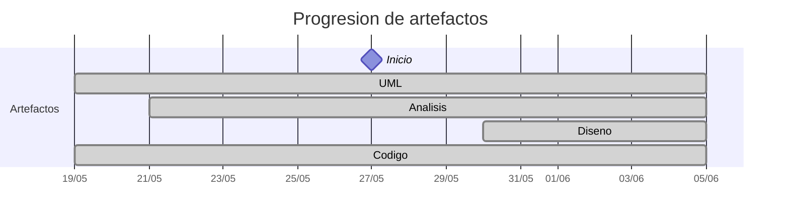

# Timeline - Pareyor

> Repo: [Pareyor/25-26-idsw2-sdVC](https://github.com/Pareyor/25-26-idsw2-sdVC)
> Commits: 99 | Días activos: 8 | Sesiones log: 23

## Patrón observado

| Métrica | Valor |
|---|---|
| Commits propios | 99 (71 feat / 22 fix / 6 other) |
| Ratio fix/feat | 0.30 |
| Días activos | 8 |
| Sesiones documentadas | 23 |
| Días log+commits | 8 |
| Días solo log | 8 |
| Días solo commits | 0 |
| Sesiones sin fecha en log | 1 |

## Trazabilidad por caso de uso

| Caso de uso | D-5 | D-4 | D-3 | D-2 | D-1 | D0 | D1 | D2 | D4 | D5 | D8 | D10 |
|---|:---:|:---:|:---:|:---:|:---:|:---:|:---:|:---:|:---:|:---:|:---:|:---:|
| `corregirExamenes` | A |   |   |   |   |   |   |   |   |   |   |   |
| `exportarConfiguracionGlobal` | A |   |   |   |   |   |   |   |   |   |   |   |
| `generarExamenes` | A |   |   |   |   |   |   |   |   |   |   |   |
| `importarAlumnos` | A |   |   |   |   |   |   |   |   |   |   |   |
| `importarConfiguracionGlobal` | A |   |   |   |   |   |   |   |   |   |   |   |
| `asignarExamenes` |   | A |   |   |   |   |   |   |   |   |   |   |
| `crearPregunta` |   | A |   |   |   |   |   |   |   |   | D |   |
| `exportarAlumnos` |   | A |   |   |   |   |   |   |   |   |   |   |
| `exportarPreguntas` |   | A |   |   |   |   |   |   |   |   |   |   |
| `importarPreguntas` |   | A |   |   |   |   |   |   |   |   |   |   |
| `crearAlumno` |   |   | A |   |   |   |   |   |   |   | D |   |
| `crearDocente` |   |   | A |   |   |   |   |   |   |   | D |   |
| `editarAsignatura` |   |   | A |   |   |   |   |   |   |   | D |   |
| `editarDocente` |   |   | A |   |   |   |   |   |   |   | D |   |
| `editarPregunta` |   |   | A |   |   |   |   |   |   |   | D |   |
| `crearAsignatura` |   |   |   | A |   |   |   |   |   |   | D |   |
| `crearGrado` |   |   |   | A |   |   |   |   |   |   | D |   |
| `editarAlumno` |   |   |   | A |   |   |   |   |   |   | D |   |
| `editarGrado` |   |   |   | A |   |   |   |   |   |   | D |   |
| `verPreguntas` |   |   |   | A |   |   |   |   |   | D |   |   |
| `eliminarPregunta` |   |   |   |   | A |   |   |   |   |   | D |   |
| `verAlumnos` |   |   |   |   | A |   |   |   |   | D |   |   |
| `verAsignaturas` |   |   |   |   | A |   |   |   |   | D |   |   |
| `verDocentes` |   |   |   |   | A |   |   |   |   | D |   |   |
| `verGrados` |   |   |   |   | A |   |   |   |   | D |   |   |
| `eliminarAlumno` |   |   |   |   |   | A |   |   |   |   | D |   |
| `eliminarAsignatura` |   |   |   |   |   | A |   |   |   |   | D |   |
| `eliminarDocente` |   |   |   |   |   | A |   |   |   |   | D |   |
| `eliminarGrado` |   |   |   |   |   | A |   |   |   |   | D |   |
| `iniciarSesion` |   |   |   |   |   | A |   |   | D |   |   |   |
| `cerrarSesion` |   |   |   |   |   |   | A |   | D |   |   |   |
| `completarGestion` |   |   |   |   |   |   | A |   | D |   |   |   |
| `crearRespuesta` |   |   |   |   |   |   | A |   |   |   |   | D |
| `verRespuestas` |   |   |   |   |   |   | A |   |   |   |   | D |
| `cancelarGeneracion` |   |   |   |   |   |   |   | A |   |   |   |   |
| `editarRespuesta` |   |   |   |   |   |   |   | A |   |   |   | D |
| `eliminarRespuesta` |   |   |   |   |   |   |   | A |   |   |   | D |
| `exportarAsignaturas` |   |   |   |   |   |   |   | A |   |   |   |   |
| `exportarGrados` |   |   |   |   |   |   |   | A |   |   |   |   |
| `importarAsignaturas` |   |   |   |   |   |   |   | A |   |   |   |   |
| `importarGrados` |   |   |   |   |   |   |   | A |   |   |   |   |

---

## Día -6 · 2026-05-20

### 💬 Conversation-log (1 sesión)

- Sesión 1: [17:38]

> ⚠️ Log sin commits

---

## Día -5 · 2026-05-21

### 💬 Conversation-log (1 sesión)

- Sesión 2: Análisis de los 5 primeros casos de uso (MVC)

**Artefactos nuevos:** 🔍 

> ⚠️ Log sin commits

---

## Día -4 · 2026-05-22

### 💬 Conversation-log (1 sesión)

- Sesión 3: Análisis de los casos de uso 6-10 y refinamiento por prototipos

> ⚠️ Log sin commits

---

## Día -3 · 2026-05-23

### 💬 Conversation-log (1 sesión)

- Sesión 4: Análisis de Casos de Uso 11-15 y Estandarización de Estilo (MVC + Secuencia)

> ⚠️ Log sin commits

---

## Día -2 · 2026-05-24

### 💬 Conversation-log (1 sesión)

- Sesión 5: Análisis de Casos de Uso 16-20 y Alineación con Prototipos y Estilo Visual

> ⚠️ Log sin commits

---

## Día -1 · 2026-05-25

### 💬 Conversation-log (1 sesión)

- Sesión 6: Análisis de Casos de Uso 21-25 y Refinamiento de Estándares

> ⚠️ Log sin commits

---

## Día 0 · 2026-05-26

### 💬 Conversation-log (1 sesión)

- Sesión 7: Análisis de Casos de Uso 26-30 y Refinamiento de Flujos

> ⚠️ Log sin commits

---

## Día 1 · 2026-05-27

### 💬 Conversation-log (1 sesión)

- Sesión 8: Análisis de Casos de Uso 31-34 y Refinamiento de Navegación y Sesión

> ⚠️ Log sin commits

---

## Día 2 · 2026-05-28

### Commits (8: 7 feat / 1 fix)

| Hora | Mensaje |
|---|---|
| 22:02 | [feat: Actualiza y agrega la nueva sesión con la IA, etapa de análisis finalizada.](https://github.com/Pareyor/25-26-idsw2-sdVC/commit/1c3083bba3a6def8f45fd60b64670dec0a47191a) |
| 21:58 | [feat: Análisis de exportarGrados](https://github.com/Pareyor/25-26-idsw2-sdVC/commit/205669937f321d705540755bb7d710be2e5de64d) |
| 21:55 | [feat: Análisis exportarAsignaturas](https://github.com/Pareyor/25-26-idsw2-sdVC/commit/4a01122946f6900c0495b4d82c52a2f40714d370) |
| 21:49 | [feat: Análisis importarGrados](https://github.com/Pareyor/25-26-idsw2-sdVC/commit/a02653b9606eca23f03cfec0e6ca5421c54a2d30) |
| 21:46 | [feat: Análisis importarAsignaturas](https://github.com/Pareyor/25-26-idsw2-sdVC/commit/dd7d5b0e87c2226c61248e33308124c6a9e2ba93) |
| 21:41 | [fix: corrige pequeño fallo en cancelarGeneración](https://github.com/Pareyor/25-26-idsw2-sdVC/commit/544e99dcc42e3ab45c40b9a86a62d406876ba96f) |
| 21:37 | [feat: Análisis cancelarGeneracion](https://github.com/Pareyor/25-26-idsw2-sdVC/commit/60aaf45dd30c47a5b83050a48431c0c3f0e75790) |
| 21:10 | [feat: Análisis de editarAsignatura y eliminarAsignatura](https://github.com/Pareyor/25-26-idsw2-sdVC/commit/3db6b88ee02da2b86b41a4b7c19f8e99ea176da4) |

### 💬 Conversation-log (1 sesión)

- Sesión 9: Finalización del Análisis de los 41 Casos de Uso

> 💬 + commits = proceso documentado

---

## Día 4 · 2026-05-30

### Commits (13: 10 feat / 3 fix)

| Hora | Mensaje |
|---|---|
| 20:12 | [feat: Nueva sesión con la IA](https://github.com/Pareyor/25-26-idsw2-sdVC/commit/93b2235f5c400a9ce6f0de5fd768092ff1f12c4a) |
| 19:41 | [feat: implementación de cerrarSesion](https://github.com/Pareyor/25-26-idsw2-sdVC/commit/09dcea41ac9dcb4c23ef4f2c0c512a448c30b50a) |
| 19:36 | [fix: Corrige fragmentos de código para que lea las credenciales y se muestre el panel de opciones](https://github.com/Pareyor/25-26-idsw2-sdVC/commit/b343b0ff0960c8a87c09677229453df81299722f) |
| 19:16 | [fix: corrige la falta de opciones en el menu del caso de uso completarGestion](https://github.com/Pareyor/25-26-idsw2-sdVC/commit/e261d503df14e8f9b653c456c8b7c424a0e6ab8c) |
| 18:58 | [feat: implementa completarGestion](https://github.com/Pareyor/25-26-idsw2-sdVC/commit/67174d10e308017a2559e83da886ce3c43ecc407) |
| 18:46 | [feat: Imagen del diseño de completarGestion](https://github.com/Pareyor/25-26-idsw2-sdVC/commit/3e7d5724c578a6640acc5dc37d1b633de1982444) |
| 18:39 | [feat: Diseño completarGestion e implementa .gitignore para manejar los archivos que se suben a github](https://github.com/Pareyor/25-26-idsw2-sdVC/commit/c374df11bbce800d87c7e796abc392976a75244c) |
| 17:34 | [feat: agrega nueva sesion y conversacion con el agente IA](https://github.com/Pareyor/25-26-idsw2-sdVC/commit/e55c6024a142bc03b5a57f3efb4f043b7f8b64c7) |
| 17:28 | [feat: primeros pasos de inicializacion del backend y frontend, implementa también prueba de iniciarSesion](https://github.com/Pareyor/25-26-idsw2-sdVC/commit/387aa86bf5c4c1840e1661374b2bb616e9cfb095) |
| 16:10 | [fix: corrige detalles en protocolos de diseño](https://github.com/Pareyor/25-26-idsw2-sdVC/commit/88bea6bac18658db7b427c6ce7055762ba5e6d97) |
| 16:00 | [feat: Diseño de cerrarSesion](https://github.com/Pareyor/25-26-idsw2-sdVC/commit/dd0f82a127196e4c13b28dcdcf2b67fd66f0541d) |
| 15:50 | [feat: Diseño iniciarSesion y cambio de directorio de las imágenes de análisis](https://github.com/Pareyor/25-26-idsw2-sdVC/commit/b4328312e22f402701ef0b52b95834544ac3ec25) |
| 11:47 | [feat: Implementa READme.md para definir las herramientas para el protocolo de diseño](https://github.com/Pareyor/25-26-idsw2-sdVC/commit/a1cfa670988fc137de149ad7b0ff5cd4ea649262) |

### 💬 Conversation-log (2 sesiónes)

- Sesión 10: Diseño de Autenticación e Inicialización del Entorno de Desarrollo
- Sesión 11: Diseño y Desarrollo de Completar Gestión y Logout

**Artefactos nuevos:** 🧩 

> 💬 + commits = proceso documentado

---

## Día 5 · 2026-05-31

### Commits (8: 6 feat / 2 fix)

| Hora | Mensaje |
|---|---|
| 23:20 | [feat: Nueva conversacion con la IA y sesión registrada en conversation-log.md](https://github.com/Pareyor/25-26-idsw2-sdVC/commit/2e9c3bea61631622d31fa57876d73e8e28123e0a) |
| 23:13 | [fix: Corrige imagen del diseño de verPreguntas](https://github.com/Pareyor/25-26-idsw2-sdVC/commit/575287d56986b398aa496404918c97869162ad8d) |
| 23:13 | [feat: Acepta diseño de verPreguntas](https://github.com/Pareyor/25-26-idsw2-sdVC/commit/6c4008a7ca0b67d8e5604e3cab4a7c65bc9f59fd) |
| 23:06 | [feat: Acepta diseño de verAlumnos](https://github.com/Pareyor/25-26-idsw2-sdVC/commit/ad64988d837ab6a97de5faaac7a24b59bf62b3cb) |
| 23:03 | [fix: Corrige aspecto en verAsignatura para asegurar la legibilidad del diagrama de secuencia](https://github.com/Pareyor/25-26-idsw2-sdVC/commit/25f98fb176486cb6c912e4cd08a80572db9c021e) |
| 23:00 | [feat: diseño de verAsignaturas](https://github.com/Pareyor/25-26-idsw2-sdVC/commit/b9b2483d379e503b75655648de0d4d613044921b) |
| 22:54 | [feat: Acepta diseño de verGrados](https://github.com/Pareyor/25-26-idsw2-sdVC/commit/2b5ac286ae61bcbbbe4edab620ead43c81907a84) |
| 22:44 | [feat: Acepta diseño de verDocentes](https://github.com/Pareyor/25-26-idsw2-sdVC/commit/532a8b3e27379f3f2f32815bcdf2093915de9d7e) |

### 💬 Conversation-log (1 sesión)

- Sesión 12: Diseño de Módulos del Dashboard y Refinamiento del Entorno

> 💬 + commits = proceso documentado

---

## Día 6 · 2026-06-01

### Commits (5: 3 feat / 1 fix)

| Hora | Mensaje |
|---|---|
| 13:31 | [feat: nueva conversación y sesión con la IA](https://github.com/Pareyor/25-26-idsw2-sdVC/commit/aec1667e440908ba0d86865d5af6d9bc466b169e) |
| 13:25 | [feat: Implementación de verGrados](https://github.com/Pareyor/25-26-idsw2-sdVC/commit/65f8643d623ac448b80ff18de0500dd4a9299fc7) |
| 13:20 | [chore: eliminar carpetas target del seguimiento de git](https://github.com/Pareyor/25-26-idsw2-sdVC/commit/25547957f57f0b28374f8657996210ea45a256e2) |
| 13:15 | [fix: Corrección final en verDocentes que dejaba la pantalla en blanco por fallo con los tokens y exportaciones de tipos.](https://github.com/Pareyor/25-26-idsw2-sdVC/commit/09e577e3838ae03707f0bc054f8bf8625b0ac1f5) |
| 13:12 | [feat: Implementación de verDocentes](https://github.com/Pareyor/25-26-idsw2-sdVC/commit/a04f89a1077e5147ad4aabbec4a4e03f72461263) |

### 💬 Conversation-log (1 sesión)

- Sesión 13: Implementación de verDocentes, verGrados y Estabilización del Entorno

> 💬 + commits = proceso documentado

---

## Día 7 · 2026-06-02

### Commits (5: 4 feat / 1 fix)

| Hora | Mensaje |
|---|---|
| 21:48 | [feat: Nueva sesión con la IA (conversation-log actualizado) y conversación exportada.](https://github.com/Pareyor/25-26-idsw2-sdVC/commit/bd8b83f6fa6404c5607da981426125d1e61e4ff7) |
| 21:41 | [feat: Desarrollo de verPreguntas](https://github.com/Pareyor/25-26-idsw2-sdVC/commit/5d0ef0c8d3414a327e6b037aa0d8939c0583f96b) |
| 21:34 | [feat: implementación de verAlumnos](https://github.com/Pareyor/25-26-idsw2-sdVC/commit/7f9bb662646d1dacb90169fd3fca7dc0efb50a12) |
| 21:26 | [fix: Gorrige el filtro de verGrados y verAsignaturas para que puedes buscar y no tenga en cuenta las tildes, mayúsculas,...](https://github.com/Pareyor/25-26-idsw2-sdVC/commit/38328621eaac6fe096234fb0509e599061953c77) |
| 21:22 | [feat: Acepta la implementación de verAsignaturaa](https://github.com/Pareyor/25-26-idsw2-sdVC/commit/1b6c02b8e4f2a08b84341b5e8931dcd55a41ca57) |

### 💬 Conversation-log (1 sesión)

- Sesión 14: Implementación de verAsignaturas, verAlumnos, verPreguntas y Optimización de Búsqueda

> 💬 + commits = proceso documentado

---

## Día 8 · 2026-06-03

### Commits (25: 19 feat / 5 fix)

| Hora | Mensaje |
|---|---|
| 19:48 | [feat: Nueva sesión y conversación con la IA](https://github.com/Pareyor/25-26-idsw2-sdVC/commit/fbbf7d24d12ee270c406f6a2495408b111d75e9b) |
| 19:41 | [feat&fix: Acepta el diseño de eliminarPregunta y corrige crearAsignatura y editarAsignatura para añadir el paso por GradoService](https://github.com/Pareyor/25-26-idsw2-sdVC/commit/13deb7d3d911700e58febddfdceb932976f67f3b) |
| 19:25 | [fix: Corrige crearPregunta para añadir AsignaturaService antes de AsignaturaRepository](https://github.com/Pareyor/25-26-idsw2-sdVC/commit/5d8de5026559f9e1e10a2c8313b1a050f0074c11) |
| 19:20 | [fix: corrige crearAlumno, editarAlumno y editarPregunta para añadir el estado intermedio de AsignaturaService para preguntas y GradoService para alumnos](https://github.com/Pareyor/25-26-idsw2-sdVC/commit/5f63edec0f4d7a3dd31d8cacf00c098aebfe960f) |
| 18:59 | [feat: Diseño de crearPregunta](https://github.com/Pareyor/25-26-idsw2-sdVC/commit/98c90601bdd3d26d233e82e40653450efaaca702) |
| 18:54 | [feat: Nueva sesión y conversación con la IA](https://github.com/Pareyor/25-26-idsw2-sdVC/commit/fb5b440ddf975e729420f90eaa55b97c04eeb9b7) |
| 18:48 | [feat: Diseño de eliminarAlumno](https://github.com/Pareyor/25-26-idsw2-sdVC/commit/09622012096a6864923b0044e5a3b23f4c6ed8b3) |
| 18:41 | [feat: diseño de editarAlumno](https://github.com/Pareyor/25-26-idsw2-sdVC/commit/fcd0f26be29f154f0398d4302513a2b2b824f283) |
| 18:36 | [feat: Diseño de crearAlumno](https://github.com/Pareyor/25-26-idsw2-sdVC/commit/24247652eaebd097e3394f8964a8b61679f8a840) |
| 13:28 | [feat: Nueva sesión y conversación](https://github.com/Pareyor/25-26-idsw2-sdVC/commit/27541d7048aec83f1c419cfcfa9f64b40dbba697) |
| 13:23 | [feat: diseño de eliminarAsignatura](https://github.com/Pareyor/25-26-idsw2-sdVC/commit/fef56d3275bf1870c1dd41d11d9320c4f78bbe71) |
| 13:20 | [feat: Diseño de editarAsignatura](https://github.com/Pareyor/25-26-idsw2-sdVC/commit/23bb2dd601a6839f854b48a4870c04357d1f4eff) |
| 13:12 | [feta: acepta diseño de crearAsignatura](https://github.com/Pareyor/25-26-idsw2-sdVC/commit/e066145dc133632878386033d6c3a41251cac928) |
| 12:49 | [fix: Corrige el nombre de las conversaciones con la IA](https://github.com/Pareyor/25-26-idsw2-sdVC/commit/8de783a1fc8e4f2ded9ecda9cbe5ffbb9811b6b8) |
| 12:45 | [feat: Nueva sesión](https://github.com/Pareyor/25-26-idsw2-sdVC/commit/ef78ee9bf4c6ce6dcdbc51c52076dd779d9d08b4) |
| 12:45 | [feat: Nueva sesión](https://github.com/Pareyor/25-26-idsw2-sdVC/commit/f415a25af6d220511607b01ef7d807157433ece0) |
| 12:41 | [feat: diseño de eliminarGrado](https://github.com/Pareyor/25-26-idsw2-sdVC/commit/85559237f08d98e086bf77023a0386253a1c1c4a) |
| 12:36 | [feat: Diseño de editarGrado](https://github.com/Pareyor/25-26-idsw2-sdVC/commit/21362d12dd9f8fdfd9db708deab5d4d58f8795aa) |
| 12:29 | [feat: Diseño de crearGrado](https://github.com/Pareyor/25-26-idsw2-sdVC/commit/8783cb82af0f9623bfaf6d193a17d137364f38da) |
| 12:24 | [fix: Corrige nombre de las conversaciones exportadas](https://github.com/Pareyor/25-26-idsw2-sdVC/commit/7022b14839a494169156dc8c68f96d1ee3e52d1b) |
| 12:18 | [feat: Nueva sesión con el agente IA](https://github.com/Pareyor/25-26-idsw2-sdVC/commit/3953dccc6a2fe14e9949edc3479505bdaefa703e) |
| 12:08 | [feat: Diseño del caso de uso eliminarDocente](https://github.com/Pareyor/25-26-idsw2-sdVC/commit/4b6cc49bfc1ef38e991ebdae5c54219aebdd63c0) |
| 12:04 | [feat: Acepta el diseño de editarDocente](https://github.com/Pareyor/25-26-idsw2-sdVC/commit/3097dbeb024e58d9708816cca5e52170bb2dba77) |
| 12:01 | [fix: Corrige diagrama de secuencia en verDocente y crearDocente y corrige ubicación de las imágenes de verPreguntas y verAlumnos](https://github.com/Pareyor/25-26-idsw2-sdVC/commit/5d818a067fbf93158cf08025fbef4f3cfb9bbf63) |
| 11:48 | [feat: Diseño de crearDocente](https://github.com/Pareyor/25-26-idsw2-sdVC/commit/944e4bcd4c61ac7be880e47080cd12014bc020ef) |

### 💬 Conversation-log (5 sesiónes)

- Sesión 15: Diseño del Módulo de Gestión de Docentes (CRUD)
- Sesión 16: Diseño del Módulo de Gestión de Grados (CRUD)
- Sesión 17: Diseño del Módulo de Gestión de Asignaturas (CRUD)
- Sesión 18: Diseño del Módulo de Gestión de Alumnos (CRUD)
- Sesión 19: Diseño del Módulo de Gestión de Preguntas-Respuestas (CRUD)

> 💬 + commits = proceso documentado

---

## Día 9 · 2026-06-04

### Commits (13: 10 feat / 3 fix)

| Hora | Mensaje |
|---|---|
| 17:40 | [feat&docs: Añade nueva conversación con la IA y actualiza la documentación de conversation-log.md](https://github.com/Pareyor/25-26-idsw2-sdVC/commit/c5da2178490cede47acb12e684fd7e90a45d4760) |
| 17:30 | [feat: Desarrollo de eliminarAsignatura](https://github.com/Pareyor/25-26-idsw2-sdVC/commit/61675b19238309c799986fb7fe6151bd76696209) |
| 17:27 | [feat: desarrollo de crearAsignatura](https://github.com/Pareyor/25-26-idsw2-sdVC/commit/823cbec53da1b6c2dda7ab52a775aee059c15d78) |
| 17:18 | [fix: Corrige fallo en crearAsignatura, usaba DOCENTE en vez de ROLE_DOCENTE para dar permisos y no podía realizar bien la petición GET](https://github.com/Pareyor/25-26-idsw2-sdVC/commit/7807e917551c13a5687ef04613a66501bc03f9fa) |
| 16:45 | [feat: Desarrollo de crearAsignatura](https://github.com/Pareyor/25-26-idsw2-sdVC/commit/5b7fce8d0d9b1bc722890818e63d6029ea2a3e70) |
| 16:40 | [feat: Desarrollo de eliminarGrado](https://github.com/Pareyor/25-26-idsw2-sdVC/commit/1af84fe43293010cddfdeb8598890747ced535e4) |
| 16:37 | [feat: Desarrollo de editarGrado](https://github.com/Pareyor/25-26-idsw2-sdVC/commit/f243dd36ad89eaaa7bcae35154f3e00988c49e9f) |
| 16:32 | [fix: Corrige la falta de un import que hacía que no reconociese la lógica de crearGrado](https://github.com/Pareyor/25-26-idsw2-sdVC/commit/e489ca8af7256f377d5499d89aa92dae55d19503) |
| 16:30 | [feat: desarrollo de crearGrado](https://github.com/Pareyor/25-26-idsw2-sdVC/commit/f67450f751b6936c30b13ae71615f3181855a797) |
| 16:29 | [feat: desarrollo de eliminarDocente](https://github.com/Pareyor/25-26-idsw2-sdVC/commit/d0ea9fa70b58e2d790c128e35cfd495cdbe50cff) |
| 16:20 | [fix: Corrige fallo en el desarrollo de editarDocente que no dejaba acceder al panel de edición por código duplicado](https://github.com/Pareyor/25-26-idsw2-sdVC/commit/d2130ace33886154d9a1018bcaf0e666a02913ad) |
| 16:15 | [feat: desarrollo de editarDocente](https://github.com/Pareyor/25-26-idsw2-sdVC/commit/591b74b0aa27f6c5b0621d77d422d8227fc44249) |
| 16:09 | [feat: desarrollo de crearDocente](https://github.com/Pareyor/25-26-idsw2-sdVC/commit/00206d99daa674f1051cc25865dd0386788c26ec) |

### 💬 Conversation-log (1 sesión)

- Sesión 20: Implementación CRUD Módulo Asignaturas

> 💬 + commits = proceso documentado

---

## Día 10 · 2026-06-05

### Commits (22: 12 feat / 6 fix)

| Hora | Mensaje |
|---|---|
| 18:03 | [docs: Nueva conversación con la IA y actualiza el conversation-log](https://github.com/Pareyor/25-26-idsw2-sdVC/commit/7523e2538c094b7277f526f7003f5a861957cef7) |
| 17:57 | [feat: Desarrollo de eliminarPregunta, con esto se finaliza el modulo preguntas/respuestas](https://github.com/Pareyor/25-26-idsw2-sdVC/commit/a99f6f1f47a756ccf09c3d8bf909d1830cd1b56c) |
| 17:42 | [feat: Desarrollo de editarRespuesta](https://github.com/Pareyor/25-26-idsw2-sdVC/commit/ce9453a8e535be22b6280c6447640e2511dcc558) |
| 17:41 | [fix: corrige fallo en eliminarPregunta](https://github.com/Pareyor/25-26-idsw2-sdVC/commit/7c9aacf56a17ff864499ccea0968c41a1d2e7d87) |
| 17:21 | [feat: Desarrollo de eliminarPregunta](https://github.com/Pareyor/25-26-idsw2-sdVC/commit/792f9f7610d6a91d657f0e0207e0235b6a8663d9) |
| 17:18 | [feat: Desarrollo de editarPregunta](https://github.com/Pareyor/25-26-idsw2-sdVC/commit/fe0caed387a7abde2a4ca2ff6c6ec13c50b7d723) |
| 17:00 | [feat: Desarrollo de crearPregunta](https://github.com/Pareyor/25-26-idsw2-sdVC/commit/f51be0b807eb78e6a98620c123c79c59bd25ec87) |
| 16:04 | [docs: Nueva sesión con la IA, sesión 22](https://github.com/Pareyor/25-26-idsw2-sdVC/commit/fd6845367feb9ecbb0925562cb5d098a19d41260) |
| 15:56 | [feat: Acepta el diseño de eliminarRespuesta](https://github.com/Pareyor/25-26-idsw2-sdVC/commit/f0be7ec5b0931e3fbe2f6595627a9d75e81eb7d3) |
| 15:53 | [feat: Acepta el diseño de editarRespuesta](https://github.com/Pareyor/25-26-idsw2-sdVC/commit/57207ffe1b1acedfe54425cdb7629a007ec6a35e) |
| 15:48 | [fix: Corrige verRespuestas para reducir el tamaño del diagrama de secuencia](https://github.com/Pareyor/25-26-idsw2-sdVC/commit/871c97ff44cc90b66952805664ff65b860accacd) |
| 15:40 | [feat: Diseño de crearRespuesta](https://github.com/Pareyor/25-26-idsw2-sdVC/commit/c594c42bb4e5bc3a31e482baa9040423f2bb5076) |
| 15:33 | [feat: Diseño de verRespuestas](https://github.com/Pareyor/25-26-idsw2-sdVC/commit/0f8d5de98af8f259dadc53f5d2154a198f99c96e) |
| 12:53 | [docs: Añade nueva sesion con la IA](https://github.com/Pareyor/25-26-idsw2-sdVC/commit/0af9b729f766e9b875ddee91a71ef4817070dbdd) |
| 12:53 | [docs: Añade la nueva documentación de la sesión 21 con la IA](https://github.com/Pareyor/25-26-idsw2-sdVC/commit/78fe29eb19432ab15da1629ca60ac269fe348d51) |
| 12:32 | [feat: Desarrollo de eliminarAlumno](https://github.com/Pareyor/25-26-idsw2-sdVC/commit/ab3ed392996ce1bd2ed8f3cf0ae8331a514fdf60) |
| 12:27 | [fix: Corrige el filtro de búsqueda de el módulo alumno que no había actualizado el cambio de NIU por DNI](https://github.com/Pareyor/25-26-idsw2-sdVC/commit/9120b6aa01bdb1f06ed7f979d14ad87fb2587b2f) |
| 12:20 | [feat: Desarrollo de editarAlumno](https://github.com/Pareyor/25-26-idsw2-sdVC/commit/cdd1db7665d32e56c944860578e623b4d05277e3) |
| 12:10 | [fix: Corrige datos esenciales para crearAlumnos, la IA solicitaba el NIU en vez de DNI o NIE.](https://github.com/Pareyor/25-26-idsw2-sdVC/commit/945d6a67c024f7712e2421ff4fcb3eb2ad9ed88e) |
| 11:55 | [fix: Corrige la implementación de crearAlumno, al entrar en contacto con la base de datos no se reconocía el contenedor del docker.](https://github.com/Pareyor/25-26-idsw2-sdVC/commit/9e7c18873f99108cfd1bd8b8800a77acc3e7a92f) |
| 11:15 | [feat: Desarrollo de crearAlumno](https://github.com/Pareyor/25-26-idsw2-sdVC/commit/756a41308b8c2e8084fc508d5316e7fe891343d6) |
| 11:03 | [fix: Corrige enlace directo a la conversacion de la sesión 17](https://github.com/Pareyor/25-26-idsw2-sdVC/commit/d3e874bfe8a0d1e3d9fe3fa8b9f5b9118f55cd4d) |

### 💬 Conversation-log (2 sesiónes)

- Sesión 21: Implementación CRUD Módulo Alumnos y Refactor DNI
- Sesión 22: Diseño del Módulo de Gestión de Preguntas y Respuestas (CRUD)

> 💬 + commits = proceso documentado

---

