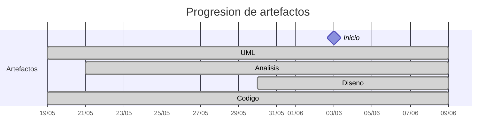

# Timeline - Pareyor

> Repo: [Pareyor/25-26-idsw2-sdVC](https://github.com/Pareyor/25-26-idsw2-sdVC)
> Commits: 99 | Días activos: 7 | Sesiones log: 17

## Patrón observado

| Métrica | Valor |
|---|---|
| Commits propios | 99 (55 feat / 23 fix / 21 other) |
| Ratio fix/feat | 0.41 |
| Días activos | 7 |
| Sesiones documentadas | 17 |
| Días log+commits | 6 |
| Días solo log | 1 |
| Días solo commits | 1 |

<!-- trazabilidad: manual -->
## Trazabilidad por caso de uso

| Caso de uso |  D-12  |  D-11  |  D-10  |  D-9  |  D-8  |  D-7  |  D-6  |  D-5  |  D-3  |  D-2  |  D1  |  D3  |  D4  |
|---|:---:|:---:|:---:|:---:|:---:|:---:|:---:|:---:|:---:|:---:|:---:|:---:|:---:|
| `corregirExamenes` | [A](https://github.com/Pareyor/25-26-idsw2-sdVC/tree/main/documents/analisis/corregirExamenes) |     |     |     |     |     |     |     |     |     |     |     | [D](https://github.com/Pareyor/25-26-idsw2-sdVC/tree/main/documents/dise%C3%B1o/corregirExamenes) |
| `exportarConfiguracionGlobal` | [A](https://github.com/Pareyor/25-26-idsw2-sdVC/tree/main/documents/analisis/exportarConfiguracionGlobal) |     |     |     |     |     |     |     |     |     |     |     | [D](https://github.com/Pareyor/25-26-idsw2-sdVC/tree/main/documents/dise%C3%B1o/exportarConfiguracionGlobal) |
| `generarExamenes` | [A](https://github.com/Pareyor/25-26-idsw2-sdVC/tree/main/documents/analisis/generarExamenes) |     |     |     |     |     |     |     |     |     |     |     | [D](https://github.com/Pareyor/25-26-idsw2-sdVC/tree/main/documents/dise%C3%B1o/generarExamenes) |
| `importarConfiguracionGlobal` | [A](https://github.com/Pareyor/25-26-idsw2-sdVC/tree/main/documents/analisis/importarConfiguracionGlobal) |     |     |     |     |     |     |     |     |     |     |     | [D](https://github.com/Pareyor/25-26-idsw2-sdVC/tree/main/documents/dise%C3%B1o/importarConfiguracionGlobal) |
| `asignarExamenes` |     | [A](https://github.com/Pareyor/25-26-idsw2-sdVC/tree/main/documents/analisis/asignarExamenes) |     |     |     |     |     |     |     |     |     |     | [D](https://github.com/Pareyor/25-26-idsw2-sdVC/tree/main/documents/dise%C3%B1o/asignarExamenes) |
| `crearPregunta` |     | [A](https://github.com/Pareyor/25-26-idsw2-sdVC/tree/main/documents/analisis/crearPregunta) |     |     |     |     |     |     |     |     | [D](https://github.com/Pareyor/25-26-idsw2-sdVC/tree/main/documents/dise%C3%B1o/crearPregunta) |     |     |
| `crearAlumno` |     |     | [A](https://github.com/Pareyor/25-26-idsw2-sdVC/tree/main/documents/analisis/crearAlumno) |     |     |     |     |     |     |     | [D](https://github.com/Pareyor/25-26-idsw2-sdVC/tree/main/documents/dise%C3%B1o/crearAlumno) |     |     |
| `crearDocente` |     |     | [A](https://github.com/Pareyor/25-26-idsw2-sdVC/tree/main/documents/analisis/crearDocente) |     |     |     |     |     |     |     | [D](https://github.com/Pareyor/25-26-idsw2-sdVC/tree/main/documents/dise%C3%B1o/crearDocente) |     |     |
| `editarAsignatura` |     |     | [A](https://github.com/Pareyor/25-26-idsw2-sdVC/tree/main/documents/analisis/editarAsignatura) |     |     |     |     |     |     |     | [D](https://github.com/Pareyor/25-26-idsw2-sdVC/tree/main/documents/dise%C3%B1o/editarAsignatura) |     |     |
| `editarDocente` |     |     | [A](https://github.com/Pareyor/25-26-idsw2-sdVC/tree/main/documents/analisis/editarDocente) |     |     |     |     |     |     |     | [D](https://github.com/Pareyor/25-26-idsw2-sdVC/tree/main/documents/dise%C3%B1o/editarDocente) |     |     |
| `editarPregunta` |     |     | [A](https://github.com/Pareyor/25-26-idsw2-sdVC/tree/main/documents/analisis/editarPregunta) |     |     |     |     |     |     |     | [D](https://github.com/Pareyor/25-26-idsw2-sdVC/tree/main/documents/dise%C3%B1o/editarPregunta) |     |     |
| `crearAsignatura` |     |     |     | [A](https://github.com/Pareyor/25-26-idsw2-sdVC/tree/main/documents/analisis/crearAsignatura) |     |     |     |     |     |     | [D](https://github.com/Pareyor/25-26-idsw2-sdVC/tree/main/documents/dise%C3%B1o/crearAsignatura) |     |     |
| `crearGrado` |     |     |     | [A](https://github.com/Pareyor/25-26-idsw2-sdVC/tree/main/documents/analisis/crearGrado) |     |     |     |     |     |     | [D](https://github.com/Pareyor/25-26-idsw2-sdVC/tree/main/documents/dise%C3%B1o/crearGrado) |     |     |
| `editarAlumno` |     |     |     | [A](https://github.com/Pareyor/25-26-idsw2-sdVC/tree/main/documents/analisis/editarAlumno) |     |     |     |     |     |     | [D](https://github.com/Pareyor/25-26-idsw2-sdVC/tree/main/documents/dise%C3%B1o/editarAlumno) |     |     |
| `editarGrado` |     |     |     | [A](https://github.com/Pareyor/25-26-idsw2-sdVC/tree/main/documents/analisis/editarGrado) |     |     |     |     |     |     | [D](https://github.com/Pareyor/25-26-idsw2-sdVC/tree/main/documents/dise%C3%B1o/editarGrado) |     |     |
| `verPreguntas` |     |     |     | [A](https://github.com/Pareyor/25-26-idsw2-sdVC/tree/main/documents/analisis/verPreguntas) |     |     |     |     |     | [D](https://github.com/Pareyor/25-26-idsw2-sdVC/tree/main/documents/dise%C3%B1o/verPreguntas) |     |     |     |
| `eliminarPregunta` |     |     |     |     | [A](https://github.com/Pareyor/25-26-idsw2-sdVC/tree/main/documents/analisis/eliminarPregunta) |     |     |     |     |     | [D](https://github.com/Pareyor/25-26-idsw2-sdVC/tree/main/documents/dise%C3%B1o/eliminarPregunta) |     |     |
| `verAlumnos` |     |     |     |     | [A](https://github.com/Pareyor/25-26-idsw2-sdVC/tree/main/documents/analisis/verAlumnos) |     |     |     |     | [D](https://github.com/Pareyor/25-26-idsw2-sdVC/tree/main/documents/dise%C3%B1o/verAlumnos) |     |     |     |
| `verAsignaturas` |     |     |     |     | [A](https://github.com/Pareyor/25-26-idsw2-sdVC/tree/main/documents/analisis/verAsignaturas) |     |     |     |     | [D](https://github.com/Pareyor/25-26-idsw2-sdVC/tree/main/documents/dise%C3%B1o/verAsignaturas) |     |     |     |
| `verDocentes` |     |     |     |     | [A](https://github.com/Pareyor/25-26-idsw2-sdVC/tree/main/documents/analisis/verDocentes) |     |     |     |     | [D](https://github.com/Pareyor/25-26-idsw2-sdVC/tree/main/documents/dise%C3%B1o/verDocentes) |     |     |     |
| `verGrados` |     |     |     |     | [A](https://github.com/Pareyor/25-26-idsw2-sdVC/tree/main/documents/analisis/verGrados) |     |     |     |     | [D](https://github.com/Pareyor/25-26-idsw2-sdVC/tree/main/documents/dise%C3%B1o/verGrados) |     |     |     |
| `eliminarAlumno` |     |     |     |     |     | [A](https://github.com/Pareyor/25-26-idsw2-sdVC/tree/main/documents/analisis/eliminarAlumno) |     |     |     |     | [D](https://github.com/Pareyor/25-26-idsw2-sdVC/tree/main/documents/dise%C3%B1o/eliminarAlumno) |     |     |
| `eliminarAsignatura` |     |     |     |     |     | [A](https://github.com/Pareyor/25-26-idsw2-sdVC/tree/main/documents/analisis/eliminarAsignatura) |     |     |     |     | [D](https://github.com/Pareyor/25-26-idsw2-sdVC/tree/main/documents/dise%C3%B1o/eliminarAsignatura) |     |     |
| `eliminarDocente` |     |     |     |     |     | [A](https://github.com/Pareyor/25-26-idsw2-sdVC/tree/main/documents/analisis/eliminarDocente) |     |     |     |     | [D](https://github.com/Pareyor/25-26-idsw2-sdVC/tree/main/documents/dise%C3%B1o/eliminarDocente) |     |     |
| `eliminarGrado` |     |     |     |     |     | [A](https://github.com/Pareyor/25-26-idsw2-sdVC/tree/main/documents/analisis/eliminarGrado) |     |     |     |     | [D](https://github.com/Pareyor/25-26-idsw2-sdVC/tree/main/documents/dise%C3%B1o/eliminarGrado) |     |     |
| `iniciarSesion` |     |     |     |     |     | [A](https://github.com/Pareyor/25-26-idsw2-sdVC/tree/main/documents/analisis/iniciarSesion) |     |     | [D](https://github.com/Pareyor/25-26-idsw2-sdVC/tree/main/documents/dise%C3%B1o/iniciarSesion) |     |     |     |     |
| `cerrarSesion` |     |     |     |     |     |     | [A](https://github.com/Pareyor/25-26-idsw2-sdVC/tree/main/documents/analisis/cerrarSesion) |     | [D](https://github.com/Pareyor/25-26-idsw2-sdVC/tree/main/documents/dise%C3%B1o/cerrarSesion) |     |     |     |     |
| `completarGestion` |     |     |     |     |     |     | [A](https://github.com/Pareyor/25-26-idsw2-sdVC/tree/main/documents/analisis/completarGestion) |     | [D](https://github.com/Pareyor/25-26-idsw2-sdVC/tree/main/documents/dise%C3%B1o/completarGestion) |     |     |     |     |
| `crearRespuesta` |     |     |     |     |     |     | [A](https://github.com/Pareyor/25-26-idsw2-sdVC/tree/main/documents/analisis/crearRespuesta) |     |     |     |     | [D](https://github.com/Pareyor/25-26-idsw2-sdVC/tree/main/documents/dise%C3%B1o/crearRespuesta) |     |
| `verRespuestas` |     |     |     |     |     |     | [A](https://github.com/Pareyor/25-26-idsw2-sdVC/tree/main/documents/analisis/verRespuestas) |     |     |     |     | [D](https://github.com/Pareyor/25-26-idsw2-sdVC/tree/main/documents/dise%C3%B1o/verRespuestas) |     |
| `cancelarGeneracion` |     |     |     |     |     |     |     | [A](https://github.com/Pareyor/25-26-idsw2-sdVC/tree/main/documents/analisis/cancelarGeneracion) |     |     |     |     | [D](https://github.com/Pareyor/25-26-idsw2-sdVC/tree/main/documents/dise%C3%B1o/cancelarGeneracion) |
| `editarRespuesta` |     |     |     |     |     |     |     | [A](https://github.com/Pareyor/25-26-idsw2-sdVC/tree/main/documents/analisis/editarRespuesta) |     |     |     | [D](https://github.com/Pareyor/25-26-idsw2-sdVC/tree/main/documents/dise%C3%B1o/editarRespuesta) |     |
| `eliminarRespuesta` |     |     |     |     |     |     |     | [A](https://github.com/Pareyor/25-26-idsw2-sdVC/tree/main/documents/analisis/eliminarRespuesta) |     |     |     | [D](https://github.com/Pareyor/25-26-idsw2-sdVC/tree/main/documents/dise%C3%B1o/eliminarRespuesta) |     |

---

## Día -13 · 2026-05-20

### 💬 Conversation-log (2 sesiónes)

- Sesión 1: [17:38]
- Sesión 2: [18:00] Configuración Inicial y Estructura

> ⚠️ Log sin commits

---

## Día 1 · 2026-06-03

### Commits (24: 18 feat / 5 fix)

| Hora | Mensaje |
|---|---|
| 19:48 | [feat: Nueva sesión y conversación con la IA](https://github.com/Pareyor/25-26-idsw2-sdVC/commit/fbbf7d24d12ee270c406f6a2495408b111d75e9b) |
| 19:41 | [feat&fix: Acepta el diseño de eliminarPregunta y corrige crearAsignatura y editarAsignatura para añadir el paso por GradoService](https://github.com/Pareyor/25-26-idsw2-sdVC/commit/13deb7d3d911700e58febddfdceb932976f67f3b) |
| 19:25 | [fix: Corrige crearPregunta para añadir AsignaturaService antes de AsignaturaRepository](https://github.com/Pareyor/25-26-idsw2-sdVC/commit/5d8de5026559f9e1e10a2c8313b1a050f0074c11) |
| 19:20 | [fix: corrige crearAlumno, editarAlumno y editarPregunta para añadir el estado intermedio de AsignaturaService para preguntas y GradoService para alumnos](https://github.com/Pareyor/25-26-idsw2-sdVC/commit/5f63edec0f4d7a3dd31d8cacf00c098aebfe960f) |
| 18:59 | [feat: Diseño de crearPregunta](https://github.com/Pareyor/25-26-idsw2-sdVC/commit/98c90601bdd3d26d233e82e40653450efaaca702) |
| 18:54 | [feat: Nueva sesión y conversación con la IA](https://github.com/Pareyor/25-26-idsw2-sdVC/commit/fb5b440ddf975e729420f90eaa55b97c04eeb9b7) |
| 18:48 | [feat: Diseño de eliminarAlumno](https://github.com/Pareyor/25-26-idsw2-sdVC/commit/09622012096a6864923b0044e5a3b23f4c6ed8b3) |
| 18:41 | [feat: diseño de editarAlumno](https://github.com/Pareyor/25-26-idsw2-sdVC/commit/fcd0f26be29f154f0398d4302513a2b2b824f283) |
| 18:36 | [feat: Diseño de crearAlumno](https://github.com/Pareyor/25-26-idsw2-sdVC/commit/24247652eaebd097e3394f8964a8b61679f8a840) |
| 13:28 | [feat: Nueva sesión y conversación](https://github.com/Pareyor/25-26-idsw2-sdVC/commit/27541d7048aec83f1c419cfcfa9f64b40dbba697) |
| 13:23 | [feat: diseño de eliminarAsignatura](https://github.com/Pareyor/25-26-idsw2-sdVC/commit/fef56d3275bf1870c1dd41d11d9320c4f78bbe71) |
| 13:20 | [feat: Diseño de editarAsignatura](https://github.com/Pareyor/25-26-idsw2-sdVC/commit/23bb2dd601a6839f854b48a4870c04357d1f4eff) |
| 13:12 | [feta: acepta diseño de crearAsignatura](https://github.com/Pareyor/25-26-idsw2-sdVC/commit/e066145dc133632878386033d6c3a41251cac928) |
| 12:49 | [fix: Corrige el nombre de las conversaciones con la IA](https://github.com/Pareyor/25-26-idsw2-sdVC/commit/8de783a1fc8e4f2ded9ecda9cbe5ffbb9811b6b8) |
| 12:45 | [feat: Nueva sesión](https://github.com/Pareyor/25-26-idsw2-sdVC/commit/ef78ee9bf4c6ce6dcdbc51c52076dd779d9d08b4) |
| 12:45 | [feat: Nueva sesión](https://github.com/Pareyor/25-26-idsw2-sdVC/commit/f415a25af6d220511607b01ef7d807157433ece0) |
| 12:41 | [feat: diseño de eliminarGrado](https://github.com/Pareyor/25-26-idsw2-sdVC/commit/85559237f08d98e086bf77023a0386253a1c1c4a) |
| 12:36 | [feat: Diseño de editarGrado](https://github.com/Pareyor/25-26-idsw2-sdVC/commit/21362d12dd9f8fdfd9db708deab5d4d58f8795aa) |
| 12:29 | [feat: Diseño de crearGrado](https://github.com/Pareyor/25-26-idsw2-sdVC/commit/8783cb82af0f9623bfaf6d193a17d137364f38da) |
| 12:24 | [fix: Corrige nombre de las conversaciones exportadas](https://github.com/Pareyor/25-26-idsw2-sdVC/commit/7022b14839a494169156dc8c68f96d1ee3e52d1b) |
| 12:18 | [feat: Nueva sesión con el agente IA](https://github.com/Pareyor/25-26-idsw2-sdVC/commit/3953dccc6a2fe14e9949edc3479505bdaefa703e) |
| 12:08 | [feat: Diseño del caso de uso eliminarDocente](https://github.com/Pareyor/25-26-idsw2-sdVC/commit/4b6cc49bfc1ef38e991ebdae5c54219aebdd63c0) |
| 12:04 | [feat: Acepta el diseño de editarDocente](https://github.com/Pareyor/25-26-idsw2-sdVC/commit/3097dbeb024e58d9708816cca5e52170bb2dba77) |
| 12:01 | [fix: Corrige diagrama de secuencia en verDocente y crearDocente y corrige ubicación de las imágenes de verPreguntas y verAlumnos](https://github.com/Pareyor/25-26-idsw2-sdVC/commit/5d818a067fbf93158cf08025fbef4f3cfb9bbf63) |

> ⚠️ Commits sin entrada en log

---

## Día 2 · 2026-06-04

### Commits (13: 10 feat / 3 fix)

| Hora | Mensaje |
|---|---|
| 17:40 | [feat&docs: Añade nueva conversación con la IA y actualiza la documentación de conversation-log.md](https://github.com/Pareyor/25-26-idsw2-sdVC/commit/c5da2178490cede47acb12e684fd7e90a45d4760) |
| 17:30 | [feat: Desarrollo de eliminarAsignatura](https://github.com/Pareyor/25-26-idsw2-sdVC/commit/61675b19238309c799986fb7fe6151bd76696209) |
| 17:27 | [feat: desarrollo de crearAsignatura](https://github.com/Pareyor/25-26-idsw2-sdVC/commit/823cbec53da1b6c2dda7ab52a775aee059c15d78) |
| 17:18 | [fix: Corrige fallo en crearAsignatura, usaba DOCENTE en vez de ROLE_DOCENTE para dar permisos y no podía realizar bien la petición GET](https://github.com/Pareyor/25-26-idsw2-sdVC/commit/7807e917551c13a5687ef04613a66501bc03f9fa) |
| 16:45 | [feat: Desarrollo de crearAsignatura](https://github.com/Pareyor/25-26-idsw2-sdVC/commit/5b7fce8d0d9b1bc722890818e63d6029ea2a3e70) |
| 16:40 | [feat: Desarrollo de eliminarGrado](https://github.com/Pareyor/25-26-idsw2-sdVC/commit/1af84fe43293010cddfdeb8598890747ced535e4) |
| 16:37 | [feat: Desarrollo de editarGrado](https://github.com/Pareyor/25-26-idsw2-sdVC/commit/f243dd36ad89eaaa7bcae35154f3e00988c49e9f) |
| 16:32 | [fix: Corrige la falta de un import que hacía que no reconociese la lógica de crearGrado](https://github.com/Pareyor/25-26-idsw2-sdVC/commit/e489ca8af7256f377d5499d89aa92dae55d19503) |
| 16:30 | [feat: desarrollo de crearGrado](https://github.com/Pareyor/25-26-idsw2-sdVC/commit/f67450f751b6936c30b13ae71615f3181855a797) |
| 16:29 | [feat: desarrollo de eliminarDocente](https://github.com/Pareyor/25-26-idsw2-sdVC/commit/d0ea9fa70b58e2d790c128e35cfd495cdbe50cff) |
| 16:20 | [fix: Corrige fallo en el desarrollo de editarDocente que no dejaba acceder al panel de edición por código duplicado](https://github.com/Pareyor/25-26-idsw2-sdVC/commit/d2130ace33886154d9a1018bcaf0e666a02913ad) |
| 16:15 | [feat: desarrollo de editarDocente](https://github.com/Pareyor/25-26-idsw2-sdVC/commit/591b74b0aa27f6c5b0621d77d422d8227fc44249) |
| 16:09 | [feat: desarrollo de crearDocente](https://github.com/Pareyor/25-26-idsw2-sdVC/commit/00206d99daa674f1051cc25865dd0386788c26ec) |

### 💬 Conversation-log (2 sesiónes)

- Sesión 19: Diseño y Auditoría de Módulos CRUD
- Sesión 20: Implementación CRUD Módulo Asignaturas

> 💬 + commits = proceso documentado

---

## Día 3 · 2026-06-05

### Commits (22: 12 feat / 6 fix)

| Hora | Mensaje |
|---|---|
| 18:03 | [docs: Nueva conversación con la IA y actualiza el conversation-log](https://github.com/Pareyor/25-26-idsw2-sdVC/commit/7523e2538c094b7277f526f7003f5a861957cef7) |
| 17:57 | [feat: Desarrollo de eliminarPregunta, con esto se finaliza el modulo preguntas/respuestas](https://github.com/Pareyor/25-26-idsw2-sdVC/commit/a99f6f1f47a756ccf09c3d8bf909d1830cd1b56c) |
| 17:42 | [feat: Desarrollo de editarRespuesta](https://github.com/Pareyor/25-26-idsw2-sdVC/commit/ce9453a8e535be22b6280c6447640e2511dcc558) |
| 17:41 | [fix: corrige fallo en eliminarPregunta](https://github.com/Pareyor/25-26-idsw2-sdVC/commit/7c9aacf56a17ff864499ccea0968c41a1d2e7d87) |
| 17:21 | [feat: Desarrollo de eliminarPregunta](https://github.com/Pareyor/25-26-idsw2-sdVC/commit/792f9f7610d6a91d657f0e0207e0235b6a8663d9) |
| 17:18 | [feat: Desarrollo de editarPregunta](https://github.com/Pareyor/25-26-idsw2-sdVC/commit/fe0caed387a7abde2a4ca2ff6c6ec13c50b7d723) |
| 17:00 | [feat: Desarrollo de crearPregunta](https://github.com/Pareyor/25-26-idsw2-sdVC/commit/f51be0b807eb78e6a98620c123c79c59bd25ec87) |
| 16:04 | [docs: Nueva sesión con la IA, sesión 22](https://github.com/Pareyor/25-26-idsw2-sdVC/commit/fd6845367feb9ecbb0925562cb5d098a19d41260) |
| 15:56 | [feat: Acepta el diseño de eliminarRespuesta](https://github.com/Pareyor/25-26-idsw2-sdVC/commit/f0be7ec5b0931e3fbe2f6595627a9d75e81eb7d3) |
| 15:53 | [feat: Acepta el diseño de editarRespuesta](https://github.com/Pareyor/25-26-idsw2-sdVC/commit/57207ffe1b1acedfe54425cdb7629a007ec6a35e) |
| 15:48 | [fix: Corrige verRespuestas para reducir el tamaño del diagrama de secuencia](https://github.com/Pareyor/25-26-idsw2-sdVC/commit/871c97ff44cc90b66952805664ff65b860accacd) |
| 15:40 | [feat: Diseño de crearRespuesta](https://github.com/Pareyor/25-26-idsw2-sdVC/commit/c594c42bb4e5bc3a31e482baa9040423f2bb5076) |
| 15:33 | [feat: Diseño de verRespuestas](https://github.com/Pareyor/25-26-idsw2-sdVC/commit/0f8d5de98af8f259dadc53f5d2154a198f99c96e) |
| 12:53 | [docs: Añade nueva sesion con la IA](https://github.com/Pareyor/25-26-idsw2-sdVC/commit/0af9b729f766e9b875ddee91a71ef4817070dbdd) |
| 12:53 | [docs: Añade la nueva documentación de la sesión 21 con la IA](https://github.com/Pareyor/25-26-idsw2-sdVC/commit/78fe29eb19432ab15da1629ca60ac269fe348d51) |
| 12:32 | [feat: Desarrollo de eliminarAlumno](https://github.com/Pareyor/25-26-idsw2-sdVC/commit/ab3ed392996ce1bd2ed8f3cf0ae8331a514fdf60) |
| 12:27 | [fix: Corrige el filtro de búsqueda de el módulo alumno que no había actualizado el cambio de NIU por DNI](https://github.com/Pareyor/25-26-idsw2-sdVC/commit/9120b6aa01bdb1f06ed7f979d14ad87fb2587b2f) |
| 12:20 | [feat: Desarrollo de editarAlumno](https://github.com/Pareyor/25-26-idsw2-sdVC/commit/cdd1db7665d32e56c944860578e623b4d05277e3) |
| 12:10 | [fix: Corrige datos esenciales para crearAlumnos, la IA solicitaba el NIU en vez de DNI o NIE.](https://github.com/Pareyor/25-26-idsw2-sdVC/commit/945d6a67c024f7712e2421ff4fcb3eb2ad9ed88e) |
| 11:55 | [fix: Corrige la implementación de crearAlumno, al entrar en contacto con la base de datos no se reconocía el contenedor del docker.](https://github.com/Pareyor/25-26-idsw2-sdVC/commit/9e7c18873f99108cfd1bd8b8800a77acc3e7a92f) |
| 11:15 | [feat: Desarrollo de crearAlumno](https://github.com/Pareyor/25-26-idsw2-sdVC/commit/756a41308b8c2e8084fc508d5316e7fe891343d6) |
| 11:03 | [fix: Corrige enlace directo a la conversacion de la sesión 17](https://github.com/Pareyor/25-26-idsw2-sdVC/commit/d3e874bfe8a0d1e3d9fe3fa8b9f5b9118f55cd4d) |

### 💬 Conversation-log (3 sesiónes)

- Sesión 21: Implementación CRUD Módulo Alumnos y Refactor DNI
- Sesión 22: Diseño del Módulo de Gestión de Preguntas y Respuestas (CRUD)
- Sesión 23: Implementación CRUD Módulo Preguntas y Gestión Dual de Respuestas

> 💬 + commits = proceso documentado

---

## Día 4 · 2026-06-06

### Commits (24: 13 feat / 5 fix)

| Hora | Mensaje |
|---|---|
| 23:37 | [docs: Sesion 28](https://github.com/Pareyor/25-26-idsw2-sdVC/commit/0b097048d1d5b9cf078ed105fc402891acd0622d) |
| 23:32 | [feat: Implementa el caso de uso de asignarExamenes](https://github.com/Pareyor/25-26-idsw2-sdVC/commit/72281295991943396fdc2150f0285e12107ad90e) |
| 20:46 | [fix: Corrige generarExamenes para que cumpla al 100% con su diseño](https://github.com/Pareyor/25-26-idsw2-sdVC/commit/43e1bdb88724837b76553a3a9dd3edb99d272028) |
| 19:45 | [feat: Implementa la interfaz visual para todo el proyecto](https://github.com/Pareyor/25-26-idsw2-sdVC/commit/0afd1efcd91daba791cf4fc98f3f72cc3a9823e3) |
| 18:13 | [docs: Sesion 27](https://github.com/Pareyor/25-26-idsw2-sdVC/commit/76f329531bd16f170a78647513df6497473f984e) |
| 17:49 | [feat: Diseño de corregirExamenes](https://github.com/Pareyor/25-26-idsw2-sdVC/commit/1d6b8da5662191e65ec70c0b9445d0871d99e54d) |
| 17:44 | [fix: Corrige error en el diseño de crearPregunta, se eliminó por error](https://github.com/Pareyor/25-26-idsw2-sdVC/commit/0367785e1bb430a889fa4bcb27c4ca9270af7e66) |
| 17:23 | [refactor: Elimina los analisis/diseños de aquellos casos de uso abstractos, ya que no son ejecutables](https://github.com/Pareyor/25-26-idsw2-sdVC/commit/fcb30c3154a2e5892a9eda766b50a4a04cc1d9a1) |
| 16:54 | [docs: documentación de la sesión 26](https://github.com/Pareyor/25-26-idsw2-sdVC/commit/9fd387fc54f32051964177da67c2ea0ce3b31fad) |
| 16:49 | [feat: Diseño de importarConfiguracionGlobal](https://github.com/Pareyor/25-26-idsw2-sdVC/commit/ffbe330625fa753224b74ab0c674732e69eaf96f) |
| 16:32 | [feat: Diseño de importarGrados](https://github.com/Pareyor/25-26-idsw2-sdVC/commit/3aa29fc7bc7c001b17143185b6f59ed15c122feb) |
| 16:29 | [feat: Diseño de importarAsignaturas](https://github.com/Pareyor/25-26-idsw2-sdVC/commit/f0ff91f5ac675708a0132d1cbdac230fc1b431fa) |
| 16:26 | [feat: Diseño de importarAlumnos](https://github.com/Pareyor/25-26-idsw2-sdVC/commit/f3c59f0c659695931b77a51ab0a99b7650ee75c0) |
| 16:23 | [feat: Diseño de importarPreguntas(Abstracto)](https://github.com/Pareyor/25-26-idsw2-sdVC/commit/4b2369c53f9fb6a3e92fb59b860aebfb0b2dac45) |
| 16:17 | [fix: Corrige un detallo para mantrener la trazabilidad actual en asignarExamenes](https://github.com/Pareyor/25-26-idsw2-sdVC/commit/ad6e4f692ac2abfd9210823ab9293c75256a6279) |
| 15:55 | [feat: Diseño de asignarExamenes](https://github.com/Pareyor/25-26-idsw2-sdVC/commit/b41a54ecc2b7fb30a8c9c5405f9e3a826f99bf20) |
| 15:47 | [docs: Sesion 25 con la IA](https://github.com/Pareyor/25-26-idsw2-sdVC/commit/5699a34c0f635ca23ec9f012bfad2f27ea512c1a) |
| 12:53 | [fix: Corrige generarExamenes que hacía una petición errónea y daba problemas con los permisos de la api](https://github.com/Pareyor/25-26-idsw2-sdVC/commit/cd36217e5cd54c7c24a550586b8b99bee035e1a1) |
| 11:56 | [feat: Desarrollo de generarExamenes y cancelarGeneracion](https://github.com/Pareyor/25-26-idsw2-sdVC/commit/72efd24b8a9ed8c3accdd6faf2a2e56ff4efee9d) |
| 11:36 | [docs: Documentación actualizada de la sesión 24 con la IA](https://github.com/Pareyor/25-26-idsw2-sdVC/commit/aa3563e254cc86c7c06464e59f4af4207526fff1) |
| 11:27 | [feat: Imágenes del código puml de cancelarGeneracion y generarExamenes](https://github.com/Pareyor/25-26-idsw2-sdVC/commit/54a61d9e4265e7861adad208f9272d4cb19c46dc) |
| 11:24 | [feat: Diseño de cancelarGeneracion](https://github.com/Pareyor/25-26-idsw2-sdVC/commit/f0f7521e92b33e943fa3509532b71762c0fd5248) |
| 11:22 | [fix: corrige los valores para la generación de exámenes, se crean preguntas en base al grado y dificultad de forma aleatoria](https://github.com/Pareyor/25-26-idsw2-sdVC/commit/bf8f6affe35e773027a71a60d083154dc2aeb054) |
| 11:14 | [feat: Diseño de generarExamenes](https://github.com/Pareyor/25-26-idsw2-sdVC/commit/1e6d75558d9d401ae83ab722bc2c1879e460227e) |

### 💬 Conversation-log (5 sesiónes)

- Sesión 24: Diseño Detallado de Generar Exámenes y Cancelar Generación
- Sesión 25: Implementación de Generación y Cancelación de Exámenes
- Sesión 26: Limpieza de Documentación de Análisis (Abstractos). Diseño de asignarExamenes
- Sesión 27: Diseño de Corregir Exámenes y Finalización de Diseño
- Sesión 28: Implementación de Generar y Asignar Exámenes (UC28 & UC29)

> 💬 + commits = proceso documentado

---

## Día 5 · 2026-06-07

### Commits (12: 2 feat / 3 fix)

| Hora | Mensaje |
|---|---|
| 22:31 | [docs: sesion 32 con la IA](https://github.com/Pareyor/25-26-idsw2-sdVC/commit/5883878bf200ae44e200a5f017894205555c11ca) |
| 22:31 | [docs: README más navegable y sesión 32](https://github.com/Pareyor/25-26-idsw2-sdVC/commit/a85e6eb1507f5e58d65ed31ac90f2adfb7b22ece) |
| 22:14 | [docs: Cambia la estructura de los readme para que sea mas navegable](https://github.com/Pareyor/25-26-idsw2-sdVC/commit/f72990ac8399e91d7a92d15e2a335726636caf3e) |
| 22:04 | [docs: Sesión 31](https://github.com/Pareyor/25-26-idsw2-sdVC/commit/6041d54dec466f1af47b44b427383cfcfe145413) |
| 21:56 | [fix: Corrige la disposicion del sistema de forma visual](https://github.com/Pareyor/25-26-idsw2-sdVC/commit/bb7d0b50455e3cee2d1ed3822b6748d16577777e) |
| 21:47 | [fix: Corrige fallo en la cohesión entre local y web debido a un caso de uso eliminado](https://github.com/Pareyor/25-26-idsw2-sdVC/commit/1cb6d1f111b10f9cf5ff5a3ded2d333613e7a89d) |
| 21:32 | [fix: Corrige problema que impedía la importación global](https://github.com/Pareyor/25-26-idsw2-sdVC/commit/b7c516e38924a35a5c790eb857a61bd0d9486f37) |
| 19:50 | [feat: Desarrollo de importar/exportarConfiguracionGlobal](https://github.com/Pareyor/25-26-idsw2-sdVC/commit/f5e9e67dd430e2cc309cd3d9332b94756e591fe8) |
| 16:00 | [docs: Sesion 30](https://github.com/Pareyor/25-26-idsw2-sdVC/commit/c443c405129e0388beeb1279103544afdfb9f5d8) |
| 15:58 | [feat: Diseño de corregirExamenes](https://github.com/Pareyor/25-26-idsw2-sdVC/commit/827b3e4d1d6b9ef09116feec14abd01042504add) |
| 12:44 | [docs: Sesión 29](https://github.com/Pareyor/25-26-idsw2-sdVC/commit/459ad360f57bd540540697a1db758d5c43599687) |
| 12:41 | [chore: cambio estructural para el inicio de sesion con diferentes docentes, cada docente tiene sus asignaturas, alumnos, bateria de preguntas,...](https://github.com/Pareyor/25-26-idsw2-sdVC/commit/156ff1b68a3e7fbd25ab5218c4a9cea5c9219f7f) |

### 💬 Conversation-log (3 sesiónes)

- Sesión 29: Implementación de Aislamiento de Datos y Nuevo Docente
- Sesión 30: Refinamiento Final y Cierre
- Sesión 32: Enriquecimiento de Documentación con Diagramas

> 💬 + commits = proceso documentado

---

## Día 6 · 2026-06-08

### Commits (2: 0 feat / 0 fix)

| Hora | Mensaje |
|---|---|
| 20:25 | [docs: Ultimos retoques a la documentación final del proyecto](https://github.com/Pareyor/25-26-idsw2-sdVC/commit/bf00cd15db6b1bf6d395225d65c2580f5c030eb2) |
| 20:05 | [docs: Ultimos retoque a la documentación final del proyecto.](https://github.com/Pareyor/25-26-idsw2-sdVC/commit/6fcbada57aa8125ee7342edac6dc7a680c714ff0) |

### 💬 Conversation-log (1 sesión)

- Sesión 33: Refinado de Documentación, Navegación y Reestructuración del README Principal

> 💬 + commits = proceso documentado

---

## Día 7 · 2026-06-09

### Commits (2: 0 feat / 1 fix)

| Hora | Mensaje |
|---|---|
| 16:27 | [docs: Sesión 34 (conversación con el agente IA)](https://github.com/Pareyor/25-26-idsw2-sdVC/commit/f87475f70e0acca1f595419be4dca54cd07894a6) |
| 16:22 | [fix: Corrige un fallo tras la implementación de importar/exportarConfiguracionGlobal, no dejaba interactuar con nada del sistema, solo dejaba importar y exportar](https://github.com/Pareyor/25-26-idsw2-sdVC/commit/ae1f379c1e39c2482a1469b62b5a5a648f1fd638) |

### 💬 Conversation-log (1 sesión)

- Sesión 34: Corrección de la inhabilitación del sistema tras la implementación del módulo importar/exportar, aislamiento total de datos individuales de cada docente y pobla la base de datos con datos reales.

> 💬 + commits = proceso documentado

---

