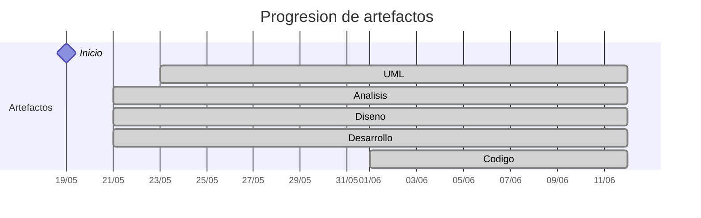

# Timeline - beatriizorozco

> Repo: [beatriizorozco/25-26-idsw2-sdVC](https://github.com/beatriizorozco/25-26-idsw2-sdVC)
> Commits: 93 | Días activos: 17 | Sesiones log: 10

## Patrón observado

| Métrica | Valor |
|---|---|
| Commits propios | 93 (12 feat / 8 fix / 73 other) |
| Ratio fix/feat | 0.66 |
| Días activos | 17 |
| Sesiones documentadas | 10 |
| Sesiones sin fecha en log | 10 |

<!-- trazabilidad: manual -->
## Trazabilidad por caso de uso

> Rama de trabajo: `develop`. Estructura: `RUP/01-analisis/casos-uso/<actor>/<CU>/`
> D6: prototipado (estructura + especificación) — análisis en `RUP/00-casos-uso/02-detalle/`, no en `RUP/01-analisis/`

| Caso de uso | D7 | D11 | D13 | D14 | D15 | D16 | D17 | D18 |
|---|:---:|:---:|:---:|:---: | :---: | :---: | :---: | :---: |
| *coordinador* | | | | | | | |   |
| `abrirConvocatoria` | A | | | | | | |     |
| `abrirConvocatorias` | A | A | | | | | |     |
| `abrirEntregable` | A | | | | | | |     |
| `abrirEntregables` | A | A | | | | | |     |
| `abrirInvestigador` | A | A | | | | | |     |
| `abrirInvestigadores` | A | A | | | | | |     |
| `abrirMiPublicacion` | A | | | | | | |     |
| `abrirMisPublicaciones` | A | A | | | | | |     |
| `abrirOpcionesCargaTrabajo` | A | | | | | | D |     |
| `abrirOpcionesPerfil` | A | | | | | Dd | |     |
| `abrirPanelPrincipal` | A | A | A | Dd | | | |     |
| `abrirProyecto` | A | A | | | | | |     |
| `abrirProyectos` | A | A | | | | | |     |
| `abrirPublicacion` | A | | | | | | |     |
| `abrirPublicaciones` | A | A | | | | | |     |
| `abrirRecompensa` | A | | | | | | |     |
| `abrirRecompensas` | A | A | | | | | |     |
| `abrirSolicitudEliminacionPerfil` | A | | | | | | |     |
| `abrirSolicitudesEliminacionPerfil` | A | | | | | | |     |
| `agregarInvestigador` | A | | | | | | |     |
| `cerrarSesion` | A | | A | Dd | | | |     |
| `crearEntregable` | A | | | | | | |     |
| `crearInvestigador` | A | | | | | | |     |
| `crearProyecto` | A | | | | | | |     |
| `crearPublicacion` | A | | | | | | |     |
| `crearRecompensa` | A | | | | | | |     |
| `editarCargaTrabajo` | A | | | | | | D |     |
| `editarEntregable` | A | | | | | | |     |
| `editarMiPublicacion` | A | | | | | | |     |
| `editarPerfil` | A | | | | | Dd | |     |
| `editarProyecto` | A | | | | | | |     |
| `editarPublicacion` | A | | | | | | |     |
| `editarRecompensa` | A | | | | | | |     |
| `eliminarEntregable` | A | | | | | | |     |
| `eliminarInvestigador` | A | | | | | | |     |
| `eliminarMiPublicacion` | A | | | | | | |     |
| `eliminarPerfil` | A | | | | | | |     |
| `eliminarProyecto` | A | | | | | | |     |
| `eliminarPublicacion` | A | | | | | | |     |
| `eliminarRecompensa` | A | | | | | | |     |
| `importarConvocatoria` | A | | | | | | |     |
| `iniciarSesion` | A | | A | Dd | | | |     |
| `responderPublicacion` | A | | | | | | |     |
| `solicitarEliminacionPerfil` | A | | | | | | |     |
| *investigador* | | | | | | | |   |
| `abrirEntregable` | A | | | | | | |     |
| `abrirEntregables` | A | A | | | | | |     |
| `abrirInvestigador` | A | | | | | | |     |
| `abrirInvestigadores` | A | A | | | | | |     |
| `abrirMiPublicacion` | A | | | | | | |     |
| `abrirMisPublicaciones` | A | A | | | | | |     |
| `abrirOpcionesCargaTrabajo` | A | | | | | | D |     |
| `abrirOpcionesPerfil` | A | | | | | Dd | |     |
| `abrirPanelPrincipal` | A | A | A | Dd | | | |     |
| `abrirProyecto` | A | A | | | | | |     |
| `abrirProyectos` | A | A | | | | | |     |
| `abrirPublicacion` | A | | | | | | |     |
| `abrirPublicaciones` | A | A | | | | | |     |
| `abrirRecompensa` | A | | | | | | |     |
| `abrirRecompensas` | A | A | | | | | |     |
| `cerrarSesion` | A | | A | Dd | | | |     |
| `crearEntregable` | A | | | | | | |     |
| `crearPublicacion` | A | | | | | | |     |
| `editarCargaTrabajo` | A | | | | | | D |     |
| `editarEntregable` | A | | | | | | |     |
| `editarPerfil` | A | | | | | Dd | |     |
| `editarPublicacion` | A | | | | | | |     |
| `eliminarEntregable` | A | | | | | | |     |
| `eliminarPublicacion` | A | | | | | | |     |
| `iniciarSesion` | A | | A | Dd | | | |     |
| `responderPublicacion` | A | | | | | | |     |
| `solicitarEliminacionPerfil` | A | | | | | | |     |

---

## Día 3 · 2026-05-21

### Commits (3: 1 feat / 0 fix)

| Hora | Mensaje |
|---|---|
| 01:50 | [chore(repo): organizar estructura inicial del proyecto](https://github.com/beatriizorozco/25-26-idsw2-sdVC/commit/0036b101697c8c9772a70de47243dfc636e450be) |
| 01:28 | [feat(codex): agregar skill session-memory](https://github.com/beatriizorozco/25-26-idsw2-sdVC/commit/fe592bf71c1ecd276f26a2d7f5fb660fe5f30030) |
| 17:45 | [docs: añadir especificación inicial del proyecto](https://github.com/beatriizorozco/25-26-idsw2-sdVC/commit/06bf7c3e4f9e20631e9d2d522d24639d170ef282) |

**Artefactos nuevos:** 🔍 🧩 ⚙️ 

> ⚠️ Commits sin entrada en log

---

## Día 4 · 2026-05-22

### Commits (2: 0 feat / 0 fix)

| Hora | Mensaje |
|---|---|
| 01:08 | [test(session-memory): corrección errata](https://github.com/beatriizorozco/25-26-idsw2-sdVC/commit/6ac06db28ce6bbbcd150a25b564b723d85bd7cdd) |
| 00:50 | [test(session-memory): verificar actualización de conversation-log](https://github.com/beatriizorozco/25-26-idsw2-sdVC/commit/fe8321c8890610de12c5525ad223ac739146c217) |

> ⚠️ Commits sin entrada en log

---

## Día 5 · 2026-05-23

### Commits (2: 0 feat / 0 fix)

| Hora | Mensaje |
|---|---|
| 02:15 | [Remove detailed logs of naming and link adjustments](https://github.com/beatriizorozco/25-26-idsw2-sdVC/commit/5b903142f0fe3eb4d89ccb8c49c54bf4ea449d0f) |
| 02:14 | [refactor(rup): organizo en este nuevo repositorio RUP/00-casos-uso](https://github.com/beatriizorozco/25-26-idsw2-sdVC/commit/e9ffc30f7c68093b4efde43847f049fbc3d9e110) |

**Artefactos nuevos:** 📐 

> ⚠️ Commits sin entrada en log

---

## Día 6 · 2026-05-24

### Commits (5: 0 feat / 0 fix)

| Hora | Mensaje |
|---|---|
| 00:01 | [Update context diagrams and actor states](https://github.com/beatriizorozco/25-26-idsw2-sdVC/commit/fcf3bee3de895dcfd1b005253de6bc7ebb1eef8e) |
| 22:15 | [Merge branch 'develop' of https://github.com/beatriizorozco/25-26-idsw2-sdVC into develop](https://github.com/beatriizorozco/25-26-idsw2-sdVC/commit/ebb0c04561cf85aaa74bf4359d205f0211f413b3) |
| 22:15 | [docs: actualizar README y cerrar conversation-log de la sesión](https://github.com/beatriizorozco/25-26-idsw2-sdVC/commit/3ac492ba6d4f5eab271a04f7898fae4eca1fdb43) |
| 21:59 | [docs: actualizar README principal de 00-casos-uso](https://github.com/beatriizorozco/25-26-idsw2-sdVC/commit/053cd6c46aa45c04214a163d265e6423835e45ee) |
| 21:47 | [añado el prototipado de los casos de uso](https://github.com/beatriizorozco/25-26-idsw2-sdVC/commit/938dbdd4b9bb67ceb494fd6213a4c146709546d4) |

> ⚠️ Commits sin entrada en log

---

## Día 7 · 2026-05-25

### Commits (4: 1 feat / 0 fix)

| Hora | Mensaje |
|---|---|
| 21:44 | [docs: finalizar sesión y sincronizar conversation-log](https://github.com/beatriizorozco/25-26-idsw2-sdVC/commit/a65ff6749106744abfe79274e04371e7a7a5d935) |
| 21:38 | [feat: primera iteración de análisis](https://github.com/beatriizorozco/25-26-idsw2-sdVC/commit/4cf6ae0b726299bec7d4ddfd41b04f5999e9764b) |
| 18:07 | [docs: corrijo minúsculas](https://github.com/beatriizorozco/25-26-idsw2-sdVC/commit/b3835699adc10ea6e8cafa04cc14149c7144d074) |
| 17:56 | [docs: actualizar README de detallado y prototipos usando plantilla pySighor](https://github.com/beatriizorozco/25-26-idsw2-sdVC/commit/fa674518d9a0c1c68f1856dd6d206736472acf40) |

> ⚠️ Commits sin entrada en log

---

## Día 11 · 2026-05-29

### Commits (3: 1 feat / 0 fix)

| Hora | Mensaje |
|---|---|
| 22:42 | [docs: actualizo conversation-log y se acaba la sesión](https://github.com/beatriizorozco/25-26-idsw2-sdVC/commit/66f89fa84c83f33d4ed92912ad10ab83d244a5d0) |
| 22:36 | [feat: actualizo algunos diagramas de colaboración con la recomendación del profesor](https://github.com/beatriizorozco/25-26-idsw2-sdVC/commit/8d6ae563c6b28364ee8e09b203c21e7d4ec55a99) |
| 12:04 | [Merge pull request #1 from beatriizorozco/develop](https://github.com/beatriizorozco/25-26-idsw2-sdVC/commit/33d3d457759c1ef0f214a08deefcfeae00d6e4a5) |

> ⚠️ Commits sin entrada en log

---

## Día 13 · 2026-05-31

### Commits (6: 0 feat / 2 fix)

| Hora | Mensaje |
|---|---|
| 17:25 | [docs(log): registrar cierre del bloque de sesión](https://github.com/beatriizorozco/25-26-idsw2-sdVC/commit/02d44aa45044c691ef37adc9401c5ec9a019dba4) |
| 17:17 | [fix(analisis): corregir referencias del bloque de sesión](https://github.com/beatriizorozco/25-26-idsw2-sdVC/commit/4eb3496282fe5d43290e745740a98067014e3682) |
| 17:11 | [refactor(analisis): recuperar estados y organizar índices por dominio](https://github.com/beatriizorozco/25-26-idsw2-sdVC/commit/a7f60bc44a106540d1e6227dae4aa9502b4f433c) |
| 16:55 | [refactor(analisis): alinear bloque de sesión con especificaciones](https://github.com/beatriizorozco/25-26-idsw2-sdVC/commit/2f89ab6068311e36afa8ffc13035397e99f892f9) |
| 16:26 | [fix(analisis): corregir colaboraciones de gestión de sesión](https://github.com/beatriizorozco/25-26-idsw2-sdVC/commit/4ca0ce0541926556c1b1b281fff71fe2088b0c5d) |
| 15:54 | [docs(log): registrar inicio de revisión del bloque de sesión](https://github.com/beatriizorozco/25-26-idsw2-sdVC/commit/f1d6004e54bdcf449de6d34c4677d406ef81a30a) |

> ⚠️ Commits sin entrada en log

---

## Día 14 · 2026-06-01

### Commits (7: 2 feat / 1 fix)

| Hora | Mensaje |
|---|---|
| 00:08 | [Merge pull request #2 from beatriizorozco/develop](https://github.com/beatriizorozco/25-26-idsw2-sdVC/commit/aec941a556247b319bbd7d424cd31728904d4cf4) |
| 00:04 | [docs(log): registrar cierre del bloque funcional inicial](https://github.com/beatriizorozco/25-26-idsw2-sdVC/commit/a00a662228430151b96dafde223c7ec9aa363880) |
| 23:54 | [feat(desarrollo): implementar bloque inicial de sesión y panel principal](https://github.com/beatriizorozco/25-26-idsw2-sdVC/commit/dd92fc42f1d65267dcab6c4a01e490f6b97a44f1) |
| 22:40 | [refactor(diseño): reforzar seguridad del bloque de sesión](https://github.com/beatriizorozco/25-26-idsw2-sdVC/commit/5f405fbce0d3e651bdc5a00f518110d7503bb427) |
| 22:28 | [fix(analisis): identificar actores concretos al iniciar sesión](https://github.com/beatriizorozco/25-26-idsw2-sdVC/commit/bcd7254d6065b82beab6c2ddbd33fc832d89e180) |
| 22:08 | [docs(seguimiento): añadir checklist de tareas pendientes](https://github.com/beatriizorozco/25-26-idsw2-sdVC/commit/b0a028c68df7a308c5f3df5636e82d3443317eb5) |
| 21:39 | [feat(diseño): definir bloque inicial de sesión y navegación](https://github.com/beatriizorozco/25-26-idsw2-sdVC/commit/c3c7638a3ddf8bd769c691fb5fe7887704934741) |

**Artefactos nuevos:** 🔌 

> ⚠️ Commits sin entrada en log

---

## Día 15 · 2026-06-02

### Commits (7: 0 feat / 1 fix)

| Hora | Mensaje |
|---|---|
| 17:11 | [docs(dominio): añadir diagramas de estados y objetos](https://github.com/beatriizorozco/25-26-idsw2-sdVC/commit/3a6274b8e4d36b4ded87dbac9c970466d23e1366) |
| 16:48 | [Update modelo-dominio.md](https://github.com/beatriizorozco/25-26-idsw2-sdVC/commit/482a026e120f5d72197c0017279db4c3fdd019fe) |
| 16:48 | [Update modelo-dominio.md](https://github.com/beatriizorozco/25-26-idsw2-sdVC/commit/cca26d5bacfc6c8d763b21fd61a7ac025ba56ff8) |
| 16:28 | [docs(log): registrar cierre verificado del primer bloque funcional](https://github.com/beatriizorozco/25-26-idsw2-sdVC/commit/ddcabe745e610e02e7ba359b5281e9382d950919) |
| 16:25 | [docs: cerrar revisión del primer bloque y registrar incidencias](https://github.com/beatriizorozco/25-26-idsw2-sdVC/commit/d10662f9e04ffbee662b78c8eecc5afd48c107f8) |
| 15:47 | [fix(sesion): corregir CORS y documentar pruebas del bloque inicial](https://github.com/beatriizorozco/25-26-idsw2-sdVC/commit/02d2e7c991c1cce9a1971451ef3cd38e176eac74) |
| 15:23 | [test(sesion): documentar pruebas del bloque inicial](https://github.com/beatriizorozco/25-26-idsw2-sdVC/commit/f9ca1fab8be61f0df268773805656272cf919cc4) |

> ⚠️ Commits sin entrada en log

---

## Día 16 · 2026-06-03

### Commits (10: 1 feat / 0 fix)

| Hora | Mensaje |
|---|---|
| 00:05 | [docs: revision desarrollo segundo bloque sin resumen en conversation log por llegar a limite de uso](https://github.com/beatriizorozco/25-26-idsw2-sdVC/commit/09ebb8ef471db1c98bb50043aa181ef3072e511b) |
| 20:36 | [docs: resumen de cierre de sesion terminado](https://github.com/beatriizorozco/25-26-idsw2-sdVC/commit/016903769fa3098a0fca3f79188cf9ed1eb1393a) |
| 16:26 | [docs: cierre de la sesión pero sin explicación debido a límite de mensajes. Luego se actualizarán los detalles.](https://github.com/beatriizorozco/25-26-idsw2-sdVC/commit/dd962db4f5ec972da808080b4e59f9a25b8cbd57) |
| 16:24 | [primera iteracion de desarrolo de 2º bloque](https://github.com/beatriizorozco/25-26-idsw2-sdVC/commit/7026aebe155e2117c6431c3ebd4885273f843654) |
| 15:57 | [docs(diseno): revisar y cerrar diseño del bloque de perfil](https://github.com/beatriizorozco/25-26-idsw2-sdVC/commit/b8bfdd5e959038431d7c0b12d83b6ad54c9771be) |
| 15:17 | [docs(diseno): completar patrones del segundo bloque](https://github.com/beatriizorozco/25-26-idsw2-sdVC/commit/1a09d495e41221229b05677fa4b7f677f4de286f) |
| 14:56 | [Add main states summary to context diagram documentation](https://github.com/beatriizorozco/25-26-idsw2-sdVC/commit/e6319d8a3e3015b20aa9555715b08028b3a9f1da) |
| 14:55 | [docs(analisis): exigir confirmacion en casos de eliminacion](https://github.com/beatriizorozco/25-26-idsw2-sdVC/commit/b3b767884c4edf46c3d7442a5e8da480817a519b) |
| 13:58 | [docs(analisis): adaptar README general de la disciplina](https://github.com/beatriizorozco/25-26-idsw2-sdVC/commit/26c2d9fdc44b7d17d2eaee5943d6deb7ceea32c8) |
| 13:42 | [docs(rup): diseñar bloque de gestión de perfil](https://github.com/beatriizorozco/25-26-idsw2-sdVC/commit/e061b4e86a54918cb2071bf53d4f389ed400658d) |

> ⚠️ Commits sin entrada en log

---

## Día 17 · 2026-06-04

### Commits (7: 0 feat / 0 fix)

| Hora | Mensaje |
|---|---|
| 01:40 | [Update conversation-log.md](https://github.com/beatriizorozco/25-26-idsw2-sdVC/commit/893521fd591adbea4ad2a83127aade8daeee2585) |
| 01:40 | [Revise timestamps and session titles in conversation log](https://github.com/beatriizorozco/25-26-idsw2-sdVC/commit/3bbac8c545c28795fe005d147281a0c87e577c02) |
| 01:37 | [docs](https://github.com/beatriizorozco/25-26-idsw2-sdVC/commit/50d60aab8164fc8c902991c63ee40859b7d690f0) |
| 23:58 | [docs(rup): matizar carga docente por sede](https://github.com/beatriizorozco/25-26-idsw2-sdVC/commit/f171f7b5c777e41009f0422f6f98b2e1a703fdd0) |
| 23:41 | [docs(rup): completar diseño de carga y evidencias de perfil](https://github.com/beatriizorozco/25-26-idsw2-sdVC/commit/2ef2ed0cf6f2ebf8fa925023e73792cbda82e644) |
| 03:26 | [cierre de sesion](https://github.com/beatriizorozco/25-26-idsw2-sdVC/commit/8e659d27e740ec705ef4dbf42bd6b009c01c5402) |
| 03:18 | [docs(analisis): ajustar carga de trabajo del bloque 3](https://github.com/beatriizorozco/25-26-idsw2-sdVC/commit/664731538986fc534ffe3251b6a2b665037b3c8c) |

> ⚠️ Commits sin entrada en log

---

## Día 18 · 2026-06-05

### Commits (9: 0 feat / 1 fix)

| Hora | Mensaje |
|---|---|
| 21:44 | [Update conversation-log.md](https://github.com/beatriizorozco/25-26-idsw2-sdVC/commit/a99fde5c095c8bf39015359d4d404ec7bbca878c) |
| 21:38 | [docs: revision analisis bloque 4](https://github.com/beatriizorozco/25-26-idsw2-sdVC/commit/0aa8b582c1349b63c942849cf34401f88466c393) |
| 21:22 | [Merge branch 'main' of https://github.com/beatriizorozco/25-26-idsw2-sdVC](https://github.com/beatriizorozco/25-26-idsw2-sdVC/commit/7dbe94ce00ea241830a5a90378cd0f5a4e3c712d) |
| 19:04 | [docs(recompensas): actualizar detalle analisis y contexto del bloque 4](https://github.com/beatriizorozco/25-26-idsw2-sdVC/commit/61d0947f356ace42c44e7e76070086c11afe6f8b) |
| 18:54 | [Update conversation-log.md](https://github.com/beatriizorozco/25-26-idsw2-sdVC/commit/7a19a68e295888de6472925445356e42317a4bf1) |
| 18:52 | [docs(recompensas): avanzar detalle y analisis del bloque 4](https://github.com/beatriizorozco/25-26-idsw2-sdVC/commit/1cde66d3b13ab7cf05a396ea581747cb912519c9) |
| 18:27 | [docs(carga-trabajo): cerrar revisión del bloque 3](https://github.com/beatriizorozco/25-26-idsw2-sdVC/commit/4abff67a6cd276ca7f634cdd50cb3ff01f57f2d0) |
| 13:50 | [fix(carga-trabajo): consolidar reglas por sede](https://github.com/beatriizorozco/25-26-idsw2-sdVC/commit/71989229b12ec0bb7c34e00ec9cd2a28f1387e83) |
| 12:39 | [inicio de sesion](https://github.com/beatriizorozco/25-26-idsw2-sdVC/commit/815c3f9d1a6a3faa031455c17a652b9e555f54c9) |

> ⚠️ Commits sin entrada en log

---

## Día 19 · 2026-06-06

### Commits (6: 1 feat / 1 fix)

| Hora | Mensaje |
|---|---|
| 01:04 | [feat(recompensas): cerrar desarrollo y validación integral del bloque 4](https://github.com/beatriizorozco/25-26-idsw2-sdVC/commit/c5822d80d54f56f867582d6b9b775882bdf97838) |
| 00:14 | [fix(bloque-4): corregir gestión y validación de recompensas](https://github.com/beatriizorozco/25-26-idsw2-sdVC/commit/a28ca098102739d99abaaa54e27d3cc4b70ec490) |
| 16:55 | [Update conversation-log.md](https://github.com/beatriizorozco/25-26-idsw2-sdVC/commit/ceebdb8dd34ce77d1021aeb9d58ff09bdd58b40c) |
| 16:53 | [cierre de sesion (desarrollo bloque 4)](https://github.com/beatriizorozco/25-26-idsw2-sdVC/commit/60d332c92876687080c745e5c0e06e9ffb5515fa) |
| 15:42 | [docs(recompensas): diseñar y revisar flujos del bloque 4](https://github.com/beatriizorozco/25-26-idsw2-sdVC/commit/8442805391966bf333c9316c92fda0fddfea019d) |
| 15:16 | [docs(recompensas): completar flujo de crear recompensa](https://github.com/beatriizorozco/25-26-idsw2-sdVC/commit/7b279cc41998c0fc91f93ace38f78ea96e94fe17) |

> ⚠️ Commits sin entrada en log

---

## Día 21 · 2026-06-08

### Commits (9: 2 feat / 1 fix)

| Hora | Mensaje |
|---|---|
| 00:21 | [docs(analisis): bloque 6 - investigadores primera iteracion](https://github.com/beatriizorozco/25-26-idsw2-sdVC/commit/255fabf7fbec3c4d1fc0135535aeea7e8e7deb2f) |
| 22:35 | [feat(proyectos): completar desarrollo del bloque 5 y adjuntos](https://github.com/beatriizorozco/25-26-idsw2-sdVC/commit/74ffc5b81831ed65443405661e017595b13179ce) |
| 20:23 | [Update conversation-log.md](https://github.com/beatriizorozco/25-26-idsw2-sdVC/commit/f3d472431ff27724db52d00e64a1bb3192d361e2) |
| 20:03 | [Update conversation-log.md](https://github.com/beatriizorozco/25-26-idsw2-sdVC/commit/0ccafaa3f7bc8298b34abb5c8b475e1ba24004e4) |
| 20:01 | [fix(detalle): casos de uso eliminar adaptados a desactivar](https://github.com/beatriizorozco/25-26-idsw2-sdVC/commit/ce613e58bf04515e9bf81f5902d335970d3db2c1) |
| 19:20 | [docs(proyectos): aplicar archivado lógico con trazabilidad histórica](https://github.com/beatriizorozco/25-26-idsw2-sdVC/commit/e191f4d6d231afa8cc3a05b02be9c205c48d6a68) |
| 17:00 | [feat(diseno): completar diseño del bloque 5 de gestión de proyectos](https://github.com/beatriizorozco/25-26-idsw2-sdVC/commit/585ad6f0dc1a142270af360b54d0708061f90a31) |
| 16:50 | [ix(analisis): alinear colaboraciones del bloque 5 con los diagramas de contexto](https://github.com/beatriizorozco/25-26-idsw2-sdVC/commit/85ef2c1ae48b6e93324f1598155a4a0edee8f5ba) |
| 14:47 | [docs(proyectos): completar detalle funcional del bloque 5](https://github.com/beatriizorozco/25-26-idsw2-sdVC/commit/58048b57c8a8fdfe02c9c44c530580cacbb12c5a) |

> ⚠️ Commits sin entrada en log

---

## Día 22 · 2026-06-09

### Commits (1: 0 feat / 0 fix)

| Hora | Mensaje |
|---|---|
| 01:32 | [docs(diseño): diseño del bloque 6: investigadores](https://github.com/beatriizorozco/25-26-idsw2-sdVC/commit/b37558f3aa71e4491ffafdf23a78fed70445f79d) |

> ⚠️ Commits sin entrada en log

---

## Día 24 · 2026-06-11

### Commits (9: 3 feat / 1 fix)

| Hora | Mensaje |
|---|---|
| 00:35 | [feat(desarrollo): bloque 8 - publicaciones](https://github.com/beatriizorozco/25-26-idsw2-sdVC/commit/59f3894cac6da2ff9605a889afa4384860d53377) |
| 00:01 | [docs(analisis y diseño): bloque 8: publicaciones](https://github.com/beatriizorozco/25-26-idsw2-sdVC/commit/0ac2b8ecc8e6446fc75cb3ebb59bdaa9b22a339c) |
| 23:28 | [docs(detallado): se cmodifican editr y duplicar para juntarlos y cumplir ocp](https://github.com/beatriizorozco/25-26-idsw2-sdVC/commit/ed37225b56b7e8431202c71221d56460d10988aa) |
| 23:07 | [fix: corrijo fallos de ejecución del backend](https://github.com/beatriizorozco/25-26-idsw2-sdVC/commit/1419e33b43bc018b3fba5a833e36747caa5ce011) |
| 20:20 | [feat(entregables): implementar gestión y versionado del bloque 7](https://github.com/beatriizorozco/25-26-idsw2-sdVC/commit/33d9c4f04eafb63dd2968554eb692d04f5ab0106) |
| 18:38 | [docs(diesño): correcciones](https://github.com/beatriizorozco/25-26-idsw2-sdVC/commit/ac6fae5b40aaf10ccc632f7f57c6496f7d09099a) |
| 13:03 | [docs(analisis y diseño): gestion de entregables](https://github.com/beatriizorozco/25-26-idsw2-sdVC/commit/d35bcb553ce7b58ac937b80803f8940cde29e120) |
| 04:02 | [Update conversation-log.md](https://github.com/beatriizorozco/25-26-idsw2-sdVC/commit/9d671bc8878478d49565e3b08f3b4c0bb279747d) |
| 04:01 | [feat(investigadores): creo desarrollo del bloque 6 investigadores](https://github.com/beatriizorozco/25-26-idsw2-sdVC/commit/0e3d069711fad73e358d879d32c202355e0bc4e0) |

> ⚠️ Commits sin entrada en log

---

## Día 25 · 2026-06-12

### Commits (3: 0 feat / 0 fix)

| Hora | Mensaje |
|---|---|
| 12:37 | [docs(conversation-log.md): cierro sesion](https://github.com/beatriizorozco/25-26-idsw2-sdVC/commit/90654c44106a2902c35741720c062b6d9dc38f9e) |
| 12:30 | [docs(diseño): bloque 9 - incidencias y correcciones de analisis](https://github.com/beatriizorozco/25-26-idsw2-sdVC/commit/f6868acd1d5746d0c0851fbf04d9dcae0e67ebd9) |
| 12:03 | [docs(analisis): bloque 9 - convocatorias. También he corregido parte del desarrollo para que se abriera bien spring boot y readme principal](https://github.com/beatriizorozco/25-26-idsw2-sdVC/commit/2d3a82979c5da33c4a4aeb7f7aa42d6b897a248f) |

> ⚠️ Commits sin entrada en log

---

