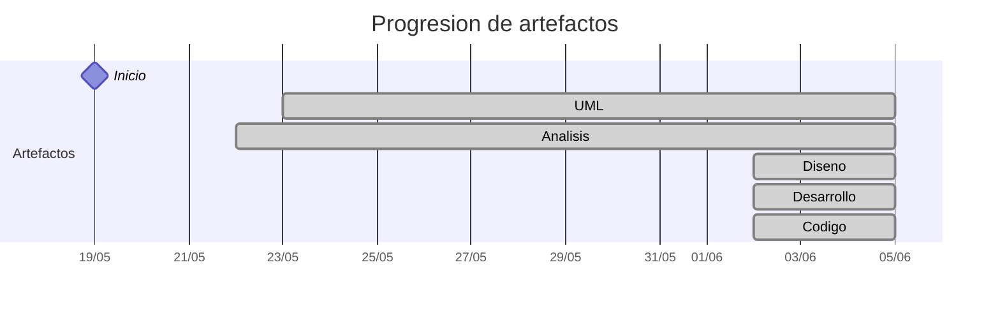

# Timeline - carlos-alvarado-25

> Repo: [carlos-alvarado-25/25-26-idsw2-sdVC](https://github.com/carlos-alvarado-25/25-26-idsw2-sdVC)
> Commits: 76 | Días activos: 15 | Sesiones log: 56

## Patrón observado

| Métrica | Valor |
|---|---|
| Commits propios | 76 (67 feat / 5 fix / 4 other) |
| Ratio fix/feat | 0.07 |
| Días activos | 15 |
| Sesiones documentadas | 56 |
| Días log+commits | 9 |
| Días solo log | 0 |
| Días solo commits | 6 |
| Sesiones sin fecha en log | 9 |

<!-- trazabilidad: manual -->
## Trazabilidad por caso de uso

| Caso de uso | D4 | D5 | D6 | D7 | D8 | D9 | D10 | D11 | D12 | D13 | D15 | D16 | D17 | D18 |
|---|:---:|:---:|:---:|:---:|:---:|:---:|:---:|:---:|:---:|:---:|:---: | :---: | :---: | :---: |
| `importarGrados` | A |   |   |   |   |   |   |   |   |   | Dd | | |     |
| `crearGrado` |   | A |   |   |   |   |   |   |   |   | Dd | | |     |
| `editarGrado` |   |   | A |   |   |   |   |   |   |   | Dd | | |     |
| `eliminarGrado` |   |   | A |   |   |   |   |   |   |   | Dd | | |     |
| `abrirExamenes` |   |   | A |   |   |   |   |   |   |   | | | | D |
| `crearExamen` |   |   | A |   |   |   |   |   |   |   | | | | D |
| `editarExamen` |   |   | A |   |   |   |   |   |   |   | | | | D |
| `eliminarExamen` |   |   | A |   |   |   |   |   |   |   | | | | D |
| `abrirAsignaturas` |   |   |   | A |   |   |   |   |   |   | | Dd | |     |
| `importarAsignaturas` |   |   |   | A |   |   |   |   |   |   | | Dd | |     |
| `crearAsignatura` |   |   |   | A |   |   |   |   |   |   | | Dd | |     |
| `editarAsignatura` |   |   |   | A |   |   |   |   |   |   | | Dd | |     |
| `eliminarAsignatura` |   |   |   | A |   |   |   |   |   |   | | Dd | |     |
| `abrirProfesores` |   |   |   |   | A |   |   |   |   |   | | | | Dd |
| `importarProfesores` |   |   |   |   | A |   |   |   |   |   | | | | Dd |
| `crearProfesor` |   |   |   |   | A |   |   |   |   |   | | | | Dd |
| `editarProfesor` |   |   |   |   | A |   |   |   |   |   | | | | Dd |
| `eliminarProfesor` |   |   |   |   | A |   |   |   |   |   | | | | Dd |
| `listarConflictosExamenes` |   |   |   |   | A |   |   | A |   |   | | | |     |
| `abrirAulas` |   |   |   |   |   | A |   |   |   |   | | Dd | |     |
| `importarAulas` |   |   |   |   |   | A |   |   |   |   | | Dd | |     |
| `crearAula` |   |   |   |   |   | A |   |   |   |   | | Dd | |     |
| `editarAula` |   |   |   |   |   | A |   |   |   |   | | Dd | |     |
| `eliminarAula` |   |   |   |   |   | A |   |   |   |   | | Dd | |     |
| `abrirAlumnos` |   |   |   |   |   |   | A |   |   |   | | | Dd |     |
| `importarAlumnos` |   |   |   |   |   |   | A |   |   |   | | | Dd |     |
| `crearAlumno` |   |   |   |   |   |   | A |   |   |   | | | Dd |     |
| `editarAlumno` |   |   |   |   |   |   | A |   |   |   | | | Dd |     |
| `eliminarAlumno` |   |   |   |   |   |   | A |   |   |   | | | Dd |     |
| `generarCalendario` |   |   |   |   |   |   |   | A |   |   | | | |     |
| `consultarCalendario` |   |   |   |   |   |   |   |   | A |   | | | |     |
| `descargarCalendarioExamenes` |   |   |   |   |   |   |   |   |   | A | | | |     |
| `abrirGrados` |   |   |   |   |   |   |   |   |   |   | Dd | | |     |
| `iniciarSesion` |   |   |   |   |   |   |   |   |   |   | ADd | | |     |
| `cerrarSesion` |   |   |   |   |   |   |   |   |   |   | AD | | |     |

---

## Día 3 · 2026-05-21

### Commits (4: 3 feat / 0 fix)

| Hora | Mensaje |
|---|---|
| 19:49 | [feat: Cierre de preparación del entorno RUP](https://github.com/carlos-alvarado-25/25-26-idsw2-sdVC/commit/43e463dbfb6c5fc18178ca9944e93058d17a1cd9) |
| 19:39 | [feat: Estructurando directorios de imágenes para limpiar directorios de RUP/ y de images/](https://github.com/carlos-alvarado-25/25-26-idsw2-sdVC/commit/4579322391bc275725dcc086ea87fa6a21b2517d) |
| 19:19 | [feat: Añadiendo requisitado desde el repo de IdSw 1](https://github.com/carlos-alvarado-25/25-26-idsw2-sdVC/commit/aac398986d1f0b1ebbb38c6bc7d885ef74e58304) |
| 13:18 | [initial commit - QUE_HACE.md](https://github.com/carlos-alvarado-25/25-26-idsw2-sdVC/commit/e182ed8642caaeb3defbb831bff0368d0f94dc2c) |

> ⚠️ Commits sin entrada en log

---

## Día 4 · 2026-05-22

### Commits (1: 1 feat / 0 fix)

| Hora | Mensaje |
|---|---|
| 17:47 | [feat: Añadir análisis y documentación para el caso de uso importarGrados y configuraciones adicionales para gemini-cli](https://github.com/carlos-alvarado-25/25-26-idsw2-sdVC/commit/ab00726fa9c9d13e772a6d3420818a1a1a5687a6) |

**Artefactos nuevos:** 🔍 

> ⚠️ Commits sin entrada en log

---

## Día 5 · 2026-05-23

### Commits (3: 2 feat / 1 fix)

| Hora | Mensaje |
|---|---|
| 15:06 | [feat: Añadir análisis y documentación para el caso de uso crearGrado, incluyendo diagramas de colaboración y clases de análisis](https://github.com/carlos-alvarado-25/25-26-idsw2-sdVC/commit/03aa02c6857fbbe54812cd3e4a61c0b220e77ffe) |
| 13:33 | [fix: Reestructuración de directorios de imagenes y modelosUML, y corrección de enlaces para asegurar la integridad de la estructura del repositorio](https://github.com/carlos-alvarado-25/25-26-idsw2-sdVC/commit/a679757f55c682e4c735995e1e3c4d704a94098b) |
| 12:16 | [Add new images and analysis diagrams for various functionalities in the project](https://github.com/carlos-alvarado-25/25-26-idsw2-sdVC/commit/a315ef19878f904b193145a02a66c0f5c8ba79fe) |

**Artefactos nuevos:** 📐 

> ⚠️ Commits sin entrada en log

---

## Día 6 · 2026-05-24

### Commits (9: 8 feat / 1 fix)

| Hora | Mensaje |
|---|---|
| 17:46 | [fix: Refactor SVG diagram for analysis](https://github.com/carlos-alvarado-25/25-26-idsw2-sdVC/commit/230454e0aff8bad7f0c2838af4f745897e4cb7f7) |
| 15:44 | [feat: add analysis and documentation for eliminarExamen use case, including sampling integrity and collaboration diagram](https://github.com/carlos-alvarado-25/25-26-idsw2-sdVC/commit/7b381a07dc08f8b6d5aa3741d485c20626187467) |
| 15:42 | [feat: add analysis and documentation for eliminarExamen use case, including collaboration diagram](https://github.com/carlos-alvarado-25/25-26-idsw2-sdVC/commit/7b40f50f1f99b91269880d03fdd32f7a55a357d0) |
| 15:26 | [feat: add editarExamen case use analysis and collaboration diagram](https://github.com/carlos-alvarado-25/25-26-idsw2-sdVC/commit/0a411726358370dde29ea5255d9b34015c1c21fe) |
| 15:03 | [feat: Add analysis for crearExamen use case](https://github.com/carlos-alvarado-25/25-26-idsw2-sdVC/commit/a13c10cf654a84af531f7032cf47da685e3a0faa) |
| 14:29 | [feat: Añadir sesión extraordinaria sobre refinamiento de entidades conceptuales y uso de PagedResult en el análisis](https://github.com/carlos-alvarado-25/25-26-idsw2-sdVC/commit/459b52c92a25cb3457f8bf4af37b30eab2f7e9b3) |
| 14:15 | [feat: Add analysis for abrirExamenes use case and related documentation](https://github.com/carlos-alvarado-25/25-26-idsw2-sdVC/commit/c7817dba7660edec72c9c098f5586f7db78f9431) |
| 12:24 | [feat: Añadir análisis y documentación para el caso de uso eliminarGrado, incluyendo diagrama de colaboración y validación de dependencias](https://github.com/carlos-alvarado-25/25-26-idsw2-sdVC/commit/7cdf015bc933f0116e267c67dead2a6677e21459) |
| 12:05 | [feat: Añadir análisis y documentación para el caso de uso editarGrado, incluyendo diagrama de colaboración y corrección del conversation-log para añadir fecha y hora](https://github.com/carlos-alvarado-25/25-26-idsw2-sdVC/commit/d389a311809472254baaa89c2b95d52b6635125d) |

> ⚠️ Commits sin entrada en log

---

## Día 7 · 2026-05-25

### Commits (6: 5 feat / 1 fix)

| Hora | Mensaje |
|---|---|
| 17:12 | [feat: Add analysis and documentation for eliminarAsignatura use case, including collaboration diagram and impact control](https://github.com/carlos-alvarado-25/25-26-idsw2-sdVC/commit/9f2f9e0a72df8c0aa93c3b55fa3ae931a9c405ee) |
| 16:48 | [Add analysis diagrams for 'editarAsignatura' use case and update 'crearAsignatura' collaboration diagram](https://github.com/carlos-alvarado-25/25-26-idsw2-sdVC/commit/7305cc7ff1f42b53059e0b22d47685ca4d85e194) |
| 14:26 | [feat: Add crearAsignatura use case analysis and related documentation](https://github.com/carlos-alvarado-25/25-26-idsw2-sdVC/commit/00fbf4996d647fa159073c03e748473f1dd7d9ac) |
| 13:30 | [feat: Add analysis and documentation for importarAsignaturas use case, including collaboration diagram and dependency resolution](https://github.com/carlos-alvarado-25/25-26-idsw2-sdVC/commit/578ffce0e2426a007d119e58a8bdd8732b7b57a2) |
| 12:47 | [feat: Add analysis for abrirAsignaturas use case and update documentation](https://github.com/carlos-alvarado-25/25-26-idsw2-sdVC/commit/1b51ccac8643198d5d08e766c36e127d24e43d65) |
| 12:03 | [fix: update session numbering in conversation log for clarity](https://github.com/carlos-alvarado-25/25-26-idsw2-sdVC/commit/f618f4aae79954bf2a6f5eb36c49acde7572820c) |

> ⚠️ Commits sin entrada en log

---

## Día 8 · 2026-05-26

### Commits (6: 5 feat / 0 fix)

| Hora | Mensaje |
|---|---|
| 22:47 | [feat: Add analysis and documentation for eliminarProfesor use case, including collaboration diagram and related files](https://github.com/carlos-alvarado-25/25-26-idsw2-sdVC/commit/0c49f058e8c5d2457496fc654e80c6d474d04b22) |
| 22:29 | [Refactor UML diagrams for exam conflict management and professor assignment](https://github.com/carlos-alvarado-25/25-26-idsw2-sdVC/commit/7ea7ab10103f2c8b13ae1d82bda07fdb0a5b3f89) |
| 21:18 | [feat: Add analysis documentation and collaboration diagram for listarConflictosExamenes use case](https://github.com/carlos-alvarado-25/25-26-idsw2-sdVC/commit/11e44f48267762094b068f92647915df54a5ff08) |
| 20:52 | [feat: Add editarProfesor case use analysis and documentation](https://github.com/carlos-alvarado-25/25-26-idsw2-sdVC/commit/a8dc577b49b020f42645757be86dca3708769bf9) |
| 20:40 | [feat: Add analysis and documentation for crearProfesor use case, including collaboration diagram and related files](https://github.com/carlos-alvarado-25/25-26-idsw2-sdVC/commit/0e3dc1a9f31c461f500f2e5756335cee78b580e0) |
| 20:17 | [feat: Add analysis documentation and UML diagrams for abrirProfesores and importarProfesores use cases](https://github.com/carlos-alvarado-25/25-26-idsw2-sdVC/commit/5668985d88e588ae1adbd63b82781d3cce6ca81a) |

> ⚠️ Commits sin entrada en log

---

## Día 9 · 2026-05-27

### Commits (4: 3 feat / 0 fix)

| Hora | Mensaje |
|---|---|
| 23:08 | [feat: Implementar análisis y diagramas para editarAula y eliminarAula](https://github.com/carlos-alvarado-25/25-26-idsw2-sdVC/commit/e7f4b32626b2276227a69873b8d4d703f79d824f) |
| 22:18 | [feat: Add analysis documentation and collaboration diagram for importarAulas use case](https://github.com/carlos-alvarado-25/25-26-idsw2-sdVC/commit/292d1ef2fe2ad39a58b18df477907bff8cc2ea93) |
| 20:54 | [feat: Add analysis documentation and collaboration diagrams for abrirAulas and crearAula use cases](https://github.com/carlos-alvarado-25/25-26-idsw2-sdVC/commit/82be3f90dba2e76b5a624c05f03cba15227abd60) |
| 20:37 | [Refactor use case diagrams for editing entities](https://github.com/carlos-alvarado-25/25-26-idsw2-sdVC/commit/a47154ad0208f80f98205c0110351b3e20878e9a) |

### 💬 Conversation-log (3 sesiónes)

- Sesión 26: Rama de Aulas - Estandarización de Importación
- Sesión 27: Blindaje de Protocolos y Cierre de Jornada
- Sesión 28: Rama de Aulas - Refinamiento y Consistencia Semántica

> 💬 + commits = proceso documentado

---

## Día 10 · 2026-05-28

### Commits (5: 5 feat / 0 fix)

| Hora | Mensaje |
|---|---|
| 23:37 | [feat: Add analysis documentation and collaboration diagram for eliminarAlumno use case](https://github.com/carlos-alvarado-25/25-26-idsw2-sdVC/commit/dfb7c70366a462381bf7db2e9c0333a9ea26dae5) |
| 23:18 | [feat: Add analysis documentation and collaboration diagram for editarAlumno use case](https://github.com/carlos-alvarado-25/25-26-idsw2-sdVC/commit/205dad5d7b850384f1b82601e3c62f2c35835886) |
| 22:48 | [feat: Added analysis documentation for crearAlumnos use case and diagrams](https://github.com/carlos-alvarado-25/25-26-idsw2-sdVC/commit/c6d0b8b3724329335ceb08a7e118512e2f5a45f8) |
| 21:14 | [feat: Add analysis documentation and collaboration diagram for importarAlumnos use case](https://github.com/carlos-alvarado-25/25-26-idsw2-sdVC/commit/c7a1dd5b71d84cef35bb4c82fedd31056e9f5506) |
| 09:38 | [feat: Add analysis for use case abrirAlumnos and corrected listing method on abrir entities](https://github.com/carlos-alvarado-25/25-26-idsw2-sdVC/commit/b8e5c6be68003d41ef3487c8f84d91ff68870e48) |

### 💬 Conversation-log (5 sesiónes)

- Sesión 29: Rama de Alumnos y Estandarización Global de Listados
- Sesión 30: Rama de Alumnos - Importación y Resolución de Dependencias
- Sesión 31: Rama de Alumnos - Creación Manual y Vinculación Académica
- Sesión 32: Rama de Alumnos - Edición y Navegación por Estados
- Sesión 33: Rama de Alumnos - Eliminación y Rigor de Requisitos

> 💬 + commits = proceso documentado

---

## Día 11 · 2026-05-29

### Commits (1: 0 feat / 0 fix)

| Hora | Mensaje |
|---|---|
| 20:35 | [Refactor UML diagrams for conflict listing and calendar generation](https://github.com/carlos-alvarado-25/25-26-idsw2-sdVC/commit/f7c033a00633756c9a89bae0b9d0f0e7925a91cd) |

### 💬 Conversation-log (1 sesión)

- Sesión 34: Rama de Calendario - Motor de Generación y Hub de Conflictos

> 💬 + commits = proceso documentado

---

## Día 12 · 2026-05-30

### Commits (1: 1 feat / 0 fix)

| Hora | Mensaje |
|---|---|
| 23:52 | [feat: Add analysis for consultarCalendario use case](https://github.com/carlos-alvarado-25/25-26-idsw2-sdVC/commit/3b5018633cb7bb6227786815e518828b2632afcd) |

### 💬 Conversation-log (1 sesión)

- Sesión 35: Rama de Calendario - Consulta Compartida y Refinamiento Dimensional

> 💬 + commits = proceso documentado

---

## Día 13 · 2026-05-31

### Commits (1: 1 feat / 0 fix)

| Hora | Mensaje |
|---|---|
| 14:30 | [feat: Add analysis and diagrams for descargarCalendarioExamenes use case](https://github.com/carlos-alvarado-25/25-26-idsw2-sdVC/commit/2f16ea8bd44a6411f9b3c18afd373803c907ddd8) |

### 💬 Conversation-log (1 sesión)

- Sesión 36: Rama de Calendario - Exportación y Parámetros de Contenido

> 💬 + commits = proceso documentado

---

## Día 15 · 2026-06-02

### Commits (15: 14 feat / 1 fix)

| Hora | Mensaje |
|---|---|
| 01:01 | [feat: Update breadcrumbs in RUP documentation for improved navigation and traceability across Analysis, Design, and Development disciplines](https://github.com/carlos-alvarado-25/25-26-idsw2-sdVC/commit/796bc25c1a8ab91cf5882fc2b418d2f4332da1f3) |
| 00:50 | [feat: Consolidate Grado creation and editing flows into a unified GradoFormComponent, update documentation, and implement incremental updates and bulk import functionality](https://github.com/carlos-alvarado-25/25-26-idsw2-sdVC/commit/e2d05f07a55004790f2e0bd68f8f0a0ac360cbe4) |
| 00:39 | [feat(grados): Implement CRUD operations and import functionality for Grados](https://github.com/carlos-alvarado-25/25-26-idsw2-sdVC/commit/a83f5f62b7ef6894955e62fab231e90c67cc0551) |
| 00:01 | [feat: Implementar gestión de grados académicos](https://github.com/carlos-alvarado-25/25-26-idsw2-sdVC/commit/03c570ad16039253ea3ce38d82cf1739b1ebd26b) |
| 21:44 | [feat: add authentication feature with login and home components](https://github.com/carlos-alvarado-25/25-26-idsw2-sdVC/commit/d97aac13ae56c601055d37f62aa3f7e1391e42d1) |
| 19:17 | [feat: initialize Angular frontend application with server-side rendering and NestJS backend](https://github.com/carlos-alvarado-25/25-26-idsw2-sdVC/commit/911aba89939df25944ce70ad00e5c02e58f299c8) |
| 18:52 | [feat: Add sequence diagrams for editing and deleting grades](https://github.com/carlos-alvarado-25/25-26-idsw2-sdVC/commit/b7c9e75a3f190838efc60f306637dd80757e14b7) |
| 18:36 | [Add sequence diagrams for creating and listing grades](https://github.com/carlos-alvarado-25/25-26-idsw2-sdVC/commit/3b7be7263027cd9b9e1e2ed16671ed69967236b8) |
| 14:37 | [feat: add diseño y documentación para el caso de uso importarGrados](https://github.com/carlos-alvarado-25/25-26-idsw2-sdVC/commit/1a6adca1cc45ef7ae0e5d513d5e0eed08343e678) |
| 13:49 | [feat: Implementar diseño y flujo para el caso de uso cerrarSesion](https://github.com/carlos-alvarado-25/25-26-idsw2-sdVC/commit/6994002aec91d004217ac795927ac824e73ce7f1) |
| 13:21 | [feat: Add UML diagrams for system architecture, login sequence, and detailed class design](https://github.com/carlos-alvarado-25/25-26-idsw2-sdVC/commit/57dc595819df561810dd4da81d96492f834f7d53) |
| 11:32 | [feat: Enhance Professor Context with Incident Reporting and Communication Closure](https://github.com/carlos-alvarado-25/25-26-idsw2-sdVC/commit/29b6d116565cece8e1e1df56bab392da2a00fd08) |
| 11:17 | [fix: Restructure use case analysis documentation for clarity and organization considering observability tools](https://github.com/carlos-alvarado-25/25-26-idsw2-sdVC/commit/e4423c35baf71ebdeb451e959508a5444fb32fc3) |
| 10:36 | [feat: Add authentication use cases for iniciarSesion and cerrarSesion](https://github.com/carlos-alvarado-25/25-26-idsw2-sdVC/commit/3928f8c6f792f80789c39fc5092e94539b8bf40c) |
| 10:25 | [feat: Add navigation transition analyses for completing consultation, management, and process](https://github.com/carlos-alvarado-25/25-26-idsw2-sdVC/commit/35265893033cd45941dfd1eef2cebb912630e780) |

### 💬 Conversation-log (12 sesiónes)

- Sesión 37: Transiciones de Navegación - Rigor en el Cierre de Estados
- Sesión 38: Autenticación y Cierre del Contexto Administrador
- Sesión 39: Reestructuración Arquitectónica y Rescate de la Auditabilidad
- Sesión 40: Contexto del Profesor y Cierre de la FASE DE ANÁLISIS
- Sesión 41: Inicio de la Fase de Diseño - Arquitectura NestJS + Angular
- Sesión 42: Ingeniería de Diseño - Arquitectura de Capas y Realización de Autenticación
- Sesión 43: Rama de Grados - Diseño Detallado de Importación Masiva
- Sesión 44: Rama de Grados - Listado Paginado y Patrón El Delgado
- Sesión 45: Rama de Grados - Diseño Detallado de Edición y Borrado Seguro
- Sesión 46: Levantamiento de Infraestructura y Configuración de Persistencia
- Sesión 47: Desarrollo de Autenticación y Refinamiento de UX
- Sesión 48: Desarrollo de la Rama de Grados - Hub de Gestión, Alta Manual y Depuración del Motor de Búsqueda

**Artefactos nuevos:** 🔌 🧩 ⚙️ 

> 💬 + commits = proceso documentado

---

## Día 16 · 2026-06-03

### Commits (8: 8 feat / 0 fix)

| Hora | Mensaje |
|---|---|
| 00:56 | [feat: implement bulk deletion functionality for Asignaturas, Aulas, and Grados with UI updates](https://github.com/carlos-alvarado-25/25-26-idsw2-sdVC/commit/4cb1fef1d486de4a122a5a524ebe18057abbce6b) |
| 00:47 | [feat(aulas): implement Aula module with CRUD operations and import functionality](https://github.com/carlos-alvarado-25/25-26-idsw2-sdVC/commit/da04e0707a14b89d58c5bd17566c220d312a5461) |
| 00:12 | [feat(importarAulas): add detailed design documentation and sequence diagram](https://github.com/carlos-alvarado-25/25-26-idsw2-sdVC/commit/6bc674530f4e0c4f91c4e5448a8b7d9b1f678dd9) |
| 00:04 | [feat: Add sequence diagrams for eliminarAula and editarAula use cases](https://github.com/carlos-alvarado-25/25-26-idsw2-sdVC/commit/72b4b227f512c0866a01cfb87e3e5e71522cd9cf) |
| 21:57 | [feat: Add sequence diagrams for crearAula and abrirAulas use cases; update AsignaturaService to remove redundant comments](https://github.com/carlos-alvarado-25/25-26-idsw2-sdVC/commit/d8664a7cecc7f05f9f1eeac2c3d299063763c1f1) |
| 21:17 | [feat(asignaturas): add CRUD functionality for asignaturas](https://github.com/carlos-alvarado-25/25-26-idsw2-sdVC/commit/7cf06a0f8d18cf6a7fc5f5673d29a6d58c3f1c84) |
| 17:57 | [feat: Add detailed sequence diagrams for crearAsignatura, editarAsignatura, and eliminarAsignatura use cases](https://github.com/carlos-alvarado-25/25-26-idsw2-sdVC/commit/8d65a7537b82034f12156a4c41abc6c54c2b1082) |
| 17:37 | [feat: Add sequence diagrams for abrirAsignaturas and importarAsignaturas use cases](https://github.com/carlos-alvarado-25/25-26-idsw2-sdVC/commit/c4634386bc3d89a894a7acb74a2a045488918eb3) |

### 💬 Conversation-log (8 sesiónes)

- Sesión 49: Finalización del Ramillete de Grados - CRUD Completo e Importación
- Sesión 50: Finalización del Ramillete de Grados - Consolidación de Componentes y Depuración Técnica
- Sesión 51: Optimización de la Trazabilidad y Navegación Operativa RUP
- Sesión 52: Rama de Asignaturas - Inicio del Diseño Detallado
- Sesión 52: Rama de Asignaturas - Diseño Detallado Completo
- Sesión 53: Excelencia en Trazabilidad - Normalización Global de Breadcrumbs
- Sesión 54: Rama de Asignaturas - Desarrollo Completo y Consistencia UI
- Sesión 55: Rama de Aulas - Inicio del Diseño Detallado

> 💬 + commits = proceso documentado

---

## Día 17 · 2026-06-04

### Commits (5: 4 feat / 1 fix)

| Hora | Mensaje |
|---|---|
| 21:12 | [feat(alumnos): add CRUD functionality for alumnos with import feature](https://github.com/carlos-alvarado-25/25-26-idsw2-sdVC/commit/6b929abb2245458745c5ebc0db0d836b0b316357) |
| 19:54 | [fix: refactoring multi-format import functionality for CSV and Excel files](https://github.com/carlos-alvarado-25/25-26-idsw2-sdVC/commit/8f42e2c425a287d2852fc25430e089b26ee54a40) |
| 18:35 | [feat(importarAlumnos): add detailed design documentation and sequence diagram](https://github.com/carlos-alvarado-25/25-26-idsw2-sdVC/commit/1cc91fe331d177bc047bf03c2664f3dadce256a1) |
| 18:10 | [feat: Add detailed sequence diagrams for eliminarAlumno and editarAlumno use cases](https://github.com/carlos-alvarado-25/25-26-idsw2-sdVC/commit/d8374f1c735eff5f7104b7f1ee019850b1c612dc) |
| 17:45 | [feat: Add detailed sequence diagrams for crearAlumno and abrirAlumnos use cases](https://github.com/carlos-alvarado-25/25-26-idsw2-sdVC/commit/5b0c976db4c0b1120864af6f3ff2a6a4fb26b29c) |

### 💬 Conversation-log (9 sesiónes)

- Sesión 56: Rama de Aulas - Diseño Detallado de Gestión y Borrado Seguro
- Sesión 57: Rama de Aulas - Finalización del Diseño Detallado
- Sesión 58: Rama de Aulas - Implementación Full-Stack Completa
- Sesión 59: Acciones Masivas - Implementación de Eliminación Múltiple
- Sesión 60: Rama de Alumnos - Inicio del Diseño Detallado
- Sesión 61: Rama de Alumnos - Diseño Detallado de Mantenimiento y Borrado
- Sesión 62: Rama de Alumnos - Finalización del Diseño Detallado
- Sesión 63: Infraestructura - Motor de Importación Multi-formato (SOLID)
- Sesión 64: Rama de Alumnos - Desarrollo Full-Stack y Validación de Excelencia

> 💬 + commits = proceso documentado

---

## Día 18 · 2026-06-05

### Commits (7: 7 feat / 0 fix)

| Hora | Mensaje |
|---|---|
| 21:09 | [feat: Add sequence diagrams for eliminarExamen and editarExamen use cases](https://github.com/carlos-alvarado-25/25-26-idsw2-sdVC/commit/aa5b0d46d7bd0e0ae573962ebf35f3baa2905f6e) |
| 20:48 | [feat: Add sequence diagrams for exam creation and listing use cases](https://github.com/carlos-alvarado-25/25-26-idsw2-sdVC/commit/0075f27a7ddbb12021928a2e3585e222d3d538b5) |
| 20:24 | [feat: Implement import and management features for professors](https://github.com/carlos-alvarado-25/25-26-idsw2-sdVC/commit/b595cf69fd0cba6391d3f2680fb04638c44396dc) |
| 16:23 | [feat: Add sequence diagrams for "eliminarProfesor" use case](https://github.com/carlos-alvarado-25/25-26-idsw2-sdVC/commit/c296053984adeffa549a225182916306e8756a27) |
| 16:20 | [feat: Add sequence diagrams for editing and importing professors](https://github.com/carlos-alvarado-25/25-26-idsw2-sdVC/commit/112ed497ea91b37f0c53b3752a85bff1dab7f17a) |
| 16:03 | [feat: Implement detailed design for crearProfesor use case](https://github.com/carlos-alvarado-25/25-26-idsw2-sdVC/commit/3778cc27ad4ae107beacb0aa4aa7da24cf94fe6b) |
| 15:53 | [feat: Implement detailed design for abrirProfesores use case](https://github.com/carlos-alvarado-25/25-26-idsw2-sdVC/commit/e528524e6908db87da421e2200e1cfe16dc37209) |

### 💬 Conversation-log (7 sesiónes)

- Sesión 65: Rama de Profesores - Inicio del Diseño Detallado
- Sesión 66: Rama de Profesores - Diseño Detallado de Alta Manual
- Sesión 67: Rama de Profesores - Diseño Detallado de Edición e Importación Masiva
- Sesión 68: Rama de Profesores - Diseño Detallado de Borrado Seguro
- Sesión 69: Rama de Profesores - Desarrollo Full-Stack Completo y Consistencia de Diseño
- Sesión 70: Rama de Exámenes - Diseño Detallado de Apertura y Alta Manual
- Sesión 71: Rama de Exámenes - Diseño Detallado de Edición y Borrado Seguro

> 💬 + commits = proceso documentado

---

