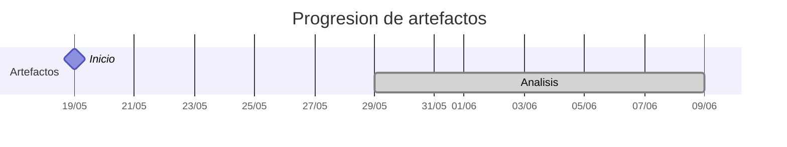

# Timeline - inigovaqueroo04

> Repo: [inigovaqueroo04/25-26-idsw2-sdVC](https://github.com/inigovaqueroo04/25-26-idsw2-sdVC)
> Commits: 42 | Días activos: 10 | Sesiones log: 0

## Patrón observado

| Métrica | Valor |
|---|---|
| Commits propios | 42 (3 feat / 0 fix / 39 other) |
| Días activos | 10 |
| Sesiones documentadas | 0 |

<!-- trazabilidad: manual -->
## Trazabilidad por caso de uso

| Caso de uso | D7 | D8 | D9 | D11 | D13 | D14 | D17 |
|---|:---:|:---:|:---:|:---:|:---:|:---: | :---: |
| `iniciarSesion` | A |   |   |   |   | | D |
| `cerrarSesion` |   | A |   |   |   | | D |
| `completarGestion` |   | A |   |   |   | | D |
| `abrirGrupos` |   | A |   |   |   | | D |
| `crearGrupo` |   | A |   |   |   | | D |
| `editarGrupo` |   | A |   |   |   | | D |
| `eliminarGrupo` |   | A |   |   |   | | D |
| `invitarUsuario` |   | A |   |   |   | | D |
| `editarMiembro` |   | A |   |   |   | | D |
| `eliminarMiembro` |   |   | A |   |   | | D |
| `abrirInvitaciones` |   |   |   | A |   | | D |
| `editarInvitacion` |   |   |   | A |   | | D |
| `abrirTareas` |   |   |   | A |   | | D |
| `crearTarea` |   |   |   |   | A | | D |
| `editarTarea` |   |   |   |   | A | | D |
| `relacionarTareas` |   |   |   |   | A | | D |
| `eliminarTarea` |   |   |   |   | A | | D |
| `abrirPlanificacion` |   |   |   |   |   | A | D |
| `validarConflicto` |   |   |   |   |   | A | D |
| `marcarCompletada` |   |   |   |   |   | A | D |
| `establecerHorario` |   |   |   |   |   | A | D |
| `definirLocalizacion` |   |   |   |   |   | A | D |
| `configurarRecordatorio` |   |   |   |   |   | A | D |
| `asignarTareaAUsuario` |   |   |   |   |   | A | D |

---

## Día 3 · 2026-05-21

### Commits (1: 1 feat / 0 fix)

| Hora | Mensaje |
|---|---|
| 13:05 | [feat: QUE_HACE](https://github.com/inigovaqueroo04/25-26-idsw2-sdVC/commit/54902be9450fc6d64fe30d7eb4b8d20d0b446319) |

> ⚠️ Commits sin entrada en log

---

## Día 7 · 2026-05-25

### Commits (2: 1 feat / 0 fix)

| Hora | Mensaje |
|---|---|
| 20:21 | [docs(analisis): agregar analisis iniciarSesion](https://github.com/inigovaqueroo04/25-26-idsw2-sdVC/commit/89adfd935ef67ca70b0759c984df2856523af526) |
| 19:26 | [feat: protocolo sesiones ia](https://github.com/inigovaqueroo04/25-26-idsw2-sdVC/commit/cc8831f47ca92f60749c114d8678e6f1ab4b9ffd) |

> ⚠️ Commits sin entrada en log

---

## Día 8 · 2026-05-26

### Commits (9: 0 feat / 0 fix)

| Hora | Mensaje |
|---|---|
| 00:20 | [Analiza caso de uso editarMiembro](https://github.com/inigovaqueroo04/25-26-idsw2-sdVC/commit/af69e5d23fca74827f8d9312d044b86e0876811b) |
| 22:06 | [Analiza caso de uso invitarUsuario](https://github.com/inigovaqueroo04/25-26-idsw2-sdVC/commit/dbe73551db2f5dc6373e8a099593b20d97adc11c) |
| 21:44 | [Analiza caso de uso eliminarGrupo](https://github.com/inigovaqueroo04/25-26-idsw2-sdVC/commit/968b4541cef29f952c505023120e0aa3983ec0e4) |
| 21:29 | [Analiza caso de uso editarGrupo](https://github.com/inigovaqueroo04/25-26-idsw2-sdVC/commit/22969327a95afc86774809f35e7ff2c53d94c8d4) |
| 21:18 | [Analiza caso de uso crearGrupo](https://github.com/inigovaqueroo04/25-26-idsw2-sdVC/commit/84b36b1c7d9a9c336503b7587d0df48ee314aa75) |
| 20:54 | [Analiza caso de uso abrirGrupos](https://github.com/inigovaqueroo04/25-26-idsw2-sdVC/commit/62aa300d891e810cfa5109c1b21cdf62202fab26) |
| 20:45 | [Actualiza README principal de Breñotask](https://github.com/inigovaqueroo04/25-26-idsw2-sdVC/commit/7d350df8dc5c89d16436568a4d9c2da0a87e858f) |
| 16:12 | [docs(analisis): documentar completarGestion desde SdR](https://github.com/inigovaqueroo04/25-26-idsw2-sdVC/commit/52aa8a9d1f10113a1c55e2cb3571b2150bc18509) |
| 15:30 | [docs(analisis): documentar cerrarSesion desde SdR](https://github.com/inigovaqueroo04/25-26-idsw2-sdVC/commit/c02b8fc538f30a98e34a235ceea3b86ab513026f) |

> ⚠️ Commits sin entrada en log

---

## Día 9 · 2026-05-27

### Commits (1: 0 feat / 0 fix)

| Hora | Mensaje |
|---|---|
| 15:29 | [docs: analiza caso de uso eliminarMiembro](https://github.com/inigovaqueroo04/25-26-idsw2-sdVC/commit/573175b11498f282bc6f405fb4ac966912d0c669) |

> ⚠️ Commits sin entrada en log

---

## Día 11 · 2026-05-29

### Commits (5: 0 feat / 0 fix)

| Hora | Mensaje |
|---|---|
| 19:25 | [docs: analiza caso de uso abrirTareas](https://github.com/inigovaqueroo04/25-26-idsw2-sdVC/commit/217b0e029bd395415c4f97f9ff31d69f19df5c23) |
| 19:01 | [docs: añade pendientes de diseño e implementación](https://github.com/inigovaqueroo04/25-26-idsw2-sdVC/commit/9e032f3b9b0039bd1f80b8a2115cdd3651b5b544) |
| 18:38 | [docs: analiza caso de uso editarInvitacion](https://github.com/inigovaqueroo04/25-26-idsw2-sdVC/commit/a7dabd4c56691a369eeb849bd947f2a990ec473e) |
| 18:32 | [docs: analiza caso de uso abrirInvitaciones](https://github.com/inigovaqueroo04/25-26-idsw2-sdVC/commit/3cb80cb5be272b6355a439340cbd47c6c785a8d6) |
| 18:10 | [Normaliza carpeta de documentos](https://github.com/inigovaqueroo04/25-26-idsw2-sdVC/commit/98e27bc82798e0b938dfd785cbce4168ebba1016) |

**Artefactos nuevos:** 🔍 

> ⚠️ Commits sin entrada en log

---

## Día 13 · 2026-05-31

### Commits (4: 0 feat / 0 fix)

| Hora | Mensaje |
|---|---|
| 00:13 | [docs: analiza caso de uso eliminarTarea](https://github.com/inigovaqueroo04/25-26-idsw2-sdVC/commit/75413a0c620814a635900e504e3e3ac6fcf26af3) |
| 21:01 | [docs: analiza caso de uso relacionarTareas](https://github.com/inigovaqueroo04/25-26-idsw2-sdVC/commit/32906626260aa89d06be9419ea57eb67635f8001) |
| 20:49 | [docs: analiza caso de uso editarTarea](https://github.com/inigovaqueroo04/25-26-idsw2-sdVC/commit/49bf63a37f375c487b5c1f367de33a37c73bc0ad) |
| 20:39 | [docs: analiza caso de uso crearTarea](https://github.com/inigovaqueroo04/25-26-idsw2-sdVC/commit/d71a675abf83ebb5a07ad3778b68ccce6b48ae35) |

> ⚠️ Commits sin entrada en log

---

## Día 14 · 2026-06-01

### Commits (8: 0 feat / 0 fix)

| Hora | Mensaje |
|---|---|
| 20:20 | [docs: cerrar criterios previos al diseño](https://github.com/inigovaqueroo04/25-26-idsw2-sdVC/commit/e57e45faa6f5215d8ffdda03e50ac2be3e4cdad0) |
| 20:05 | [docs: analizar asignarTareaAUsuario](https://github.com/inigovaqueroo04/25-26-idsw2-sdVC/commit/7555f058fa42ec9773a8eead1fb41e6b753f8619) |
| 19:50 | [docs: analizar configurarRecordatorio](https://github.com/inigovaqueroo04/25-26-idsw2-sdVC/commit/5a038d27aaccbc9ff7332310943dbd9dc9378618) |
| 19:44 | [docs: analizar definirLocalizacion](https://github.com/inigovaqueroo04/25-26-idsw2-sdVC/commit/7ae091d73e7dd6514ed8c448cb6c6597059fc934) |
| 19:36 | [docs: analizar establecerHorario](https://github.com/inigovaqueroo04/25-26-idsw2-sdVC/commit/d4ea98a7b798f033bea7adf48320208c7d89e4e0) |
| 19:29 | [docs: analizar abrirPlanificacion](https://github.com/inigovaqueroo04/25-26-idsw2-sdVC/commit/d092af137ac0513f54e10071e9ebbbd660df9578) |
| 19:23 | [docs: analizar validarConflicto](https://github.com/inigovaqueroo04/25-26-idsw2-sdVC/commit/a8eefa6ab100643a0118ce96b49058cd6a174081) |
| 18:58 | [docs: analiza caso de uso marcarCompletada](https://github.com/inigovaqueroo04/25-26-idsw2-sdVC/commit/00c02acbc4f77f67fb6aeffdffcecaa5c0509d92) |

> ⚠️ Commits sin entrada en log

---

## Día 16 · 2026-06-03

### Commits (4: 0 feat / 0 fix)

| Hora | Mensaje |
|---|---|
| 19:10 | [docs: corregir enlaces de detalle y prototipado](https://github.com/inigovaqueroo04/25-26-idsw2-sdVC/commit/34d24ef5b1a6c37d0d81bd4b7b72dfd12c120884) |
| 19:00 | [docs: organizar modelo de dominio con imagenes](https://github.com/inigovaqueroo04/25-26-idsw2-sdVC/commit/6bf23bcd1c81c68f2c520c63458629af974401ba) |
| 18:47 | [docs: preparar estructura RUP estilo pySigHor](https://github.com/inigovaqueroo04/25-26-idsw2-sdVC/commit/217568ec16870268cec3529ffee41e5a7fc17757) |
| 18:01 | [Organize RUP analysis documents](https://github.com/inigovaqueroo04/25-26-idsw2-sdVC/commit/2ed3b4b220728a3f0f59b00190aeb2fd326e9330) |

> ⚠️ Commits sin entrada en log

---

## Día 17 · 2026-06-04

### Commits (2: 0 feat / 0 fix)

| Hora | Mensaje |
|---|---|
| 22:32 | [docs: añadir imagenes renderizadas de diseño](https://github.com/inigovaqueroo04/25-26-idsw2-sdVC/commit/fd55aa26da6061882889fa769e46ff744de657e3) |
| 22:24 | [docs: completar diseño RUP conceptual](https://github.com/inigovaqueroo04/25-26-idsw2-sdVC/commit/e58b2d9b559d2ae2838beb73df13914b12a9a4f2) |

> ⚠️ Commits sin entrada en log

---

## Día 21 · 2026-06-08

### Commits (6: 1 feat / 0 fix)

| Hora | Mensaje |
|---|---|
| 16:57 | [feat: listar grupos propios del usuario](https://github.com/inigovaqueroo04/25-26-idsw2-sdVC/commit/a0a8e4d34ea672e939eac7cbb8bd332d610e11a5) |
| 16:42 | [docs: limpiar entrada menor del log](https://github.com/inigovaqueroo04/25-26-idsw2-sdVC/commit/708003941c24b13a12059543bd5b74215732e256) |
| 16:40 | [docs: documentar idioma de commits](https://github.com/inigovaqueroo04/25-26-idsw2-sdVC/commit/0219911e7886013d93a74408f559f3bb19ab9ece) |
| 16:37 | [docs: define commit and push policy](https://github.com/inigovaqueroo04/25-26-idsw2-sdVC/commit/8f4b514498b34d9bf3fda097a8d5446aa160a3f0) |
| 16:29 | [Document visual tracking workflow](https://github.com/inigovaqueroo04/25-26-idsw2-sdVC/commit/1d3642471699f00cec5a178d14c0bff581f9e413) |
| 16:19 | [Implement session navigation vertical slice](https://github.com/inigovaqueroo04/25-26-idsw2-sdVC/commit/121daa66fbaff40f8bc7dbad510bb8889fa7bbcd) |

> ⚠️ Commits sin entrada en log

---

