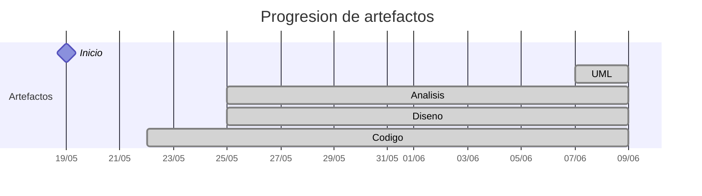

# Timeline - jerdier

> Repo: [jerdier/25-26-idsw2-sdVC](https://github.com/jerdier/25-26-idsw2-sdVC)
> Commits: 46 | Días activos: 16 | Sesiones log: 17

## Patrón observado

| Métrica | Valor |
|---|---|
| Commits propios | 46 (30 feat / 6 fix / 10 other) |
| Ratio fix/feat | 0.20 |
| Días activos | 16 |
| Sesiones documentadas | 17 |
| Sesiones sin fecha en log | 17 |

<!-- trazabilidad: manual -->
## Trazabilidad por caso de uso

| Caso de uso | D20 |
|---|:---:|
| `administrador/consultarUsuario` | AD |
| `administrador/crearUsuario` | AD |
| `administrador/editarUsuario` | AD |
| `alumno/consultarSolicitudDispensa` | AD |
| `alumno/crearSolicitudDispensa` | AD |
| `alumno/editarSolicitudDispensa` | AD |
| `directorDeGrado/consultarSolicitudDispensa` | AD |
| `directorDeGrado/editarSolicitudDispensa` | AD |
| `profesor/cerrarSesionClase` | AD |
| `profesor/consultarDetalleAlumno` | AD |
| `profesor/consultarListaAlumnos` | AD |
| `profesor/consultarSolicitudDispensa` | AD |
| `profesor/crearSesionClase` | AD |
| `profesor/editarSesionClase` | AD |
| `profesor/exportarHistorialAsistencias` | AD |
| `profesor/registrarTomaAsistencia` | AD |
| `secretaria/consultarDetalleMatricula` | AD |
| `secretaria/consultarListaAlumnos` | AD |
| `secretaria/consultarSolicitudDispensa` | AD |
| `secretaria/crearSolicitudDispensa` | AD |
| `secretaria/editarSolicitudDispensa` | AD |
| `secretaria/exportarDispensas` | AD |
| `secretaria/importarListasAlumnos` | AD |
| `secretaria/importarMatricula` | AD |

---

## Día 2 · 2026-05-20

### Commits (1: 1 feat / 0 fix)

| Hora | Mensaje |
|---|---|
| 21:48 | [feat: QUE_HACE.md](https://github.com/jerdier/25-26-idsw2-sdVC/commit/8bbeba4cc0fc6bb3f55304137660d7a8dd340a23) |

> ⚠️ Commits sin entrada en log

---

## Día 4 · 2026-05-22

### Commits (4: 3 feat / 0 fix)

| Hora | Mensaje |
|---|---|
| 17:54 | [Merge branch 'main' of https://github.com/jerdier/25-26-idsw2-sdVC](https://github.com/jerdier/25-26-idsw2-sdVC/commit/252e1e0664ecf7039e419b0ff0573c7ce7ccad48) |
| 17:51 | [feat: SetUp Backend y Frontend Vue](https://github.com/jerdier/25-26-idsw2-sdVC/commit/d7d6705964bd55ca9584a27b3fca30e6a5f1ce9f) |
| 17:37 | [feat: Conversación segunda sesión Set up project](https://github.com/jerdier/25-26-idsw2-sdVC/commit/31b8b735e343428eee94610729f75869286e0635) |
| 17:12 | [feat: Conversación primera sesión RoadMap](https://github.com/jerdier/25-26-idsw2-sdVC/commit/d6f4c11d2d8e03ca556d214230402004cd30bd48) |

**Artefactos nuevos:** 🔌 

> ⚠️ Commits sin entrada en log

---

## Día 6 · 2026-05-24

### Commits (3: 3 feat / 0 fix)

| Hora | Mensaje |
|---|---|
| 15:54 | [feat: Conversación tercera sesión BD prisma](https://github.com/jerdier/25-26-idsw2-sdVC/commit/06b3eb4abdf5265b2208f3607aa176d1dca34348) |
| 15:52 | [feat: DiagramaClases utilizado para la BD](https://github.com/jerdier/25-26-idsw2-sdVC/commit/2fc071a95f0487daddd627e6cbe2cd69eedb2585) |
| 15:50 | [feat: DiagramaClases utilizado para la BD](https://github.com/jerdier/25-26-idsw2-sdVC/commit/e47c8bd190cc4b4e2b08285b0f5be59ec5067b6f) |

> ⚠️ Commits sin entrada en log

---

## Día 7 · 2026-05-25

### Commits (7: 1 feat / 3 fix)

| Hora | Mensaje |
|---|---|
| 00:33 | [fix: conversation_log](https://github.com/jerdier/25-26-idsw2-sdVC/commit/7bb61c15b510f8af9fc8bf3d9c636371d159359c) |
| 00:29 | [fix: images](https://github.com/jerdier/25-26-idsw2-sdVC/commit/fd92bbfe7b633c0b856aa46ecb932402df2bc0fc) |
| 00:20 | [style: actualizar imágenes a formato SVG y renombrar diagrama de clases](https://github.com/jerdier/25-26-idsw2-sdVC/commit/6a731ba7df6e2d9d7acfe61e4994176ff730fd0f) |
| 22:05 | [fix: hora inicio sesion](https://github.com/jerdier/25-26-idsw2-sdVC/commit/faf955ece959361af23cb62af23a543ca29d43d5) |
| 21:59 | [feat: esqueleto backend express y actualización RUP](https://github.com/jerdier/25-26-idsw2-sdVC/commit/891c0fcc597a03eb81e6c688c656970b6f94ce14) |
| 21:54 | [docs: estructurar RUP, descargar diagramas y diseñar API (Fase 3)](https://github.com/jerdier/25-26-idsw2-sdVC/commit/f3b69ae96fd50b15a45fa080b8fa7c1a5ede2232) |
| 20:44 | [docs: iniciar fase de análisis basada en enmabry/25-26-IdSw1-SdR y referencia pySigHor](https://github.com/jerdier/25-26-idsw2-sdVC/commit/f28530c97cab18b5e7f485ef696b9b8782e53701) |

**Artefactos nuevos:** 🔍 🧩 

> ⚠️ Commits sin entrada en log

---

## Día 8 · 2026-05-26

### Commits (2: 0 feat / 0 fix)

| Hora | Mensaje |
|---|---|
| 22:26 | [docs: finalización de la fase de análisis MVC](https://github.com/jerdier/25-26-idsw2-sdVC/commit/f7144e14b6b83d4b03c5277408b50390891d1a92) |
| 22:19 | [docs: reorganización de activos UML y consolidación de la fase de](https://github.com/jerdier/25-26-idsw2-sdVC/commit/a286408836ec251d16c7470240ef706b208ea1c9) |

> ⚠️ Commits sin entrada en log

---

## Día 9 · 2026-05-27

### Commits (1: 0 feat / 0 fix)

| Hora | Mensaje |
|---|---|
| 22:45 | [design: especificación de contratos de API REST y estructuración de la](https://github.com/jerdier/25-26-idsw2-sdVC/commit/c1ae9fd485ec6ebff15d9c9d0a9b7d82b7c79f74) |

> ⚠️ Commits sin entrada en log

---

## Día 11 · 2026-05-29

### Commits (2: 1 feat / 1 fix)

| Hora | Mensaje |
|---|---|
| 12:14 | [feat(design): completar refinamiento de capa de datos y tipado técnico](https://github.com/jerdier/25-26-idsw2-sdVC/commit/3267de5083de4983731f9b80ce38f66c2a121228) |
| 11:44 | [fix: analisis](https://github.com/jerdier/25-26-idsw2-sdVC/commit/61d426dbaba53f04882678d6a73b4a6cee3ec89a) |

> ⚠️ Commits sin entrada en log

---

## Día 12 · 2026-05-30

### Commits (2: 2 feat / 0 fix)

| Hora | Mensaje |
|---|---|
| 16:25 | [feat(frontend): setup project infrastructure, routing, and core views (Phase 4)](https://github.com/jerdier/25-26-idsw2-sdVC/commit/51da10bbe1c7096571f9217fc0a9e041b4e2d90f) |
| 16:21 | [feat(backend): implement services and controllers architecture (Phase 3 Part 3)](https://github.com/jerdier/25-26-idsw2-sdVC/commit/5627c28c508f8a9c5e236f0418645be8ca11519b) |

> ⚠️ Commits sin entrada en log

---

## Día 13 · 2026-05-31

### Commits (1: 0 feat / 0 fix)

| Hora | Mensaje |
|---|---|
| 19:44 | [func(asistencia): sincronizar tipos y crear servicio de conexión en el frontend](https://github.com/jerdier/25-26-idsw2-sdVC/commit/2feef8eaa909c5bbdad6b846a44e4486f75061f4) |

> ⚠️ Commits sin entrada en log

---

## Día 14 · 2026-06-01

### Commits (2: 1 feat / 1 fix)

| Hora | Mensaje |
|---|---|
| 17:07 | [fix: corrección archivos backend src](https://github.com/jerdier/25-26-idsw2-sdVC/commit/10a7728eee8d656b2188ec7b760ac8ec705da57f) |
| 16:42 | [feat: implement attendance vertical slice and professor](https://github.com/jerdier/25-26-idsw2-sdVC/commit/7f2767ba6bb9c9c59ef31e2793d80f271c1e61e4) |

> ⚠️ Commits sin entrada en log

---

## Día 15 · 2026-06-02

### Commits (2: 1 feat / 0 fix)

| Hora | Mensaje |
|---|---|
| 22:17 | [feat: módulo de dispensas (alumno), tipos y actualización del log](https://github.com/jerdier/25-26-idsw2-sdVC/commit/fa0759df149204e3077229e99d573f9104222868) |
| 21:29 | [mantenimiento: limpieza de base de datos y corrección de tipos de Node](https://github.com/jerdier/25-26-idsw2-sdVC/commit/357030548d64ca3d526f0b10b1f1860026636fb8) |

> ⚠️ Commits sin entrada en log

---

## Día 16 · 2026-06-03

### Commits (3: 3 feat / 0 fix)

| Hora | Mensaje |
|---|---|
| 23:17 | [feat: implementado módulo de Secretaría y estabilización técnica del frontend](https://github.com/jerdier/25-26-idsw2-sdVC/commit/435547ead4f07886ae1e132775a26e1040b869ee) |
| 22:35 | [feat: implementado módulo de Secretaría Académica para gestión administrativa](https://github.com/jerdier/25-26-idsw2-sdVC/commit/fb37e0929eb3709ead777620593bb864f182bed6) |
| 21:59 | [feat: implementado flujo de aprobación de dispensas y panel del director](https://github.com/jerdier/25-26-idsw2-sdVC/commit/1081e05b1ed29f55301d16c505ce8f7f9f548f26) |

> ⚠️ Commits sin entrada en log

---

## Día 17 · 2026-06-04

### Commits (2: 2 feat / 0 fix)

| Hora | Mensaje |
|---|---|
| 20:53 | [feat: implementada autenticación real y habilitada conectividad CORS](https://github.com/jerdier/25-26-idsw2-sdVC/commit/e1495aaada344e9cab5bf3eddf24181334f1e51e) |
| 13:39 | [feat: implementada autenticación real por email y persistencia de sesión](https://github.com/jerdier/25-26-idsw2-sdVC/commit/22c88ebb5d68015b013714a373af19c556682c41) |

> ⚠️ Commits sin entrada en log

---

## Día 18 · 2026-06-05

### Commits (2: 1 feat / 1 fix)

| Hora | Mensaje |
|---|---|
| 22:46 | [feat: profesionalización integral, seguridad y refinamiento de UI](https://github.com/jerdier/25-26-idsw2-sdVC/commit/edc9fda44b0097a52fb559dca9e9eb4896b0fefe) |
| 09:47 | [fix: conversatio_log](https://github.com/jerdier/25-26-idsw2-sdVC/commit/4d551e1afdcce8a5b78eda697ab83ea80195a8eb) |

> ⚠️ Commits sin entrada en log

---

## Día 20 · 2026-06-07

### Commits (11: 10 feat / 0 fix)

| Hora | Mensaje |
|---|---|
| 20:28 | [feat: diseño secretaria](https://github.com/jerdier/25-26-idsw2-sdVC/commit/16722fce9dc1d7d5a970b232ff4959bd3a6b8496) |
| 19:42 | [feat: diseño profesor](https://github.com/jerdier/25-26-idsw2-sdVC/commit/ea127ebca0d0cb2aba1d85942a6fc44325406cca) |
| 19:11 | [feat: diseño directorDeGrado](https://github.com/jerdier/25-26-idsw2-sdVC/commit/51e09e1dc8a522d934268d04baa8951149d40a21) |
| 18:58 | [feat: diseño alumno](https://github.com/jerdier/25-26-idsw2-sdVC/commit/3a6ef107878e99025679d7361fe2d7422cfb1677) |
| 18:52 | [feat: diseño administrador](https://github.com/jerdier/25-26-idsw2-sdVC/commit/f3016e4f813164613b50009cc50c90d9bc2317a2) |
| 16:54 | [feat: analisis secretaria](https://github.com/jerdier/25-26-idsw2-sdVC/commit/b5dbf5d34312dfd52774adb2e68b80b73c45a150) |
| 15:39 | [feat: analisis profesor](https://github.com/jerdier/25-26-idsw2-sdVC/commit/604b8fe76e64460f724d84699ccd24bc5921f46f) |
| 14:12 | [feat: analisis directorDeGrado](https://github.com/jerdier/25-26-idsw2-sdVC/commit/4fe72b2408aa697ed1f31428855c62c75c306c93) |
| 13:13 | [feat: analisis alumno](https://github.com/jerdier/25-26-idsw2-sdVC/commit/e3187b9cbbb419da2ed5e4dadd685418c7f1dc68) |
| 12:53 | [feat: analisis administrador uml svg](https://github.com/jerdier/25-26-idsw2-sdVC/commit/7c8d3a2cbd02d04012b3cec4ff0746bd0726eb4d) |
| 12:49 | [change: reestructuración directorios](https://github.com/jerdier/25-26-idsw2-sdVC/commit/c1bb91f5e25242a8d2c620daf27362aacb18bc72) |

**Artefactos nuevos:** 📐 

> ⚠️ Commits sin entrada en log

---

## Día 21 · 2026-06-08

### Commits (1: 1 feat / 0 fix)

| Hora | Mensaje |
|---|---|
| 20:36 | [feat: mejoras codigo](https://github.com/jerdier/25-26-idsw2-sdVC/commit/e7c70172a8b83364f53a55eba0e13d49ba8ad4ab) |

> ⚠️ Commits sin entrada en log

---

