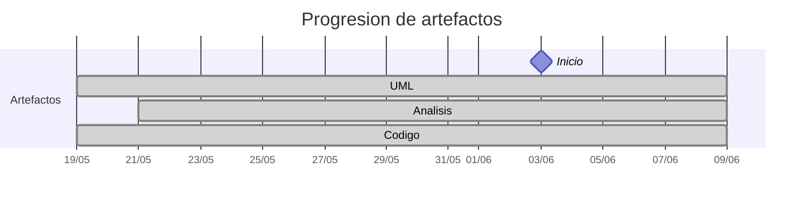

# Timeline - liamanderson873

> Repo: [liamanderson873/25-26-idsw2-sdVC](https://github.com/liamanderson873/25-26-idsw2-sdVC)
> Commits: 99 | Días activos: 5 | Sesiones log: 0

## Patrón observado

| Métrica | Valor |
|---|---|
| Commits propios | 99 (15 feat / 25 fix / 59 other) |
| Ratio fix/feat | 1.66 |
| Días activos | 5 |
| Sesiones documentadas | 0 |

<!-- trazabilidad: manual -->
## Trazabilidad por caso de uso

> D17 (4-jun): commits específicos de AsignarExamen (CU-09) y corrección masiva (CU-01). D18 (5-jun): auditoria de examenes y simulacion (CU-01/42/43). D19 (6-jun): `feat: PUT para todas las entidades` — CRUD completo backend (CU-10..29) + diseño batch 2. D20 (7-jun): feature completion — generar/asignar/ver/corregir examenes, importar/exportar, dashboard.

| Caso de uso | D6 | D16 | D17 | D18 | D19 | D20 |
|---|:---:|:---:|:---:|:---:|:---:|:---:|
| `CU-01-corregirExamenes` | [A](https://github.com/liamanderson873/25-26-idsw2-sdVC/tree/main/RUP/01-analisis/casos-uso/CU-01-corregirExamenes) | [D](https://github.com/liamanderson873/25-26-idsw2-sdVC/tree/main/RUP/02-dise%C3%B1o/casos-uso/CU-01-corregirExamenes) | [d](https://github.com/liamanderson873/25-26-idsw2-sdVC/blob/main/frontend/src/pages/CorregirExamenPage.tsx) | [d](https://github.com/liamanderson873/25-26-idsw2-sdVC/blob/main/frontend/src/pages/CorregirExamenPage.tsx) |  | [d](https://github.com/liamanderson873/25-26-idsw2-sdVC/blob/main/frontend/src/pages/CorregirExamenPage.tsx) |
| `CU-02-generarExamenes` | [A](https://github.com/liamanderson873/25-26-idsw2-sdVC/tree/main/RUP/01-analisis/casos-uso/CU-02-generarExamenes) | [D](https://github.com/liamanderson873/25-26-idsw2-sdVC/tree/main/RUP/02-dise%C3%B1o/casos-uso/CU-02-generarExamenes) |  | [d](https://github.com/liamanderson873/25-26-idsw2-sdVC/blob/main/frontend/src/pages/GenerarExamenPage.tsx) |  | [d](https://github.com/liamanderson873/25-26-idsw2-sdVC/blob/main/frontend/src/pages/GenerarExamenPage.tsx) |
| `CU-03-importarConfiguracionGlobal` | [A](https://github.com/liamanderson873/25-26-idsw2-sdVC/tree/main/RUP/01-analisis/casos-uso/CU-03-importarConfiguracionGlobal) |  |  |  | [D](https://github.com/liamanderson873/25-26-idsw2-sdVC/tree/main/RUP/02-dise%C3%B1o/casos-uso/CU-03-importarConfiguracionGlobal)[d](https://github.com/liamanderson873/25-26-idsw2-sdVC/blob/main/frontend/src/pages/ImportarExportarPage.tsx) | [d](https://github.com/liamanderson873/25-26-idsw2-sdVC/blob/main/frontend/src/pages/ImportarExportarPage.tsx) |
| `CU-04-exportarConfiguracionGlobal` | [A](https://github.com/liamanderson873/25-26-idsw2-sdVC/tree/main/RUP/01-analisis/casos-uso/CU-04-exportarConfiguracionGlobal) |  |  |  | [D](https://github.com/liamanderson873/25-26-idsw2-sdVC/tree/main/RUP/02-dise%C3%B1o/casos-uso/CU-04-exportarConfiguracionGlobal)[d](https://github.com/liamanderson873/25-26-idsw2-sdVC/blob/main/frontend/src/pages/ImportarExportarPage.tsx) | [d](https://github.com/liamanderson873/25-26-idsw2-sdVC/blob/main/frontend/src/pages/ImportarExportarPage.tsx) |
| `CU-05-importarAlumnos` | [A](https://github.com/liamanderson873/25-26-idsw2-sdVC/tree/main/RUP/01-analisis/casos-uso/CU-05-importarAlumnos) | [D](https://github.com/liamanderson873/25-26-idsw2-sdVC/tree/main/RUP/02-dise%C3%B1o/casos-uso/CU-05-importarAlumnos) |  |  | [d](https://github.com/liamanderson873/25-26-idsw2-sdVC/blob/main/frontend/src/pages/ImportarExportarPage.tsx) | [d](https://github.com/liamanderson873/25-26-idsw2-sdVC/blob/main/frontend/src/pages/ImportarExportarPage.tsx) |
| `CU-06-importarPreguntas` | [A](https://github.com/liamanderson873/25-26-idsw2-sdVC/tree/main/RUP/01-analisis/casos-uso/CU-06-importarPreguntas) | [D](https://github.com/liamanderson873/25-26-idsw2-sdVC/tree/main/RUP/02-dise%C3%B1o/casos-uso/CU-06-importarPreguntas) |  |  | [d](https://github.com/liamanderson873/25-26-idsw2-sdVC/blob/main/frontend/src/pages/ImportarExportarPage.tsx) | [d](https://github.com/liamanderson873/25-26-idsw2-sdVC/blob/main/frontend/src/pages/ImportarExportarPage.tsx) |
| `CU-07-exportarAlumnos` | [A](https://github.com/liamanderson873/25-26-idsw2-sdVC/tree/main/RUP/01-analisis/casos-uso/CU-07-exportarAlumnos) |  |  |  | [D](https://github.com/liamanderson873/25-26-idsw2-sdVC/tree/main/RUP/02-dise%C3%B1o/casos-uso/CU-07-exportarAlumnos)[d](https://github.com/liamanderson873/25-26-idsw2-sdVC/blob/main/frontend/src/pages/ImportarExportarPage.tsx) | [d](https://github.com/liamanderson873/25-26-idsw2-sdVC/blob/main/frontend/src/pages/ImportarExportarPage.tsx) |
| `CU-08-exportarPreguntas` | [A](https://github.com/liamanderson873/25-26-idsw2-sdVC/tree/main/RUP/01-analisis/casos-uso/CU-08-exportarPreguntas) |  |  |  | [D](https://github.com/liamanderson873/25-26-idsw2-sdVC/tree/main/RUP/02-dise%C3%B1o/casos-uso/CU-08-exportarPreguntas)[d](https://github.com/liamanderson873/25-26-idsw2-sdVC/blob/main/frontend/src/pages/ImportarExportarPage.tsx) | [d](https://github.com/liamanderson873/25-26-idsw2-sdVC/blob/main/frontend/src/pages/ImportarExportarPage.tsx) |
| `CU-09-asignarExamenes` | [A](https://github.com/liamanderson873/25-26-idsw2-sdVC/tree/main/RUP/01-analisis/casos-uso/CU-09-asignarExamenes) | [D](https://github.com/liamanderson873/25-26-idsw2-sdVC/tree/main/RUP/02-dise%C3%B1o/casos-uso/CU-09-asignarExamenes) | [d](https://github.com/liamanderson873/25-26-idsw2-sdVC/blob/main/frontend/src/pages/AsignarExamenPage.tsx) |  |  | [d](https://github.com/liamanderson873/25-26-idsw2-sdVC/blob/main/frontend/src/pages/AsignarExamenPage.tsx) |
| `CU-10-crearPregunta` | [A](https://github.com/liamanderson873/25-26-idsw2-sdVC/tree/main/RUP/01-analisis/casos-uso/CU-10-crearPregunta) | [D](https://github.com/liamanderson873/25-26-idsw2-sdVC/tree/main/RUP/02-dise%C3%B1o/casos-uso/CU-10-crearPregunta) |  |  | [d](https://github.com/liamanderson873/25-26-idsw2-sdVC/blob/main/frontend/src/pages/PreguntasPage.tsx) |  |
| `CU-11-editarPregunta` | [A](https://github.com/liamanderson873/25-26-idsw2-sdVC/tree/main/RUP/01-analisis/casos-uso/CU-11-editarPregunta) | [D](https://github.com/liamanderson873/25-26-idsw2-sdVC/tree/main/RUP/02-dise%C3%B1o/casos-uso/CU-11-editarPregunta) |  |  | [d](https://github.com/liamanderson873/25-26-idsw2-sdVC/blob/main/frontend/src/pages/PreguntasPage.tsx) |  |
| `CU-12-editarAsignatura` | [A](https://github.com/liamanderson873/25-26-idsw2-sdVC/tree/main/RUP/01-analisis/casos-uso/CU-12-editarAsignatura) | [D](https://github.com/liamanderson873/25-26-idsw2-sdVC/tree/main/RUP/02-dise%C3%B1o/casos-uso/CU-12-editarAsignatura) |  |  | [d](https://github.com/liamanderson873/25-26-idsw2-sdVC/blob/main/frontend/src/pages/AsignaturasPage.tsx) |  |
| `CU-13-crearDocente` | [A](https://github.com/liamanderson873/25-26-idsw2-sdVC/tree/main/RUP/01-analisis/casos-uso/CU-13-crearDocente) | [D](https://github.com/liamanderson873/25-26-idsw2-sdVC/tree/main/RUP/02-dise%C3%B1o/casos-uso/CU-13-crearDocente) |  |  | [d](https://github.com/liamanderson873/25-26-idsw2-sdVC/blob/main/frontend/src/pages/ProfesoresPage.tsx) |  |
| `CU-14-crearAlumno` | [A](https://github.com/liamanderson873/25-26-idsw2-sdVC/tree/main/RUP/01-analisis/casos-uso/CU-14-crearAlumno) | [D](https://github.com/liamanderson873/25-26-idsw2-sdVC/tree/main/RUP/02-dise%C3%B1o/casos-uso/CU-14-crearAlumno) |  |  | [d](https://github.com/liamanderson873/25-26-idsw2-sdVC/blob/main/frontend/src/pages/AlumnosPage.tsx) |  |
| `CU-15-editarDocente` | [A](https://github.com/liamanderson873/25-26-idsw2-sdVC/tree/main/RUP/01-analisis/casos-uso/CU-15-editarDocente) | [D](https://github.com/liamanderson873/25-26-idsw2-sdVC/tree/main/RUP/02-dise%C3%B1o/casos-uso/CU-15-editarDocente) |  |  | [d](https://github.com/liamanderson873/25-26-idsw2-sdVC/blob/main/frontend/src/pages/ProfesoresPage.tsx) |  |
| `CU-16-editarAlumno` | [A](https://github.com/liamanderson873/25-26-idsw2-sdVC/tree/main/RUP/01-analisis/casos-uso/CU-16-editarAlumno) | [D](https://github.com/liamanderson873/25-26-idsw2-sdVC/tree/main/RUP/02-dise%C3%B1o/casos-uso/CU-16-editarAlumno) |  |  | [d](https://github.com/liamanderson873/25-26-idsw2-sdVC/blob/main/frontend/src/pages/AlumnosPage.tsx) |  |
| `CU-17-crearGrado` | [A](https://github.com/liamanderson873/25-26-idsw2-sdVC/tree/main/RUP/01-analisis/casos-uso/CU-17-crearGrado) | [D](https://github.com/liamanderson873/25-26-idsw2-sdVC/tree/main/RUP/02-dise%C3%B1o/casos-uso/CU-17-crearGrado) |  |  | [d](https://github.com/liamanderson873/25-26-idsw2-sdVC/blob/main/frontend/src/pages/GradosPage.tsx) |  |
| `CU-18-crearAsignatura` | [A](https://github.com/liamanderson873/25-26-idsw2-sdVC/tree/main/RUP/01-analisis/casos-uso/CU-18-crearAsignatura) | [D](https://github.com/liamanderson873/25-26-idsw2-sdVC/tree/main/RUP/02-dise%C3%B1o/casos-uso/CU-18-crearAsignatura) |  |  | [d](https://github.com/liamanderson873/25-26-idsw2-sdVC/blob/main/frontend/src/pages/AsignaturasPage.tsx) |  |
| `CU-19-editarGrado` | [A](https://github.com/liamanderson873/25-26-idsw2-sdVC/tree/main/RUP/01-analisis/casos-uso/CU-19-editarGrado) | [D](https://github.com/liamanderson873/25-26-idsw2-sdVC/tree/main/RUP/02-dise%C3%B1o/casos-uso/CU-19-editarGrado) |  |  | [d](https://github.com/liamanderson873/25-26-idsw2-sdVC/blob/main/frontend/src/pages/GradosPage.tsx) |  |
| `CU-20-verPreguntas` | [A](https://github.com/liamanderson873/25-26-idsw2-sdVC/tree/main/RUP/01-analisis/casos-uso/CU-20-verPreguntas) | [D](https://github.com/liamanderson873/25-26-idsw2-sdVC/tree/main/RUP/02-dise%C3%B1o/casos-uso/CU-20-verPreguntas) |  |  | [d](https://github.com/liamanderson873/25-26-idsw2-sdVC/blob/main/frontend/src/pages/PreguntasPage.tsx) |  |
| `CU-21-verAsignaturas` | [A](https://github.com/liamanderson873/25-26-idsw2-sdVC/tree/main/RUP/01-analisis/casos-uso/CU-21-verAsignaturas) | [D](https://github.com/liamanderson873/25-26-idsw2-sdVC/tree/main/RUP/02-dise%C3%B1o/casos-uso/CU-21-verAsignaturas) |  |  | [d](https://github.com/liamanderson873/25-26-idsw2-sdVC/blob/main/frontend/src/pages/AsignaturasPage.tsx) |  |
| `CU-22-verGrados` | [A](https://github.com/liamanderson873/25-26-idsw2-sdVC/tree/main/RUP/01-analisis/casos-uso/CU-22-verGrados) | [D](https://github.com/liamanderson873/25-26-idsw2-sdVC/tree/main/RUP/02-dise%C3%B1o/casos-uso/CU-22-verGrados) |  |  | [d](https://github.com/liamanderson873/25-26-idsw2-sdVC/blob/main/frontend/src/pages/GradosPage.tsx) |  |
| `CU-23-verAlumnos` | [A](https://github.com/liamanderson873/25-26-idsw2-sdVC/tree/main/RUP/01-analisis/casos-uso/CU-23-verAlumnos) | [D](https://github.com/liamanderson873/25-26-idsw2-sdVC/tree/main/RUP/02-dise%C3%B1o/casos-uso/CU-23-verAlumnos) |  |  | [d](https://github.com/liamanderson873/25-26-idsw2-sdVC/blob/main/frontend/src/pages/AlumnosPage.tsx) |  |
| `CU-24-verDocentes` | [A](https://github.com/liamanderson873/25-26-idsw2-sdVC/tree/main/RUP/01-analisis/casos-uso/CU-24-verDocentes) | [D](https://github.com/liamanderson873/25-26-idsw2-sdVC/tree/main/RUP/02-dise%C3%B1o/casos-uso/CU-24-verDocentes) |  |  | [d](https://github.com/liamanderson873/25-26-idsw2-sdVC/blob/main/frontend/src/pages/ProfesoresPage.tsx) |  |
| `CU-25-eliminarPregunta` | [A](https://github.com/liamanderson873/25-26-idsw2-sdVC/tree/main/RUP/01-analisis/casos-uso/CU-25-eliminarPregunta) | [D](https://github.com/liamanderson873/25-26-idsw2-sdVC/tree/main/RUP/02-dise%C3%B1o/casos-uso/CU-25-eliminarPregunta) |  |  | [d](https://github.com/liamanderson873/25-26-idsw2-sdVC/blob/main/frontend/src/pages/PreguntasPage.tsx) |  |
| `CU-26-eliminarAsignatura` | [A](https://github.com/liamanderson873/25-26-idsw2-sdVC/tree/main/RUP/01-analisis/casos-uso/CU-26-eliminarAsignatura) | [D](https://github.com/liamanderson873/25-26-idsw2-sdVC/tree/main/RUP/02-dise%C3%B1o/casos-uso/CU-26-eliminarAsignatura) |  |  | [d](https://github.com/liamanderson873/25-26-idsw2-sdVC/blob/main/frontend/src/pages/AsignaturasPage.tsx) |  |
| `CU-27-eliminarGrado` | [A](https://github.com/liamanderson873/25-26-idsw2-sdVC/tree/main/RUP/01-analisis/casos-uso/CU-27-eliminarGrado) | [D](https://github.com/liamanderson873/25-26-idsw2-sdVC/tree/main/RUP/02-dise%C3%B1o/casos-uso/CU-27-eliminarGrado) |  |  | [d](https://github.com/liamanderson873/25-26-idsw2-sdVC/blob/main/frontend/src/pages/GradosPage.tsx) |  |
| `CU-28-eliminarAlumno` | [A](https://github.com/liamanderson873/25-26-idsw2-sdVC/tree/main/RUP/01-analisis/casos-uso/CU-28-eliminarAlumno) | [D](https://github.com/liamanderson873/25-26-idsw2-sdVC/tree/main/RUP/02-dise%C3%B1o/casos-uso/CU-28-eliminarAlumno) |  |  | [d](https://github.com/liamanderson873/25-26-idsw2-sdVC/blob/main/frontend/src/pages/AlumnosPage.tsx) |  |
| `CU-29-eliminarDocente` | [A](https://github.com/liamanderson873/25-26-idsw2-sdVC/tree/main/RUP/01-analisis/casos-uso/CU-29-eliminarDocente) | [D](https://github.com/liamanderson873/25-26-idsw2-sdVC/tree/main/RUP/02-dise%C3%B1o/casos-uso/CU-29-eliminarDocente) |  |  | [d](https://github.com/liamanderson873/25-26-idsw2-sdVC/blob/main/frontend/src/pages/ProfesoresPage.tsx) |  |
| `CU-30-iniciarSesion` | [A](https://github.com/liamanderson873/25-26-idsw2-sdVC/tree/main/RUP/01-analisis/casos-uso/CU-30-iniciarSesion) |  | [d](https://github.com/liamanderson873/25-26-idsw2-sdVC/blob/main/frontend/src/pages/LoginPage.tsx) |  | [D](https://github.com/liamanderson873/25-26-idsw2-sdVC/tree/main/RUP/02-dise%C3%B1o/casos-uso/CU-30-iniciarSesion) |  |
| `CU-31-cerrarSesion` | [A](https://github.com/liamanderson873/25-26-idsw2-sdVC/tree/main/RUP/01-analisis/casos-uso/CU-31-cerrarSesion) |  | [d](https://github.com/liamanderson873/25-26-idsw2-sdVC/blob/main/frontend/src/pages/LoginPage.tsx) |  | [D](https://github.com/liamanderson873/25-26-idsw2-sdVC/tree/main/RUP/02-dise%C3%B1o/casos-uso/CU-31-cerrarSesion) |  |
| `CU-32-completarGestion` | [A](https://github.com/liamanderson873/25-26-idsw2-sdVC/tree/main/RUP/01-analisis/casos-uso/CU-32-completarGestion) |  |  |  | [D](https://github.com/liamanderson873/25-26-idsw2-sdVC/tree/main/RUP/02-dise%C3%B1o/casos-uso/CU-32-completarGestion) | [d](https://github.com/liamanderson873/25-26-idsw2-sdVC/blob/main/frontend/src/pages/DashboardPage.tsx) |
| `CU-33-verRespuestas` | [A](https://github.com/liamanderson873/25-26-idsw2-sdVC/tree/main/RUP/01-analisis/casos-uso/CU-33-verRespuestas) |  |  |  | [D](https://github.com/liamanderson873/25-26-idsw2-sdVC/tree/main/RUP/02-dise%C3%B1o/casos-uso/CU-33-verRespuestas)[d](https://github.com/liamanderson873/25-26-idsw2-sdVC/blob/main/frontend/src/pages/PreguntasPage.tsx) |  |
| `CU-34-crearRespuesta` | [A](https://github.com/liamanderson873/25-26-idsw2-sdVC/tree/main/RUP/01-analisis/casos-uso/CU-34-crearRespuesta) |  |  |  | [D](https://github.com/liamanderson873/25-26-idsw2-sdVC/tree/main/RUP/02-dise%C3%B1o/casos-uso/CU-34-crearRespuesta)[d](https://github.com/liamanderson873/25-26-idsw2-sdVC/blob/main/frontend/src/pages/PreguntasPage.tsx) |  |
| `CU-35-editarRespuesta` | [A](https://github.com/liamanderson873/25-26-idsw2-sdVC/tree/main/RUP/01-analisis/casos-uso/CU-35-editarRespuesta) |  |  |  | [D](https://github.com/liamanderson873/25-26-idsw2-sdVC/tree/main/RUP/02-dise%C3%B1o/casos-uso/CU-35-editarRespuesta)[d](https://github.com/liamanderson873/25-26-idsw2-sdVC/blob/main/frontend/src/pages/PreguntasPage.tsx) |  |
| `CU-36-eliminarRespuesta` | [A](https://github.com/liamanderson873/25-26-idsw2-sdVC/tree/main/RUP/01-analisis/casos-uso/CU-36-eliminarRespuesta) |  |  |  | [D](https://github.com/liamanderson873/25-26-idsw2-sdVC/tree/main/RUP/02-dise%C3%B1o/casos-uso/CU-36-eliminarRespuesta)[d](https://github.com/liamanderson873/25-26-idsw2-sdVC/blob/main/frontend/src/pages/PreguntasPage.tsx) |  |
| `CU-37-cancelarGeneracion` | [A](https://github.com/liamanderson873/25-26-idsw2-sdVC/tree/main/RUP/01-analisis/casos-uso/CU-37-cancelarGeneracion) |  |  |  | [D](https://github.com/liamanderson873/25-26-idsw2-sdVC/tree/main/RUP/02-dise%C3%B1o/casos-uso/CU-37-cancelarGeneracion) | [d](https://github.com/liamanderson873/25-26-idsw2-sdVC/blob/main/frontend/src/pages/GenerarExamenPage.tsx) |
| `CU-38-importarAsignaturas` | [A](https://github.com/liamanderson873/25-26-idsw2-sdVC/tree/main/RUP/01-analisis/casos-uso/CU-38-importarAsignaturas) |  |  |  | [D](https://github.com/liamanderson873/25-26-idsw2-sdVC/tree/main/RUP/02-dise%C3%B1o/casos-uso/CU-38-importarAsignaturas) | [d](https://github.com/liamanderson873/25-26-idsw2-sdVC/blob/main/frontend/src/pages/ImportarExportarPage.tsx) |
| `CU-39-importarGrados` | [A](https://github.com/liamanderson873/25-26-idsw2-sdVC/tree/main/RUP/01-analisis/casos-uso/CU-39-importarGrados) |  |  |  | [D](https://github.com/liamanderson873/25-26-idsw2-sdVC/tree/main/RUP/02-dise%C3%B1o/casos-uso/CU-39-importarGrados) | [d](https://github.com/liamanderson873/25-26-idsw2-sdVC/blob/main/frontend/src/pages/ImportarExportarPage.tsx) |
| `CU-40-exportarAsignaturas` | [A](https://github.com/liamanderson873/25-26-idsw2-sdVC/tree/main/RUP/01-analisis/casos-uso/CU-40-exportarAsignaturas) |  |  |  | [D](https://github.com/liamanderson873/25-26-idsw2-sdVC/tree/main/RUP/02-dise%C3%B1o/casos-uso/CU-40-exportarAsignaturas) | [d](https://github.com/liamanderson873/25-26-idsw2-sdVC/blob/main/frontend/src/pages/ImportarExportarPage.tsx) |
| `CU-41-exportarGrados` | [A](https://github.com/liamanderson873/25-26-idsw2-sdVC/tree/main/RUP/01-analisis/casos-uso/CU-41-exportarGrados) |  |  |  | [D](https://github.com/liamanderson873/25-26-idsw2-sdVC/tree/main/RUP/02-dise%C3%B1o/casos-uso/CU-41-exportarGrados) | [d](https://github.com/liamanderson873/25-26-idsw2-sdVC/blob/main/frontend/src/pages/ImportarExportarPage.tsx) |
| `CU-42-verExamen` |  |  |  | [d](https://github.com/liamanderson873/25-26-idsw2-sdVC/blob/main/frontend/src/pages/AuditoriaExamenesPage.tsx) |  | [A](https://github.com/liamanderson873/25-26-idsw2-sdVC/tree/main/RUP/01-analisis/casos-uso/CU-42-verExamen)[D](https://github.com/liamanderson873/25-26-idsw2-sdVC/tree/main/RUP/02-dise%C3%B1o/casos-uso/CU-42-verExamen)[d](https://github.com/liamanderson873/25-26-idsw2-sdVC/blob/main/frontend/src/pages/AuditoriaExamenesPage.tsx) |
| `CU-43-verExamenes` |  |  |  | [d](https://github.com/liamanderson873/25-26-idsw2-sdVC/blob/main/frontend/src/pages/AuditoriaExamenesPage.tsx) |  | [A](https://github.com/liamanderson873/25-26-idsw2-sdVC/tree/main/RUP/01-analisis/casos-uso/CU-43-verExamenes)[D](https://github.com/liamanderson873/25-26-idsw2-sdVC/tree/main/RUP/02-dise%C3%B1o/casos-uso/CU-43-verExamenes)[d](https://github.com/liamanderson873/25-26-idsw2-sdVC/blob/main/frontend/src/pages/AuditoriaExamenesPage.tsx) |

---

## Día 1 · 2026-06-03

### Commits (6: 0 feat / 0 fix)

| Hora | Mensaje |
|---|---|
| 22:17 | [docs: dejar de rastrear archivos de memoria y contexto en el repositorio remoto](https://github.com/liamanderson873/25-26-idsw2-sdVC/commit/8b6cd24112f7f92cd327be6afe4b6b66da685530) |
| 22:16 | [docs: consolidar memoria privada y trazabilidad teorica en el repositorio del proyecto](https://github.com/liamanderson873/25-26-idsw2-sdVC/commit/6cfefc76ffbec2b555d69805c64fd17579161892) |
| 22:14 | [docs: actualizar hitos recientes en contexto proyecto](https://github.com/liamanderson873/25-26-idsw2-sdVC/commit/221c7c983c033225d1bef60b5ef6418af865a978) |
| 22:14 | [docs: actualizar conversation log y contexto de proyecto con hito 31](https://github.com/liamanderson873/25-26-idsw2-sdVC/commit/7be112a3b7222c361c4337a4bb20812a5614982e) |
| 22:12 | [docs: corregir visualizacion de diagramas y codificacion de archivos README](https://github.com/liamanderson873/25-26-idsw2-sdVC/commit/c47d0eed395edb06f4c42388ef0d3990084ea9a2) |
| 22:04 | [docs: completar diagramas de secuencia de diseño para la épica de maestros y core](https://github.com/liamanderson873/25-26-idsw2-sdVC/commit/81d1304e853d90226c1e972e02fb8bfde105257f) |

> ⚠️ Commits sin entrada en log

---

## Día 2 · 2026-06-04

### Commits (16: 1 feat / 10 fix)

| Hora | Mensaje |
|---|---|
| 01:01 | [docs: finalize session 36 and secure context for restart](https://github.com/liamanderson873/25-26-idsw2-sdVC/commit/4a90d978466ae78c0d8577a8122f2dac5061df2b) |
| 00:51 | [fix: unblock UI and allow manual data recovery through frontend](https://github.com/liamanderson873/25-26-idsw2-sdVC/commit/7f069cab6dd09c59a8c7c32125831393a59a0d02) |
| 00:49 | [fix: make asignatura-grado relation nullable to prevent errors with existing data](https://github.com/liamanderson873/25-26-idsw2-sdVC/commit/6b5c2a96bb3b901b700c87a148b037d389e7ae2c) |
| 00:45 | [fix: total rebuild of AsignarExamenPage for max stability and individual sync tracking](https://github.com/liamanderson873/25-26-idsw2-sdVC/commit/5b4dfa4ff23cfcb623f950479f3e328922e092c9) |
| 00:43 | [fix: total structural stabilization of AsignarExamenPage and robust error handling](https://github.com/liamanderson873/25-26-idsw2-sdVC/commit/3c72430028df55d84c8952ac576ca8669a429201) |
| 00:42 | [fix: stabilize AsignarExamenPage with structural data safeguards and clean logs](https://github.com/liamanderson873/25-26-idsw2-sdVC/commit/4f3d358f2478f132047bafb8c528d086c5a0c5aa) |
| 00:39 | [fix: final null-safe check in AsignarExamenPage filtering](https://github.com/liamanderson873/25-26-idsw2-sdVC/commit/979cd7d2d73643a314d44450233780372be55e44) |
| 00:37 | [fix: exhaustive frontend hardening against null fields and data model changes](https://github.com/liamanderson873/25-26-idsw2-sdVC/commit/9a5923495c0da0760133dcc080306877c5a7d75b) |
| 00:34 | [fix: restore asignatura-grado relation, fix exam cache, and improve lifecycle flow](https://github.com/liamanderson873/25-26-idsw2-sdVC/commit/c360fc75051b81742f42a91fc790acda5c4525a4) |
| 00:28 | [fix: repair corrupted AsignarExamenPage.tsx and stabilize rendering](https://github.com/liamanderson873/25-26-idsw2-sdVC/commit/35acdfb1bad2dddd7489799a1d43c6d700d8c262) |
| 00:22 | [fix: resolve intermittent white screen and fix sidebar routes](https://github.com/liamanderson873/25-26-idsw2-sdVC/commit/6f4381010188eba4a4747d18b407474877191763) |
| 00:14 | [docs: add unified startup script start-all.ps1 and update instructions](https://github.com/liamanderson873/25-26-idsw2-sdVC/commit/984dd71bd1be55bf25dca1a54dae3a0b07b34201) |
| 05:05 | [docs: reinforce context persistence rules as a critical priority](https://github.com/liamanderson873/25-26-idsw2-sdVC/commit/cab6ed2194d589a5361bfc6b5f7d3280f7bf2699) |
| 05:03 | [docs: remove test data SQL and enforce PostgreSQL data population policy](https://github.com/liamanderson873/25-26-idsw2-sdVC/commit/e7b2fe2c77c273e09e357b6d29c6759b811fb87e) |
| 05:01 | [docs: clean up temporary scripts and update project rules](https://github.com/liamanderson873/25-26-idsw2-sdVC/commit/ff2a68db8b13282c64475a5b2c04e48dad54087d) |
| 04:56 | [feat: rediseño visual premium y motor de corrección masiva por IA](https://github.com/liamanderson873/25-26-idsw2-sdVC/commit/f899736aac82f6b53a5b36c77c1c019657e83446) |

> ⚠️ Commits sin entrada en log

---

## Día 3 · 2026-06-05

### Commits (9: 1 feat / 0 fix)

| Hora | Mensaje |
|---|---|
| 01:54 | [Jerarquía arquitectónica documentada en Trazabilidad y Diagrama ER reorganizado Top-Down](https://github.com/liamanderson873/25-26-idsw2-sdVC/commit/d6175fe339d9fff245e1893675cc6b4fd3a334c5) |
| 01:43 | [Restauración final de la jerarquía visual del diagrama ER (fiel al original)](https://github.com/liamanderson873/25-26-idsw2-sdVC/commit/7dd65eba71086ceba067b2052f7f369c1c2568c7) |
| 01:40 | [Restauración de estética visual del diagrama ER para coincidir con el diseño original (sin paquetes)](https://github.com/liamanderson873/25-26-idsw2-sdVC/commit/1149ceda250a5ba355899edffb6f20fc87b98e12) |
| 01:33 | [Perfeccionamiento final RUP: Jerarquía de diagramas corregida, navegación por logos interactivos y organización premium de la disciplina de diseño](https://github.com/liamanderson873/25-26-idsw2-sdVC/commit/c770c750d6e6df074a55fd03c09e3997c105de78) |
| 01:27 | [Organización final RUP: Navegación por badges interactivos, diagramas arquitectónicos agrupados e índice de casos de uso en Diseño](https://github.com/liamanderson873/25-26-idsw2-sdVC/commit/c15ae468911811c07932610c12dbe3a614b6fa68) |
| 01:11 | [Refinamiento de documentación: README Maestro con badges, visualización de diagramas y baseline local](https://github.com/liamanderson873/25-26-idsw2-sdVC/commit/5a7b36c75ad708a6f9d37fc38ec73b77f5723f48) |
| 00:58 | [Actualización del README maestro con visualización directa de diagramas (Antes vs Después)](https://github.com/liamanderson873/25-26-idsw2-sdVC/commit/7814c502898cf05ab04bdeefd36f8b0a916af016) |
| 00:56 | [Hito Final: Rediseño Premium, Seguridad RBAC, Mega-Población Realista y Sincronización RUP Evolucionada](https://github.com/liamanderson873/25-26-idsw2-sdVC/commit/d11f072032489f4c1ff984db3c14abc175afc8fa) |
| 02:57 | [feat: alineación total con prototipos RUP, auditoría de exámenes y flujo de simulación core funcional](https://github.com/liamanderson873/25-26-idsw2-sdVC/commit/a82d63bc519dc71fc53c158a42aff22808f8b9a3) |

> ⚠️ Commits sin entrada en log

---

## Día 4 · 2026-06-06

### Commits (22: 1 feat / 3 fix)

| Hora | Mensaje |
|---|---|
| 01:26 | [@](https://github.com/liamanderson873/25-26-idsw2-sdVC/commit/0485cb9c784c6654f0f1619482d3ffca71e07fa8) |
| 01:22 | [@](https://github.com/liamanderson873/25-26-idsw2-sdVC/commit/b75a477a8c860360515db26038e274930ebb3d39) |
| 00:54 | [@](https://github.com/liamanderson873/25-26-idsw2-sdVC/commit/16048ed6f5050b72eadfd5eb56d849f7cd8a526f) |
| 00:33 | [fix(analisis): renombrar objetos BCE a espanol en 41 CUs y corregir CU-04 diseno](https://github.com/liamanderson873/25-26-idsw2-sdVC/commit/adad787dda0c024f66768063172c426b5fdddb06) |
| 00:11 | [feat: PUT para todas las entidades y endpoint unico de configuracion global](https://github.com/liamanderson873/25-26-idsw2-sdVC/commit/7a6181c5ec6e94a42f5ed8ae3112f40d61402382) |
| 23:53 | [fix: corregir encoding mojibake en READMEs de analisis (42 ficheros)](https://github.com/liamanderson873/25-26-idsw2-sdVC/commit/a122641587d675f97987795badcf3bf902f8f2b3) |
| 23:47 | [RUP: completar diagramas de análisis y diseño para los 41 casos de uso](https://github.com/liamanderson873/25-26-idsw2-sdVC/commit/37f0351dc6a92076f7b3946fb21ca7b73e45e2d7) |
| 04:17 | [Merge pull request #9 from liamanderson873/develop](https://github.com/liamanderson873/25-26-idsw2-sdVC/commit/1e361907cb38de4a89a0f07bd5cc285111bc82f6) |
| 04:13 | [Saneamiento Definitivo: Restauración íntegra del historial y corrección total de caracteres especiales (UTF-8)](https://github.com/liamanderson873/25-26-idsw2-sdVC/commit/66fb07b7726e20f866b14603105040f7e679e66e) |
| 04:06 | [Saneamiento Final: Corrección de codificación Mojibake en el Log de Conversaciones](https://github.com/liamanderson873/25-26-idsw2-sdVC/commit/7a8be9337d5eb31dcd9e06ea4f1c0ef5d4f27872) |
| 03:52 | [Saneamiento Definitivo: Corrección de codificación en el Conversation Log sin archivos adicionales](https://github.com/liamanderson873/25-26-idsw2-sdVC/commit/4245272efb4a0a348aed5af492f63a4241fc7ee5) |
| 03:48 | [Registro Final: Restauración del historial íntegro del Conversation Log y consolidación de hitos con prompts detallados (Fix Encoding)](https://github.com/liamanderson873/25-26-idsw2-sdVC/commit/c0122d4cdb06acaa0e4697fd9a38224e9819f4f1) |
| 03:37 | [Saneamiento Final: Eliminado archivo temporal y corregida la codificación del Conversation Log](https://github.com/liamanderson873/25-26-idsw2-sdVC/commit/dbef38e6e661bceee9a5d5cca0a5b3d50b2777af) |
| 03:29 | [FIX: Restauración íntegra del historial histórico del Conversation Log y consolidación de hitos finales con prompts detallados](https://github.com/liamanderson873/25-26-idsw2-sdVC/commit/4f22494afd82482730e5844492a088d7b21125ab) |
| 03:15 | [Registro Final: Enriquecimiento del Conversation Log con prompts originales y detallados del usuario](https://github.com/liamanderson873/25-26-idsw2-sdVC/commit/4932022b94e744dae314f9f39f9a437dba62a2aa) |
| 03:11 | [Entrega Final: Documentación maestra sincronizada (Contexto, Log y Trazabilidad). Proyecto listo para PR a main.](https://github.com/liamanderson873/25-26-idsw2-sdVC/commit/d93a9152b0724f15a70d7e559770989d64f6b86a) |
| 03:07 | [Sincronización final de diagramas de secuencia: Reflejando la lógica real de corrección, marcas de auditoría y flujos de negocio actualizados](https://github.com/liamanderson873/25-26-idsw2-sdVC/commit/f92a37c85de631d68642f59792fcba5a1361a4e1) |
| 03:03 | [Documentación Completa: Añadido diagrama de Arquitectura Física y Stack Tecnológico (Vite/Spring/PostgreSQL)](https://github.com/liamanderson873/25-26-idsw2-sdVC/commit/8c10129aad786926755b69502dade50406ec0f39) |
| 02:59 | [Organización final: README de Diseño convertido en catálogo visual, corrección de visualización de diagramas originales y sincronización de jerarquías](https://github.com/liamanderson873/25-26-idsw2-sdVC/commit/2461af1a7000419810fc68337c0deb3ca06ac5f3) |
| 02:51 | [Sincronización final: Modelo del Dominio restaurado fielmente, limpieza de navegación en Análisis y READMEs de disciplina operativos](https://github.com/liamanderson873/25-26-idsw2-sdVC/commit/b1d7dd053cbeb7088f3409653a3dbf218096ea6d) |
| 02:46 | [Sincronización final RUP: Renombrado a 'Modelo del Dominio', restauración de estética visual original y actualización del Diagrama de Clases de Diseño](https://github.com/liamanderson873/25-26-idsw2-sdVC/commit/2902e7864f7339f6f0ea9dd61fbda93f6ef5d404) |
| 02:40 | [Refinamiento Final: UX reactiva, simulación probabilística y corrección manual guiada](https://github.com/liamanderson873/25-26-idsw2-sdVC/commit/4cb71f9ecbffe5fc79589adb26d2acaf2e6245b0) |

> ⚠️ Commits sin entrada en log

---

## Día 5 · 2026-06-07

### Commits (46: 12 feat / 12 fix)

| Hora | Mensaje |
|---|---|
| 01:49 | [Merge remote-tracking branch 'origin/develop'](https://github.com/liamanderson873/25-26-idsw2-sdVC/commit/916af52db2cc13c4f7d8fc0dcdc1e00d89c5bbff) |
| 01:33 | [docs: añadir conversación 48 al log](https://github.com/liamanderson873/25-26-idsw2-sdVC/commit/e375824e6332619cafce1182c76fa7b7c493354b) |
| 01:33 | [Merge pull request #12 from liamanderson873/develop](https://github.com/liamanderson873/25-26-idsw2-sdVC/commit/74c2d69eff8e80f33419b249c90f493ec5ec01a3) |
| 01:27 | [fix(analisis): quitar actor directo de CU-38 y CU-39 (abstractos de importacion)](https://github.com/liamanderson873/25-26-idsw2-sdVC/commit/11bc29b8c9479828833f183b6627d3e8289de442) |
| 00:29 | [docs: añadir conversación 47 al log](https://github.com/liamanderson873/25-26-idsw2-sdVC/commit/8d3465f57488aa659d678923278acbb88a6c331c) |
| 00:10 | [chore: añadir DEFENSA_IDSW2.md al gitignore](https://github.com/liamanderson873/25-26-idsw2-sdVC/commit/3c5a227817ee8aad4ed2f630684d39b1233da456) |
| 23:58 | [docs: añadir tabla BCE a los 43 READMEs de analisis](https://github.com/liamanderson873/25-26-idsw2-sdVC/commit/c808b1648ee7fafcfd7b7d142f2c5138faaa7ab3) |
| 23:50 | [docs: reescribir todos los READMEs al estilo pySigHor](https://github.com/liamanderson873/25-26-idsw2-sdVC/commit/a34f1d591d8734870c9cc51267228d790df73e94) |
| 23:41 | [docs: añadir razones de elección del stack al README](https://github.com/liamanderson873/25-26-idsw2-sdVC/commit/8e13e9d30f1ad24219e867faccd0842f176dd36d) |
| 23:35 | [docs: reescribir README al estilo pySigHor con badges, tablas y diagramas embebidos](https://github.com/liamanderson873/25-26-idsw2-sdVC/commit/0a6dd5790368562a3cb5a0fcd1e609117d28269e) |
| 23:25 | [docs: reescribir README principal con estructura clara y diagramas embebidos](https://github.com/liamanderson873/25-26-idsw2-sdVC/commit/b58e2bb481d7a4e87f3e9d997bbb36b6ec039a6e) |
| 23:20 | [docs: completar log conv-45 y añadir conv-46 cierre de sprint](https://github.com/liamanderson873/25-26-idsw2-sdVC/commit/de1ebc71102647aed3e091e6879bb6cf1553cf97) |
| 23:09 | [fix(rup): añadir actor AdministradorInstitucional y corregir diagramas](https://github.com/liamanderson873/25-26-idsw2-sdVC/commit/1930e353577279603c60cf67cc9ee224c227ad35) |
| 23:01 | [feat(diseno): añadir diagramas de diseño CU-42 y CU-43](https://github.com/liamanderson873/25-26-idsw2-sdVC/commit/c328ff27ee1e607db7d2a0327a5ea195adb33ffa) |
| 22:44 | [feat(rup): alinear con rama fix-revision-final del ModelingRepo](https://github.com/liamanderson873/25-26-idsw2-sdVC/commit/7e00032b5f992f1f237737374a0a1b0b8bed276e) |
| 22:20 | [docs: añadir conversación 45 al log](https://github.com/liamanderson873/25-26-idsw2-sdVC/commit/2cbdedcf4f0663482c410e9957baa019077e9402) |
| 22:19 | [feat: ver examen generado y corregir desde asignatura](https://github.com/liamanderson873/25-26-idsw2-sdVC/commit/4dc39b48e37fa395a2b1bb48af9971215dc218f6) |
| 19:56 | [Merge pull request #11 from liamanderson873/develop](https://github.com/liamanderson873/25-26-idsw2-sdVC/commit/57393425de867e419c9fc45a808dfac00b18337c) |
| 19:34 | [fix(importar): corregir crash en reimport y FK de respuestas](https://github.com/liamanderson873/25-26-idsw2-sdVC/commit/a81b4ffcb293e7b85c4ea07170c1821057fc757d) |
| 16:12 | [refactor: eliminar estados muertos REALIZADO y ENTREGADO](https://github.com/liamanderson873/25-26-idsw2-sdVC/commit/ee4cdb7d7e6f78dd0b214926bcab0cd4e18f173f) |
| 16:05 | [fix(diseno): sincronizar diagramas arquitectonicos con implementacion real](https://github.com/liamanderson873/25-26-idsw2-sdVC/commit/60bfa8e3f61e52b5314643cf3b3fd022918bb53a) |
| 15:55 | [fix(ui): mostrar boton de hojas de respuesta tras simular entrega](https://github.com/liamanderson873/25-26-idsw2-sdVC/commit/767ca440aba37172fb36f2b590f23af423ec4bc3) |
| 15:51 | [fix(diseno): usar flechas direccionales para jerarquia ER top-down](https://github.com/liamanderson873/25-26-idsw2-sdVC/commit/c04b6e3c6ac66302cae67ddff8d5a46ef8ccb134) |
| 15:47 | [fix(diseno): usar flechas ocultas para forzar orden vertical en diagrama ER](https://github.com/liamanderson873/25-26-idsw2-sdVC/commit/005d2ffeeaf4cc2265875331bfe44d3e34722b92) |
| 15:43 | [fix(diseno): ordenar entidades ER de mayor a menor importancia](https://github.com/liamanderson873/25-26-idsw2-sdVC/commit/a11e929e22d7dc44045a2f1429bf5cb8c69c9597) |
| 15:39 | [fix(diseno): poner Asignatura como entidad central en diagrama ER](https://github.com/liamanderson873/25-26-idsw2-sdVC/commit/127965ee0c66124b4800489c9d9378491b5fd96c) |
| 15:37 | [fix(diseno): reorganizar ER por niveles con bloques together](https://github.com/liamanderson873/25-26-idsw2-sdVC/commit/6c4e1b755da0a3f92153d312363dbdf6836dccf1) |
| 15:34 | [fix(diseno): reescribir diagrama ER con direccion horizontal y sin ortho](https://github.com/liamanderson873/25-26-idsw2-sdVC/commit/61d6d178e177bb568afd06db13d6ef34cc01bdd7) |
| 06:24 | [docs: añadir entrada conversación 44 al log](https://github.com/liamanderson873/25-26-idsw2-sdVC/commit/76f0a58e25c79df307da9a9b6369240288b3c21b) |
| 06:24 | [feat(dashboard): añadir tarjeta Asignar Examen al panel de control](https://github.com/liamanderson873/25-26-idsw2-sdVC/commit/cab5bdac7eb94450b66f3ee8946d3114ba745d0a) |
| 06:19 | [feat(ui): separar grupos en progreso y completados en Gestión de Correcciones](https://github.com/liamanderson873/25-26-idsw2-sdVC/commit/46542c63216725aaf04605ad91c72b80234bc17d) |
| 06:16 | [feat(ui): añadir pestaña Asignar Examen (CU-09) al sidebar y router](https://github.com/liamanderson873/25-26-idsw2-sdVC/commit/081ecd8461c12d97dcf23bb6fa13b8d035887279) |
| 06:06 | [feat(examenes): separar CU-02 (generar) de CU-09 (asignar) en dos operaciones distintas](https://github.com/liamanderson873/25-26-idsw2-sdVC/commit/f7b32ba5479ddb7c50ce0eadfb8c872d529a5848) |
| 05:54 | [docs: limitar tamaño de diagramas en READMEs con img width](https://github.com/liamanderson873/25-26-idsw2-sdVC/commit/97a4165bb21c868120fc21c14ad97489992b949c) |
| 05:46 | [docs: URLs a develop para ver diagramas en tiempo real + ER jerarquizado](https://github.com/liamanderson873/25-26-idsw2-sdVC/commit/d255a94c16bdc156f3c27c2f30c67b77ce991bcc) |
| 05:41 | [docs: actualizar los 4 diagramas arquitectonicos de diseno](https://github.com/liamanderson873/25-26-idsw2-sdVC/commit/f3dbfba6e90a625fdf05bc9dbf4d16fb76d0f2db) |
| 05:32 | [docs: corregir READMEs y actualizar diagrama de clases](https://github.com/liamanderson873/25-26-idsw2-sdVC/commit/b4a99ef794a00c9703e659a155fd741a7f6f8568) |
| 05:24 | [Merge pull request #10 from liamanderson873/develop](https://github.com/liamanderson873/25-26-idsw2-sdVC/commit/4939c9f30f200ca021487b9498ef0048df97f457) |
| 05:19 | [docs: añadir entrada conversacion 43 al log](https://github.com/liamanderson873/25-26-idsw2-sdVC/commit/1e631f50c4f2371e72d632901e10a6de1446a7a8) |
| 05:10 | [redesign: dashboard tipo recepcion con accesos directos y estado global compacto](https://github.com/liamanderson873/25-26-idsw2-sdVC/commit/25fdda14bbb2b7db40e81127fc88240a8627944e) |
| 05:04 | [feat: descargar hojas de respuesta personalizadas por alumno en PDF](https://github.com/liamanderson873/25-26-idsw2-sdVC/commit/376ccc94671aa70ba19adbb9e43304ec38f187ae) |
| 04:59 | [feat: correccion masiva por grupo en lugar de por examen individual](https://github.com/liamanderson873/25-26-idsw2-sdVC/commit/d2eb3399b09a7488c1e2117d6b6bda31de00d786) |
| 04:47 | [feat: mostrar conteo de examenes por alumno y asignatura en la tabla](https://github.com/liamanderson873/25-26-idsw2-sdVC/commit/490a75212f282f2de428d33fa0d3c9a31c1d3824) |
| 04:42 | [fix: cargar preguntas con JOIN FETCH en obtenerRevisionEjemplar](https://github.com/liamanderson873/25-26-idsw2-sdVC/commit/882581d23bd3a30ed211d5a642a3be12d2e80e56) |
| 04:34 | [feat: revision de respuestas correctas/incorrectas por ejemplar de examen](https://github.com/liamanderson873/25-26-idsw2-sdVC/commit/7675b7ce4eda1966baed557769e501bdf93342d4) |
| 04:27 | [feat: historial de examenes por alumno y asignatura; generacion personalizada por grado](https://github.com/liamanderson873/25-26-idsw2-sdVC/commit/6f754197c044a774e731c63e773c281b986de857) |

> ⚠️ Commits sin entrada en log

---

