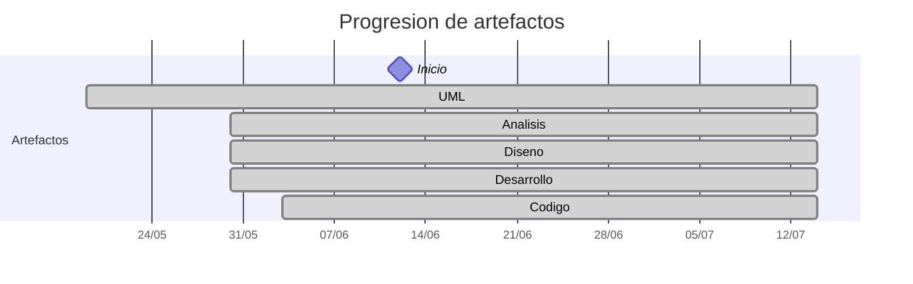

# Timeline - manuelmunoz8

> Repo: [manuelmunoz8/25-26-idsw2-sdVC](https://github.com/manuelmunoz8/25-26-idsw2-sdVC)
> Commits: 99 | Días activos: 5 | Sesiones log: 9

## Patrón observado

| Métrica | Valor |
|---|---|
| Commits propios | 99 (30 feat / 50 fix / 19 other) |
| Ratio fix/feat | 1.66 |
| Días activos | 5 |
| Sesiones documentadas | 9 |
| Sesiones sin fecha en log | 9 |

## Trazabilidad por caso de uso

| Caso de uso | D-12 | D32 |
|---|:---:|:---:|
| `casosDeUsos` | AD |   |
| `imagenes` | A | D |

---

## Día 1 · 2026-06-12

### Commits (3: 1 feat / 2 fix)

| Hora | Mensaje |
|---|---|
| 23:12 | [fix: index.ts importaciones fix](https://github.com/manuelmunoz8/25-26-idsw2-sdVC/commit/cfb87ce8ff3feb8db1fc9f1f36eb559126a3397e) |
| 23:09 | [fix: rutas relativas de importaciones](https://github.com/manuelmunoz8/25-26-idsw2-sdVC/commit/bd2b850c1275e06248662919a628ccf7ecc1ea87) |
| 23:09 | [feat: ignorar modulos de dtos copiados en compilacion](https://github.com/manuelmunoz8/25-26-idsw2-sdVC/commit/4579740901fdaff56bed089a325c2973b1731634) |

> ⚠️ Commits sin entrada en log

---

## Día 2 · 2026-06-13

### Commits (26: 8 feat / 18 fix)

| Hora | Mensaje |
|---|---|
| 00:33 | [fix: logs de cookie a token](https://github.com/manuelmunoz8/25-26-idsw2-sdVC/commit/728847a31c84d25112d8215df0e2b740d5f253e8) |
| 00:21 | [fix: Cambio de metodo de authenticacion](https://github.com/manuelmunoz8/25-26-idsw2-sdVC/commit/2ebd91fcb15a8c7c23e7629a9d35868d1e2cac83) |
| 23:57 | [fix: envio de cookies al servicio de render](https://github.com/manuelmunoz8/25-26-idsw2-sdVC/commit/28e97e7124a210fadd7f729088456d92c4d76425) |
| 23:53 | [fix: errores de tipado](https://github.com/manuelmunoz8/25-26-idsw2-sdVC/commit/1c7964137cc54406257a404cae56d56eab113c0e) |
| 23:50 | [feat: logs para ver peticiones al server](https://github.com/manuelmunoz8/25-26-idsw2-sdVC/commit/f6a414b30abc9cd5d78ec0d5a3aae4447f9e96b5) |
| 23:44 | [fix: isolacion de request de cors a solo cloudflare](https://github.com/manuelmunoz8/25-26-idsw2-sdVC/commit/f86583ddcbb1c2e5d086fcdd7fff4a85c40f2d82) |
| 23:17 | [fix: dependencia circular](https://github.com/manuelmunoz8/25-26-idsw2-sdVC/commit/9b34fb2cb447095f904f2e1aa8577c4f00a9bdfc) |
| 23:03 | [fix: autenticacion de usuario para validar solicitudes de eliminacion](https://github.com/manuelmunoz8/25-26-idsw2-sdVC/commit/bd791a845bcaedfd1899e864046757185c6e7362) |
| 22:48 | [feat: logs para peticiones get](https://github.com/manuelmunoz8/25-26-idsw2-sdVC/commit/88fe800363c97440c209e26728e924e5dc925b1a) |
| 22:38 | [feat: logs para ver funcionamiento de API](https://github.com/manuelmunoz8/25-26-idsw2-sdVC/commit/2b0ed5722501618bd21a744fbc6ee25390b265b5) |
| 22:32 | [fix: acceso a campos para solicitudes de eliminacion](https://github.com/manuelmunoz8/25-26-idsw2-sdVC/commit/5804242d1611e3e8cabc4bb7762eb31d72f52ef8) |
| 21:58 | [fix: rutas de peticiones a API](https://github.com/manuelmunoz8/25-26-idsw2-sdVC/commit/f7cfdceb6b82a2591a25d31d570d9f21d4b4c4d2) |
| 21:11 | [feat: solicitar eliminacion de perfil](https://github.com/manuelmunoz8/25-26-idsw2-sdVC/commit/a9f0ef0d035929d09a06badb735aaef6414e0ce0) |
| 21:00 | [fix: guardado de campo department en DB](https://github.com/manuelmunoz8/25-26-idsw2-sdVC/commit/c3834ceeba975af2500715d7643f207e81b30ad8) |
| 20:26 | [fix: eliminacion de archivos estaticos de .d.ts](https://github.com/manuelmunoz8/25-26-idsw2-sdVC/commit/b24cb2a1cce9f99e35474c6b54a13e2c21af9999) |
| 20:02 | [fix: eliminacion de conflictos de dtos en render](https://github.com/manuelmunoz8/25-26-idsw2-sdVC/commit/a899186055cfc6321f1f806f204e93371b3159a3) |
| 19:51 | [fix(backend): improve prebuild script to ensure DTO synchronization](https://github.com/manuelmunoz8/25-26-idsw2-sdVC/commit/028ef9f45b8a6f6674200dd2753308b94cafa02e) |
| 19:46 | [fix: campo de departamento para creacion de usuarios](https://github.com/manuelmunoz8/25-26-idsw2-sdVC/commit/36c57914323c8298b8f05c7396374598ede7f06d) |
| 19:35 | [fix(shared): export CreateUserDto in shared index](https://github.com/manuelmunoz8/25-26-idsw2-sdVC/commit/8e1587de13583ddf4205a065818370b507981500) |
| 19:13 | [feat: Dto para crear usuarios](https://github.com/manuelmunoz8/25-26-idsw2-sdVC/commit/dd246b69cd7f230ecd0391a36f0e49f3ccdf83f0) |
| 19:04 | [fix: mensaje de error con correos duplicados](https://github.com/manuelmunoz8/25-26-idsw2-sdVC/commit/0ce4d89d0e5becc6c59efe020835a14f448df7ba) |
| 14:27 | [feat: campo para elegir tipo de usuario a crear](https://github.com/manuelmunoz8/25-26-idsw2-sdVC/commit/ba407b1703f4697a3a596388b6d8d0899ff74af3) |
| 13:51 | [fix: eliminacion de duplicado](https://github.com/manuelmunoz8/25-26-idsw2-sdVC/commit/b93c4251cca569892a418b038f875802d30bf67e) |
| 13:43 | [feat: creacion de investigador](https://github.com/manuelmunoz8/25-26-idsw2-sdVC/commit/f92b07d20737240b0b652ab36d19b4ffa5c94593) |
| 13:26 | [feat: Mensajes de errores al no encontrar investigador](https://github.com/manuelmunoz8/25-26-idsw2-sdVC/commit/c9840d1f73cd27bc03181980ab5eeca128dcb390) |
| 12:56 | [fix: filtro para obtener investigadores](https://github.com/manuelmunoz8/25-26-idsw2-sdVC/commit/4881cdf143d6b980ecd01193da9e98b3f1f8113a) |

> ⚠️ Commits sin entrada en log

---

## Día 3 · 2026-06-14

### Commits (44: 16 feat / 27 fix)

| Hora | Mensaje |
|---|---|
| 00:44 | [fix: importacion faltante](https://github.com/manuelmunoz8/25-26-idsw2-sdVC/commit/bb28fa88ae41cc118e2bb6ab2f91c3c26136f3e2) |
| 00:40 | [feat: funcionalidad de eliminacion de recompensa](https://github.com/manuelmunoz8/25-26-idsw2-sdVC/commit/763700acf26f761f053ba75b2621541f61d7cd8a) |
| 00:31 | [feat: funcionalidad de editar recompensa](https://github.com/manuelmunoz8/25-26-idsw2-sdVC/commit/0db69dc823625b3692ed567e91ba663762038eb8) |
| 00:21 | [fix: unificacion de campos con el backend](https://github.com/manuelmunoz8/25-26-idsw2-sdVC/commit/d2b749f777c4fe7ac6af9b321c0a9cfb210bf654) |
| 00:11 | [fix: fallos en despliegues](https://github.com/manuelmunoz8/25-26-idsw2-sdVC/commit/07e03f512f7d65ea4706a72fd374e3f483a43e95) |
| 00:07 | [feat: creacion de recompensas](https://github.com/manuelmunoz8/25-26-idsw2-sdVC/commit/53b18e6360ed8bb68bf37b4e6f2fc03a5cb852e2) |
| 23:56 | [fix: campo de department en dto](https://github.com/manuelmunoz8/25-26-idsw2-sdVC/commit/1b342eebbf4213cc272a4396e7d2f81f70190b4e) |
| 23:48 | [fix: campo de departamento no se guardaba](https://github.com/manuelmunoz8/25-26-idsw2-sdVC/commit/e3afa1474509425ae6f7226b647f5e02369f6734) |
| 23:36 | [fix: refactor de funcion](https://github.com/manuelmunoz8/25-26-idsw2-sdVC/commit/8519b3dd7ab832b0a9402e765435c5e5118eeb42) |
| 23:32 | [prueba de renderizado de informacion de publicacion de usuario](https://github.com/manuelmunoz8/25-26-idsw2-sdVC/commit/3f909b1dfb0b8453a58a8020f14b12fafe368021) |
| 23:21 | [fix: renderizado de publicaciones](https://github.com/manuelmunoz8/25-26-idsw2-sdVC/commit/66c964aa96d579bcee79d098c8039cbe67945cd4) |
| 23:08 | [fix: acceso a campos de respuesta de API](https://github.com/manuelmunoz8/25-26-idsw2-sdVC/commit/3dd1e3daaa5bec9e0a1ef734698a003e158a783f) |
| 23:02 | [fix: error de renderizado](https://github.com/manuelmunoz8/25-26-idsw2-sdVC/commit/902e9cc72e41f51e80abc9f1209d453859e27102) |
| 22:53 | [fix: errores de hooks](https://github.com/manuelmunoz8/25-26-idsw2-sdVC/commit/ccb90f71079ebcb0b7ab12b19dc4afb38d6d3619) |
| 22:44 | [fix: uso de servicios y tipado de datos](https://github.com/manuelmunoz8/25-26-idsw2-sdVC/commit/a4889119412472228bee4339385bead143924277) |
| 22:34 | [fix: hook para id de author al crear publicacion](https://github.com/manuelmunoz8/25-26-idsw2-sdVC/commit/6d5d92b9742bf8c301108e602a8a233da364deb2) |
| 22:22 | [fix: dependencias no reconocidas por render](https://github.com/manuelmunoz8/25-26-idsw2-sdVC/commit/91478443f582b2e21c7887c01dda6ca35c8d68ef) |
| 22:15 | [feat: gestion de publicaciones](https://github.com/manuelmunoz8/25-26-idsw2-sdVC/commit/7690cb73e586b0b45782e1825c4bb9aa7a8d430c) |
| 18:09 | [fix: soft delete en entregables](https://github.com/manuelmunoz8/25-26-idsw2-sdVC/commit/57974863fc1cb2de8a5d9f5e83a66ad19d991b60) |
| 17:53 | [fix: llamada de API a entregables de proyecto](https://github.com/manuelmunoz8/25-26-idsw2-sdVC/commit/b2ecec0b9d5bcf57085b0bc334eab16a31efc76e) |
| 16:41 | [feat: edicion de entregables](https://github.com/manuelmunoz8/25-26-idsw2-sdVC/commit/464daca7ddb9910a90d6c0e6993818cdf6e0f547) |
| 16:29 | [feat: creacion de entregables](https://github.com/manuelmunoz8/25-26-idsw2-sdVC/commit/e61b98b6f0d9f4cfaca383cd227085aaa95011d6) |
| 16:13 | [fix: dependencias no reconocidas por render](https://github.com/manuelmunoz8/25-26-idsw2-sdVC/commit/8dd84d9c1fb0d02660f726f3c0aca9eb41417d70) |
| 15:52 | [feat: manejo de entregables](https://github.com/manuelmunoz8/25-26-idsw2-sdVC/commit/0f6a478b630fe83cbd8aec288cf18d11cb04352b) |
| 15:39 | [fix: cambio de aviso al completarse edicion de proyecto](https://github.com/manuelmunoz8/25-26-idsw2-sdVC/commit/5b2cf1eeba24c1e12ccef8e71fccd6b0740bbfc5) |
| 15:31 | [fix: cambio de metodo PUT a PATCH](https://github.com/manuelmunoz8/25-26-idsw2-sdVC/commit/2b5467a849c37098edae8d07aa19447599ba22a3) |
| 15:20 | [fix: importacion de patch](https://github.com/manuelmunoz8/25-26-idsw2-sdVC/commit/480344ac99f2573826101189757b4f1daefc4b00) |
| 15:17 | [fix: error de sintaxis](https://github.com/manuelmunoz8/25-26-idsw2-sdVC/commit/ffed7d8742cd6f4fa48df8f483e22dd786026809) |
| 15:13 | [feat: funcionalidad de eliminar investigador de un proyecto](https://github.com/manuelmunoz8/25-26-idsw2-sdVC/commit/0ea63d0f6347b76bfecb08eff1b6c5c54ba0a028) |
| 15:06 | [feat: agregar investigador a proyecto](https://github.com/manuelmunoz8/25-26-idsw2-sdVC/commit/0db28edd50885bd3b59cf9d116acf2c7070f622f) |
| 14:46 | [feat: editarProyecto](https://github.com/manuelmunoz8/25-26-idsw2-sdVC/commit/d84536bf69d73b88a2c41802d8d8c51806f79e31) |
| 14:34 | [fix: eliminacion de ID de proyectos en UI](https://github.com/manuelmunoz8/25-26-idsw2-sdVC/commit/2e5ca4806906ae3336664af3792f749751aec268) |
| 14:18 | [fix: soft delete y eliminacion de campo de id en page de proyecto](https://github.com/manuelmunoz8/25-26-idsw2-sdVC/commit/275f7990d338147b8fd4ade434d49b8bc1eaca97) |
| 14:05 | [feat: funcionalidad de abrir proyecto](https://github.com/manuelmunoz8/25-26-idsw2-sdVC/commit/63c0bae16c77901d0eccd49956946254eec2d2b6) |
| 13:53 | [fix: dependencias necesarias para testing](https://github.com/manuelmunoz8/25-26-idsw2-sdVC/commit/4de7146176a23349bdb2831cdf648810b2df4377) |
| 13:49 | [fix: funcionalidades faltantes](https://github.com/manuelmunoz8/25-26-idsw2-sdVC/commit/e71f1c755cc38ca0352abb4c5d88cce6141852b3) |
| 13:14 | [feat: funcionalidad de creacion de nuevo proyecto](https://github.com/manuelmunoz8/25-26-idsw2-sdVC/commit/d88a6862388a9c023aa67224bcbd98fbe2fa972b) |
| 10:59 | [fix: dependencias no reconociadas por render](https://github.com/manuelmunoz8/25-26-idsw2-sdVC/commit/c72daf35937708e35c5b64eab277f0b6b1fc41df) |
| 03:49 | [feat: implementacion de role guard](https://github.com/manuelmunoz8/25-26-idsw2-sdVC/commit/f9c77805742ecd052eee6e25874cd2b6ab0de1d1) |
| 03:48 | [feat(backend): implement RolesGuard and protect project creation](https://github.com/manuelmunoz8/25-26-idsw2-sdVC/commit/27e9b5891a9ee5a37e29fca6cd3eebc526372adc) |
| 02:56 | [feat: soft delete](https://github.com/manuelmunoz8/25-26-idsw2-sdVC/commit/a2f398b1adb7da263936aa46ec8a1ef4198269f0) |
| 02:52 | [feat(backend): implement soft delete and coordinator approval workflow](https://github.com/manuelmunoz8/25-26-idsw2-sdVC/commit/853e42b391548b10f9577ff5571858f32446e723) |
| 02:26 | [fix: eliminacion de consumo de API de grants](https://github.com/manuelmunoz8/25-26-idsw2-sdVC/commit/f2ec0bf93b88ad785866b1f3ba3baa98637ad785) |
| 02:19 | [fix: unificacion de guardado de token](https://github.com/manuelmunoz8/25-26-idsw2-sdVC/commit/0c097bafcab50e00ff12b719b488326b9797977f) |

> ⚠️ Commits sin entrada en log

---

## Día 32 · 2026-07-13

### Commits (2: 1 feat / 1 fix)

| Hora | Mensaje |
|---|---|
| 15:49 | [fix: unificacion de codigo con diagramas](https://github.com/manuelmunoz8/25-26-idsw2-sdVC/commit/430a03a9fea7710267370ab9e9fe5953ec29eff8) |
| 02:07 | [feat: unificacion de diseño](https://github.com/manuelmunoz8/25-26-idsw2-sdVC/commit/7a9ef63b213820f086ef9158285c6f686fdf59bf) |

> ⚠️ Commits sin entrada en log

---

## Día 33 · 2026-07-14

### Commits (24: 4 feat / 2 fix)

| Hora | Mensaje |
|---|---|
| 12:24 | [Update SVG for abrirSolicitudEliminacionPerfil](https://github.com/manuelmunoz8/25-26-idsw2-sdVC/commit/5f2e20c170d2d31dc54cb30252f8ef34f39bdf14) |
| 12:23 | [Remove unused participant from UML diagram](https://github.com/manuelmunoz8/25-26-idsw2-sdVC/commit/005547b8a60c74e037708bb956f9c101bccd6c7d) |
| 12:21 | [Update SVG diagram for abrirSolicitudesEliminacionPerfil](https://github.com/manuelmunoz8/25-26-idsw2-sdVC/commit/4fd6d6236c3d115ddf5284275c802706ba7c70ac) |
| 12:21 | [Update SVG diagram for abrirSolicitudEliminacionPerfil](https://github.com/manuelmunoz8/25-26-idsw2-sdVC/commit/2576ab385f800c6b7afaaf5c2763e9758d10a8e7) |
| 12:20 | [Remove unused participant from UML diagram](https://github.com/manuelmunoz8/25-26-idsw2-sdVC/commit/3b250c5fc84eca9828f29d5d8614db1a3bee52db) |
| 12:19 | [Add actor and update sequence for deletion requests](https://github.com/manuelmunoz8/25-26-idsw2-sdVC/commit/9d3cb4e08035f8e623a7e815b708e23ffc7b9a17) |
| 12:16 | [Change diagram type from DESCRIPTION to SEQUENCE](https://github.com/manuelmunoz8/25-26-idsw2-sdVC/commit/c67d7fb96ea7f6b61e65291bb435f9cd63ee4cc4) |
| 12:15 | [Add actor and update sequence for abrirSolicitudEliminacionPerfil](https://github.com/manuelmunoz8/25-26-idsw2-sdVC/commit/f64144e8c35f47a966f9167bc2db8abdae20f072) |
| 12:08 | [Update abrirRecompensas](https://github.com/manuelmunoz8/25-26-idsw2-sdVC/commit/8035a38f37271242e4f7188af140acda721368c3) |
| 12:00 | [Update SVG diagram for abrirRecompensa](https://github.com/manuelmunoz8/25-26-idsw2-sdVC/commit/a7670df0f3e6413f40e67d521b84d1a6f691c0d4) |
| 11:58 | [Update SVG diagram for abrirPublicaciones](https://github.com/manuelmunoz8/25-26-idsw2-sdVC/commit/7688aae0eb6c3cd418df12f9f097cecbf32f7d45) |
| 11:55 | [Change diagram type to SEQUENCE](https://github.com/manuelmunoz8/25-26-idsw2-sdVC/commit/0a28a88895012787db72b975aad397657a61236c) |
| 11:52 | [Update SVG diagram for abrirProyectos](https://github.com/manuelmunoz8/25-26-idsw2-sdVC/commit/8a8ad3e34f4c6ff04413b4ae7ba443a0a0a5eb19) |
| 11:49 | [Change SVG diagram type to SEQUENCE](https://github.com/manuelmunoz8/25-26-idsw2-sdVC/commit/6796b420097ed5b1ebc420b4066feb686b296661) |
| 11:48 | [Add abrirPanelPrincipal.svg diagram](https://github.com/manuelmunoz8/25-26-idsw2-sdVC/commit/9f09675dd21b4e2351e83bd3e893692c4984a975) |
| 11:46 | [Rename abrirOpcionesPerfil to abrirOpcionesPerfil.svg](https://github.com/manuelmunoz8/25-26-idsw2-sdVC/commit/930488dcac0c9f38341b22002420ddb978af79fd) |
| 11:46 | [Add SVG diagram for abrirOpcionesPerfil](https://github.com/manuelmunoz8/25-26-idsw2-sdVC/commit/6c91e09cb42c785be5f1075183a78619cad530af) |
| 11:43 | [fix: creacion de carpetas faltantes](https://github.com/manuelmunoz8/25-26-idsw2-sdVC/commit/aea286eb259f9508e19f9571be4c8841857baa54) |
| 11:30 | [Change diagram type in abrirOpcionesCargaTrabajo.svg](https://github.com/manuelmunoz8/25-26-idsw2-sdVC/commit/2e1c0fdcb286452dc171a1e38df79aff0a9eaecc) |
| 11:29 | [Update SVG diagram for abrirMisPublicaciones](https://github.com/manuelmunoz8/25-26-idsw2-sdVC/commit/3fcd5cc930308a7bb9f42931a4bed074b0f06072) |
| 11:27 | [Update SVG diagram for abrirMiPublicacion](https://github.com/manuelmunoz8/25-26-idsw2-sdVC/commit/2527600219695286e87c3453a90fa4d48b967d27) |
| 11:25 | [fix: carpeta de imagen de abrirMiPublicacion](https://github.com/manuelmunoz8/25-26-idsw2-sdVC/commit/eb51479a3f9cca0c5a52d248f1a8b0fabe1dbe49) |
| 11:22 | [Change diagram type in abrirInvestigadores.svg](https://github.com/manuelmunoz8/25-26-idsw2-sdVC/commit/911da75e4020c981645e921fe142793ba29ec1ab) |
| 11:19 | [Update SVG diagram for abrirInvestigador](https://github.com/manuelmunoz8/25-26-idsw2-sdVC/commit/7700f0393b21ecd3f582f1686d33bd0d5f9f9faf) |

> ⚠️ Commits sin entrada en log

---

