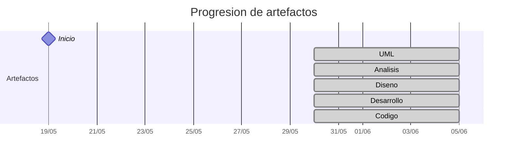

# Timeline - manuelmunoz8

> Repo: [manuelmunoz8/25-26-idsw2-sdVC](https://github.com/manuelmunoz8/25-26-idsw2-sdVC)
> Commits: 73 | Días activos: 10 | Sesiones log: 9

## Patrón observado

| Métrica | Valor |
|---|---|
| Commits propios | 73 (24 feat / 38 fix / 11 other) |
| Ratio fix/feat | 1.58 |
| Días activos | 10 |
| Sesiones documentadas | 9 |
| Sesiones sin fecha en log | 9 |

## Trazabilidad por caso de uso

| Caso de uso | D12 |
|---|:---:|
| `casosDeUsos` | AD |
| `imagenes` | A |

---

## Día 3 · 2026-05-21

### Commits (1: 0 feat / 0 fix)

| Hora | Mensaje |
|---|---|
| 13:17 | [QUE_HACE](https://github.com/manuelmunoz8/25-26-idsw2-sdVC/commit/c0274187926a7d042b97ebceda22785bb93d09f4) |

> ⚠️ Commits sin entrada en log

---

## Día 7 · 2026-05-25

### Commits (15: 8 feat / 6 fix)

| Hora | Mensaje |
|---|---|
| 20:46 | [fix: Problemas de url con bases de datos](https://github.com/manuelmunoz8/25-26-idsw2-sdVC/commit/9344708ba17a13232908a34a05a50d64f056436c) |
| 20:13 | [fix: error de sintaxis](https://github.com/manuelmunoz8/25-26-idsw2-sdVC/commit/46409e39600e5002315ac92bae8111a902dd1520) |
| 20:08 | [fix: conflictos entre modules y servicio de render](https://github.com/manuelmunoz8/25-26-idsw2-sdVC/commit/23bc14430440b7f62b46452e6b60e9f3bb227f56) |
| 20:03 | [feat: scaffolding para servicios externos](https://github.com/manuelmunoz8/25-26-idsw2-sdVC/commit/81d3bd33a075152e938d97c5f706c1529ddbf990) |
| 20:03 | [feat: update de decisinoes de arquitectura](https://github.com/manuelmunoz8/25-26-idsw2-sdVC/commit/e42af77f8da18b93ba47e1d91e2eca106c87e5bd) |
| 20:02 | [fix: eliminacion de duplicado](https://github.com/manuelmunoz8/25-26-idsw2-sdVC/commit/889781a58ca2227c430ba6d6601765999fc73beb) |
| 19:59 | [feat: configuracion para github pages](https://github.com/manuelmunoz8/25-26-idsw2-sdVC/commit/10c5419455812bff8cb38daf5a5fb0a66d5dc1f5) |
| 19:31 | [Configure GitHub Actions for frontend deployment](https://github.com/manuelmunoz8/25-26-idsw2-sdVC/commit/72d806aa4a50d72ea89d7911899b636906d4b116) |
| 18:49 | [fix: corregir hora en logs de conversacion](https://github.com/manuelmunoz8/25-26-idsw2-sdVC/commit/cb86531d2ebc31e3b1b358f1ea767cd6c13ae25e) |
| 18:40 | [feat: agregacion de referencias a .md dentro de conversation log](https://github.com/manuelmunoz8/25-26-idsw2-sdVC/commit/87e6a79a525743773c87d8b7fc29c844326a4a0d) |
| 16:25 | [fix: Hora de logs](https://github.com/manuelmunoz8/25-26-idsw2-sdVC/commit/9a3edcc5cf04151ece73984e66a41b812c4a3483) |
| 16:22 | [feat: arreglo del formato de conversation-log](https://github.com/manuelmunoz8/25-26-idsw2-sdVC/commit/df50fbea5b7c092777779f14d80354389658dcfd) |
| 16:21 | [feat: eleccion de tecnologias para frontend y backend](https://github.com/manuelmunoz8/25-26-idsw2-sdVC/commit/f9031a74424ebebbc20b3b4b8c213aa65e47a615) |
| 15:51 | [feat: Creacion de reglas para gemini CLI](https://github.com/manuelmunoz8/25-26-idsw2-sdVC/commit/c3c5ed12ef89919a726a954df6e141dfd0903984) |
| 15:47 | [feat: agregacion del modelo del domino](https://github.com/manuelmunoz8/25-26-idsw2-sdVC/commit/c77ec85f69a5a0b21be623c4e4163c3a987a52d9) |

> ⚠️ Commits sin entrada en log

---

## Día 8 · 2026-05-26

### Commits (11: 2 feat / 9 fix)

| Hora | Mensaje |
|---|---|
| 21:58 | [fix: point SPA fallback to root to avoid .html stripping loop](https://github.com/manuelmunoz8/25-26-idsw2-sdVC/commit/2370176f7d1f49da70885373ddcacba943e5a6c8) |
| 21:53 | [fix: disable html_handling to resolve infinite loop in Workers Assets](https://github.com/manuelmunoz8/25-26-idsw2-sdVC/commit/ba9f4e856aa05d20c3078714a273a0c4ee90d566) |
| 21:47 | [fix: break infinite loop in _redirects for Workers Assets](https://github.com/manuelmunoz8/25-26-idsw2-sdVC/commit/db788b682c72ec66e1e4e264c94f5e93e5e03755) |
| 21:36 | [fix: resolve infinite loop in _redirects for cloudflare](https://github.com/manuelmunoz8/25-26-idsw2-sdVC/commit/cb1f77d18c07b34e476bde3e920f4c7dbe31bdd7) |
| 21:30 | [feat: add wrangler.jsonc for automated cloudflare deployment](https://github.com/manuelmunoz8/25-26-idsw2-sdVC/commit/ee3d735a65235e06e5da24d3f4e4972615a79e93) |
| 21:24 | [fix: modernize tsconfig to avoid TS 7.0 deprecations](https://github.com/manuelmunoz8/25-26-idsw2-sdVC/commit/803705e1cd9e900b4b7077c103e5337130b71a0f) |
| 21:18 | [fix:  sync frontend lockfile for cloudflare deploy](https://github.com/manuelmunoz8/25-26-idsw2-sdVC/commit/cb880caf4f6544707765749df598c7171eed340a) |
| 21:01 | [feat: interfaz para cloudfare pages](https://github.com/manuelmunoz8/25-26-idsw2-sdVC/commit/e5c6e26f16c52b78cbe8268336e151ce49d23057) |
| 21:01 | [fix: incompatibilidad de URI entre Render y Supabase](https://github.com/manuelmunoz8/25-26-idsw2-sdVC/commit/5dc1e86548fb8551e020ed073e2a937b481e2df0) |
| 20:01 | [fix: connecion de base de datos](https://github.com/manuelmunoz8/25-26-idsw2-sdVC/commit/2dbe30e5aea12beb00265cdedbc6126f5acb719c) |
| 19:42 | [fix: migracion a servicio de claudefare pages](https://github.com/manuelmunoz8/25-26-idsw2-sdVC/commit/2270e36da9cc108be2e1cf7d0648b2394a3ef2df) |

> ⚠️ Commits sin entrada en log

---

## Día 10 · 2026-05-28

### Commits (11: 5 feat / 6 fix)

| Hora | Mensaje |
|---|---|
| 01:48 | [feat: definicion de llamadas a API y servicios externos](https://github.com/manuelmunoz8/25-26-idsw2-sdVC/commit/e7eedacaf78b9afa1f77c509d22280d147c5f955) |
| 01:10 | [fix: especificado de entidades en diagramas](https://github.com/manuelmunoz8/25-26-idsw2-sdVC/commit/2d403ebaebc4ccef858f503faad4a10e10964b97) |
| 00:49 | [feat: Diagramas de colaboracion de P2](https://github.com/manuelmunoz8/25-26-idsw2-sdVC/commit/5d1777e2b00dd7d4c67a751246814b0832a0a8d5) |
| 00:34 | [feat: Diagramas de colaboracion de casos de usos P1](https://github.com/manuelmunoz8/25-26-idsw2-sdVC/commit/a7889430ae413361787c91d648051c76d34265ed) |
| 00:31 | [feat: P1 Núcleo funcional](https://github.com/manuelmunoz8/25-26-idsw2-sdVC/commit/3a4444eb17f42979fe17d44a5aa577cade367835) |
| 00:27 | [fix: estructura de logs](https://github.com/manuelmunoz8/25-26-idsw2-sdVC/commit/97bec1f8b79ffaa0feb8ec6f75b56d90441cc1e3) |
| 00:13 | [feat: Diagrama de colaboracion de primer nivel de priorizacion](https://github.com/manuelmunoz8/25-26-idsw2-sdVC/commit/ce914cbd76b3650bbd1eb852afa091693a54fc7f) |
| 00:06 | [fix: estructura del proyecto](https://github.com/manuelmunoz8/25-26-idsw2-sdVC/commit/957fb34868c79d67b1ecfe40c20b94bb54503272) |
| 23:46 | [fix: reglas de logs de gemini](https://github.com/manuelmunoz8/25-26-idsw2-sdVC/commit/d8a672258d76081d56e392ae1f472139d7e24169) |
| 23:24 | [fix: estructura y logs de arreglo de carpetas](https://github.com/manuelmunoz8/25-26-idsw2-sdVC/commit/6a8eee852c1d5ee8d2a8a99b66c68808836dfba3) |
| 23:22 | [fix: estructura de requisitado en documentacion](https://github.com/manuelmunoz8/25-26-idsw2-sdVC/commit/c458feca3b6c71b528307aa210fb8cf915ab340c) |

> ⚠️ Commits sin entrada en log

---

## Día 11 · 2026-05-29

### Commits (1: 1 feat / 0 fix)

| Hora | Mensaje |
|---|---|
| 18:32 | [feat: Actualizacion del README.md](https://github.com/manuelmunoz8/25-26-idsw2-sdVC/commit/0121f815c428387fb6bbbefe57eb1fd8d7148e91) |

> ⚠️ Commits sin entrada en log

---

## Día 12 · 2026-05-30

### Commits (8: 3 feat / 3 fix)

| Hora | Mensaje |
|---|---|
| 01:19 | [prueba despligue](https://github.com/manuelmunoz8/25-26-idsw2-sdVC/commit/63a916a2823cb6bcafaa993917e55443a2c1a975) |
| 01:16 | [feat: creacion de README en RUP/03-desarrollo](https://github.com/manuelmunoz8/25-26-idsw2-sdVC/commit/c61da5f167dfcd8616c3afbaadd8d5241fd6a868) |
| 01:15 | [update gitignore](https://github.com/manuelmunoz8/25-26-idsw2-sdVC/commit/dfd7b597b020b6b77fd52713143ebbbcc9fdec45) |
| 01:15 | [fix: configuracion de logs para cloudfare](https://github.com/manuelmunoz8/25-26-idsw2-sdVC/commit/759ad393f224535eed9b09bb18dd305af9d08c05) |
| 00:53 | [fix: acceso de cloudfare a index.html](https://github.com/manuelmunoz8/25-26-idsw2-sdVC/commit/33a7081e9bc4f406b74cdaca0c34b7904b9d31d7) |
| 00:30 | [fix: codigo fuente hacia carpeta src](https://github.com/manuelmunoz8/25-26-idsw2-sdVC/commit/5da0fcece4c535109eae45b179013ba0ac56c730) |
| 00:30 | [feat: diagramas de secuencia](https://github.com/manuelmunoz8/25-26-idsw2-sdVC/commit/4a1274df02d01559ef7486564f22ab58a1498f4e) |
| 15:01 | [feat: Creacion de analisis en carpeta RUP](https://github.com/manuelmunoz8/25-26-idsw2-sdVC/commit/d9a81978a15515256a1e9f52a0c9e2e895826485) |

**Artefactos nuevos:** 🔌 📐 🔍 🧩 ⚙️ 

> ⚠️ Commits sin entrada en log

---

## Día 13 · 2026-05-31

### Commits (5: 2 feat / 3 fix)

| Hora | Mensaje |
|---|---|
| 14:53 | [fix: errores de implementacion de render](https://github.com/manuelmunoz8/25-26-idsw2-sdVC/commit/223a233299d30fe5b7564458c9301567089b1622) |
| 14:43 | [feat: manejo de convocatorias y usuario de tipo coordinador](https://github.com/manuelmunoz8/25-26-idsw2-sdVC/commit/6951907cbc739259db011b30eb9a53882ca60238) |
| 14:25 | [feat: implementacion de diseño base a clouflare](https://github.com/manuelmunoz8/25-26-idsw2-sdVC/commit/f16248054d6167622dbda26be96ea0f8113872f8) |
| 14:09 | [fix: eliminacion de _redirects](https://github.com/manuelmunoz8/25-26-idsw2-sdVC/commit/79c3b6232e791f1e9319b69548887b01aa8df039) |
| 02:18 | [fix: configuracion necesaria para pages](https://github.com/manuelmunoz8/25-26-idsw2-sdVC/commit/4a8c6ed75531ee23d878667fc7daa2d6da16deeb) |

> ⚠️ Commits sin entrada en log

---

## Día 15 · 2026-06-02

### Commits (1: 0 feat / 1 fix)

| Hora | Mensaje |
|---|---|
| 19:19 | [fix: nombres de metodos en diseñado](https://github.com/manuelmunoz8/25-26-idsw2-sdVC/commit/3464a92fad6e116373070d7bd053fb81af3b5cc3) |

> ⚠️ Commits sin entrada en log

---

## Día 16 · 2026-06-03

### Commits (18: 3 feat / 8 fix)

| Hora | Mensaje |
|---|---|
| 01:34 | [Prueba 8](https://github.com/manuelmunoz8/25-26-idsw2-sdVC/commit/f7105bc15db4fbd106b8cc8df8d44128a397861a) |
| 01:24 | [Prueba 7](https://github.com/manuelmunoz8/25-26-idsw2-sdVC/commit/19b873aa5f25c7650251c6448765c9a7e87c0cb1) |
| 01:18 | [Prueba 6](https://github.com/manuelmunoz8/25-26-idsw2-sdVC/commit/61210057a3cda02bdd0b11086ceddb0e799c8e06) |
| 01:09 | [Prubas 5 de URL de render](https://github.com/manuelmunoz8/25-26-idsw2-sdVC/commit/1dd165308309043c9a2fcb2d3655cb0b0d8f539a) |
| 00:58 | [Pruebas de URL de render](https://github.com/manuelmunoz8/25-26-idsw2-sdVC/commit/80abcc845d7fd3a8e1acace00397fb9c8666f1d4) |
| 00:24 | [fix: rutas de api de backend](https://github.com/manuelmunoz8/25-26-idsw2-sdVC/commit/dbb5986f60231c0ac6738622cb60a9739ac588b3) |
| 00:14 | [Prueba 2](https://github.com/manuelmunoz8/25-26-idsw2-sdVC/commit/2ac357f41ff7a8006e5a5570156be31db2341edb) |
| 00:01 | [Prueba para URL de render](https://github.com/manuelmunoz8/25-26-idsw2-sdVC/commit/4b95d327ea519b90886eaef14f100c4e2b093e0d) |
| 22:51 | [fix: modulo faltante para render](https://github.com/manuelmunoz8/25-26-idsw2-sdVC/commit/8e70f3d150cd9a65cf7c7bfb88566762121933e2) |
| 22:27 | [fix: validacion de cookies en el frontend](https://github.com/manuelmunoz8/25-26-idsw2-sdVC/commit/388850129309b6488f351b41f5d7c730fe50dd97) |
| 21:59 | [fix: acceder al ultimo deploy de cloudflare](https://github.com/manuelmunoz8/25-26-idsw2-sdVC/commit/b37b525737033c3d0599405861a601392446d455) |
| 21:31 | [fix: errores de envio de datos al frontend](https://github.com/manuelmunoz8/25-26-idsw2-sdVC/commit/fa6090dbbc8551d0ff48a45d6831823400c69389) |
| 21:18 | [fix: Desactivacion de sincronizacion entre render y supabase](https://github.com/manuelmunoz8/25-26-idsw2-sdVC/commit/5895869886e0bf534c0de93b511aa229e217e0ce) |
| 21:07 | [fix: cambio de tipo de campo en base de datos](https://github.com/manuelmunoz8/25-26-idsw2-sdVC/commit/bac266a03822f897ab0fa94014c5bcb06501b522) |
| 20:57 | [feat: implementacion de JWT](https://github.com/manuelmunoz8/25-26-idsw2-sdVC/commit/5d08a2ea00f971e8a20af3644e9293ae438d253f) |
| 19:37 | [feat: seguridad XSS e inyecciones SQL](https://github.com/manuelmunoz8/25-26-idsw2-sdVC/commit/2d3e8ff93101354886bb5b4140021a1c8d12c75e) |
| 19:23 | [fix: clases abstractas de controladores](https://github.com/manuelmunoz8/25-26-idsw2-sdVC/commit/2d8a43a03ac0018ca3586bc90a6a31e9fe17eb4c) |
| 18:55 | [feat: implementacion de llamadas a API para login](https://github.com/manuelmunoz8/25-26-idsw2-sdVC/commit/9708ea766a297781cd43b437033b691fdd592d9a) |

> ⚠️ Commits sin entrada en log

---

## Día 18 · 2026-06-05

### Commits (2: 0 feat / 2 fix)

| Hora | Mensaje |
|---|---|
| 10:27 | [fix: Re agregar REACT_APP_API_URL a wrangler.jsonc](https://github.com/manuelmunoz8/25-26-idsw2-sdVC/commit/1deb9230005a83d57094cca07d7ef0c89f4a0875) |
| 10:14 | [fix: Eliminacion de vars en wrangler.jsonc](https://github.com/manuelmunoz8/25-26-idsw2-sdVC/commit/2e19a85807c958483be1cfca6a2f72058f9852dd) |

> ⚠️ Commits sin entrada en log

---

