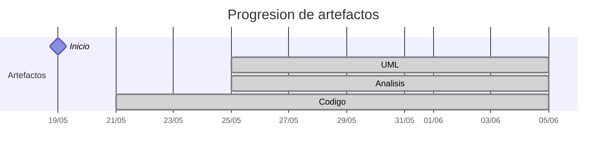

# Timeline - marcosgutierrez6

> Repo: [marcosgutierrez6/25-26-idsw2-sdVC](https://github.com/marcosgutierrez6/25-26-idsw2-sdVC)
> Commits: 53 | Días activos: 7 | Sesiones log: 51

## Patrón observado

| Métrica | Valor |
|---|---|
| Commits propios | 53 (52 feat / 1 fix / 0 other) |
| Ratio fix/feat | 0.01 |
| Días activos | 7 |
| Sesiones documentadas | 51 |
| Sesiones sin fecha en log | 51 |

<!-- trazabilidad: manual -->
## Trazabilidad por caso de uso

| Caso de uso | D7 | D8 | D11 | D14 | D16 |
|---|:---:|:---:|:---:|:---: | :---: |
| `corregirExamenes` | A |   |   | | D |
| `exportarConfiguracionGlobal` | A |   |   | | D |
| `generarExamenes` | A |   |   | | D |
| `importarConfiguracionGlobal` | A |   |   | | D |
| `exportarAlumnos` |   | A |   | |     |
| `importarAlumnos` |   | A |   | | D |
| `importarPreguntas` |   | A |   | | D |
| `asignarExamenes` |   |   | A | |     |
| `crearAlumno` |   |   | A | |     |
| `crearDocente` |   |   | A | |     |
| `crearPregunta` |   |   | A | |     |
| `editarAsignatura` |   |   | A | |     |
| `editarPregunta` |   |   | A | |     |
| `exportarPreguntas` |   |   | A | |     |
| `iniciarSesion` |   |   |   | A |     |
| `cerrarSesion` |   |   |   | A |     |
| `completarGestion` |   |   |   | A |     |
| `crearGrado` |   |   |   | A |     |
| `editarGrado` |   |   |   | A |     |
| `eliminarGrado` |   |   |   | A |     |
| `crearAsignatura` |   |   |   | A |     |
| `eliminarAsignatura` |   |   |   | A |     |
| `editarAlumno` |   |   |   | A |     |
| `eliminarAlumno` |   |   |   | A |     |
| `editarDocente` |   |   |   | A |     |
| `eliminarDocente` |   |   |   | A |     |
| `eliminarPregunta` |   |   |   | A |     |
| `verGrados` |   |   |   | A |     |
| `verAsignaturas` |   |   |   | A |     |
| `verAlumnos` |   |   |   | A |     |
| `verDocentes` |   |   |   | A |     |
| `verPreguntas` |   |   |   | A |     |
| `verRespuestas` |   |   |   | A |     |
| `crearRespuesta` |   |   |   | A |     |
| `editarRespuesta` |   |   |   | A |     |
| `eliminarRespuesta` |   |   |   | A |     |
| `importarGrados` |   |   |   | A |     |
| `importarAsignaturas` |   |   |   | A |     |
| `exportarGrados` |   |   |   | A |     |
| `exportarAsignaturas` |   |   |   | A |     |
| `cancelarGeneracion` |   |   |   | A |     |

---

## Día 2 · 2026-05-20

### Commits (1: 1 feat / 0 fix)

| Hora | Mensaje |
|---|---|
| 17:35 | [feat: QUE_HACE.md commit inicial](https://github.com/marcosgutierrez6/25-26-idsw2-sdVC/commit/675e5cfe4472f178904237b6b1664ebdffc5c54a) |

> ⚠️ Commits sin entrada en log

---

## Día 3 · 2026-05-21

### Commits (2: 2 feat / 0 fix)

| Hora | Mensaje |
|---|---|
| 16:35 | [feat: Setup y ajustes del turbo repo para comenzar con el codigo](https://github.com/marcosgutierrez6/25-26-idsw2-sdVC/commit/62f9e58a591162f33778ac28fa553c367f7be79d) |
| 15:58 | [feat: Setup inicial de proyecto (contexto, reglas etc.)](https://github.com/marcosgutierrez6/25-26-idsw2-sdVC/commit/e9370574e1997febcd84ab71b5c1b0992b2cd5c7) |

**Artefactos nuevos:** 🔌 

> ⚠️ Commits sin entrada en log

---

## Día 7 · 2026-05-25

### Commits (5: 5 feat / 0 fix)

| Hora | Mensaje |
|---|---|
| 21:55 | [feat: Analisis del caso de uso de exportarrConfiguracionGlobal()](https://github.com/marcosgutierrez6/25-26-idsw2-sdVC/commit/f9c38c8477bec571c9790a2d66caeee98791c46a) |
| 21:44 | [feat: Analisis del caso de uso de importarConfiguracionGlobal()](https://github.com/marcosgutierrez6/25-26-idsw2-sdVC/commit/f6f91b556f18d281fa1fa82051992e5fb82bfc81) |
| 19:41 | [feat: Analisis del caso de uso de generarExamenes()](https://github.com/marcosgutierrez6/25-26-idsw2-sdVC/commit/5e756b27204d3e2836e9a373ca8703f13a2e8b49) |
| 19:33 | [feat: Analisis del caso de uso de corregirExamenes](https://github.com/marcosgutierrez6/25-26-idsw2-sdVC/commit/b7e2e1c38b0708ea17d03991994669cb60c6863c) |
| 19:17 | [feat: Estandarización para el analisis](https://github.com/marcosgutierrez6/25-26-idsw2-sdVC/commit/b0eaef59905b50aab21195a492d15c37290a03bf) |

**Artefactos nuevos:** 📐 🔍 

> ⚠️ Commits sin entrada en log

---

## Día 8 · 2026-05-26

### Commits (4: 4 feat / 0 fix)

| Hora | Mensaje |
|---|---|
| 10:32 | [feat: Analisis del caso de uso de exportarAlumnos()](https://github.com/marcosgutierrez6/25-26-idsw2-sdVC/commit/e3ab1488f024674f0fd83e7706bd4a9477cad8fc) |
| 10:21 | [feat: Analisis del caso de uso de importarPreguntas()](https://github.com/marcosgutierrez6/25-26-idsw2-sdVC/commit/189ad2615a4fc1d5cb5fade6e98e032e3ca7a20c) |
| 10:16 | [feat: Analisis del caso de uso de importarAlumnos()](https://github.com/marcosgutierrez6/25-26-idsw2-sdVC/commit/f2000603ab841d09c8d09f8581a7ce89dc97dd64) |
| 10:06 | [feat: Comando y regla para cleanCode](https://github.com/marcosgutierrez6/25-26-idsw2-sdVC/commit/95cc2428dac78446ac5d06da317f7cdd14729dff) |

> ⚠️ Commits sin entrada en log

---

## Día 11 · 2026-05-29

### Commits (7: 7 feat / 0 fix)

| Hora | Mensaje |
|---|---|
| 16:05 | [feat: Analisis del caso de uso de crearAlumno()](https://github.com/marcosgutierrez6/25-26-idsw2-sdVC/commit/f6b63a0bc5772f5aafb8da9bd6c635a863808cdb) |
| 16:00 | [feat: Analisis del caso de uso de crearDocente()](https://github.com/marcosgutierrez6/25-26-idsw2-sdVC/commit/9372775dd62895ce3af67c282a005e8ffca3e653) |
| 15:56 | [feat: Analisis del caso de uso de editarAsignatura()](https://github.com/marcosgutierrez6/25-26-idsw2-sdVC/commit/79d45f49c1bdd9dc4ca987e65b6eba2cee070d57) |
| 15:48 | [feat: Analisis del caso de uso de editarPregunta()](https://github.com/marcosgutierrez6/25-26-idsw2-sdVC/commit/c1c22c84ea60242e5980de021c7cec530b86d8b3) |
| 15:43 | [feat: Analisis del caso de uso de crearPregunta()](https://github.com/marcosgutierrez6/25-26-idsw2-sdVC/commit/37054c92787593b3115fb49af56a3f3323b87d7b) |
| 15:38 | [feat: Analisis del caso de uso de asignarExamenes()](https://github.com/marcosgutierrez6/25-26-idsw2-sdVC/commit/ce80aafeb89c418e99fd6146144146304c15c0fc) |
| 15:32 | [feat: Analisis del caso de uso de exportarPreguntas()](https://github.com/marcosgutierrez6/25-26-idsw2-sdVC/commit/fb6222fa3a19f63718d4608eb6b9cfc3c40fc112) |

> ⚠️ Commits sin entrada en log

---

## Día 14 · 2026-06-01

### Commits (28: 27 feat / 1 fix)

| Hora | Mensaje |
|---|---|
| 21:12 | [feat: Analisis del caso de uso de exportarGrados()](https://github.com/marcosgutierrez6/25-26-idsw2-sdVC/commit/91bfe7c4ae272f84d58648b2bf5376d8061e0f62) |
| 21:11 | [feat: Analisis del caso de uso de exportarAsignaturas()](https://github.com/marcosgutierrez6/25-26-idsw2-sdVC/commit/7cbfc53857f636e236d724a53af3df020e544b95) |
| 21:10 | [feat: Analisis del caso de uso de importarGrados()](https://github.com/marcosgutierrez6/25-26-idsw2-sdVC/commit/1e5bf4641830b74af11009eae37dc979273581d4) |
| 21:08 | [feat: Analisis del caso de uso de importarAsignaturas()](https://github.com/marcosgutierrez6/25-26-idsw2-sdVC/commit/c9d42c7dddea0950840c3224ca9f7e272e37c4e8) |
| 21:07 | [feat: Analisis del caso de uso de cancelarGeneracion()](https://github.com/marcosgutierrez6/25-26-idsw2-sdVC/commit/7c37505ea2be3041cee7049a35b49d58cade8964) |
| 21:06 | [feat: Analisis del caso de uso de eliminarRespuesta()](https://github.com/marcosgutierrez6/25-26-idsw2-sdVC/commit/9b26423cc71e9898c142c3bc58fd999bd6257a54) |
| 21:05 | [feat: Analisis del caso de uso de editarRespuesta()](https://github.com/marcosgutierrez6/25-26-idsw2-sdVC/commit/ec3349a4317b523a565b2f3d1a0ef529108ba4ef) |
| 21:04 | [feat: Analisis del caso de uso de crearRespuesta()](https://github.com/marcosgutierrez6/25-26-idsw2-sdVC/commit/734ddb910d3cd5cd71c318bf02d1750e54ce5775) |
| 21:03 | [feat: Analisis del caso de uso de verRespuestas()](https://github.com/marcosgutierrez6/25-26-idsw2-sdVC/commit/bc64ce1ec0362878ee00b121daa10721ca03b142) |
| 21:02 | [feat: Analisis del caso de uso de completarGestion()](https://github.com/marcosgutierrez6/25-26-idsw2-sdVC/commit/13a2d8ae0d90e1a27244da94543fcc4ff4af08c1) |
| 21:01 | [feat: Analisis del caso de uso de cerrarSesion()](https://github.com/marcosgutierrez6/25-26-idsw2-sdVC/commit/4283647f189ffc4bfe8174dad82803a08f92bf4d) |
| 21:00 | [feat: Analisis del caso de uso de iniciarSesion()](https://github.com/marcosgutierrez6/25-26-idsw2-sdVC/commit/87b62521b9cdea31ec5b0cb38864b2272326d515) |
| 20:59 | [feat: Analisis del caso de uso de eliminarDocente()](https://github.com/marcosgutierrez6/25-26-idsw2-sdVC/commit/80ed0ccb8f7361618301458ac63918a245f7e2bb) |
| 20:58 | [feat: Analisis del caso de uso de eliminarAlumno()](https://github.com/marcosgutierrez6/25-26-idsw2-sdVC/commit/f7d255a7e79b55830fe11d5663d5f317bca8a7c6) |
| 20:56 | [feat: Analisis del caso de uso de eliminarGrado()](https://github.com/marcosgutierrez6/25-26-idsw2-sdVC/commit/d3b527e1ddb43a2ab3284b88e651c749c5f9e482) |
| 20:55 | [feat: Analisis del caso de uso de eliminarAsignatura()](https://github.com/marcosgutierrez6/25-26-idsw2-sdVC/commit/82a3baff32a8f7a051a062ab319ac1def1a15a60) |
| 20:53 | [feat: Analisis del caso de uso de eliminarPregunta()](https://github.com/marcosgutierrez6/25-26-idsw2-sdVC/commit/0a74e0614d42f70e272ece598c89e04928c7ffe7) |
| 20:50 | [feat: Analisis del caso de uso de verDocentes()](https://github.com/marcosgutierrez6/25-26-idsw2-sdVC/commit/ae9dbb1285e1ff8f0d0d1d2e7d4fb6ce3362b8f0) |
| 20:49 | [fix: Horas errores en conversation-log](https://github.com/marcosgutierrez6/25-26-idsw2-sdVC/commit/1ec5cfdf9adcaaa683ac6979960d96e24bf0d7da) |
| 20:48 | [feat: Analisis del caso de uso de verAlumnos()](https://github.com/marcosgutierrez6/25-26-idsw2-sdVC/commit/9d61dd6d65aa4d8f196fc08e5a0674a13508633d) |
| 20:47 | [feat: Analisis del caso de uso de verGrados()](https://github.com/marcosgutierrez6/25-26-idsw2-sdVC/commit/e385d558b0382895f22062259b9b1cf15300b7cf) |
| 20:46 | [feat: Analisis del caso de uso de verAsignaturas()](https://github.com/marcosgutierrez6/25-26-idsw2-sdVC/commit/42962164410690b24b4697bd97d6dee45ff3bf78) |
| 20:44 | [feat: Analisis del caso de uso de verPreguntas()](https://github.com/marcosgutierrez6/25-26-idsw2-sdVC/commit/b67f0bbab1ff2962b3f8f0bb422d8dfcf2c35f1e) |
| 20:43 | [feat: Analisis del caso de uso de editarGrado()](https://github.com/marcosgutierrez6/25-26-idsw2-sdVC/commit/c4a61535b4e638ca9bd34e3b04132e08ca1e85eb) |
| 20:41 | [feat: Analisis del caso de uso de crearAsignatura()](https://github.com/marcosgutierrez6/25-26-idsw2-sdVC/commit/e7510e1023223671856a833f1eb0f16b7d4eb4d1) |
| 20:40 | [feat: Analisis del caso de uso de crearGrado()](https://github.com/marcosgutierrez6/25-26-idsw2-sdVC/commit/d96030cf792c79dd20a3f743f4c250d0656bfbf9) |
| 20:38 | [feat: Analisis del caso de uso de editarAlumno()](https://github.com/marcosgutierrez6/25-26-idsw2-sdVC/commit/caac68df68bc5df3e2772abcaa318614ebaf174f) |
| 20:36 | [feat: Analisis del caso de uso de editarDocente()](https://github.com/marcosgutierrez6/25-26-idsw2-sdVC/commit/4f88e538110ae9f23efb2eddc5c86b5b62ebf70c) |

> ⚠️ Commits sin entrada en log

---

## Día 16 · 2026-06-03

### Commits (6: 6 feat / 0 fix)

| Hora | Mensaje |
|---|---|
| 21:34 | [feat: Diseño del caso de uso de importarPreguntas()](https://github.com/marcosgutierrez6/25-26-idsw2-sdVC/commit/c65437ee8e3c8a81aa6cd55bf8c17473c0101247) |
| 21:33 | [feat: Diseño del caso de uso de importarAlumnos()](https://github.com/marcosgutierrez6/25-26-idsw2-sdVC/commit/e4003db5c15fe05033550e41ca729621a5193012) |
| 21:30 | [feat: Diseño del caso de uso de exportarConfiguracionGlobal()](https://github.com/marcosgutierrez6/25-26-idsw2-sdVC/commit/d8f96cc435d37518af3bf63a10ed35899ca0d740) |
| 21:28 | [feat: Diseño del caso de uso de importarConfiguracionGlobal()](https://github.com/marcosgutierrez6/25-26-idsw2-sdVC/commit/75c1faf0397d40734961500c9f948651d528d722) |
| 21:23 | [feat: Diseño del caso de uso de generarExamenes()](https://github.com/marcosgutierrez6/25-26-idsw2-sdVC/commit/a1beee7061d5cfb70a4e9e6a11a114bd6a925e40) |
| 21:22 | [feat: Diseño del caso de uso de corregirExamenes()](https://github.com/marcosgutierrez6/25-26-idsw2-sdVC/commit/c670e236d2af9dc61264b90956b1dd96930dac7e) |

> ⚠️ Commits sin entrada en log

---

