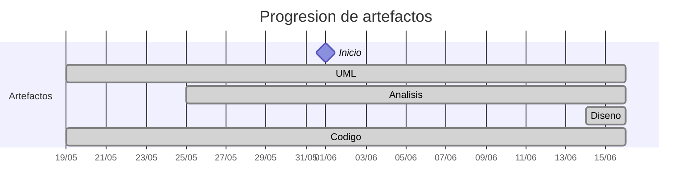

# Timeline - marcosgutierrez6

> Repo: [marcosgutierrez6/25-26-idsw2-sdVC](https://github.com/marcosgutierrez6/25-26-idsw2-sdVC)
> Commits: 99 | Días activos: 6 | Sesiones log: 130

## Patrón observado

| Métrica | Valor |
|---|---|
| Commits propios | 99 (77 feat / 22 fix / 0 other) |
| Ratio fix/feat | 0.28 |
| Días activos | 6 |
| Sesiones documentadas | 130 |
| Sesiones sin fecha en log | 130 |

<!-- trazabilidad: manual -->
## Trazabilidad por caso de uso

| Caso de uso | D7 | D8 | D11 | D14 | D16 |
|---|:---:|:---:|:---:|:---: | :---: |
| `corregirExamenes` | A |   |   | | D |
| `exportarConfiguracionGlobal` | A |   |   | | D |
| `generarExamenes` | A |   |   | | D |
| `importarConfiguracionGlobal` | A |   |   | | D |
| `exportarAlumnos` |   | A |   | |     |
| `importarAlumnos` |   | A |   | | D |
| `importarPreguntas` |   | A |   | | D |
| `asignarExamenes` |   |   | A | |     |
| `crearAlumno` |   |   | A | |     |
| `crearDocente` |   |   | A | |     |
| `crearPregunta` |   |   | A | |     |
| `editarAsignatura` |   |   | A | |     |
| `editarPregunta` |   |   | A | |     |
| `exportarPreguntas` |   |   | A | |     |
| `iniciarSesion` |   |   |   | A |     |
| `cerrarSesion` |   |   |   | A |     |
| `completarGestion` |   |   |   | A |     |
| `crearGrado` |   |   |   | A |     |
| `editarGrado` |   |   |   | A |     |
| `eliminarGrado` |   |   |   | A |     |
| `crearAsignatura` |   |   |   | A |     |
| `eliminarAsignatura` |   |   |   | A |     |
| `editarAlumno` |   |   |   | A |     |
| `eliminarAlumno` |   |   |   | A |     |
| `editarDocente` |   |   |   | A |     |
| `eliminarDocente` |   |   |   | A |     |
| `eliminarPregunta` |   |   |   | A |     |
| `verGrados` |   |   |   | A |     |
| `verAsignaturas` |   |   |   | A |     |
| `verAlumnos` |   |   |   | A |     |
| `verDocentes` |   |   |   | A |     |
| `verPreguntas` |   |   |   | A |     |
| `verRespuestas` |   |   |   | A |     |
| `crearRespuesta` |   |   |   | A |     |
| `editarRespuesta` |   |   |   | A |     |
| `eliminarRespuesta` |   |   |   | A |     |
| `importarGrados` |   |   |   | A |     |
| `importarAsignaturas` |   |   |   | A |     |
| `exportarGrados` |   |   |   | A |     |
| `exportarAsignaturas` |   |   |   | A |     |
| `cancelarGeneracion` |   |   |   | A |     |

---

## Día 1 · 2026-06-01

### Commits (13: 13 feat / 0 fix)

| Hora | Mensaje |
|---|---|
| 21:12 | [feat: Analisis del caso de uso de exportarGrados()](https://github.com/marcosgutierrez6/25-26-idsw2-sdVC/commit/91bfe7c4ae272f84d58648b2bf5376d8061e0f62) |
| 21:11 | [feat: Analisis del caso de uso de exportarAsignaturas()](https://github.com/marcosgutierrez6/25-26-idsw2-sdVC/commit/7cbfc53857f636e236d724a53af3df020e544b95) |
| 21:10 | [feat: Analisis del caso de uso de importarGrados()](https://github.com/marcosgutierrez6/25-26-idsw2-sdVC/commit/1e5bf4641830b74af11009eae37dc979273581d4) |
| 21:08 | [feat: Analisis del caso de uso de importarAsignaturas()](https://github.com/marcosgutierrez6/25-26-idsw2-sdVC/commit/c9d42c7dddea0950840c3224ca9f7e272e37c4e8) |
| 21:07 | [feat: Analisis del caso de uso de cancelarGeneracion()](https://github.com/marcosgutierrez6/25-26-idsw2-sdVC/commit/7c37505ea2be3041cee7049a35b49d58cade8964) |
| 21:06 | [feat: Analisis del caso de uso de eliminarRespuesta()](https://github.com/marcosgutierrez6/25-26-idsw2-sdVC/commit/9b26423cc71e9898c142c3bc58fd999bd6257a54) |
| 21:05 | [feat: Analisis del caso de uso de editarRespuesta()](https://github.com/marcosgutierrez6/25-26-idsw2-sdVC/commit/ec3349a4317b523a565b2f3d1a0ef529108ba4ef) |
| 21:04 | [feat: Analisis del caso de uso de crearRespuesta()](https://github.com/marcosgutierrez6/25-26-idsw2-sdVC/commit/734ddb910d3cd5cd71c318bf02d1750e54ce5775) |
| 21:03 | [feat: Analisis del caso de uso de verRespuestas()](https://github.com/marcosgutierrez6/25-26-idsw2-sdVC/commit/bc64ce1ec0362878ee00b121daa10721ca03b142) |
| 21:02 | [feat: Analisis del caso de uso de completarGestion()](https://github.com/marcosgutierrez6/25-26-idsw2-sdVC/commit/13a2d8ae0d90e1a27244da94543fcc4ff4af08c1) |
| 21:01 | [feat: Analisis del caso de uso de cerrarSesion()](https://github.com/marcosgutierrez6/25-26-idsw2-sdVC/commit/4283647f189ffc4bfe8174dad82803a08f92bf4d) |
| 21:00 | [feat: Analisis del caso de uso de iniciarSesion()](https://github.com/marcosgutierrez6/25-26-idsw2-sdVC/commit/87b62521b9cdea31ec5b0cb38864b2272326d515) |
| 20:59 | [feat: Analisis del caso de uso de eliminarDocente()](https://github.com/marcosgutierrez6/25-26-idsw2-sdVC/commit/80ed0ccb8f7361618301458ac63918a245f7e2bb) |

> ⚠️ Commits sin entrada en log

---

## Día 3 · 2026-06-03

### Commits (6: 6 feat / 0 fix)

| Hora | Mensaje |
|---|---|
| 21:34 | [feat: Diseño del caso de uso de importarPreguntas()](https://github.com/marcosgutierrez6/25-26-idsw2-sdVC/commit/c65437ee8e3c8a81aa6cd55bf8c17473c0101247) |
| 21:33 | [feat: Diseño del caso de uso de importarAlumnos()](https://github.com/marcosgutierrez6/25-26-idsw2-sdVC/commit/e4003db5c15fe05033550e41ca729621a5193012) |
| 21:30 | [feat: Diseño del caso de uso de exportarConfiguracionGlobal()](https://github.com/marcosgutierrez6/25-26-idsw2-sdVC/commit/d8f96cc435d37518af3bf63a10ed35899ca0d740) |
| 21:28 | [feat: Diseño del caso de uso de importarConfiguracionGlobal()](https://github.com/marcosgutierrez6/25-26-idsw2-sdVC/commit/75c1faf0397d40734961500c9f948651d528d722) |
| 21:23 | [feat: Diseño del caso de uso de generarExamenes()](https://github.com/marcosgutierrez6/25-26-idsw2-sdVC/commit/a1beee7061d5cfb70a4e9e6a11a114bd6a925e40) |
| 21:22 | [feat: Diseño del caso de uso de corregirExamenes()](https://github.com/marcosgutierrez6/25-26-idsw2-sdVC/commit/c670e236d2af9dc61264b90956b1dd96930dac7e) |

> ⚠️ Commits sin entrada en log

---

## Día 9 · 2026-06-09

### Commits (4: 4 feat / 0 fix)

| Hora | Mensaje |
|---|---|
| 20:09 | [feat: Diseño del caso de uso de crearPregunta()](https://github.com/marcosgutierrez6/25-26-idsw2-sdVC/commit/d0f055d4e728a610858bcf84cd2a05dcc4e84948) |
| 20:07 | [feat: Diseño del caso de uso de asignarExamenes()](https://github.com/marcosgutierrez6/25-26-idsw2-sdVC/commit/cf289418458d4bb3497047e378e14331b547054c) |
| 19:59 | [feat: Diseño del caso de uso de exportarPreguntas()](https://github.com/marcosgutierrez6/25-26-idsw2-sdVC/commit/c0726c830055ef1bcc99f33b47e178da0eb8c48f) |
| 19:54 | [feat: Diseño del caso de uso de exportarAlumnos()](https://github.com/marcosgutierrez6/25-26-idsw2-sdVC/commit/4d073d060ae9a60cb98ded3cded26e1379c2f334) |

> ⚠️ Commits sin entrada en log

---

## Día 14 · 2026-06-14

### Commits (33: 31 feat / 2 fix)

| Hora | Mensaje |
|---|---|
| 18:41 | [fix: README del src](https://github.com/marcosgutierrez6/25-26-idsw2-sdVC/commit/d9c9f3d5e0e84ffadb1eaece6067099fbb66e704) |
| 18:37 | [fix: Cambio en la estructura del proyecto y readmes](https://github.com/marcosgutierrez6/25-26-idsw2-sdVC/commit/a9e2d776943786329153088f840d536679171e55) |
| 18:33 | [feat: Diseño del caso de uso de  exportarGrados()](https://github.com/marcosgutierrez6/25-26-idsw2-sdVC/commit/033d63eeb460994520990b2c70bc4d8031512750) |
| 18:31 | [feat: Diseño del caso de uso de  exportarAsignaturas()](https://github.com/marcosgutierrez6/25-26-idsw2-sdVC/commit/1f29b5903cb9d52e4e56406227322ebb77aec8d9) |
| 18:29 | [feat: Diseño del caso de uso de  importarGrados()](https://github.com/marcosgutierrez6/25-26-idsw2-sdVC/commit/49aefd68a173b05719b33e276ba172045fa199b6) |
| 18:27 | [feat: Diseño del caso de uso de  importarAsignaturas()](https://github.com/marcosgutierrez6/25-26-idsw2-sdVC/commit/8a032689b32c7e748da7d080226aa668fa6e9451) |
| 17:58 | [feat: Diseño del caso de uso de  cancelarGeneracion()](https://github.com/marcosgutierrez6/25-26-idsw2-sdVC/commit/c38a58d3008860981ed3388e2ee3eddc6dd32193) |
| 17:56 | [feat: Diseño del caso de uso de  eliminarRespuesta()](https://github.com/marcosgutierrez6/25-26-idsw2-sdVC/commit/3fb7971f2f0d8b7ff6081881c9e2ba1f2569f66c) |
| 17:55 | [feat: Diseño del caso de uso de  editarRespuesta()](https://github.com/marcosgutierrez6/25-26-idsw2-sdVC/commit/02b01873103c59de63bb9fe522356a4e8fa2d5ac) |
| 17:52 | [feat: Diseño del caso de uso de  crearRespuesta()](https://github.com/marcosgutierrez6/25-26-idsw2-sdVC/commit/3750fa66f939159ef4e8cae6d7c62a22c7f3a8df) |
| 17:50 | [feat: Diseño del caso de uso de  verRespuestas()](https://github.com/marcosgutierrez6/25-26-idsw2-sdVC/commit/a3c01005a22d2dd68cc97c519ac5c6fb385354ca) |
| 17:49 | [feat: Diseño del caso de uso de  completarGestion()](https://github.com/marcosgutierrez6/25-26-idsw2-sdVC/commit/bd1d1d31880bb55d3075c891ae889c50157133c1) |
| 17:47 | [feat: Diseño del caso de uso de  cerrarSesion()](https://github.com/marcosgutierrez6/25-26-idsw2-sdVC/commit/e8f45d0b30f715eff4cb7ab30618c2fa29363396) |
| 17:46 | [feat: Diseño del caso de uso de  iniciarSesion()](https://github.com/marcosgutierrez6/25-26-idsw2-sdVC/commit/d545b07869636c6bee44b0e0dc06fc710e0cfedc) |
| 17:44 | [feat: Diseño del caso de uso de  eliminarDocente()](https://github.com/marcosgutierrez6/25-26-idsw2-sdVC/commit/aa6ee8f0d22758a3ab14f06f9540e6e3a802fdb0) |
| 17:42 | [feat: Diseño del caso de uso de  eliminarAlumno()](https://github.com/marcosgutierrez6/25-26-idsw2-sdVC/commit/22b34508d82010ffaaaeda3e8189839d68b71dfb) |
| 17:40 | [feat: Diseño del caso de uso de  eliminarGrado()](https://github.com/marcosgutierrez6/25-26-idsw2-sdVC/commit/cf60865a5d655ae79fe9bec7a60721b0ce6060ab) |
| 17:37 | [feat: Diseño del caso de uso de  eliminarAsignatura()](https://github.com/marcosgutierrez6/25-26-idsw2-sdVC/commit/9c8a2d467d45b38ef204136d367f3298cb6e4868) |
| 17:35 | [feat: Diseño del caso de uso de  eliminarPregunta()](https://github.com/marcosgutierrez6/25-26-idsw2-sdVC/commit/8eb0003a74952c6ba82f35a1ea5e56d2e96e3fcd) |
| 17:32 | [feat: Diseño del caso de uso de  verDocentes()](https://github.com/marcosgutierrez6/25-26-idsw2-sdVC/commit/4b29ab1d29a5eca5de335eef6fd2c5803b38672b) |
| 17:30 | [feat: Diseño del caso de uso de  verAlumnos()](https://github.com/marcosgutierrez6/25-26-idsw2-sdVC/commit/bc5faa331ad2be347d87fcfdc367d92b60f01897) |
| 17:28 | [feat: Diseño del caso de uso de  verGrados()](https://github.com/marcosgutierrez6/25-26-idsw2-sdVC/commit/8874895602561ff38fe1e3be539587a407cad4fe) |
| 17:26 | [feat: Diseño del caso de uso de  verAsignaturas()](https://github.com/marcosgutierrez6/25-26-idsw2-sdVC/commit/87d38850ceaea708a5a5c47e6a508f5b23ae12a5) |
| 17:25 | [feat: Diseño del caso de uso de  verPreguntas()](https://github.com/marcosgutierrez6/25-26-idsw2-sdVC/commit/d5d3c03456741c8c51f0b172149fc784a4b2064c) |
| 17:23 | [feat: Diseño del caso de uso de  editarGrado()](https://github.com/marcosgutierrez6/25-26-idsw2-sdVC/commit/f262b7b468d2ed2b80ccafa416221374ed9336c2) |
| 17:21 | [feat: Diseño del caso de uso de  crearAsignatura()](https://github.com/marcosgutierrez6/25-26-idsw2-sdVC/commit/f31fdad4fb690367fdffe11128d3f3ff087afbfa) |
| 17:19 | [feat: Diseño del caso de uso de  crearGrado()](https://github.com/marcosgutierrez6/25-26-idsw2-sdVC/commit/2c5e3c428d7184a03e926b932ca8eb2587da2c94) |
| 17:16 | [feat: Diseño del caso de uso de editarAlumno()](https://github.com/marcosgutierrez6/25-26-idsw2-sdVC/commit/198f60021a37290473a6dfe8f26867f7834637d7) |
| 17:13 | [feat: Diseño del caso de uso de editarDocente()](https://github.com/marcosgutierrez6/25-26-idsw2-sdVC/commit/1c5a1f3cfa6215e14f80adeddeb12587a5d146ab) |
| 17:12 | [feat: Diseño del caso de uso de crearAlumno()](https://github.com/marcosgutierrez6/25-26-idsw2-sdVC/commit/ab58535bfa025e6538e99463895ec92b08c58ffa) |
| 17:10 | [feat: Diseño del caso de uso de crearDocente()](https://github.com/marcosgutierrez6/25-26-idsw2-sdVC/commit/1991a7a92c5fa55377766b484910f5217dd55a27) |
| 17:08 | [feat: Diseño del caso de uso de editarAsignatura()](https://github.com/marcosgutierrez6/25-26-idsw2-sdVC/commit/5d8a4bc285af5945cf9f2b211a493ed18cd6a08c) |
| 17:06 | [feat: Diseño del caso de uso de editarPregunta()](https://github.com/marcosgutierrez6/25-26-idsw2-sdVC/commit/c7197586e3cf40aa7328f49fad1374ed0ec9301b) |

**Artefactos nuevos:** 🧩 

> ⚠️ Commits sin entrada en log

---

## Día 15 · 2026-06-15

### Commits (39: 22 feat / 17 fix)

| Hora | Mensaje |
|---|---|
| 22:31 | [Fix: Generación de examenes, más preguntas en el seed](https://github.com/marcosgutierrez6/25-26-idsw2-sdVC/commit/9a841681e7997625a8fdaeaec195f2b4320e5741) |
| 22:17 | [Feat: Importar y exportar configuración](https://github.com/marcosgutierrez6/25-26-idsw2-sdVC/commit/5b41008e4aa5daf02a674773e1d04c35670e269e) |
| 22:07 | [Fix: Arreglo en el formulario de bateria de preguntas y conversation logs](https://github.com/marcosgutierrez6/25-26-idsw2-sdVC/commit/569d2f0ec384ce8af355681706ee8480022759bc) |
| 22:04 | [Fix: Seed evitar errores, response ajustes en preguntas listado y formulario, como acceder a la respuesta del backend](https://github.com/marcosgutierrez6/25-26-idsw2-sdVC/commit/3a9c46ff513764ec87ffbf85d8022e09a1c9e112) |
| 21:52 | [Feat: Seed con datos de prueba](https://github.com/marcosgutierrez6/25-26-idsw2-sdVC/commit/f97dcd65c43520c32fa26569244b3d260c2894db) |
| 21:47 | [Fix: Bateria de preguntas esqueba base de datos, formulario y vista](https://github.com/marcosgutierrez6/25-26-idsw2-sdVC/commit/f5cc862e8ca10678ed03461e7dd2d5e2c9f81064) |
| 21:34 | [Fix: Conversation log](https://github.com/marcosgutierrez6/25-26-idsw2-sdVC/commit/9dfbf62ec31bc87f3925e1957262f3bdb98d14ce) |
| 21:33 | [Feat: Reordenación del menu](https://github.com/marcosgutierrez6/25-26-idsw2-sdVC/commit/0557d994559dda9ab0bacf510487440ded0a01b2) |
| 21:29 | [Fix: Minutos conversation log](https://github.com/marcosgutierrez6/25-26-idsw2-sdVC/commit/6eca138c87c8321b7133ac0c526701324ed3ded4) |
| 21:29 | [Fix: Añadido el conversation log](https://github.com/marcosgutierrez6/25-26-idsw2-sdVC/commit/717c9a01f54917aa128cd8f08982c6224cfdbf82) |
| 21:28 | [Fix: Contrastado los diagramas con el codigo y creación de los formularios para alumnos y docentes](https://github.com/marcosgutierrez6/25-26-idsw2-sdVC/commit/2db2f0b8a7c92e50ddee86e3923ce6f136cee83d) |
| 21:24 | [Fix: Dialog de Alumnos](https://github.com/marcosgutierrez6/25-26-idsw2-sdVC/commit/baf25e4c90d44579a58a28caa4b0fef74a7103c8) |
| 21:23 | [Fix: Quitar preguntas contextuales del menu](https://github.com/marcosgutierrez6/25-26-idsw2-sdVC/commit/4ad3d212dda3330aeaed941afceb5ab879d4efa2) |
| 21:22 | [fix: corregir carga de baterías y inicialización de asignaturaId en PreguntasFormView](https://github.com/marcosgutierrez6/25-26-idsw2-sdVC/commit/ecc518c7a45c7cb2bba2a39f9261996bc7678c98) |
| 21:20 | [feat: crear formulario de preguntas normales reutilizable con asignaturaId por props via Pinia](https://github.com/marcosgutierrez6/25-26-idsw2-sdVC/commit/ef907414f27ad2e37befec0acef11491d29a8fbc) |
| 21:17 | [feat: Preguntas contextuales y reorganizacion de las vistas del frontend + conversation logs antiguos](https://github.com/marcosgutierrez6/25-26-idsw2-sdVC/commit/8695f5cfe5aee8e85304e2992c48a8d2b06c3635) |
| 18:18 | [feat: Formulario de asignatura con todos sus tabs y ajustes del backend para obtener las preguntas, examenes contextuales](https://github.com/marcosgutierrez6/25-26-idsw2-sdVC/commit/78fdb8dc8e4809ddcf5a99bbf0b60e9df3f8eadd) |
| 18:09 | [feat: Cambio en el formulario de creacion y edición de grados y la logica del backend para traer lo relacionado con el grado de alunos y asignaturas](https://github.com/marcosgutierrez6/25-26-idsw2-sdVC/commit/7c031e92e56d1e413f723461efa9ae7975d1ed27) |
| 17:55 | [feat: Reestructurar vistas, eliminar codigo duplicado del toast y añadir la bateria de preguntas + menu dinamico](https://github.com/marcosgutierrez6/25-26-idsw2-sdVC/commit/e9a66ab9c6f781670492e73f40eb10c84458b556) |
| 17:47 | [feat: Dashboard y layout](https://github.com/marcosgutierrez6/25-26-idsw2-sdVC/commit/99f1b86055eeafba67f958f6572c51eb3115d255) |
| 17:26 | [feat: Cambio en la vista del front del login + toast para las notificaciones](https://github.com/marcosgutierrez6/25-26-idsw2-sdVC/commit/880f0ed659eca8ff2852471fdf3348d67de5e0ce) |
| 17:10 | [feat: Backend de Bateria](https://github.com/marcosgutierrez6/25-26-idsw2-sdVC/commit/9a89962f135ad115b650e394b9c554ba11b67eb5) |
| 17:07 | [feat: Caso de uso backend Cancelar generación](https://github.com/marcosgutierrez6/25-26-idsw2-sdVC/commit/503c7f4f160e6cbe7da60f86cf848c0e2d13255c) |
| 17:04 | [feat: Backend de Respuesta](https://github.com/marcosgutierrez6/25-26-idsw2-sdVC/commit/2b528e2486673de91209de573a4a518041364d2e) |
| 16:52 | [feat: Backend de Auth](https://github.com/marcosgutierrez6/25-26-idsw2-sdVC/commit/2c6cb146aef8c0c9fec35560a8a9a1bc96561aaa) |
| 16:43 | [feat: Backend de Grado](https://github.com/marcosgutierrez6/25-26-idsw2-sdVC/commit/50cedb7a767a2cc8d63c41e6126f5f42b5fba2ee) |
| 16:40 | [feat: Backend de Alumno](https://github.com/marcosgutierrez6/25-26-idsw2-sdVC/commit/4c5fbe3235627f98228ef56224191eccdd3eb4fe) |
| 16:37 | [feat: Backend de Docente](https://github.com/marcosgutierrez6/25-26-idsw2-sdVC/commit/060543b607f20790b9b41ecbfafc53c4fd338840) |
| 16:35 | [fix: Conversation log no añadido](https://github.com/marcosgutierrez6/25-26-idsw2-sdVC/commit/2b38888570fc6292b73d82d8664314d268ee004f) |
| 16:32 | [feat: Backend de Preguntas](https://github.com/marcosgutierrez6/25-26-idsw2-sdVC/commit/6bd5a66ea2a114de03c5c9035a4b4bcca0d765f5) |
| 16:31 | [feat: Backend de Configuración](https://github.com/marcosgutierrez6/25-26-idsw2-sdVC/commit/bfa079e3777eb37bea9df702ed3b5f81c98832e9) |
| 16:26 | [feat: Backend del caso de uso de corregirExamenes()](https://github.com/marcosgutierrez6/25-26-idsw2-sdVC/commit/82030239db09053e2ac7ffc5c6341e84aa28fd46) |
| 16:22 | [feat: Estructura del backend separado por entidades](https://github.com/marcosgutierrez6/25-26-idsw2-sdVC/commit/1439fde2da0f30bfd5ac153d74df5da3dca29106) |
| 16:05 | [feat: Cambios a la DB para que quede alineado con el diseño](https://github.com/marcosgutierrez6/25-26-idsw2-sdVC/commit/e3b88eaa52d569972dbab7d29fa3781b0830eef2) |
| 15:58 | [fix: conversation log anterior no añadido](https://github.com/marcosgutierrez6/25-26-idsw2-sdVC/commit/62165efa7c4a703967032e7cc415c3e1164931fc) |
| 15:55 | [fix: Añadido enlace al codigo uml para mas claridad en el readme](https://github.com/marcosgutierrez6/25-26-idsw2-sdVC/commit/b88bbb448cf0d076af31bdd9f2909c768263fbdc) |
| 15:52 | [fix: Ajustes en las tablas de los readme de diseño](https://github.com/marcosgutierrez6/25-26-idsw2-sdVC/commit/c5d63444c7a3c9ffa44e4c00b07f9b5b57f4569a) |
| 10:25 | [fix: Cambio en los diagramas de diseño](https://github.com/marcosgutierrez6/25-26-idsw2-sdVC/commit/3a5b37792875d134979581baf630fb153c1b4c9a) |
| 09:48 | [fix: Corrección en los diagramas de diseño separación entre vistas y formularios](https://github.com/marcosgutierrez6/25-26-idsw2-sdVC/commit/341b28b5c5fdbbc90c121c493316e15061fd4a4c) |

> ⚠️ Commits sin entrada en log

---

## Día 16 · 2026-06-16

### Commits (4: 1 feat / 3 fix)

| Hora | Mensaje |
|---|---|
| 09:38 | [Feat: Cambio en el tema principal de la aplicación incorporación de logos y favicon](https://github.com/marcosgutierrez6/25-26-idsw2-sdVC/commit/70d0ddcc48e242891dafadda8a7121207e716bb7) |
| 09:28 | [Fix: Conversation log](https://github.com/marcosgutierrez6/25-26-idsw2-sdVC/commit/f85deaee932dfd5ac5fe81dbbdcaf166513288c7) |
| 09:28 | [Fix: Cambio en los examenes, migraciones y subida de pdf](https://github.com/marcosgutierrez6/25-26-idsw2-sdVC/commit/95a196756cc6af0f87b414c7dab744c84db890fd) |
| 09:06 | [Fix: Generación de examenes](https://github.com/marcosgutierrez6/25-26-idsw2-sdVC/commit/92e085d40dfa4721b85b772c67cb9e1b0358368f) |

> ⚠️ Commits sin entrada en log

---

