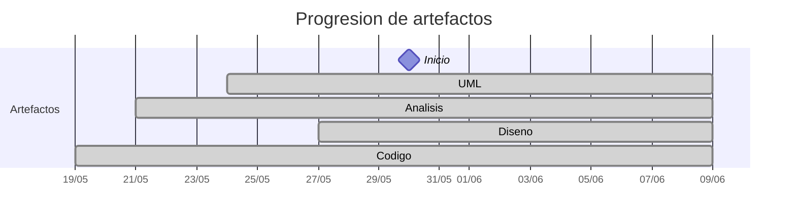

# Timeline - martinlopez7

> Repo: [martinlopez7/25-26-idsw2-sdVC](https://github.com/martinlopez7/25-26-idsw2-sdVC)
> Commits: 99 | Días activos: 11 | Sesiones log: 110

## Patrón observado

| Métrica | Valor |
|---|---|
| Commits propios | 99 (48 feat / 41 fix / 10 other) |
| Ratio fix/feat | 0.85 |
| Días activos | 11 |
| Sesiones documentadas | 110 |
| Días log+commits | 7 |
| Días solo log | 10 |
| Días solo commits | 4 |

## Trazabilidad por caso de uso

| Caso de uso | D-8 | D-7 | D-6 | D-5 | D-4 | D-3 | D-2 | D-1 | D1 | D3 | D4 | D5 | D6 |
|---|:---:|:---:|:---:|:---:|:---:|:---:|:---:|:---:|:---:|:---:|:---:|:---:|:---:|
| `verAsignaturas` | A |   |   |   |   |   |   |   |   | D |   |   |   |
| `verGrados` | A |   |   |   |   |   |   |   | D |   |   |   |   |
| `cerrarSesion` |   | A |   |   |   |   | D |   |   |   |   |   |   |
| `iniciarSesion` |   | A |   |   |   |   | D |   |   |   |   |   |   |
| `verAlumnos` |   | A |   |   |   |   |   | D |   |   |   |   |   |
| `completarGestion` |   |   | A |   |   |   |   | D |   |   |   |   |   |
| `verDocentes` |   |   | A |   |   |   | D |   |   |   |   |   |   |
| `verPreguntas` |   |   | A |   |   |   |   |   |   |   | D |   |   |
| `verRespuestas` |   |   | A |   |   |   |   |   |   |   | D |   |   |
| `crearDocente` |   |   |   | A |   |   | D |   |   |   |   |   |   |
| `crearGrado` |   |   |   | A |   |   |   |   | D |   |   |   |   |
| `editarDocente` |   |   |   | A |   |   | D |   |   |   |   |   |   |
| `eliminarDocente` |   |   |   | A |   |   |   | D |   |   |   |   |   |
| `exportarConfiguracionGlobal` |   |   |   | A |   |   |   |   |   |   |   | D |   |
| `importarConfiguracionGlobal` |   |   |   | A |   |   |   |   |   |   |   | D |   |
| `crearAlumno` |   |   |   |   | A |   |   | D |   |   |   |   |   |
| `crearAsignatura` |   |   |   |   | A |   |   |   |   | D |   |   |   |
| `editarAlumno` |   |   |   |   | A |   |   | D |   |   |   |   |   |
| `editarGrado` |   |   |   |   | A |   |   |   | D |   |   |   |   |
| `eliminarAlumno` |   |   |   |   | A |   |   | D |   |   |   |   |   |
| `eliminarGrado` |   |   |   |   | A |   |   |   | D |   |   |   |   |
| `crearPregunta` |   |   |   |   |   | A |   |   |   |   | D |   |   |
| `crearRespuesta` |   |   |   |   |   | A |   |   |   |   | D |   |   |
| `editarAsignatura` |   |   |   |   |   | A |   |   |   | D |   |   |   |
| `editarPregunta` |   |   |   |   |   | A |   |   |   |   | D |   |   |
| `editarRespuesta` |   |   |   |   |   | A |   |   |   |   | D |   |   |
| `eliminarAsignatura` |   |   |   |   |   | A |   |   |   | D |   |   |   |
| `eliminarPregunta` |   |   |   |   |   | A |   |   |   |   | D |   |   |
| `eliminarRespuesta` |   |   |   |   |   | A |   |   |   |   | D |   |   |
| `generarExamenes` |   |   |   |   |   | A |   |   |   |   |   |   | D |
| `asignarExamenes` |   |   |   |   |   |   | A |   |   |   |   |   | D |
| `cancelarGeneracion` |   |   |   |   |   |   | A |   |   |   |   |   | D |
| `corregirExamenes` |   |   |   |   |   |   | A |   |   |   |   |   | D |

---

## Día -9 · 2026-05-20

### 💬 Conversation-log (1 sesión)

- Crear archivo AGENTS.md con protocolo de inicialización

> ⚠️ Log sin commits

---

## Día -8 · 2026-05-21

### 💬 Conversation-log (2 sesiónes)

- Revisión de interiorización de la naturaleza del sistema y análisis de verGrados()
- Análisis de verAsignaturas()

**Artefactos nuevos:** 🔍 

> ⚠️ Log sin commits

---

## Día -7 · 2026-05-22

### 💬 Conversation-log (3 sesiónes)

- Análisis de iniciarSesion()
- Análisis de cerrarSesion()
- Análisis de verAlumnos()

> ⚠️ Log sin commits

---

## Día -6 · 2026-05-23

### 💬 Conversation-log (4 sesiónes)

- Análisis de verDocentes()
- Análisis de verPreguntas()
- Análisis de verRespuestas()
- Análisis de completarGestion()

> ⚠️ Log sin commits

---

## Día -5 · 2026-05-24

### 💬 Conversation-log (6 sesiónes)

- Análisis de crearDocente()
- Análisis de editarDocente()
- Análisis de eliminarDocente()
- Análisis de exportarConfiguracionGlobal()
- Análisis de importarConfiguracionGlobal()
- Análisis de crearGrado()

**Artefactos nuevos:** 📐 

> ⚠️ Log sin commits

---

## Día -4 · 2026-05-25

### 💬 Conversation-log (6 sesiónes)

- Análisis de editarGrado()
- Análisis de eliminarGrado()
- Análisis de crearAlumno()
- Análisis de editarAlumno()
- Análisis de eliminarAlumno()
- Análisis de crearAsignatura()

> ⚠️ Log sin commits

---

## Día -3 · 2026-05-26

### 💬 Conversation-log (9 sesiónes)

- Análisis de editarAsignatura()
- Análisis de eliminarAsignatura()
- Análisis de crearPregunta()
- Análisis de editarPregunta()
- Análisis de eliminarPregunta()
- Análisis de crearRespuesta()
- Análisis de editarRespuesta()
- Análisis de eliminarRespuesta()
- Análisis de generarExamenes()

> ⚠️ Log sin commits

---

## Día -2 · 2026-05-27

### 💬 Conversation-log (8 sesiónes)

- Análisis de cancelarGeneracion()
- Análisis de asignarExamenes()
- Análisis de corregirExamenes()
- Diseño de iniciarSesion()
- Diseño de cerrarSesion()
- Diseño de crearDocente()
- Diseño de verDocentes()
- Diseño de editarDocente()

**Artefactos nuevos:** 🧩 

> ⚠️ Log sin commits

---

## Día -1 · 2026-05-28

### 💬 Conversation-log (6 sesiónes)

- Diseño de eliminarDocente()
- Diseño de completarGestion()
- Diseño de verAlumnos()
- Diseño de crearAlumno()
- Diseño de editarAlumno()
- Diseño de eliminarAlumno()

> ⚠️ Log sin commits

---

## Día 0 · 2026-05-29

### 💬 Conversation-log (7 sesiónes)

- Inicialización de proyectos e implementación de iniciarSesion
- Implementación de cerrarSesion()
- Implementación de verDocentes() y menús diferenciados por actor
- Implementación de crearDocente() y corrección de JwtAuthenticationFilter
- Corrección de verDocentes() de acuerdo a su diseño
- Implementación de editarDocente()
- Implementación de eliminarDocente()

> ⚠️ Log sin commits

---

## Día 1 · 2026-05-30

### Commits (11: 7 feat / 1 fix)

| Hora | Mensaje |
|---|---|
| 17:34 | [feat: diseño de eliminarGrado](https://github.com/martinlopez7/25-26-idsw2-sdVC/commit/c75e880f13bb0271496b2274eb373db59aa433d7) |
| 17:26 | [feat: diseño de editarGrado](https://github.com/martinlopez7/25-26-idsw2-sdVC/commit/5640fe2a3f0bcf9b6889ad2ec579f4b033abb423) |
| 17:00 | [docs: aceptación de diseño crearGrado](https://github.com/martinlopez7/25-26-idsw2-sdVC/commit/c35d89d84368c3040fb9caa3f7a25696eb0a42d5) |
| 16:59 | [feat: diseño de crearGrado](https://github.com/martinlopez7/25-26-idsw2-sdVC/commit/bd449d5dcacf5f3867ff112e08c4b6fe57f261b2) |
| 16:53 | [docs: aceptación del diseño de verGrados](https://github.com/martinlopez7/25-26-idsw2-sdVC/commit/785de22107efd5d24a01706ede10ae05d37ec618) |
| 16:50 | [feat: diseño de verGrados](https://github.com/martinlopez7/25-26-idsw2-sdVC/commit/b95615e139d68b1c29773ac90407ce1aa467738c) |
| 16:29 | [feat: implementación caso de uso eliminarAlumno](https://github.com/martinlopez7/25-26-idsw2-sdVC/commit/635d9d62dc3748750a037d470ff0891f43081fd8) |
| 15:52 | [fix: corrección implementación editarAlumno](https://github.com/martinlopez7/25-26-idsw2-sdVC/commit/f6fe6eb769f33480b1a1a19027917058002994df) |
| 15:43 | [feat: implementacion caso de uso editarAlumno](https://github.com/martinlopez7/25-26-idsw2-sdVC/commit/e4a0bd0c2e6f17b8415d19432d1e0404a462060f) |
| 14:42 | [feat: implementacion de crearAlumno](https://github.com/martinlopez7/25-26-idsw2-sdVC/commit/25540418ddff6a27cb8233a5ab38bfbf66c59a4c) |
| 10:17 | [docs: aceptacion de implementacion de verAlumnos](https://github.com/martinlopez7/25-26-idsw2-sdVC/commit/5cc80f5734351d7925270098a59d2cc60dd202d4) |

### 💬 Conversation-log (8 sesiónes)

- Implementación de verAlumnos()
- Implementación de crearAlumno()
- Implementación de editarAlumno()
- Implementación de eliminarAlumno()
- Diseño de verGrados()
- Diseño de crearGrado()
- Diseño de editarGrado()
- Diseño de eliminarGrado()

> 💬 + commits = proceso documentado

---

## Día 2 · 2026-05-31

### Commits (9: 4 feat / 3 fix)

| Hora | Mensaje |
|---|---|
| 13:40 | [feat: implementacion de eliminarGrado](https://github.com/martinlopez7/25-26-idsw2-sdVC/commit/2d2016c3ca50af6e0a03f2d59d69006047703d1a) |
| 13:09 | [docs: adición de imagen del diagrama del diseño de editarGrado (se me olvidó en su momento)](https://github.com/martinlopez7/25-26-idsw2-sdVC/commit/e20d2737b4010bd8604c77a95377dc68aa0bf142) |
| 13:05 | [feat: implementación de editarGrado](https://github.com/martinlopez7/25-26-idsw2-sdVC/commit/6dfed7bbb7a41a058671706a25e47c1354b67556) |
| 12:42 | [feat: implementacion de crearGrado](https://github.com/martinlopez7/25-26-idsw2-sdVC/commit/38d0d0444db1f587a62967755ee252dc24d4bcc0) |
| 12:14 | [feat: implementación de verGrados](https://github.com/martinlopez7/25-26-idsw2-sdVC/commit/631b44485a350b86a5b02646f66f77706d4a876e) |
| 11:44 | [fix: correccion diseño eliminarGrado](https://github.com/martinlopez7/25-26-idsw2-sdVC/commit/3b0a15095e2e98822a3d61a0f297a84fd8fefa9c) |
| 11:21 | [fix: corrección diseño eliminarDocente](https://github.com/martinlopez7/25-26-idsw2-sdVC/commit/13616074df3b59908737bf5811e8a7bbd2e6e8ac) |
| 11:13 | [docs: documentación del diagrama entidad-relación del sistema](https://github.com/martinlopez7/25-26-idsw2-sdVC/commit/8afd87c4ab63ca84cdb57ab538f36bcb8c9904c3) |
| 10:49 | [fix: simplificación analisis y diseño de completarGestion](https://github.com/martinlopez7/25-26-idsw2-sdVC/commit/cb94ef537bb1d6dc4704e46fb7b327ede7619537) |

### 💬 Conversation-log (7 sesiónes)

- Corrección de análisis y diseño de completarGestion
- Corrección de diseño de eliminarDocente
- Corrección de diseño de eliminarGrado
- Implementación de verGrados()
- Implementación de crearGrado()
- Implementación de editarGrado()
- Implementación de eliminarGrado()

> 💬 + commits = proceso documentado

---

## Día 3 · 2026-06-01

### Commits (19: 8 feat / 10 fix)

| Hora | Mensaje |
|---|---|
| 21:01 | [fix: corrección cohesión implementación editarAsignatura](https://github.com/martinlopez7/25-26-idsw2-sdVC/commit/d6d6431258df5e4e037ad6ffbda1dc4403a7622e) |
| 20:52 | [fix: corrección cohesión diseño editarAsignatura](https://github.com/martinlopez7/25-26-idsw2-sdVC/commit/5153c92f1712bea02fe70a350e2b7c3f8404e5bf) |
| 19:49 | [refactor: eliminación de botón redundante](https://github.com/martinlopez7/25-26-idsw2-sdVC/commit/601ae997a70348744f325e4444dd48c718a9aaee) |
| 19:43 | [fix: correccion de implementación de crearAsignatura para transferir automáticamente a edición](https://github.com/martinlopez7/25-26-idsw2-sdVC/commit/0011f9e4d64c218b8c2f25b98fcec6cad73f2f7e) |
| 13:52 | [feat: implementacion de eliminarAsignatura](https://github.com/martinlopez7/25-26-idsw2-sdVC/commit/0be5428ea74904502b0140eb66d2d76ce7e03dd7) |
| 13:44 | [fix: correccion diseño eliminarAsignatura (se me olvidó actualizar el diagrama)](https://github.com/martinlopez7/25-26-idsw2-sdVC/commit/a23b1064dd184fdcebd56f20f41ed6fafe54e4f5) |
| 13:39 | [fix: corrección diseño eliminarAsignatura](https://github.com/martinlopez7/25-26-idsw2-sdVC/commit/e3e7f71c20bb9cd9f9a41c12335bccbcf523dc74) |
| 13:30 | [feat: implementacion de editarAsignatura](https://github.com/martinlopez7/25-26-idsw2-sdVC/commit/fa6ae926b3e633220bbd5295679019922ed02b8f) |
| 12:09 | [feat: implementacion de crearAsignatura](https://github.com/martinlopez7/25-26-idsw2-sdVC/commit/c99847e9a714088e11cf1623cf82c26bdb7e08fe) |
| 11:54 | [feat: implementacion de verAsignaturas](https://github.com/martinlopez7/25-26-idsw2-sdVC/commit/b830bad90df89db2fbf34dc637c5808e9c0bb57d) |
| 11:52 | [fix: typo en README de diseño de eliminarAsignatura](https://github.com/martinlopez7/25-26-idsw2-sdVC/commit/230bb01b7007572dbe6cd5add490e02aa2147560) |
| 11:45 | [fix: correccion diagrama entidad-relacion](https://github.com/martinlopez7/25-26-idsw2-sdVC/commit/4556a9ac40b1cd6ce3835be24edde145890522ec) |
| 11:23 | [feat: diseño de eliminarAsignatura](https://github.com/martinlopez7/25-26-idsw2-sdVC/commit/f5da0aaefd771765539bc287b9496c1e4bb7caab) |
| 11:18 | [feat: diseño de editarAsignatura](https://github.com/martinlopez7/25-26-idsw2-sdVC/commit/9784b63e4ed1d5523b905976c272139119f49a11) |
| 11:05 | [feat: diseño de crearAsignatura](https://github.com/martinlopez7/25-26-idsw2-sdVC/commit/fdf812100683b0917c6f7f96b8e725c0cef1dd46) |
| 10:46 | [feat: diseño de verAsignaturas](https://github.com/martinlopez7/25-26-idsw2-sdVC/commit/25581c6bcaca3a2a6cadb974b306c737915cb032) |
| 10:39 | [fix: correccion cohesion implementación editarGrado](https://github.com/martinlopez7/25-26-idsw2-sdVC/commit/39e00cbd7e816c53748bfa8977e2022b9e93e3cd) |
| 10:24 | [fix: pequeño fix cohesión diseño editarGrado](https://github.com/martinlopez7/25-26-idsw2-sdVC/commit/b9fb5f6375ff5b2cdef50187869e8791a5d2b86f) |
| 10:08 | [fix: correccion cohesion diseño editarGrado](https://github.com/martinlopez7/25-26-idsw2-sdVC/commit/5f7480bb9e10d22c7fe8ea725bf220e0e5cdd7c4) |

### 💬 Conversation-log (10 sesiónes)

- Error de cohesión en el diseño e implementación de editarGrado
- Diseño de verAsignaturas()
- Diseño de crearAsignatura()
- Diseño de editarAsignatura()
- Diseño de eliminarAsignatura()
- Implementación de verAsignaturas()
- Implementación de crearAsignatura()
- Implementación de editarAsignatura()
- Implementación de eliminarAsignatura()
- Refactorización de editarAsignatura() para mejorar cohesión entre servicios

> 💬 + commits = proceso documentado

---

## Día 4 · 2026-06-02

### Commits (19: 16 feat / 3 fix)

| Hora | Mensaje |
|---|---|
| 14:34 | [feat: implementacion de eliminarRespuesta](https://github.com/martinlopez7/25-26-idsw2-sdVC/commit/e63dde7cfd6564011c4706cb3a9ff1f66bd09a74) |
| 14:25 | [feat: implementacion de editarRespuesta](https://github.com/martinlopez7/25-26-idsw2-sdVC/commit/3b9b3bfce5bc8a8424f6bbd921a7e833706f2767) |
| 14:02 | [feat: implementacion de crearRespuesta](https://github.com/martinlopez7/25-26-idsw2-sdVC/commit/c0dd3b435ab1cf672647d42f9752169254f370bb) |
| 13:52 | [feat: implementacion de verRespuestas](https://github.com/martinlopez7/25-26-idsw2-sdVC/commit/4e4fda5aaf5b4c61aa3b599452cad3bbf1e88b54) |
| 13:35 | [feat: implementación de eliminarPregunta](https://github.com/martinlopez7/25-26-idsw2-sdVC/commit/c5b1c0c98d39cb930729f616032c414981b011cd) |
| 13:24 | [feat: implementacion de editarPregunta](https://github.com/martinlopez7/25-26-idsw2-sdVC/commit/39efdd2107481786dea51529f65ee234d77cb650) |
| 13:13 | [feat: implementacion de crearPregunta](https://github.com/martinlopez7/25-26-idsw2-sdVC/commit/1b164332ff43557bb418c4103c6685f120dcd9a5) |
| 12:49 | [feat: implementacion de verPreguntas](https://github.com/martinlopez7/25-26-idsw2-sdVC/commit/a4ba7aafb70f0896a4b984e09403eddbfb4424f7) |
| 12:24 | [feat: diseño de eliminarRespuesta](https://github.com/martinlopez7/25-26-idsw2-sdVC/commit/481414151d72950cad19e69d48b72f273ba9e340) |
| 12:17 | [feat: diseño de editarRespuesta](https://github.com/martinlopez7/25-26-idsw2-sdVC/commit/dd23b04de681b34bbdb996540cf00b52373de165) |
| 12:09 | [feat: diseño de crearRespuesta](https://github.com/martinlopez7/25-26-idsw2-sdVC/commit/36dea70c775d7e0d39fa5f17f4a1193f09fa56e7) |
| 12:01 | [feat: diseño de verRespuestas](https://github.com/martinlopez7/25-26-idsw2-sdVC/commit/d3d53e5a679865aa61dcb6d380f1fb68f603c9dd) |
| 11:54 | [feat: diseño de eliminarPregunta](https://github.com/martinlopez7/25-26-idsw2-sdVC/commit/62d661e5bce6291ca16ce831ad6eb2e58f7d22a7) |
| 11:48 | [feat: diseño de editarPregunta](https://github.com/martinlopez7/25-26-idsw2-sdVC/commit/8082e46c845aeec7d1637f0e4e5308ff98380cbc) |
| 10:36 | [fix: correccion cohesion diseño crearPregunta](https://github.com/martinlopez7/25-26-idsw2-sdVC/commit/1fcc0a5101918fe0dce90c9648d21c983da54780) |
| 10:19 | [feat: diseño de crearPregunta](https://github.com/martinlopez7/25-26-idsw2-sdVC/commit/2d256634f1d4c2655150e0693349a961659e4d5c) |
| 10:11 | [fix: correccion diseño verPreguntas](https://github.com/martinlopez7/25-26-idsw2-sdVC/commit/63472987078dfa1ac19da10c8b12a2bb41917704) |
| 10:06 | [feat: diseño de verPreguntas](https://github.com/martinlopez7/25-26-idsw2-sdVC/commit/92e116344af3e74306e67864af7f59df33183d6c) |
| 10:00 | [fix: correccion diagrama entidad relacion](https://github.com/martinlopez7/25-26-idsw2-sdVC/commit/e979df8c824d2358db511c756bf65abe51bfbb7a) |

### 💬 Conversation-log (16 sesiónes)

- Diseño de verPreguntas()
- Diseño de crearPregunta()
- Diseño de casos de uso editarPregunta()
- Diseño de caso de uso eliminarPregunta()
- Diseño de caso de uso verRespuestas()
- Diseño de caso de uso crearRespuesta()
- Diseño de caso de uso editarRespuesta()
- Diseño de caso de uso eliminarRespuesta()
- Implementación del caso de uso verPreguntas()
- Implementación de crearPregunta()
- Implementación de editarPregunta()
- Implementación de eliminarPregunta()
- Implementación de verRespuestas()
- Implementación de crearRespuesta()
- Implementación de editarRespuesta() y corrección de cohesión en verRespuestas() y crearRespuesta()
- Implementación de eliminarRespuesta()

> 💬 + commits = proceso documentado

---

## Día 5 · 2026-06-03

### Commits (13: 4 feat / 9 fix)

| Hora | Mensaje |
|---|---|
| 13:45 | [fix: correccion implementacion eliminarDocente](https://github.com/martinlopez7/25-26-idsw2-sdVC/commit/5ca590a7cf1cb57246368457d890735332930964) |
| 13:37 | [fix: correccion diseño eliminarDocente](https://github.com/martinlopez7/25-26-idsw2-sdVC/commit/55e6b2d856ed3324cdb715226b152e6d4daecf26) |
| 13:12 | [fix: correccion implementacion eliminarGrado](https://github.com/martinlopez7/25-26-idsw2-sdVC/commit/bd9a78f1881be8bbe4dbc7d74fe099f9f19a2def) |
| 13:03 | [fix: correccion diseño eliminarGrado](https://github.com/martinlopez7/25-26-idsw2-sdVC/commit/0f74eb934bbf3236c334e3251e9600863be00ede) |
| 12:31 | [fix: correccion diseño eliminarGrado](https://github.com/martinlopez7/25-26-idsw2-sdVC/commit/8402561cb8e73443db124c4a8c8b5eb9b06839d3) |
| 12:13 | [fix: correccion diseño eliminarGrado](https://github.com/martinlopez7/25-26-idsw2-sdVC/commit/bb2fd1bb94db55771e3984236ef35cd213f6e314) |
| 11:33 | [fix: correccion implementacion de eliminarAsignatura](https://github.com/martinlopez7/25-26-idsw2-sdVC/commit/ce131a1a0fca29a02d4f78a14143d823bdffb625) |
| 11:23 | [fix: corrección diseño eliminarAsignatura](https://github.com/martinlopez7/25-26-idsw2-sdVC/commit/88b5e032f3b182061af4770f1b942b578dd30466) |
| 11:04 | [feat: implementacion de importarConfiguracionGlobal](https://github.com/martinlopez7/25-26-idsw2-sdVC/commit/f55516bcbd56db88ec2c48d2d30cd3ffbc64af52) |
| 10:17 | [fix: corrección implementación exportarConfiguracionGlobal para ser fiel al diagrama de contexto](https://github.com/martinlopez7/25-26-idsw2-sdVC/commit/ff01a9796e75419c3a63c6ee757a20e2f31f2a02) |
| 10:00 | [feat: implementacion de exportarConfiguracionGlobal](https://github.com/martinlopez7/25-26-idsw2-sdVC/commit/8c21b65f7da99eb1d387a84172ca14ae0cdbeb38) |
| 09:44 | [feat: diseño de importarConfiguracionGlobal](https://github.com/martinlopez7/25-26-idsw2-sdVC/commit/922d1119875f15984a86e49c2b35ba082e822872) |
| 09:33 | [feat: diseño de exportarConfiguracionGlobal](https://github.com/martinlopez7/25-26-idsw2-sdVC/commit/cc0a4964a81baeb7aaa024867e5da75cc4eff2c8) |

### 💬 Conversation-log (8 sesiónes)

- Diseño de exportarConfiguracionGlobal()
- Diseño de importarConfiguracionGlobal()
- Implementación de exportarConfiguracionGlobal()
- Corrección de exportarConfiguracionGlobal()
- Implementación de importarConfiguracionGlobal()
- Corrección de eliminarAsignatura()
- Corrección de eliminarGrado()
- Corrección de eliminarDocente()

> 💬 + commits = proceso documentado

---

## Día 6 · 2026-06-04

### Commits (8: 7 feat / 1 fix)

| Hora | Mensaje |
|---|---|
| 16:31 | [feat: implementacion de corregirExamenes](https://github.com/martinlopez7/25-26-idsw2-sdVC/commit/072b1ff944080e31078beec927ff0d7a0d8cab96) |
| 16:26 | [fix: correccion diseño corregirExamenes](https://github.com/martinlopez7/25-26-idsw2-sdVC/commit/1d4e17be19ad3bb0e350dfe8b4495c0283393aee) |
| 15:55 | [feat: adicion de conversacion (se me olvidó en el commit anterior)](https://github.com/martinlopez7/25-26-idsw2-sdVC/commit/6d2a675a4037b2035084569e0c25c8ecefd14c2d) |
| 15:54 | [feat: implementacion de asignarExamenes](https://github.com/martinlopez7/25-26-idsw2-sdVC/commit/6aeff40ed0dd9cf856a6b339cb0ab1f250b46593) |
| 14:17 | [feat: activacion de credenciales para el cors](https://github.com/martinlopez7/25-26-idsw2-sdVC/commit/8063aa1dff85eed7d3e389b2674a585b3a58ab9f) |
| 13:13 | [feat: implementacion de generarExamenes y cancelarGeneracion](https://github.com/martinlopez7/25-26-idsw2-sdVC/commit/3229a29cd64c7d4e9ff200652b2fc927d73af219) |
| 10:06 | [feat: diseños de asignarExamenes, cancelarGeneracion y corregirExamenes](https://github.com/martinlopez7/25-26-idsw2-sdVC/commit/0dfd87e7668eac55cf965eeb955d4d6ec6073fb5) |
| 09:47 | [feat: diseño de generarExamenes](https://github.com/martinlopez7/25-26-idsw2-sdVC/commit/72bd8a5b7734c67c0adf5f79685f83e93279911f) |

### 💬 Conversation-log (8 sesiónes)

- Diseño de generarExamenes()
- Diseño de asignarExamenes()
- Diseño de cancelarGeneracion()
- Diseño de corregirExamenes()
- Implementación de generarExamenes() y cancelarGeneracion()
- Implementación de asignarExamenes() 
- Corrección diseño de corregirExamenes() 
- Implementación de corregirExamenes()

> 💬 + commits = proceso documentado

---

## Día 7 · 2026-06-05

### Commits (3: 0 feat / 2 fix)

| Hora | Mensaje |
|---|---|
| 10:51 | [fix: correccion de links en artefactos de analisis y diseño](https://github.com/martinlopez7/25-26-idsw2-sdVC/commit/26b53ba35db7e35e1790272f57a68d97f741d0cb) |
| 10:09 | [fix: correccion titulo readme](https://github.com/martinlopez7/25-26-idsw2-sdVC/commit/e6fc3655b3ad646b39769766dc23dbc1824aa338) |
| 10:08 | [docs: README implementado](https://github.com/martinlopez7/25-26-idsw2-sdVC/commit/95b691572b7714f1afc389ca50da08d6ec54bfc7) |

> ⚠️ Commits sin entrada en log

---

## Día 8 · 2026-06-06

### Commits (2: 0 feat / 2 fix)

| Hora | Mensaje |
|---|---|
| 21:39 | [fix: correccion version dependencia](https://github.com/martinlopez7/25-26-idsw2-sdVC/commit/124509eca8aff490c5f5066c221b6eab91c5d402) |
| 21:39 | [fix: simplificacion analisis iniciarSesion y cerrarSesion](https://github.com/martinlopez7/25-26-idsw2-sdVC/commit/b4b5833186780d998d5ceefc90583a423eb8bcac) |

> ⚠️ Commits sin entrada en log

---

## Día 9 · 2026-06-07

### Commits (7: 0 feat / 7 fix)

| Hora | Mensaje |
|---|---|
| 16:36 | [fix: correccion analisis importarConfiguracionGlobal](https://github.com/martinlopez7/25-26-idsw2-sdVC/commit/93b7e2301c2fb0b6b8c0d07ec59a5fb31d62a019) |
| 16:25 | [fix: correccion analisis exportarConfiguracionGlobal](https://github.com/martinlopez7/25-26-idsw2-sdVC/commit/14d63475a8313d9e41d47da1f1d480819c72049b) |
| 16:16 | [fix: correccion analisis eliminarAsignatura](https://github.com/martinlopez7/25-26-idsw2-sdVC/commit/0e646fb6738ed17acdb29eef6d632a9a20c9e502) |
| 16:08 | [fix: correccion analisis editarAsignatura](https://github.com/martinlopez7/25-26-idsw2-sdVC/commit/5163dcf55600ad84f520f49275443694924a78f8) |
| 15:58 | [fix: correccion analisis verAsignaturas](https://github.com/martinlopez7/25-26-idsw2-sdVC/commit/66feb779b67247b7df115dc77691b4347f47e16b) |
| 15:45 | [fix: correccion analisis eliminarAsignatura](https://github.com/martinlopez7/25-26-idsw2-sdVC/commit/d605ff0e8897032f5757ac3012ccec76b980b402) |
| 15:36 | [fix: correccion analisis eliminarGrado](https://github.com/martinlopez7/25-26-idsw2-sdVC/commit/6a706bb1d73d5ce0bb7a3b7ae9a362da2c26d7e4) |

> ⚠️ Commits sin entrada en log

---

## Día 10 · 2026-06-08

### Commits (3: 1 feat / 2 fix)

| Hora | Mensaje |
|---|---|
| 12:40 | [fix: correccion analisis asignarExamenes](https://github.com/martinlopez7/25-26-idsw2-sdVC/commit/de108b95278c13fbf07d8457393884d032483514) |
| 11:59 | [fix: correccion analisis cancelarGeneracion](https://github.com/martinlopez7/25-26-idsw2-sdVC/commit/1e85df9ad5f2c3fedb29cd883da622fee4004ffd) |
| 11:29 | [feat: correccion analisis generarExamenes](https://github.com/martinlopez7/25-26-idsw2-sdVC/commit/a9faf6f7f888cf165a8494759be894bf574dbffc) |

> ⚠️ Commits sin entrada en log

---

## Día 11 · 2026-06-09

### Commits (5: 1 feat / 1 fix)

| Hora | Mensaje |
|---|---|
| 16:05 | [feat: implementación de generarExamenes desde ASIGNATURA_ABIERTO](https://github.com/martinlopez7/25-26-idsw2-sdVC/commit/d1b231b32068ed61e92d166b6cc90652d8c59f8a) |
| 15:43 | [docs: actualización de readme principal y readme de diseño](https://github.com/martinlopez7/25-26-idsw2-sdVC/commit/7791b2c711d0460bcccf37c4f7858163e981597f) |
| 15:14 | [chore: reubicacion de clases](https://github.com/martinlopez7/25-26-idsw2-sdVC/commit/2d7d38b8856191f624747477c1d64e236007e13a) |
| 15:06 | [docs: adición de sesión](https://github.com/martinlopez7/25-26-idsw2-sdVC/commit/c0a6991717883ed2a6f9b31b6b148228ba5c500a) |
| 14:32 | [fix: corrreccion analisis corregirExamenes](https://github.com/martinlopez7/25-26-idsw2-sdVC/commit/b0e9d6b000cdfa1ca395704707f24dad572ce3dc) |

### 💬 Conversation-log (1 sesión)

- Planificación e implementación de generarExamenes() desde ASIGNATURA_ABIERTO

> 💬 + commits = proceso documentado

---

