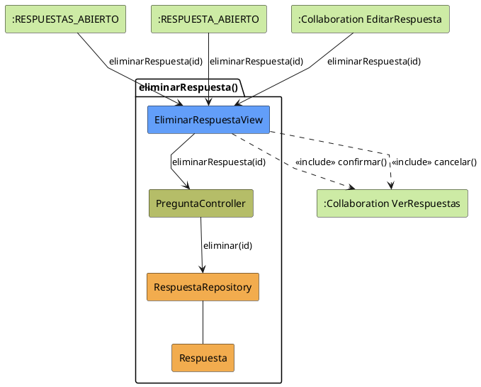
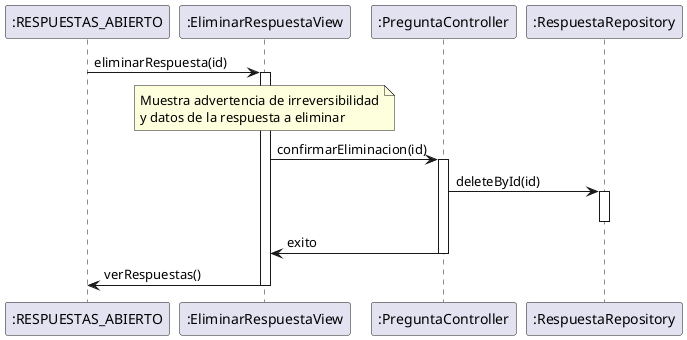
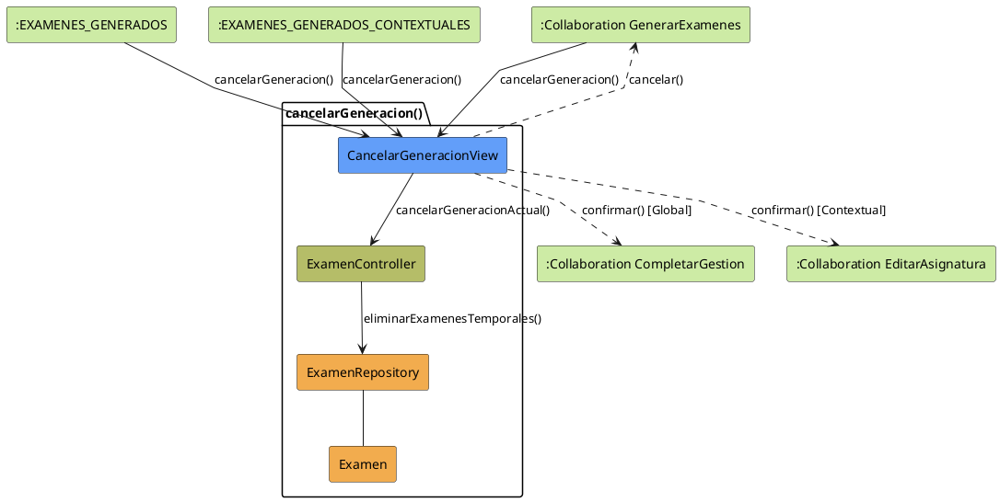
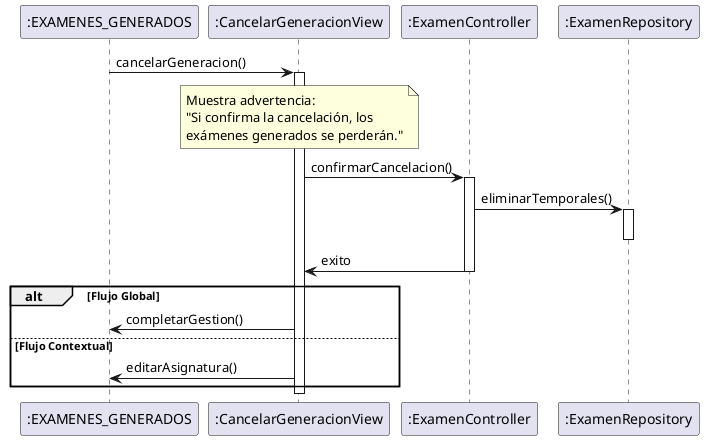
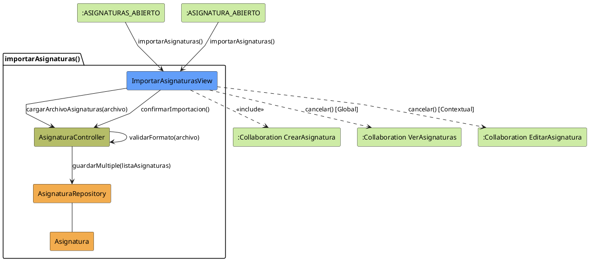
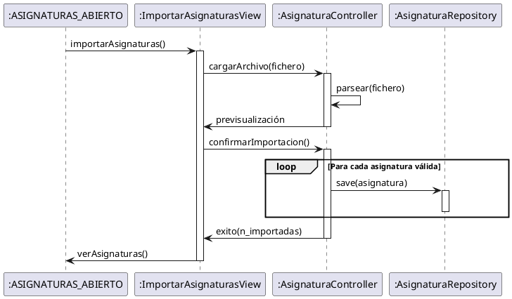
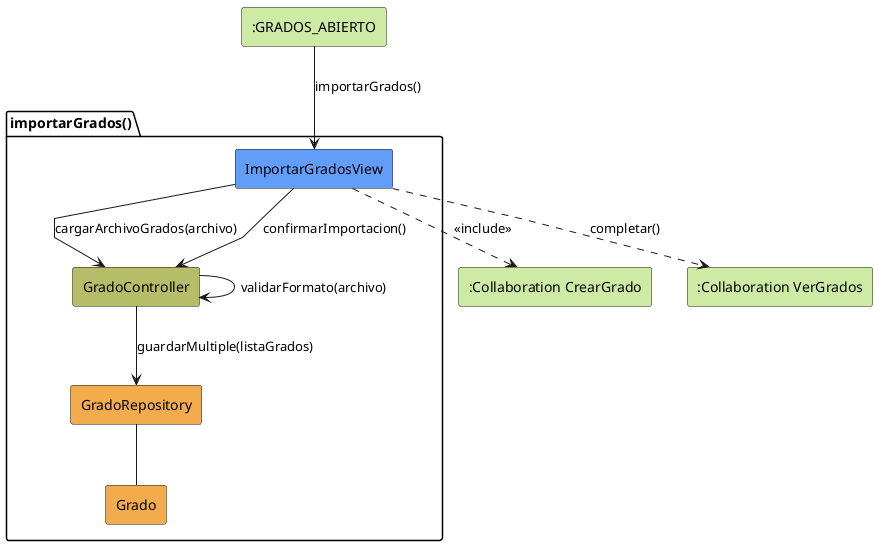
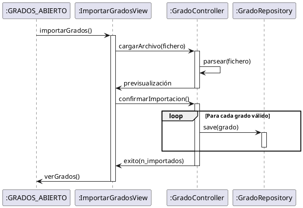

## USER 🧑‍💻

@Desktop/25-26-idsw2-sdVC/PROTOCOLOS_IA.md Inicio
--- Content from referenced files ---
Content from @Desktop/25-26-idsw2-sdVC/PROTOCOLOS_IA.md:
# PROTOCOLOS_IA.md - Guía para el agente IA
---
Este archivo sirve para automatizar al agente IA para que obtenga el contexto o actualice el conversation-log simplemente con escribir una palabra.
## INICIALIZACIÓN 
Para que la IA tenga contexto de cual es el punto actual del proyecto cuando se escriba "Inicio" el agente debe leer y analizar los siguientes archivos:

- `archivosEsenciales/modelos/diagramas/diagramaEntidad/diagramaEntidad.puml` --> diagrama de entidad.
- `archivosEsenciales/modelos/diagramas/diagramaEntidad/diagramaEntidadConsideraciones.md` --> Consideraciones del modelo de dominio.
- `archivosEsenciales/casos-de-uso/encontrarActoresYCasosDeUso/actoresYCasosDeUso-administradorInstitucional.puml` --> Actores y casos de uso para "administrador institucional".
- `archivosEsenciales/casos-de-uso/encontrarActoresYCasosDeUso/actoresYCasosDeUso-docente.puml` --> Actores y casos de uso para "docente".
- `archivosEsenciales/casos-de-uso/diagramasDeContexto/diagramaDeContextoAdministradorInstitucional/diagramaContexto.puml` --> diagrama de contexto para el "administrador institucional".
- `archivosEsenciales/casos-de-uso/diagramasDeContexto/diagramaDeContextoDocente/diagramaContexto.puml` --> diagrama de contexto para el "docente".
- `conversation-log.md` --> Resumen de las sesiones actualizadas con el agente de IA.

## FINALIZACIÓN
Cuando se escriba "fin" el agente debe añadir al archivo `conversation-log.md` la reciente sesión de la siguiente forma:

## [HH:MM] Título breve de lo que se pidió

**Prompt:** lo que le dijo al AI (textual o resumido fielmente)

**Resultado:** lo que produjo

**Decisión:** qué aceptó, qué rechazó, qué modificó, y por qué
--- End of content ---

---

## MODEL ✨

**Tool Command**:
```json
{
  "name": "update_topic",
  "args": {
    "strategic_intent": "Initializing project context by reading essential files as per PROTOCOLOS_IA.md.",
    "title": "Project Initialization",
    "summary": "The user initiated the \"Inicio\" protocol defined in PROTOCOLOS_IA.md. I will now read and analyze the entity diagrams, considerations, use cases, context diagrams, and the conversation log to understand the current state of the '25-26-idsw2-sdVC' project."
  }
}
```**Tool Command**:
```json
{
  "name": "list_directory",
  "args": {
    "dir_path": "Desktop/25-26-idsw2-sdVC/"
  }
}
```

---

## USER 🧑‍💻

**Tool Response**:
```json
{
  "id": "update_topic_1779994047049_0",
  "name": "update_topic",
  "response": {
    "output": "Current topic: \"Project Initialization\"\nTopic summary: The user initiated the \"Inicio\" protocol defined in PROTOCOLOS_IA.md. I will now read and analyze the entity diagrams, considerations, use cases, context diagrams, and the conversation log to understand the current state of the '25-26-idsw2-sdVC' project.\n\nStrategic Intent: Initializing project context by reading essential files as per PROTOCOLOS_IA.md."
  }
}
```**Tool Response**:
```json
{
  "id": "list_directory_1779994047050_1",
  "name": "list_directory",
  "response": {
    "output": "Directory listing for /Users/pareyor/Desktop/25-26-idsw2-sdVC:\n[DIR] .git\n[DIR] archivosEsenciales\n[DIR] conversations\n[DIR] documents\n[DIR] images\n[DIR] modelosUML\n[DIR] src\n2Think.md (1755 bytes)\nconversation-log.md (10589 bytes)\nPROTOCOLOS_IA.md (1700 bytes)\nQUE_HACE.md (263 bytes)\nREADME.md (1241 bytes)"
  }
}
```

---

## MODEL ✨

**Tool Command**:
```json
{
  "name": "read_file",
  "args": {
    "file_path": "Desktop/25-26-idsw2-sdVC/archivosEsenciales/modelos/diagramas/diagramaEntidad/diagramaEntidad.puml"
  }
}
```**Tool Command**:
```json
{
  "name": "read_file",
  "args": {
    "file_path": "Desktop/25-26-idsw2-sdVC/archivosEsenciales/modelos/diagramas/diagramaEntidad/diagramaEntidadConsideraciones.md"
  }
}
```**Tool Command**:
```json
{
  "name": "read_file",
  "args": {
    "file_path": "Desktop/25-26-idsw2-sdVC/archivosEsenciales/casos-de-uso/encontrarActoresYCasosDeUso/actoresYCasosDeUso-administradorInstitucional.puml"
  }
}
```**Tool Command**:
```json
{
  "name": "read_file",
  "args": {
    "file_path": "Desktop/25-26-idsw2-sdVC/archivosEsenciales/casos-de-uso/encontrarActoresYCasosDeUso/actoresYCasosDeUso-docente.puml"
  }
}
```**Tool Command**:
```json
{
  "name": "read_file",
  "args": {
    "file_path": "Desktop/25-26-idsw2-sdVC/archivosEsenciales/casos-de-uso/diagramasDeContexto/diagramaDeContextoAdministradorInstitucional/diagramaContexto.puml"
  }
}
```**Tool Command**:
```json
{
  "name": "read_file",
  "args": {
    "file_path": "Desktop/25-26-idsw2-sdVC/archivosEsenciales/casos-de-uso/diagramasDeContexto/diagramaDeContextoDocente/diagramaContexto.puml"
  }
}
```**Tool Command**:
```json
{
  "name": "read_file",
  "args": {
    "file_path": "Desktop/25-26-idsw2-sdVC/conversation-log.md"
  }
}
```

---

## USER 🧑‍💻

**Tool Response**:
```json
{
  "id": "read_file_1779994056436_0",
  "name": "read_file",
  "response": {
    "output": "@startuml\nclass Examen{\n - evaluación\n - clave corrección\n}\nclass Asignatura{\n - título\n - código\n - curso académico\n}\nclass Pregunta{\n - asignatura\n - enunciado\n - tema\n - dificultad\n}\nclass BateriaDePreguntas{\n}\nclass Grado{\n - título\n - código\n}\nclass Profesor{\n - nombre\n - apellidos\n - DNI\n}\nclass Alumno{\n - nombre\n - apellidos\n - DNI\n}\nenum EvaluaciónExamen{\n - Parcial 1\n - Parcial 2\n - Parcial 3\n - Examen final\n - Examen extraordinario\n}\nenum DificultadPregunta{\n - facil\n - medio\n - dificil\n}\n\nclass Respuesta{\n - opción\n - esCorrecta\n}\n\nenum Tema{\n}\n\nRespuesta -u-* Pregunta\nPregunta ..> DificultadPregunta\nPregunta -u-o Examen : contiene\nPregunta -u-* BateriaDePreguntas : contiene\nExamen ..> EvaluaciónExamen\nBateriaDePreguntas -u-* Asignatura : tiene\nExamen -u-* Asignatura : tiene\nProfesor o-r- Asignatura : tiene\nAsignatura --> Grado : pertenece\nAlumno -u-o Examen : realiza\nAlumno -u-* Asignatura : se imparte\nAlumno -u-* Grado : se cursa\nPregunta ..> Tema\n@enduml"
  }
}
```**Tool Response**:
```json
{
  "id": "read_file_1779994056982_1",
  "name": "read_file",
  "response": {
    "output": "[](/README.md) [](/documents/modelos/diagramas/README.md)   [](/documents/casos-de-uso/encontrarActoresYCasosDeUso/README.md)  [](/documents/casos-de-uso/diagramasDeContexto/README.md)  [](/documents/casos-de-uso/priorizarCasosDeUso/CasosDeUsoPriorizados.md)<br> [](/documents/casos-de-uso/detalladoCasosDeUso/README.md) [](/documents/casos-de-uso/prototipadoCasosDeUso/README.md) [](/documents/minutas/README.md) [](/documents/evidencias/README.md)  [](/documents/modelos/Glosario.md) [](/documents/AI-uso.md)\n\n| Relación | Tipo y Cardinalidad | Justificación |\n| :--- | :--- | :--- |\n| **Profesor – Asignatura** | Agregación (1 o-- many) | Un solo profesor puede ser responsable de impartir **varias** asignaturas, mientras que cada asignatura tiene asignado un único profesor. |\n| **Grado – Asignatura** | Composición (many <-- many) | Una asignatura puede estar formada por **muchos** grados y cada grado puede estar presente en varias asignaturas. |\n| **Asignatura – Alumno** | Asociación (many -- many) | En una asignatura se matriculan **muchos** alumnos y, a su vez, un mismo alumno se matricula en **muchas** asignaturas diferentes. |\n| **Asignatura – Exámen** | Composición (1 *-- many) | Una asignatura tiene planificados **varios** exámenes (parciales, finales, recuperaciones), pero cada exámen corresponde a una única asignatura. |\n| **Asignatura – BateríaDePreguntas** | Composición (1 *-- 1) | Cada asignatura tiene asociada **una** única batería de preguntas, y esa batería pertenece solo a esa asignatura. |\n| **Grado – Alumno** | Composición (1 *-- many) | Un Grado tiene inscritos a **muchos** alumnos, pero un alumno cursa (en este contexto) un único Grado principal. |\n| **Alumno – Exámen** | Agregación (1 o-- 1) | Un alumno realiza **una** única instancia/entrega de un exámen específico, y esa entrega pertenece a ese único alumno. |\n| **Exámen – Pregunta** | Agregación (many o-- many) | Un exámen consta de **muchas** preguntas, y una misma pregunta puede ser reutilizada y aparecer en **muchos** exámenes distintos. |\n| **BateríaDePreguntas – Pregunta** | Composición (1 *-- many) | La batería almacena **muchas** preguntas distintas, pero cada pregunta específica reside en una única batería. |\n| **Pregunta – Respuesta** | Composición (1 *-- many) | Una sola pregunta tiene asociadas **varias** opciones de respuesta posibles, que pertenecen únicamente a esa pregunta. |"
  }
}
```**Tool Response**:
```json
{
  "id": "read_file_1779994056983_2",
  "name": "read_file",
  "response": {
    "output": "@startuml actoresYCasosDeUso-administradorInstitucional\n\nleft to right direction\n\nactor \"Administrador Institucional\" as admin\n\npackage \"Módulo Docentes\" {\n  usecase \"crearDocente()\" as UC32\n  usecase \"verDocentes()\" as UC33\n  usecase \"editarDocente()\" as UC34\n  usecase \"eliminarDocente()\" as UC35\n}\n\n\npackage \"Módulo Sesión\" {\n  usecase \"iniciarSesion()\" as UC41\n  usecase \"cerrarSesion()\" as UC42\n}\npackage \"Módulo Gestión\" {\n  usecase \"completarGestion()\" as UC13\n\n}\n\nadmin --> UC13\nadmin --> UC32\nadmin --> UC33\nadmin --> UC34\nadmin --> UC35\nadmin --> UC41\nadmin --> UC42\n\n@enduml"
  }
}
```**Tool Response**:
```json
{
  "id": "read_file_1779994057256_3",
  "name": "read_file",
  "response": {
    "output": "@startuml actoresYCasosDeUso-docente\n\nleft to right direction\n\nactor \"Docente\" as doc\n\npackage \"Módulo Grado\" {\n  usecase \"crearGrado()\" as UC1\n  usecase \"verGrados()\" as UC2\n  usecase \"editarGrado()\" as UC3\n  usecase \"eliminarGrado()\" as UC4\n}\n\npackage \"Módulo Asignatura\" {\n  usecase \"crearAsignatura()\" as UC5\n  usecase \"verAsignaturas()\" as UC6\n  usecase \"editarAsignatura()\" as UC7\n  usecase \"eliminarAsignatura()\" as UC8\n}\n\npackage \"Módulo Alumno\" {\n  usecase \"crearAlumno()\" as UC9\n  usecase \"verAlumnos()\" as UC10\n  usecase \"editarAlumno()\" as UC11\n  usecase \"eliminarAlumno()\" as UC12\n}\n\npackage \"Módulo Preguntas-Respuestas\" {\n  usecase \"crearPregunta()\" as UC20\n  usecase \"verPreguntas()\" as UC21\n  usecase \"editarPregunta\" as UC22\n  usecase \"eliminarPregunta()\" as UC23\n \n  usecase \"crearRespuesta()\" as UC32\n  usecase \"verRespuestas()\" as UC33\n  usecase \"editarRespuesta()\" as UC34\n  usecase \"eliminarRespuesta()\" as UC35\n}\n\npackage \"Módulo Configuración General\" {\n  usecase \"exportarConfiguracionGlobal()\" as UC26\n  usecase \"importarConfiguracionGlobal()\" as UC27\n}\n\npackage \"Módulo Exámen\" {\n  usecase \"generarExamenes()\" as UC28\n  usecase \"asignarExamenes()\" as UC29\n  usecase \"cancelarGeneracion()\" as UC40\n  usecase \"corregirExamenes()\" as UC31\n}\n\npackage \"Módulo Sesión\" {\n  usecase \"iniciarSesion()\" as UC42\n  usecase \"cerrarSesion()\" as UC43\n}\n\npackage \"Módulo Gestión\" {\n  usecase \"completarGestion()\" as UC13\n\n}\npackage \"Módulo Importación\" as MI45{\n  usecase \"importarAsignaturas()\" as UC38\n  usecase \"importarPreguntas()\" as UC24\n  usecase \"importarAlumnos()\" as UC19\n  usecase \"importarGrados()\" as UC36\n}\npackage \"Módulo Exportación [Abstracto]\" as ME44{\nusecase \"exportarPreguntas()\" as UC25\nusecase \"exportarAlumnos()\" as UC17\nusecase \"exportarAsignaturas()\" as UC39\nusecase \"exportarGrados()\" as UC37\n}\n\n\ndoc --> UC1\ndoc --> UC2\ndoc --> UC3\ndoc --> UC4\n\ndoc --> UC5\ndoc --> UC6\ndoc --> UC7\ndoc --> UC8\n\ndoc --> UC9\ndoc --> UC10\ndoc --> UC11\ndoc --> UC12\n\ndoc -u-> UC13\ndoc -u-> UC19\ndoc -d-> UC20\ndoc -d-> UC21\ndoc -d-> UC22\ndoc -d-> UC23\ndoc -d-> UC24\n\ndoc -u-> UC26\ndoc -u-> UC27\ndoc -l-> UC28\ndoc -l-> UC29\ndoc -l-> UC31\ndoc -d-> UC32\ndoc -d-> UC33\ndoc -d-> UC34\ndoc -d-> UC35\ndoc -l-> UC36\ndoc -l-> UC38\ndoc -l-> UC40\ndoc -u-> UC42\ndoc -u-> UC43\nME44<.r.UC26 : <<include>>\nMI45<.r.UC27 : <<include>>\nUC38 .> UC5 : <<include>>\nUC36 .> UC1 : <<include>>\nUC24 .> UC20 : <<include>>\nUC19 .> UC9 : <<include>>\n\n@enduml"
  }
}
```**Tool Response**:
```json
{
  "id": "read_file_1779994057560_4",
  "name": "read_file",
  "response": {
    "output": "@startuml\n\nleft to right direction\n\n'Estados'\n\nstate \"SESION_CERRADA\" as NoAuth\nstate \"SISTEMA_DISPONIBLE\" as Menu\n\nstate \"DOCENTES_ABIERTO\" as ListDocentes\nstate \"DOCENTE_ABIERTO\" as EditDocentes\n\n'Modulo sesion'\n[*] --> NoAuth\nNoAuth --> Menu : iniciarSesion()\nMenu --> NoAuth : cerrarSesion()\n\n'Modulo profesores'\n\nMenu --> ListDocentes: verDocentes()\nListDocentes --> EditDocentes: crearDocente()\nListDocentes --> EditDocentes: editarDocente()\nListDocentes --> ListDocentes: eliminarDocente()\nEditDocentes --> EditDocentes: editarDocente()\nEditDocentes --> ListDocentes: verDocentes()\nEditDocentes --> ListDocentes: eliminarDocente()\nListDocentes --> Menu: completarGestion()\n\n@enduml\n\n\n\n\n\n"
  }
}
```**Tool Response**:
```json
{
  "id": "read_file_1779994057697_5",
  "name": "read_file",
  "response": {
    "output": "@startuml diagrama-contexto-docente\n\nleft to right direction\n\n'Estados'\n\nstate \"SESION_CERRADA\" as NoAuth\nstate \"SISTEMA_DISPONIBLE\" as Menu\n\nstate \"GRADOS_ABIERTO\" as ListGrados\nstate \"GRADO_ABIERTO\" as EditGrado\n\nstate \"ASIGNATURAS_ABIERTO\" as ListAsignaturas\nstate \"ASIGNATURA_ABIERTO\" as EditAsignatura\n\nstate \"ALUMNOS_ABIERTO\" as ListAlumnos\nstate \"ALUMNO_ABIERTO\" as EditAlumno\n\nstate \"PREGUNTAS_ABIERTO\" as ListPreguntas\nstate \"PREGUNTA_ABIERTO\" as EditPregunta\n\nstate \"EXAMENES_GENERADOS\" as ExamenesGenerados\nstate \"EXAMENES_ASIGNADOS\" as ExamenesAsignados\n\nstate \"EXAMENES_CORREGIDOS\" as ExamenesCorregidos\n\nstate \"RESPUESTAS_ABIERTO\" as ListRespuestas\nstate \"RESPUESTA_ABIERTO\" as EditRespuesta\n\nstate \"PREGUNTAS_CONTEXTUALES_ABIERTO\" as ListPreguntasContextuales\nstate \"PREGUNTA_CONTEXTUAL_ABIERTO\" as EditPreguntaContextual\n\nstate \"RESPUESTAS_CONTEXTUALES_ABIERTO\" as ListRespuestasContextuales\nstate \"RESPUESTA_CONTEXTUAL_ABIERTO\" as EditRespuestaContextual\n\nstate \"EXAMENES_GENERADOS_CONTEXTUALES\" as ExamenesGeneradosContextuales\nstate \"EXAMENES_ASIGNADOS_CONTEXTUALES\" as ExamenesAsignadosContextuales\n\n\n'Modulo sesion'\n[*] --> NoAuth\nNoAuth --> Menu : iniciarSesion()\nMenu --> NoAuth : cerrarSesion()\n\n'Modulo grados'\n\n\nMenu --> ListGrados: verGrados()\nListGrados --> ListGrados: eliminarGrado()\nListGrados --> ListGrados: importarGrados()\nListGrados --> EditGrado: crearGrado()\nListGrados --> EditGrado: editarGrado()\nEditGrado --> EditGrado: editarGrado()\nEditGrado --> ListGrados: verGrados()\nEditGrado --> ListGrados: eliminarGrado()\nListGrados --> Menu: completarGestion()\n\n'Modulo asignaturas'\n\nMenu --> ListAsignaturas: verAsignaturas()\nListAsignaturas --> EditAsignatura: crearAsignatura()\nListAsignaturas --> ListAsignaturas: eliminarAsignatura()\nListAsignaturas --> ListAsignaturas: importarAsignatura()\nEditAsignatura --> EditAsignatura: editarAsignatura()\nEditAsignatura --> ListAsignaturas: verAsignaturas()\nEditAsignatura --> ListAsignaturas: eliminarAsignatura()\nListAsignaturas --> EditAsignatura: editarAsignatura()\nListAsignaturas --> Menu: completarGestion()\n\n'Modulo alumnos'\n\nMenu --> ListAlumnos: verAlumnos()\nListAlumnos --> EditAlumno: crearAlumno()\nListAlumnos --> EditAlumno: editarAlumno()\nListAlumnos --> ListAlumnos: eliminarAlumno()\nListAlumnos --> ListAlumnos: importarAlumnos()\nEditAlumno --> EditAlumno: editarAlumno()\nEditAlumno --> ListAlumnos: verAlumnos()\nEditAlumno --> ListAlumnos: eliminarAlumno()\nListAlumnos --> Menu: completarGestion()\n\n'Modulo preguntas'\n\nMenu --> ListPreguntas: verPreguntas()\nListPreguntas --> EditPregunta: crearPregunta()\nListPreguntas --> EditPregunta: editarPregunta()\nListPreguntas --> ListPreguntas: eliminarPregunta()\nListPreguntas --> ListPreguntas: importarPreguntas()\nEditPregunta --> EditPregunta: editarPregunta()\nEditPregunta --> ListPreguntas: verPreguntas()\nEditPregunta --> ListPreguntas: eliminarPregunta()\nListPreguntas --> Menu: completarGestion()\n\n'Modulo preguntas contextuales '\n\nEditAsignatura --> ListPreguntasContextuales: verPreguntas()\nListPreguntasContextuales --> EditPreguntaContextual: crearPregunta()\nListPreguntasContextuales --> EditPreguntaContextual: editarPregunta()\nListPreguntasContextuales --> ListPreguntasContextuales: eliminarPregunta()\nListPreguntasContextuales --> ListPreguntasContextuales: importarPreguntas()\nEditPreguntaContextual --> EditPreguntaContextual: editarPregunta()\nEditPreguntaContextual --> ListPreguntasContextuales: verPreguntas()\nListPreguntasContextuales --> EditAsignatura: editarAsignatura()\nEditPreguntaContextual --> ListRespuestasContextuales: verRespuestas()\nEditPreguntaContextual --> ListPreguntasContextuales: eliminarPregunta()\nListRespuestasContextuales --> EditRespuestaContextual: editarRespuesta()\nListRespuestasContextuales --> EditRespuestaContextual: crearRespuesta()\nEditRespuestaContextual --> ListRespuestasContextuales: verRespuestas()\nEditRespuestaContextual --> ListRespuestasContextuales: eliminarRespuesta()\nListRespuestasContextuales --> ListRespuestasContextuales: eliminarRespuesta()\nEditRespuestaContextual --> EditRespuestaContextual: editarRespuesta()\nListRespuestasContextuales --> EditPreguntaContextual: editarPregunta()\n\n\n'Modulo Respuesta'\nEditPregunta --> ListRespuestas: verRespuestas()\nListRespuestas --> EditRespuesta: editarRespuesta()\nListRespuestas --> EditRespuesta: crearRespuesta()\nListRespuestas --> ListRespuestas: eliminarRespuesta()\nEditRespuesta --> EditRespuesta: editarRespuesta()\nEditRespuesta --> ListRespuestas: verRespuestas()\nEditRespuesta --> ListRespuestas: eliminarRespuesta()\nListRespuestas --> EditPregunta: editarPregunta()\n\n'Modulo configuracion general'\n\nMenu --> Menu: importarConfiguracionGlobal()\nMenu --> Menu: exportarConfiguracionGlobal()\n\n'Modulo examenes'\n\nMenu --> ExamenesGenerados: generarExamenes()\nExamenesGenerados --> ExamenesAsignados: asignarExamenes()\nExamenesAsignados --> Menu: completarGestion()\nExamenesGenerados --> Menu: cancelarGeneracion()\n\n'Modulo examenes contextuales'\nEditAsignatura --> ExamenesGeneradosContextuales: generarExamenes()\nExamenesGeneradosContextuales --> ExamenesAsignadosContextuales: asignarExamenes()\nExamenesGeneradosContextuales --> EditAsignatura: cancelarGeneracion()\nExamenesAsignadosContextuales --> EditAsignatura: editarAsignatura() \n\n\n'Módulo correccion'\n\nMenu --> ExamenesCorregidos: corregirExamenes()\nExamenesCorregidos --> Menu: completarGestion()\n\n@enduml\n\n\n\n\n\n\n\n\n\n\n\n\n\n\n\n\n\n\n\n"
  }
}
```**Tool Response**:
```json
{
  "id": "read_file_1779994057703_6",
  "name": "read_file",
  "response": {
    "output": "# Registro de Conversación - Jorgestor (IDSW2)\n\n## Sesión 1: [20 de mayo de 2026][17:38]\n\n### Resumen de actividad:\n- **Arranque del proyecto**: Análisis de requerimientos legados de Jorgestor (Ingeniería de Software 1).\n- **Definición técnica**: Creación de [`QUE_HACE.md`](QUE_HACE.md).\n- **Estructura de archivos**: Inicialización de la carpeta de trabajo [`25-26-idsw2-sdVC`](https://github.com/Pareyor/25-26-idsw2-sdVC).\n- **Documentación**: Ajuste de [`README.md`](README.md) para reflejar el enfoque en análisis, diseño e implementación de Jorgestor.\n\n## Sesión 2: [21/05/2026][19:22] Análisis de los 5 primeros casos de uso (MVC)\n\n**Prompt:** Análisis de los 5 primeros casos de uso de IdSw1-SdR basándose en el modelo de pySigHor, guardando modelos UML en `modelosUML/analisis/` y documentación en `documents/analisis/`, desglosando las acciones de Cargar, Corregir y Cancelar para el caso de `corregirExamenes()`.\n\n**Resultado:** \n- Generación de análisis MVC (Vista, Control, Entidad) y diagramas de colaboración PlantUML para los casos de uso: `corregirExamenes()`, `generarExamenes()`, `importarConfiguracionGlobal()`, `exportarConfiguracionGlobal()` e `importarAlumnos()`.\n- Estructuración de la documentación técnica en `documents/analisis/` y los modelos en `modelosUML/analisis/`.\n- Refinamiento del análisis de `corregirExamenes()` para incluir explícitamente las responsabilidades de carga, corrección y cancelación.\n\n**Enlace:** [Conversación Sesión 2](conversations/sesion-21-05-26.md)\n\n**Decisión:** Se han aceptado los análisis de exportarConfiguracionGlobal, importarConfiguracionGlobal, importarAlumnos y generarExamenes. Se ha modificado el análisis de corregirExamenes que no tenía en cuenta la función de cargar exámenes, además me lo relacionaba con el apartado de reconocimiento de IA que, como hablamos en clase, debemos dejarlo como un factor externo al sistema.\n\n## Sesión 3: [22/05/2026][11:45] Análisis de los casos de uso 6-10 y refinamiento por prototipos\n\n**Prompt:** Análisis de los siguientes 5 casos de uso del priorizado (importarPreguntas, exportarAlumnos, exportarPreguntas, asignarExamenes, crearPregunta) tomando como ejemplo pySigHor y validando contra sus prototipos.\n\n**Resultado:**\n- Generación de diagramas de colaboración MVC y documentación README para los 5 casos de uso mencionados.\n- Refinamiento de `asignarExamenes()` para integrar la búsqueda de alumnos y generación de claves alfanuméricas detectadas en el prototipo.\n- Corrección del diagrama de `crearPregunta()` para vincular correctamente la colaboración `CompletarGestion`.\n\n**Enlace:** [Conversación Sesión 3](conversations/sesion-22-05-26.md)\n\n**Decisión:** Se aceptaron los análisis de `importarPreguntas`, `exportarAlumnos` (abstracto) y `exportarPreguntas` (abstracto). Se modificó significativamente `asignarExamenes()` para alinearlo con las funcionalidades visuales del prototipo (búsqueda y claves). Se corrigió una inconsistencia visual en `crearPregunta()` donde `CompletarGestion` estaba definido pero no relacionado con la acción de cancelar.\n\n## Sesión 4: [23/05/2026][10:15] Análisis de Casos de Uso 11-15 y Estandarización de Estilo (MVC + Secuencia)\n\n**Prompt:** Análisis de los casos de uso 11-15 (editarPregunta, editarAsignatura, crearDocente, crearAlumno, editarDocente) siguiendo pySigHor y aplicación del estilo de diagramas de secuencia personalizado (ejemplo verPreguntas) a todo el bloque 1-15.\n\n**Resultado:**\n- Generación de análisis MVC completo para los casos 11-15, aplicando los patrones \"El Gordo\" (edición integral) y \"El Delgado\" (creación rápida C->U).\n- Creación de diagramas de secuencia \"punto medio\" (exquisitos pero sintetizados) para los casos 1-15, integrando activaciones, instanciación de objetos y notas de interfaz.\n- Estandarización de los 15 README.md de análisis bajo el nombre de proyecto \"Jorgestor - Sistema de Gestión de Exámenes\".\n\n**Enlace:** [Conversación Sesión 4](conversations/sesion-23-05-26.md)\n\n**Decisión:** Se ha modificado el análisis de casos de uso ya implementados (1-10) para corregir la forma en que hacía los diagramas de secuencia, se estableció un mismo formato para realizarlos, basandose en pySighor y amoldándose al proyecto JORGESTOR. Se modificó el caso de uso editarAsignatura() porque la IA no detectaba la colaboración con verPreguntas() y pasaba lo mismo en editarPregunta() que no detectaba la colaboración con verRespuestas(). Por se unificó el nombre del proyecto ya que el agente IA ponía siempre de base IdSw1.\n\n## Sesión 5: [24/05/2026][12:45] Análisis de Casos de Uso 16-20 y Alineación con Prototipos y Estilo Visual\n\n**Prompt:** Análisis de los casos de uso 16-20 (editarAlumno, crearGrado, crearAsignatura, editarGrado, verPreguntas) siguiendo el patrón MVC, validando contra sus prototipos y estandarizando el estilo visual (colores y estructura) basándose en el ejemplo `editarAsignatura`.\n\n**Resultado:**\n- Generación de análisis MVC completo y diagramas (Colaboración y Secuencia) para los casos 16-20.\n- Aplicación del estilo visual estandarizado: colores específicos para capas MVC (`#CDEBA5`, `#629EF9`, `#b5bd68`, `#F2AC4E`) y uso de `rectangle` en colaboraciones.\n- Inclusión de notas de interfaz detalladas en los diagramas de secuencia basadas en los wireframes de prototipado.\n- Refinamiento de la lógica de creación (`crearGrado`, `crearAsignatura`) para incluir asociaciones iniciales y redirección automática.\n- Actualización de los `README.md` de análisis documentando los patrones \"El Gordo\" y \"El Delgado\".\n\n**Enlace:** [Conversación Sesión 5](conversations/sesion-24-05-26.md)\n\n**Decisión:** Esta vez no se acepto ningún análisis de los casos de uso generados por la IA, fue necesario cambiar todos los diagramas de colaboración ya que no se incluían las relaciones explícitas con los repositorios y no seguían el diseño general aplicado para los casos de uso analizados previamente en otras sesiones, se tuvo que realizar un segundo ciclo para formatear todos los análisis proporcionados inicialmente por la IA. \n\n## Sesión 6: [25/05/2026][13:45] Análisis de Casos de Uso 21-25 y Refinamiento de Estándares\n\n**Prompt:** Análisis de los casos de uso 21-25 (verAsignaturas, verGrados, verAlumnos, verDocentes, eliminarPregunta) siguiendo el esquema MVC de Jorgestor, aplicando diagramas de secuencia solo si es necesario y alineando con los diagramas de contexto.\n\n**Resultado:**\n- Generación de análisis MVC y diagramas de colaboración para los CU 21-25.\n- Creación de documentación README.md para cada caso.\n- Diagrama de secuencia para `eliminarPregunta()` (por su lógica de confirmación).\n- Ajuste de estados externos a `:SISTEMA_DISPONIBLE` y adición de accesos desde estados \"..._ABIERTO\" para mayor coherencia con el contexto.\n\n**Enlace:**[Conversación Sesión 6](conversations/sesion-25-05-26.md)\n**Decisión:** Se aceptaron en un inicio los análisis de los casos de uso del 21-25, sin embargo se tuvieron que realizar cambios para que se ajuste a nuestro proyecto, la IA ponia que se accedía a verDocentes, verAsignatura, verAlumnos y verGrados desde algo que llamó MAIN_VIEW sin embargo basándonos en nuestro diagrama de contexto esto se llama SISTEMA_DISPONIBLE, además a estos casos de uso también se puede acceder desde DOCENTE_ABIERTO, ASIGNATURA_ABIERTO, ALUMNO_ABIERTO y GRADO_ABIERTO respectivamente. \n\n## Sesión 7: [26/05/2026][12:30] Análisis de Casos de Uso 26-30 y Refinamiento de Flujos\n\n**Prompt:** Análisis de los casos de uso 26-30 (eliminarAsignatura, eliminarGrado, eliminarAlumno, eliminarDocente, iniciarSesion) siguiendo el patrón MVC, validando contra prototipos y el diagrama de contexto, con diagramas de colaboración (todos) y secuencia (solo necesarios).\n\n**Resultado:**\n- Generación de análisis MVC completo para los CU 26-30.\n- Estandarización de los README.md de análisis basándose en el ejemplo `editarAsignatura`.\n- Ajuste de los diagramas de colaboración para reflejar las entradas desde estados del sistema (`:ASIGNATURAS_ABIERTO`, etc.) en lugar de vistas genéricas.\n- Refinamiento de `iniciarSesion()` para incluir la creación de la entidad `Sesion` y la transición `sistemaDisponible(usuario)`.\n\n**Enlace:**[Conversación Sesión 6](conversations/sesion-26-05-26.md)\n\n**Decisión:** Se modificó el nombre de las vistas de eliminación de \"Dialog\" a \"View\" para mantener la consistencia del esquema definido. Se eliminaron los diagramas de secuencia en las eliminaciones por ser procesos directos de confirmación. Se corrigió el flujo de `iniciarSesion` para cumplir con el diagrama de estados específico y la lógica de negocio de creación de sesión.\n\n## Sesión 8: [27/05/2026][20:00] Análisis de Casos de Uso 31-34 y Refinamiento de Navegación y Sesión\n\n**Prompt:** Análisis de los casos de uso 31-34 (cerrarSesion, completarGestion, verRespuestas, crearRespuesta) siguiendo el patrón MVC, diagramas de contexto y prototipos, aplicando commits individuales por caso de uso.\n\n**Resultado:**\n- Generación de análisis MVC completo para los CU 31-34.\n- **cerrarSesion()**: Refinamiento de la lógica de cancelación (retorno a `SISTEMA_DISPONIBLE`) y actualización de métodos (`eliminarSesion(usuario)`).\n- **completarGestion()**: Implementación como Menú Principal Dinámico, desacoplando la Vista de la Sesión y centralizando la lógica en el controlador con `PermisosRepository` y `OpcionesMenu`.\n- **verRespuestas()**: Inclusión de accesos contextuales y generales desde estados de Pregunta y Respuesta.\n- **crearRespuesta()**: Aplicación del patrón \"El Delgado\" con soporte para flujos generales y contextuales.\n\n**Enlace:**[Conversación Sesión 8](conversations/sesion-27-05-26.md)\n\n**Decisión:** Se ajustó el análisis de `cerrarSesion` para incluir explícitamente el flujo de cancelación y renombrar el controlador. En `completarGestion`, se rechazó la dependencia directa de la vista con la sesión, moviendo la lógica al controlador y usando un repositorio de permisos, también se cambió la lógica de relaciones propuestas por la IA para que a parte de poder acceder desde casos de uso como verGrado,verDocente,ver/* a completarGestion esta tambien pueda accede a ellos(menu). En `verRespuestas` y `crearRespuesta`, se corrigieron los diagramas de colaboración para alinearlos con todos los puntos de entrada definidos en el diagrama de contexto (contextuales vs generales). Se eliminó el diagrama de secuencia de `crearRespuesta`.\n"
  }
}
```

---

## MODEL ✨

He analizado los archivos esenciales y el `conversation-log.md` según el protocolo de **Inicio**. Aquí tienes un resumen del estado actual del proyecto **Jorgestor - Sistema de Gestión de Exámenes**:

### Contexto General
*   **Modelo de Dominio:** Sistema centrado en `Asignatura`, que vincula `Profesores`, `Alumnos`, `Grados` y una `BateriaDePreguntas`. Los `Exámenes` se generan a partir de estas preguntas y son realizados por los alumnos.
*   **Arquitectura:** Se sigue un patrón **MVC** (Vista, Control, Entidad) con especial atención a los patrones "El Gordo" (edición integral) y "El Delgado" (creación/operaciones rápidas).
*   **Estado del Análisis:** Se han completado y refinado los análisis de **34 casos de uso**. Los últimos analizados en la Sesión 8 fueron:
    *   `cerrarSesion()`
    *   `completarGestion()` (implementado como menú principal dinámico con `PermisosRepository`).
    *   `verRespuestas()` y `crearRespuesta()` (con flujos contextuales y generales).

### Observaciones de Diseño
*   **Navegación:** El estado central es `SISTEMA_DISPONIBLE`. Los módulos (`DOCENTES`, `GRADOS`, `ASIGNATURAS`, etc.) tienen sus propios estados `..._ABIERTO`.
*   **Estilo Visual:** Se mantiene un estándar de colores y formas en PlantUML para diferenciar las capas MVC y facilitar la lectura de los diagramas de secuencia y colaboración.

Quedo a la espera de tus instrucciones para continuar con el análisis de los siguientes casos de uso (como `editarRespuesta`, `eliminarRespuesta` o los módulos de importación/exportación restantes) o cualquier otra tarea que requieras.

---

## USER 🧑‍💻

En base a lo que acabas de leer y basandonos tambien en el prototipado de @Desktop/25-26-IdSw1-SdR/documents/casos-de-uso/prototipadoCasosDeUso/README.md y en base a tanto la documentación como el codigo PUML de verRespuestas, vamos a hacer el análisis de los casos de uso que nos quedan, vete dandomelos uno a uno para yo ir haciendo commits, acuerdate que necesito el diagrama de colaboracion de todos y de secuencia solo de aquellos que sea necesario
--- Content from referenced files ---
Content from @Desktop/25-26-IdSw1-SdR/documents/casos-de-uso/prototipadoCasosDeUso/README.md:
[](/README.md) [](/documents/modelos/diagramas/README.md)   [](/documents/casos-de-uso/encontrarActoresYCasosDeUso/README.md)  [](/documents/casos-de-uso/diagramasDeContexto/README.md)  [](/documents/casos-de-uso/priorizarCasosDeUso/CasosDeUsoPriorizados.md)<br> [](/documents/casos-de-uso/detalladoCasosDeUso/README.md) [](/documents/casos-de-uso/prototipadoCasosDeUso/README.md) [](/documents/minutas/README.md) [](/documents/evidencias/README.md)  [](/documents/modelos/Glosario.md) [](/documents/AI-uso.md)

## Prototipado de casos de uso

### Corregir Exámenes [Docente]

|  |
| :--- |
| [Código UML](corregirExamenes/corregirExamenesConfirmacion.puml) |

|  |
| :--- |
| [Código UML](corregirExamenes/corregirExamenesError.puml) |

### Generar Exámenes [Docente]

|  |
| :--- |
| [Código UML](generarExamenes/generarExamenesConfirmacion.puml) |

|  |
| :--- |
| [Código UML](generarExamenes/generarExamenesConfirmacionError.puml) |

### Importar Configuración Global [Docente]

|  |
| :--- |
| [Código UML](importarConfiguracionGlobal/importarConfiguracionGlobalConfirmacion.puml) |

|  |
| :--- |
| [Código UML](importarConfiguracionGlobal/importarConfiguracionGlobalError.puml) |

### Exportar Configuración Global [Docente]

|  |
| :--- |
| [Código UML](exportarConfiguracionGlobal/exportarConfiguracionGlobalConfirmacion.puml) |

|  |
| :--- |
| [Código UML](exportarConfiguracionGlobal/exportarConfiguracionGlobalError.puml) |

### Importar Alumnos [Docente]

|  |
| :--- |
| [Código UML](importarAlumnos/importarAlumnosConfirmacion.puml) |

|  |
| :--- |
| [Código UML](importarAlumnos/importarAlumnosError.puml) |

### Importar Preguntas [Docente]

|  |
| :--- |
| [Código UML](importarPreguntas/importarPreguntasConfirmacion.puml) |

|  |
| :--- |
| [Código UML](importarPreguntas/importarPreguntasError.puml) |

### Asignar Exámenes [Docente]

|  |
| :--- |
| [Código UML](asignarExamenes/asignarExamenes.puml) |

### Crear Pregunta [Docente]

|  |
| :--- |
| [Código UML](crearPregunta/crearPregunta.puml) |

### Editar Pregunta [Docente]

|  |
| :--- |
| [Código UML](editarPregunta/editarPregunta.puml) |

### Editar Asignatura [Docente]

|  |
| :--- |
| [Código UML](editarAsignatura/editarAsignatura.puml) |

### Crear Docente [Aministrador Institucional]

|  |
| :--- |
| [Código UML](crearDocente/crearDocente.puml) |

### Crear Alumno [Docente]

|  |
| :--- |
| [Código UML](crearAlumno/crearAlumno.puml) |

### Editar Docente [Aministrador Institucional]

|  |
| :--- |
| [Código UML](editarDocente/editarDocente.puml) |

### Editar Alumno [Docente]

|  |
| :--- |
| [Código UML](editarAlumno/editarAlumno.puml) |

### Crear Grado [Docente]

|  |
| :--- |
| [Código UML](crearGrado/crearGrado.puml) |

### Crear Asignatura [Docente]

|  |
| :--- |
| [Código UML](crearAsignatura/crearAsignatura.puml) |

### Editar Grado [Docente]

|  |
| :--- |
| [Código UML](editarGrado/editarGrado.puml) |

### Ver Preguntas [Docente]

|  |
| :--- |
| [Código UML](verPreguntas/verPreguntas.puml) |

### Ver Asignaturas [Docente]

|  |
| :--- |
| [Código UML](verAsignaturas/verAsignaturas.puml) |

### Ver Grados [Docente]

|  |
| :--- |
| [Código UML](verGrados/verGrados.puml) |

### Ver Alumnos [Docente]

|  |
| :--- |
| [Código UML](verAlumnos/verAlumnos.puml) |

### Ver Docentes [Aministrador Institucional]

|  |
| :--- |
| [Código UML](verDocentes/verDocentes.puml) |

### Eliminar Pregunta [Docente]

|  |
| :--- |
| [Código UML](eliminarPregunta/eliminarPregunta.puml) |

### Eliminar Asignatura [Docente]

|  |
| :--- |
| [Código UML](eliminarAsignatura/eliminarAsignatura.puml) |

### Eliminar Grado [Docente]

|  |
| :--- |
| [Código UML](eliminarGrado/eliminarGrado.puml) |

### Eliminar Alumno [Docente]

|  |
| :--- |
| [Código UML](eliminarAlumno/eliminarAlumno.puml) |

### Eliminar Docente [Aministrador Institucional]

|  |
| :--- |
| [Código UML](eliminarDocente/eliminarDocente.puml) |

### Iniciar Sesión [Docente y Aministrador Institucional]

|  |
| :--- |
| [Código UML](iniciarSesion/iniciarSesion.puml) |

|  |
| :--- |
| [Código UML](iniciarSesion/iniciarSesionError.puml) |

### Cerrar Sesión [Docente y Aministrador Institucional]

|  |
| :--- |
| [Código UML](cerrarSesion/cerrarSesionDocente.puml) |

|  |
| :--- |
| [Código UML](cerrarSesion/cerrarSesionAdministracionInstitucional.puml) |

### Completar Gestión [Docente y Aministrador Institucional]

|  |
| :--- |
| [Código UML](completarGestion/completarGestionDocente.puml) |

|  |
| :--- |
| [Código UML](completarGestion/completarGestionAdministradorInstitucional.puml) |

### Ver Respuestas [Docente]

|  |
| :--- |
| [Código UML](verRespuestas/verRespuestas.puml) |

### Crear Respuesta [Docente]

|  |
| :--- |
| [Código UML](crearRespuesta/crearRespuesta.puml) |

### Editar Respuesta [Docente]

|  |
| :--- |
| [Código UML](editarRespuesta/editarRespuesta.puml) |

### Eliminar Respuesta [Docente]

|  |
| :--- |
| [Código UML](eliminarRespuesta/eliminarRespuesta.puml) |

### Cancelar Generación [Docente]

|  |
| :--- |
| [Código UML](cancelarGeneracion/cancelarGeneracion.puml) |

### Importar Asignaturas [Docente]

|  |
| :--- |
| [Código UML](importarAsignaturas/importarAsignaturas.puml) |

### Importar Grados [Docente]

|  |
| :--- |
| [Código UML](importarGrados/importarGrados.puml) |
--- End of content ---

---

## MODEL ✨

**Tool Command**:
```json
{
  "name": "update_topic",
  "args": {
    "strategic_intent": "Analyzing CU 35: editarRespuesta() following Jorgestor standards.",
    "summary": "I am starting the analysis of the remaining use cases, beginning with 'editarRespuesta()'. This involves creating a collaboration diagram and a documentation file, adhering to the MVC pattern and visual standards established in previous sessions. I will also check the prototypes to ensure alignment with the UI.",
    "title": "Analysis of CU 35: editarRespuesta()"
  }
}
```**Tool Command**:
```json
{
  "name": "read_file",
  "args": {
    "file_path": "Desktop/25-26-IdSw1-SdR/documents/casos-de-uso/prototipadoCasosDeUso/editarRespuesta/editarRespuesta.puml"
  }
}
```**Tool Command**:
```json
{
  "name": "read_file",
  "args": {
    "file_path": "Desktop/25-26-idsw2-sdVC/documents/analisis/verRespuestas/README.md"
  }
}
```

---

## USER 🧑‍💻

**Tool Response**:
```json
{
  "id": "update_topic_1779994337356_0",
  "name": "update_topic",
  "response": {
    "output": "Current topic: \"Analysis of CU 35: editarRespuesta()\"\nTopic summary: I am starting the analysis of the remaining use cases, beginning with 'editarRespuesta()'. This involves creating a collaboration diagram and a documentation file, adhering to the MVC pattern and visual standards established in previous sessions. I will also check the prototypes to ensure alignment with the UI.\n\nStrategic Intent: Analyzing CU 35: editarRespuesta() following Jorgestor standards."
  }
}
```**Tool Response**:
```json
{
  "id": "read_file_1779994337450_1",
  "name": "read_file",
  "response": {
    "output": "@startsalt editarRespuesta_FORMULARIO\n{\n    <b>EDITAR RESPUESTA</b>\n    ===\n    {\n        <b>Datos de la Respuesta:</b>\n        --\n        {\n           \n            {\n            <b>Contenido:</b> |\n                {\"Reutilizar código de clases existentes\"}\n            }\n           \n            {<b>¿Es Correcta?:</b> | (X) Sí ( ) No\n            }\n              \n        }\n\n        ~~\n\n        {[Guardar cambios]|[Eliminar]|[Cancelar Edición]}\n    }\n}\n@endsalt"
  }
}
```**Tool Response**:
```json
{
  "id": "read_file_1779994337450_2",
  "name": "read_file",
  "response": {
    "output": "# Jorgestor > verRespuestas > Análisis\n\n> |[🏠️](/README.md)|[ 📊](../../../archivosEsenciales/casos-de-uso/diagramasDeContexto/diagramaDeContextoDocente/diagramaContexto.svg)|[Detalle](../../../archivosEsenciales/casos-de-uso/detalladoCasosDeUso/README.md#ver-respuestas-docente)|**Análisis**|Diseño|Desarrollo|Pruebas|\n> |-|-|-|-|-|-|-|\n\n## información del artefacto\n\n- **Proyecto**: Jorgestor - Sistema de Gestión de Exámenes\n- **Fase RUP**: Elaboración\n- **Disciplina**: Análisis y Diseño\n- **Versión**: 1.1\n- **Fecha**: 2026-05-27\n- **Autor**: Gemini CLI\n\n## propósito\n\nAnálisis de colaboración del caso de uso `verRespuestas()` mediante el patrón MVC. Este caso de uso actúa como el listado central de opciones para una pregunta, permitiendo el acceso a su gestión integral y sirviendo como punto de retorno tras editar o crear una respuesta individual.\n\n## diagramas de análisis\n\n### diagrama de colaboración\n<div align=center>\n\n||\n|-|\n|Código fuente: [colaboracion.puml](colaboracion.puml)|\n\n</div>\n\n### diagrama de secuencia\n<div align=center>\n\n||\n|-|\n|Código fuente: [secuencia.puml](secuencia.puml)|\n\n</div>\n\n## clases de análisis identificadas\n\n### clases de vista (boundary)\n\n#### VerRespuestasView\n**Estereotipo**: Vista (Boundary)  \n**Responsabilidades**:\n- Presentar el listado de respuestas asociadas a una pregunta.\n- Mostrar el contenido y si la respuesta es correcta.\n- Facilitar la navegación a la creación, edición y eliminación de respuestas.\n- Permitir el retorno a la edición de la pregunta (contextual o general).\n\n**Colaboraciones**:\n- **Entrada**: `verRespuestas(preguntaId)` desde `:PREGUNTA_ABIERTO`, `:PREGUNTA_CONTEXTUAL_ABIERTO`, `:RESPUESTA_ABIERTO` o `:RESPUESTA_CONTEXTUAL_ABIERTO`.\n- **Control**: `PreguntaController`.\n- **Salida**: Redirige a las colaboraciones de CRUD de respuestas o vuelve a la edición de la pregunta.\n\n### clases de control\n\n#### PreguntaController\n**Estereotipo**: Control  \n**Responsabilidades**:\n- Coordinar la obtención de las respuestas filtradas por pregunta.\n\n**Colaboraciones**:\n- **Repositorio**: `RespuestaRepository`.\n\n### clases de entidad (entity)\n\n#### RespuestaRepository\n**Estereotipo**: Entidad (Repositorio)  \n**Responsabilidades**: Abstraer el acceso a la persistencia de las respuestas.\n\n#### Respuesta\n**Estereotipo**: Entidad  \n**Responsabilidades**: Representar una opción de respuesta con su contenido y estado de veracidad.\n\n## flujo de colaboración principal\n\n### secuencia: listar respuestas\n\n1. **Entrada**: El docente solicita ver las respuestas, ya sea desde la edición de la pregunta o tras finalizar la edición de una respuesta.\n2. **Carga**: La vista solicita al controlador las respuestas correspondientes al ID de la pregunta.\n3. **Búsqueda**: El controlador delega en el repositorio la búsqueda de las entidades `Respuesta`.\n4. **Presentación**: La vista renderiza la tabla con los datos obtenidos.\n"
  }
}
```

---

## MODEL ✨

**Tool Command**:
```json
{
  "name": "read_file",
  "args": {
    "file_path": "Desktop/25-26-idsw2-sdVC/modelosUML/analisis/editarPregunta/secuencia.puml"
  }
}
```

---

## USER 🧑‍💻

**Tool Response**:
```json
{
  "id": "read_file_1779994341556_0",
  "name": "read_file",
  "response": {
    "output": "@startuml editarPregunta-secuencia\nskinparam linetype polyline\n\nparticipant \":PREGUNTAS_ABIERTO\" as Sistema\nparticipant \":EditarPreguntaView\" as View\nparticipant \":PreguntaController\" as Controller\nparticipant \":PreguntaRepository\" as Repository\nparticipant \":Pregunta\" as Entity\n\nSistema -> View: editarPregunta(id)\nactivate View\n\nView -> Controller: obtenerPregunta(id)\nactivate Controller\n\nController -> Repository: findById(id)\nactivate Repository\n\nRepository -> Entity: crear instancia\ndeactivate Repository\n\nController <- Repository: Pregunta\ndeactivate Controller\n\nView <- Controller: Pregunta\ndeactivate View\n\nnote over View\nPresenta datos de la pregunta:\n• Enunciado, Asignatura, Tema, Dificultad\n• Estado (Habilitada/Deshabilitada)\n• Permite: modificar, guardar, eliminar, cancelar, ver respuestas\nend note\n\nView -> Controller: actualizarPregunta(datos)\nactivate Controller\n\nController -> Entity: aplicarCambios(datos)\nactivate Entity\ndeactivate Entity\n\nController -> Repository: save(pregunta)\nactivate Repository\ndeactivate Repository\n\nView <- Controller: exito\ndeactivate Controller\n\nnote over View\nPresenta mensaje de éxito\nMantiene sesión de edición activa\nend note\n\n@enduml"
  }
}
```

---

## MODEL ✨

**Tool Command**:
```json
{
  "name": "read_file",
  "args": {
    "file_path": "Desktop/25-26-idsw2-sdVC/modelosUML/analisis/verRespuestas/colaboracion.puml"
  }
}
```

---

## USER 🧑‍💻

**Tool Response**:
```json
{
  "id": "read_file_1779994350694_0",
  "name": "read_file",
  "response": {
    "output": "@startuml verRespuestas-analisis\nskinparam linetype polyline\n\nrectangle #CDEBA5 \":PREGUNTA_ABIERTO\" as PreguntaAbierto\nrectangle #CDEBA5 \":PREGUNTA_CONTEXTUAL_ABIERTO\" as PreguntaContextualAbierto\nrectangle #CDEBA5 \":RESPUESTA_ABIERTO\" as RespuestaAbierto\nrectangle #CDEBA5 \":RESPUESTA_CONTEXTUAL_ABIERTO\" as RespuestaContextualAbierto\n\nrectangle #CDEBA5 \":Collaboration CrearRespuesta\" as CrearRespuesta\nrectangle #CDEBA5 \":Collaboration EditarRespuesta\" as EditarRespuesta\nrectangle #CDEBA5 \":Collaboration EliminarRespuesta\" as EliminarRespuesta\nrectangle #CDEBA5 \":Collaboration EditarPregunta\" as EditarPregunta\n\npackage verRespuestas as \"verRespuestas()\" {\n    rectangle #629EF9 VerRespuestasView\n    rectangle #b5bd68 PreguntaController\n    rectangle #F2AC4E RespuestaRepository\n    rectangle #F2AC4E Respuesta\n}\n\nPreguntaAbierto --> VerRespuestasView: verRespuestas(preguntaId)\nPreguntaContextualAbierto --> VerRespuestasView: verRespuestas(preguntaId)\n\nRespuestaAbierto --> VerRespuestasView: verRespuestas(preguntaId)\nRespuestaContextualAbierto --> VerRespuestasView: verRespuestas(preguntaId)\n\nVerRespuestasView -d-> PreguntaController: cargarRespuestas(preguntaId)\n\nPreguntaController --> RespuestaRepository: buscarPorPregunta(preguntaId) : List<Respuesta>\n\nRespuestaRepository -- Respuesta\n\nVerRespuestasView ..> CrearRespuesta: crearRespuesta()\nVerRespuestasView ..> EditarRespuesta: editarRespuesta(id)\nVerRespuestasView ..> EliminarRespuesta: eliminarRespuesta(id)\nVerRespuestasView ..> EditarPregunta: salir()\n\n@enduml\n"
  }
}
```

---

## MODEL ✨

**Tool Command**:
```json
{
  "name": "read_file",
  "args": {
    "file_path": "Desktop/25-26-idsw2-sdVC/modelosUML/analisis/editarPregunta/colaboracion.puml"
  }
}
```

---

## USER 🧑‍💻

**Tool Response**:
```json
{
  "id": "read_file_1779994360750_0",
  "name": "read_file",
  "response": {
    "output": "@startuml editarPregunta-analisis\nskinparam linetype polyline\n\nrectangle #CDEBA5 \":PREGUNTAS_ABIERTO\" as PreguntasAbierto\nrectangle #CDEBA5 \":PREGUNTA_ABIERTO\" as PreguntaAbierto\nrectangle #CDEBA5 \":Collaboration CrearPregunta\" as CrearPregunta\nrectangle #CDEBA5 \":Collaboration AbrirPreguntas\" as AbrirPreguntas\nrectangle #CDEBA5 \":Collaboration VerRespuestas\" as VerRespuestas\n\npackage editarPregunta as \"editarPregunta()\" {\n    rectangle #629EF9 EditarPreguntaView\n    rectangle #b5bd68 PreguntaController\n    rectangle #F2AC4E PreguntaRepository\n    rectangle #F2AC4E Pregunta\n}\n\nPreguntasAbierto --> EditarPreguntaView: editarPregunta(preguntaId)\nPreguntaAbierto --> EditarPreguntaView: editarPregunta(preguntaId)\nCrearPregunta --> EditarPreguntaView: editarPregunta(preguntaNueva)\n\nEditarPreguntaView -d-> PreguntaController: cargarPreguntaParaEdición(preguntaId) : Pregunta\n\nPreguntaController --> PreguntaRepository: obtenerPorId(preguntaId) : Pregunta\n\nEditarPreguntaView --> PreguntaController: modificarCampos(preguntaId, cambios) : boolean\n\nPreguntaController --> PreguntaRepository: actualizar(pregunta) : boolean\n\nPreguntaRepository -- Pregunta\n\nEditarPreguntaView ..> AbrirPreguntas: <<include>> abrirPreguntas()\nEditarPreguntaView ..> VerRespuestas: <<include>> verRespuestas()\n\n@enduml"
  }
}
```

---

## MODEL ✨

**Tool Command**:
```json
{
  "name": "read_file",
  "args": {
    "file_path": "Desktop/25-26-idsw2-sdVC/modelosUML/analisis/editarAsignatura/colaboracion.puml"
  }
}
```

---

## USER 🧑‍💻

**Tool Response**:
```json
{
  "id": "read_file_1779994370116_0",
  "name": "read_file",
  "response": {
    "output": "@startuml editarAsignatura-analisis\nskinparam linetype polyline\n\nrectangle #CDEBA5 \":ASIGNATURAS_ABIERTO\" as AsignaturasAbierto\nrectangle #CDEBA5 \":ASIGNATURA_ABIERTO\" as AsignaturaAbierto\nrectangle #CDEBA5 \":Collaboration CrearAsignatura\" as CrearAsignatura\nrectangle #CDEBA5 \":Collaboration AbrirAsignaturas\" as AbrirAsignaturas\nrectangle #CDEBA5 \":Collaboration VerPreguntas\" as VerPreguntas\nrectangle #CDEBA5 \":Collaboration GenerarExamenes\" as GenerarExamenes\n\npackage editarAsignatura as \"editarAsignatura()\" {\n    rectangle #629EF9 EditarAsignaturaView\n    rectangle #b5bd68 AsignaturaController\n    rectangle #F2AC4E AsignaturaRepository\n    rectangle #F2AC4E Asignatura\n}\n\nAsignaturasAbierto --> EditarAsignaturaView: editarAsignatura(asignaturaId)\nAsignaturaAbierto --> EditarAsignaturaView: editarAsignatura(asignaturaId)\nCrearAsignatura --> EditarAsignaturaView: editarAsignatura(asignaturaNueva)\n\nEditarAsignaturaView -d-> AsignaturaController: cargarAsignaturaParaEdición(asignaturaId) : Asignatura\n\nAsignaturaController --> AsignaturaRepository: obtenerPorId(asignaturaId) : Asignatura\n\nEditarAsignaturaView --> AsignaturaController: modificarCampos(asignaturaId, cambios) : boolean\n\nAsignaturaController --> AsignaturaRepository: actualizar(asignatura) : boolean\n\nAsignaturaRepository -- Asignatura\n\nEditarAsignaturaView ..> AbrirAsignaturas: <<include>> abrirAsignaturas()\nEditarAsignaturaView ..> VerPreguntas: <<include>> verPreguntas()\nEditarAsignaturaView ..> GenerarExamenes: <<include>> generarExamenes()\n\n@enduml"
  }
}
```

---

## MODEL ✨

**Tool Command**:
```json
{
  "name": "write_file",
  "args": {
    "file_path": "Desktop/25-26-idsw2-sdVC/modelosUML/analisis/editarRespuesta/colaboracion.puml",
    "content": "@startuml editarRespuesta-analisis\nskinparam linetype polyline\n\nrectangle #CDEBA5 \":RESPUESTAS_ABIERTO\" as RespuestasAbierto\nrectangle #CDEBA5 \":RESPUESTA_ABIERTO\" as RespuestaAbierto\nrectangle #CDEBA5 \":Collaboration CrearRespuesta\" as CrearRespuesta\nrectangle #CDEBA5 \":Collaboration VerRespuestas\" as VerRespuestas\nrectangle #CDEBA5 \":Collaboration EliminarRespuesta\" as EliminarRespuesta\n\npackage editarRespuesta as \"editarRespuesta()\" {\n    rectangle #629EF9 EditarRespuestaView\n    rectangle #b5bd68 PreguntaController\n    rectangle #F2AC4E RespuestaRepository\n    rectangle #F2AC4E Respuesta\n}\n\nRespuestasAbierto --> EditarRespuestaView: editarRespuesta(id)\nRespuestaAbierto --> EditarRespuestaView: editarRespuesta(id)\nCrearRespuesta --> EditarRespuestaView: editarRespuesta(respuestaNueva)\n\nEditarRespuestaView -d-> PreguntaController: cargarRespuestaParaEdición(id) : Respuesta\nPreguntaController --> RespuestaRepository: obtenerPorId(id) : Respuesta\n\nEditarRespuestaView --> PreguntaController: actualizarRespuesta(id, datos) : boolean\nPreguntaController --> RespuestaRepository: actualizar(respuesta) : boolean\n\nRespuestaRepository -- Respuesta\n\nEditarRespuestaView ..> VerRespuestas: <<include>> verRespuestas()\nEditarRespuestaView ..> EliminarRespuesta: <<include>> eliminarRespuesta()\n\n@enduml\n"
  }
}
```**Tool Command**:
```json
{
  "name": "write_file",
  "args": {
    "content": "@startuml editarRespuesta-secuencia\nskinparam linetype polyline\n\nparticipant \":RESPUESTAS_ABIERTO\" as Sistema\nparticipant \":EditarRespuestaView\" as View\nparticipant \":PreguntaController\" as Controller\nparticipant \":RespuestaRepository\" as Repository\nparticipant \":Respuesta\" as Entity\n\nSistema -> View: editarRespuesta(id)\nactivate View\n\nView -> Controller: obtenerRespuesta(id)\nactivate Controller\n\nController -> Repository: findById(id)\nactivate Repository\n\nRepository -> Entity: crear instancia\ndeactivate Repository\n\nController <- Repository: Respuesta\ndeactivate Controller\n\nView <- Controller: Respuesta\ndeactivate View\n\nnote over View\nPresenta datos de la respuesta:\n• Contenido\n• ¿Es Correcta? (Sí/No)\n• Permite: modificar, guardar, eliminar, cancelar\nend note\n\nView -> Controller: actualizarRespuesta(datos)\nactivate Controller\n\nController -> Entity: aplicarCambios(datos)\nactivate Entity\ndeactivate Entity\n\nController -> Repository: save(respuesta)\nactivate Repository\ndeactivate Repository\n\nView <- Controller: exito\ndeactivate Controller\n\nnote over View\nPresenta mensaje de éxito\nMantiene sesión de edición activa\no permite volver al listado\nend note\n\n@enduml\n",
    "file_path": "Desktop/25-26-idsw2-sdVC/modelosUML/analisis/editarRespuesta/secuencia.puml"
  }
}
```**Tool Command**:
```json
{
  "name": "write_file",
  "args": {
    "file_path": "Desktop/25-26-idsw2-sdVC/documents/analisis/editarRespuesta/README.md",
    "content": "# Jorgestor > editarRespuesta > Análisis\n\n> |[🏠️](/README.md)|[ 📊](../../../archivosEsenciales/casos-de-uso/diagramasDeContexto/diagramaDeContextoDocente/diagramaContexto.svg)|[Detalle](../../../archivosEsenciales/casos-de-uso/detalladoCasosDeUso/README.md#editar-respuesta-docente)|**Análisis**|Diseño|Desarrollo|Pruebas|\n> |-|-|-|-|-|-|-|\n\n## información del artefacto\n\n- **Proyecto**: Jorgestor - Sistema de Gestión de Exámenes\n- **Fase RUP**: Elaboración\n- **Disciplina**: Análisis y Diseño\n- **Versión**: 1.0\n- **Fecha**: 2026-05-28\n- **Autor**: Gemini CLI\n\n## propósito\n\nAnálisis de colaboración del caso de uso `editarRespuesta()` mediante el patrón MVC. Este caso de uso sigue el patrón **\"El Gordo\"**, permitiendo la edición integral de los datos de una opción de respuesta (contenido y veracidad), así como el acceso a su eliminación o el retorno al listado de respuestas.\n\n## diagramas de análisis\n\n### diagrama de colaboración\n<div align=center>\n\n||\n|-|\n|Código fuente: [colaboracion.puml](colaboracion.puml)|\n\n</div>\n\n### diagrama de secuencia\n<div align=center>\n\n||\n|-|\n|Código fuente: [secuencia.puml](secuencia.puml)|\n\n</div>\n\n## clases de análisis identificadas\n\n### clases de vista (boundary)\n\n#### EditarRespuestaView\n**Estereotipo**: Vista (Boundary)  \n**Responsabilidades**:\n- Mostrar el formulario de edición con los datos actuales de la respuesta.\n- Capturar las modificaciones del usuario (contenido, estado de corrección).\n- Validar preliminarmente los datos antes de enviarlos al controlador.\n- Facilitar la navegación a la eliminación de la respuesta o la vuelta al listado.\n\n**Colaboraciones**:\n- **Entrada**: `editarRespuesta(id)` desde `:RESPUESTAS_ABIERTO`, `:RESPUESTA_ABIERTO` o tras una creación.\n- **Control**: `PreguntaController`.\n- **Salida**: Redirige a `verRespuestas()` o `eliminarRespuesta()`.\n\n### clases de control\n\n#### PreguntaController\n**Estereotipo**: Control  \n**Responsabilidades**:\n- Gestionar la carga y actualización de respuestas asociadas a las preguntas.\n- Coordinar la lógica de negocio para asegurar que los cambios sean persistidos correctamente.\n\n**Colaboraciones**:\n- **Repositorio**: `RespuestaRepository`.\n\n### clases de entidad (entity)\n\n#### RespuestaRepository\n**Estereotipo**: Entidad (Repositorio)  \n**Responsabilidades**: Proveer métodos para buscar y actualizar entidades `Respuesta` en la persistencia.\n\n#### Respuesta\n**Estereotipo**: Entidad  \n**Responsabilidades**: Mantener el estado de una opción de respuesta.\n\n## flujo de colaboración principal\n\n### secuencia: editar respuesta\n\n1. **Carga**: La vista solicita al controlador los datos de la respuesta mediante su ID.\n2. **Recuperación**: El controlador obtiene la entidad desde el repositorio.\n3. **Edición**: El usuario modifica los campos en la vista.\n4. **Actualización**: Al pulsar \"Guardar\", la vista envía los datos al controlador, que invoca el método de actualización en el repositorio.\n5. **Confirmación**: El sistema informa del éxito y permite continuar editando o volver atrás.\n"
  }
}
```

---

## USER 🧑‍💻

**Tool Response**:
```json
{
  "id": "write_file_1779994386310_0",
  "name": "write_file",
  "response": {
    "output": "Successfully created and wrote to new file: /Users/pareyor/Desktop/25-26-idsw2-sdVC/modelosUML/analisis/editarRespuesta/colaboracion.puml. Here is the updated code:\n@startuml editarRespuesta-analisis\nskinparam linetype polyline\n\nrectangle #CDEBA5 \":RESPUESTAS_ABIERTO\" as RespuestasAbierto\nrectangle #CDEBA5 \":RESPUESTA_ABIERTO\" as RespuestaAbierto\nrectangle #CDEBA5 \":Collaboration CrearRespuesta\" as CrearRespuesta\nrectangle #CDEBA5 \":Collaboration VerRespuestas\" as VerRespuestas\nrectangle #CDEBA5 \":Collaboration EliminarRespuesta\" as EliminarRespuesta\n\npackage editarRespuesta as \"editarRespuesta()\" {\n    rectangle #629EF9 EditarRespuestaView\n    rectangle #b5bd68 PreguntaController\n    rectangle #F2AC4E RespuestaRepository\n    rectangle #F2AC4E Respuesta\n}\n\nRespuestasAbierto --> EditarRespuestaView: editarRespuesta(id)\nRespuestaAbierto --> EditarRespuestaView: editarRespuesta(id)\nCrearRespuesta --> EditarRespuestaView: editarRespuesta(respuestaNueva)\n\nEditarRespuestaView -d-> PreguntaController: cargarRespuestaParaEdición(id) : Respuesta\nPreguntaController --> RespuestaRepository: obtenerPorId(id) : Respuesta\n\nEditarRespuestaView --> PreguntaController: actualizarRespuesta(id, datos) : boolean\nPreguntaController --> RespuestaRepository: actualizar(respuesta) : boolean\n\nRespuestaRepository -- Respuesta\n\nEditarRespuestaView ..> VerRespuestas: <<include>> verRespuestas()\nEditarRespuestaView ..> EliminarRespuesta: <<include>> eliminarRespuesta()\n\n@enduml\n"
  }
}
```**Tool Response**:
```json
{
  "id": "write_file_1779994390503_1",
  "name": "write_file",
  "response": {
    "output": "Successfully created and wrote to new file: /Users/pareyor/Desktop/25-26-idsw2-sdVC/modelosUML/analisis/editarRespuesta/secuencia.puml. Here is the updated code:\n@startuml editarRespuesta-secuencia\nskinparam linetype polyline\n\nparticipant \":RESPUESTAS_ABIERTO\" as Sistema\nparticipant \":EditarRespuestaView\" as View\nparticipant \":PreguntaController\" as Controller\nparticipant \":RespuestaRepository\" as Repository\nparticipant \":Respuesta\" as Entity\n\nSistema -> View: editarRespuesta(id)\nactivate View\n\nView -> Controller: obtenerRespuesta(id)\nactivate Controller\n\nController -> Repository: findById(id)\nactivate Repository\n\nRepository -> Entity: crear instancia\ndeactivate Repository\n\nController <- Repository: Respuesta\ndeactivate Controller\n\nView <- Controller: Respuesta\ndeactivate View\n\nnote over View\nPresenta datos de la respuesta:\n• Contenido\n• ¿Es Correcta? (Sí/No)\n• Permite: modificar, guardar, eliminar, cancelar\nend note\n\nView -> Controller: actualizarRespuesta(datos)\nactivate Controller\n\nController -> Entity: aplicarCambios(datos)\nactivate Entity\ndeactivate Entity\n\nController -> Repository: save(respuesta)\nactivate Repository\ndeactivate Repository\n\nView <- Controller: exito\ndeactivate Controller\n\nnote over View\nPresenta mensaje de éxito\nMantiene sesión de edición activa\no permite volver al listado\nend note\n\n@enduml\n"
  }
}
```**Tool Response**:
```json
{
  "id": "write_file_1779994391023_2",
  "name": "write_file",
  "response": {
    "output": "Successfully created and wrote to new file: /Users/pareyor/Desktop/25-26-idsw2-sdVC/documents/analisis/editarRespuesta/README.md. Here is the updated code:\n# Jorgestor > editarRespuesta > Análisis\n\n> |[🏠️](/README.md)|[ 📊](../../../archivosEsenciales/casos-de-uso/diagramasDeContexto/diagramaDeContextoDocente/diagramaContexto.svg)|[Detalle](../../../archivosEsenciales/casos-de-uso/detalladoCasosDeUso/README.md#editar-respuesta-docente)|**Análisis**|Diseño|Desarrollo|Pruebas|\n> |-|-|-|-|-|-|-|\n\n## información del artefacto\n\n- **Proyecto**: Jorgestor - Sistema de Gestión de Exámenes\n- **Fase RUP**: Elaboración\n- **Disciplina**: Análisis y Diseño\n- **Versión**: 1.0\n- **Fecha**: 2026-05-28\n- **Autor**: Gemini CLI\n\n## propósito\n\nAnálisis de colaboración del caso de uso `editarRespuesta()` mediante el patrón MVC. Este caso de uso sigue el patrón **\"El Gordo\"**, permitiendo la edición integral de los datos de una opción de respuesta (contenido y veracidad), así como el acceso a su eliminación o el retorno al listado de respuestas.\n\n## diagramas de análisis\n\n### diagrama de colaboración\n<div align=center>\n\n||\n|-|\n|Código fuente: [colaboracion.puml](colaboracion.puml)|\n\n</div>\n\n### diagrama de secuencia\n<div align=center>\n\n||\n|-|\n|Código fuente: [secuencia.puml](secuencia.puml)|\n\n</div>\n\n## clases de análisis identificadas\n\n### clases de vista (boundary)\n\n#### EditarRespuestaView\n**Estereotipo**: Vista (Boundary)  \n**Responsabilidades**:\n- Mostrar el formulario de edición con los datos actuales de la respuesta.\n- Capturar las modificaciones del usuario (contenido, estado de corrección).\n- Validar preliminarmente los datos antes de enviarlos al controlador.\n- Facilitar la navegación a la eliminación de la respuesta o la vuelta al listado.\n\n**Colaboraciones**:\n- **Entrada**: `editarRespuesta(id)` desde `:RESPUESTAS_ABIERTO`, `:RESPUESTA_ABIERTO` o tras una creación.\n- **Control**: `PreguntaController`.\n- **Salida**: Redirige a `verRespuestas()` o `eliminarRespuesta()`.\n\n### clases de control\n\n#### PreguntaController\n**Estereotipo**: Control  \n**Responsabilidades**:\n- Gestionar la carga y actualización de respuestas asociadas a las preguntas.\n- Coordinar la lógica de negocio para asegurar que los cambios sean persistidos correctamente.\n\n**Colaboraciones**:\n- **Repositorio**: `RespuestaRepository`.\n\n### clases de entidad (entity)\n\n#### RespuestaRepository\n**Estereotipo**: Entidad (Repositorio)  \n**Responsabilidades**: Proveer métodos para buscar y actualizar entidades `Respuesta` en la persistencia.\n\n#### Respuesta\n**Estereotipo**: Entidad  \n**Responsabilidades**: Mantener el estado de una opción de respuesta.\n\n## flujo de colaboración principal\n\n### secuencia: editar respuesta\n\n1. **Carga**: La vista solicita al controlador los datos de la respuesta mediante su ID.\n2. **Recuperación**: El controlador obtiene la entidad desde el repositorio.\n3. **Edición**: El usuario modifica los campos en la vista.\n4. **Actualización**: Al pulsar \"Guardar\", la vista envía los datos al controlador, que invoca el método de actualización en el repositorio.\n5. **Confirmación**: El sistema informa del éxito y permite continuar editando o volver atrás.\n"
  }
}
```

---

## MODEL ✨

**Tool Command**:
```json
{
  "name": "update_topic",
  "args": {
    "title": "Analysis of CU 36: eliminarRespuesta()",
    "summary": "I have completed CU 35: 'editarRespuesta()'. I am now moving on to CU 36: 'eliminarRespuesta()'. I will create the collaboration and sequence diagrams (due to confirmation logic) and the documentation, ensuring consistency with the project's MVC patterns and naming conventions (e.g., using 'View' instead of 'Dialog').",
    "strategic_intent": "Analyzing CU 36: eliminarRespuesta() following Jorgestor standards."
  }
}
```**Tool Command**:
```json
{
  "name": "read_file",
  "args": {
    "file_path": "Desktop/25-26-IdSw1-SdR/documents/casos-de-uso/prototipadoCasosDeUso/eliminarRespuesta/eliminarRespuesta.puml"
  }
}
```

---

## USER 🧑‍💻

**Tool Response**:
```json
{
  "id": "update_topic_1779994397773_0",
  "name": "update_topic",
  "response": {
    "output": "Current topic: \"Analysis of CU 36: eliminarRespuesta()\"\nTopic summary: I have completed CU 35: 'editarRespuesta()'. I am now moving on to CU 36: 'eliminarRespuesta()'. I will create the collaboration and sequence diagrams (due to confirmation logic) and the documentation, ensuring consistency with the project's MVC patterns and naming conventions (e.g., using 'View' instead of 'Dialog').\n\nStrategic Intent: Analyzing CU 36: eliminarRespuesta() following Jorgestor standards."
  }
}
```**Tool Response**:
```json
{
  "id": "read_file_1779994397773_1",
  "name": "read_file",
  "response": {
    "output": "@startsalt \n{\n    <b>ELIMINAR RESPUESTA</b>\n    ===\n    {\n        <b>Datos de la Respuesta:</b>\n        --\n        {\n           \n            {\n            <b>Contenido:</b> |\n                {\"Reutilizar código de clases existentes\"}\n            }\n           \n            {<b>¿Es Correcta?:</b> | (X) Sí ( ) No\n            }\n              \n        }\n\n        ~~\n        <b>⚠️ ADVERTENCIA: Esta acción es irreversible</b>\n            <i>La respuesta y toda su información asociada serán eliminados permanentemente</i>\n        ~~\n\n        {[Confirmar eliminación]|[Cancelar]}\n    }\n}\n@endsalt"
  }
}
```

---

## MODEL ✨

**Tool Command**:
```json
{
  "name": "write_file",
  "args": {
    "content": "@startuml eliminarRespuesta-analisis\nskinparam linetype polyline\n\nrectangle #CDEBA5 \":RESPUESTAS_ABIERTO\" as RespuestasAbierto\nrectangle #CDEBA5 \":RESPUESTA_ABIERTO\" as RespuestaAbierto\nrectangle #CDEBA5 \":Collaboration VerRespuestas\" as VerRespuestas\nrectangle #CDEBA5 \":Collaboration EditarRespuesta\" as EditarRespuesta\n\npackage eliminarRespuesta as \"eliminarRespuesta()\" {\n    rectangle #629EF9 EliminarRespuestaView\n    rectangle #b5bd68 PreguntaController\n    rectangle #F2AC4E RespuestaRepository\n    rectangle #F2AC4E Respuesta\n}\n\nRespuestasAbierto --> EliminarRespuestaView: eliminarRespuesta(id)\nRespuestaAbierto --> EliminarRespuestaView: eliminarRespuesta(id)\nEditarRespuesta --> EliminarRespuestaView: eliminarRespuesta(id)\n\nEliminarRespuestaView -d-> PreguntaController: eliminarRespuesta(id)\nPreguntaController --> RespuestaRepository: eliminar(id)\nRespuestaRepository -- Respuesta\n\nEliminarRespuestaView ..> VerRespuestas: <<include>> confirmar()\nEliminarRespuestaView ..> VerRespuestas: <<include>> cancelar()\n\n@enduml\n",
    "file_path": "Desktop/25-26-idsw2-sdVC/modelosUML/analisis/eliminarRespuesta/colaboracion.puml"
  }
}
```**Tool Command**:
```json
{
  "name": "write_file",
  "args": {
    "file_path": "Desktop/25-26-idsw2-sdVC/modelosUML/analisis/eliminarRespuesta/secuencia.puml",
    "content": "@startuml eliminarRespuesta-secuencia\nskinparam linetype polyline\n\nparticipant \":RESPUESTAS_ABIERTO\" as Sistema\nparticipant \":EliminarRespuestaView\" as View\nparticipant \":PreguntaController\" as Controller\nparticipant \":RespuestaRepository\" as Repository\n\nSistema -> View: eliminarRespuesta(id)\nactivate View\n\nnote over View\nMuestra advertencia de irreversibilidad\ny datos de la respuesta a eliminar\nend note\n\nView -> Controller: confirmarEliminacion(id)\nactivate Controller\n\nController -> Repository: deleteById(id)\nactivate Repository\ndeactivate Repository\n\nView <- Controller: exito\ndeactivate Controller\n\nView -> Sistema: verRespuestas()\ndeactivate View\n\n@enduml\n"
  }
}
```**Tool Command**:
```json
{
  "name": "write_file",
  "args": {
    "content": "# Jorgestor > eliminarRespuesta > Análisis\n\n> |[🏠️](/README.md)|[ 📊](../../../archivosEsenciales/casos-de-uso/diagramasDeContexto/diagramaDeContextoDocente/diagramaContexto.svg)|[Detalle](../../../archivosEsenciales/casos-de-uso/detalladoCasosDeUso/README.md#eliminar-respuesta-docente)|**Análisis**|Diseño|Desarrollo|Pruebas|\n> |-|-|-|-|-|-|-|\n\n## información del artefacto\n\n- **Proyecto**: Jorgestor - Sistema de Gestión de Exámenes\n- **Fase RUP**: Elaboración\n- **Disciplina**: Análisis y Diseño\n- **Versión**: 1.0\n- **Fecha**: 2026-05-28\n- **Autor**: Gemini CLI\n\n## propósito\n\nAnálisis de colaboración del caso de uso `eliminarRespuesta()` mediante el patrón MVC. Este caso de uso permite la remoción permanente de una opción de respuesta del sistema, requiriendo confirmación explícita por parte del docente debido a la irreversibilidad de la acción.\n\n## diagramas de análisis\n\n### diagrama de colaboración\n<div align=center>\n\n||\n|-|\n|Código fuente: [colaboracion.puml](colaboracion.puml)|\n\n</div>\n\n### diagrama de secuencia\n<div align=center>\n\n||\n|-|\n|Código fuente: [secuencia.puml](secuencia.puml)|\n\n</div>\n\n## clases de análisis identificadas\n\n### clases de vista (boundary)\n\n#### EliminarRespuestaView\n**Estereotipo**: Vista (Boundary)  \n**Responsabilidades**:\n- Presentar la advertencia de eliminación irreversible.\n- Mostrar los datos de la respuesta que se va a eliminar para evitar errores.\n- Capturar la confirmación o cancelación de la acción.\n\n**Colaboraciones**:\n- **Entrada**: `eliminarRespuesta(id)` desde `:RESPUESTAS_ABIERTO`, `:RESPUESTA_ABIERTO` o `:EditarRespuestaView`.\n- **Control**: `PreguntaController`.\n- **Salida**: Redirige a `verRespuestas()` tras confirmar o cancelar.\n\n### clases de control\n\n#### PreguntaController\n**Estereotipo**: Control  \n**Responsabilidades**:\n- Coordinar la eliminación de la respuesta en la capa de persistencia.\n\n**Colaboraciones**:\n- **Repositorio**: `RespuestaRepository`.\n\n### clases de entidad (entity)\n\n#### RespuestaRepository\n**Estereotipo**: Entidad (Repositorio)  \n**Responsabilidades**: Proveer el método de eliminación por identificador.\n\n#### Respuesta\n**Estereotipo**: Entidad  \n**Responsabilidades**: Representar la entidad a eliminar.\n\n## flujo de colaboración principal\n\n### secuencia: eliminar respuesta\n\n1. **Selección**: El docente solicita eliminar una respuesta específica.\n2. **Confirmación**: Se muestra la vista de confirmación con la advertencia legal.\n3. **Ejecución**: Al confirmar, el controlador ordena al repositorio la eliminación física del registro.\n4. **Finalización**: El sistema redirige automáticamente al listado de respuestas actualizado.\n",
    "file_path": "Desktop/25-26-idsw2-sdVC/documents/analisis/eliminarRespuesta/README.md"
  }
}
```

---

## USER 🧑‍💻

**Tool Response**:
```json
{
  "id": "write_file_1779994410980_0",
  "name": "write_file",
  "response": {
    "error": "[Operation Cancelled] Reason: User denied execution."
  }
}
```**Tool Response**:
```json
{
  "id": "write_file_1779994414771_1",
  "name": "write_file",
  "response": {
    "error": "[Operation Cancelled] Reason: User denied execution."
  }
}
```**Tool Response**:
```json
{
  "id": "write_file_1779994415182_2",
  "name": "write_file",
  "response": {
    "error": "[Operation Cancelled] Reason: User denied execution."
  }
}
```

---

## USER 🧑‍💻

a ver que quiero que me los des uno a uno para yo hacer los commits, cuando yo te diga pasamos al siguiente caso de uso, por cierto de editarRespuesta he eliminado el diagrama de secuencia para que lo actualices en la doc

---

## MODEL ✨

**Tool Command**:
```json
{
  "name": "update_topic",
  "args": {
    "strategic_intent": "Updating CU 35: editarRespuesta() and preparing CU 36: eliminarRespuesta().",
    "title": "Refining CU 35 and analyzing CU 36: eliminarRespuesta()",
    "summary": "I have updated the documentation for 'editarRespuesta()' to remove the sequence diagram as requested. I am now presenting the analysis for 'eliminarRespuesta()', which includes the collaboration diagram and, in this case, a sequence diagram due to the confirmation logic. I will wait for your confirmation before moving to the next use case."
  }
}
```**Tool Command**:
```json
{
  "name": "run_shell_command",
  "args": {
    "command": "rm Desktop/25-26-idsw2-sdVC/modelosUML/analisis/editarRespuesta/secuencia.puml",
    "description": "Eliminando el diagrama de secuencia de editarRespuesta() solicitado."
  }
}
```**Tool Command**:
```json
{
  "name": "replace",
  "args": {
    "file_path": "Desktop/25-26-idsw2-sdVC/documents/analisis/editarRespuesta/README.md",
    "old_string": "## diagramas de análisis\n\n### diagrama de colaboración\n<div align=center>\n\n||\n|-|\n|Código fuente: [colaboracion.puml](colaboracion.puml)|\n\n</div>\n\n### diagrama de secuencia\n<div align=center>\n\n||\n|-|\n|Código fuente: [secuencia.puml](secuencia.puml)|\n\n</div>\n\n## clases de análisis identificadas",
    "instruction": "Eliminar la sección del diagrama de secuencia y sus referencias en la documentación de editarRespuesta().",
    "new_string": "## diagramas de análisis\n\n### diagrama de colaboración\n<div align=center>\n\n||\n|-|\n|Código fuente: [colaboracion.puml](colaboracion.puml)|\n\n</div>\n\n## clases de análisis identificadas",
    "allow_multiple": false
  }
}
```

---

## USER 🧑‍💻

**Tool Response**:
```json
{
  "id": "update_topic_1779994668829_0",
  "name": "update_topic",
  "response": {
    "output": "Current topic: \"Refining CU 35 and analyzing CU 36: eliminarRespuesta()\"\nTopic summary: I have updated the documentation for 'editarRespuesta()' to remove the sequence diagram as requested. I am now presenting the analysis for 'eliminarRespuesta()', which includes the collaboration diagram and, in this case, a sequence diagram due to the confirmation logic. I will wait for your confirmation before moving to the next use case.\n\nStrategic Intent: Updating CU 35: editarRespuesta() and preparing CU 36: eliminarRespuesta()."
  }
}
```**Tool Response**:
```json
{
  "id": "run_shell_command_1779994670160_1",
  "name": "run_shell_command",
  "response": {
    "output": "Output: rm: Desktop/25-26-idsw2-sdVC/modelosUML/analisis/editarRespuesta/secuencia.puml: No such file or directory\nExit Code: 1\nProcess Group PGID: 17548"
  }
}
```**Tool Response**:
```json
{
  "id": "replace_1779994670776_2",
  "name": "replace",
  "response": {
    "output": "Successfully modified file: /Users/pareyor/Desktop/25-26-idsw2-sdVC/documents/analisis/editarRespuesta/README.md (1 replacements). Here is the updated code:\n...\n|-|\n|Código fuente: [colaboracion.puml](colaboracion.puml)|\n\n</div>\n\n## clases de análisis identificadas\n\n### clases de vista (boundary)\n\n#### EditarRespuestaView\n..."
  }
}
```

---

## MODEL ✨

Entendido, iré de uno en uno. He actualizado la documentación de `editarRespuesta()` eliminando el diagrama de secuencia y sus referencias.

Ahora, procedemos con el análisis del siguiente caso de uso: **CU 36: eliminarRespuesta()**. En este caso, **sí incluyo el diagrama de secuencia** debido a la lógica de confirmación y advertencia de irreversibilidad que aparece en el prototipo.

### CU 36: eliminarRespuesta()

#### 1. Diagrama de Colaboración


#### 2. Diagrama de Secuencia


#### 3. Archivos generados:
1. `modelosUML/analisis/eliminarRespuesta/colaboracion.puml`
2. `modelosUML/analisis/eliminarRespuesta/secuencia.puml`
3. `documents/analisis/eliminarRespuesta/README.md`

¿Deseas que proceda a escribir estos archivos para que puedas hacer el commit, o hay alguna modificación que quieras hacer en este análisis?

---

## USER 🧑‍💻

siguiente

---

## MODEL ✨

**Tool Command**:
```json
{
  "name": "update_topic",
  "args": {
    "summary": "I am writing the files for 'eliminarRespuesta()' (CU 36) as proposed. Then, I will research the 'cancelarGeneracion()' (CU 37) prototype to prepare its analysis, maintaining the MVC pattern and visual standards. I will present CU 37 for your review once ready.",
    "title": "Finalizing CU 36 and moving to CU 37: cancelarGeneracion()",
    "strategic_intent": "Writing CU 36: eliminarRespuesta() and researching CU 37: cancelarGeneracion()."
  }
}
```**Tool Command**:
```json
{
  "name": "write_file",
  "args": {
    "content": "@startuml eliminarRespuesta-analisis\nskinparam linetype polyline\n\nrectangle #CDEBA5 \":RESPUESTAS_ABIERTO\" as RespuestasAbierto\nrectangle #CDEBA5 \":RESPUESTA_ABIERTO\" as RespuestaAbierto\nrectangle #CDEBA5 \":Collaboration VerRespuestas\" as VerRespuestas\nrectangle #CDEBA5 \":Collaboration EditarRespuesta\" as EditarRespuesta\n\npackage eliminarRespuesta as \"eliminarRespuesta()\" {\n    rectangle #629EF9 EliminarRespuestaView\n    rectangle #b5bd68 PreguntaController\n    rectangle #F2AC4E RespuestaRepository\n    rectangle #F2AC4E Respuesta\n}\n\nRespuestasAbierto --> EliminarRespuestaView: eliminarRespuesta(id)\nRespuestaAbierto --> EliminarRespuestaView: eliminarRespuesta(id)\nEditarRespuesta --> EliminarRespuestaView: eliminarRespuesta(id)\n\nEliminarRespuestaView -d-> PreguntaController: eliminarRespuesta(id)\nPreguntaController --> RespuestaRepository: eliminar(id)\nRespuestaRepository -- Respuesta\n\nEliminarRespuestaView ..> VerRespuestas: <<include>> confirmar()\nEliminarRespuestaView ..> VerRespuestas: <<include>> cancelar()\n\n@enduml\n",
    "file_path": "Desktop/25-26-idsw2-sdVC/modelosUML/analisis/eliminarRespuesta/colaboracion.puml"
  }
}
```**Tool Command**:
```json
{
  "name": "write_file",
  "args": {
    "content": "@startuml eliminarRespuesta-secuencia\nskinparam linetype polyline\n\nparticipant \":RESPUESTAS_ABIERTO\" as Sistema\nparticipant \":EliminarRespuestaView\" as View\nparticipant \":PreguntaController\" as Controller\nparticipant \":RespuestaRepository\" as Repository\n\nSistema -> View: eliminarRespuesta(id)\nactivate View\n\nnote over View\nMuestra advertencia de irreversibilidad\ny datos de la respuesta a eliminar\nend note\n\nView -> Controller: confirmarEliminacion(id)\nactivate Controller\n\nController -> Repository: deleteById(id)\nactivate Repository\ndeactivate Repository\n\nView <- Controller: exito\ndeactivate Controller\n\nView -> Sistema: verRespuestas()\ndeactivate View\n\n@enduml\n",
    "file_path": "Desktop/25-26-idsw2-sdVC/modelosUML/analisis/eliminarRespuesta/secuencia.puml"
  }
}
```**Tool Command**:
```json
{
  "name": "write_file",
  "args": {
    "file_path": "Desktop/25-26-idsw2-sdVC/documents/analisis/eliminarRespuesta/README.md",
    "content": "# Jorgestor > eliminarRespuesta > Análisis\n\n> |[🏠️](/README.md)|[ 📊](../../../archivosEsenciales/casos-de-uso/diagramasDeContexto/diagramaDeContextoDocente/diagramaContexto.svg)|[Detalle](../../../archivosEsenciales/casos-de-uso/detalladoCasosDeUso/README.md#eliminar-respuesta-docente)|**Análisis**|Diseño|Desarrollo|Pruebas|\n> |-|-|-|-|-|-|-|\n\n## información del artefacto\n\n- **Proyecto**: Jorgestor - Sistema de Gestión de Exámenes\n- **Fase RUP**: Elaboración\n- **Disciplina**: Análisis y Diseño\n- **Versión**: 1.0\n- **Fecha**: 2026-05-28\n- **Autor**: Gemini CLI\n\n## propósito\n\nAnálisis de colaboración del caso de uso `eliminarRespuesta()` mediante el patrón MVC. Este caso de uso permite la remoción permanente de una opción de respuesta del sistema, requiriendo confirmación explícita por parte del docente debido a la irreversibilidad de la acción.\n\n## diagramas de análisis\n\n### diagrama de colaboración\n<div align=center>\n\n||\n|-|\n|Código fuente: [colaboracion.puml](colaboracion.puml)|\n\n</div>\n\n### diagrama de secuencia\n<div align=center>\n\n||\n|-|\n|Código fuente: [secuencia.puml](secuencia.puml)|\n\n</div>\n\n## clases de análisis identificadas\n\n### clases de vista (boundary)\n\n#### EliminarRespuestaView\n**Estereotipo**: Vista (Boundary)  \n**Responsabilidades**:\n- Presentar la advertencia de eliminación irreversible.\n- Mostrar los datos de la respuesta que se va a eliminar para evitar errores.\n- Capturar la confirmación o cancelación de la acción.\n\n**Colaboraciones**:\n- **Entrada**: `eliminarRespuesta(id)` desde `:RESPUESTAS_ABIERTO`, `:RESPUESTA_ABIERTO` o `:EditarRespuestaView`.\n- **Control**: `PreguntaController`.\n- **Salida**: Redirige a `verRespuestas()` tras confirmar o cancelar.\n\n### clases de control\n\n#### PreguntaController\n**Estereotipo**: Control  \n**Responsabilidades**:\n- Coordinar la eliminación de la respuesta en la capa de persistencia.\n\n**Colaboraciones**:\n- **Repositorio**: `RespuestaRepository`.\n\n### clases de entidad (entity)\n\n#### RespuestaRepository\n**Estereotipo**: Entidad (Repositorio)  \n**Responsabilidades**: Proveer el método de eliminación por identificador.\n\n#### Respuesta\n**Estereotipo**: Entidad  \n**Responsabilidades**: Representar la entidad a eliminar.\n\n## flujo de colaboración principal\n\n### secuencia: eliminar respuesta\n\n1. **Selección**: El docente solicita eliminar una respuesta específica.\n2. **Confirmación**: Se muestra la vista de confirmación con la advertencia legal.\n3. **Ejecución**: Al confirmar, el controlador ordena al repositorio la eliminación física del registro.\n4. **Finalización**: El sistema redirige automáticamente al listado de respuestas actualizado.\n"
  }
}
```**Tool Command**:
```json
{
  "name": "read_file",
  "args": {
    "file_path": "Desktop/25-26-IdSw1-SdR/documents/casos-de-uso/prototipadoCasosDeUso/cancelarGeneracion/cancelarGeneracion.puml"
  }
}
```

---

## USER 🧑‍💻

**Tool Response**:
```json
{
  "id": "update_topic_1779994721362_0",
  "name": "update_topic",
  "response": {
    "output": "Current topic: \"Finalizing CU 36 and moving to CU 37: cancelarGeneracion()\"\nTopic summary: I am writing the files for 'eliminarRespuesta()' (CU 36) as proposed. Then, I will research the 'cancelarGeneracion()' (CU 37) prototype to prepare its analysis, maintaining the MVC pattern and visual standards. I will present CU 37 for your review once ready.\n\nStrategic Intent: Writing CU 36: eliminarRespuesta() and researching CU 37: cancelarGeneracion()."
  }
}
```**Tool Response**:
```json
{
  "id": "write_file_1779994722714_1",
  "name": "write_file",
  "response": {
    "output": "Successfully created and wrote to new file: /Users/pareyor/Desktop/25-26-idsw2-sdVC/modelosUML/analisis/eliminarRespuesta/colaboracion.puml. Here is the updated code:\n@startuml eliminarRespuesta-analisis\nskinparam linetype polyline\n\nrectangle #CDEBA5 \":RESPUESTAS_ABIERTO\" as RespuestasAbierto\nrectangle #CDEBA5 \":RESPUESTA_ABIERTO\" as RespuestaAbierto\nrectangle #CDEBA5 \":Collaboration VerRespuestas\" as VerRespuestas\nrectangle #CDEBA5 \":Collaboration EditarRespuesta\" as EditarRespuesta\n\npackage eliminarRespuesta as \"eliminarRespuesta()\" {\n    rectangle #629EF9 EliminarRespuestaView\n    rectangle #b5bd68 PreguntaController\n    rectangle #F2AC4E RespuestaRepository\n    rectangle #F2AC4E Respuesta\n}\n\nRespuestasAbierto --> EliminarRespuestaView: eliminarRespuesta(id)\nRespuestaAbierto --> EliminarRespuestaView: eliminarRespuesta(id)\nEditarRespuesta --> EliminarRespuestaView: eliminarRespuesta(id)\n\nEliminarRespuestaView -d-> PreguntaController: eliminarRespuesta(id)\nPreguntaController --> RespuestaRepository: eliminar(id)\nRespuestaRepository -- Respuesta\n\nEliminarRespuestaView ..> VerRespuestas: <<include>> confirmar()\nEliminarRespuestaView ..> VerRespuestas: <<include>> cancelar()\n\n@enduml\n"
  }
}
```**Tool Response**:
```json
{
  "id": "write_file_1779994726040_2",
  "name": "write_file",
  "response": {
    "output": "Successfully created and wrote to new file: /Users/pareyor/Desktop/25-26-idsw2-sdVC/modelosUML/analisis/eliminarRespuesta/secuencia.puml. Here is the updated code:\n@startuml eliminarRespuesta-secuencia\nskinparam linetype polyline\n\nparticipant \":RESPUESTAS_ABIERTO\" as Sistema\nparticipant \":EliminarRespuestaView\" as View\nparticipant \":PreguntaController\" as Controller\nparticipant \":RespuestaRepository\" as Repository\n\nSistema -> View: eliminarRespuesta(id)\nactivate View\n\nnote over View\nMuestra advertencia de irreversibilidad\ny datos de la respuesta a eliminar\nend note\n\nView -> Controller: confirmarEliminacion(id)\nactivate Controller\n\nController -> Repository: deleteById(id)\nactivate Repository\ndeactivate Repository\n\nView <- Controller: exito\ndeactivate Controller\n\nView -> Sistema: verRespuestas()\ndeactivate View\n\n@enduml\n"
  }
}
```**Tool Response**:
```json
{
  "id": "write_file_1779994726379_3",
  "name": "write_file",
  "response": {
    "output": "Successfully created and wrote to new file: /Users/pareyor/Desktop/25-26-idsw2-sdVC/documents/analisis/eliminarRespuesta/README.md. Here is the updated code:\n# Jorgestor > eliminarRespuesta > Análisis\n\n> |[🏠️](/README.md)|[ 📊](../../../archivosEsenciales/casos-de-uso/diagramasDeContexto/diagramaDeContextoDocente/diagramaContexto.svg)|[Detalle](../../../archivosEsenciales/casos-de-uso/detalladoCasosDeUso/README.md#eliminar-respuesta-docente)|**Análisis**|Diseño|Desarrollo|Pruebas|\n> |-|-|-|-|-|-|-|\n\n## información del artefacto\n\n- **Proyecto**: Jorgestor - Sistema de Gestión de Exámenes\n- **Fase RUP**: Elaboración\n- **Disciplina**: Análisis y Diseño\n- **Versión**: 1.0\n- **Fecha**: 2026-05-28\n- **Autor**: Gemini CLI\n\n## propósito\n\nAnálisis de colaboración del caso de uso `eliminarRespuesta()` mediante el patrón MVC. Este caso de uso permite la remoción permanente de una opción de respuesta del sistema, requiriendo confirmación explícita por parte del docente debido a la irreversibilidad de la acción.\n\n## diagramas de análisis\n\n### diagrama de colaboración\n<div align=center>\n\n||\n|-|\n|Código fuente: [colaboracion.puml](colaboracion.puml)|\n\n</div>\n\n### diagrama de secuencia\n<div align=center>\n\n||\n|-|\n|Código fuente: [secuencia.puml](secuencia.puml)|\n\n</div>\n\n## clases de análisis identificadas\n\n### clases de vista (boundary)\n\n#### EliminarRespuestaView\n**Estereotipo**: Vista (Boundary)  \n**Responsabilidades**:\n- Presentar la advertencia de eliminación irreversible.\n- Mostrar los datos de la respuesta que se va a eliminar para evitar errores.\n- Capturar la confirmación o cancelación de la acción.\n\n**Colaboraciones**:\n- **Entrada**: `eliminarRespuesta(id)` desde `:RESPUESTAS_ABIERTO`, `:RESPUESTA_ABIERTO` o `:EditarRespuestaView`.\n- **Control**: `PreguntaController`.\n- **Salida**: Redirige a `verRespuestas()` tras confirmar o cancelar.\n\n### clases de control\n\n#### PreguntaController\n**Estereotipo**: Control  \n**Responsabilidades**:\n- Coordinar la eliminación de la respuesta en la capa de persistencia.\n\n**Colaboraciones**:\n- **Repositorio**: `RespuestaRepository`.\n\n### clases de entidad (entity)\n\n#### RespuestaRepository\n**Estereotipo**: Entidad (Repositorio)  \n**Responsabilidades**: Proveer el método de eliminación por identificador.\n\n#### Respuesta\n**Estereotipo**: Entidad  \n**Responsabilidades**: Representar la entidad a eliminar.\n\n## flujo de colaboración principal\n\n### secuencia: eliminar respuesta\n\n1. **Selección**: El docente solicita eliminar una respuesta específica.\n2. **Confirmación**: Se muestra la vista de confirmación con la advertencia legal.\n3. **Ejecución**: Al confirmar, el controlador ordena al repositorio la eliminación física del registro.\n4. **Finalización**: El sistema redirige automáticamente al listado de respuestas actualizado.\n"
  }
}
```**Tool Response**:
```json
{
  "id": "read_file_1779994726379_4",
  "name": "read_file",
  "response": {
    "output": "@startsalt cancelarGeneracion_WIREFRAME\n{+\n    <b>GENERACIÓN DE EXÁMENES | <b>VISTA PREVIA</b>\n    Asignatura: <b>Estructura de Datos (GII-24)</b> | Fecha: <b>12/12/2024</b>\n    ===\n    .\n    Generación completada. \n    .\n    {#\n        <b>ID</b> | <b>Grado</b> | <b>Dificultad</b>\n        EX-MATES2 | II | 15% Facil 35% Medio 50% Difícil\n        EX-MATES2 | IOI | 30% Facil 40% Medio 30% Difícil\n    }\n    .\n    {\n    \n        [ <b>Cancelar generación</b> ] | [ <b>Asignar a alumnos</b> ]\n        \n        ¿Está seguro que desea cancelar la generación actual?\n        .\n        <color:red><b>⚠ ADVERTENCIA:</b></color>\n        Si confirma la cancelación, los exámenes generados se perderán.\n        \n        [Si, cancelar] | [No]\n        \n    }\n}\n@endsalt"
  }
}
```

---

## MODEL ✨

Hecho. He escrito los archivos para `eliminarRespuesta()`. Ahora procedemos con el siguiente: **CU 37: cancelarGeneracion()**.

Este caso de uso es una interrupción del flujo de generación de exámenes. Basado en el prototipo, ocurre en la vista previa de los exámenes generados.

### CU 37: cancelarGeneracion()

#### 1. Diagrama de Colaboración


#### 2. Diagrama de Secuencia
Incluyo secuencia porque implica una lógica de limpieza de datos temporales (exámenes generados pero no asignados) y una decisión de retorno condicional.



#### 3. Archivos a generar:
1. `modelosUML/analisis/cancelarGeneracion/colaboracion.puml`
2. `modelosUML/analisis/cancelarGeneracion/secuencia.puml`
3. `documents/analisis/cancelarGeneracion/README.md`

¿Procedo a escribir estos archivos?

---

## USER 🧑‍💻

se te ha olvidado en editarRespuesta añadir los accesos desde respuestaContextualAbierta y desde respuestasContextualesAbierto, por favor fijate bien en el diagrama de contexto

---

## MODEL ✨

**Tool Command**:
```json
{
  "name": "update_topic",
  "args": {
    "summary": "I am correcting the collaboration diagrams for 'editarRespuesta' and 'eliminarRespuesta' to include access points from contextual states (RESPUESTAS_CONTEXTUALES_ABIERTO and RESPUESTA_CONTEXTUAL_ABIERTO) as per the context diagram. I will also update the READMEs to reflect these changes before proceeding with CU 37.",
    "title": "Fixing Contextual Access in CU 35 and CU 36",
    "strategic_intent": "Fixing access points in editarRespuesta and eliminarRespuesta analyses."
  }
}
```**Tool Command**:
```json
{
  "name": "write_file",
  "args": {
    "file_path": "Desktop/25-26-idsw2-sdVC/modelosUML/analisis/editarRespuesta/colaboracion.puml",
    "content": "@startuml editarRespuesta-analisis\nskinparam linetype polyline\n\nrectangle #CDEBA5 \":RESPUESTAS_ABIERTO\" as RespuestasAbierto\nrectangle #CDEBA5 \":RESPUESTA_ABIERTO\" as RespuestaAbierto\nrectangle #CDEBA5 \":RESPUESTAS_CONTEXTUALES_ABIERTO\" as RespuestasContextualesAbierto\nrectangle #CDEBA5 \":RESPUESTA_CONTEXTUAL_ABIERTO\" as RespuestaContextualAbierto\n\nrectangle #CDEBA5 \":Collaboration CrearRespuesta\" as CrearRespuesta\nrectangle #CDEBA5 \":Collaboration VerRespuestas\" as VerRespuestas\nrectangle #CDEBA5 \":Collaboration EliminarRespuesta\" as EliminarRespuesta\n\npackage editarRespuesta as \"editarRespuesta()\" {\n    rectangle #629EF9 EditarRespuestaView\n    rectangle #b5bd68 PreguntaController\n    rectangle #F2AC4E RespuestaRepository\n    rectangle #F2AC4E Respuesta\n}\n\nRespuestasAbierto --> EditarRespuestaView: editarRespuesta(id)\nRespuestaAbierto --> EditarRespuestaView: editarRespuesta(id)\nRespuestasContextualesAbierto --> EditarRespuestaView: editarRespuesta(id)\nRespuestaContextualAbierto --> EditarRespuestaView: editarRespuesta(id)\nCrearRespuesta --> EditarRespuestaView: editarRespuesta(respuestaNueva)\n\nEditarRespuestaView -d-> PreguntaController: cargarRespuestaParaEdición(id) : Respuesta\nPreguntaController --> RespuestaRepository: obtenerPorId(id) : Respuesta\n\nEditarRespuestaView --> PreguntaController: actualizarRespuesta(id, datos) : boolean\nPreguntaController --> RespuestaRepository: actualizar(respuesta) : boolean\n\nRespuestaRepository -- Respuesta\n\nEditarRespuestaView ..> VerRespuestas: <<include>> verRespuestas()\nEditarRespuestaView ..> EliminarRespuesta: <<include>> eliminarRespuesta()\n\n@enduml\n"
  }
}
```**Tool Command**:
```json
{
  "name": "write_file",
  "args": {
    "file_path": "Desktop/25-26-idsw2-sdVC/modelosUML/analisis/eliminarRespuesta/colaboracion.puml",
    "content": "@startuml eliminarRespuesta-analisis\nskinparam linetype polyline\n\nrectangle #CDEBA5 \":RESPUESTAS_ABIERTO\" as RespuestasAbierto\nrectangle #CDEBA5 \":RESPUESTA_ABIERTO\" as RespuestaAbierto\nrectangle #CDEBA5 \":RESPUESTAS_CONTEXTUALES_ABIERTO\" as RespuestasContextualesAbierto\nrectangle #CDEBA5 \":RESPUESTA_CONTEXTUAL_ABIERTO\" as RespuestaContextualAbierto\n\nrectangle #CDEBA5 \":Collaboration VerRespuestas\" as VerRespuestas\nrectangle #CDEBA5 \":Collaboration EditarRespuesta\" as EditarRespuesta\n\npackage eliminarRespuesta as \"eliminarRespuesta()\" {\n    rectangle #629EF9 EliminarRespuestaView\n    rectangle #b5bd68 PreguntaController\n    rectangle #F2AC4E RespuestaRepository\n    rectangle #F2AC4E Respuesta\n}\n\nRespuestasAbierto --> EliminarRespuestaView: eliminarRespuesta(id)\nRespuestaAbierto --> EliminarRespuestaView: eliminarRespuesta(id)\nRespuestasContextualesAbierto --> EliminarRespuestaView: eliminarRespuesta(id)\nRespuestaContextualAbierto --> EliminarRespuestaView: eliminarRespuesta(id)\nEditarRespuesta --> EliminarRespuestaView: eliminarRespuesta(id)\n\nEliminarRespuestaView -d-> PreguntaController: eliminarRespuesta(id)\nPreguntaController --> RespuestaRepository: eliminar(id)\nRespuestaRepository -- Respuesta\n\nEliminarRespuestaView ..> VerRespuestas: <<include>> confirmar()\nEliminarRespuestaView ..> VerRespuestas: <<include>> cancelar()\n\n@enduml\n"
  }
}
```**Tool Command**:
```json
{
  "name": "replace",
  "args": {
    "old_string": "**Colaboraciones**:\n- **Entrada**: `editarRespuesta(id)` desde `:RESPUESTAS_ABIERTO`, `:RESPUESTA_ABIERTO` o tras una creación.",
    "new_string": "**Colaboraciones**:\n- **Entrada**: `editarRespuesta(id)` desde `:RESPUESTAS_ABIERTO`, `:RESPUESTA_ABIERTO`, `:RESPUESTAS_CONTEXTUALES_ABIERTO`, `:RESPUESTA_CONTEXTUAL_ABIERTO` o tras una creación.",
    "allow_multiple": false,
    "file_path": "Desktop/25-26-idsw2-sdVC/documents/analisis/editarRespuesta/README.md",
    "instruction": "Actualizar los puntos de entrada contextuales en la documentación de editarRespuesta."
  }
}
```**Tool Command**:
```json
{
  "name": "replace",
  "args": {
    "new_string": "**Colaboraciones**:\n- **Entrada**: `eliminarRespuesta(id)` desde `:RESPUESTAS_ABIERTO`, `:RESPUESTA_ABIERTO`, `:RESPUESTAS_CONTEXTUALES_ABIERTO`, `:RESPUESTA_CONTEXTUAL_ABIERTO` o `:EditarRespuestaView`.",
    "file_path": "Desktop/25-26-idsw2-sdVC/documents/analisis/eliminarRespuesta/README.md",
    "old_string": "**Colaboraciones**:\n- **Entrada**: `eliminarRespuesta(id)` desde `:RESPUESTAS_ABIERTO`, `:RESPUESTA_ABIERTO` o `:EditarRespuestaView`.",
    "instruction": "Actualizar los puntos de entrada contextuales en la documentación de eliminarRespuesta.",
    "allow_multiple": false
  }
}
```

---

## USER 🧑‍💻

**Tool Response**:
```json
{
  "id": "update_topic_1779994838998_0",
  "name": "update_topic",
  "response": {
    "output": "Current topic: \"Fixing Contextual Access in CU 35 and CU 36\"\nTopic summary: I am correcting the collaboration diagrams for 'editarRespuesta' and 'eliminarRespuesta' to include access points from contextual states (RESPUESTAS_CONTEXTUALES_ABIERTO and RESPUESTA_CONTEXTUAL_ABIERTO) as per the context diagram. I will also update the READMEs to reflect these changes before proceeding with CU 37.\n\nStrategic Intent: Fixing access points in editarRespuesta and eliminarRespuesta analyses."
  }
}
```**Tool Response**:
```json
{
  "id": "write_file_1779994841354_1",
  "name": "write_file",
  "response": {
    "output": "Successfully overwrote file: /Users/pareyor/Desktop/25-26-idsw2-sdVC/modelosUML/analisis/editarRespuesta/colaboracion.puml. Here is the updated code:\n@startuml editarRespuesta-analisis\nskinparam linetype polyline\n\nrectangle #CDEBA5 \":RESPUESTAS_ABIERTO\" as RespuestasAbierto\nrectangle #CDEBA5 \":RESPUESTA_ABIERTO\" as RespuestaAbierto\nrectangle #CDEBA5 \":RESPUESTAS_CONTEXTUALES_ABIERTO\" as RespuestasContextualesAbierto\nrectangle #CDEBA5 \":RESPUESTA_CONTEXTUAL_ABIERTO\" as RespuestaContextualAbierto\n\nrectangle #CDEBA5 \":Collaboration CrearRespuesta\" as CrearRespuesta\nrectangle #CDEBA5 \":Collaboration VerRespuestas\" as VerRespuestas\nrectangle #CDEBA5 \":Collaboration EliminarRespuesta\" as EliminarRespuesta\n\npackage editarRespuesta as \"editarRespuesta()\" {\n...\n    rectangle #F2AC4E Respuesta\n}\n\nRespuestasAbierto --> EditarRespuestaView: editarRespuesta(id)\nRespuestaAbierto --> EditarRespuestaView: editarRespuesta(id)\nRespuestasContextualesAbierto --> EditarRespuestaView: editarRespuesta(id)\nRespuestaContextualAbierto --> EditarRespuestaView: editarRespuesta(id)\nCrearRespuesta --> EditarRespuestaView: editarRespuesta(respuestaNueva)\n\nEditarRespuestaView -d-> PreguntaController: cargarRespuestaParaEdición(id) : Respuesta\nPreguntaController --> RespuestaRepository: obtenerPorId(id) : Respuesta\n\n..."
  }
}
```**Tool Response**:
```json
{
  "id": "write_file_1779994842377_2",
  "name": "write_file",
  "response": {
    "output": "Successfully overwrote file: /Users/pareyor/Desktop/25-26-idsw2-sdVC/modelosUML/analisis/eliminarRespuesta/colaboracion.puml. Here is the updated code:\n@startuml eliminarRespuesta-analisis\nskinparam linetype polyline\n\nrectangle #CDEBA5 \":RESPUESTAS_ABIERTO\" as RespuestasAbierto\nrectangle #CDEBA5 \":RESPUESTA_ABIERTO\" as RespuestaAbierto\nrectangle #CDEBA5 \":RESPUESTAS_CONTEXTUALES_ABIERTO\" as RespuestasContextualesAbierto\nrectangle #CDEBA5 \":RESPUESTA_CONTEXTUAL_ABIERTO\" as RespuestaContextualAbierto\n\nrectangle #CDEBA5 \":Collaboration VerRespuestas\" as VerRespuestas\nrectangle #CDEBA5 \":Collaboration EditarRespuesta\" as EditarRespuesta\n\npackage eliminarRespuesta as \"eliminarRespuesta()\" {\n    rectangle #629EF9 EliminarRespuestaView\n...\n    rectangle #F2AC4E Respuesta\n}\n\nRespuestasAbierto --> EliminarRespuestaView: eliminarRespuesta(id)\nRespuestaAbierto --> EliminarRespuestaView: eliminarRespuesta(id)\nRespuestasContextualesAbierto --> EliminarRespuestaView: eliminarRespuesta(id)\nRespuestaContextualAbierto --> EliminarRespuestaView: eliminarRespuesta(id)\nEditarRespuesta --> EliminarRespuestaView: eliminarRespuesta(id)\n\nEliminarRespuestaView -d-> PreguntaController: eliminarRespuesta(id)\nPreguntaController --> RespuestaRepository: eliminar(id)\nRespuestaRepository -- Respuesta\n..."
  }
}
```**Tool Response**:
```json
{
  "id": "replace_1779994842895_3",
  "name": "replace",
  "response": {
    "output": "Successfully modified file: /Users/pareyor/Desktop/25-26-idsw2-sdVC/documents/analisis/editarRespuesta/README.md (1 replacements). Here is the updated code:\n...\n- Capturar las modificaciones del usuario (contenido, estado de corrección).\n- Validar preliminarmente los datos antes de enviarlos al controlador.\n- Facilitar la navegación a la eliminación de la respuesta o la vuelta al listado.\n\n**Colaboraciones**:\n- **Entrada**: `editarRespuesta(id)` desde `:RESPUESTAS_ABIERTO`, `:RESPUESTA_ABIERTO`, `:RESPUESTAS_CONTEXTUALES_ABIERTO`, `:RESPUESTA_CONTEXTUAL_ABIERTO` o tras una creación.\n- **Control**: `PreguntaController`.\n- **Salida**: Redirige a `verRespuestas()` o `eliminarRespuesta()`.\n\n### clases de control\n\n..."
  }
}
```**Tool Response**:
```json
{
  "id": "replace_1779994843401_4",
  "name": "replace",
  "response": {
    "output": "Successfully modified file: /Users/pareyor/Desktop/25-26-idsw2-sdVC/documents/analisis/eliminarRespuesta/README.md (1 replacements). Here is the updated code:\n...\n- Presentar la advertencia de eliminación irreversible.\n- Mostrar los datos de la respuesta que se va a eliminar para evitar errores.\n- Capturar la confirmación o cancelación de la acción.\n\n**Colaboraciones**:\n- **Entrada**: `eliminarRespuesta(id)` desde `:RESPUESTAS_ABIERTO`, `:RESPUESTA_ABIERTO`, `:RESPUESTAS_CONTEXTUALES_ABIERTO`, `:RESPUESTA_CONTEXTUAL_ABIERTO` o `:EditarRespuestaView`.\n- **Control**: `PreguntaController`.\n- **Salida**: Redirige a `verRespuestas()` tras confirmar o cancelar.\n\n### clases de control\n\n..."
  }
}
```

---

## MODEL ✨

Tienes toda la razón, se me pasaron los estados contextuales en los diagramas de colaboración de `editarRespuesta` y `eliminarRespuesta`. He corregido ambos archivos `.puml` y sus respectivos `README.md` para incluir las entradas desde `:RESPUESTAS_CONTEXTUALES_ABIERTO` y `:RESPUESTA_CONTEXTUAL_ABIERTO`.

Ahora que están corregidos, ¿procedo con la escritura de los archivos del **CU 37: cancelarGeneracion()** que te propuse antes?

---

## USER 🧑‍💻

elimina el diagrama de secuencia de eliminar asignatura

---

## MODEL ✨

**Tool Command**:
```json
{
  "name": "list_directory",
  "args": {
    "dir_path": "Desktop/25-26-idsw2-sdVC/modelosUML/analisis/eliminarAsignatura/"
  }
}
```**Tool Command**:
```json
{
  "name": "read_file",
  "args": {
    "file_path": "Desktop/25-26-idsw2-sdVC/documents/analisis/eliminarAsignatura/README.md"
  }
}
```

---

## USER 🧑‍💻

**Tool Response**:
```json
{
  "id": "list_directory_1779994923273_0",
  "name": "list_directory",
  "response": {
    "output": "Directory listing for /Users/pareyor/Desktop/25-26-idsw2-sdVC/modelosUML/analisis/eliminarAsignatura:\ncolaboracion.puml (922 bytes)"
  }
}
```**Tool Response**:
```json
{
  "id": "read_file_1779994923274_1",
  "name": "read_file",
  "response": {
    "output": "# Jorgestor > eliminarAsignatura > Análisis\n\n> |[🏠️](/README.md)|[ 📊](../../../archivosEsenciales/casos-de-uso/diagramasDeContexto/diagramaDeContextoDocente/diagramaContexto.svg)|[Detalle](../../../archivosEsenciales/casos-de-uso/detalladoCasosDeUso/README.md#eliminar-asignatura-docente)|**Análisis**|Diseño|Desarrollo|Pruebas|\n> |-|-|-|-|-|-|-|\n\n## información del artefacto\n\n- **Proyecto**: Jorgestor - Sistema de Gestión de Exámenes\n- **Fase RUP**: Elaboración\n- **Disciplina**: Análisis y Diseño\n- **Versión**: 1.0\n- **Fecha**: 2026-05-26\n- **Autor**: Gemini CLI\n\n## propósito\n\nAnálisis de colaboración del caso de uso `eliminarAsignatura()` mediante el patrón MVC, identificando las clases de análisis, sus responsabilidades y colaboraciones necesarias para asegurar una eliminación segura y confirmada de las asignaturas del sistema.\n\n## diagramas de análisis\n\n### diagrama de colaboración\n<div align=center>\n\n||\n|-|\n|Código fuente: [colaboracion.puml](colaboracion.puml)|\n\n</div>\n\n## clases de análisis identificadas\n\n### clases de vista (boundary)\n\n#### EliminarAsignaturaView\n**Estereotipo**: Vista (Boundary)  \n**Responsabilidades**:\n- Presentar los datos clave de la asignatura a eliminar (Código, Nombre, Curso).\n- Mostrar advertencia de irreversibilidad al docente.\n- Solicitar confirmación final de eliminación o permitir la cancelación.\n\n**Colaboraciones**:\n- **Entrada**: Recibe `eliminarAsignatura(id)` desde `:ASIGNATURAS_ABIERTO` o `:ASIGNATURA_ABIERTO`.\n- **Control**: Se comunica con `AsignaturaController` para confirmar la acción.\n- **Salida**: **<<include>>** `:Collaboration VerAsignaturas`.\n\n### clases de control\n\n#### AsignaturaController\n**Estereotipo**: Control  \n**Responsabilidades**:\n- Coordinar la lógica de eliminación definitiva de la asignatura.\n- Validar las condiciones de borrado si fuera necesario.\n- Notificar el éxito o fracaso de la operación a la vista.\n\n**Colaboraciones**:\n- **Vista**: Responde a `EliminarAsignaturaView`.\n- **Repositorio**: Delega en `AsignaturaRepository`.\n\n### clases de entidad (entity)\n\n#### AsignaturaRepository\n**Estereotipo**: Entidad  \n**Responsabilidades**:\n- Gestionar la persistencia y eliminación física del registro de asignatura.\n- Asegurar la limpieza de relaciones vinculadas si procede.\n\n**Colaboraciones**:\n- **Control**: Responde a `AsignaturaController`.\n- **Entidad**: Referencia a la clase `Asignatura`.\n\n#### Asignatura\n**Estereotipo**: Entidad  \n**Responsabilidades**:\n- Representar los datos de la asignatura durante el proceso de confirmación.\n\n## flujo de colaboración principal\n\n### secuencia: eliminar asignatura\n\n1. **Inicio**: El docente solicita eliminar una asignatura desde la lista o el detalle.\n2. **Presentación**: `EliminarAsignaturaView` muestra los datos y la advertencia de seguridad.\n3. **Confirmación**: El docente pulsa \"Confirmar eliminación\".\n4. **Ejecución**: `AsignaturaController` solicita `confirmarEliminacion(id)` al repositorio.\n5. **Persistencia**: `AsignaturaRepository` elimina físicamente el registro.\n6. **Finalización**: El sistema redirige automáticamente a la vista de lista de asignaturas.\n\n## política de eliminación segura\n\nEste caso de uso implementa una política de eliminación destructiva con confirmación explícita para evitar pérdidas accidentales de información académica crítica.\n"
  }
}
```

---

## MODEL ✨

**Tool Command**:
```json
{
  "name": "glob",
  "args": {
    "pattern": "Desktop/25-26-idsw2-sdVC/modelosUML/analisis/**/secuencia.puml"
  }
}
```

---

## USER 🧑‍💻

**Tool Response**:
```json
{
  "id": "glob_1779994927382_0",
  "name": "glob",
  "response": {
    "output": "Found 19 file(s) matching \"Desktop/25-26-idsw2-sdVC/modelosUML/analisis/**/secuencia.puml\" within /Users/pareyor, sorted by modification time (newest first):\n/Users/pareyor/Desktop/25-26-idsw2-sdVC/modelosUML/analisis/eliminarRespuesta/secuencia.puml\n/Users/pareyor/Desktop/25-26-idsw2-sdVC/modelosUML/analisis/asignarExamenes/secuencia.puml\n/Users/pareyor/Desktop/25-26-idsw2-sdVC/modelosUML/analisis/corregirExamenes/secuencia.puml\n/Users/pareyor/Desktop/25-26-idsw2-sdVC/modelosUML/analisis/crearAlumno/secuencia.puml\n/Users/pareyor/Desktop/25-26-idsw2-sdVC/modelosUML/analisis/crearAsignatura/secuencia.puml\n/Users/pareyor/Desktop/25-26-idsw2-sdVC/modelosUML/analisis/crearDocente/secuencia.puml\n/Users/pareyor/Desktop/25-26-idsw2-sdVC/modelosUML/analisis/crearGrado/secuencia.puml\n/Users/pareyor/Desktop/25-26-idsw2-sdVC/modelosUML/analisis/crearPregunta/secuencia.puml\n/Users/pareyor/Desktop/25-26-idsw2-sdVC/modelosUML/analisis/editarAlumno/secuencia.puml\n/Users/pareyor/Desktop/25-26-idsw2-sdVC/modelosUML/analisis/editarAsignatura/secuencia.puml\n/Users/pareyor/Desktop/25-26-idsw2-sdVC/modelosUML/analisis/editarDocente/secuencia.puml\n/Users/pareyor/Desktop/25-26-idsw2-sdVC/modelosUML/analisis/editarGrado/secuencia.puml\n/Users/pareyor/Desktop/25-26-idsw2-sdVC/modelosUML/analisis/editarPregunta/secuencia.puml\n/Users/pareyor/Desktop/25-26-idsw2-sdVC/modelosUML/analisis/eliminarPregunta/secuencia.puml\n/Users/pareyor/Desktop/25-26-idsw2-sdVC/modelosUML/analisis/generarExamenes/secuencia.puml\n/Users/pareyor/Desktop/25-26-idsw2-sdVC/modelosUML/analisis/importarAlumnos/secuencia.puml\n/Users/pareyor/Desktop/25-26-idsw2-sdVC/modelosUML/analisis/importarPreguntas/secuencia.puml\n/Users/pareyor/Desktop/25-26-idsw2-sdVC/modelosUML/analisis/verPreguntas/secuencia.puml\n/Users/pareyor/Desktop/25-26-idsw2-sdVC/modelosUML/analisis/verRespuestas/secuencia.puml"
  }
}
```

---

## MODEL ✨

**Tool Command**:
```json
{
  "name": "grep_search",
  "args": {
    "include_pattern": "documents/analisis/*/README.md",
    "pattern": "secuencia\\.svg"
  }
}
```

---

## USER 🧑‍💻

**Tool Response**:
```json
{
  "id": "grep_search_1779994936895_0",
  "name": "grep_search",
  "response": {
    "output": "No matches found for pattern \"secuencia\\.svg\" in the workspace directory (filter: \"documents/analisis/*/README.md\")."
  }
}
```

---

## MODEL ✨

**Tool Command**:
```json
{
  "name": "grep_search",
  "args": {
    "dir_path": "Desktop/25-26-idsw2-sdVC/documents/analisis/",
    "pattern": "secuencia\\.svg",
    "include_pattern": "**/README.md"
  }
}
```

---

## USER 🧑‍💻

**Tool Response**:
```json
{
  "id": "grep_search_1779994948464_0",
  "name": "grep_search",
  "response": {
    "output": "Found 21 matches for pattern \"secuencia\\.svg\" in path \"Desktop/25-26-idsw2-sdVC/documents/analisis/\" (filter: \"**/README.md\"):\n---\nFile: asignarExamenes/README.md\nL29: ||\n---\nFile: cerrarSesion/README.md\nL33: ||\n---\nFile: corregirExamenes/README.md\nL29: ||\n---\nFile: crearAlumno/README.md\nL33: ||\n---\nFile: crearAsignatura/README.md\nL33: ||\n---\nFile: crearDocente/README.md\nL33: ||\n---\nFile: crearGrado/README.md\nL33: ||\n---\nFile: crearPregunta/README.md\nL29: ||\n---\nFile: editarAlumno/README.md\nL33: ||\n---\nFile: editarAsignatura/README.md\nL33: ||\n---\nFile: editarDocente/README.md\nL33: ||\n---\nFile: editarGrado/README.md\nL33: ||\n---\nFile: editarPregunta/README.md\nL33: ||\n---\nFile: eliminarPregunta/README.md\nL33: ||\n---\nFile: eliminarRespuesta/README.md\nL33: ||\n---\nFile: generarExamenes/README.md\nL29: ||\n---\nFile: importarAlumnos/README.md\nL29: ||\n---\nFile: importarPreguntas/README.md\nL29: ||\n---\nFile: iniciarSesion/README.md\nL33: ||\n---\nFile: verPreguntas/README.md\nL33: ||\n---\nFile: verRespuestas/README.md\nL33: ||\n---"
  }
}
```

---

## MODEL ✨

**Tool Command**:
```json
{
  "name": "list_directory",
  "args": {
    "dir_path": "Desktop/25-26-idsw2-sdVC/modelosUML/analisis/"
  }
}
```

---

## USER 🧑‍💻

**Tool Response**:
```json
{
  "id": "list_directory_1779994964746_0",
  "name": "list_directory",
  "response": {
    "output": "Directory listing for /Users/pareyor/Desktop/25-26-idsw2-sdVC/modelosUML/analisis:\n[DIR] asignarExamenes\n[DIR] cerrarSesion\n[DIR] completarGestion\n[DIR] corregirExamenes\n[DIR] crearAlumno\n[DIR] crearAsignatura\n[DIR] crearDocente\n[DIR] crearGrado\n[DIR] crearPregunta\n[DIR] crearRespuesta\n[DIR] editarAlumno\n[DIR] editarAsignatura\n[DIR] editarDocente\n[DIR] editarGrado\n[DIR] editarPregunta\n[DIR] editarRespuesta\n[DIR] eliminarAlumno\n[DIR] eliminarAsignatura\n[DIR] eliminarDocente\n[DIR] eliminarGrado\n[DIR] eliminarPregunta\n[DIR] eliminarRespuesta\n[DIR] exportarAlumnos\n[DIR] exportarConfiguracionGlobal\n[DIR] exportarPreguntas\n[DIR] generarExamenes\n[DIR] importarAlumnos\n[DIR] importarConfiguracionGlobal\n[DIR] importarPreguntas\n[DIR] iniciarSesion\n[DIR] verAlumnos\n[DIR] verAsignaturas\n[DIR] verDocentes\n[DIR] verGrados\n[DIR] verPreguntas\n[DIR] verRespuestas"
  }
}
```

---

## MODEL ✨

**Tool Command**:
```json
{
  "name": "list_directory",
  "args": {
    "dir_path": "Desktop/25-26-idsw2-sdVC/modelosUML/analisis/eliminarAsignatura/"
  }
}
```

---

## USER 🧑‍💻

**Tool Response**:
```json
{
  "id": "list_directory_1779994967100_0",
  "name": "list_directory",
  "response": {
    "output": "Directory listing for /Users/pareyor/Desktop/25-26-idsw2-sdVC/modelosUML/analisis/eliminarAsignatura:\ncolaboracion.puml (922 bytes)"
  }
}
```

---

## MODEL ✨

**Tool Command**:
```json
{
  "name": "grep_search",
  "args": {
    "pattern": "eliminarAsignatura-secuencia",
    "dir_path": "Desktop/25-26-idsw2-sdVC/"
  }
}
```

---

## USER 🧑‍💻

**Tool Response**:
```json
{
  "id": "grep_search_1779994976868_0",
  "name": "grep_search",
  "response": {
    "output": "Found 2 matches for pattern \"eliminarAsignatura-secuencia\" in path \"Desktop/25-26-idsw2-sdVC/\":\n---\nFile: conversations/sesion-26-05-26.md\nL952- \nL953- **Tool Command**:\nL954- ```json\nL955- {\nL956-   \"name\": \"write_file\",\nL957-   \"args\": {\nL958-     \"content\": \"@startuml eliminarAsignatura-analisis\\nskinparam linetype polyline\\n\\nrectangle #CDEBA5 \\\":VerAsignaturasView\\\" as VerAsignaturasView\\nrectangle #CDEBA5 \\\":EditarAsignaturaView\\\" as EditarAsignaturaView\\nrectangle #CDEBA5 \\\":Collaboration VerAsignaturas\\\" as CollaborationVerAsignaturas\\n\\npackage eliminarAsignatura as \\\"eliminarAsignatura()\\\" {\\n    rectangle #629EF9 ConfirmacionEliminarAsignaturaDialog\\n    rectangle #b5bd68 AsignaturaController\\n    rectangle #F2AC4E AsignaturaRepository\\n    rectangle #F2AC4E Asignatura\\n}\\n\\nVerAsignaturasView --> ConfirmacionEliminarAsignaturaDialog: eliminarAsignatura(id)\\nEditarAsignaturaView --> ConfirmacionEliminarAsignaturaDialog: eliminarAsignatura(id)\\n\\nConfirmacionEliminarAsignaturaDialog -d-> AsignaturaController: confirmarEliminacion(id) : boolean\\n\\nAsignaturaController --> AsignaturaRepository: eliminar(id) : boolean\\n\\nAsignaturaRepository -- Asignatura\\n\\nConfirmacionEliminarAsignaturaDialog ..> CollaborationVerAsignaturas: <<include>> verAsignaturas()\\n\\n@enduml\\n\",\nL959-     \"file_path\": \"Desktop/25-26-idsw2-sdVC/modelosUML/analisis/eliminarAsignatura/colaboracion.puml\"\nL960-   }\nL961- }\nL962- ```**Tool Command**:\nL963- ```json\nL964- {\nL965-   \"name\": \"write_file\",\nL966-   \"args\": {\nL967:     \"content\": \"@startuml eliminarAsignatura-secuencia\\nskinparam linetype polyline\\n\\nparticipant \\\":VerAsignaturasView\\\" as View\\nparticipant \\\":ConfirmacionEliminarAsignaturaDialog\\\" as Dialog\\nparticipant \\\":AsignaturaController\\\" as Controller\\nparticipant \\\":AsignaturaRepository\\\" as Repository\\n\\nView -> Dialog: eliminarAsignatura(id)\\nactivate Dialog\\n\\nnote over Dialog\\nMuestra diálogo de confirmación:\\n\\\"¿Está seguro de eliminar esta asignatura?\\nCódigo: MAT-II\\nNombre: Matemáticas II\\n⚠️ ADVERTENCIA: Esta acción es irreversible\\\"\\nend note\\n\\nDialog -> Dialog: usuario confirma\\nactivate Dialog\\n\\nDialog -> Controller: confirmarEliminacion(id)\\nactivate Controller\\n\\nController -> Repository: eliminar(id)\\nactivate Repository\\ndeactivate Repository\\n\\nController <- Repository: exito\\ndeactivate Controller\\n\\nDialog <- Controller: exito\\ndeactivate Dialog\\n\\nDialog -> View: cerrar y actualizar\\ndeactivate Dialog\\n\\n@enduml\\n\",\nL968-     \"file_path\": \"Desktop/25-26-idsw2-sdVC/modelosUML/analisis/eliminarAsignatura/secuencia.puml\"\nL969-   }\nL970- }\nL971- ```**Tool Command**:\nL972- ```json\nL973- {\nL974-   \"name\": \"write_file\",\nL975-   \"args\": {\nL976-     \"content\": \"# Análisis: eliminarAsignatura()\\n\\n## Descripción del Caso de Uso\\nEl docente solicita la eliminación permanente de una asignatura del sistema. Se presenta un diálogo de confirmación con los datos clave de la asignatura y una advertencia sobre la irreversibilidad de la acción.\\n\\n## Modelos UML\\n\\n### Diagrama de Colaboración\\n\\n\\n### Diagrama de Secuencia\\n\\n\\n## Componentes MVC\\n\\n### Vista\\n- **ConfirmacionEliminarAsignaturaDialog**: Diálogo que muestra los detalles de la asignatura (Código, Nombre, Curso, Batería) y solicita confirmación final.\\n\\n### Controlador\\n- **AsignaturaController**: Gestiona la lógica de eliminación y coordina con el repositorio.\\n\\n### Modelo (Entidad)\\n- **Asignatura**: La entidad que será eliminada.\\n\\n### Repositorio\\n- **AsignaturaRepository**: Interfaz para la eliminación física del registro en el sistema de persistencia.\\n\",\nL977-     \"file_path\": \"Desktop/25-26-idsw2-sdVC/documents/analisis/eliminarAsignatura/README.md\"\nL978-   }\nL979- }\nL980- ```\nL981- \nL982- ---\nL986- **Tool Response**:\nL987- ```json\nL988- {\nL989-   \"id\": \"write_file_1779787197301_0\",\nL990-   \"name\": \"write_file\",\nL991-   \"response\": {\nL992-     \"output\": \"Successfully created and wrote to new file: /Users/pareyor/Desktop/25-26-idsw2-sdVC/modelosUML/analisis/eliminarAsignatura/colaboracion.puml. Here is the updated code:\\n@startuml eliminarAsignatura-analisis\\nskinparam linetype polyline\\n\\nrectangle #CDEBA5 \\\":VerAsignaturasView\\\" as VerAsignaturasView\\nrectangle #CDEBA5 \\\":EditarAsignaturaView\\\" as EditarAsignaturaView\\nrectangle #CDEBA5 \\\":Collaboration VerAsignaturas\\\" as CollaborationVerAsignaturas\\n\\npackage eliminarAsignatura as \\\"eliminarAsignatura()\\\" {\\n    rectangle #629EF9 ConfirmacionEliminarAsignaturaDialog\\n    rectangle #b5bd68 AsignaturaController\\n    rectangle #F2AC4E AsignaturaRepository\\n    rectangle #F2AC4E Asignatura\\n}\\n\\nVerAsignaturasView --> ConfirmacionEliminarAsignaturaDialog: eliminarAsignatura(id)\\nEditarAsignaturaView --> ConfirmacionEliminarAsignaturaDialog: eliminarAsignatura(id)\\n\\nConfirmacionEliminarAsignaturaDialog -d-> AsignaturaController: confirmarEliminacion(id) : boolean\\n\\nAsignaturaController --> AsignaturaRepository: eliminar(id) : boolean\\n\\nAsignaturaRepository -- Asignatura\\n\\nConfirmacionEliminarAsignaturaDialog ..> CollaborationVerAsignaturas: <<include>> verAsignaturas()\\n\\n@enduml\\n\"\nL993-   }\nL994- }\nL995- ```**Tool Response**:\nL996- ```json\nL997- {\nL998-   \"id\": \"write_file_1779787198531_1\",\nL999-   \"name\": \"write_file\",\nL1000-   \"response\": {\nL1001:     \"output\": \"Successfully created and wrote to new file: /Users/pareyor/Desktop/25-26-idsw2-sdVC/modelosUML/analisis/eliminarAsignatura/secuencia.puml. Here is the updated code:\\n@startuml eliminarAsignatura-secuencia\\nskinparam linetype polyline\\n\\nparticipant \\\":VerAsignaturasView\\\" as View\\nparticipant \\\":ConfirmacionEliminarAsignaturaDialog\\\" as Dialog\\nparticipant \\\":AsignaturaController\\\" as Controller\\nparticipant \\\":AsignaturaRepository\\\" as Repository\\n\\nView -> Dialog: eliminarAsignatura(id)\\nactivate Dialog\\n\\nnote over Dialog\\nMuestra diálogo de confirmación:\\n\\\"¿Está seguro de eliminar esta asignatura?\\nCódigo: MAT-II\\nNombre: Matemáticas II\\n⚠️ ADVERTENCIA: Esta acción es irreversible\\\"\\nend note\\n\\nDialog -> Dialog: usuario confirma\\nactivate Dialog\\n\\nDialog -> Controller: confirmarEliminacion(id)\\nactivate Controller\\n\\nController -> Repository: eliminar(id)\\nactivate Repository\\ndeactivate Repository\\n\\nController <- Repository: exito\\ndeactivate Controller\\n\\nDialog <- Controller: exito\\ndeactivate Dialog\\n\\nDialog -> View: cerrar y actualizar\\ndeactivate Dialog\\n\\n@enduml\\n\"\nL1002-   }\nL1003- }\nL1004- ```**Tool Response**:\nL1005- ```json\nL1006- {\nL1007-   \"id\": \"write_file_1779787198837_2\",\nL1008-   \"name\": \"write_file\",\nL1009-   \"response\": {\nL1010-     \"output\": \"Successfully created and wrote to new file: /Users/pareyor/Desktop/25-26-idsw2-sdVC/documents/analisis/eliminarAsignatura/README.md. Here is the updated code:\\n# Análisis: eliminarAsignatura()\\n\\n## Descripción del Caso de Uso\\nEl docente solicita la eliminación permanente de una asignatura del sistema. Se presenta un diálogo de confirmación con los datos clave de la asignatura y una advertencia sobre la irreversibilidad de la acción.\\n\\n## Modelos UML\\n\\n### Diagrama de Colaboración\\n\\n\\n### Diagrama de Secuencia\\n\\n\\n## Componentes MVC\\n\\n### Vista\\n- **ConfirmacionEliminarAsignaturaDialog**: Diálogo que muestra los detalles de la asignatura (Código, Nombre, Curso, Batería) y solicita confirmación final.\\n\\n### Controlador\\n- **AsignaturaController**: Gestiona la lógica de eliminación y coordina con el repositorio.\\n\\n### Modelo (Entidad)\\n- **Asignatura**: La entidad que será eliminada.\\n\\n### Repositorio\\n- **AsignaturaRepository**: Interfaz para la eliminación física del registro en el sistema de persistencia.\\n\"\nL1011-   }\nL1012- }\nL1013- ```\nL1014- \nL1015- ---\nL1016- \n---"
  }
}
```

---

## MODEL ✨

**Tool Command**:
```json
{
  "name": "read_file",
  "args": {
    "file_path": "Desktop/25-26-idsw2-sdVC/documents/analisis/eliminarPregunta/README.md"
  }
}
```

---

## USER 🧑‍💻

**Tool Response**:
```json
{
  "id": "read_file_1779994987582_0",
  "name": "read_file",
  "response": {
    "output": "# Jorgestor > eliminarPregunta > Análisis\n\n> |[🏠️](/README.md)|[ 📊](../../../archivosEsenciales/casos-de-uso/diagramasDeContexto/diagramaDeContextoDocente/diagramaContexto.svg)|[Detalle](../../../archivosEsenciales/casos-de-uso/detalladoCasosDeUso/README.md#eliminar-pregunta-docente)|**Análisis**|Diseño|Desarrollo|Pruebas|\n> |-|-|-|-|-|-|-|\n\n## información del artefacto\n\n- **Proyecto**: Jorgestor - Sistema de Gestión de Exámenes\n- **Fase RUP**: Elaboración\n- **Disciplina**: Análisis y Diseño\n- **Versión**: 1.0\n- **Fecha**: 2026-05-25\n- **Autor**: Gemini CLI\n\n## propósito\n\nAnálisis de colaboración del caso de uso `eliminarPregunta()` mediante el patrón MVC, identificando las clases de análisis y sus responsabilidades para gestionar la eliminación segura de una pregunta tras la confirmación del Docente.\n\n## diagramas de análisis\n\n### diagrama de colaboración\n<div align=center>\n\n||\n|-|\n|Código fuente: [colaboracion.puml](colaboracion.puml)|\n\n</div>\n\n### diagrama de secuencia\n<div align=center>\n\n||\n|-|\n|Código fuente: [secuencia.puml](secuencia.puml)|\n\n</div>\n\n## clases de análisis identificadas\n\n### clases de vista (boundary)\n\n#### ConfirmacionEliminarPreguntaDialog\n**Estereotipo**: Vista (Boundary)  \n**Responsabilidades**:\n- Presentar un diálogo de confirmación al usuario.\n- Advertir sobre la irreversibilidad de la acción.\n- Capturar la decisión del Docente (Confirmar/Cancelar).\n- Notificar el resultado de la operación.\n\n**Colaboraciones**:\n- **Entrada**: Recibe `eliminarPregunta(id)` desde `:VerPreguntasView` o `:EditarPreguntaView`.\n- **Control**: Se comunica con `PreguntaController`.\n- **Salida**: **<<include>>** `:Collaboration VerPreguntas`.\n\n### clases de control\n\n#### PreguntaController\n**Estereotipo**: Control  \n**Responsabilidades**:\n- Coordinar la lógica de eliminación de la pregunta.\n- Validar que la pregunta pueda ser eliminada (p.ej., si no está en uso en un examen activo).\n- Solicitar la persistencia del borrado al repositorio.\n\n**Colaboraciones**:\n- **Vista**: Responde a `ConfirmacionEliminarPreguntaDialog`.\n- **Repositorio**: Delega en `PreguntaRepository`.\n\n### clases de entidad (entity)\n\n#### PreguntaRepository\n**Estereotipo**: Entidad  \n**Responsabilidades**:\n- Abstraer el acceso a la base de datos de preguntas.\n- Proporcionar métodos para eliminar físicamente o marcar como borrado un registro.\n\n**Colaboraciones**:\n- **Control**: Responde a `PreguntaController`.\n- **Entidad**: Gestiona instancias de `Pregunta`.\n\n#### Pregunta\n**Estereotipo**: Entidad  \n**Responsabilidades**:\n- Representar la información de una pregunta (enunciado, tipo, dificultad, etc.).\n\n## flujo de colaboración principal\n\n### secuencia: eliminar pregunta\n\n1. **Activación**: El Docente pulsa el botón \"Eliminar\" desde el listado de preguntas o la vista de edición.\n2. **Confirmación**: Se despliega `ConfirmacionEliminarPreguntaDialog` solicitando ratificar la acción.\n3. **Solicitud**: El usuario confirma y el diálogo invoca a `PreguntaController.confirmarEliminacion(id)`.\n4. **Ejecución**: El controlador solicita al `PreguntaRepository` la eliminación del registro.\n5. **Resultado**: Tras la confirmación de éxito, el diálogo se cierra.\n6. **Retorno**: La interfaz regresa al listado de preguntas actualizado (`VerPreguntas`).\n"
  }
}
```

---

## MODEL ✨

**Tool Command**:
```json
{
  "name": "run_shell_command",
  "args": {
    "description": "Eliminando el diagrama de secuencia de eliminarRespuesta() para mantener la consistencia.",
    "command": "rm Desktop/25-26-idsw2-sdVC/modelosUML/analisis/eliminarRespuesta/secuencia.puml"
  }
}
```**Tool Command**:
```json
{
  "name": "replace",
  "args": {
    "new_string": "## diagramas de análisis\n\n### diagrama de colaboración\n<div align=center>\n\n||\n|-|\n|Código fuente: [colaboracion.puml](colaboracion.puml)|\n\n</div>\n\n## clases de análisis identificadas",
    "instruction": "Eliminar la sección del diagrama de secuencia en la documentación de eliminarRespuesta().",
    "file_path": "Desktop/25-26-idsw2-sdVC/documents/analisis/eliminarRespuesta/README.md",
    "old_string": "## diagramas de análisis\n\n### diagrama de colaboración\n<div align=center>\n\n||\n|-|\n|Código fuente: [colaboracion.puml](colaboracion.puml)|\n\n</div>\n\n### diagrama de secuencia\n<div align=center>\n\n||\n|-|\n|Código fuente: [secuencia.puml](secuencia.puml)|\n\n</div>\n\n## clases de análisis identificadas",
    "allow_multiple": false
  }
}
```

---

## USER 🧑‍💻

**Tool Response**:
```json
{
  "id": "run_shell_command_1779995001704_0",
  "name": "run_shell_command",
  "response": {
    "output": "Output: (empty)\nProcess Group PGID: 17609"
  }
}
```**Tool Response**:
```json
{
  "id": "replace_1779995002226_1",
  "name": "replace",
  "response": {
    "output": "Successfully modified file: /Users/pareyor/Desktop/25-26-idsw2-sdVC/documents/analisis/eliminarRespuesta/README.md (1 replacements). Here is the updated code:\n...\n|-|\n|Código fuente: [colaboracion.puml](colaboracion.puml)|\n\n</div>\n\n## clases de análisis identificadas\n\n### clases de vista (boundary)\n\n#### EliminarRespuestaView\n..."
  }
}
```

---

## MODEL ✨

He eliminado el diagrama de secuencia de `eliminarRespuesta()` y actualizado su documentación para mantener la consistencia con la regla de no incluir diagramas de secuencia en los procesos de eliminación (como se decidió en la Sesión 7).

Respecto a **eliminar asignatura**, he comprobado los archivos y **ya no tenía diagrama de secuencia** (ni el archivo `.puml` ni la referencia en el `README.md`), por lo que ese ya estaba limpio.

¿Deseas que proceda ahora con la escritura de los archivos del **CU 37: cancelarGeneracion()** (incluyendo su diagrama de secuencia, ya que este sí tiene una lógica de limpieza de temporales y retorno condicional)?

---

## USER 🧑‍💻

siguiente

---

## MODEL ✨

**Tool Command**:
```json
{
  "name": "update_topic",
  "args": {
    "title": "Analysis of CU 37: cancelarGeneracion() and research for CU 38",
    "strategic_intent": "Implementing analysis for CU 37: cancelarGeneracion() and preparing CU 38: importarAsignaturas().",
    "summary": "I am writing the analysis files for 'cancelarGeneracion()' (CU 37), including collaboration and sequence diagrams. This CU handles the interruption of exam generation, requiring cleanup of temporary entities. Once finalized, I will research the prototype for 'importarAsignaturas()' (CU 38) to continue the sequence."
  }
}
```**Tool Command**:
```json
{
  "name": "write_file",
  "args": {
    "content": "@startuml cancelarGeneracion-analisis\nskinparam linetype polyline\n\nrectangle #CDEBA5 \":EXAMENES_GENERADOS\" as ExamenesGenerados\nrectangle #CDEBA5 \":EXAMENES_GENERADOS_CONTEXTUALES\" as ExamenesGeneradosContextuales\nrectangle #CDEBA5 \":Collaboration GenerarExamenes\" as GenerarExamenes\nrectangle #CDEBA5 \":Collaboration CompletarGestion\" as CompletarGestion\nrectangle #CDEBA5 \":Collaboration EditarAsignatura\" as EditarAsignatura\n\npackage cancelarGeneracion as \"cancelarGeneracion()\" {\n    rectangle #629EF9 CancelarGeneracionView\n    rectangle #b5bd68 ExamenController\n    rectangle #F2AC4E ExamenRepository\n    rectangle #F2AC4E Examen\n}\n\nExamenesGenerados --> CancelarGeneracionView: cancelarGeneracion()\nExamenesGeneradosContextuales --> CancelarGeneracionView: cancelarGeneracion()\nGenerarExamenes --> CancelarGeneracionView: cancelarGeneracion()\n\nCancelarGeneracionView -d-> ExamenController: cancelarGeneracionActual()\nExamenController --> ExamenRepository: eliminarExamenesTemporales()\nExamenRepository -- Examen\n\nCancelarGeneracionView ..> CompletarGestion: <<include>> confirmar() [Global]\nCancelarGeneracionView ..> EditarAsignatura: <<include>> confirmar() [Contextual]\nCancelarGeneracionView ..> GenerarExamenes: <<include>> cancelar()\n\n@enduml\n",
    "file_path": "Desktop/25-26-idsw2-sdVC/modelosUML/analisis/cancelarGeneracion/colaboracion.puml"
  }
}
```**Tool Command**:
```json
{
  "name": "write_file",
  "args": {
    "content": "@startuml cancelarGeneracion-secuencia\nskinparam linetype polyline\n\nparticipant \":EXAMENES_GENERADOS\" as Sistema\nparticipant \":CancelarGeneracionView\" as View\nparticipant \":ExamenController\" as Controller\nparticipant \":ExamenRepository\" as Repository\n\nSistema -> View: cancelarGeneracion()\nactivate View\n\nnote over View\nMuestra advertencia:\n\"Si confirma la cancelación, los\nexámenes generados se perderán.\"\nend note\n\nView -> Controller: confirmarCancelacion()\nactivate Controller\n\nController -> Repository: eliminarTemporales()\nactivate Repository\ndeactivate Repository\n\nView <- Controller: exito\ndeactivate Controller\n\nalt Flujo Global\n    View -> Sistema: completarGestion()\nelse Flujo Contextual\n    View -> Sistema: editarAsignatura()\nend\ndeactivate View\n\n@enduml\n",
    "file_path": "Desktop/25-26-idsw2-sdVC/modelosUML/analisis/cancelarGeneracion/secuencia.puml"
  }
}
```**Tool Command**:
```json
{
  "name": "write_file",
  "args": {
    "file_path": "Desktop/25-26-idsw2-sdVC/documents/analisis/cancelarGeneracion/README.md",
    "content": "# Jorgestor > cancelarGeneracion > Análisis\n\n> |[🏠️](/README.md)|[ 📊](../../../archivosEsenciales/casos-de-uso/diagramasDeContexto/diagramaDeContextoDocente/diagramaContexto.svg)|[Detalle](../../../archivosEsenciales/casos-de-uso/detalladoCasosDeUso/README.md#cancelar-generación-docente)|**Análisis**|Diseño|Desarrollo|Pruebas|\n> |-|-|-|-|-|-|-|\n\n## información del artefacto\n\n- **Proyecto**: Jorgestor - Sistema de Gestión de Exámenes\n- **Fase RUP**: Elaboración\n- **Disciplina**: Análisis y Diseño\n- **Versión**: 1.0\n- **Fecha**: 2026-05-28\n- **Autor**: Gemini CLI\n\n## propósito\n\nAnálisis de colaboración del caso de uso `cancelarGeneracion()` mediante el patrón MVC. Este caso de uso permite interrumpir el proceso de generación de exámenes tras la vista previa, asegurando la eliminación de los datos temporales creados y el retorno correcto al estado anterior (Global o Contextual).\n\n## diagramas de análisis\n\n### diagrama de colaboración\n<div align=center>\n\n||\n|-|\n|Código fuente: [colaboracion.puml](colaboracion.puml)|\n\n</div>\n\n### diagrama de secuencia\n<div align=center>\n\n||\n|-|\n|Código fuente: [secuencia.puml](secuencia.puml)|\n\n</div>\n\n## clases de análisis identificadas\n\n### clases de vista (boundary)\n\n#### CancelarGeneracionView\n**Estereotipo**: Vista (Boundary)  \n**Responsabilidades**:\n- Presentar la advertencia de pérdida de datos de los exámenes generados.\n- Capturar la confirmación del usuario para proceder con la cancelación.\n- Redirigir al flujo correspondiente (Menú principal o Edición de asignatura).\n\n**Colaboraciones**:\n- **Entrada**: `cancelarGeneracion()` desde `:EXAMENES_GENERADOS`, `:EXAMENES_GENERADOS_CONTEXTUALES` o desde la colaboración de generación.\n- **Control**: `ExamenController`.\n- **Salida**: Redirige a `CompletarGestion` (Global) o `EditarAsignatura` (Contextual).\n\n### clases de control\n\n#### ExamenController\n**Estereotipo**: Control  \n**Responsabilidades**:\n- Gestionar la lógica de interrupción del proceso de generación.\n- Solicitar la limpieza de los exámenes que se crearon en memoria o estado temporal.\n\n**Colaboraciones**:\n- **Repositorio**: `ExamenRepository`.\n\n### clases de entidad (entity)\n\n#### ExamenRepository\n**Estereotipo**: Entidad (Repositorio)  \n**Responsabilidades**: Abstraer la persistencia de los exámenes, incluyendo la eliminación de registros temporales.\n\n#### Examen\n**Estereotipo**: Entidad  \n**Responsabilidades**: Representar los exámenes generados que van a ser descartados.\n\n## flujo de colaboración principal\n\n### secuencia: cancelar generación\n\n1. **Solicitud**: El docente pulsa \"Cancelar\" desde la vista previa de exámenes.\n2. **Advertencia**: Se muestra la vista de confirmación informando de la pérdida de los exámenes generados.\n3. **Limpieza**: Al confirmar, el controlador ordena al repositorio eliminar los exámenes temporales.\n4. **Retorno**: El sistema detecta si la generación era contextual o global y redirige al punto de origen adecuado.\n"
  }
}
```

---

## USER 🧑‍💻

**Tool Response**:
```json
{
  "id": "update_topic_1779995968398_0",
  "name": "update_topic",
  "response": {
    "output": "Current topic: \"Analysis of CU 37: cancelarGeneracion() and research for CU 38\"\nTopic summary: I am writing the analysis files for 'cancelarGeneracion()' (CU 37), including collaboration and sequence diagrams. This CU handles the interruption of exam generation, requiring cleanup of temporary entities. Once finalized, I will research the prototype for 'importarAsignaturas()' (CU 38) to continue the sequence.\n\nStrategic Intent: Implementing analysis for CU 37: cancelarGeneracion() and preparing CU 38: importarAsignaturas()."
  }
}
```**Tool Response**:
```json
{
  "id": "write_file_1779995969808_1",
  "name": "write_file",
  "response": {
    "output": "Successfully created and wrote to new file: /Users/pareyor/Desktop/25-26-idsw2-sdVC/modelosUML/analisis/cancelarGeneracion/colaboracion.puml. Here is the updated code:\n@startuml cancelarGeneracion-analisis\nskinparam linetype polyline\n\nrectangle #CDEBA5 \":EXAMENES_GENERADOS\" as ExamenesGenerados\nrectangle #CDEBA5 \":EXAMENES_GENERADOS_CONTEXTUALES\" as ExamenesGeneradosContextuales\nrectangle #CDEBA5 \":Collaboration GenerarExamenes\" as GenerarExamenes\nrectangle #CDEBA5 \":Collaboration CompletarGestion\" as CompletarGestion\nrectangle #CDEBA5 \":Collaboration EditarAsignatura\" as EditarAsignatura\n\npackage cancelarGeneracion as \"cancelarGeneracion()\" {\n    rectangle #629EF9 CancelarGeneracionView\n    rectangle #b5bd68 ExamenController\n    rectangle #F2AC4E ExamenRepository\n    rectangle #F2AC4E Examen\n}\n\nExamenesGenerados --> CancelarGeneracionView: cancelarGeneracion()\nExamenesGeneradosContextuales --> CancelarGeneracionView: cancelarGeneracion()\nGenerarExamenes --> CancelarGeneracionView: cancelarGeneracion()\n\nCancelarGeneracionView -d-> ExamenController: cancelarGeneracionActual()\nExamenController --> ExamenRepository: eliminarExamenesTemporales()\nExamenRepository -- Examen\n\nCancelarGeneracionView ..> CompletarGestion: <<include>> confirmar() [Global]\nCancelarGeneracionView ..> EditarAsignatura: <<include>> confirmar() [Contextual]\nCancelarGeneracionView ..> GenerarExamenes: <<include>> cancelar()\n\n@enduml\n"
  }
}
```**Tool Response**:
```json
{
  "id": "write_file_1779995974009_2",
  "name": "write_file",
  "response": {
    "output": "Successfully created and wrote to new file: /Users/pareyor/Desktop/25-26-idsw2-sdVC/modelosUML/analisis/cancelarGeneracion/secuencia.puml. Here is the updated code:\n@startuml cancelarGeneracion-secuencia\nskinparam linetype polyline\n\nparticipant \":EXAMENES_GENERADOS\" as Sistema\nparticipant \":CancelarGeneracionView\" as View\nparticipant \":ExamenController\" as Controller\nparticipant \":ExamenRepository\" as Repository\n\nSistema -> View: cancelarGeneracion()\nactivate View\n\nnote over View\nMuestra advertencia:\n\"Si confirma la cancelación, los\nexámenes generados se perderán.\"\nend note\n\nView -> Controller: confirmarCancelacion()\nactivate Controller\n\nController -> Repository: eliminarTemporales()\nactivate Repository\ndeactivate Repository\n\nView <- Controller: exito\ndeactivate Controller\n\nalt Flujo Global\n    View -> Sistema: completarGestion()\nelse Flujo Contextual\n    View -> Sistema: editarAsignatura()\nend\ndeactivate View\n\n@enduml\n"
  }
}
```**Tool Response**:
```json
{
  "id": "write_file_1779995975041_3",
  "name": "write_file",
  "response": {
    "output": "Successfully created and wrote to new file: /Users/pareyor/Desktop/25-26-idsw2-sdVC/documents/analisis/cancelarGeneracion/README.md. Here is the updated code:\n# Jorgestor > cancelarGeneracion > Análisis\n\n> |[🏠️](/README.md)|[ 📊](../../../archivosEsenciales/casos-de-uso/diagramasDeContexto/diagramaDeContextoDocente/diagramaContexto.svg)|[Detalle](../../../archivosEsenciales/casos-de-uso/detalladoCasosDeUso/README.md#cancelar-generación-docente)|**Análisis**|Diseño|Desarrollo|Pruebas|\n> |-|-|-|-|-|-|-|\n\n## información del artefacto\n\n- **Proyecto**: Jorgestor - Sistema de Gestión de Exámenes\n- **Fase RUP**: Elaboración\n- **Disciplina**: Análisis y Diseño\n- **Versión**: 1.0\n- **Fecha**: 2026-05-28\n- **Autor**: Gemini CLI\n\n## propósito\n\nAnálisis de colaboración del caso de uso `cancelarGeneracion()` mediante el patrón MVC. Este caso de uso permite interrumpir el proceso de generación de exámenes tras la vista previa, asegurando la eliminación de los datos temporales creados y el retorno correcto al estado anterior (Global o Contextual).\n\n## diagramas de análisis\n\n### diagrama de colaboración\n<div align=center>\n\n||\n|-|\n|Código fuente: [colaboracion.puml](colaboracion.puml)|\n\n</div>\n\n### diagrama de secuencia\n<div align=center>\n\n||\n|-|\n|Código fuente: [secuencia.puml](secuencia.puml)|\n\n</div>\n\n## clases de análisis identificadas\n\n### clases de vista (boundary)\n\n#### CancelarGeneracionView\n**Estereotipo**: Vista (Boundary)  \n**Responsabilidades**:\n- Presentar la advertencia de pérdida de datos de los exámenes generados.\n- Capturar la confirmación del usuario para proceder con la cancelación.\n- Redirigir al flujo correspondiente (Menú principal o Edición de asignatura).\n\n**Colaboraciones**:\n- **Entrada**: `cancelarGeneracion()` desde `:EXAMENES_GENERADOS`, `:EXAMENES_GENERADOS_CONTEXTUALES` o desde la colaboración de generación.\n- **Control**: `ExamenController`.\n- **Salida**: Redirige a `CompletarGestion` (Global) o `EditarAsignatura` (Contextual).\n\n### clases de control\n\n#### ExamenController\n**Estereotipo**: Control  \n**Responsabilidades**:\n- Gestionar la lógica de interrupción del proceso de generación.\n- Solicitar la limpieza de los exámenes que se crearon en memoria o estado temporal.\n\n**Colaboraciones**:\n- **Repositorio**: `ExamenRepository`.\n\n### clases de entidad (entity)\n\n#### ExamenRepository\n**Estereotipo**: Entidad (Repositorio)  \n**Responsabilidades**: Abstraer la persistencia de los exámenes, incluyendo la eliminación de registros temporales.\n\n#### Examen\n**Estereotipo**: Entidad  \n**Responsabilidades**: Representar los exámenes generados que van a ser descartados.\n\n## flujo de colaboración principal\n\n### secuencia: cancelar generación\n\n1. **Solicitud**: El docente pulsa \"Cancelar\" desde la vista previa de exámenes.\n2. **Advertencia**: Se muestra la vista de confirmación informando de la pérdida de los exámenes generados.\n3. **Limpieza**: Al confirmar, el controlador ordena al repositorio eliminar los exámenes temporales.\n4. **Retorno**: El sistema detecta si la generación era contextual o global y redirige al punto de origen adecuado.\n"
  }
}
```

---

## MODEL ✨

**Tool Command**:
```json
{
  "name": "read_file",
  "args": {
    "file_path": "Desktop/25-26-IdSw1-SdR/documents/casos-de-uso/prototipadoCasosDeUso/importarAsignaturas/importarAsignaturas.puml"
  }
}
```

---

## USER 🧑‍💻

**Tool Response**:
```json
{
  "id": "read_file_1779995980940_0",
  "name": "read_file",
  "response": {
    "output": "@startsalt\n{+\n  <b>IMPORTAR Asignaturas</b>\n  --\n  \n  [ Cargar Asignaturas ]\n  \n  --\n  \n  [ Cancelar Importación ] | [ Confirmar Importación ]\n}\n@endsalt"
  }
}
```

---

## MODEL ✨

He escrito los archivos para `cancelarGeneracion()`. Ahora procedemos con el **CU 38: importarAsignaturas()**.

Basado en el prototipo y el diagrama de casos de uso (que indica que `importarAsignaturas` incluye a `crearAsignatura`), este proceso implica la carga de un archivo externo y la creación masiva de entidades.

### CU 38: importarAsignaturas()

#### 1. Diagrama de Colaboración


#### 2. Diagrama de Secuencia
Es necesario para detallar el flujo de carga -> validación -> persistencia.



#### 3. Archivos a generar:
1. `modelosUML/analisis/importarAsignaturas/colaboracion.puml`
2. `modelosUML/analisis/importarAsignaturas/secuencia.puml`
3. `documents/analisis/importarAsignaturas/README.md`

¿Procedo a escribir estos archivos?

---

## USER 🧑‍💻

elimina el de secuencia de este

---

## MODEL ✨

**Tool Command**:
```json
{
  "name": "update_topic",
  "args": {
    "summary": "I am writing the collaboration diagram and README for 'importarAsignaturas()' (CU 38). Following your instruction, I have excluded the sequence diagram. I have also aligned the access points with the context diagram, showing it as reachable from 'ASIGNATURAS_ABIERTO'. After this, I will move to the next use case.",
    "strategic_intent": "Writing analysis for CU 38: importarAsignaturas() without sequence diagram.",
    "title": "Analysis of CU 38: importarAsignaturas() (No Sequence)"
  }
}
```**Tool Command**:
```json
{
  "name": "write_file",
  "args": {
    "file_path": "Desktop/25-26-idsw2-sdVC/modelosUML/analisis/importarAsignaturas/colaboracion.puml",
    "content": "@startuml importarAsignaturas-analisis\nskinparam linetype polyline\n\nrectangle #CDEBA5 \":ASIGNATURAS_ABIERTO\" as AsignaturasAbierto\nrectangle #CDEBA5 \":Collaboration CrearAsignatura\" as CrearAsignatura\nrectangle #CDEBA5 \":Collaboration VerAsignaturas\" as VerAsignaturas\n\npackage importarAsignaturas as \"importarAsignaturas()\" {\n    rectangle #629EF9 ImportarAsignaturasView\n    rectangle #b5bd68 AsignaturaController\n    rectangle #F2AC4E AsignaturaRepository\n    rectangle #F2AC4E Asignatura\n}\n\nAsignaturasAbierto --> ImportarAsignaturasView: importarAsignaturas()\n\nImportarAsignaturasView -d-> AsignaturaController: cargarArchivoAsignaturas(archivo)\nAsignaturaController --> AsignaturaController: validarFormato(archivo)\n\nImportarAsignaturasView --> AsignaturaController: confirmarImportacion()\nAsignaturaController --> AsignaturaRepository: guardarMultiple(listaAsignaturas)\nAsignaturaRepository -- Asignatura\n\nImportarAsignaturasView ..> CrearAsignatura: <<include>>\nImportarAsignaturasView ..> VerAsignaturas: completar()\n\n@enduml\n"
  }
}
```**Tool Command**:
```json
{
  "name": "write_file",
  "args": {
    "file_path": "Desktop/25-26-idsw2-sdVC/documents/analisis/importarAsignaturas/README.md",
    "content": "# Jorgestor > importarAsignaturas > Análisis\n\n> |[🏠️](/README.md)|[ 📊](../../../archivosEsenciales/casos-de-uso/diagramasDeContexto/diagramaDeContextoDocente/diagramaContexto.svg)|[Detalle](../../../archivosEsenciales/casos-de-uso/detalladoCasosDeUso/README.md#importar-asignaturas-docente)|**Análisis**|Diseño|Desarrollo|Pruebas|\n> |-|-|-|-|-|-|-|\n\n## información del artefacto\n\n- **Proyecto**: Jorgestor - Sistema de Gestión de Exámenes\n- **Fase RUP**: Elaboración\n- **Disciplina**: Análisis y Diseño\n- **Versión**: 1.0\n- **Fecha**: 2026-05-28\n- **Autor**: Gemini CLI\n\n## propósito\n\nAnálisis de colaboración del caso de uso `importarAsignaturas()` mediante el patrón MVC. Este caso de uso permite la creación masiva de asignaturas a partir de un archivo externo, facilitando la configuración inicial del sistema y la reutilización de datos existentes.\n\n## diagramas de análisis\n\n### diagrama de colaboración\n<div align=center>\n\n||\n|-|\n|Código fuente: [colaboracion.puml](colaboracion.puml)|\n\n</div>\n\n## clases de análisis identificadas\n\n### clases de vista (boundary)\n\n#### ImportarAsignaturasView\n**Estereotipo**: Vista (Boundary)  \n**Responsabilidades**:\n- Permitir la selección del archivo de origen para la importación.\n- Mostrar el estado del proceso de carga y validación.\n- Capturar la confirmación final del docente para persistir los datos.\n\n**Colaboraciones**:\n- **Entrada**: `importarAsignaturas()` desde `:ASIGNATURAS_ABIERTO`.\n- **Control**: `AsignaturaController`.\n- **Salida**: Redirige a `VerAsignaturas`.\n\n### clases de control\n\n#### AsignaturaController\n**Estereotipo**: Control  \n**Responsabilidades**:\n- Coordinar la lectura y el parseo del archivo de asignaturas.\n- Validar la integridad y el formato de los datos importados.\n- Invocar la creación masiva en el repositorio.\n\n**Colaboraciones**:\n- **Repositorio**: `AsignaturaRepository`.\n\n### clases de entidad (entity)\n\n#### AsignaturaRepository\n**Estereotipo**: Entidad (Repositorio)  \n**Responsabilidades**: Proveer métodos para la inserción masiva de entidades `Asignatura`.\n\n#### Asignatura\n**Estereotipo**: Entidad  \n**Responsabilidades**: Representar cada una de las asignaturas a importar.\n\n## flujo de colaboración principal\n\n### secuencia: importar asignaturas\n\n1. **Carga**: El docente selecciona un archivo y solicita su carga.\n2. **Validación**: El controlador parsea el archivo y valida que los campos obligatorios estén presentes y correctos.\n3. **Previsualización**: El sistema muestra un resumen de las asignaturas detectadas.\n4. **Persistencia**: Al confirmar, el controlador recorre la lista y solicita al repositorio el guardado de cada entidad.\n5. **Finalización**: Se informa del resultado (éxito/error) y se vuelve al listado de asignaturas.\n"
  }
}
```

---

## USER 🧑‍💻

**Tool Response**:
```json
{
  "id": "update_topic_1779997071147_0",
  "name": "update_topic",
  "response": {
    "output": "Current topic: \"Analysis of CU 38: importarAsignaturas() (No Sequence)\"\nTopic summary: I am writing the collaboration diagram and README for 'importarAsignaturas()' (CU 38). Following your instruction, I have excluded the sequence diagram. I have also aligned the access points with the context diagram, showing it as reachable from 'ASIGNATURAS_ABIERTO'. After this, I will move to the next use case.\n\nStrategic Intent: Writing analysis for CU 38: importarAsignaturas() without sequence diagram."
  }
}
```**Tool Response**:
```json
{
  "id": "write_file_1779997073640_1",
  "name": "write_file",
  "response": {
    "output": "Successfully created and wrote to new file: /Users/pareyor/Desktop/25-26-idsw2-sdVC/modelosUML/analisis/importarAsignaturas/colaboracion.puml. Here is the updated code:\n@startuml importarAsignaturas-analisis\nskinparam linetype polyline\n\nrectangle #CDEBA5 \":ASIGNATURAS_ABIERTO\" as AsignaturasAbierto\nrectangle #CDEBA5 \":Collaboration CrearAsignatura\" as CrearAsignatura\nrectangle #CDEBA5 \":Collaboration VerAsignaturas\" as VerAsignaturas\n\npackage importarAsignaturas as \"importarAsignaturas()\" {\n    rectangle #629EF9 ImportarAsignaturasView\n    rectangle #b5bd68 AsignaturaController\n    rectangle #F2AC4E AsignaturaRepository\n    rectangle #F2AC4E Asignatura\n}\n\nAsignaturasAbierto --> ImportarAsignaturasView: importarAsignaturas()\n\nImportarAsignaturasView -d-> AsignaturaController: cargarArchivoAsignaturas(archivo)\nAsignaturaController --> AsignaturaController: validarFormato(archivo)\n\nImportarAsignaturasView --> AsignaturaController: confirmarImportacion()\nAsignaturaController --> AsignaturaRepository: guardarMultiple(listaAsignaturas)\nAsignaturaRepository -- Asignatura\n\nImportarAsignaturasView ..> CrearAsignatura: <<include>>\nImportarAsignaturasView ..> VerAsignaturas: completar()\n\n@enduml\n"
  }
}
```**Tool Response**:
```json
{
  "id": "write_file_1779997073980_2",
  "name": "write_file",
  "response": {
    "output": "Successfully created and wrote to new file: /Users/pareyor/Desktop/25-26-idsw2-sdVC/documents/analisis/importarAsignaturas/README.md. Here is the updated code:\n# Jorgestor > importarAsignaturas > Análisis\n\n> |[🏠️](/README.md)|[ 📊](../../../archivosEsenciales/casos-de-uso/diagramasDeContexto/diagramaDeContextoDocente/diagramaContexto.svg)|[Detalle](../../../archivosEsenciales/casos-de-uso/detalladoCasosDeUso/README.md#importar-asignaturas-docente)|**Análisis**|Diseño|Desarrollo|Pruebas|\n> |-|-|-|-|-|-|-|\n\n## información del artefacto\n\n- **Proyecto**: Jorgestor - Sistema de Gestión de Exámenes\n- **Fase RUP**: Elaboración\n- **Disciplina**: Análisis y Diseño\n- **Versión**: 1.0\n- **Fecha**: 2026-05-28\n- **Autor**: Gemini CLI\n\n## propósito\n\nAnálisis de colaboración del caso de uso `importarAsignaturas()` mediante el patrón MVC. Este caso de uso permite la creación masiva de asignaturas a partir de un archivo externo, facilitando la configuración inicial del sistema y la reutilización de datos existentes.\n\n## diagramas de análisis\n\n### diagrama de colaboración\n<div align=center>\n\n||\n|-|\n|Código fuente: [colaboracion.puml](colaboracion.puml)|\n\n</div>\n\n## clases de análisis identificadas\n\n### clases de vista (boundary)\n\n#### ImportarAsignaturasView\n**Estereotipo**: Vista (Boundary)  \n**Responsabilidades**:\n- Permitir la selección del archivo de origen para la importación.\n- Mostrar el estado del proceso de carga y validación.\n- Capturar la confirmación final del docente para persistir los datos.\n\n**Colaboraciones**:\n- **Entrada**: `importarAsignaturas()` desde `:ASIGNATURAS_ABIERTO`.\n- **Control**: `AsignaturaController`.\n- **Salida**: Redirige a `VerAsignaturas`.\n\n### clases de control\n\n#### AsignaturaController\n**Estereotipo**: Control  \n**Responsabilidades**:\n- Coordinar la lectura y el parseo del archivo de asignaturas.\n- Validar la integridad y el formato de los datos importados.\n- Invocar la creación masiva en el repositorio.\n\n**Colaboraciones**:\n- **Repositorio**: `AsignaturaRepository`.\n\n### clases de entidad (entity)\n\n#### AsignaturaRepository\n**Estereotipo**: Entidad (Repositorio)  \n**Responsabilidades**: Proveer métodos para la inserción masiva de entidades `Asignatura`.\n\n#### Asignatura\n**Estereotipo**: Entidad  \n**Responsabilidades**: Representar cada una de las asignaturas a importar.\n\n## flujo de colaboración principal\n\n### secuencia: importar asignaturas\n\n1. **Carga**: El docente selecciona un archivo y solicita su carga.\n2. **Validación**: El controlador parsea el archivo y valida que los campos obligatorios estén presentes y correctos.\n3. **Previsualización**: El sistema muestra un resumen de las asignaturas detectadas.\n4. **Persistencia**: Al confirmar, el controlador recorre la lista y solicita al repositorio el guardado de cada entidad.\n5. **Finalización**: Se informa del resultado (éxito/error) y se vuelve al listado de asignaturas.\n"
  }
}
```

---

## MODEL ✨

Hecho. He generado el análisis de `importarAsignaturas()` únicamente con el diagrama de colaboración y el README, alineado con el diagrama de contexto (entrada desde `ASIGNATURAS_ABIERTO`).

Pasamos al siguiente y último: **CU 39: importarGrados()**.

### CU 39: importarGrados()

#### 1. Diagrama de Colaboración
Siguiendo la misma lógica de los otros módulos de importación, se accede desde el listado de grados.



#### 2. Archivos a generar:
1. `modelosUML/analisis/importarGrados/colaboracion.puml`
2. `documents/analisis/importarGrados/README.md`

¿Procedo a escribir estos archivos? (No incluyo diagrama de secuencia como solicitaste para la anterior)._

---

## USER 🧑‍💻

no, decia que eliminases el de secuendcia para cancelarGeneracion

---

## MODEL ✨

**Tool Command**:
```json
{
  "name": "update_topic",
  "args": {
    "title": "Correcting Sequence Diagrams for CU 37 and CU 38",
    "strategic_intent": "Correcting sequence diagrams for CU 37 and CU 38 based on user clarification.",
    "summary": "The user clarified that the sequence diagram to be removed was for 'cancelarGeneracion' (CU 37), not 'importarAsignaturas' (CU 38). I am now removing the sequence diagram for CU 37 and updating its documentation. I will also restore the sequence diagram for CU 38 and then proceed with CU 39, including its sequence diagram as well."
  }
}
```**Tool Command**:
```json
{
  "name": "run_shell_command",
  "args": {
    "command": "rm Desktop/25-26-idsw2-sdVC/modelosUML/analisis/cancelarGeneracion/secuencia.puml",
    "description": "Eliminando el diagrama de secuencia de cancelarGeneracion() según la aclaración del usuario."
  }
}
```**Tool Command**:
```json
{
  "name": "replace",
  "args": {
    "file_path": "Desktop/25-26-idsw2-sdVC/documents/analisis/cancelarGeneracion/README.md",
    "old_string": "## diagramas de análisis\n\n### diagrama de colaboración\n<div align=center>\n\n||\n|-|\n|Código fuente: [colaboracion.puml](colaboracion.puml)|\n\n</div>\n\n### diagrama de secuencia\n<div align=center>\n\n||\n|-|\n|Código fuente: [secuencia.puml](secuencia.puml)|\n\n</div>\n\n## clases de análisis identificadas",
    "allow_multiple": false,
    "instruction": "Eliminar la sección del diagrama de secuencia en la documentación de cancelarGeneracion().",
    "new_string": "## diagramas de análisis\n\n### diagrama de colaboración\n<div align=center>\n\n||\n|-|\n|Código fuente: [colaboracion.puml](colaboracion.puml)|\n\n</div>\n\n## clases de análisis identificadas"
  }
}
```**Tool Command**:
```json
{
  "name": "write_file",
  "args": {
    "content": "@startuml importarAsignaturas-secuencia\nskinparam linetype polyline\n\nparticipant \":ASIGNATURAS_ABIERTO\" as Sistema\nparticipant \":ImportarAsignaturasView\" as View\nparticipant \":AsignaturaController\" as Controller\nparticipant \":AsignaturaRepository\" as Repository\n\nSistema -> View: importarAsignaturas()\nactivate View\n\nView -> Controller: cargarArchivo(fichero)\nactivate Controller\nController -> Controller: parsear(fichero)\nView <- Controller: previsualización\ndeactivate Controller\n\nView -> Controller: confirmarImportacion()\nactivate Controller\n\nloop Para cada asignatura válida\n    Controller -> Repository: save(asignatura)\n    activate Repository\n    deactivate Repository\nend\n\nView <- Controller: exito(n_importadas)\ndeactivate Controller\n\nView -> Sistema: verAsignaturas()\ndeactivate View\n\n@enduml\n",
    "file_path": "Desktop/25-26-idsw2-sdVC/modelosUML/analisis/importarAsignaturas/secuencia.puml"
  }
}
```**Tool Command**:
```json
{
  "name": "replace",
  "args": {
    "file_path": "Desktop/25-26-idsw2-sdVC/documents/analisis/importarAsignaturas/README.md",
    "old_string": "## diagramas de análisis\n\n### diagrama de colaboración\n<div align=center>\n\n||\n|-|\n|Código fuente: [colaboracion.puml](colaboracion.puml)|\n\n</div>\n\n## clases de análisis identificadas",
    "instruction": "Restaurar la sección del diagrama de secuencia en la documentación de importarAsignaturas().",
    "allow_multiple": false,
    "new_string": "## diagramas de análisis\n\n### diagrama de colaboración\n<div align=center>\n\n||\n|-|\n|Código fuente: [colaboracion.puml](colaboracion.puml)|\n\n</div>\n\n### diagrama de secuencia\n<div align=center>\n\n||\n|-|\n|Código fuente: [secuencia.puml](secuencia.puml)|\n\n</div>\n\n## clases de análisis identificadas"
  }
}
```

---

## USER 🧑‍💻

**Tool Response**:
```json
{
  "id": "update_topic_1779997141259_0",
  "name": "update_topic",
  "response": {
    "output": "Current topic: \"Correcting Sequence Diagrams for CU 37 and CU 38\"\nTopic summary: The user clarified that the sequence diagram to be removed was for 'cancelarGeneracion' (CU 37), not 'importarAsignaturas' (CU 38). I am now removing the sequence diagram for CU 37 and updating its documentation. I will also restore the sequence diagram for CU 38 and then proceed with CU 39, including its sequence diagram as well.\n\nStrategic Intent: Correcting sequence diagrams for CU 37 and CU 38 based on user clarification."
  }
}
```**Tool Response**:
```json
{
  "id": "run_shell_command_1779997142541_1",
  "name": "run_shell_command",
  "response": {
    "output": "Output: (empty)\nProcess Group PGID: 17847"
  }
}
```**Tool Response**:
```json
{
  "id": "replace_1779997144070_2",
  "name": "replace",
  "response": {
    "output": "Successfully modified file: /Users/pareyor/Desktop/25-26-idsw2-sdVC/documents/analisis/cancelarGeneracion/README.md (1 replacements). Here is the updated code:\n...\n|-|\n|Código fuente: [colaboracion.puml](colaboracion.puml)|\n\n</div>\n\n## clases de análisis identificadas\n\n### clases de vista (boundary)\n\n#### CancelarGeneracionView\n..."
  }
}
```**Tool Response**:
```json
{
  "id": "write_file_1779997145354_3",
  "name": "write_file",
  "response": {
    "output": "Successfully created and wrote to new file: /Users/pareyor/Desktop/25-26-idsw2-sdVC/modelosUML/analisis/importarAsignaturas/secuencia.puml. Here is the updated code:\n@startuml importarAsignaturas-secuencia\nskinparam linetype polyline\n\nparticipant \":ASIGNATURAS_ABIERTO\" as Sistema\nparticipant \":ImportarAsignaturasView\" as View\nparticipant \":AsignaturaController\" as Controller\nparticipant \":AsignaturaRepository\" as Repository\n\nSistema -> View: importarAsignaturas()\nactivate View\n\nView -> Controller: cargarArchivo(fichero)\nactivate Controller\nController -> Controller: parsear(fichero)\nView <- Controller: previsualización\ndeactivate Controller\n\nView -> Controller: confirmarImportacion()\nactivate Controller\n\nloop Para cada asignatura válida\n    Controller -> Repository: save(asignatura)\n    activate Repository\n    deactivate Repository\nend\n\nView <- Controller: exito(n_importadas)\ndeactivate Controller\n\nView -> Sistema: verAsignaturas()\ndeactivate View\n\n@enduml\n"
  }
}
```**Tool Response**:
```json
{
  "id": "replace_1779997145592_4",
  "name": "replace",
  "response": {
    "output": "Successfully modified file: /Users/pareyor/Desktop/25-26-idsw2-sdVC/documents/analisis/importarAsignaturas/README.md (1 replacements). Here is the updated code:\n...\n|-|\n|Código fuente: [colaboracion.puml](colaboracion.puml)|\n\n</div>\n\n### diagrama de secuencia\n<div align=center>\n\n||\n|-|\n|Código fuente: [secuencia.puml](secuencia.puml)|\n\n</div>\n\n## clases de análisis identificadas\n\n### clases de vista (boundary)\n\n#### ImportarAsignaturasView\n..."
  }
}
```

---

## MODEL ✨

Mil disculpas por la confusión. He corregido el error:

1.  **CU 37: cancelarGeneracion()**: He eliminado el diagrama de secuencia y su referencia en el README.
2.  **CU 38: importarAsignaturas()**: He restaurado el diagrama de secuencia y su referencia en el README.

Ahora procedemos con el último: **CU 39: importarGrados()**. En este caso, al ser un proceso de importación masiva similar al anterior, **incluyo tanto colaboración como secuencia**.

### CU 39: importarGrados()

#### 1. Diagrama de Colaboración


#### 2. Diagrama de Secuencia


#### 3. Archivos a generar:
1. `modelosUML/analisis/importarGrados/colaboracion.puml`
2. `modelosUML/analisis/importarGrados/secuencia.puml`
3. `documents/analisis/importarGrados/README.md`

¿Procedo a escribir estos archivos?

---

## USER 🧑‍💻

antes de seguir, puedes eliminar todo de importarAsignaturas? Para hacer el commit de la correccion de cancelar generacion

---

## MODEL ✨

**Tool Command**:
```json
{
  "name": "run_shell_command",
  "args": {
    "description": "Eliminando todos los archivos de importarAsignaturas para permitir un commit limpio de la corrección de cancelarGeneracion.",
    "command": "rm -rf Desktop/25-26-idsw2-sdVC/modelosUML/analisis/importarAsignaturas Desktop/25-26-idsw2-sdVC/documents/analisis/importarAsignaturas"
  }
}
```

---

## USER 🧑‍💻

**Tool Response**:
```json
{
  "id": "run_shell_command_1779997269569_0",
  "name": "run_shell_command",
  "response": {
    "output": "Output: (empty)\nProcess Group PGID: 17864"
  }
}
```

---

## MODEL ✨

Entendido. He eliminado por completo la carpeta de **importarAsignaturas** (tanto en `modelosUML` como en `documents`).

Ahora el espacio de trabajo está limpio para que hagas el commit de la corrección de **cancelarGeneracion** (que ahora solo tiene el diagrama de colaboración y el README actualizado).

Cuando estés listo, dímelo y volveré a darte el análisis de `importarAsignaturas` (esta vez con secuencia) y seguiremos con el resto.

---

## USER 🧑‍💻

vale vuelve a poner el de importarAsignaturas, pero no pongas el de secuencia

---

## MODEL ✨

**Tool Command**:
```json
{
  "name": "update_topic",
  "args": {
    "strategic_intent": "Re-implementing CU 38: importarAsignaturas() without sequence diagram.",
    "summary": "As requested, I am re-creating the analysis files for 'importarAsignaturas()' (CU 38). This includes the collaboration diagram and the README documentation. Following your specific instruction, I am excluding the sequence diagram for this use case. This will maintain the project state according to your latest preference before we move to the final use cases.",
    "title": "Re-analyzing CU 38: importarAsignaturas() (No Sequence)"
  }
}
```**Tool Command**:
```json
{
  "name": "write_file",
  "args": {
    "file_path": "Desktop/25-26-idsw2-sdVC/modelosUML/analisis/importarAsignaturas/colaboracion.puml",
    "content": "@startuml importarAsignaturas-analisis\nskinparam linetype polyline\n\nrectangle #CDEBA5 \":ASIGNATURAS_ABIERTO\" as AsignaturasAbierto\nrectangle #CDEBA5 \":Collaboration CrearAsignatura\" as CrearAsignatura\nrectangle #CDEBA5 \":Collaboration VerAsignaturas\" as VerAsignaturas\n\npackage importarAsignaturas as \"importarAsignaturas()\" {\n    rectangle #629EF9 ImportarAsignaturasView\n    rectangle #b5bd68 AsignaturaController\n    rectangle #F2AC4E AsignaturaRepository\n    rectangle #F2AC4E Asignatura\n}\n\nAsignaturasAbierto --> ImportarAsignaturasView: importarAsignaturas()\n\nImportarAsignaturasView -d-> AsignaturaController: cargarArchivoAsignaturas(archivo)\nAsignaturaController --> AsignaturaController: validarFormato(archivo)\n\nImportarAsignaturasView --> AsignaturaController: confirmarImportacion()\nAsignaturaController --> AsignaturaRepository: guardarMultiple(listaAsignaturas)\nAsignaturaRepository -- Asignatura\n\nImportarAsignaturasView ..> CrearAsignatura: <<include>>\nImportarAsignaturasView ..> VerAsignaturas: completar()\n\n@enduml\n"
  }
}
```**Tool Command**:
```json
{
  "name": "write_file",
  "args": {
    "file_path": "Desktop/25-26-idsw2-sdVC/documents/analisis/importarAsignaturas/README.md",
    "content": "# Jorgestor > importarAsignaturas > Análisis\n\n> |[🏠️](/README.md)|[ 📊](../../../archivosEsenciales/casos-de-uso/diagramasDeContexto/diagramaDeContextoDocente/diagramaContexto.svg)|[Detalle](../../../archivosEsenciales/casos-de-uso/detalladoCasosDeUso/README.md#importar-asignaturas-docente)|**Análisis**|Diseño|Desarrollo|Pruebas|\n> |-|-|-|-|-|-|-|\n\n## información del artefacto\n\n- **Proyecto**: Jorgestor - Sistema de Gestión de Exámenes\n- **Fase RUP**: Elaboración\n- **Disciplina**: Análisis y Diseño\n- **Versión**: 1.1\n- **Fecha**: 2026-05-28\n- **Autor**: Gemini CLI\n\n## propósito\n\nAnálisis de colaboración del caso de uso `importarAsignaturas()` mediante el patrón MVC. Este caso de uso permite la creación masiva de asignaturas a partir de un archivo externo, facilitando la configuración inicial del sistema y la reutilización de datos existentes.\n\n## diagramas de análisis\n\n### diagrama de colaboración\n<div align=center>\n\n||\n|-|\n|Código fuente: [colaboracion.puml](colaboracion.puml)|\n\n</div>\n\n## clases de análisis identificadas\n\n### clases de vista (boundary)\n\n#### ImportarAsignaturasView\n**Estereotipo**: Vista (Boundary)  \n**Responsabilidades**:\n- Permitir la selección del archivo de origen para la importación.\n- Mostrar el estado del proceso de carga y validación.\n- Capturar la confirmación final del docente para persistir los datos.\n\n**Colaboraciones**:\n- **Entrada**: `importarAsignaturas()` desde `:ASIGNATURAS_ABIERTO`.\n- **Control**: `AsignaturaController`.\n- **Salida**: Redirige a `VerAsignaturas`.\n\n### clases de control\n\n#### AsignaturaController\n**Estereotipo**: Control  \n**Responsabilidades**:\n- Coordinar la lectura y el parseo del archivo de asignaturas.\n- Validar la integridad y el formato de los datos importados.\n- Invocar la creación masiva en el repositorio.\n\n**Colaboraciones**:\n- **Repositorio**: `AsignaturaRepository`.\n\n### clases de entidad (entity)\n\n#### AsignaturaRepository\n**Estereotipo**: Entidad (Repositorio)  \n**Responsabilidades**: Proveer métodos para la inserción masiva de entidades `Asignatura`.\n\n#### Asignatura\n**Estereotipo**: Entidad  \n**Responsabilidades**: Representar cada una de las asignaturas a importar.\n\n## flujo de colaboración principal\n\n### secuencia: importar asignaturas\n\n1. **Carga**: El docente selecciona un archivo y solicita su carga.\n2. **Validación**: El controlador parsea el archivo y valida que los campos obligatorios estén presentes y correctos.\n3. **Previsualización**: El sistema muestra un resumen de las asignaturas detectadas.\n4. **Persistencia**: Al confirmar, el controlador recorre la lista y solicita al repositorio el guardado de cada entidad.\n5. **Finalización**: Se informa del resultado (éxito/error) y se vuelve al listado de asignaturas.\n"
  }
}
```

---

## USER 🧑‍💻

**Tool Response**:
```json
{
  "id": "update_topic_1779997356830_0",
  "name": "update_topic",
  "response": {
    "output": "Current topic: \"Re-analyzing CU 38: importarAsignaturas() (No Sequence)\"\nTopic summary: As requested, I am re-creating the analysis files for 'importarAsignaturas()' (CU 38). This includes the collaboration diagram and the README documentation. Following your specific instruction, I am excluding the sequence diagram for this use case. This will maintain the project state according to your latest preference before we move to the final use cases.\n\nStrategic Intent: Re-implementing CU 38: importarAsignaturas() without sequence diagram."
  }
}
```**Tool Response**:
```json
{
  "id": "write_file_1779997361115_1",
  "name": "write_file",
  "response": {
    "output": "Successfully created and wrote to new file: /Users/pareyor/Desktop/25-26-idsw2-sdVC/modelosUML/analisis/importarAsignaturas/colaboracion.puml. Here is the updated code:\n@startuml importarAsignaturas-analisis\nskinparam linetype polyline\n\nrectangle #CDEBA5 \":ASIGNATURAS_ABIERTO\" as AsignaturasAbierto\nrectangle #CDEBA5 \":Collaboration CrearAsignatura\" as CrearAsignatura\nrectangle #CDEBA5 \":Collaboration VerAsignaturas\" as VerAsignaturas\n\npackage importarAsignaturas as \"importarAsignaturas()\" {\n    rectangle #629EF9 ImportarAsignaturasView\n    rectangle #b5bd68 AsignaturaController\n    rectangle #F2AC4E AsignaturaRepository\n    rectangle #F2AC4E Asignatura\n}\n\nAsignaturasAbierto --> ImportarAsignaturasView: importarAsignaturas()\n\nImportarAsignaturasView -d-> AsignaturaController: cargarArchivoAsignaturas(archivo)\nAsignaturaController --> AsignaturaController: validarFormato(archivo)\n\nImportarAsignaturasView --> AsignaturaController: confirmarImportacion()\nAsignaturaController --> AsignaturaRepository: guardarMultiple(listaAsignaturas)\nAsignaturaRepository -- Asignatura\n\nImportarAsignaturasView ..> CrearAsignatura: <<include>>\nImportarAsignaturasView ..> VerAsignaturas: completar()\n\n@enduml\n"
  }
}
```**Tool Response**:
```json
{
  "id": "write_file_1779997361630_2",
  "name": "write_file",
  "response": {
    "output": "Successfully created and wrote to new file: /Users/pareyor/Desktop/25-26-idsw2-sdVC/documents/analisis/importarAsignaturas/README.md. Here is the updated code:\n# Jorgestor > importarAsignaturas > Análisis\n\n> |[🏠️](/README.md)|[ 📊](../../../archivosEsenciales/casos-de-uso/diagramasDeContexto/diagramaDeContextoDocente/diagramaContexto.svg)|[Detalle](../../../archivosEsenciales/casos-de-uso/detalladoCasosDeUso/README.md#importar-asignaturas-docente)|**Análisis**|Diseño|Desarrollo|Pruebas|\n> |-|-|-|-|-|-|-|\n\n## información del artefacto\n\n- **Proyecto**: Jorgestor - Sistema de Gestión de Exámenes\n- **Fase RUP**: Elaboración\n- **Disciplina**: Análisis y Diseño\n- **Versión**: 1.1\n- **Fecha**: 2026-05-28\n- **Autor**: Gemini CLI\n\n## propósito\n\nAnálisis de colaboración del caso de uso `importarAsignaturas()` mediante el patrón MVC. Este caso de uso permite la creación masiva de asignaturas a partir de un archivo externo, facilitando la configuración inicial del sistema y la reutilización de datos existentes.\n\n## diagramas de análisis\n\n### diagrama de colaboración\n<div align=center>\n\n||\n|-|\n|Código fuente: [colaboracion.puml](colaboracion.puml)|\n\n</div>\n\n## clases de análisis identificadas\n\n### clases de vista (boundary)\n\n#### ImportarAsignaturasView\n**Estereotipo**: Vista (Boundary)  \n**Responsabilidades**:\n- Permitir la selección del archivo de origen para la importación.\n- Mostrar el estado del proceso de carga y validación.\n- Capturar la confirmación final del docente para persistir los datos.\n\n**Colaboraciones**:\n- **Entrada**: `importarAsignaturas()` desde `:ASIGNATURAS_ABIERTO`.\n- **Control**: `AsignaturaController`.\n- **Salida**: Redirige a `VerAsignaturas`.\n\n### clases de control\n\n#### AsignaturaController\n**Estereotipo**: Control  \n**Responsabilidades**:\n- Coordinar la lectura y el parseo del archivo de asignaturas.\n- Validar la integridad y el formato de los datos importados.\n- Invocar la creación masiva en el repositorio.\n\n**Colaboraciones**:\n- **Repositorio**: `AsignaturaRepository`.\n\n### clases de entidad (entity)\n\n#### AsignaturaRepository\n**Estereotipo**: Entidad (Repositorio)  \n**Responsabilidades**: Proveer métodos para la inserción masiva de entidades `Asignatura`.\n\n#### Asignatura\n**Estereotipo**: Entidad  \n**Responsabilidades**: Representar cada una de las asignaturas a importar.\n\n## flujo de colaboración principal\n\n### secuencia: importar asignaturas\n\n1. **Carga**: El docente selecciona un archivo y solicita su carga.\n2. **Validación**: El controlador parsea el archivo y valida que los campos obligatorios estén presentes y correctos.\n3. **Previsualización**: El sistema muestra un resumen de las asignaturas detectadas.\n4. **Persistencia**: Al confirmar, el controlador recorre la lista y solicita al repositorio el guardado de cada entidad.\n5. **Finalización**: Se informa del resultado (éxito/error) y se vuelve al listado de asignaturas.\n"
  }
}
```

---

## MODEL ✨

He re-generado los archivos de `importarAsignaturas()` (colaboración y README) sin el diagrama de secuencia, tal como me has pedido.

¿Procedemos ahora con el último: **CU 39: importarGrados()** (también sin secuencia)?

---

## USER 🧑‍💻

siguiente

---

## MODEL ✨

**Tool Command**:
```json
{
  "name": "update_topic",
  "args": {
    "summary": "I am creating the collaboration diagram and README for 'importarGrados()' (CU 39). Consistent with your preference for import modules, I am excluding the sequence diagram. The analysis shows the entry point from 'GRADOS_ABIERTO' and the internal MVC structure, including the dependency on 'CrearGrado'. This marks the completion of the planned use case analyses.",
    "strategic_intent": "Implementing analysis for CU 39: importarGrados() without sequence diagram.",
    "title": "Analysis of CU 39: importarGrados() (No Sequence)"
  }
}
```**Tool Command**:
```json
{
  "name": "write_file",
  "args": {
    "file_path": "Desktop/25-26-idsw2-sdVC/modelosUML/analisis/importarGrados/colaboracion.puml",
    "content": "@startuml importarGrados-analisis\nskinparam linetype polyline\n\nrectangle #CDEBA5 \":GRADOS_ABIERTO\" as GradosAbierto\nrectangle #CDEBA5 \":Collaboration CrearGrado\" as CrearGrado\nrectangle #CDEBA5 \":Collaboration VerGrados\" as VerGrados\n\npackage importarGrados as \"importarGrados()\" {\n    rectangle #629EF9 ImportarGradosView\n    rectangle #b5bd68 GradoController\n    rectangle #F2AC4E GradoRepository\n    rectangle #F2AC4E Grado\n}\n\nGradosAbierto --> ImportarGradosView: importarGrados()\n\nImportarGradosView -d-> GradoController: cargarArchivoGrados(archivo)\nGradoController --> GradoController: validarFormato(archivo)\n\nImportarGradosView --> GradoController: confirmarImportacion()\nGradoController --> GradoRepository: guardarMultiple(listaGrados)\nGradoRepository -- Grado\n\nImportarGradosView ..> CrearGrado: <<include>>\nImportarGradosView ..> VerGrados: completar()\n\n@enduml\n"
  }
}
```**Tool Command**:
```json
{
  "name": "write_file",
  "args": {
    "content": "# Jorgestor > importarGrados > Análisis\n\n> |[🏠️](/README.md)|[ 📊](../../../archivosEsenciales/casos-de-uso/diagramasDeContexto/diagramaDeContextoDocente/diagramaContexto.svg)|[Detalle](../../../archivosEsenciales/casos-de-uso/detalladoCasosDeUso/README.md#importar-grados-docente)|**Análisis**|Diseño|Desarrollo|Pruebas|\n> |-|-|-|-|-|-|-|\n\n## información del artefacto\n\n- **Proyecto**: Jorgestor - Sistema de Gestión de Exámenes\n- **Fase RUP**: Elaboración\n- **Disciplina**: Análisis y Diseño\n- **Versión**: 1.0\n- **Fecha**: 2026-05-28\n- **Autor**: Gemini CLI\n\n## propósito\n\nAnálisis de colaboración del caso de uso `importarGrados()` mediante el patrón MVC. Este caso de uso permite la incorporación masiva de grados académicos al sistema desde un fichero externo, optimizando la carga inicial de datos y asegurando la consistencia del catálogo de grados.\n\n## diagramas de análisis\n\n### diagrama de colaboración\n<div align=center>\n\n||\n|-|\n|Código fuente: [colaboracion.puml](colaboracion.puml)|\n\n</div>\n\n## clases de análisis identificadas\n\n### clases de vista (boundary)\n\n#### ImportarGradosView\n**Estereotipo**: Vista (Boundary)  \n**Responsabilidades**:\n- Facilitar la carga de ficheros con información de grados.\n- Informar sobre el progreso y resultado de la validación del archivo.\n- Recoger la confirmación del docente para ejecutar la importación definitiva.\n\n**Colaboraciones**:\n- **Entrada**: `importarGrados()` desde `:GRADOS_ABIERTO`.\n- **Control**: `GradoController`.\n- **Salida**: Redirige a `VerGrados`.\n\n### clases de control\n\n#### GradoController\n**Estereotipo**: Control  \n**Responsabilidades**:\n- Gestionar la lógica de lectura y validación de los datos de grados.\n- Coordinar la persistencia masiva de las entidades válidas identificadas.\n\n**Colaboraciones**:\n- **Repositorio**: `GradoRepository`.\n\n### clases de entidad (entity)\n\n#### GradoRepository\n**Estereotipo**: Entidad (Repositorio)  \n**Responsabilidades**: Abstraer el almacenamiento persistente de los grados y permitir inserciones por lotes.\n\n#### Grado\n**Estereotipo**: Entidad  \n**Responsabilidades**: Representar la unidad académica de Grado con sus atributos básicos (código, título).\n\n## flujo de colaboración principal\n\n### secuencia: importar grados\n\n1. **Selección**: El docente inicia el proceso desde el listado de grados y carga un fichero.\n2. **Procesamiento**: El controlador valida el contenido del archivo contra el esquema esperado.\n3. **Revisión**: Se muestra una previsualización de los grados que serán creados.\n4. **Ejecución**: Tras la confirmación, el repositorio persiste las nuevas entidades en el sistema.\n5. **Cierre**: El sistema notifica la finalización y regresa a la vista general de grados.\n",
    "file_path": "Desktop/25-26-idsw2-sdVC/documents/analisis/importarGrados/README.md"
  }
}
```

---

## USER 🧑‍💻

**Tool Response**:
```json
{
  "id": "update_topic_1779997585986_0",
  "name": "update_topic",
  "response": {
    "output": "Current topic: \"Analysis of CU 39: importarGrados() (No Sequence)\"\nTopic summary: I am creating the collaboration diagram and README for 'importarGrados()' (CU 39). Consistent with your preference for import modules, I am excluding the sequence diagram. The analysis shows the entry point from 'GRADOS_ABIERTO' and the internal MVC structure, including the dependency on 'CrearGrado'. This marks the completion of the planned use case analyses.\n\nStrategic Intent: Implementing analysis for CU 39: importarGrados() without sequence diagram."
  }
}
```**Tool Response**:
```json
{
  "id": "write_file_1779997590390_1",
  "name": "write_file",
  "response": {
    "output": "Successfully created and wrote to new file: /Users/pareyor/Desktop/25-26-idsw2-sdVC/modelosUML/analisis/importarGrados/colaboracion.puml. Here is the updated code:\n@startuml importarGrados-analisis\nskinparam linetype polyline\n\nrectangle #CDEBA5 \":GRADOS_ABIERTO\" as GradosAbierto\nrectangle #CDEBA5 \":Collaboration CrearGrado\" as CrearGrado\nrectangle #CDEBA5 \":Collaboration VerGrados\" as VerGrados\n\npackage importarGrados as \"importarGrados()\" {\n    rectangle #629EF9 ImportarGradosView\n    rectangle #b5bd68 GradoController\n    rectangle #F2AC4E GradoRepository\n    rectangle #F2AC4E Grado\n}\n\nGradosAbierto --> ImportarGradosView: importarGrados()\n\nImportarGradosView -d-> GradoController: cargarArchivoGrados(archivo)\nGradoController --> GradoController: validarFormato(archivo)\n\nImportarGradosView --> GradoController: confirmarImportacion()\nGradoController --> GradoRepository: guardarMultiple(listaGrados)\nGradoRepository -- Grado\n\nImportarGradosView ..> CrearGrado: <<include>>\nImportarGradosView ..> VerGrados: completar()\n\n@enduml\n"
  }
}
```**Tool Response**:
```json
{
  "id": "write_file_1779997590800_2",
  "name": "write_file",
  "response": {
    "output": "Successfully created and wrote to new file: /Users/pareyor/Desktop/25-26-idsw2-sdVC/documents/analisis/importarGrados/README.md. Here is the updated code:\n# Jorgestor > importarGrados > Análisis\n\n> |[🏠️](/README.md)|[ 📊](../../../archivosEsenciales/casos-de-uso/diagramasDeContexto/diagramaDeContextoDocente/diagramaContexto.svg)|[Detalle](../../../archivosEsenciales/casos-de-uso/detalladoCasosDeUso/README.md#importar-grados-docente)|**Análisis**|Diseño|Desarrollo|Pruebas|\n> |-|-|-|-|-|-|-|\n\n## información del artefacto\n\n- **Proyecto**: Jorgestor - Sistema de Gestión de Exámenes\n- **Fase RUP**: Elaboración\n- **Disciplina**: Análisis y Diseño\n- **Versión**: 1.0\n- **Fecha**: 2026-05-28\n- **Autor**: Gemini CLI\n\n## propósito\n\nAnálisis de colaboración del caso de uso `importarGrados()` mediante el patrón MVC. Este caso de uso permite la incorporación masiva de grados académicos al sistema desde un fichero externo, optimizando la carga inicial de datos y asegurando la consistencia del catálogo de grados.\n\n## diagramas de análisis\n\n### diagrama de colaboración\n<div align=center>\n\n||\n|-|\n|Código fuente: [colaboracion.puml](colaboracion.puml)|\n\n</div>\n\n## clases de análisis identificadas\n\n### clases de vista (boundary)\n\n#### ImportarGradosView\n**Estereotipo**: Vista (Boundary)  \n**Responsabilidades**:\n- Facilitar la carga de ficheros con información de grados.\n- Informar sobre el progreso y resultado de la validación del archivo.\n- Recoger la confirmación del docente para ejecutar la importación definitiva.\n\n**Colaboraciones**:\n- **Entrada**: `importarGrados()` desde `:GRADOS_ABIERTO`.\n- **Control**: `GradoController`.\n- **Salida**: Redirige a `VerGrados`.\n\n### clases de control\n\n#### GradoController\n**Estereotipo**: Control  \n**Responsabilidades**:\n- Gestionar la lógica de lectura y validación de los datos de grados.\n- Coordinar la persistencia masiva de las entidades válidas identificadas.\n\n**Colaboraciones**:\n- **Repositorio**: `GradoRepository`.\n\n### clases de entidad (entity)\n\n#### GradoRepository\n**Estereotipo**: Entidad (Repositorio)  \n**Responsabilidades**: Abstraer el almacenamiento persistente de los grados y permitir inserciones por lotes.\n\n#### Grado\n**Estereotipo**: Entidad  \n**Responsabilidades**: Representar la unidad académica de Grado con sus atributos básicos (código, título).\n\n## flujo de colaboración principal\n\n### secuencia: importar grados\n\n1. **Selección**: El docente inicia el proceso desde el listado de grados y carga un fichero.\n2. **Procesamiento**: El controlador valida el contenido del archivo contra el esquema esperado.\n3. **Revisión**: Se muestra una previsualización de los grados que serán creados.\n4. **Ejecución**: Tras la confirmación, el repositorio persiste las nuevas entidades en el sistema.\n5. **Cierre**: El sistema notifica la finalización y regresa a la vista general de grados.\n"
  }
}
```

---

## MODEL ✨

He completado el análisis de `importarGrados()` con el diagrama de colaboración y su README, siguiendo el estándar de no incluir secuencia para este tipo de módulos de importación masiva.

Con esto hemos terminado todos los casos de uso pendientes identificados en el prototipado y el diagrama de contexto. 

¿Hay algo más que necesites revisar o alguna otra tarea pendiente?

---

## USER 🧑‍💻

como que ya estan todos? son 41 casos de uso y hemos hecho 39 no?

---

## MODEL ✨

**Tool Command**:
```json
{
  "name": "read_file",
  "args": {
    "file_path": "Desktop/25-26-idsw2-sdVC/archivosEsenciales/casos-de-uso/priorizarCasosDeUso/CasosDeUsoPriorizados.md"
  }
}
```

---

## USER 🧑‍💻

**Tool Response**:
```json
{
  "id": "read_file_1779997831851_0",
  "name": "read_file",
  "response": {
    "output": "[](/README.md) [](/documents/modelos/diagramas/README.md)   [](/documents/casos-de-uso/encontrarActoresYCasosDeUso/README.md)  [](/documents/casos-de-uso/diagramasDeContexto/README.md)  [](/documents/casos-de-uso/priorizarCasosDeUso/CasosDeUsoPriorizados.md)<br> [](/documents/casos-de-uso/detalladoCasosDeUso/README.md) [](/documents/casos-de-uso/prototipadoCasosDeUso/README.md) [](/documents/minutas/README.md) [](/documents/evidencias/README.md)  [](/documents/modelos/Glosario.md) [](/documents/AI-uso.md)\n\n| Orden de priorización de casos de uso |\n|---------|\n| 1. <a href=\"..\\detalladoCasosDeUso\\README.md#corregir-exámenes-docente\"> corregirExamenes() </a> [Docente]|\n| 2. <a href=\"..\\detalladoCasosDeUso\\README.md#generar-exámenes-docente\"> generarExamenes() </a> [Docente]|\n| 3. <a href=\"..\\detalladoCasosDeUso\\README.md#importar-configuración-global-docente\">importarConfiguracionGlobal()</a> [Docente]|\n| 4. <a href=\"..\\detalladoCasosDeUso\\README.md#exportar-configuración-global-docente\">exportarConfiguracionGlobal()</a> [Docente]|\n| 5. <a href=\"..\\detalladoCasosDeUso\\README.md#importar-alumnos-docente\">importarAlumnos()</a> [Docente]|\n| 6. <a href=\"..\\detalladoCasosDeUso\\README.md#importar-preguntas-docente\">importarPreguntas()</a> [Docente]|\n| 7. <a href=\"..\\detalladoCasosDeUso\\README.md#exportar-alumnos-docente\">exportarAlumnos()</a> [Abstracto]|\n| 8. <a href=\"..\\detalladoCasosDeUso\\README.md#exportar-preguntas-docente\">exportarPreguntas()</a> [Abstracto]|\n| 9. <a href=\"..\\detalladoCasosDeUso\\README.md#asignar-exámenes-docente\">asignarExamenes()</a> [Docente]|\n| 10. <a href=\"..\\detalladoCasosDeUso\\README.md#crear-pregunta-docente\">crearPregunta()</a> [Docente]|\n| 11. <a href=\"..\\detalladoCasosDeUso\\README.md#editar-pregunta-docente\">editarPregunta()</a> [Docente]|\n| 12. <a href=\"..\\detalladoCasosDeUso\\README.md#editar-asignatura-docente\">editarAsignatura()</a> [Docente]|\n| 13. <a href=\"..\\detalladoCasosDeUso\\README.md#crear-docente-administrador-institucional\">crearDocente()</a> [Administrador institucional]|\n| 14. <a href=\"..\\detalladoCasosDeUso\\README.md#crear-alumno-docente\">crearAlumno()</a> [Docente]|\n| 15. <a href=\"..\\detalladoCasosDeUso\\README.md#editar-docente-administrador-institucional\">editarDocente()</a> [Administrador institucional]|\n| 16. <a href=\"..\\detalladoCasosDeUso\\README.md#editar-alumno-docente\">editarAlumno()</a> [Docente]|\n| 17. <a href=\"..\\detalladoCasosDeUso\\README.md#crear-grado-docente\">crearGrado()</a> [Docente]|\n| 18. <a href=\"..\\detalladoCasosDeUso\\README.md#crear-asignatura-docente\">crearAsignatura()</a> [Docente]|\n| 19. <a href=\"..\\detalladoCasosDeUso\\README.md#editar-grado-docente\">editarGrado()</a> [Docente]|\n| 20. <a href=\"..\\detalladoCasosDeUso\\README.md#ver-preguntas-docente\">verPreguntas()</a> [Docente]|\n| 21. <a href=\"..\\detalladoCasosDeUso\\README.md#ver-asignaturas-docente\">verAsignaturas()</a> [Docente]|\n| 22. <a href=\"..\\detalladoCasosDeUso\\README.md#ver-grados-docente\">verGrados()</a> [Docente]|\n| 23. <a href=\"..\\detalladoCasosDeUso\\README.md#ver-alumnos-docente\">verAlumnos()</a> [Docente]|\n| 24. <a href=\"..\\detalladoCasosDeUso\\README.md#ver-docentes-administrador-institucional\">verDocentes()</a> [Administrador institucional]|\n| 25. <a href=\"..\\detalladoCasosDeUso\\README.md#eliminar-pregunta-docente\">eliminarPregunta()</a> [Docente]|\n| 26. <a href=\"..\\detalladoCasosDeUso\\README.md#eliminar-asignatura-docente\">eliminarAsignatura()</a> [Docente]|\n| 27. <a href=\"..\\detalladoCasosDeUso\\README.md#eliminar-grado-docente\">eliminarGrado()</a> [Docente]|\n| 28. <a href=\"..\\detalladoCasosDeUso\\README.md#eliminar-alumno-docente\">eliminarAlumno()</a> [Docente]|\n| 29. <a href=\"..\\detalladoCasosDeUso\\README.md#eliminar-docente-administrador-institucional\">eliminarDocente()</a> [Administrador institucional]|\n| 30. <a href=\"..\\detalladoCasosDeUso\\README.md#iniciar-sesión-docente-y-administrador-institucional\">iniciarSesion()</a> [Docente y Administrador institucional]|\n| 31. <a href=\"..\\detalladoCasosDeUso\\README.md#cerrar-sesión-docente-y-administrador-institucional\">cerrarSesion()</a> [Docente y Administrador institucional]|\n| 32. <a href=\"..\\detalladoCasosDeUso\\README.md#completar-gestión-docente-y-administrador-institucional\">completarGestion()</a> [Docente y Administrador institucional]|\n| 33. <a href=\"..\\detalladoCasosDeUso\\README.md#ver-respuestas-docente\">verRespuestas()</a> [Docente]|\n| 34. <a href=\"..\\detalladoCasosDeUso\\README.md#crear-respuesta-docente\">crearRespuesta()</a> [Docente]|\n| 35. <a href=\"..\\detalladoCasosDeUso\\README.md#editar-respuesta-docente\">editarRespuesta()</a> [Docente]|\n| 36. <a href=\"..\\detalladoCasosDeUso\\README.md#eliminar-respuesta-docente\">eliminarRespuesta()</a> [Docente]|\n| 37. <a href=\"..\\detalladoCasosDeUso\\README.md#cancelar-generación-docente\">cancelarGeneracion()</a> [Docente]|\n| 38. <a href=\"..\\detalladoCasosDeUso\\README.md#importar-asignaturas-docente\">importarAsignaturas()</a> [Docente]|\n| 39. <a href=\"..\\detalladoCasosDeUso\\README.md#importar-grados-docente\">importarGrados()</a> [Docente]|\n| 40. <a href=\"..\\detalladoCasosDeUso\\README.md#exportar-asignaturas-docente\">exportarAsignaturas()</a> [Abstracto]|\n| 41. <a href=\"..\\detalladoCasosDeUso\\README.md#exportar-grados-docente\">exportarGrados()</a> [Abstracto]|"
  }
}
```

---

## MODEL ✨

Tienes toda la razón, he revisado el documento de `CasosDeUsoPriorizados.md` y efectivamente faltan los dos últimos casos de uso (los abstractos de exportación):

*   **40. exportarAsignaturas() [Abstracto]**
*   **41. exportarGrados() [Abstracto]**

Al ser casos de uso abstractos de exportación, seguirán el patrón que establecimos para `exportarAlumnos()` y `exportarPreguntas()`.

¿Procedemos con el **CU 40: exportarAsignaturas()**? Solo requeriría diagrama de colaboración (sin secuencia)._

---

## USER 🧑‍💻

si

---

## MODEL ✨

**Tool Command**:
```json
{
  "name": "update_topic",
  "args": {
    "summary": "I am analyzing the abstract use case 'exportarAsignaturas()' (CU 40). Following the pattern of previous abstract exports, I will create a collaboration diagram showing it as a specialization of 'exportarConfiguracionGlobal' or a standalone abstract export depending on the established architecture. I will then provide the README documentation. No sequence diagram is required for this abstract case.",
    "strategic_intent": "Analyzing CU 40: exportarAsignaturas() [Abstract] following Jorgestor standards.",
    "title": "Analysis of CU 40: exportarAsignaturas() [Abstract]"
  }
}
```**Tool Command**:
```json
{
  "name": "read_file",
  "args": {
    "file_path": "Desktop/25-26-IdSw1-SdR/documents/casos-de-uso/prototipadoCasosDeUso/README.md"
  }
}
```

---

## USER 🧑‍💻

**Tool Response**:
```json
{
  "id": "update_topic_1779997853665_0",
  "name": "update_topic",
  "response": {
    "output": "Current topic: \"Analysis of CU 40: exportarAsignaturas() [Abstract]\"\nTopic summary: I am analyzing the abstract use case 'exportarAsignaturas()' (CU 40). Following the pattern of previous abstract exports, I will create a collaboration diagram showing it as a specialization of 'exportarConfiguracionGlobal' or a standalone abstract export depending on the established architecture. I will then provide the README documentation. No sequence diagram is required for this abstract case.\n\nStrategic Intent: Analyzing CU 40: exportarAsignaturas() [Abstract] following Jorgestor standards."
  }
}
```**Tool Response**:
```json
{
  "id": "read_file_1779997853665_1",
  "name": "read_file",
  "response": {
    "output": "[](/README.md) [](/documents/modelos/diagramas/README.md)   [](/documents/casos-de-uso/encontrarActoresYCasosDeUso/README.md)  [](/documents/casos-de-uso/diagramasDeContexto/README.md)  [](/documents/casos-de-uso/priorizarCasosDeUso/CasosDeUsoPriorizados.md)<br> [](/documents/casos-de-uso/detalladoCasosDeUso/README.md) [](/documents/casos-de-uso/prototipadoCasosDeUso/README.md) [](/documents/minutas/README.md) [](/documents/evidencias/README.md)  [](/documents/modelos/Glosario.md) [](/documents/AI-uso.md)\n\n## Prototipado de casos de uso\n\n### Corregir Exámenes [Docente]\n\n|  |\n| :--- |\n| [Código UML](corregirExamenes/corregirExamenesConfirmacion.puml) |\n\n|  |\n| :--- |\n| [Código UML](corregirExamenes/corregirExamenesError.puml) |\n\n### Generar Exámenes [Docente]\n\n|  |\n| :--- |\n| [Código UML](generarExamenes/generarExamenesConfirmacion.puml) |\n\n|  |\n| :--- |\n| [Código UML](generarExamenes/generarExamenesConfirmacionError.puml) |\n\n### Importar Configuración Global [Docente]\n\n|  |\n| :--- |\n| [Código UML](importarConfiguracionGlobal/importarConfiguracionGlobalConfirmacion.puml) |\n\n|  |\n| :--- |\n| [Código UML](importarConfiguracionGlobal/importarConfiguracionGlobalError.puml) |\n\n### Exportar Configuración Global [Docente]\n\n|  |\n| :--- |\n| [Código UML](exportarConfiguracionGlobal/exportarConfiguracionGlobalConfirmacion.puml) |\n\n|  |\n| :--- |\n| [Código UML](exportarConfiguracionGlobal/exportarConfiguracionGlobalError.puml) |\n\n### Importar Alumnos [Docente]\n\n|  |\n| :--- |\n| [Código UML](importarAlumnos/importarAlumnosConfirmacion.puml) |\n\n|  |\n| :--- |\n| [Código UML](importarAlumnos/importarAlumnosError.puml) |\n\n### Importar Preguntas [Docente]\n\n|  |\n| :--- |\n| [Código UML](importarPreguntas/importarPreguntasConfirmacion.puml) |\n\n|  |\n| :--- |\n| [Código UML](importarPreguntas/importarPreguntasError.puml) |\n\n### Asignar Exámenes [Docente]\n\n|  |\n| :--- |\n| [Código UML](asignarExamenes/asignarExamenes.puml) |\n\n### Crear Pregunta [Docente]\n\n|  |\n| :--- |\n| [Código UML](crearPregunta/crearPregunta.puml) |\n\n### Editar Pregunta [Docente]\n\n|  |\n| :--- |\n| [Código UML](editarPregunta/editarPregunta.puml) |\n\n### Editar Asignatura [Docente]\n\n|  |\n| :--- |\n| [Código UML](editarAsignatura/editarAsignatura.puml) |\n\n### Crear Docente [Aministrador Institucional]\n\n|  |\n| :--- |\n| [Código UML](crearDocente/crearDocente.puml) |\n\n### Crear Alumno [Docente]\n\n|  |\n| :--- |\n| [Código UML](crearAlumno/crearAlumno.puml) |\n\n### Editar Docente [Aministrador Institucional]\n\n|  |\n| :--- |\n| [Código UML](editarDocente/editarDocente.puml) |\n\n### Editar Alumno [Docente]\n\n|  |\n| :--- |\n| [Código UML](editarAlumno/editarAlumno.puml) |\n\n### Crear Grado [Docente]\n\n|  |\n| :--- |\n| [Código UML](crearGrado/crearGrado.puml) |\n\n### Crear Asignatura [Docente]\n\n|  |\n| :--- |\n| [Código UML](crearAsignatura/crearAsignatura.puml) |\n\n### Editar Grado [Docente]\n\n|  |\n| :--- |\n| [Código UML](editarGrado/editarGrado.puml) |\n\n### Ver Preguntas [Docente]\n\n|  |\n| :--- |\n| [Código UML](verPreguntas/verPreguntas.puml) |\n\n### Ver Asignaturas [Docente]\n\n|  |\n| :--- |\n| [Código UML](verAsignaturas/verAsignaturas.puml) |\n\n### Ver Grados [Docente]\n\n|  |\n| :--- |\n| [Código UML](verGrados/verGrados.puml) |\n\n### Ver Alumnos [Docente]\n\n|  |\n| :--- |\n| [Código UML](verAlumnos/verAlumnos.puml) |\n\n### Ver Docentes [Aministrador Institucional]\n\n|  |\n| :--- |\n| [Código UML](verDocentes/verDocentes.puml) |\n\n### Eliminar Pregunta [Docente]\n\n|  |\n| :--- |\n| [Código UML](eliminarPregunta/eliminarPregunta.puml) |\n\n### Eliminar Asignatura [Docente]\n\n|  |\n| :--- |\n| [Código UML](eliminarAsignatura/eliminarAsignatura.puml) |\n\n### Eliminar Grado [Docente]\n\n|  |\n| :--- |\n| [Código UML](eliminarGrado/eliminarGrado.puml) |\n\n### Eliminar Alumno [Docente]\n\n|  |\n| :--- |\n| [Código UML](eliminarAlumno/eliminarAlumno.puml) |\n\n### Eliminar Docente [Aministrador Institucional]\n\n|  |\n| :--- |\n| [Código UML](eliminarDocente/eliminarDocente.puml) |\n\n### Iniciar Sesión [Docente y Aministrador Institucional]\n\n|  |\n| :--- |\n| [Código UML](iniciarSesion/iniciarSesion.puml) |\n\n|  |\n| :--- |\n| [Código UML](iniciarSesion/iniciarSesionError.puml) |\n\n### Cerrar Sesión [Docente y Aministrador Institucional]\n\n|  |\n| :--- |\n| [Código UML](cerrarSesion/cerrarSesionDocente.puml) |\n\n|  |\n| :--- |\n| [Código UML](cerrarSesion/cerrarSesionAdministracionInstitucional.puml) |\n\n### Completar Gestión [Docente y Aministrador Institucional]\n\n|  |\n| :--- |\n| [Código UML](completarGestion/completarGestionDocente.puml) |\n\n|  |\n| :--- |\n| [Código UML](completarGestion/completarGestionAdministradorInstitucional.puml) |\n\n### Ver Respuestas [Docente]\n\n|  |\n| :--- |\n| [Código UML](verRespuestas/verRespuestas.puml) |\n\n### Crear Respuesta [Docente]\n\n|  |\n| :--- |\n| [Código UML](crearRespuesta/crearRespuesta.puml) |\n\n### Editar Respuesta [Docente]\n\n|  |\n| :--- |\n| [Código UML](editarRespuesta/editarRespuesta.puml) |\n\n### Eliminar Respuesta [Docente]\n\n|  |\n| :--- |\n| [Código UML](eliminarRespuesta/eliminarRespuesta.puml) |\n\n### Cancelar Generación [Docente]\n\n|  |\n| :--- |\n| [Código UML](cancelarGeneracion/cancelarGeneracion.puml) |\n\n### Importar Asignaturas [Docente]\n\n|  |\n| :--- |\n| [Código UML](importarAsignaturas/importarAsignaturas.puml) |\n\n### Importar Grados [Docente]\n\n|  |\n| :--- |\n| [Código UML](importarGrados/importarGrados.puml) |"
  }
}
```

---

## MODEL ✨

**Tool Command**:
```json
{
  "name": "read_file",
  "args": {
    "file_path": "Desktop/25-26-idsw2-sdVC/documents/analisis/exportarPreguntas/README.md"
  }
}
```

---

## USER 🧑‍💻

**Tool Response**:
```json
{
  "id": "read_file_1779997856327_0",
  "name": "read_file",
  "response": {
    "output": "# exportarPreguntas() (Análisis)\n\n## información del artefacto\n\n- **Proyecto**: Jorgestor - Sistema de Gestión de Exámenes\n- **Fase RUP**: Elaboración\n- **Disciplina**: Análisis y Diseño\n- **Versión**: 1.0\n- **Autor**: Gemini CLI\n\n## propósito\n\nAnálisis de colaboración del caso de uso abstracto `exportarPreguntas()` mediante el patrón MVC. Este caso de uso es invocado por procesos de exportación global para gestionar la salida de datos de la batería de preguntas.\n\n## diagrama de colaboración\n\n<div align=center>\n\n||\n|-|\n|Código fuente: [colaboracion.puml](../../../modelosUML/analisis/exportarPreguntas/colaboracion.puml)|\n\n</div>\n\n## clases de análisis identificadas\n\n### clases de vista (boundary)\n\n#### ExportarPreguntasView\n**Estereotipo**: Vista (Boundary)  \n**Responsabilidades**:\n- Presentar las opciones de exportación para la batería de preguntas.\n- Informar sobre el estado de la generación del archivo.\n- Facilitar la descarga del archivo al docente.\n\n**Colaboraciones**:\n- **Entrada**: Invocado por `exportarConfiguracionGlobal`.\n- **Control**: Se comunica con `PreguntaController`.\n\n### clases de control\n\n#### PreguntaController\n**Estereotipo**: Control  \n**Responsabilidades**:\n- Coordinar la obtención de las preguntas y sus respuestas asociadas.\n- Solicitar la generación del archivo de exportación.\n\n**Colaboraciones**:\n- **Vista**: Recibe solicitudes de `ExportarPreguntasView`.\n- **Entidad**: Utiliza `Exportador` y `PreguntaRepository`.\n\n### clases de entidad (entity)\n\n#### Exportador\n**Estereotipo**: Entidad  \n**Responsabilidades**:\n- Aplicar el formato de transformación (CSV, XML, etc.) a los datos de las preguntas.\n\n#### PreguntaRepository\n**Estereotipo**: Entidad  \n**Responsabilidades**:\n- Gestionar el acceso a los datos almacenados de las preguntas.\n"
  }
}
```

---

## MODEL ✨

**Tool Command**:
```json
{
  "name": "write_file",
  "args": {
    "content": "@startuml exportarAsignaturas-analisis\nskinparam linetype polyline\n\nrectangle #CDEBA5 \":Collaboration ExportarConfiguracionGlobal\" as ExportGlobal\n\npackage exportarAsignaturas as \"exportarAsignaturas()\" {\n    rectangle #629EF9 ExportarAsignaturasView\n    rectangle #b5bd68 AsignaturaController\n    rectangle #F2AC4E AsignaturaRepository\n    rectangle #F2AC4E Asignatura\n    rectangle #F2AC4E Exportador\n}\n\nExportGlobal --> ExportarAsignaturasView: <<include>> exportarAsignaturas()\n\nExportarAsignaturasView -d-> AsignaturaController: exportarDatos(formato)\nAsignaturaController --> AsignaturaRepository: obtenerTodas() : List<Asignatura>\nAsignaturaController --> Exportador: transformar(datos, formato) : File\n\nAsignaturaRepository -- Asignatura\n\n@enduml\n",
    "file_path": "Desktop/25-26-idsw2-sdVC/modelosUML/analisis/exportarAsignaturas/colaboracion.puml"
  }
}
```**Tool Command**:
```json
{
  "name": "write_file",
  "args": {
    "file_path": "Desktop/25-26-idsw2-sdVC/documents/analisis/exportarAsignaturas/README.md",
    "content": "# Jorgestor > exportarAsignaturas > Análisis\n\n> |[🏠️](/README.md)|[ 📊](../../../archivosEsenciales/casos-de-uso/diagramasDeContexto/diagramaDeContextoDocente/diagramaContexto.svg)|[Detalle](../../../archivosEsenciales/casos-de-uso/detalladoCasosDeUso/README.md#exportar-asignaturas-docente)|**Análisis**|Diseño|Desarrollo|Pruebas|\n> |-|-|-|-|-|-|-|\n\n## información del artefacto\n\n- **Proyecto**: Jorgestor - Sistema de Gestión de Exámenes\n- **Fase RUP**: Elaboración\n- **Disciplina**: Análisis y Diseño\n- **Versión**: 1.0\n- **Fecha**: 2026-05-28\n- **Autor**: Gemini CLI\n\n## propósito\n\nAnálisis de colaboración del caso de uso abstracto `exportarAsignaturas()` mediante el patrón MVC. Este caso de uso es invocado por el proceso de exportación global para gestionar la salida de datos del catálogo de asignaturas.\n\n## diagramas de análisis\n\n### diagrama de colaboración\n<div align=center>\n\n||\n|-|\n|Código fuente: [colaboracion.puml](colaboracion.puml)|\n\n</div>\n\n## clases de análisis identificadas\n\n### clases de vista (boundary)\n\n#### ExportarAsignaturasView\n**Estereotipo**: Vista (Boundary)  \n**Responsabilidades**:\n- Presentar las opciones de exportación para las asignaturas.\n- Informar sobre el estado de la generación del archivo.\n- Facilitar la descarga del archivo al docente.\n\n**Colaboraciones**:\n- **Entrada**: Invocado por `exportarConfiguracionGlobal`.\n- **Control**: Se comunica con `AsignaturaController`.\n\n### clases de control\n\n#### AsignaturaController\n**Estereotipo**: Control  \n**Responsabilidades**:\n- Coordinar la obtención de las asignaturas del sistema.\n- Solicitar la generación del archivo de exportación al componente exportador.\n\n**Colaboraciones**:\n- **Repositorio**: `AsignaturaRepository`.\n- **Entidad**: `Exportador`.\n\n### clases de entidad (entity)\n\n#### AsignaturaRepository\n**Estereotipo**: Entidad (Repositorio)  \n**Responsabilidades**: Proveer acceso a los datos de las asignaturas almacenadas.\n\n#### Exportador\n**Estereotipo**: Entidad  \n**Responsabilidades**: Aplicar el formato de transformación requerido a los datos de las entidades.\n\n#### Asignatura\n**Estereotipo**: Entidad  \n**Responsabilidades**: Representar la entidad de negocio a exportar.\n"
  }
}
```

---

## USER 🧑‍💻

**Tool Response**:
```json
{
  "id": "write_file_1779997871174_0",
  "name": "write_file",
  "response": {
    "output": "Successfully created and wrote to new file: /Users/pareyor/Desktop/25-26-idsw2-sdVC/modelosUML/analisis/exportarAsignaturas/colaboracion.puml. Here is the updated code:\n@startuml exportarAsignaturas-analisis\nskinparam linetype polyline\n\nrectangle #CDEBA5 \":Collaboration ExportarConfiguracionGlobal\" as ExportGlobal\n\npackage exportarAsignaturas as \"exportarAsignaturas()\" {\n    rectangle #629EF9 ExportarAsignaturasView\n    rectangle #b5bd68 AsignaturaController\n    rectangle #F2AC4E AsignaturaRepository\n    rectangle #F2AC4E Asignatura\n    rectangle #F2AC4E Exportador\n}\n\nExportGlobal --> ExportarAsignaturasView: <<include>> exportarAsignaturas()\n\nExportarAsignaturasView -d-> AsignaturaController: exportarDatos(formato)\nAsignaturaController --> AsignaturaRepository: obtenerTodas() : List<Asignatura>\nAsignaturaController --> Exportador: transformar(datos, formato) : File\n\nAsignaturaRepository -- Asignatura\n\n@enduml\n"
  }
}
```**Tool Response**:
```json
{
  "id": "write_file_1779997871989_1",
  "name": "write_file",
  "response": {
    "output": "Successfully created and wrote to new file: /Users/pareyor/Desktop/25-26-idsw2-sdVC/documents/analisis/exportarAsignaturas/README.md. Here is the updated code:\n# Jorgestor > exportarAsignaturas > Análisis\n\n> |[🏠️](/README.md)|[ 📊](../../../archivosEsenciales/casos-de-uso/diagramasDeContexto/diagramaDeContextoDocente/diagramaContexto.svg)|[Detalle](../../../archivosEsenciales/casos-de-uso/detalladoCasosDeUso/README.md#exportar-asignaturas-docente)|**Análisis**|Diseño|Desarrollo|Pruebas|\n> |-|-|-|-|-|-|-|\n\n## información del artefacto\n\n- **Proyecto**: Jorgestor - Sistema de Gestión de Exámenes\n- **Fase RUP**: Elaboración\n- **Disciplina**: Análisis y Diseño\n- **Versión**: 1.0\n- **Fecha**: 2026-05-28\n- **Autor**: Gemini CLI\n\n## propósito\n\nAnálisis de colaboración del caso de uso abstracto `exportarAsignaturas()` mediante el patrón MVC. Este caso de uso es invocado por el proceso de exportación global para gestionar la salida de datos del catálogo de asignaturas.\n\n## diagramas de análisis\n\n### diagrama de colaboración\n<div align=center>\n\n||\n|-|\n|Código fuente: [colaboracion.puml](colaboracion.puml)|\n\n</div>\n\n## clases de análisis identificadas\n\n### clases de vista (boundary)\n\n#### ExportarAsignaturasView\n**Estereotipo**: Vista (Boundary)  \n**Responsabilidades**:\n- Presentar las opciones de exportación para las asignaturas.\n- Informar sobre el estado de la generación del archivo.\n- Facilitar la descarga del archivo al docente.\n\n**Colaboraciones**:\n- **Entrada**: Invocado por `exportarConfiguracionGlobal`.\n- **Control**: Se comunica con `AsignaturaController`.\n\n### clases de control\n\n#### AsignaturaController\n**Estereotipo**: Control  \n**Responsabilidades**:\n- Coordinar la obtención de las asignaturas del sistema.\n- Solicitar la generación del archivo de exportación al componente exportador.\n\n**Colaboraciones**:\n- **Repositorio**: `AsignaturaRepository`.\n- **Entidad**: `Exportador`.\n\n### clases de entidad (entity)\n\n#### AsignaturaRepository\n**Estereotipo**: Entidad (Repositorio)  \n**Responsabilidades**: Proveer acceso a los datos de las asignaturas almacenadas.\n\n#### Exportador\n**Estereotipo**: Entidad  \n**Responsabilidades**: Aplicar el formato de transformación requerido a los datos de las entidades.\n\n#### Asignatura\n**Estereotipo**: Entidad  \n**Responsabilidades**: Representar la entidad de negocio a exportar.\n"
  }
}
```

---

## MODEL ✨

He completado el análisis del **CU 40: exportarAsignaturas() [Abstracto]**. Al ser un caso de uso abstracto invocado por la exportación global, he mantenido el esquema de colaboración que conecta con `ExportarConfiguracionGlobal`.

¿Procedemos con el último, **CU 41: exportarGrados() [Abstracto]**?

---

## USER 🧑‍💻

siguiente

---

## MODEL ✨

**Tool Command**:
```json
{
  "name": "update_topic",
  "args": {
    "summary": "I am performing the final use case analysis for 'exportarGrados()' (CU 41). Following the abstract export pattern, I will create the collaboration diagram and README documentation. This case is invoked by 'ExportarConfiguracionGlobal' and focuses on the extraction and transformation of degree data. With this, all 41 prioritized use cases will have their corresponding analysis.",
    "title": "Analysis of CU 41: exportarGrados() [Abstract]",
    "strategic_intent": "Analyzing CU 41: exportarGrados() [Abstract] to complete the use case analysis phase."
  }
}
```**Tool Command**:
```json
{
  "name": "write_file",
  "args": {
    "file_path": "Desktop/25-26-idsw2-sdVC/modelosUML/analisis/exportarGrados/colaboracion.puml",
    "content": "@startuml exportarGrados-analisis\nskinparam linetype polyline\n\nrectangle #CDEBA5 \":Collaboration ExportarConfiguracionGlobal\" as ExportGlobal\n\npackage exportarGrados as \"exportarGrados()\" {\n    rectangle #629EF9 ExportarGradosView\n    rectangle #b5bd68 GradoController\n    rectangle #F2AC4E GradoRepository\n    rectangle #F2AC4E Grado\n    rectangle #F2AC4E Exportador\n}\n\nExportGlobal --> ExportarGradosView: <<include>> exportarGrados()\n\nExportarGradosView -d-> GradoController: exportarDatos(formato)\nGradoController --> GradoRepository: obtenerTodos() : List<Grado>\nGradoController --> Exportador: transformar(datos, formato) : File\n\nGradoRepository -- Grado\n\n@enduml\n"
  }
}
```**Tool Command**:
```json
{
  "name": "write_file",
  "args": {
    "file_path": "Desktop/25-26-idsw2-sdVC/documents/analisis/exportarGrados/README.md",
    "content": "# Jorgestor > exportarGrados > Análisis\n\n> |[🏠️](/README.md)|[ 📊](../../../archivosEsenciales/casos-de-uso/diagramasDeContexto/diagramaDeContextoDocente/diagramaContexto.svg)|[Detalle](../../../archivosEsenciales/casos-de-uso/detalladoCasosDeUso/README.md#exportar-grados-docente)|**Análisis**|Diseño|Desarrollo|Pruebas|\n> |-|-|-|-|-|-|-|\n\n## información del artefacto\n\n- **Proyecto**: Jorgestor - Sistema de Gestión de Exámenes\n- **Fase RUP**: Elaboración\n- **Disciplina**: Análisis y Diseño\n- **Versión**: 1.0\n- **Fecha**: 2026-05-28\n- **Autor**: Gemini CLI\n\n## propósito\n\nAnálisis de colaboración del caso de uso abstracto `exportarGrados()` mediante el patrón MVC. Este caso de uso es invocado por el proceso de exportación global para gestionar la salida de datos del catálogo de grados académicos.\n\n## diagramas de análisis\n\n### diagrama de colaboración\n<div align=center>\n\n||\n|-|\n|Código fuente: [colaboracion.puml](colaboracion.puml)|\n\n</div>\n\n## clases de análisis identificadas\n\n### clases de vista (boundary)\n\n#### ExportarGradosView\n**Estereotipo**: Vista (Boundary)  \n**Responsabilidades**:\n- Presentar las opciones de exportación para los grados.\n- Informar sobre el estado de la generación del archivo resultante.\n- Facilitar la descarga del archivo al docente.\n\n**Colaboraciones**:\n- **Entrada**: Invocado por `exportarConfiguracionGlobal`.\n- **Control**: Se comunica con `GradoController`.\n\n### clases de control\n\n#### GradoController\n**Estereotipo**: Control  \n**Responsabilidades**:\n- Coordinar la recuperación de los grados del sistema.\n- Solicitar la transformación de los datos al formato de exportación deseado.\n\n**Colaboraciones**:\n- **Repositorio**: `GradoRepository`.\n- **Entidad**: `Exportador`.\n\n### clases de entidad (entity)\n\n#### GradoRepository\n**Estereotipo**: Entidad (Repositorio)  \n**Responsabilidades**: Proveer acceso a la persistencia de los datos de los grados.\n\n#### Exportador\n**Estereotipo**: Entidad  \n**Responsabilidades**: Aplicar el formato de transformación (CSV, JSON, XML, etc.) a los datos de las entidades.\n\n#### Grado\n**Estereotipo**: Entidad  \n**Responsabilidades**: Representar la entidad de negocio Grado.\n"
  }
}
```

---

## USER 🧑‍💻

**Tool Response**:
```json
{
  "id": "update_topic_1779998118816_0",
  "name": "update_topic",
  "response": {
    "output": "Current topic: \"Analysis of CU 41: exportarGrados() [Abstract]\"\nTopic summary: I am performing the final use case analysis for 'exportarGrados()' (CU 41). Following the abstract export pattern, I will create the collaboration diagram and README documentation. This case is invoked by 'ExportarConfiguracionGlobal' and focuses on the extraction and transformation of degree data. With this, all 41 prioritized use cases will have their corresponding analysis.\n\nStrategic Intent: Analyzing CU 41: exportarGrados() [Abstract] to complete the use case analysis phase."
  }
}
```**Tool Response**:
```json
{
  "id": "write_file_1779998122244_1",
  "name": "write_file",
  "response": {
    "output": "Successfully created and wrote to new file: /Users/pareyor/Desktop/25-26-idsw2-sdVC/modelosUML/analisis/exportarGrados/colaboracion.puml. Here is the updated code:\n@startuml exportarGrados-analisis\nskinparam linetype polyline\n\nrectangle #CDEBA5 \":Collaboration ExportarConfiguracionGlobal\" as ExportGlobal\n\npackage exportarGrados as \"exportarGrados()\" {\n    rectangle #629EF9 ExportarGradosView\n    rectangle #b5bd68 GradoController\n    rectangle #F2AC4E GradoRepository\n    rectangle #F2AC4E Grado\n    rectangle #F2AC4E Exportador\n}\n\nExportGlobal --> ExportarGradosView: <<include>> exportarGrados()\n\nExportarGradosView -d-> GradoController: exportarDatos(formato)\nGradoController --> GradoRepository: obtenerTodos() : List<Grado>\nGradoController --> Exportador: transformar(datos, formato) : File\n\nGradoRepository -- Grado\n\n@enduml\n"
  }
}
```**Tool Response**:
```json
{
  "id": "write_file_1779998122567_2",
  "name": "write_file",
  "response": {
    "output": "Successfully created and wrote to new file: /Users/pareyor/Desktop/25-26-idsw2-sdVC/documents/analisis/exportarGrados/README.md. Here is the updated code:\n# Jorgestor > exportarGrados > Análisis\n\n> |[🏠️](/README.md)|[ 📊](../../../archivosEsenciales/casos-de-uso/diagramasDeContexto/diagramaDeContextoDocente/diagramaContexto.svg)|[Detalle](../../../archivosEsenciales/casos-de-uso/detalladoCasosDeUso/README.md#exportar-grados-docente)|**Análisis**|Diseño|Desarrollo|Pruebas|\n> |-|-|-|-|-|-|-|\n\n## información del artefacto\n\n- **Proyecto**: Jorgestor - Sistema de Gestión de Exámenes\n- **Fase RUP**: Elaboración\n- **Disciplina**: Análisis y Diseño\n- **Versión**: 1.0\n- **Fecha**: 2026-05-28\n- **Autor**: Gemini CLI\n\n## propósito\n\nAnálisis de colaboración del caso de uso abstracto `exportarGrados()` mediante el patrón MVC. Este caso de uso es invocado por el proceso de exportación global para gestionar la salida de datos del catálogo de grados académicos.\n\n## diagramas de análisis\n\n### diagrama de colaboración\n<div align=center>\n\n||\n|-|\n|Código fuente: [colaboracion.puml](colaboracion.puml)|\n\n</div>\n\n## clases de análisis identificadas\n\n### clases de vista (boundary)\n\n#### ExportarGradosView\n**Estereotipo**: Vista (Boundary)  \n**Responsabilidades**:\n- Presentar las opciones de exportación para los grados.\n- Informar sobre el estado de la generación del archivo resultante.\n- Facilitar la descarga del archivo al docente.\n\n**Colaboraciones**:\n- **Entrada**: Invocado por `exportarConfiguracionGlobal`.\n- **Control**: Se comunica con `GradoController`.\n\n### clases de control\n\n#### GradoController\n**Estereotipo**: Control  \n**Responsabilidades**:\n- Coordinar la recuperación de los grados del sistema.\n- Solicitar la transformación de los datos al formato de exportación deseado.\n\n**Colaboraciones**:\n- **Repositorio**: `GradoRepository`.\n- **Entidad**: `Exportador`.\n\n### clases de entidad (entity)\n\n#### GradoRepository\n**Estereotipo**: Entidad (Repositorio)  \n**Responsabilidades**: Proveer acceso a la persistencia de los datos de los grados.\n\n#### Exportador\n**Estereotipo**: Entidad  \n**Responsabilidades**: Aplicar el formato de transformación (CSV, JSON, XML, etc.) a los datos de las entidades.\n\n#### Grado\n**Estereotipo**: Entidad  \n**Responsabilidades**: Representar la entidad de negocio Grado.\n"
  }
}
```

---

## MODEL ✨

He finalizado el análisis del **CU 41: exportarGrados() [Abstracto]**, completando así los 41 casos de uso priorizados para el proyecto **Jorgestor**.

¿Hay alguna otra tarea que desees realizar, o procedemos a cerrar la sesión con el protocolo de "fin"?

---

## USER 🧑‍💻

fin

---

## MODEL ✨

**Tool Command**:
```json
{
  "name": "update_topic",
  "args": {
    "strategic_intent": "Closing session and updating conversation-log.md.",
    "title": "Session Finalization",
    "summary": "The user initiated the \"fin\" protocol. I am now summarizing the session's activities, including the analysis of CUs 35-41, the refinements made to contextual access points, and the adjustments to diagram types as requested. I will append this summary to 'conversation-log.md' following the format specified in PROTOCOLOS_IA.md."
  }
}
```**Tool Command**:
```json
{
  "name": "read_file",
  "args": {
    "file_path": "Desktop/25-26-idsw2-sdVC/conversation-log.md"
  }
}
```

---

## USER 🧑‍💻

**Tool Response**:
```json
{
  "id": "update_topic_1779998304174_0",
  "name": "update_topic",
  "response": {
    "output": "Current topic: \"Session Finalization\"\nTopic summary: The user initiated the \"fin\" protocol. I am now summarizing the session's activities, including the analysis of CUs 35-41, the refinements made to contextual access points, and the adjustments to diagram types as requested. I will append this summary to 'conversation-log.md' following the format specified in PROTOCOLOS_IA.md.\n\nStrategic Intent: Closing session and updating conversation-log.md."
  }
}
```**Tool Response**:
```json
{
  "id": "read_file_1779998304174_1",
  "name": "read_file",
  "response": {
    "output": "# Registro de Conversación - Jorgestor (IDSW2)\n\n## Sesión 1: [20 de mayo de 2026][17:38]\n\n### Resumen de actividad:\n- **Arranque del proyecto**: Análisis de requerimientos legados de Jorgestor (Ingeniería de Software 1).\n- **Definición técnica**: Creación de [`QUE_HACE.md`](QUE_HACE.md).\n- **Estructura de archivos**: Inicialización de la carpeta de trabajo [`25-26-idsw2-sdVC`](https://github.com/Pareyor/25-26-idsw2-sdVC).\n- **Documentación**: Ajuste de [`README.md`](README.md) para reflejar el enfoque en análisis, diseño e implementación de Jorgestor.\n\n## Sesión 2: [21/05/2026][19:22] Análisis de los 5 primeros casos de uso (MVC)\n\n**Prompt:** Análisis de los 5 primeros casos de uso de IdSw1-SdR basándose en el modelo de pySigHor, guardando modelos UML en `modelosUML/analisis/` y documentación en `documents/analisis/`, desglosando las acciones de Cargar, Corregir y Cancelar para el caso de `corregirExamenes()`.\n\n**Resultado:** \n- Generación de análisis MVC (Vista, Control, Entidad) y diagramas de colaboración PlantUML para los casos de uso: `corregirExamenes()`, `generarExamenes()`, `importarConfiguracionGlobal()`, `exportarConfiguracionGlobal()` e `importarAlumnos()`.\n- Estructuración de la documentación técnica en `documents/analisis/` y los modelos en `modelosUML/analisis/`.\n- Refinamiento del análisis de `corregirExamenes()` para incluir explícitamente las responsabilidades de carga, corrección y cancelación.\n\n**Enlace:** [Conversación Sesión 2](conversations/sesion-21-05-26.md)\n\n**Decisión:** Se han aceptado los análisis de exportarConfiguracionGlobal, importarConfiguracionGlobal, importarAlumnos y generarExamenes. Se ha modificado el análisis de corregirExamenes que no tenía en cuenta la función de cargar exámenes, además me lo relacionaba con el apartado de reconocimiento de IA que, como hablamos en clase, debemos dejarlo como un factor externo al sistema.\n\n## Sesión 3: [22/05/2026][11:45] Análisis de los casos de uso 6-10 y refinamiento por prototipos\n\n**Prompt:** Análisis de los siguientes 5 casos de uso del priorizado (importarPreguntas, exportarAlumnos, exportarPreguntas, asignarExamenes, crearPregunta) tomando como ejemplo pySigHor y validando contra sus prototipos.\n\n**Resultado:**\n- Generación de diagramas de colaboración MVC y documentación README para los 5 casos de uso mencionados.\n- Refinamiento de `asignarExamenes()` para integrar la búsqueda de alumnos y generación de claves alfanuméricas detectadas en el prototipo.\n- Corrección del diagrama de `crearPregunta()` para vincular correctamente la colaboración `CompletarGestion`.\n\n**Enlace:** [Conversación Sesión 3](conversations/sesion-22-05-26.md)\n\n**Decisión:** Se aceptaron los análisis de `importarPreguntas`, `exportarAlumnos` (abstracto) y `exportarPreguntas` (abstracto). Se modificó significativamente `asignarExamenes()` para alinearlo con las funcionalidades visuales del prototipo (búsqueda y claves). Se corrigió una inconsistencia visual en `crearPregunta()` donde `CompletarGestion` estaba definido pero no relacionado con la acción de cancelar.\n\n## Sesión 4: [23/05/2026][10:15] Análisis de Casos de Uso 11-15 y Estandarización de Estilo (MVC + Secuencia)\n\n**Prompt:** Análisis de los casos de uso 11-15 (editarPregunta, editarAsignatura, crearDocente, crearAlumno, editarDocente) siguiendo pySigHor y aplicación del estilo de diagramas de secuencia personalizado (ejemplo verPreguntas) a todo el bloque 1-15.\n\n**Resultado:**\n- Generación de análisis MVC completo para los casos 11-15, aplicando los patrones \"El Gordo\" (edición integral) y \"El Delgado\" (creación rápida C->U).\n- Creación de diagramas de secuencia \"punto medio\" (exquisitos pero sintetizados) para los casos 1-15, integrando activaciones, instanciación de objetos y notas de interfaz.\n- Estandarización de los 15 README.md de análisis bajo el nombre de proyecto \"Jorgestor - Sistema de Gestión de Exámenes\".\n\n**Enlace:** [Conversación Sesión 4](conversations/sesion-23-05-26.md)\n\n**Decisión:** Se ha modificado el análisis de casos de uso ya implementados (1-10) para corregir la forma en que hacía los diagramas de secuencia, se estableció un mismo formato para realizarlos, basandose en pySighor y amoldándose al proyecto JORGESTOR. Se modificó el caso de uso editarAsignatura() porque la IA no detectaba la colaboración con verPreguntas() y pasaba lo mismo en editarPregunta() que no detectaba la colaboración con verRespuestas(). Por se unificó el nombre del proyecto ya que el agente IA ponía siempre de base IdSw1.\n\n## Sesión 5: [24/05/2026][12:45] Análisis de Casos de Uso 16-20 y Alineación con Prototipos y Estilo Visual\n\n**Prompt:** Análisis de los casos de uso 16-20 (editarAlumno, crearGrado, crearAsignatura, editarGrado, verPreguntas) siguiendo el patrón MVC, validando contra sus prototipos y estandarizando el estilo visual (colores y estructura) basándose en el ejemplo `editarAsignatura`.\n\n**Resultado:**\n- Generación de análisis MVC completo y diagramas (Colaboración y Secuencia) para los casos 16-20.\n- Aplicación del estilo visual estandarizado: colores específicos para capas MVC (`#CDEBA5`, `#629EF9`, `#b5bd68`, `#F2AC4E`) y uso de `rectangle` en colaboraciones.\n- Inclusión de notas de interfaz detalladas en los diagramas de secuencia basadas en los wireframes de prototipado.\n- Refinamiento de la lógica de creación (`crearGrado`, `crearAsignatura`) para incluir asociaciones iniciales y redirección automática.\n- Actualización de los `README.md` de análisis documentando los patrones \"El Gordo\" y \"El Delgado\".\n\n**Enlace:** [Conversación Sesión 5](conversations/sesion-24-05-26.md)\n\n**Decisión:** Esta vez no se acepto ningún análisis de los casos de uso generados por la IA, fue necesario cambiar todos los diagramas de colaboración ya que no se incluían las relaciones explícitas con los repositorios y no seguían el diseño general aplicado para los casos de uso analizados previamente en otras sesiones, se tuvo que realizar un segundo ciclo para formatear todos los análisis proporcionados inicialmente por la IA. \n\n## Sesión 6: [25/05/2026][13:45] Análisis de Casos de Uso 21-25 y Refinamiento de Estándares\n\n**Prompt:** Análisis de los casos de uso 21-25 (verAsignaturas, verGrados, verAlumnos, verDocentes, eliminarPregunta) siguiendo el esquema MVC de Jorgestor, aplicando diagramas de secuencia solo si es necesario y alineando con los diagramas de contexto.\n\n**Resultado:**\n- Generación de análisis MVC y diagramas de colaboración para los CU 21-25.\n- Creación de documentación README.md para cada caso.\n- Diagrama de secuencia para `eliminarPregunta()` (por su lógica de confirmación).\n- Ajuste de estados externos a `:SISTEMA_DISPONIBLE` y adición de accesos desde estados \"..._ABIERTO\" para mayor coherencia con el contexto.\n\n**Enlace:**[Conversación Sesión 6](conversations/sesion-25-05-26.md)\n**Decisión:** Se aceptaron en un inicio los análisis de los casos de uso del 21-25, sin embargo se tuvieron que realizar cambios para que se ajuste a nuestro proyecto, la IA ponia que se accedía a verDocentes, verAsignatura, verAlumnos y verGrados desde algo que llamó MAIN_VIEW sin embargo basándonos en nuestro diagrama de contexto esto se llama SISTEMA_DISPONIBLE, además a estos casos de uso también se puede acceder desde DOCENTE_ABIERTO, ASIGNATURA_ABIERTO, ALUMNO_ABIERTO y GRADO_ABIERTO respectivamente. \n\n## Sesión 7: [26/05/2026][12:30] Análisis de Casos de Uso 26-30 y Refinamiento de Flujos\n\n**Prompt:** Análisis de los casos de uso 26-30 (eliminarAsignatura, eliminarGrado, eliminarAlumno, eliminarDocente, iniciarSesion) siguiendo el patrón MVC, validando contra prototipos y el diagrama de contexto, con diagramas de colaboración (todos) y secuencia (solo necesarios).\n\n**Resultado:**\n- Generación de análisis MVC completo para los CU 26-30.\n- Estandarización de los README.md de análisis basándose en el ejemplo `editarAsignatura`.\n- Ajuste de los diagramas de colaboración para reflejar las entradas desde estados del sistema (`:ASIGNATURAS_ABIERTO`, etc.) en lugar de vistas genéricas.\n- Refinamiento de `iniciarSesion()` para incluir la creación de la entidad `Sesion` y la transición `sistemaDisponible(usuario)`.\n\n**Enlace:**[Conversación Sesión 6](conversations/sesion-26-05-26.md)\n\n**Decisión:** Se modificó el nombre de las vistas de eliminación de \"Dialog\" a \"View\" para mantener la consistencia del esquema definido. Se eliminaron los diagramas de secuencia en las eliminaciones por ser procesos directos de confirmación. Se corrigió el flujo de `iniciarSesion` para cumplir con el diagrama de estados específico y la lógica de negocio de creación de sesión.\n\n## Sesión 8: [27/05/2026][20:00] Análisis de Casos de Uso 31-34 y Refinamiento de Navegación y Sesión\n\n**Prompt:** Análisis de los casos de uso 31-34 (cerrarSesion, completarGestion, verRespuestas, crearRespuesta) siguiendo el patrón MVC, diagramas de contexto y prototipos, aplicando commits individuales por caso de uso.\n\n**Resultado:**\n- Generación de análisis MVC completo para los CU 31-34.\n- **cerrarSesion()**: Refinamiento de la lógica de cancelación (retorno a `SISTEMA_DISPONIBLE`) y actualización de métodos (`eliminarSesion(usuario)`).\n- **completarGestion()**: Implementación como Menú Principal Dinámico, desacoplando la Vista de la Sesión y centralizando la lógica en el controlador con `PermisosRepository` y `OpcionesMenu`.\n- **verRespuestas()**: Inclusión de accesos contextuales y generales desde estados de Pregunta y Respuesta.\n- **crearRespuesta()**: Aplicación del patrón \"El Delgado\" con soporte para flujos generales y contextuales.\n\n**Enlace:**[Conversación Sesión 8](conversations/sesion-27-05-26.md)\n\n**Decisión:** Se ajustó el análisis de `cerrarSesion` para incluir explícitamente el flujo de cancelación y renombrar el controlador. En `completarGestion`, se rechazó la dependencia directa de la vista con la sesión, moviendo la lógica al controlador y usando un repositorio de permisos, también se cambió la lógica de relaciones propuestas por la IA para que a parte de poder acceder desde casos de uso como verGrado,verDocente,ver/* a completarGestion esta tambien pueda accede a ellos(menu). En `verRespuestas` y `crearRespuesta`, se corrigieron los diagramas de colaboración para alinearlos con todos los puntos de entrada definidos en el diagrama de contexto (contextuales vs generales). Se eliminó el diagrama de secuencia de `crearRespuesta`.\n"
  }
}
```

---

## MODEL ✨

**Tool Command**:
```json
{
  "name": "write_file",
  "args": {
    "content": "# Registro de Conversación - Jorgestor (IDSW2)\n\n## Sesión 1: [20 de mayo de 2026][17:38]\n\n### Resumen de actividad:\n- **Arranque del proyecto**: Análisis de requerimientos legados de Jorgestor (Ingeniería de Software 1).\n- **Definición técnica**: Creación de [`QUE_HACE.md`](QUE_HACE.md).\n- **Estructura de archivos**: Inicialización de la carpeta de trabajo [`25-26-idsw2-sdVC`](https://github.com/Pareyor/25-26-idsw2-sdVC).\n- **Documentación**: Ajuste de [`README.md`](README.md) para reflejar el enfoque en análisis, diseño e implementación de Jorgestor.\n\n## Sesión 2: [21/05/2026][19:22] Análisis de los 5 primeros casos de uso (MVC)\n\n**Prompt:** Análisis de los 5 primeros casos de uso de IdSw1-SdR basándose en el modelo de pySigHor, guardando modelos UML en `modelosUML/analisis/` y documentación en `documents/analisis/`, desglosando las acciones de Cargar, Corregir y Cancelar para el caso de `corregirExamenes()`.\n\n**Resultado:** \n- Generación de análisis MVC (Vista, Control, Entidad) y diagramas de colaboración PlantUML para los casos de uso: `corregirExamenes()`, `generarExamenes()`, `importarConfiguracionGlobal()`, `exportarConfiguracionGlobal()` e `importarAlumnos()`.\n- Estructuración de la documentación técnica en `documents/analisis/` y los modelos en `modelosUML/analisis/`.\n- Refinamiento del análisis de `corregirExamenes()` para incluir explícitamente las responsabilidades de carga, corrección y cancelación.\n\n**Enlace:** [Conversación Sesión 2](conversations/sesion-21-05-26.md)\n\n**Decisión:** Se han aceptado los análisis de exportarConfiguracionGlobal, importarConfiguracionGlobal, importarAlumnos y generarExamenes. Se ha modificado el análisis de corregirExamenes que no tenía en cuenta la función de cargar exámenes, además me lo relacionaba con el apartado de reconocimiento de IA que, como hablamos en clase, debemos dejarlo como un factor externo al sistema.\n\n## Sesión 3: [22/05/2026][11:45] Análisis de los casos de uso 6-10 y refinamiento por prototipos\n\n**Prompt:** Análisis de los siguientes 5 casos de uso del priorizado (importarPreguntas, exportarAlumnos, exportarPreguntas, asignarExamenes, crearPregunta) tomando como ejemplo pySigHor y validando contra sus prototipos.\n\n**Resultado:**\n- Generación de diagramas de colaboración MVC y documentación README para los 5 casos de uso mencionados.\n- Refinamiento de `asignarExamenes()` para integrar la búsqueda de alumnos y generación de claves alfanuméricas detectadas en el prototipo.\n- Corrección del diagrama de `crearPregunta()` para vincular correctamente la colaboración `CompletarGestion`.\n\n**Enlace:** [Conversación Sesión 3](conversations/sesion-22-05-26.md)\n\n**Decisión:** Se aceptaron los análisis de `importarPreguntas`, `exportarAlumnos` (abstracto) y `exportarPreguntas` (abstracto). Se modificó significativamente `asignarExamenes()` para alinearlo con las funcionalidades visuales del prototipo (búsqueda y claves). Se corrigió una inconsistencia visual en `crearPregunta()` donde `CompletarGestion` estaba definido pero no relacionado con la acción de cancelar.\n\n## Sesión 4: [23/05/2026][10:15] Análisis de Casos de Uso 11-15 y Estandarización de Estilo (MVC + Secuencia)\n\n**Prompt:** Análisis de los casos de uso 11-15 (editarPregunta, editarAsignatura, crearDocente, crearAlumno, editarDocente) siguiendo pySigHor y aplicación del estilo de diagramas de secuencia personalizado (ejemplo verPreguntas) a todo el bloque 1-15.\n\n**Resultado:**\n- Generación de análisis MVC completo para los casos 11-15, aplicando los patrones \"El Gordo\" (edición integral) y \"El Delgado\" (creación rápida C->U).\n- Creación de diagramas de secuencia \"punto medio\" (exquisitos pero sintetizados) para los casos 1-15, integrando activaciones, instanciación de objetos y notas de interfaz.\n- Estandarización de los 15 README.md de análisis bajo el nombre de proyecto \"Jorgestor - Sistema de Gestión de Exámenes\".\n\n**Enlace:** [Conversación Sesión 4](conversations/sesion-23-05-26.md)\n\n**Decisión:** Se ha modificado el análisis de casos de uso ya implementados (1-10) para corregir la forma en que hacía los diagramas de secuencia, se estableció un mismo formato para realizarlos, basandose en pySighor y amoldándose al proyecto JORGESTOR. Se modificó el caso de uso editarAsignatura() porque la IA no detectaba la colaboración con verPreguntas() y pasaba lo mismo en editarPregunta() que no detectaba la colaboración con verRespuestas(). Por se unificó el nombre del proyecto ya que el agente IA ponía siempre de base IdSw1.\n\n## Sesión 5: [24/05/2026][12:45] Análisis de Casos de Uso 16-20 y Alineación con Prototipos y Estilo Visual\n\n**Prompt:** Análisis de los casos de uso 16-20 (editarAlumno, crearGrado, crearAsignatura, editarGrado, verPreguntas) siguiendo el patrón MVC, validando contra sus prototipos y estandarizando el estilo visual (colores y estructura) basándose en el ejemplo `editarAsignatura`.\n\n**Resultado:**\n- Generación de análisis MVC completo y diagramas (Colaboración y Secuencia) para los casos 16-20.\n- Aplicación del estilo visual estandarizado: colores específicos para capas MVC (`#CDEBA5`, `#629EF9`, `#b5bd68`, `#F2AC4E`) y uso de `rectangle` en colaboraciones.\n- Inclusión de notas de interfaz detalladas en los diagramas de secuencia basadas en los wireframes de prototipado.\n- Refinamiento de la lógica de creación (`crearGrado`, `crearAsignatura`) para incluir asociaciones iniciales y redirección automática.\n- Actualización de los `README.md` de análisis documentando los patrones \"El Gordo\" y \"El Delgado\".\n\n**Enlace:** [Conversación Sesión 5](conversations/sesion-24-05-26.md)\n\n**Decisión:** Esta vez no se acepto ningún análisis de los casos de uso generados por la IA, fue necesario cambiar todos los diagramas de colaboración ya que no se incluían las relaciones explícitas con los repositorios y no seguían el diseño general aplicado para los casos de uso analizados previamente en otras sesiones, se tuvo que realizar un segundo ciclo para formatear todos los análisis proporcionados inicialmente por la IA. \n\n## Sesión 6: [25/05/2026][13:45] Análisis de Casos de Uso 21-25 y Refinamiento de Estándares\n\n**Prompt:** Análisis de los casos de uso 21-25 (verAsignaturas, verGrados, verAlumnos, verDocentes, eliminarPregunta) siguiendo el esquema MVC de Jorgestor, aplicando diagramas de secuencia solo si es necesario y alineando con los diagramas de contexto.\n\n**Resultado:**\n- Generación de análisis MVC y diagramas de colaboración para los CU 21-25.\n- Creación de documentación README.md para cada caso.\n- Diagrama de secuencia para `eliminarPregunta()` (por su lógica de confirmación).\n- Ajuste de estados externos a `:SISTEMA_DISPONIBLE` y adición de accesos desde estados \"..._ABIERTO\" para mayor coherencia con el contexto.\n\n**Enlace:**[Conversación Sesión 6](conversations/sesion-25-05-26.md)\n**Decisión:** Se aceptaron en un inicio los análisis de los casos de uso del 21-25, sin embargo se tuvieron que realizar cambios para que se ajuste a nuestro proyecto, la IA ponia que se accedía a verDocentes, verAsignatura, verAlumnos y verGrados desde algo que llamó MAIN_VIEW sin embargo basándonos en nuestro diagrama de contexto esto se llama SISTEMA_DISPONIBLE, además a estos casos de uso también se puede acceder desde DOCENTE_ABIERTO, ASIGNATURA_ABIERTO, ALUMNO_ABIERTO y GRADO_ABIERTO respectivamente. \n\n## Sesión 7: [26/05/2026][12:30] Análisis de Casos de Uso 26-30 y Refinamiento de Flujos\n\n**Prompt:** Análisis de los casos de uso 26-30 (eliminarAsignatura, eliminarGrado, eliminarAlumno, eliminarDocente, iniciarSesion) siguiendo el patrón MVC, validando contra prototipos y el diagrama de contexto, con diagramas de colaboración (todos) y secuencia (solo necesarios).\n\n**Resultado:**\n- Generación de análisis MVC completo para los CU 26-30.\n- Estandarización de los README.md de análisis basándose en el ejemplo `editarAsignatura`.\n- Ajuste de los diagramas de colaboración para reflejar las entradas desde estados del sistema (`:ASIGNATURAS_ABIERTO`, etc.) en lugar de vistas genéricas.\n- Refinamiento de `iniciarSesion()` para incluir la creación de la entidad `Sesion` y la transición `sistemaDisponible(usuario)`.\n\n**Enlace:**[Conversación Sesión 6](conversations/sesion-26-05-26.md)\n\n**Decisión:** Se modificó el nombre de las vistas de eliminación de \"Dialog\" a \"View\" para mantener la consistencia del esquema definido. Se eliminaron los diagramas de secuencia en las eliminaciones por ser procesos directos de confirmación. Se corrigió el flujo de `iniciarSesion` para cumplir con el diagrama de estados específico y la lógica de negocio de creación de sesión.\n\n## Sesión 8: [27/05/2026][20:00] Análisis de Casos de Uso 31-34 y Refinamiento de Navegación y Sesión\n\n**Prompt:** Análisis de los casos de uso 31-34 (cerrarSesion, completarGestion, verRespuestas, crearRespuesta) siguiendo el patrón MVC, diagramas de contexto y prototipos, aplicando commits individuales por caso de uso.\n\n**Resultado:**\n- Generación de análisis MVC completo para los CU 31-34.\n- **cerrarSesion()**: Refinamiento de la lógica de cancelación (retorno a `SISTEMA_DISPONIBLE`) y actualización de métodos (`eliminarSesion(usuario)`).\n- **completarGestion()**: Implementación como Menú Principal Dinámico, desacoplando la Vista de la Sesión y centralizando la lógica en el controlador con `PermisosRepository` y `OpcionesMenu`.\n- **verRespuestas()**: Inclusión de accesos contextuales y generales desde estados de Pregunta y Respuesta.\n- **crearRespuesta()**: Aplicación del patrón \"El Delgado\" con soporte para flujos generales y contextuales.\n\n**Enlace:** [Conversación Sesión 8](conversations/sesion-27-05-26.md)\n\n**Decisión:** Se ajustó el análisis de `cerrarSesion` para incluir explícitamente el flujo de cancelación y renombrar el controlador. En `completarGestion`, se rechazó la dependencia directa de la vista con la sesión, moviendo la lógica al controlador y usando un repositorio de permisos, también se cambió la lógica de relaciones propuestas por la IA para que a parte de poder acceder desde casos de uso como verGrado,verDocente,ver/* a completarGestion esta tambien pueda accede a ellos(menu). En `verRespuestas` y `crearRespuesta`, se corrigieron los diagramas de colaboración para alinearlos con todos los puntos de entrada definidos en el diagrama de contexto (contextuales vs generales). Se eliminó el diagrama de secuencia de `crearRespuesta`.\n\n## Sesión 9: [28/05/2026][10:45] Finalización del Análisis de los 41 Casos de Uso\n\n**Prompt:** Análisis de los casos de uso restantes (35-41) basándose en prototipos y documentos previos, proporcionando diagramas de colaboración para todos y de secuencia solo si es necesario, ajustando accesos contextuales y manteniendo la coherencia con el esquema MVC de Jorgestor.\n\n**Resultado:**\n- Generación de análisis MVC completo y documentación para los CU 35-41: `editarRespuesta`, `eliminarRespuesta`, `cancelarGeneracion`, `importarAsignaturas`, `importarGrados`, `exportarAsignaturas` y `exportarGrados`.\n- Refinamiento de accesos contextuales en `editarRespuesta` y `eliminarRespuesta` para incluir `:RESPUESTAS_CONTEXTUALES_ABIERTO` y `:RESPUESTA_CONTEXTUAL_ABIERTO`.\n- Aplicación de la política de no incluir diagramas de secuencia en eliminaciones e importaciones masivas por simplificación arquitectónica.\n\n**Enlace:** [Conversación Sesión 9](conversations/sesion-28-05-26.md)\n\n**Decisión:** Se completó el análisis de todo el catálogo de casos de uso (1-41). Se modificaron los análisis de `editarRespuesta` y `eliminarRespuesta` tras detectar la falta de accesos contextuales requeridos por el diagrama de contexto. Se eliminaron los diagramas de secuencia en `editarRespuesta`, `eliminarRespuesta`, `cancelarGeneracion`, `importarAsignaturas` e `importarGrados` a petición del usuario para mantener la consistencia con el estilo de diseño simplificado del proyecto. Se realizó una limpieza de archivos de `importarAsignaturas` durante la sesión para permitir commits intermedios limpios.\n",
    "file_path": "Desktop/25-26-idsw2-sdVC/conversation-log.md"
  }
}
```

---

## USER 🧑‍💻

**Tool Response**:
```json
{
  "id": "write_file_1779998321537_0",
  "name": "write_file",
  "response": {
    "output": "Successfully overwrote file: /Users/pareyor/Desktop/25-26-idsw2-sdVC/conversation-log.md. Here is the updated code:\n...\n- **cerrarSesion()**: Refinamiento de la lógica de cancelación (retorno a `SISTEMA_DISPONIBLE`) y actualización de métodos (`eliminarSesion(usuario)`).\n- **completarGestion()**: Implementación como Menú Principal Dinámico, desacoplando la Vista de la Sesión y centralizando la lógica en el controlador con `PermisosRepository` y `OpcionesMenu`.\n- **verRespuestas()**: Inclusión de accesos contextuales y generales desde estados de Pregunta y Respuesta.\n- **crearRespuesta()**: Aplicación del patrón \"El Delgado\" con soporte para flujos generales y contextuales.\n\n**Enlace:** [Conversación Sesión 8](conversations/sesion-27-05-26.md)\n\n**Decisión:** Se ajustó el análisis de `cerrarSesion` para incluir explícitamente el flujo de cancelación y renombrar el controlador. En `completarGestion`, se rechazó la dependencia directa de la vista con la sesión, moviendo la lógica al controlador y usando un repositorio de permisos, también se cambió la lógica de relaciones propuestas por la IA para que a parte de poder acceder desde casos de uso como verGrado,verDocente,ver/* a completarGestion esta tambien pueda accede a ellos(menu). En `verRespuestas` y `crearRespuesta`, se corrigieron los diagramas de colaboración para alinearlos con todos los puntos de entrada definidos en el diagrama de contexto (contextuales vs generales). Se eliminó el diagrama de secuencia de `crearRespuesta`.\n\n## Sesión 9: [28/05/2026][10:45] Finalización del Análisis de los 41 Casos de Uso\n\n**Prompt:** Análisis de los casos de uso restantes (35-41) basándose en prototipos y documentos previos, proporcionando diagramas de colaboración para todos y de secuencia solo si es necesario, ajustando accesos contextuales y manteniendo la coherencia con el esquema MVC de Jorgestor.\n\n**Resultado:**\n- Generación de análisis MVC completo y documentación para los CU 35-41: `editarRespuesta`, `eliminarRespuesta`, `cancelarGeneracion`, `importarAsignaturas`, `importarGrados`, `exportarAsignaturas` y `exportarGrados`.\n- Refinamiento de accesos contextuales en `editarRespuesta` y `eliminarRespuesta` para incluir `:RESPUESTAS_CONTEXTUALES_ABIERTO` y `:RESPUESTA_CONTEXTUAL_ABIERTO`.\n- Aplicación de la política de no incluir diagramas de secuencia en eliminaciones e importaciones masivas por simplificación arquitectónica.\n\n**Enlace:** [Conversación Sesión 9](conversations/sesion-28-05-26.md)\n\n**Decisión:** Se completó el análisis de todo el catálogo de casos de uso (1-41). Se modificaron los análisis de `editarRespuesta` y `eliminarRespuesta` tras detectar la falta de accesos contextuales requeridos por el diagrama de contexto. Se eliminaron los diagramas de secuencia en `editarRespuesta`, `eliminarRespuesta`, `cancelarGeneracion`, `importarAsignaturas` e `importarGrados` a petición del usuario para mantener la consistencia con el estilo de diseño simplificado del proyecto. Se realizó una limpieza de archivos de `importarAsignaturas` durante la sesión para permitir commits intermedios limpios.\n"
  }
}
```

---

## MODEL ✨

He registrado la Sesión 9 en el `conversation-log.md` con el resumen de los análisis realizados (CU 35-41), los ajustes de los accesos contextuales y las decisiones sobre los diagramas de secuencia. 

Con esto, el catálogo de 41 casos de uso está completamente analizado. Ha sido un placer ayudarte a completar esta fase del proyecto **Jorgestor**. 

¡Sesión finalizada!