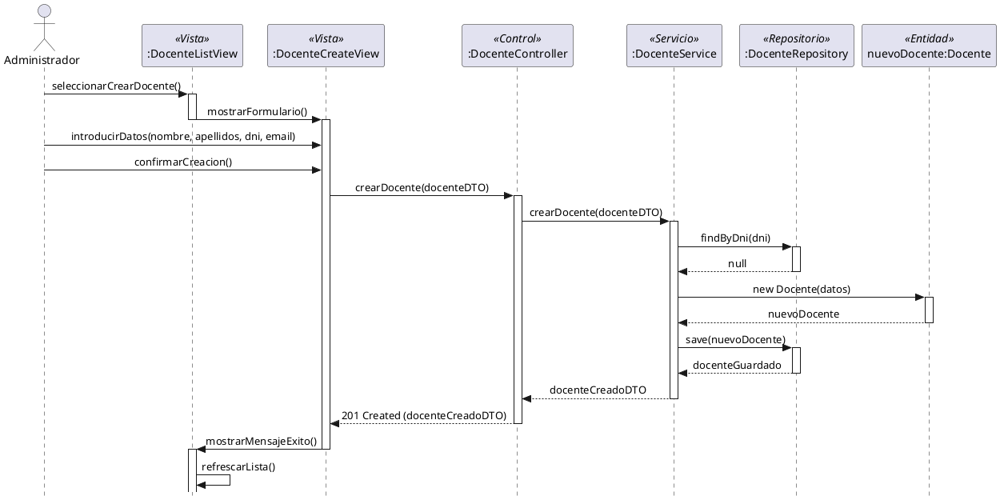

## USER 🧑‍💻

@Desktop/25-26-idsw2-sdVC/PROTOCOLOS_IA.md Inicio
--- Content from referenced files ---
Content from @Desktop/25-26-idsw2-sdVC/PROTOCOLOS_IA.md:
# PROTOCOLOS_IA.md - Guía para el agente IA
---
Este archivo sirve para automatizar al agente IA para que obtenga el contexto o actualice el conversation-log simplemente con escribir una palabra.
## INICIALIZACIÓN 
Para que la IA tenga contexto de cual es el punto actual del proyecto cuando se escriba "Inicio" el agente debe leer y analizar los siguientes archivos:

- `archivosEsenciales/modelos/diagramas/diagramaEntidad/diagramaEntidad.puml` --> diagrama de entidad.
- `archivosEsenciales/modelos/diagramas/diagramaEntidad/diagramaEntidadConsideraciones.md` --> Consideraciones del modelo de dominio.
- `archivosEsenciales/casos-de-uso/encontrarActoresYCasosDeUso/actoresYCasosDeUso-administradorInstitucional.puml` --> Actores y casos de uso para "administrador institucional".
- `archivosEsenciales/casos-de-uso/encontrarActoresYCasosDeUso/actoresYCasosDeUso-docente.puml` --> Actores y casos de uso para "docente".
- `archivosEsenciales/casos-de-uso/diagramasDeContexto/diagramaDeContextoAdministradorInstitucional/diagramaContexto.puml` --> diagrama de contexto para el "administrador institucional".
- `archivosEsenciales/casos-de-uso/diagramasDeContexto/diagramaDeContextoDocente/diagramaContexto.puml` --> diagrama de contexto para el "docente".
- `conversation-log.md` --> Resumen de las sesiones actualizadas con el agente de IA.

## FINALIZACIÓN
Cuando se escriba "fin" el agente debe añadir al archivo `conversation-log.md` la reciente sesión de la siguiente forma:

## [HH:MM] Título breve de lo que se pidió

**Prompt:** lo que le dijo al AI (textual o resumido fielmente)

**Resultado:** lo que produjo

**Decisión:** qué aceptó, qué rechazó, qué modificó, y por qué
--- End of content ---

---

## MODEL ✨

**Tool Command**:
```json
{
  "name": "update_topic",
  "args": {
    "title": "Initializing Project Context",
    "strategic_intent": "Initializing project context by reading essential files as defined in PROTOCOLOS_IA.md.",
    "summary": "The user invoked the \"Inicio\" protocol from PROTOCOLOS_IA.md. I am now gathering the context by reading the entity diagram, considerations, use cases for institutional administrators and teachers, context diagrams, and the conversation log. This will provide a comprehensive understanding of the project's current state and requirements."
  },
  "id": "update_topic__update_topic_1780479526548_0"
}
```**Tool Command**:
```json
{
  "name": "run_shell_command",
  "args": {
    "command": "ls -R Desktop/25-26-idsw2-sdVC/archivosEsenciales Desktop/25-26-idsw2-sdVC/conversation-log.md",
    "description": "Verifying the existence of essential files for context initialization."
  },
  "id": "run_shell_command__run_shell_command_1780479526552_1"
}
```

---

## USER 🧑‍💻

**Tool Response**:
```json
{
  "id": "update_topic__update_topic_1780479526548_0",
  "name": "update_topic",
  "response": {
    "output": "Current topic: \"Initializing Project Context\"\nTopic summary: The user invoked the \"Inicio\" protocol from PROTOCOLOS_IA.md. I am now gathering the context by reading the entity diagram, considerations, use cases for institutional administrators and teachers, context diagrams, and the conversation log. This will provide a comprehensive understanding of the project's current state and requirements.\n\nStrategic Intent: Initializing project context by reading essential files as defined in PROTOCOLOS_IA.md."
  }
}
```**Tool Response**:
```json
{
  "id": "run_shell_command__run_shell_command_1780479526552_1",
  "name": "run_shell_command",
  "response": {
    "output": "Output: Desktop/25-26-idsw2-sdVC/conversation-log.md\n\nDesktop/25-26-idsw2-sdVC/archivosEsenciales:\ncasos-de-uso    modelos\n\nDesktop/25-26-idsw2-sdVC/archivosEsenciales/casos-de-uso:\ndetalladoCasosDeUso             diagramasDeContexto             encontrarActoresYCasosDeUso     priorizarCasosDeUso             prototipadoCasosDeUso\n\nDesktop/25-26-idsw2-sdVC/archivosEsenciales/casos-de-uso/detalladoCasosDeUso:\nasignarExamenes                 crearAsignatura                 editarAsignatura                eliminarAsignatura              exportarAsignaturas             importarAsignaturas             verAlumnos\ncancelarGeneracion              crearDocente                    editarDocente                   eliminarDocente                 exportarConfiguracionGlobal     importarConfiguracionGlobal     verAsignaturas\ncerrarSesion                    crearGrado                      editarGrado                     eliminarGrado                   exportarGrados                  importarGrados                  verDocentes\ncompletarGestion                crearPregunta                   editarPregunta                  eliminarPregunta                exportarPreguntas               importarPreguntas               verGrados\ncorregirExamenes                crearRespuesta                  editarRespuesta                 eliminarRespuesta               generarExamenes                 iniciarSesion                   verPreguntas\ncrearAlumno                     editarAlumno                    eliminarAlumno                  exportarAlumnos                 importarAlumnos                 README.md                       verRespuestas\n\nDesktop/25-26-idsw2-sdVC/archivosEsenciales/casos-de-uso/detalladoCasosDeUso/asignarExamenes:\nasignarExamenes.puml    asignarExamenes.svg\n\nDesktop/25-26-idsw2-sdVC/archivosEsenciales/casos-de-uso/detalladoCasosDeUso/cancelarGeneracion:\ncancelarGeneracion.puml cancelarGeneracion.svg\n\nDesktop/25-26-idsw2-sdVC/archivosEsenciales/casos-de-uso/detalladoCasosDeUso/cerrarSesion:\ncerrarSesion.puml       cerrarSesion.svg\n\nDesktop/25-26-idsw2-sdVC/archivosEsenciales/casos-de-uso/detalladoCasosDeUso/completarGestion:\ncompletarGestion.puml   completarGestion.svg\n\nDesktop/25-26-idsw2-sdVC/archivosEsenciales/casos-de-uso/detalladoCasosDeUso/corregirExamenes:\ncorregirExamenes.puml   corregirExamenes.svg\n\nDesktop/25-26-idsw2-sdVC/archivosEsenciales/casos-de-uso/detalladoCasosDeUso/crearAlumno:\ncrearAlumno.puml        crearAlumno.svg\n\nDesktop/25-26-idsw2-sdVC/archivosEsenciales/casos-de-uso/detalladoCasosDeUso/crearAsignatura:\ncrearAsignatura.puml    crearAsignatura.svg\n\nDesktop/25-26-idsw2-sdVC/archivosEsenciales/casos-de-uso/detalladoCasosDeUso/crearDocente:\ncrearDocente.puml       crearDocente.svg\n\nDesktop/25-26-idsw2-sdVC/archivosEsenciales/casos-de-uso/detalladoCasosDeUso/crearGrado:\ncrearGrado.puml crearGrado.svg\n\nDesktop/25-26-idsw2-sdVC/archivosEsenciales/casos-de-uso/detalladoCasosDeUso/crearPregunta:\ncrearPregunta.puml      crearPregunta.svg\n\nDesktop/25-26-idsw2-sdVC/archivosEsenciales/casos-de-uso/detalladoCasosDeUso/crearRespuesta:\ncrearRespuesta.puml     crearRespuesta.svg\n\nDesktop/25-26-idsw2-sdVC/archivosEsenciales/casos-de-uso/detalladoCasosDeUso/editarAlumno:\neditarAlumno.puml       editarAlumno.svg\n\nDesktop/25-26-idsw2-sdVC/archivosEsenciales/casos-de-uso/detalladoCasosDeUso/editarAsignatura:\neditarAsignatura.puml   editarAsignatura.svg\n\nDesktop/25-26-idsw2-sdVC/archivosEsenciales/casos-de-uso/detalladoCasosDeUso/editarDocente:\neditarDocente.puml      editarDocente.svg\n\nDesktop/25-26-idsw2-sdVC/archivosEsenciales/casos-de-uso/detalladoCasosDeUso/editarGrado:\neditarGrado.puml        editarGrado.svg\n\nDesktop/25-26-idsw2-sdVC/archivosEsenciales/casos-de-uso/detalladoCasosDeUso/editarPregunta:\neditarPregunta.puml     editarPregunta.svg\n\nDesktop/25-26-idsw2-sdVC/archivosEsenciales/casos-de-uso/detalladoCasosDeUso/editarRespuesta:\neditarRespuesta.puml    editarRespuesta.svg\n\nDesktop/25-26-idsw2-sdVC/archivosEsenciales/casos-de-uso/detalladoCasosDeUso/eliminarAlumno:\neliminarAlumno.puml     eliminarAlumno.svg\n\nDesktop/25-26-idsw2-sdVC/archivosEsenciales/casos-de-uso/detalladoCasosDeUso/eliminarAsignatura:\neliminarAsignatura.puml eliminarAsignatura.svg\n\nDesktop/25-26-idsw2-sdVC/archivosEsenciales/casos-de-uso/detalladoCasosDeUso/eliminarDocente:\neliminarDocente.puml    eliminarDocente.svg\n\nDesktop/25-26-idsw2-sdVC/archivosEsenciales/casos-de-uso/detalladoCasosDeUso/eliminarGrado:\neliminarGrado.puml      eliminarGrado.svg\n\nDesktop/25-26-idsw2-sdVC/archivosEsenciales/casos-de-uso/detalladoCasosDeUso/eliminarPregunta:\neliminarPregunta.puml   eliminarPregunta.svg\n\nDesktop/25-26-idsw2-sdVC/archivosEsenciales/casos-de-uso/detalladoCasosDeUso/eliminarRespuesta:\neliminarRespuesta.puml  eliminarRespuesta.svg\n\nDesktop/25-26-idsw2-sdVC/archivosEsenciales/casos-de-uso/detalladoCasosDeUso/exportarAlumnos:\nexportarAlumnos.puml    exportarAlumnos.svg\n\nDesktop/25-26-idsw2-sdVC/archivosEsenciales/casos-de-uso/detalladoCasosDeUso/exportarAsignaturas:\nexportarAsignaturas.puml        exportarAsignaturas.svg\n\nDesktop/25-26-idsw2-sdVC/archivosEsenciales/casos-de-uso/detalladoCasosDeUso/exportarConfiguracionGlobal:\nexportarConfiguracionGlobal.puml        exportarConfiguracionGlobal.svg\n\nDesktop/25-26-idsw2-sdVC/archivosEsenciales/casos-de-uso/detalladoCasosDeUso/exportarGrados:\nexportarGrados.puml     exportarGrados.svg\n\nDesktop/25-26-idsw2-sdVC/archivosEsenciales/casos-de-uso/detalladoCasosDeUso/exportarPreguntas:\nexportarPreguntas.puml  exportarPreguntas.svg\n\nDesktop/25-26-idsw2-sdVC/archivosEsenciales/casos-de-uso/detalladoCasosDeUso/generarExamenes:\ngenerarExamenes.puml    generarExamenes.svg\n\nDesktop/25-26-idsw2-sdVC/archivosEsenciales/casos-de-uso/detalladoCasosDeUso/importarAlumnos:\nimportarAlumnos.puml    importarAlumnos.svg\n\nDesktop/25-26-idsw2-sdVC/archivosEsenciales/casos-de-uso/detalladoCasosDeUso/importarAsignaturas:\nimportarAsignaturas.puml        importarAsignaturas.svg\n\nDesktop/25-26-idsw2-sdVC/archivosEsenciales/casos-de-uso/detalladoCasosDeUso/importarConfiguracionGlobal:\nimportarConfiguracionGlobal.puml        importarConfiguracionGlobal.svg\n\nDesktop/25-26-idsw2-sdVC/archivosEsenciales/casos-de-uso/detalladoCasosDeUso/importarGrados:\nimportarGrados.puml     importarGrados.svg\n\nDesktop/25-26-idsw2-sdVC/archivosEsenciales/casos-de-uso/detalladoCasosDeUso/importarPreguntas:\nimportarPreguntas.puml  importarPreguntas.svg\n\nDesktop/25-26-idsw2-sdVC/archivosEsenciales/casos-de-uso/detalladoCasosDeUso/iniciarSesion:\niniciarSesion.puml      iniciarSesion.svg\n\nDesktop/25-26-idsw2-sdVC/archivosEsenciales/casos-de-uso/detalladoCasosDeUso/verAlumnos:\nverAlumnos.puml verAlumnos.svg\n\nDesktop/25-26-idsw2-sdVC/archivosEsenciales/casos-de-uso/detalladoCasosDeUso/verAsignaturas:\nverAsignaturas.puml     verAsignaturas.svg\n\nDesktop/25-26-idsw2-sdVC/archivosEsenciales/casos-de-uso/detalladoCasosDeUso/verDocentes:\nverDocentes.puml        verDocentes.svg\n\nDesktop/25-26-idsw2-sdVC/archivosEsenciales/casos-de-uso/detalladoCasosDeUso/verGrados:\nverGrados.puml  verGrados.svg\n\nDesktop/25-26-idsw2-sdVC/archivosEsenciales/casos-de-uso/detalladoCasosDeUso/verPreguntas:\nverPreguntas.puml       verPreguntas.svg\n\nDesktop/25-26-idsw2-sdVC/archivosEsenciales/casos-de-uso/detalladoCasosDeUso/verRespuestas:\nverRespuestas.puml      verRespuestas.svg\n\nDesktop/25-26-idsw2-sdVC/archivosEsenciales/casos-de-uso/diagramasDeContexto:\ndiagramaDeContextoAdministradorInstitucional    diagramaDeContextoDocente                       README.md\n\nDesktop/25-26-idsw2-sdVC/archivosEsenciales/casos-de-uso/diagramasDeContexto/diagramaDeContextoAdministradorInstitucional:\ndiagramaContexto.puml   diagramaContexto.svg\n\nDesktop/25-26-idsw2-sdVC/archivosEsenciales/casos-de-uso/diagramasDeContexto/diagramaDeContextoDocente:\ndiagramaContexto.puml   diagramaContexto.svg\n\nDesktop/25-26-idsw2-sdVC/archivosEsenciales/casos-de-uso/encontrarActoresYCasosDeUso:\nactoresYCasosDeUso-administradorInstitucional.puml      actoresYCasosDeUso-docente.puml                         actoresYCasosDeUso-tiempo.puml                          README.md\nactoresYCasosDeUso-administradorInstitucional.svg       actoresYCasosDeUso-docente.svg                          actoresYCasosDeUso-tiempo.svg\n\nDesktop/25-26-idsw2-sdVC/archivosEsenciales/casos-de-uso/priorizarCasosDeUso:\nCasosDeUsoPriorizados.md\n\nDesktop/25-26-idsw2-sdVC/archivosEsenciales/casos-de-uso/prototipadoCasosDeUso:\nasignarExamenes                 crearAsignatura                 editarAsignatura                eliminarAsignatura              generarExamenes                 iniciarSesion                   verPreguntas\ncancelarGeneracion              crearDocente                    editarDocente                   eliminarDocente                 importarAlumnos                 README.md                       verRespuestas\ncerrarSesion                    crearGrado                      editarGrado                     eliminarGrado                   importarAsignaturas             verAlumnos\ncompletarGestion                crearPregunta                   editarPregunta                  eliminarPregunta                importarConfiguracionGlobal     verAsignaturas\ncorregirExamenes                crearRespuesta                  editarRespuesta                 eliminarRespuesta               importarGrados                  verDocentes\ncrearAlumno                     editarAlumno                    eliminarAlumno                  exportarConfiguracionGlobal     importarPreguntas               verGrados\n\nDesktop/25-26-idsw2-sdVC/archivosEsenciales/casos-de-uso/prototipadoCasosDeUso/asignarExamenes:\nasignarExamenes.puml    asignarExamenes.svg\n\nDesktop/25-26-idsw2-sdVC/archivosEsenciales/casos-de-uso/prototipadoCasosDeUso/cancelarGeneracion:\ncancelarGeneracion.puml cancelarGeneracion.svg\n\nDesktop/25-26-idsw2-sdVC/archivosEsenciales/casos-de-uso/prototipadoCasosDeUso/cerrarSesion:\ncerrarSesionAdministadorInstitucional.puml      cerrarSesionAdministradorInstitucional.svg      cerrarSesionDocente.puml                        cerrarSesionDocente.svg\n\nDesktop/25-26-idsw2-sdVC/archivosEsenciales/casos-de-uso/prototipadoCasosDeUso/completarGestion:\ncompletarGestionAdministradorInsitucional.puml  completarGestionAdministradorInstitucional.svg  completarGestionDocente.puml                    completarGestionDocente.svg\n\nDesktop/25-26-idsw2-sdVC/archivosEsenciales/casos-de-uso/prototipadoCasosDeUso/corregirExamenes:\ncorregirExamenesConfirmacion.puml       corregirExamenesError.puml              corregirExamenesExito.puml\ncorregirExamenesConfirmacion.svg        corregirExamenesError.svg               corregirExamenesExito.svg\n\nDesktop/25-26-idsw2-sdVC/archivosEsenciales/casos-de-uso/prototipadoCasosDeUso/crearAlumno:\ncrearAlumno.puml        crearAlumno.svg\n\nDesktop/25-26-idsw2-sdVC/archivosEsenciales/casos-de-uso/prototipadoCasosDeUso/crearAsignatura:\ncrearAsignatura.puml    crearAsignatura.svg\n\nDesktop/25-26-idsw2-sdVC/archivosEsenciales/casos-de-uso/prototipadoCasosDeUso/crearDocente:\ncrearDocente.puml       crearDocente.svg\n\nDesktop/25-26-idsw2-sdVC/archivosEsenciales/casos-de-uso/prototipadoCasosDeUso/crearGrado:\ncrearGrado.puml crearGrado.svg\n\nDesktop/25-26-idsw2-sdVC/archivosEsenciales/casos-de-uso/prototipadoCasosDeUso/crearPregunta:\ncrearPregunta.puml      crearPregunta.svg\n\nDesktop/25-26-idsw2-sdVC/archivosEsenciales/casos-de-uso/prototipadoCasosDeUso/crearRespuesta:\ncrearRespuesta.puml     crearRespuesta.svg\n\nDesktop/25-26-idsw2-sdVC/archivosEsenciales/casos-de-uso/prototipadoCasosDeUso/editarAlumno:\neditarAlumno.puml       editarAlumno.svg\n\nDesktop/25-26-idsw2-sdVC/archivosEsenciales/casos-de-uso/prototipadoCasosDeUso/editarAsignatura:\neditarAsignatura.puml   editarAsignatura.svg\n\nDesktop/25-26-idsw2-sdVC/archivosEsenciales/casos-de-uso/prototipadoCasosDeUso/editarDocente:\neditarDocente.puml      editarDocente.svg\n\nDesktop/25-26-idsw2-sdVC/archivosEsenciales/casos-de-uso/prototipadoCasosDeUso/editarGrado:\neditarGrado.puml        editarGrado.svg\n\nDesktop/25-26-idsw2-sdVC/archivosEsenciales/casos-de-uso/prototipadoCasosDeUso/editarPregunta:\neditarPregunta.puml     editarPregunta.svg\n\nDesktop/25-26-idsw2-sdVC/archivosEsenciales/casos-de-uso/prototipadoCasosDeUso/editarRespuesta:\neditarRespuesta.puml    editarRespuesta.svg\n\nDesktop/25-26-idsw2-sdVC/archivosEsenciales/casos-de-uso/prototipadoCasosDeUso/eliminarAlumno:\neliminarAlumno.puml     eliminarAlumno.svg\n\nDesktop/25-26-idsw2-sdVC/archivosEsenciales/casos-de-uso/prototipadoCasosDeUso/eliminarAsignatura:\neliminarAsignatura.puml eliminarAsignatura.svg\n\nDesktop/25-26-idsw2-sdVC/archivosEsenciales/casos-de-uso/prototipadoCasosDeUso/eliminarDocente:\neliminarDocente.puml    eliminarDocente.svg\n\nDesktop/25-26-idsw2-sdVC/archivosEsenciales/casos-de-uso/prototipadoCasosDeUso/eliminarGrado:\neliminarGrado.puml      eliminarGrado.svg\n\nDesktop/25-26-idsw2-sdVC/archivosEsenciales/casos-de-uso/prototipadoCasosDeUso/eliminarPregunta:\neliminarPregunta.puml   eliminarPregunta.svg\n\nDesktop/25-26-idsw2-sdVC/archivosEsenciales/casos-de-uso/prototipadoCasosDeUso/eliminarRespuesta:\neliminarRespuesta.puml  eliminarRespuesta.svg\n\nDesktop/25-26-idsw2-sdVC/archivosEsenciales/casos-de-uso/prototipadoCasosDeUso/exportarConfiguracionGlobal:\nexportarConfiguracionGlobalConfirmacion.puml    exportarConfiguracionGlobalError.puml           exportarConfiguracionGlobalExito.puml\nexportarConfiguracionGlobalConfirmacion.svg     exportarConfiguracionGlobalError.svg            exportarConfiguracionGlobalExito.svg\n\nDesktop/25-26-idsw2-sdVC/archivosEsenciales/casos-de-uso/prototipadoCasosDeUso/generarExamenes:\ngenerarExamenesConfirmacion.puml        generarExamenesError.puml               generarExamenesExito.puml\ngenerarExamenesConfirmacion.svg         generarExamenesError.svg                generarExamenesExito.svg\n\nDesktop/25-26-idsw2-sdVC/archivosEsenciales/casos-de-uso/prototipadoCasosDeUso/importarAlumnos:\nimportarAlumnosConfirmacion.puml        importarAlumnosError.puml               importarAlumnosExito.puml\nimportarAlumnosConfirmacion.svg         importarAlumnosError.svg                importarAlumnosExito.svg\n\nDesktop/25-26-idsw2-sdVC/archivosEsenciales/casos-de-uso/prototipadoCasosDeUso/importarAsignaturas:\nimportarAsignaturas.puml        importarAsignaturas.svg\n\nDesktop/25-26-idsw2-sdVC/archivosEsenciales/casos-de-uso/prototipadoCasosDeUso/importarConfiguracionGlobal:\nimportarConfiguracionGlobalConfirmacion.puml    importarConfiguracionGlobalError.puml           importarConfiguracionGlobalExito.puml\nimportarConfiguracionGlobalConfirmacion.svg     importarConfiguracionGlobalError.svg            importarConfiguracionGlobalExito.svg\n\nDesktop/25-26-idsw2-sdVC/archivosEsenciales/casos-de-uso/prototipadoCasosDeUso/importarGrados:\nimportarGrados.puml     importarGrados.svg\n\nDesktop/25-26-idsw2-sdVC/archivosEsenciales/casos-de-uso/prototipadoCasosDeUso/importarPreguntas:\nimportarPreguntasConfirmacion.puml      importarPreguntasError.puml             importarPreguntasExito.puml\nimportarPreguntasConfirmacion.svg       importarPreguntasError.svg              importarPreguntasExito.svg\n\nDesktop/25-26-idsw2-sdVC/archivosEsenciales/casos-de-uso/prototipadoCasosDeUso/iniciarSesion:\niniciarSesion.puml      iniciarSesion.svg       iniciarSesionError.puml iniciarSesionError.svg\n\nDesktop/25-26-idsw2-sdVC/archivosEsenciales/casos-de-uso/prototipadoCasosDeUso/verAlumnos:\nverAlumnos.puml verAlumnos.svg\n\nDesktop/25-26-idsw2-sdVC/archivosEsenciales/casos-de-uso/prototipadoCasosDeUso/verAsignaturas:\nverAsignaturas.puml     verAsignaturas.svg\n\nDesktop/25-26-idsw2-sdVC/archivosEsenciales/casos-de-uso/prototipadoCasosDeUso/verDocentes:\nverDocentes.puml        verDocentes.svg\n\nDesktop/25-26-idsw2-sdVC/archivosEsenciales/casos-de-uso/prototipadoCasosDeUso/verGrados:\nverGrados.puml  verGrados.svg\n\nDesktop/25-26-idsw2-sdVC/archivosEsenciales/casos-de-uso/prototipadoCasosDeUso/verPreguntas:\nverPreguntas.puml       verPreguntas.svg\n\nDesktop/25-26-idsw2-sdVC/archivosEsenciales/casos-de-uso/prototipadoCasosDeUso/verRespuestas:\nverRespuestas.puml      verRespuestas.svg\n\nDesktop/25-26-idsw2-sdVC/archivosEsenciales/modelos:\ndiagramas       Glosario.md\n\nDesktop/25-26-idsw2-sdVC/archivosEsenciales/modelos/diagramas:\ndiagramaEntidad diagramaEstados diagramaObjetos README.md\n\nDesktop/25-26-idsw2-sdVC/archivosEsenciales/modelos/diagramas/diagramaEntidad:\ndiagramaEntidad.puml                    diagramaEntidad.svg                     diagramaEntidadConsideraciones.md       diagramaEntidadSimplificado.puml        diagramaEntidadSimplificado.svg\n\nDesktop/25-26-idsw2-sdVC/archivosEsenciales/modelos/diagramas/diagramaEstados:\ndiagramaEstadosExamen   diagramaEstadosPregunta\n\nDesktop/25-26-idsw2-sdVC/archivosEsenciales/modelos/diagramas/diagramaEstados/diagramaEstadosExamen:\ndiagramaEstadosExamen.puml              diagramaEstadosExamen.svg               diagramaEstadosExamenConsideraciones.md\n\nDesktop/25-26-idsw2-sdVC/archivosEsenciales/modelos/diagramas/diagramaEstados/diagramaEstadosPregunta:\ndiagramaEstadosPregunta.puml                    diagramaEstadosPregunta.svg                     diagramaEstadosPreguntaConsideraciones.md\n\nDesktop/25-26-idsw2-sdVC/archivosEsenciales/modelos/diagramas/diagramaObjetos:\ndiagramaObjetosCompleto.puml    diagramaObjetosCompleto.svg     diagramaObjetosParcial1         diagramaObjetosParcial2         diagramaObjetosParcial3\n\nDesktop/25-26-idsw2-sdVC/archivosEsenciales/modelos/diagramas/diagramaObjetos/diagramaObjetosParcial1:\ndiagramaObjetos.puml    diagramaObjetos.svg\n\nDesktop/25-26-idsw2-sdVC/archivosEsenciales/modelos/diagramas/diagramaObjetos/diagramaObjetosParcial2:\ndiagramaObjetos.puml    diagramaObjetos.svg\n\nDesktop/25-26-idsw2-sdVC/archivosEsenciales/modelos/diagramas/diagramaObjetos/diagramaObjetosParcial3:\ndiagramaObjetos.puml    diagramaObjetos.svg\nProcess Group PGID: 24103"
  }
}
```

---

## MODEL ✨

**Tool Command**:
```json
{
  "name": "read_file",
  "args": {
    "file_path": "Desktop/25-26-idsw2-sdVC/archivosEsenciales/modelos/diagramas/diagramaEntidad/diagramaEntidad.puml"
  },
  "id": "read_file__read_file_1780479532693_0"
}
```**Tool Command**:
```json
{
  "name": "read_file",
  "args": {
    "file_path": "Desktop/25-26-idsw2-sdVC/archivosEsenciales/modelos/diagramas/diagramaEntidad/diagramaEntidadConsideraciones.md"
  },
  "id": "read_file__read_file_1780479532896_1"
}
```**Tool Command**:
```json
{
  "name": "read_file",
  "args": {
    "file_path": "Desktop/25-26-idsw2-sdVC/archivosEsenciales/casos-de-uso/encontrarActoresYCasosDeUso/actoresYCasosDeUso-administradorInstitucional.puml"
  },
  "id": "read_file__read_file_1780479533244_2"
}
```**Tool Command**:
```json
{
  "name": "read_file",
  "args": {
    "file_path": "Desktop/25-26-idsw2-sdVC/archivosEsenciales/casos-de-uso/encontrarActoresYCasosDeUso/actoresYCasosDeUso-docente.puml"
  },
  "id": "read_file__read_file_1780479533573_3"
}
```**Tool Command**:
```json
{
  "name": "read_file",
  "args": {
    "file_path": "Desktop/25-26-idsw2-sdVC/archivosEsenciales/casos-de-uso/diagramasDeContexto/diagramaDeContextoAdministradorInstitucional/diagramaContexto.puml"
  },
  "id": "read_file__read_file_1780479533794_4"
}
```**Tool Command**:
```json
{
  "name": "read_file",
  "args": {
    "file_path": "Desktop/25-26-idsw2-sdVC/archivosEsenciales/casos-de-uso/diagramasDeContexto/diagramaDeContextoDocente/diagramaContexto.puml"
  },
  "id": "read_file__read_file_1780479533988_5"
}
```**Tool Command**:
```json
{
  "name": "read_file",
  "args": {
    "file_path": "Desktop/25-26-idsw2-sdVC/conversation-log.md"
  },
  "id": "read_file__read_file_1780479533997_6"
}
```

---

## USER 🧑‍💻

**Tool Response**:
```json
{
  "id": "read_file__read_file_1780479532693_0",
  "name": "read_file",
  "response": {
    "output": "@startuml\nclass Examen{\n - evaluación\n - clave corrección\n}\nclass Asignatura{\n - título\n - código\n - curso académico\n}\nclass Pregunta{\n - asignatura\n - enunciado\n - tema\n - dificultad\n}\nclass BateriaDePreguntas{\n}\nclass Grado{\n - título\n - código\n}\nclass Profesor{\n - nombre\n - apellidos\n - DNI\n}\nclass Alumno{\n - nombre\n - apellidos\n - DNI\n}\nenum EvaluaciónExamen{\n - Parcial 1\n - Parcial 2\n - Parcial 3\n - Examen final\n - Examen extraordinario\n}\nenum DificultadPregunta{\n - facil\n - medio\n - dificil\n}\n\nclass Respuesta{\n - opción\n - esCorrecta\n}\n\nenum Tema{\n}\n\nRespuesta -u-* Pregunta\nPregunta ..> DificultadPregunta\nPregunta -u-o Examen : contiene\nPregunta -u-* BateriaDePreguntas : contiene\nExamen ..> EvaluaciónExamen\nBateriaDePreguntas -u-* Asignatura : tiene\nExamen -u-* Asignatura : tiene\nProfesor o-r- Asignatura : tiene\nAsignatura --> Grado : pertenece\nAlumno -u-o Examen : realiza\nAlumno -u-* Asignatura : se imparte\nAlumno -u-* Grado : se cursa\nPregunta ..> Tema\n@enduml"
  }
}
```**Tool Response**:
```json
{
  "id": "read_file__read_file_1780479532896_1",
  "name": "read_file",
  "response": {
    "output": "[](/README.md) [](/documents/modelos/diagramas/README.md)   [](/documents/casos-de-uso/encontrarActoresYCasosDeUso/README.md)  [](/documents/casos-de-uso/diagramasDeContexto/README.md)  [](/documents/casos-de-uso/priorizarCasosDeUso/CasosDeUsoPriorizados.md)<br> [](/documents/casos-de-uso/detalladoCasosDeUso/README.md) [](/documents/casos-de-uso/prototipadoCasosDeUso/README.md) [](/documents/minutas/README.md) [](/documents/evidencias/README.md)  [](/documents/modelos/Glosario.md) [](/documents/AI-uso.md)\n\n| Relación | Tipo y Cardinalidad | Justificación |\n| :--- | :--- | :--- |\n| **Profesor – Asignatura** | Agregación (1 o-- many) | Un solo profesor puede ser responsable de impartir **varias** asignaturas, mientras que cada asignatura tiene asignado un único profesor. |\n| **Grado – Asignatura** | Composición (many <-- many) | Una asignatura puede estar formada por **muchos** grados y cada grado puede estar presente en varias asignaturas. |\n| **Asignatura – Alumno** | Asociación (many -- many) | En una asignatura se matriculan **muchos** alumnos y, a su vez, un mismo alumno se matricula en **muchas** asignaturas diferentes. |\n| **Asignatura – Exámen** | Composición (1 *-- many) | Una asignatura tiene planificados **varios** exámenes (parciales, finales, recuperaciones), pero cada exámen corresponde a una única asignatura. |\n| **Asignatura – BateríaDePreguntas** | Composición (1 *-- 1) | Cada asignatura tiene asociada **una** única batería de preguntas, y esa batería pertenece solo a esa asignatura. |\n| **Grado – Alumno** | Composición (1 *-- many) | Un Grado tiene inscritos a **muchos** alumnos, pero un alumno cursa (en este contexto) un único Grado principal. |\n| **Alumno – Exámen** | Agregación (1 o-- 1) | Un alumno realiza **una** única instancia/entrega de un exámen específico, y esa entrega pertenece a ese único alumno. |\n| **Exámen – Pregunta** | Agregación (many o-- many) | Un exámen consta de **muchas** preguntas, y una misma pregunta puede ser reutilizada y aparecer en **muchos** exámenes distintos. |\n| **BateríaDePreguntas – Pregunta** | Composición (1 *-- many) | La batería almacena **muchas** preguntas distintas, pero cada pregunta específica reside en una única batería. |\n| **Pregunta – Respuesta** | Composición (1 *-- many) | Una sola pregunta tiene asociadas **varias** opciones de respuesta posibles, que pertenecen únicamente a esa pregunta. |"
  }
}
```**Tool Response**:
```json
{
  "id": "read_file__read_file_1780479533244_2",
  "name": "read_file",
  "response": {
    "output": "@startuml actoresYCasosDeUso-administradorInstitucional\n\nleft to right direction\n\nactor \"Administrador Institucional\" as admin\n\npackage \"Módulo Docentes\" {\n  usecase \"crearDocente()\" as UC32\n  usecase \"verDocentes()\" as UC33\n  usecase \"editarDocente()\" as UC34\n  usecase \"eliminarDocente()\" as UC35\n}\n\n\npackage \"Módulo Sesión\" {\n  usecase \"iniciarSesion()\" as UC41\n  usecase \"cerrarSesion()\" as UC42\n}\npackage \"Módulo Gestión\" {\n  usecase \"completarGestion()\" as UC13\n\n}\n\nadmin --> UC13\nadmin --> UC32\nadmin --> UC33\nadmin --> UC34\nadmin --> UC35\nadmin --> UC41\nadmin --> UC42\n\n@enduml"
  }
}
```**Tool Response**:
```json
{
  "id": "read_file__read_file_1780479533573_3",
  "name": "read_file",
  "response": {
    "output": "@startuml actoresYCasosDeUso-docente\n\nleft to right direction\n\nactor \"Docente\" as doc\n\npackage \"Módulo Grado\" {\n  usecase \"crearGrado()\" as UC1\n  usecase \"verGrados()\" as UC2\n  usecase \"editarGrado()\" as UC3\n  usecase \"eliminarGrado()\" as UC4\n}\n\npackage \"Módulo Asignatura\" {\n  usecase \"crearAsignatura()\" as UC5\n  usecase \"verAsignaturas()\" as UC6\n  usecase \"editarAsignatura()\" as UC7\n  usecase \"eliminarAsignatura()\" as UC8\n}\n\npackage \"Módulo Alumno\" {\n  usecase \"crearAlumno()\" as UC9\n  usecase \"verAlumnos()\" as UC10\n  usecase \"editarAlumno()\" as UC11\n  usecase \"eliminarAlumno()\" as UC12\n}\n\npackage \"Módulo Preguntas-Respuestas\" {\n  usecase \"crearPregunta()\" as UC20\n  usecase \"verPreguntas()\" as UC21\n  usecase \"editarPregunta\" as UC22\n  usecase \"eliminarPregunta()\" as UC23\n \n  usecase \"crearRespuesta()\" as UC32\n  usecase \"verRespuestas()\" as UC33\n  usecase \"editarRespuesta()\" as UC34\n  usecase \"eliminarRespuesta()\" as UC35\n}\n\npackage \"Módulo Configuración General\" {\n  usecase \"exportarConfiguracionGlobal()\" as UC26\n  usecase \"importarConfiguracionGlobal()\" as UC27\n}\n\npackage \"Módulo Exámen\" {\n  usecase \"generarExamenes()\" as UC28\n  usecase \"asignarExamenes()\" as UC29\n  usecase \"cancelarGeneracion()\" as UC40\n  usecase \"corregirExamenes()\" as UC31\n}\n\npackage \"Módulo Sesión\" {\n  usecase \"iniciarSesion()\" as UC42\n  usecase \"cerrarSesion()\" as UC43\n}\n\npackage \"Módulo Gestión\" {\n  usecase \"completarGestion()\" as UC13\n\n}\npackage \"Módulo Importación\" as MI45{\n  usecase \"importarAsignaturas()\" as UC38\n  usecase \"importarPreguntas()\" as UC24\n  usecase \"importarAlumnos()\" as UC19\n  usecase \"importarGrados()\" as UC36\n}\npackage \"Módulo Exportación [Abstracto]\" as ME44{\nusecase \"exportarPreguntas()\" as UC25\nusecase \"exportarAlumnos()\" as UC17\nusecase \"exportarAsignaturas()\" as UC39\nusecase \"exportarGrados()\" as UC37\n}\n\n\ndoc --> UC1\ndoc --> UC2\ndoc --> UC3\ndoc --> UC4\n\ndoc --> UC5\ndoc --> UC6\ndoc --> UC7\ndoc --> UC8\n\ndoc --> UC9\ndoc --> UC10\ndoc --> UC11\ndoc --> UC12\n\ndoc -u-> UC13\ndoc -u-> UC19\ndoc -d-> UC20\ndoc -d-> UC21\ndoc -d-> UC22\ndoc -d-> UC23\ndoc -d-> UC24\n\ndoc -u-> UC26\ndoc -u-> UC27\ndoc -l-> UC28\ndoc -l-> UC29\ndoc -l-> UC31\ndoc -d-> UC32\ndoc -d-> UC33\ndoc -d-> UC34\ndoc -d-> UC35\ndoc -l-> UC36\ndoc -l-> UC38\ndoc -l-> UC40\ndoc -u-> UC42\ndoc -u-> UC43\nME44<.r.UC26 : <<include>>\nMI45<.r.UC27 : <<include>>\nUC38 .> UC5 : <<include>>\nUC36 .> UC1 : <<include>>\nUC24 .> UC20 : <<include>>\nUC19 .> UC9 : <<include>>\n\n@enduml"
  }
}
```**Tool Response**:
```json
{
  "id": "read_file__read_file_1780479533794_4",
  "name": "read_file",
  "response": {
    "output": "@startuml\n\nleft to right direction\n\n'Estados'\n\nstate \"SESION_CERRADA\" as NoAuth\nstate \"SISTEMA_DISPONIBLE\" as Menu\n\nstate \"DOCENTES_ABIERTO\" as ListDocentes\nstate \"DOCENTE_ABIERTO\" as EditDocentes\n\n'Modulo sesion'\n[*] --> NoAuth\nNoAuth --> Menu : iniciarSesion()\nMenu --> NoAuth : cerrarSesion()\n\n'Modulo profesores'\n\nMenu --> ListDocentes: verDocentes()\nListDocentes --> EditDocentes: crearDocente()\nListDocentes --> EditDocentes: editarDocente()\nListDocentes --> ListDocentes: eliminarDocente()\nEditDocentes --> EditDocentes: editarDocente()\nEditDocentes --> ListDocentes: verDocentes()\nEditDocentes --> ListDocentes: eliminarDocente()\nListDocentes --> Menu: completarGestion()\n\n@enduml\n\n\n\n\n\n"
  }
}
```**Tool Response**:
```json
{
  "id": "read_file__read_file_1780479533988_5",
  "name": "read_file",
  "response": {
    "output": "@startuml diagrama-contexto-docente\n\nleft to right direction\n\n'Estados'\n\nstate \"SESION_CERRADA\" as NoAuth\nstate \"SISTEMA_DISPONIBLE\" as Menu\n\nstate \"GRADOS_ABIERTO\" as ListGrados\nstate \"GRADO_ABIERTO\" as EditGrado\n\nstate \"ASIGNATURAS_ABIERTO\" as ListAsignaturas\nstate \"ASIGNATURA_ABIERTO\" as EditAsignatura\n\nstate \"ALUMNOS_ABIERTO\" as ListAlumnos\nstate \"ALUMNO_ABIERTO\" as EditAlumno\n\nstate \"PREGUNTAS_ABIERTO\" as ListPreguntas\nstate \"PREGUNTA_ABIERTO\" as EditPregunta\n\nstate \"EXAMENES_GENERADOS\" as ExamenesGenerados\nstate \"EXAMENES_ASIGNADOS\" as ExamenesAsignados\n\nstate \"EXAMENES_CORREGIDOS\" as ExamenesCorregidos\n\nstate \"RESPUESTAS_ABIERTO\" as ListRespuestas\nstate \"RESPUESTA_ABIERTO\" as EditRespuesta\n\nstate \"PREGUNTAS_CONTEXTUALES_ABIERTO\" as ListPreguntasContextuales\nstate \"PREGUNTA_CONTEXTUAL_ABIERTO\" as EditPreguntaContextual\n\nstate \"RESPUESTAS_CONTEXTUALES_ABIERTO\" as ListRespuestasContextuales\nstate \"RESPUESTA_CONTEXTUAL_ABIERTO\" as EditRespuestaContextual\n\nstate \"EXAMENES_GENERADOS_CONTEXTUALES\" as ExamenesGeneradosContextuales\nstate \"EXAMENES_ASIGNADOS_CONTEXTUALES\" as ExamenesAsignadosContextuales\n\n\n'Modulo sesion'\n[*] --> NoAuth\nNoAuth --> Menu : iniciarSesion()\nMenu --> NoAuth : cerrarSesion()\n\n'Modulo grados'\n\n\nMenu --> ListGrados: verGrados()\nListGrados --> ListGrados: eliminarGrado()\nListGrados --> ListGrados: importarGrados()\nListGrados --> EditGrado: crearGrado()\nListGrados --> EditGrado: editarGrado()\nEditGrado --> EditGrado: editarGrado()\nEditGrado --> ListGrados: verGrados()\nEditGrado --> ListGrados: eliminarGrado()\nListGrados --> Menu: completarGestion()\n\n'Modulo asignaturas'\n\nMenu --> ListAsignaturas: verAsignaturas()\nListAsignaturas --> EditAsignatura: crearAsignatura()\nListAsignaturas --> ListAsignaturas: eliminarAsignatura()\nListAsignaturas --> ListAsignaturas: importarAsignatura()\nEditAsignatura --> EditAsignatura: editarAsignatura()\nEditAsignatura --> ListAsignaturas: verAsignaturas()\nEditAsignatura --> ListAsignaturas: eliminarAsignatura()\nListAsignaturas --> EditAsignatura: editarAsignatura()\nListAsignaturas --> Menu: completarGestion()\n\n'Modulo alumnos'\n\nMenu --> ListAlumnos: verAlumnos()\nListAlumnos --> EditAlumno: crearAlumno()\nListAlumnos --> EditAlumno: editarAlumno()\nListAlumnos --> ListAlumnos: eliminarAlumno()\nListAlumnos --> ListAlumnos: importarAlumnos()\nEditAlumno --> EditAlumno: editarAlumno()\nEditAlumno --> ListAlumnos: verAlumnos()\nEditAlumno --> ListAlumnos: eliminarAlumno()\nListAlumnos --> Menu: completarGestion()\n\n'Modulo preguntas'\n\nMenu --> ListPreguntas: verPreguntas()\nListPreguntas --> EditPregunta: crearPregunta()\nListPreguntas --> EditPregunta: editarPregunta()\nListPreguntas --> ListPreguntas: eliminarPregunta()\nListPreguntas --> ListPreguntas: importarPreguntas()\nEditPregunta --> EditPregunta: editarPregunta()\nEditPregunta --> ListPreguntas: verPreguntas()\nEditPregunta --> ListPreguntas: eliminarPregunta()\nListPreguntas --> Menu: completarGestion()\n\n'Modulo preguntas contextuales '\n\nEditAsignatura --> ListPreguntasContextuales: verPreguntas()\nListPreguntasContextuales --> EditPreguntaContextual: crearPregunta()\nListPreguntasContextuales --> EditPreguntaContextual: editarPregunta()\nListPreguntasContextuales --> ListPreguntasContextuales: eliminarPregunta()\nListPreguntasContextuales --> ListPreguntasContextuales: importarPreguntas()\nEditPreguntaContextual --> EditPreguntaContextual: editarPregunta()\nEditPreguntaContextual --> ListPreguntasContextuales: verPreguntas()\nListPreguntasContextuales --> EditAsignatura: editarAsignatura()\nEditPreguntaContextual --> ListRespuestasContextuales: verRespuestas()\nEditPreguntaContextual --> ListPreguntasContextuales: eliminarPregunta()\nListRespuestasContextuales --> EditRespuestaContextual: editarRespuesta()\nListRespuestasContextuales --> EditRespuestaContextual: crearRespuesta()\nEditRespuestaContextual --> ListRespuestasContextuales: verRespuestas()\nEditRespuestaContextual --> ListRespuestasContextuales: eliminarRespuesta()\nListRespuestasContextuales --> ListRespuestasContextuales: eliminarRespuesta()\nEditRespuestaContextual --> EditRespuestaContextual: editarRespuesta()\nListRespuestasContextuales --> EditPreguntaContextual: editarPregunta()\n\n\n'Modulo Respuesta'\nEditPregunta --> ListRespuestas: verRespuestas()\nListRespuestas --> EditRespuesta: editarRespuesta()\nListRespuestas --> EditRespuesta: crearRespuesta()\nListRespuestas --> ListRespuestas: eliminarRespuesta()\nEditRespuesta --> EditRespuesta: editarRespuesta()\nEditRespuesta --> ListRespuestas: verRespuestas()\nEditRespuesta --> ListRespuestas: eliminarRespuesta()\nListRespuestas --> EditPregunta: editarPregunta()\n\n'Modulo configuracion general'\n\nMenu --> Menu: importarConfiguracionGlobal()\nMenu --> Menu: exportarConfiguracionGlobal()\n\n'Modulo examenes'\n\nMenu --> ExamenesGenerados: generarExamenes()\nExamenesGenerados --> ExamenesAsignados: asignarExamenes()\nExamenesAsignados --> Menu: completarGestion()\nExamenesGenerados --> Menu: cancelarGeneracion()\n\n'Modulo examenes contextuales'\nEditAsignatura --> ExamenesGeneradosContextuales: generarExamenes()\nExamenesGeneradosContextuales --> ExamenesAsignadosContextuales: asignarExamenes()\nExamenesGeneradosContextuales --> EditAsignatura: cancelarGeneracion()\nExamenesAsignadosContextuales --> EditAsignatura: editarAsignatura() \n\n\n'Módulo correccion'\n\nMenu --> ExamenesCorregidos: corregirExamenes()\nExamenesCorregidos --> Menu: completarGestion()\n\n@enduml\n\n\n\n\n\n\n\n\n\n\n\n\n\n\n\n\n\n\n\n"
  }
}
```**Tool Response**:
```json
{
  "id": "read_file__read_file_1780479533997_6",
  "name": "read_file",
  "response": {
    "output": "# Registro de Conversación - Jorgestor (IDSW2)\n\n## Sesión 1: [20 de mayo de 2026][17:38]\n\n### Resumen de actividad:\n- **Arranque del proyecto**: Análisis de requerimientos legados de Jorgestor (Ingeniería de Software 1).\n- **Definición técnica**: Creación de [`QUE_HACE.md`](QUE_HACE.md).\n- **Estructura de archivos**: Inicialización de la carpeta de trabajo [`25-26-idsw2-sdVC`](https://github.com/Pareyor/25-26-idsw2-sdVC).\n- **Documentación**: Ajuste de [`README.md`](README.md) para reflejar el enfoque en análisis, diseño e implementación de Jorgestor.\n\n## Sesión 2: [21/05/2026][19:22] Análisis de los 5 primeros casos de uso (MVC)\n\n**Prompt:** Análisis de los 5 primeros casos de uso de IdSw1-SdR basándose en el modelo de pySigHor, guardando modelos UML en `modelosUML/analisis/` y documentación en `documents/analisis/`, desglosando las acciones de Cargar, Corregir y Cancelar para el caso de `corregirExamenes()`.\n\n**Resultado:** \n- Generación de análisis MVC (Vista, Control, Entidad) y diagramas de colaboración PlantUML para los casos de uso: `corregirExamenes()`, `generarExamenes()`, `importarConfiguracionGlobal()`, `exportarConfiguracionGlobal()` e `importarAlumnos()`.\n- Estructuración de la documentación técnica en `documents/analisis/` y los modelos en `modelosUML/analisis/`.\n- Refinamiento del análisis de `corregirExamenes()` para incluir explícitamente las responsabilidades de carga, corrección y cancelación.\n\n**Enlace:** [Conversación Sesión 2](conversations/sesion-21-05-26.md)\n\n**Decisión:** Se han aceptado los análisis de exportarConfiguracionGlobal, importarConfiguracionGlobal, importarAlumnos y generarExamenes. Se ha modificado el análisis de corregirExamenes que no tenía en cuenta la función de cargar exámenes, además me lo relacionaba con el apartado de reconocimiento de IA que, como hablamos en clase, debemos dejarlo como un factor externo al sistema.\n\n## Sesión 3: [22/05/2026][11:45] Análisis de los casos de uso 6-10 y refinamiento por prototipos\n\n**Prompt:** Análisis de los siguientes 5 casos de uso del priorizado (importarPreguntas, exportarAlumnos, exportarPreguntas, asignarExamenes, crearPregunta) tomando como ejemplo pySigHor y validando contra sus prototipos.\n\n**Resultado:**\n- Generación de diagramas de colaboración MVC y documentación README para los 5 casos de uso mencionados.\n- Refinamiento de `asignarExamenes()` para integrar la búsqueda de alumnos y generación de claves alfanuméricas detectadas en el prototipo.\n- Corrección del diagrama de `crearPregunta()` para vincular correctamente la colaboración `CompletarGestion`.\n\n**Enlace:** [Conversación Sesión 3](conversations/sesion-22-05-26.md)\n\n**Decisión:** Se aceptaron los análisis de `importarPreguntas`, `exportarAlumnos` (abstracto) y `exportarPreguntas` (abstracto). Se modificó significativamente `asignarExamenes()` para alinearlo con las funcionalidades visuales del prototipo (búsqueda y claves). Se corrigió una inconsistencia visual en `crearPregunta()` donde `CompletarGestion` estaba definido pero no relacionado con la acción de cancelar.\n\n## Sesión 4: [23/05/2026][10:15] Análisis de Casos de Uso 11-15 y Estandarización de Estilo (MVC + Secuencia)\n\n**Prompt:** Análisis de los casos de uso 11-15 (editarPregunta, editarAsignatura, crearDocente, crearAlumno, editarDocente) siguiendo pySigHor y aplicación del estilo de diagramas de secuencia personalizado (ejemplo verPreguntas) a todo el bloque 1-15.\n\n**Resultado:**\n- Generación de análisis MVC completo para los casos 11-15, aplicando los patrones \"El Gordo\" (edición integral) y \"El Delgado\" (creación rápida C->U).\n- Creación de diagramas de secuencia \"punto medio\" (exquisitos pero sintetizados) para los casos 1-15, integrando activaciones, instanciación de objetos y notas de interfaz.\n- Estandarización de los 15 README.md de análisis bajo el nombre de proyecto \"Jorgestor - Sistema de Gestión de Exámenes\".\n\n**Enlace:** [Conversación Sesión 4](conversations/sesion-23-05-26.md)\n\n**Decisión:** Se ha modificado el análisis de casos de uso ya implementados (1-10) para corregir la forma en que hacía los diagramas de secuencia, se estableció un mismo formato para realizarlos, basandose en pySighor y amoldándose al proyecto JORGESTOR. Se modificó el caso de uso editarAsignatura() porque la IA no detectaba la colaboración con verPreguntas() y pasaba lo mismo en editarPregunta() que no detectaba la colaboración con verRespuestas(). Por se unificó el nombre del proyecto ya que el agente IA ponía siempre de base IdSw1.\n\n## Sesión 5: [24/05/2026][12:45] Análisis de Casos de Uso 16-20 y Alineación con Prototipos y Estilo Visual\n\n**Prompt:** Análisis de los casos de uso 16-20 (editarAlumno, crearGrado, crearAsignatura, editarGrado, verPreguntas) siguiendo el patrón MVC, validando contra sus prototipos y estandarizando el estilo visual (colores y estructura) basándose en el ejemplo `editarAsignatura`.\n\n**Resultado:**\n- Generación de análisis MVC completo y diagramas (Colaboración y Secuencia) para los casos 16-20.\n- Aplicación del estilo visual estandarizado: colores específicos para capas MVC (`#CDEBA5`, `#629EF9`, `#b5bd68`, `#F2AC4E`) y uso de `rectangle` en colaboraciones.\n- Inclusión de notas de interfaz detalladas en los diagramas de secuencia basadas en los wireframes de prototipado.\n- Refinamiento de la lógica de creación (`crearGrado`, `crearAsignatura`) para incluir asociaciones iniciales y redirección automática.\n- Actualización de los `README.md` de análisis documentando los patrones \"El Gordo\" y \"El Delgado\".\n\n**Enlace:** [Conversación Sesión 5](conversations/sesion-24-05-26.md)\n\n**Decisión:** Esta vez no se acepto ningún análisis de los casos de uso generados por la IA, fue necesario cambiar todos los diagramas de colaboración ya que no se incluían las relaciones explícitas con los repositorios y no seguían el diseño general aplicado para los casos de uso analizados previamente en otras sesiones, se tuvo que realizar un segundo ciclo para formatear todos los análisis proporcionados inicialmente por la IA. \n\n## Sesión 6: [25/05/2026][13:45] Análisis de Casos de Uso 21-25 y Refinamiento de Estándares\n\n**Prompt:** Análisis de los casos de uso 21-25 (verAsignaturas, verGrados, verAlumnos, verDocentes, eliminarPregunta) siguiendo el esquema MVC de Jorgestor, aplicando diagramas de secuencia solo si es necesario y alineando con los diagramas de contexto.\n\n**Resultado:**\n- Generación de análisis MVC y diagramas de colaboración para los CU 21-25.\n- Creación de documentación README.md para cada caso.\n- Diagrama de secuencia para `eliminarPregunta()` (por su lógica de confirmación).\n- Ajuste de estados externos a `:SISTEMA_DISPONIBLE` y adición de accesos desde estados \"..._ABIERTO\" para mayor coherencia con el contexto.\n\n**Enlace:**[Conversación Sesión 6](conversations/sesion-25-05-26.md)\n**Decisión:** Se aceptaron en un inicio los análisis de los casos de uso del 21-25, sin embargo se tuvieron que realizar cambios para que se ajuste a nuestro proyecto, la IA ponia que se accedía a verDocentes, verAsignatura, verAlumnos y verGrados desde algo que llamó MAIN_VIEW sin embargo basándonos en nuestro diagrama de contexto esto se llama SISTEMA_DISPONIBLE, además a estos casos de uso también se puede acceder desde DOCENTE_ABIERTO, ASIGNATURA_ABIERTO, ALUMNO_ABIERTO y GRADO_ABIERTO respectivamente. \n\n## Sesión 7: [26/05/2026][12:30] Análisis de Casos de Uso 26-30 y Refinamiento de Flujos\n\n**Prompt:** Análisis de los casos de uso 26-30 (eliminarAsignatura, eliminarGrado, eliminarAlumno, eliminarDocente, iniciarSesion) siguiendo el patrón MVC, validando contra prototipos y el diagrama de contexto, con diagramas de colaboración (todos) y secuencia (solo necesarios).\n\n**Resultado:**\n- Generación de análisis MVC completo para los CU 26-30.\n- Estandarización de los README.md de análisis basándose en el ejemplo `editarAsignatura`.\n- Ajuste de los diagramas de colaboración para reflejar las entradas desde estados del sistema (`:ASIGNATURAS_ABIERTO`, etc.) en lugar de vistas genéricas.\n- Refinamiento de `iniciarSesion()` para incluir la creación de la entidad `Sesion` y la transición `sistemaDisponible(usuario)`.\n\n**Enlace:**[Conversación Sesión 6](conversations/sesion-26-05-26.md)\n\n**Decisión:** Se modificó el nombre de las vistas de eliminación de \"Dialog\" a \"View\" para mantener la consistencia del esquema definido. Se eliminaron los diagramas de secuencia en las eliminaciones por ser procesos directos de confirmación. Se corrigió el flujo de `iniciarSesion` para cumplir con el diagrama de estados específico y la lógica de negocio de creación de sesión.\n\n## Sesión 8: [27/05/2026][20:00] Análisis de Casos de Uso 31-34 y Refinamiento de Navegación y Sesión\n\n**Prompt:** Análisis de los casos de uso 31-34 (cerrarSesion, completarGestion, verRespuestas, crearRespuesta) siguiendo el patrón MVC, diagramas de contexto y prototipos, aplicando commits individuales por caso de uso.\n\n**Resultado:**\n- Generación de análisis MVC completo para los CU 31-34.\n- **cerrarSesion()**: Refinamiento de la lógica de cancelación (retorno a `SISTEMA_DISPONIBLE`) y actualización de métodos (`eliminarSesion(usuario)`).\n- **completarGestion()**: Implementación como Menú Principal Dinámico, desacoplando la Vista de la Sesión y centralizando la lógica en el controlador con `PermisosRepository` y `OpcionesMenu`.\n- **verRespuestas()**: Inclusión de accesos contextuales y generales desde estados de Pregunta y Respuesta.\n- **crearRespuesta()**: Aplicación del patrón \"El Delgado\" con soporte para flujos generales y contextuales.\n\n**Enlace:** [Conversación Sesión 8](conversations/sesion-27-05-26.md)\n\n**Decisión:** Se ajustó el análisis de `cerrarSesion` para incluir explícitamente el flujo de cancelación y renombrar el controlador. En `completarGestion`, se rechazó la dependencia directa de la vista con la sesión, moviendo la lógica al controlador y usando un repositorio de permisos, también se cambió la lógica de relaciones propuestas por la IA para que a parte de poder acceder desde casos de uso como verGrado,verDocente,ver/* a completarGestion esta tambien pueda accede a ellos(menu). En `verRespuestas` y `crearRespuesta`, se corrigieron los diagramas de colaboración para alinearlos con todos los puntos de entrada definidos en el diagrama de contexto (contextuales vs generales). Se eliminó el diagrama de secuencia de `crearRespuesta`.\n\n## Sesión 9: [28/05/2026][10:45] Finalización del Análisis de los 41 Casos de Uso\n\n**Prompt:** Análisis de los casos de uso restantes (35-41) basándose en prototipos y documentos previos, proporcionando diagramas de colaboración para todos y de secuencia solo si es necesario, ajustando accesos contextuales y manteniendo la coherencia con el esquema MVC de Jorgestor.\n\n**Resultado:**\n- Generación de análisis MVC completo y documentación para los CU 35-41: `editarRespuesta`, `eliminarRespuesta`, `cancelarGeneracion`, `importarAsignaturas`, `importarGrados`, `exportarAsignaturas` y `exportarGrados`.\n- Refinamiento de accesos contextuales en `editarRespuesta` y `eliminarRespuesta` para incluir `:RESPUESTAS_CONTEXTUALES_ABIERTO` y `:RESPUESTA_CONTEXTUAL_ABIERTO`.\n- Aplicación de la política de no incluir diagramas de secuencia en eliminaciones e importaciones masivas por simplificación arquitectónica.\n\n**Enlace:** [Conversación Sesión 9](conversations/sesion-28-05-26.md)\n\n**Decisión:** Se completó el análisis de todo el catálogo de casos de uso (1-41). Se modificaron los análisis de `editarRespuesta` y `eliminarRespuesta` tras detectar la falta de accesos contextuales requeridos por el diagrama de contexto. Se eliminaron los diagramas de secuencia en `editarRespuesta`, `eliminarRespuesta`, `cancelarGeneracion`, `importarAsignaturas` e `importarGrados`.\n\n## Sesión 10: [30/05/2026][17:30] Diseño de Autenticación e Inicialización del Entorno de Desarrollo\n\n**Prompt:** Diseñar los casos de uso `iniciarSesion` y `cerrarSesion` basándose en el README de arquitectura (Spring Boot + React + JWT) y prototipos. Posteriormente, preparar el entorno de desarrollo instalando requisitos, definiendo la estructura de carpetas en `src/` e implementando la lógica base de seguridad con roles (Admin y Docente).\n\n**Resultado:**\n- Generación de diagramas de secuencia de diseño y documentación README en `documents/diseño/` para `iniciarSesion` (flujo JWT) y `cerrarSesion` (limpieza local + modal).\n- Inicialización de la estructura `src/backend`, `src/frontend` y `src/docker`.\n- Creación de infraestructura Docker para PostgreSQL.\n- Implementación en el Backend: Entidad `Usuario`, `Role` (ADMIN, DOCENTE), `SecurityConfig`, `JwtUtils`, `AuthService`, `AuthController` y `DataInitializer`.\n- Implementación en el Frontend: `auth.service.ts`, componente `Login.tsx` con Tailwind y configuración en `App.tsx`.\n- Resolución de problemas de compilación eliminando la dependencia de Lombok y añadiendo boilerplate manual (Getters/Setters/Constructores).\n\n**Enlace:** [Conversación Sesión 10](conversations/sesion-30-05-26.md)\n\n**Decisión:** Se aceptó el stack tecnológico (Maven para el backend, Vite para el frontend). Se decidió eliminar Lombok para asegurar la compatibilidad con el entorno de terminal del usuario tras fallos persistentes en la generación de símbolos. Se ajustó el `DataInitializer` para crear automáticamente usuarios `admin/admin123` y `docente/docente123`. Se validó la estructura de carpetas `src/backend`, `src/frontend` y `src/docker`, también se aceptó el diseño de iniciarSesion y cerrarSesion.\n\n## Sesión 11: [30/05/2026][20:00] Diseño y Desarrollo de Completar Gestión y Logout\n\n**Prompt:** Diseñar el caso de uso `completarGestion` (Dashboard dinámico) basándose en los diagramas de contexto y análisis previo. Posteriormente, desarrollar tanto el backend como el frontend para este dashboard y para el caso de uso `cerrarSesion`, asegurando la navegación entre el login y el panel de control según los roles de Admin y Docente.\n\n**Resultado:**\n- **Diseño**: Creación de diagrama de secuencia y documentación para `completarGestion`, alineando las opciones de menú con las transiciones permitidas en los diagramas de contexto de Admin y Docente.\n- **Backend**: Implementación de `MenuController`, `MenuService` y `MenuOptionDTO`. Refuerzo de la seguridad con `AuthTokenFilter` para extraer roles de los tokens JWT y configuración de CORS. Añadido endpoint `/api/auth/logout`.\n- **Frontend**: Instalación de `react-router-dom` y `lucide-react`. Implementación de `Dashboard.tsx` con renderizado dinámico de iconos y títulos. Configuración de rutas protegidas en `App.tsx` y flujo de navegación `Login -> Dashboard -> Logout`.\n- **Integración**: Verificación exitosa del flujo completo. El Admin solo ve \"Gestión de Docentes\" y \"Cerrar Sesión\", mientras que el Docente ve todos sus módulos de gestión.\n\n**Enlace:** [Conversación Sesión 11](conversations/sesion-30-05-26(SegundaSesion).md)\n\n**Decisión:** Se ajustó el menú del Administrador para incluir estrictamente `verDocentes` y `cerrarSesion`, cumpliendo con el diagrama de contexto. Se decidió integrar la notificación de logout al servidor incluso en arquitectura stateless para trazabilidad. Se resolvió un problema de carga del dashboard configurando el filtro de seguridad para leer los roles de los usuarios desde el JWT. Como la primera sesion estaba siendo muy larga decidí empezar otra para mayor eficiencia.\n\n## Sesión 12: [31/05/2026][23:00] Diseño de Módulos del Dashboard y Refinamiento del Entorno\n\n**Prompt:** Inicializar contexto según el protocolo `Inicio` y realizar el diseño de los casos de uso del panel general de `completarGestion` (`verDocentes`, `verGrados`, `verAsignaturas`, `verAlumnos`, `verPreguntas`) basándose en los análisis previos y diagramas de contexto, antes de proceder a su implementación en la siguiente sesión.\n\n**Resultado:**\n- Inicialización exitosa de contexto leyendo diagramas de entidad, casos de uso, contexto y logs previos.\n- Creación de la documentación de diseño (`README.md`) y diagramas de secuencia (`.puml`) para 5 casos de uso: `verDocentes`, `verGrados`, `verAsignaturas`, `verAlumnos` y `verPreguntas`.\n- Mejora del entorno de trabajo mediante la creación de un archivo `.gitignore` profesional para filtrar archivos compilados y temporales.\n- Sincronización de las opciones de menú en el backend con las transiciones permitidas en los diagramas de contexto.\n\n**Enlace:** [Conversación Sesión 12](conversations/sesion-31-05-26.md)\n\n**Decisión:** Se decidió completar el diseño de todos los módulos del Dashboard antes de iniciar la implementación para asegurar la coherencia del panel. Se rechazaron propuestas de cambio estético en los diagramas de secuencia para mantener la simplicidad técnica. Se corrigieron erratas en las etiquetas de los diagramas de secuencia para asegurar la precisión del dominio en cada módulo.\n\n## Sesión 13: [01/06/2026][12:40] Implementación de verDocentes, verGrados y Estabilización del Entorno\n\n**Prompt:** implementar los diseños que hicimos en la sesion de ayer, vamos a ir uno a uno, cuando terminemos uno esperas a que yo te diga siguiente porque lo probaré antes de seguir.\n\n**Resultado:**\n- **verDocentes**: Implementación completa del listado de docentes. Se creó el DTO, Servicio y Controlador en el backend, y el Servicio y Componente en el frontend.\n- **verGrados**: Implementación completa de la entidad Grado y su listado. Se añadió lógica de inicialización de datos para pruebas.\n- **Correcciones Técnicas**: Resolución de un `SyntaxError` crítico en el frontend mediante el uso de `import type` y exportaciones nombradas para compatibilidad con Vite/ESM. Se corrigió la recuperación del token JWT en los servicios.\n- **Backend**: Resolución de fallos de compilación en `DataInitializer` por imports faltantes.\n- **Git**: Configuración de `.gitignore` y asesoramiento sobre la eliminación de carpetas `target/` del historial de Git.\n\n**Enlace:** [Conversación Sesión 13](conversations/sesion-01-06-26.md)\n\n**Decisión:** Se aceptó el cambio de estándar en el frontend a **exportaciones nombradas** para mejorar la robustez contra errores de carga de módulos. Se corrigieron varios errores en la implementación de verDocentes y verGrados, faltaban imports que hacían que la pantalla se quedase en blanco.\n\n## Sesión 14: [02/06/2026][21:45] Implementación de verAsignaturas, verAlumnos, verPreguntas y Optimización de Búsqueda\n\n**Prompt:** Implementación modular de los casos de uso `verAsignaturas`, `verAlumnos` y `verPreguntas` siguiendo los diseños previos. Adicionalmente, se solicitó que los filtros de búsqueda en todos los listados ignoraran tildes y mayúsculas.\n\n**Resultado:**\n- **verAsignaturas, verAlumnos, verPreguntas**: Implementación completa del stack MVC (Entidad, DTO, Repository, Service, Controller en Backend; Service, Componente y Ruta en Frontend) para los tres módulos.\n- **Optimización de Búsqueda**: Creación de la utilidad `normalizeString` y su integración en todos los componentes de listado (`AsignaturaList`, `GradoList`, `DocenteList`, `AlumnoList`, `PreguntaList`) para búsquedas insensibles a acentos y caja.\n- **Backend**: Enriquecimiento del `DataInitializer` con datos de prueba para todos los nuevos módulos y resolución de conflicto de puerto 8080.\n- **Frontend**: Integración de iconos de `lucide-react` y estilos de badges dinámicos para dificultad en preguntas.\n\n**Enlace:** [Conversación Sesión 14](conversations/sesion-02-06-26.md)\n\n**Decisión:** Se aceptó la implementación modular y secuencial propuesta. Se corrigió parte del código para que en el filtro de búsquedas no tuviese en cuenta las tildes mayúsculas,... Se rechazó la implementación inmediata de `verRespuestas` al ser un caso de uso contextual que requiere mayor profundidad en el CRUD de preguntas.\n\n\n\n"
  }
}
```

---

## MODEL ✨

He analizado los archivos esenciales y el registro de conversación. Aquí tienes un resumen del estado actual del proyecto **Jorgestor**:

### Estado del Proyecto
*   **Arquitectura:** Spring Boot (Backend) + React TS (Frontend) + PostgreSQL (Docker).
*   **Seguridad:** Implementada con JWT y roles (**ADMIN** y **DOCENTE**).
*   **Casos de Uso Implementados (Lectura):**
    *   `iniciarSesion` / `cerrarSesion`.
    *   `completarGestion` (Dashboard dinámico por rol).
    *   `verDocentes` (para el Administrador).
    *   `verGrados`, `verAsignaturas`, `verAlumnos` y `verPreguntas` (para el Docente).
*   **Mejoras Recientes:** Filtros de búsqueda normalizados (ignoran tildes y mayúsculas) en todos los listados.

### Contexto de Negocio (Modelo)
*   Las **Preguntas** tienen **Temas**, **Dificultad** y múltiples **Respuestas**.
*   Las **Asignaturas** pertenecen a un **Grado** y tienen una **Batería de Preguntas** y **Exámenes**.
*   Los **Exámenes** son realizados por **Alumnos**.

He completado la fase de **Inicio**. Estoy listo para continuar con la implementación o el diseño del siguiente bloque de casos de uso. ¿Por dónde te gustaría seguir hoy? (Ej: CRUD de alguna entidad, gestión de respuestas, importaciones, etc.)

---

## USER 🧑‍💻

Hoy vamos a hacer ahora por la mañana el diseño de los siguientes casos de uso, como vamos a hacer la implementación de estos por la tarde que te parece si tomando de ejemplo como hicimos el diseño de los anteriores casos de uso, vamos haciendo el diseño por bloques, ahora haremos los casos de uso del bloque de docentes, como verDocentes ya está hecho pues los que quedan de docente, vete dandomelos uno por un para yo poder comprobarlos y hacer commits

---

## MODEL ✨

**Tool Command**:
```json
{
  "name": "update_topic",
  "args": {
    "strategic_intent": "Designing the CRUD cases for the Teacher management module (Módulo Docentes).",
    "summary": "I am starting the design phase for the \"Módulo Docentes\" (Teacher Module). Since 'verDocentes' is already implemented, I will focus on 'crearDocente', 'editarDocente', and 'eliminarDocente'. Following the established workflow, I will present each design one by one, including the sequence diagram and design rationale, to allow for review and commits before proceeding to the next one. First up is 'crearDocente'.",
    "title": "Designing Teacher Management Module"
  },
  "id": "update_topic__update_topic_1780479773028_0"
}
```**Tool Command**:
```json
{
  "name": "run_shell_command",
  "args": {
    "command": "mkdir -p Desktop/25-26-idsw2-sdVC/documents/diseño/crearDocente",
    "description": "Creating the directory for the 'crearDocente' design documentation."
  },
  "id": "run_shell_command__run_shell_command_1780479773031_1"
}
```

---

## USER 🧑‍💻

**Tool Response**:
```json
{
  "id": "update_topic__update_topic_1780479773028_0",
  "name": "update_topic",
  "response": {
    "output": "Current topic: \"Designing Teacher Management Module\"\nTopic summary: I am starting the design phase for the \"Módulo Docentes\" (Teacher Module). Since 'verDocentes' is already implemented, I will focus on 'crearDocente', 'editarDocente', and 'eliminarDocente'. Following the established workflow, I will present each design one by one, including the sequence diagram and design rationale, to allow for review and commits before proceeding to the next one. First up is 'crearDocente'.\n\nStrategic Intent: Designing the CRUD cases for the Teacher management module (Módulo Docentes)."
  }
}
```**Tool Response**:
```json
{
  "id": "run_shell_command__run_shell_command_1780479773031_1",
  "name": "run_shell_command",
  "response": {
    "output": "Output: (empty)\nProcess Group PGID: 24125"
  }
}
```

---

## MODEL ✨

Excelente. Siguiendo la dinámica de bloques, empezamos con el **Módulo Docentes**. Como `verDocentes` ya está listo, pasamos al diseño de **`crearDocente()`**.

### 1. Diseño de Caso de Uso: `crearDocente()`

Este caso de uso permite al **Administrador Institucional** dar de alta a nuevos profesores en el sistema. Seguiremos el patrón de diseño "El Delgado" (creación rápida) con redirección al listado tras el éxito.

#### Diagrama de Secuencia de Diseño



#### Consideraciones de Diseño:
1.  **Validaciones:** Se debe validar en el Backend que el **DNI** no exista previamente (`409 Conflict` si existe).
2.  **Seguridad:** El endpoint `/api/docentes` (POST) estará restringido exclusivamente al rol `ROLE_ADMIN`.
3.  **Frontend:** El componente `DocenteCreateView` será un formulario sencillo con validaciones de formato (DNI, email). Tras guardar, se usará `navigate('/dashboard/docentes')`.

¿Qué te parece este diseño para `crearDocente()`? Si estás de acuerdo, puedes realizar el commit y pasamos al siguiente: `editarDocente()`.

---

## USER 🧑‍💻

vale pero ponmelo tu en su sitio, ten en cuenta que para dar un caso de uso por terminado debe tener: 1. Documentación tomando de ejemplo la doc de diseños anteriores. 2.Diagrama de secuencia basado en como hicimos los diseños anteriores y utilizando 100% lo que has leido y teniendo tambien en cuenta el análisis de este caso de uso

---

## MODEL ✨

**Tool Command**:
```json
{
  "name": "update_topic",
  "args": {
    "summary": "I am formalizing the design for 'crearDocente' by creating the documentation and sequence diagram in the designated folders. I am ensuring the design aligns with the previously analyzed MVC pattern, the 'El Delgado' creation pattern, and the technical stack (Spring Boot + React). This includes creating the README.md and the .puml file within 'documents/diseño/crearDocente/'.",
    "title": "Documenting crearDocente Design",
    "strategic_intent": "Documenting the design for 'crearDocente' following established project standards."
  },
  "id": "update_topic__update_topic_1780479923864_0"
}
```**Tool Command**:
```json
{
  "name": "run_shell_command",
  "args": {
    "description": "Checking the structure and content of a previous design document to use as a template.",
    "command": "ls -R Desktop/25-26-idsw2-sdVC/documents/diseño/verDocentes"
  },
  "id": "run_shell_command__run_shell_command_1780479923867_1"
}
```

---

## USER 🧑‍💻

**Tool Response**:
```json
{
  "id": "update_topic__update_topic_1780479923864_0",
  "name": "update_topic",
  "response": {
    "output": "Current topic: \"Documenting crearDocente Design\"\nTopic summary: I am formalizing the design for 'crearDocente' by creating the documentation and sequence diagram in the designated folders. I am ensuring the design aligns with the previously analyzed MVC pattern, the 'El Delgado' creation pattern, and the technical stack (Spring Boot + React). This includes creating the README.md and the .puml file within 'documents/diseño/crearDocente/'.\n\nStrategic Intent: Documenting the design for 'crearDocente' following established project standards."
  }
}
```**Tool Response**:
```json
{
  "id": "run_shell_command__run_shell_command_1780479923867_1",
  "name": "run_shell_command",
  "response": {
    "output": "Output: README.md\nProcess Group PGID: 24151"
  }
}
```

---

## MODEL ✨

**Tool Command**:
```json
{
  "name": "read_file",
  "args": {
    "file_path": "Desktop/25-26-idsw2-sdVC/documents/diseño/verDocentes/README.md"
  },
  "id": "read_file__read_file_1780479933489_0"
}
```**Tool Command**:
```json
{
  "name": "run_shell_command",
  "args": {
    "description": "Locating sequence diagrams in the design folder to follow the naming convention.",
    "command": "find Desktop/25-26-idsw2-sdVC/documents/diseño -name \"*.puml\""
  },
  "id": "run_shell_command__run_shell_command_1780479933513_1"
}
```

---

## USER 🧑‍💻

**Tool Response**:
```json
{
  "id": "read_file__read_file_1780479933489_0",
  "name": "read_file",
  "response": {
    "output": "# Jorgestor > verDocentes > Diseño\n\n> |[🏠️](/documents/diseño/README.md)|[📊](../../../archivosEsenciales/casos-de-uso/diagramasDeContexto/diagramaDeContextoAdministradorInstitucional/diagramaContexto.svg)|[Análisis](/documents/analisis/verDocentes/README.md)|**Diseño**|Desarrollo|Pruebas|\n> |-|-|-|-|-|-|\n\n## Información del artefacto\n\n- **Proyecto**: Jorgestor - Sistema de Gestión de Exámenes\n- **Fase RUP**: Elaboración\n- **Disciplina**: Diseño\n- **Versión**: 1.0\n- **Fecha**: 2026-05-31\n- **Autor**: Gemini CLI\n\n## Propósito\n\nDetallar la implementación técnica del listado de docentes para el Administrador Institucional. Este diseño asegura que solo los usuarios con rol `ROLE_ADMIN` puedan acceder al listado de usuarios con rol `ROLE_DOCENTE`.\n\n## Diagrama de secuencia de diseño\n\n<div align=center>\n\n||\n|-|\n|[Código PlantUML](../../../modelosUML/diseño/verDocentes/secuencia.puml)|\n\n</div>\n\n## Participantes\n\n- **Frontend (React)**: Componente `DocenteList.tsx` que consume el endpoint `/api/docentes`.\n- **DocenteController**: Endpoint `GET /api/docentes` protegido por `@PreAuthorize(\"hasRole('ADMIN')\")`.\n- **DocenteService**: Lógica para filtrar usuarios por el rol `ROLE_DOCENTE`.\n- **UsuarioRepository**: Interface para acceder a la base de datos de usuarios.\n- **DocenteDTO**: Clase para transferir los datos del docente a la vista (evitando enviar la contraseña).\n\n## Decisiones de diseño\n\n- **Seguridad**: El acceso al listado está restringido estrictamente a administradores.\n- **DTO**: Se utilizará `DocenteDTO` para encapsular solo la información relevante (DNI, Nombre, Apellidos, Email, Departamento) y no exponer datos sensibles de la entidad `Usuario`.\n- **Buscador (Frontend)**: Se implementará un filtrado reactivo en el frontend sobre la lista cargada inicialmente para mejorar la experiencia de usuario.\n"
  }
}
```**Tool Response**:
```json
{
  "id": "run_shell_command__run_shell_command_1780479933513_1",
  "name": "run_shell_command",
  "response": {
    "output": "Output: (empty)\nProcess Group PGID: 24154"
  }
}
```

---

## MODEL ✨

**Tool Command**:
```json
{
  "name": "run_shell_command",
  "args": {
    "command": "ls -R Desktop/25-26-idsw2-sdVC/modelosUML/diseño/verDocentes",
    "description": "Checking where the .puml files for design are stored."
  },
  "id": "run_shell_command__run_shell_command_1780479943934_0"
}
```

---

## USER 🧑‍💻

**Tool Response**:
```json
{
  "id": "run_shell_command__run_shell_command_1780479943934_0",
  "name": "run_shell_command",
  "response": {
    "output": "Output: secuencia.puml\nProcess Group PGID: 24166"
  }
}
```

---

## MODEL ✨

**Tool Command**:
```json
{
  "name": "update_topic",
  "args": {
    "summary": "I am creating the design documentation (README.md) and the PlantUML sequence diagram for the 'crearDocente' case. I am placing the documentation in 'documents/diseño/crearDocente/' and the model in 'modelosUML/diseño/crearDocente/'. The design follows the project's standard template, detailing participants, design decisions like role-based security (ROLE_ADMIN), and the 'El Delgado' creation pattern.",
    "strategic_intent": "Creating design artifacts for 'crearDocente' in the correct project structure.",
    "title": "Generating crearDocente Design Artifacts"
  },
  "id": "update_topic__update_topic_1780479954073_0"
}
```**Tool Command**:
```json
{
  "name": "run_shell_command",
  "args": {
    "description": "Creating the directory for the 'crearDocente' UML models.",
    "command": "mkdir -p Desktop/25-26-idsw2-sdVC/modelosUML/diseño/crearDocente"
  },
  "id": "run_shell_command__run_shell_command_1780479956177_1"
}
```**Tool Command**:
```json
{
  "name": "write_file",
  "args": {
    "file_path": "Desktop/25-26-idsw2-sdVC/modelosUML/diseño/crearDocente/secuencia.puml",
    "content": "@startuml secuencia\nskinparam Style strictuml\nskinparam SequenceMessageAlignment center\n\nskinparam sequence {\n    ParticipantBackgroundColor #white\n    ActorBackgroundColor #white\n}\n\nactor \"Administrador\" as Admin\nparticipant \":DocenteListView\" as ListView <<Vista>> #CDEBA5\nparticipant \":DocenteCreateView\" as CreateView <<Vista>> #CDEBA5\nparticipant \":DocenteController\" as Controller <<Control>> #629EF9\nparticipant \":DocenteService\" as Service <<Servicio>> #b5bd68\nparticipant \":DocenteRepository\" as Repo <<Repositorio>> #F2AC4E\nparticipant \"nuevoDocente:Docente\" as Entity <<Entidad>> #white\n\nAdmin -> ListView : seleccionarCrearDocente()\nactivate ListView\nListView -> CreateView : mostrarFormulario()\ndeactivate ListView\nactivate CreateView\n\nAdmin -> CreateView : introducirDatos(nombre, apellidos, dni, email)\nAdmin -> CreateView : confirmarCreacion()\n\nCreateView -> Controller : crearDocente(docenteDTO)\nactivate Controller\n\nController -> Service : crearDocente(docenteDTO)\nactivate Service\n\nService -> Repo : findByDni(dni)\nactivate Repo\nRepo --> Service : null\ndeactivate Repo\n\nService -> Entity : new Docente(datos)\nactivate Entity\nEntity --> Service : nuevoDocente\ndeactivate Entity\n\nService -> Repo : save(nuevoDocente)\nactivate Repo\nRepo --> Service : docenteGuardado\ndeactivate Repo\n\nService --> Controller : docenteCreadoDTO\ndeactivate Service\n\nController --> CreateView : 201 Created (docenteCreadoDTO)\ndeactivate Controller\n\nCreateView -> ListView : mostrarMensajeExito()\ndeactivate CreateView\nactivate ListView\nListView -> ListView : refrescarLista()\ndeactivate ListView\n@enduml\n"
  },
  "id": "write_file__write_file_1780479959805_2"
}
```**Tool Command**:
```json
{
  "name": "write_file",
  "args": {
    "content": "# Jorgestor > crearDocente > Diseño\n\n> |[🏠️](/documents/diseño/README.md)|[📊](../../../archivosEsenciales/casos-de-uso/diagramasDeContexto/diagramaDeContextoAdministradorInstitucional/diagramaContexto.svg)|[Análisis](/documents/analisis/crearDocente/README.md)|**Diseño**|Desarrollo|Pruebas|\n> |-|-|-|-|-|-|\n\n## Información del artefacto\n\n- **Proyecto**: Jorgestor - Sistema de Gestión de Exámenes\n- **Fase RUP**: Elaboración\n- **Disciplina**: Diseño\n- **Versión**: 1.0\n- **Fecha**: 2026-06-03\n- **Autor**: Gemini CLI\n\n## Propósito\n\nDetallar la implementación técnica de la creación de docentes por parte del Administrador Institucional. Se aplica el patrón \"El Delgado\" para una creación rápida y redirección inmediata al listado.\n\n## Diagrama de secuencia de diseño\n\n<div align=center>\n\n||\n|-|\n|[Código PlantUML](../../../modelosUML/diseño/crearDocente/secuencia.puml)|\n\n</div>\n\n## Participantes\n\n- **Frontend (React)**: Componente `DocenteCreate.tsx` que gestiona el formulario de alta.\n- **DocenteController**: Endpoint `POST /api/docentes` protegido por `@PreAuthorize(\"hasRole('ADMIN')\")`.\n- **DocenteService**: Lógica de negocio para verificar duplicidad de DNI y persistir el nuevo docente.\n- **DocenteRepository**: Interface para la persistencia en base de datos.\n- **DocenteDTO**: Estructura de datos para la transferencia desde la vista.\n\n## Decisiones de diseño\n\n- **Validación de Unicidad**: El servicio verifica que el DNI no esté registrado antes de proceder con la creación.\n- **Seguridad**: Solo usuarios con `ROLE_ADMIN` pueden invocar este proceso.\n- **Flujo de Usuario**: Tras la creación exitosa, el sistema redirige automáticamente al listado de docentes (`DocenteList`) mostrando un mensaje de confirmación.\n- **Patrón de Creación**: Se utiliza el patrón \"El Delgado\", donde la vista de creación se invoca desde el listado y vuelve a él tras completar la acción.\n",
    "file_path": "Desktop/25-26-idsw2-sdVC/documents/diseño/crearDocente/README.md"
  },
  "id": "write_file__write_file_1780479960215_3"
}
```

---

## USER 🧑‍💻

**Tool Response**:
```json
{
  "id": "update_topic__update_topic_1780479954073_0",
  "name": "update_topic",
  "response": {
    "output": "Current topic: \"Generating crearDocente Design Artifacts\"\nTopic summary: I am creating the design documentation (README.md) and the PlantUML sequence diagram for the 'crearDocente' case. I am placing the documentation in 'documents/diseño/crearDocente/' and the model in 'modelosUML/diseño/crearDocente/'. The design follows the project's standard template, detailing participants, design decisions like role-based security (ROLE_ADMIN), and the 'El Delgado' creation pattern.\n\nStrategic Intent: Creating design artifacts for 'crearDocente' in the correct project structure."
  }
}
```**Tool Response**:
```json
{
  "id": "run_shell_command__run_shell_command_1780479956177_1",
  "name": "run_shell_command",
  "response": {
    "output": "Output: (empty)\nProcess Group PGID: 24174"
  }
}
```**Tool Response**:
```json
{
  "id": "write_file__write_file_1780479959805_2",
  "name": "write_file",
  "response": {
    "output": "Successfully created and wrote to new file: /Users/pareyor/Desktop/25-26-idsw2-sdVC/modelosUML/diseño/crearDocente/secuencia.puml. Here is the updated code:\n@startuml secuencia\nskinparam Style strictuml\nskinparam SequenceMessageAlignment center\n\nskinparam sequence {\n    ParticipantBackgroundColor #white\n    ActorBackgroundColor #white\n}\n\nactor \"Administrador\" as Admin\nparticipant \":DocenteListView\" as ListView <<Vista>> #CDEBA5\nparticipant \":DocenteCreateView\" as CreateView <<Vista>> #CDEBA5\nparticipant \":DocenteController\" as Controller <<Control>> #629EF9\nparticipant \":DocenteService\" as Service <<Servicio>> #b5bd68\nparticipant \":DocenteRepository\" as Repo <<Repositorio>> #F2AC4E\nparticipant \"nuevoDocente:Docente\" as Entity <<Entidad>> #white\n\nAdmin -> ListView : seleccionarCrearDocente()\nactivate ListView\nListView -> CreateView : mostrarFormulario()\ndeactivate ListView\nactivate CreateView\n\nAdmin -> CreateView : introducirDatos(nombre, apellidos, dni, email)\nAdmin -> CreateView : confirmarCreacion()\n\nCreateView -> Controller : crearDocente(docenteDTO)\nactivate Controller\n\nController -> Service : crearDocente(docenteDTO)\nactivate Service\n\nService -> Repo : findByDni(dni)\nactivate Repo\nRepo --> Service : null\ndeactivate Repo\n\nService -> Entity : new Docente(datos)\nactivate Entity\nEntity --> Service : nuevoDocente\ndeactivate Entity\n\nService -> Repo : save(nuevoDocente)\nactivate Repo\nRepo --> Service : docenteGuardado\ndeactivate Repo\n\nService --> Controller : docenteCreadoDTO\ndeactivate Service\n\nController --> CreateView : 201 Created (docenteCreadoDTO)\ndeactivate Controller\n\nCreateView -> ListView : mostrarMensajeExito()\ndeactivate CreateView\nactivate ListView\nListView -> ListView : refrescarLista()\ndeactivate ListView\n@enduml\n"
  }
}
```**Tool Response**:
```json
{
  "id": "write_file__write_file_1780479960215_3",
  "name": "write_file",
  "response": {
    "output": "Successfully created and wrote to new file: /Users/pareyor/Desktop/25-26-idsw2-sdVC/documents/diseño/crearDocente/README.md. Here is the updated code:\n# Jorgestor > crearDocente > Diseño\n\n> |[🏠️](/documents/diseño/README.md)|[📊](../../../archivosEsenciales/casos-de-uso/diagramasDeContexto/diagramaDeContextoAdministradorInstitucional/diagramaContexto.svg)|[Análisis](/documents/analisis/crearDocente/README.md)|**Diseño**|Desarrollo|Pruebas|\n> |-|-|-|-|-|-|\n\n## Información del artefacto\n\n- **Proyecto**: Jorgestor - Sistema de Gestión de Exámenes\n- **Fase RUP**: Elaboración\n- **Disciplina**: Diseño\n- **Versión**: 1.0\n- **Fecha**: 2026-06-03\n- **Autor**: Gemini CLI\n\n## Propósito\n\nDetallar la implementación técnica de la creación de docentes por parte del Administrador Institucional. Se aplica el patrón \"El Delgado\" para una creación rápida y redirección inmediata al listado.\n\n## Diagrama de secuencia de diseño\n\n<div align=center>\n\n||\n|-|\n|[Código PlantUML](../../../modelosUML/diseño/crearDocente/secuencia.puml)|\n\n</div>\n\n## Participantes\n\n- **Frontend (React)**: Componente `DocenteCreate.tsx` que gestiona el formulario de alta.\n- **DocenteController**: Endpoint `POST /api/docentes` protegido por `@PreAuthorize(\"hasRole('ADMIN')\")`.\n- **DocenteService**: Lógica de negocio para verificar duplicidad de DNI y persistir el nuevo docente.\n- **DocenteRepository**: Interface para la persistencia en base de datos.\n- **DocenteDTO**: Estructura de datos para la transferencia desde la vista.\n\n## Decisiones de diseño\n\n- **Validación de Unicidad**: El servicio verifica que el DNI no esté registrado antes de proceder con la creación.\n- **Seguridad**: Solo usuarios con `ROLE_ADMIN` pueden invocar este proceso.\n- **Flujo de Usuario**: Tras la creación exitosa, el sistema redirige automáticamente al listado de docentes (`DocenteList`) mostrando un mensaje de confirmación.\n- **Patrón de Creación**: Se utiliza el patrón \"El Delgado\", donde la vista de creación se invoca desde el listado y vuelve a él tras completar la acción.\n"
  }
}
```

---

## MODEL ✨

He generado la documentación y el diagrama de secuencia para **`crearDocente()`** siguiendo los estándares del proyecto:

1.  **Documentación:** Ubicada en `documents/diseño/crearDocente/README.md`, siguiendo la plantilla de `verDocentes`.
2.  **Diagrama de Secuencia:** Ubicado en `modelosUML/diseño/crearDocente/secuencia.puml`, aplicando los colores y capas MVC definidos en el análisis (Vista `#CDEBA5`, Control `#629EF9`, Servicio `#b5bd68`, Repositorio `#F2AC4E`).

Este diseño aplica el patrón **"El Delgado"** para la creación y asegura la validación de unicidad de DNI en el servicio.

¿Quieres que pasemos al diseño de **`editarDocente()`**?

---

## USER 🧑‍💻

antes de seguir, mira el diagrama de secuencia del diseño de verDocentes por ejemplo y haz el de secuencia de crearDocente basandote en la forma en la que se hizo el otro

---

## MODEL ✨

**Tool Command**:
```json
{
  "name": "read_file",
  "args": {
    "file_path": "Desktop/25-26-idsw2-sdVC/modelosUML/diseño/verDocentes/secuencia.puml"
  },
  "id": "read_file__read_file_1780480110949_0"
}
```

---

## USER 🧑‍💻

**Tool Response**:
```json
{
  "id": "read_file__read_file_1780480110949_0",
  "name": "read_file",
  "response": {
    "output": "@startuml\ntitle Diagrama de Secuencia - Ver Docentes (Listado)\n\nactor \"Administrador\" as Actor\nparticipant \"Frontend (React)\" as FE\nparticipant \"DocenteController\" as Controller\nparticipant \"DocenteService\" as Service\nparticipant \"UsuarioRepository\" as Repo\n\nActor -> FE: Accede a \"Gestión de Docentes\"\nactivate FE\n\nFE -> Controller: GET /api/docentes\\n(Header: Authorization: Bearer <token>)\nactivate Controller\n\nController -> Service: listarDocentes()\nactivate Service\n\nService -> Repo: findByRole(Role.ROLE_DOCENTE)\nactivate Repo\nRepo --> Service: List<Usuario>\ndeactivate Repo\n\nService --> Controller: List<DocenteDTO>\ndeactivate Service\n\nController --> FE: 200 OK (JSON: List<DocenteDTO>)\ndeactivate Controller\n\nFE -> FE: Renderizar tabla de docentes\\n(Nombre, Apellidos, Email, Acciones)\nFE --> Actor: Muestra listado de docentes\ndeactivate FE\n\n@enduml\n"
  }
}
```

---

## MODEL ✨

**Tool Command**:
```json
{
  "name": "update_topic",
  "args": {
    "summary": "I have reviewed the 'verDocentes' sequence diagram to ensure stylistic consistency. I am now updating the 'crearDocente' sequence diagram to use the same participant names (e.g., 'Frontend (React)', 'DocenteController') and structure, while maintaining the specific logic for the creation process (e.g., POST request, DTO handling, and success message).",
    "strategic_intent": "Updating 'crearDocente' sequence diagram to match project style.",
    "title": "Aligning crearDocente Sequence Diagram"
  },
  "id": "update_topic__update_topic_1780480116889_0"
}
```**Tool Command**:
```json
{
  "name": "replace",
  "args": {
    "instruction": "Update the sequence diagram to follow the style and participant naming convention of 'verDocentes'.",
    "old_string": "@startuml secuencia\nskinparam Style strictuml\nskinparam SequenceMessageAlignment center\n\nskinparam sequence {\n    ParticipantBackgroundColor #white\n    ActorBackgroundColor #white\n}\n\nactor \"Administrador\" as Admin\nparticipant \":DocenteListView\" as ListView <<Vista>> #CDEBA5\nparticipant \":DocenteCreateView\" as CreateView <<Vista>> #CDEBA5\nparticipant \":DocenteController\" as Controller <<Control>> #629EF9\nparticipant \":DocenteService\" as Service <<Servicio>> #b5bd68\nparticipant \":DocenteRepository\" as Repo <<Repositorio>> #F2AC4E\nparticipant \"nuevoDocente:Docente\" as Entity <<Entidad>> #white\n\nAdmin -> ListView : seleccionarCrearDocente()\nactivate ListView\nListView -> CreateView : mostrarFormulario()\ndeactivate ListView\nactivate CreateView\n\nAdmin -> CreateView : introducirDatos(nombre, apellidos, dni, email)\nAdmin -> CreateView : confirmarCreacion()\n\nCreateView -> Controller : crearDocente(docenteDTO)\nactivate Controller\n\nController -> Service : crearDocente(docenteDTO)\nactivate Service\n\nService -> Repo : findByDni(dni)\nactivate Repo\nRepo --> Service : null\ndeactivate Repo\n\nService -> Entity : new Docente(datos)\nactivate Entity\nEntity --> Service : nuevoDocente\ndeactivate Entity\n\nService -> Repo : save(nuevoDocente)\nactivate Repo\nRepo --> Service : docenteGuardado\ndeactivate Repo\n\nService --> Controller : docenteCreadoDTO\ndeactivate Service\n\nController --> CreateView : 201 Created (docenteCreadoDTO)\ndeactivate Controller\n\nCreateView -> ListView : mostrarMensajeExito()\ndeactivate CreateView\nactivate ListView\nListView -> ListView : refrescarLista()\ndeactivate ListView\n@enduml",
    "file_path": "Desktop/25-26-idsw2-sdVC/modelosUML/diseño/crearDocente/secuencia.puml",
    "new_string": "@startuml\ntitle Diagrama de Secuencia - Crear Docente\n\nactor \"Administrador\" as Actor\nparticipant \"Frontend (React)\" as FE\nparticipant \"DocenteController\" as Controller\nparticipant \"DocenteService\" as Service\nparticipant \"UsuarioRepository\" as Repo\n\nActor -> FE: Rellena formulario y pulsa \"Guardar\"\nactivate FE\n\nFE -> Controller: POST /api/docentes\\n(Header: Authorization: Bearer <token>, Body: DocenteDTO)\nactivate Controller\n\nController -> Service: crearDocente(DocenteDTO)\nactivate Service\n\nService -> Repo: findByDni(dni)\nactivate Repo\nRepo --> Service: Optional.empty()\ndeactivate Repo\n\nService -> Repo: save(nuevoDocente)\nactivate Repo\nRepo --> Service: Usuario (persisted)\ndeactivate Repo\n\nService --> Controller: DocenteDTO (con ID)\ndeactivate Service\n\nController --> FE: 201 Created (JSON: DocenteDTO)\ndeactivate Controller\n\nFE -> FE: Mostrar notificación de éxito\nFE -> FE: Redirigir a listado (/dashboard/docentes)\nFE --> Actor: Muestra listado actualizado\ndeactivate FE\n\n@enduml"
  },
  "id": "replace__replace_1780480117283_1"
}
```

---

## USER 🧑‍💻

**Tool Response**:
```json
{
  "id": "update_topic__update_topic_1780480116889_0",
  "name": "update_topic",
  "response": {
    "output": "Current topic: \"Aligning crearDocente Sequence Diagram\"\nTopic summary: I have reviewed the 'verDocentes' sequence diagram to ensure stylistic consistency. I am now updating the 'crearDocente' sequence diagram to use the same participant names (e.g., 'Frontend (React)', 'DocenteController') and structure, while maintaining the specific logic for the creation process (e.g., POST request, DTO handling, and success message).\n\nStrategic Intent: Updating 'crearDocente' sequence diagram to match project style."
  }
}
```**Tool Response**:
```json
{
  "id": "replace__replace_1780480117283_1",
  "name": "replace",
  "response": {
    "output": "Successfully modified file: /Users/pareyor/Desktop/25-26-idsw2-sdVC/modelosUML/diseño/crearDocente/secuencia.puml (1 replacements). Here is the updated code:\n@startuml\ntitle Diagrama de Secuencia - Crear Docente\n\nactor \"Administrador\" as Actor\nparticipant \"Frontend (React)\" as FE\nparticipant \"DocenteController\" as Controller\nparticipant \"DocenteService\" as Service\nparticipant \"UsuarioRepository\" as Repo\n\nActor -> FE: Rellena formulario y pulsa \"Guardar\"\nactivate FE\n\nFE -> Controller: POST /api/docentes\\n(Header: Authorization: Bearer <token>, Body: DocenteDTO)\nactivate Controller\n\nController -> Service: crearDocente(DocenteDTO)\nactivate Service\n\nService -> Repo: findByDni(dni)\nactivate Repo\nRepo --> Service: Optional.empty()\ndeactivate Repo\n\nService -> Repo: save(nuevoDocente)\nactivate Repo\nRepo --> Service: Usuario (persisted)\ndeactivate Repo\n\nService --> Controller: DocenteDTO (con ID)\ndeactivate Service\n\nController --> FE: 201 Created (JSON: DocenteDTO)\ndeactivate Controller\n\nFE -> FE: Mostrar notificación de éxito\nFE -> FE: Redirigir a listado (/dashboard/docentes)\nFE --> Actor: Muestra listado actualizado\ndeactivate FE\n\n@enduml\n"
  }
}
```

---

## MODEL ✨

Entendido, he ajustado el diagrama de secuencia de **`crearDocente()`** para que sea idéntico en estilo y nomenclatura al de `verDocentes`:

*   **Participantes:** Utiliza `Frontend (React)`, `DocenteController`, `DocenteService` y `UsuarioRepository`.
*   **Formato:** Estilo minimalista con activaciones claras y mensajes directos que reflejan el flujo técnico (JWT, DTOs, Respuestas HTTP).

El diseño completo ya está en su sitio:
1.  **Docs:** `documents/diseño/crearDocente/README.md`
2.  **UML:** `modelosUML/diseño/crearDocente/secuencia.puml`

¿Pasamos ahora a **`editarDocente()`**?

---

## USER 🧑‍💻

una pregunta, porque es docente service y no usuario service?

---

## MODEL ✨

Tienes toda la razón. Si analizamos la estructura del proyecto que implementamos en las sesiones anteriores:

1.  **Entidad:** Solo tenemos la entidad `Usuario`, la cual tiene un campo `Role` (ADMIN o DOCENTE). No existe una entidad `Docente` separada.
2.  **Repositorio:** El que estamos usando es `UsuarioRepository`.
3.  **Lógica:** Al crear un "Docente", lo que estamos haciendo es crear un `Usuario` y asignarle el rol `ROLE_DOCENTE`.

Por lo tanto, lo más coherente con la implementación actual es utilizar **`UsuarioService`** (o `AuthService` si se decide centralizar allí la creación de cuentas, aunque para gestión administrativa suele ser mejor un `UsuarioService`).

Sin embargo, para mantener el desacoplamiento por módulos en el **Controlador**, solemos usar `DocenteController` para que los endpoints sean semánticos (`/api/docentes`), pero este controlador debe inyectar el servicio que gestiona los usuarios.

**Corrección estratégica:**
Voy a actualizar el diseño para que use **`UsuarioService`** y **`UsuarioRepository`**, manteniendo el controlador como **`DocenteController`** para respetar la semántica de la API.

¿Te parece correcto este ajuste? (Voy a aplicar el cambio en el diagrama y la documentación ahora mismo).

---

## USER 🧑‍💻

vale y mira a ver si hay que hacer ese cambio en algún otro y tenlo en cuenta para el futuro

---

## MODEL ✨

**Tool Command**:
```json
{
  "name": "update_topic",
  "args": {
    "strategic_intent": "Reviewing and aligning service/repository naming across existing and future designs.",
    "title": "Consistency Review: Usuario vs Docente Service",
    "summary": "I am reviewing the 'verDocentes' and 'crearDocente' designs to ensure consistency in using 'UsuarioService' and 'UsuarioRepository', as there is no separate 'Docente' entity. I will update 'crearDocente' immediately and keep this rule in mind for 'editarDocente' and 'eliminarDocente'. I'll also check if 'verDocentes' needs a similar update for consistency."
  },
  "id": "update_topic__update_topic_1780480515835_0"
}
```**Tool Command**:
```json
{
  "name": "replace",
  "args": {
    "instruction": "Replace 'DocenteService' with 'UsuarioService' to align with the actual implementation where teachers are 'Usuario' entities with a specific role.",
    "new_string": "participant \"UsuarioService\" as Service",
    "file_path": "Desktop/25-26-idsw2-sdVC/modelosUML/diseño/crearDocente/secuencia.puml",
    "old_string": "participant \"DocenteService\" as Service",
    "allow_multiple": true
  },
  "id": "replace__replace_1780480517461_1"
}
```**Tool Command**:
```json
{
  "name": "replace",
  "args": {
    "new_string": "- **UsuarioService**: Lógica de negocio para verificar duplicidad de DNI y persistir el nuevo usuario con rol DOCENTE.\n- **UsuarioRepository**: Interface para la persistencia en base de datos de usuarios.",
    "file_path": "Desktop/25-26-idsw2-sdVC/documents/diseño/crearDocente/README.md",
    "old_string": "- **DocenteService**: Lógica de negocio para verificar duplicidad de DNI y persistir el nuevo docente.\n- **DocenteRepository**: Interface para la persistencia en base de datos.",
    "allow_multiple": true,
    "instruction": "Replace 'DocenteService' with 'UsuarioService' and 'DocenteRepository' with 'UsuarioRepository' to align with the implementation logic."
  },
  "id": "replace__replace_1780480517864_2"
}
```**Tool Command**:
```json
{
  "name": "read_file",
  "args": {
    "file_path": "Desktop/25-26-idsw2-sdVC/documents/diseño/verDocentes/README.md"
  },
  "id": "read_file__read_file_1780480517865_3"
}
```

---

## USER 🧑‍💻

**Tool Response**:
```json
{
  "id": "update_topic__update_topic_1780480515835_0",
  "name": "update_topic",
  "response": {
    "output": "Current topic: \"Consistency Review: Usuario vs Docente Service\"\nTopic summary: I am reviewing the 'verDocentes' and 'crearDocente' designs to ensure consistency in using 'UsuarioService' and 'UsuarioRepository', as there is no separate 'Docente' entity. I will update 'crearDocente' immediately and keep this rule in mind for 'editarDocente' and 'eliminarDocente'. I'll also check if 'verDocentes' needs a similar update for consistency.\n\nStrategic Intent: Reviewing and aligning service/repository naming across existing and future designs."
  }
}
```**Tool Response**:
```json
{
  "id": "replace__replace_1780480517461_1",
  "name": "replace",
  "response": {
    "output": "Successfully modified file: /Users/pareyor/Desktop/25-26-idsw2-sdVC/modelosUML/diseño/crearDocente/secuencia.puml (1 replacements). Here is the updated code:\n...\ntitle Diagrama de Secuencia - Crear Docente\n\nactor \"Administrador\" as Actor\nparticipant \"Frontend (React)\" as FE\nparticipant \"DocenteController\" as Controller\nparticipant \"UsuarioService\" as Service\nparticipant \"UsuarioRepository\" as Repo\n\nActor -> FE: Rellena formulario y pulsa \"Guardar\"\nactivate FE\n\n..."
  }
}
```**Tool Response**:
```json
{
  "id": "replace__replace_1780480517864_2",
  "name": "replace",
  "response": {
    "output": "Successfully modified file: /Users/pareyor/Desktop/25-26-idsw2-sdVC/documents/diseño/crearDocente/README.md (1 replacements). Here is the updated code:\n...\n\n## Participantes\n\n- **Frontend (React)**: Componente `DocenteCreate.tsx` que gestiona el formulario de alta.\n- **DocenteController**: Endpoint `POST /api/docentes` protegido por `@PreAuthorize(\"hasRole('ADMIN')\")`.\n- **UsuarioService**: Lógica de negocio para verificar duplicidad de DNI y persistir el nuevo usuario con rol DOCENTE.\n- **UsuarioRepository**: Interface para la persistencia en base de datos de usuarios.\n- **DocenteDTO**: Estructura de datos para la transferencia desde la vista.\n\n## Decisiones de diseño\n\n- **Validación de Unicidad**: El servicio verifica que el DNI no esté registrado antes de proceder con la creación.\n..."
  }
}
```**Tool Response**:
```json
{
  "id": "read_file__read_file_1780480517865_3",
  "name": "read_file",
  "response": {
    "output": "# Jorgestor > verDocentes > Diseño\n\n> |[🏠️](/documents/diseño/README.md)|[📊](../../../archivosEsenciales/casos-de-uso/diagramasDeContexto/diagramaDeContextoAdministradorInstitucional/diagramaContexto.svg)|[Análisis](/documents/analisis/verDocentes/README.md)|**Diseño**|Desarrollo|Pruebas|\n> |-|-|-|-|-|-|\n\n## Información del artefacto\n\n- **Proyecto**: Jorgestor - Sistema de Gestión de Exámenes\n- **Fase RUP**: Elaboración\n- **Disciplina**: Diseño\n- **Versión**: 1.0\n- **Fecha**: 2026-05-31\n- **Autor**: Gemini CLI\n\n## Propósito\n\nDetallar la implementación técnica del listado de docentes para el Administrador Institucional. Este diseño asegura que solo los usuarios con rol `ROLE_ADMIN` puedan acceder al listado de usuarios con rol `ROLE_DOCENTE`.\n\n## Diagrama de secuencia de diseño\n\n<div align=center>\n\n||\n|-|\n|[Código PlantUML](../../../modelosUML/diseño/verDocentes/secuencia.puml)|\n\n</div>\n\n## Participantes\n\n- **Frontend (React)**: Componente `DocenteList.tsx` que consume el endpoint `/api/docentes`.\n- **DocenteController**: Endpoint `GET /api/docentes` protegido por `@PreAuthorize(\"hasRole('ADMIN')\")`.\n- **DocenteService**: Lógica para filtrar usuarios por el rol `ROLE_DOCENTE`.\n- **UsuarioRepository**: Interface para acceder a la base de datos de usuarios.\n- **DocenteDTO**: Clase para transferir los datos del docente a la vista (evitando enviar la contraseña).\n\n## Decisiones de diseño\n\n- **Seguridad**: El acceso al listado está restringido estrictamente a administradores.\n- **DTO**: Se utilizará `DocenteDTO` para encapsular solo la información relevante (DNI, Nombre, Apellidos, Email, Departamento) y no exponer datos sensibles de la entidad `Usuario`.\n- **Buscador (Frontend)**: Se implementará un filtrado reactivo en el frontend sobre la lista cargada inicialmente para mejorar la experiencia de usuario.\n"
  }
}
```

---

## MODEL ✨

**Tool Command**:
```json
{
  "name": "update_topic",
  "args": {
    "summary": "I've corrected 'crearDocente' to use 'UsuarioService'. Now, I'm auditing 'verDocentes' and found it still uses 'DocenteService' in its README. I will update 'verDocentes' to 'UsuarioService' and 'UsuarioRepository' consistently. For all future designs in the Teacher module (edit/delete), I will strictly use 'UsuarioService' and 'UsuarioRepository', as teachers are 'Usuario' entities with a 'ROLE_DOCENTE'.",
    "title": "Standardizing UsuarioService Usage",
    "strategic_intent": "Standardizing Service/Repository usage across all Teacher module designs."
  },
  "id": "update_topic__update_topic_1780480533837_0"
}
```**Tool Command**:
```json
{
  "name": "replace",
  "args": {
    "old_string": "- **DocenteService**: Lógica para filtrar usuarios por el rol `ROLE_DOCENTE`.\n- **UsuarioRepository**: Interface para acceder a la base de datos de usuarios.\n- **DocenteDTO**: Clase para transferir los datos del docente a la vista (evitando enviar la contraseña).",
    "file_path": "Desktop/25-26-idsw2-sdVC/documents/diseño/verDocentes/README.md",
    "allow_multiple": true,
    "new_string": "- **UsuarioService**: Lógica para filtrar usuarios por el rol `ROLE_DOCENTE`.\n- **UsuarioRepository**: Interface para acceder a la base de datos de usuarios.",
    "instruction": "Replace 'DocenteService' with 'UsuarioService' to align with the backend implementation where we manage 'Usuario' entities."
  },
  "id": "replace__replace_1780480534451_1"
}
```**Tool Command**:
```json
{
  "name": "read_file",
  "args": {
    "file_path": "Desktop/25-26-idsw2-sdVC/modelosUML/diseño/verDocentes/secuencia.puml"
  },
  "id": "read_file__read_file_1780480534453_2"
}
```

---

## USER 🧑‍💻

**Tool Response**:
```json
{
  "id": "update_topic__update_topic_1780480533837_0",
  "name": "update_topic",
  "response": {
    "output": "Current topic: \"Standardizing UsuarioService Usage\"\nTopic summary: I've corrected 'crearDocente' to use 'UsuarioService'. Now, I'm auditing 'verDocentes' and found it still uses 'DocenteService' in its README. I will update 'verDocentes' to 'UsuarioService' and 'UsuarioRepository' consistently. For all future designs in the Teacher module (edit/delete), I will strictly use 'UsuarioService' and 'UsuarioRepository', as teachers are 'Usuario' entities with a 'ROLE_DOCENTE'.\n\nStrategic Intent: Standardizing Service/Repository usage across all Teacher module designs."
  }
}
```**Tool Response**:
```json
{
  "id": "replace__replace_1780480534451_1",
  "name": "replace",
  "response": {
    "output": "Successfully modified file: /Users/pareyor/Desktop/25-26-idsw2-sdVC/documents/diseño/verDocentes/README.md (1 replacements). Here is the updated code:\n...\n\n## Participantes\n\n- **Frontend (React)**: Componente `DocenteList.tsx` que consume el endpoint `/api/docentes`.\n- **DocenteController**: Endpoint `GET /api/docentes` protegido por `@PreAuthorize(\"hasRole('ADMIN')\")`.\n- **UsuarioService**: Lógica para filtrar usuarios por el rol `ROLE_DOCENTE`.\n- **UsuarioRepository**: Interface para acceder a la base de datos de usuarios.\n\n## Decisiones de diseño\n\n- **Seguridad**: El acceso al listado está restringido estrictamente a administradores.\n- **DTO**: Se utilizará `DocenteDTO` para encapsular solo la información relevante (DNI, Nombre, Apellidos, Email, Departamento) y no exponer datos sensibles de la entidad `Usuario`.\n..."
  }
}
```**Tool Response**:
```json
{
  "id": "read_file__read_file_1780480534453_2",
  "name": "read_file",
  "response": {
    "output": "@startuml\ntitle Diagrama de Secuencia - Ver Docentes (Listado)\n\nactor \"Administrador\" as Actor\nparticipant \"Frontend (React)\" as FE\nparticipant \"DocenteController\" as Controller\nparticipant \"DocenteService\" as Service\nparticipant \"UsuarioRepository\" as Repo\n\nActor -> FE: Accede a \"Gestión de Docentes\"\nactivate FE\n\nFE -> Controller: GET /api/docentes\\n(Header: Authorization: Bearer <token>)\nactivate Controller\n\nController -> Service: listarDocentes()\nactivate Service\n\nService -> Repo: findByRole(Role.ROLE_DOCENTE)\nactivate Repo\nRepo --> Service: List<Usuario>\ndeactivate Repo\n\nService --> Controller: List<DocenteDTO>\ndeactivate Service\n\nController --> FE: 200 OK (JSON: List<DocenteDTO>)\ndeactivate Controller\n\nFE -> FE: Renderizar tabla de docentes\\n(Nombre, Apellidos, Email, Acciones)\nFE --> Actor: Muestra listado de docentes\ndeactivate FE\n\n@enduml\n"
  }
}
```

---

## MODEL ✨

**Tool Command**:
```json
{
  "name": "update_topic",
  "args": {
    "title": "Finalizing Service Consistency Update",
    "strategic_intent": "Completing consistency updates for Teacher module designs.",
    "summary": "I've updated the README for 'verDocentes' and both the README and sequence diagram for 'crearDocente' to use 'UsuarioService' and 'UsuarioRepository'. Now, I'm making the final update to the 'verDocentes' sequence diagram to replace 'DocenteService' with 'UsuarioService'. This ensures the entire Teacher module consistently reflects the backend implementation where teachers are 'Usuario' entities with a specific role. I am now ready to move to 'editarDocente'."
  },
  "id": "update_topic__update_topic_1780480553910_0"
}
```**Tool Command**:
```json
{
  "name": "replace",
  "args": {
    "old_string": "participant \"DocenteService\" as Service",
    "file_path": "Desktop/25-26-idsw2-sdVC/modelosUML/diseño/verDocentes/secuencia.puml",
    "new_string": "participant \"UsuarioService\" as Service",
    "instruction": "Replace 'DocenteService' with 'UsuarioService' to match the actual service name used in the backend for managing users.",
    "allow_multiple": true
  },
  "id": "replace__replace_1780480554420_1"
}
```

---

## USER 🧑‍💻

**Tool Response**:
```json
{
  "id": "update_topic__update_topic_1780480553910_0",
  "name": "update_topic",
  "response": {
    "output": "Current topic: \"Finalizing Service Consistency Update\"\nTopic summary: I've updated the README for 'verDocentes' and both the README and sequence diagram for 'crearDocente' to use 'UsuarioService' and 'UsuarioRepository'. Now, I'm making the final update to the 'verDocentes' sequence diagram to replace 'DocenteService' with 'UsuarioService'. This ensures the entire Teacher module consistently reflects the backend implementation where teachers are 'Usuario' entities with a specific role. I am now ready to move to 'editarDocente'.\n\nStrategic Intent: Completing consistency updates for Teacher module designs."
  }
}
```**Tool Response**:
```json
{
  "id": "replace__replace_1780480554420_1",
  "name": "replace",
  "response": {
    "output": "Successfully modified file: /Users/pareyor/Desktop/25-26-idsw2-sdVC/modelosUML/diseño/verDocentes/secuencia.puml (1 replacements). Here is the updated code:\n...\ntitle Diagrama de Secuencia - Ver Docentes (Listado)\n\nactor \"Administrador\" as Actor\nparticipant \"Frontend (React)\" as FE\nparticipant \"DocenteController\" as Controller\nparticipant \"UsuarioService\" as Service\nparticipant \"UsuarioRepository\" as Repo\n\nActor -> FE: Accede a \"Gestión de Docentes\"\nactivate FE\n\n..."
  }
}
```

---

## MODEL ✨

He realizado una revisión completa para asegurar la consistencia:

1.  **`crearDocente()`**: Actualizado el diagrama y el `README.md` para usar **`UsuarioService`** y **`UsuarioRepository`**.
2.  **`verDocentes()`**: También he actualizado retroactivamente su diseño (diagrama y documentación) para que use **`UsuarioService`**, manteniendo la coherencia con el backend real donde los docentes son usuarios con un rol específico.
3.  **Futuro**: Aplicaré esta misma lógica (`DocenteController` -> `UsuarioService` -> `UsuarioRepository`) para los casos de edición y eliminación.

Todo está listo y sincronizado. ¿Continuamos con el diseño de **`editarDocente()`**?

---

## USER 🧑‍💻

si

---

## MODEL ✨

**Tool Command**:
```json
{
  "name": "update_topic",
  "args": {
    "title": "Designing editarDocente Case",
    "strategic_intent": "Designing the 'editarDocente' case for the Teacher management module.",
    "summary": "I am designing the 'editarDocente' case. Following the 'El Gordo' pattern (full entity editing), I will document the design in 'documents/diseño/editarDocente/' and create the sequence diagram in 'modelosUML/diseño/editarDocente/'. The design will use 'UsuarioService' and 'UsuarioRepository', maintaining consistency with the actual backend implementation. The sequence will cover fetching existing data, user modification, and the PUT request for persistence."
  },
  "id": "update_topic__update_topic_1780480947462_0"
}
```**Tool Command**:
```json
{
  "name": "run_shell_command",
  "args": {
    "description": "Creating directories for the 'editarDocente' design documentation and UML models.",
    "command": "mkdir -p Desktop/25-26-idsw2-sdVC/documents/diseño/editarDocente Desktop/25-26-idsw2-sdVC/modelosUML/diseño/editarDocente"
  },
  "id": "run_shell_command__run_shell_command_1780480947465_1"
}
```

---

## USER 🧑‍💻

**Tool Response**:
```json
{
  "id": "update_topic__update_topic_1780480947462_0",
  "name": "update_topic",
  "response": {
    "output": "Current topic: \"Designing editarDocente Case\"\nTopic summary: I am designing the 'editarDocente' case. Following the 'El Gordo' pattern (full entity editing), I will document the design in 'documents/diseño/editarDocente/' and create the sequence diagram in 'modelosUML/diseño/editarDocente/'. The design will use 'UsuarioService' and 'UsuarioRepository', maintaining consistency with the actual backend implementation. The sequence will cover fetching existing data, user modification, and the PUT request for persistence.\n\nStrategic Intent: Designing the 'editarDocente' case for the Teacher management module."
  }
}
```**Tool Response**:
```json
{
  "id": "run_shell_command__run_shell_command_1780480947465_1",
  "name": "run_shell_command",
  "response": {
    "output": "Output: (empty)\nProcess Group PGID: 24556"
  }
}
```

---

## MODEL ✨

**Tool Command**:
```json
{
  "name": "write_file",
  "args": {
    "file_path": "Desktop/25-26-idsw2-sdVC/modelosUML/diseño/editarDocente/secuencia.puml",
    "content": "@startuml\ntitle Diagrama de Secuencia - Editar Docente\n\nactor \"Administrador\" as Actor\nparticipant \"Frontend (React)\" as FE\nparticipant \"DocenteController\" as Controller\nparticipant \"UsuarioService\" as Service\nparticipant \"UsuarioRepository\" as Repo\n\nActor -> FE: Pulsa \"Editar\" en un docente\nactivate FE\n\nFE -> Controller: GET /api/docentes/{id}\\n(Header: Authorization: Bearer <token>)\nactivate Controller\n\nController -> Service: obtenerDocente(id)\nactivate Service\n\nService -> Repo: findById(id)\nactivate Repo\nRepo --> Service: Usuario\ndeactivate Repo\n\nService --> Controller: DocenteDTO\ndeactivate Service\n\nController --> FE: 200 OK (JSON: DocenteDTO)\ndeactivate Controller\n\nFE -> FE: Cargar datos en el formulario\nFE --> Actor: Muestra formulario de edición\n\nActor -> FE: Modifica datos y pulsa \"Guardar\"\n\nFE -> Controller: PUT /api/docentes/{id}\\n(Header: Authorization: Bearer <token>, Body: DocenteDTO)\nactivate Controller\n\nController -> Service: actualizarDocente(id, DocenteDTO)\nactivate Service\n\nService -> Repo: findById(id)\nactivate Repo\nRepo --> Service: Usuario (existente)\ndeactivate Repo\n\nService -> Repo: save(usuarioActualizado)\nactivate Repo\nRepo --> Service: Usuario (persisted)\ndeactivate Repo\n\nService --> Controller: DocenteDTO (actualizado)\ndeactivate Service\n\nController --> FE: 200 OK (JSON: DocenteDTO)\ndeactivate Controller\n\nFE -> FE: Mostrar notificación de éxito\nFE -> FE: Redirigir a listado (/dashboard/docentes)\nFE --> Actor: Muestra listado actualizado\ndeactivate FE\n\n@enduml\n"
  },
  "id": "write_file__write_file_1780480963540_0"
}
```**Tool Command**:
```json
{
  "name": "write_file",
  "args": {
    "file_path": "Desktop/25-26-idsw2-sdVC/documents/diseño/editarDocente/README.md",
    "content": "# Jorgestor > editarDocente > Diseño\n\n> |[🏠️](/documents/diseño/README.md)|[📊](../../../archivosEsenciales/casos-de-uso/diagramasDeContexto/diagramaDeContextoAdministradorInstitucional/diagramaContexto.svg)|[Análisis](/documents/analisis/editarDocente/README.md)|**Diseño**|Desarrollo|Pruebas|\n> |-|-|-|-|-|-|\n\n## Información del artefacto\n\n- **Proyecto**: Jorgestor - Sistema de Gestión de Exámenes\n- **Fase RUP**: Elaboración\n- **Disciplina**: Diseño\n- **Versión**: 1.0\n- **Fecha**: 2026-06-03\n- **Autor**: Gemini CLI\n\n## Propósito\n\nDetallar la implementación técnica de la edición de datos de un docente existente por parte del Administrador Institucional. Se aplica el patrón \"El Gordo\" para permitir la edición integral de los campos del usuario.\n\n## Diagrama de secuencia de diseño\n\n<div align=center>\n\n||\n|-|\n|[Código PlantUML](../../../modelosUML/diseño/editarDocente/secuencia.puml)|\n\n</div>\n\n## Participantes\n\n- **Frontend (React)**: Componente `DocenteEdit.tsx` que gestiona la carga de datos y el formulario de modificación.\n- **DocenteController**: Endpoints `GET /api/docentes/{id}` y `PUT /api/docentes/{id}` protegidos por `@PreAuthorize(\"hasRole('ADMIN')\")`.\n- **UsuarioService**: Lógica para recuperar el usuario y aplicar los cambios antes de persistir.\n- **UsuarioRepository**: Interface para acceder y actualizar la base de datos de usuarios.\n- **DocenteDTO**: Clase para transferir los datos del docente entre las capas.\n\n## Decisiones de diseño\n\n- **Carga Previa**: La vista de edición realiza una petición GET inicial para asegurar que el formulario muestra los datos más recientes del servidor.\n- **Integridad**: El servicio verifica la existencia del usuario antes de proceder con la actualización (`404 Not Found` si no existe).\n- **Seguridad**: Solo usuarios con `ROLE_ADMIN` pueden modificar datos de otros usuarios.\n- **Flujo de Usuario**: Tras la actualización, el sistema redirige al listado general para confirmar visualmente los cambios.\n- **Patrón de Edición**: Se utiliza el patrón \"El Gordo\", permitiendo modificar todos los campos editables (Nombre, Apellidos, Email, Departamento) en una sola operación.\n"
  },
  "id": "write_file__write_file_1780480963839_1"
}
```

---

## USER 🧑‍💻

**Tool Response**:
```json
{
  "id": "write_file__write_file_1780480963540_0",
  "name": "write_file",
  "response": {
    "output": "Successfully created and wrote to new file: /Users/pareyor/Desktop/25-26-idsw2-sdVC/modelosUML/diseño/editarDocente/secuencia.puml. Here is the updated code:\n@startuml\ntitle Diagrama de Secuencia - Editar Docente\n\nactor \"Administrador\" as Actor\nparticipant \"Frontend (React)\" as FE\nparticipant \"DocenteController\" as Controller\nparticipant \"UsuarioService\" as Service\nparticipant \"UsuarioRepository\" as Repo\n\nActor -> FE: Pulsa \"Editar\" en un docente\nactivate FE\n\nFE -> Controller: GET /api/docentes/{id}\\n(Header: Authorization: Bearer <token>)\nactivate Controller\n\nController -> Service: obtenerDocente(id)\nactivate Service\n\nService -> Repo: findById(id)\nactivate Repo\nRepo --> Service: Usuario\ndeactivate Repo\n\nService --> Controller: DocenteDTO\ndeactivate Service\n\nController --> FE: 200 OK (JSON: DocenteDTO)\ndeactivate Controller\n\nFE -> FE: Cargar datos en el formulario\nFE --> Actor: Muestra formulario de edición\n\nActor -> FE: Modifica datos y pulsa \"Guardar\"\n\nFE -> Controller: PUT /api/docentes/{id}\\n(Header: Authorization: Bearer <token>, Body: DocenteDTO)\nactivate Controller\n\nController -> Service: actualizarDocente(id, DocenteDTO)\nactivate Service\n\nService -> Repo: findById(id)\nactivate Repo\nRepo --> Service: Usuario (existente)\ndeactivate Repo\n\nService -> Repo: save(usuarioActualizado)\nactivate Repo\nRepo --> Service: Usuario (persisted)\ndeactivate Repo\n\nService --> Controller: DocenteDTO (actualizado)\ndeactivate Service\n\nController --> FE: 200 OK (JSON: DocenteDTO)\ndeactivate Controller\n\nFE -> FE: Mostrar notificación de éxito\nFE -> FE: Redirigir a listado (/dashboard/docentes)\nFE --> Actor: Muestra listado actualizado\ndeactivate FE\n\n@enduml\n"
  }
}
```**Tool Response**:
```json
{
  "id": "write_file__write_file_1780480963839_1",
  "name": "write_file",
  "response": {
    "output": "Successfully created and wrote to new file: /Users/pareyor/Desktop/25-26-idsw2-sdVC/documents/diseño/editarDocente/README.md. Here is the updated code:\n# Jorgestor > editarDocente > Diseño\n\n> |[🏠️](/documents/diseño/README.md)|[📊](../../../archivosEsenciales/casos-de-uso/diagramasDeContexto/diagramaDeContextoAdministradorInstitucional/diagramaContexto.svg)|[Análisis](/documents/analisis/editarDocente/README.md)|**Diseño**|Desarrollo|Pruebas|\n> |-|-|-|-|-|-|\n\n## Información del artefacto\n\n- **Proyecto**: Jorgestor - Sistema de Gestión de Exámenes\n- **Fase RUP**: Elaboración\n- **Disciplina**: Diseño\n- **Versión**: 1.0\n- **Fecha**: 2026-06-03\n- **Autor**: Gemini CLI\n\n## Propósito\n\nDetallar la implementación técnica de la edición de datos de un docente existente por parte del Administrador Institucional. Se aplica el patrón \"El Gordo\" para permitir la edición integral de los campos del usuario.\n\n## Diagrama de secuencia de diseño\n\n<div align=center>\n\n||\n|-|\n|[Código PlantUML](../../../modelosUML/diseño/editarDocente/secuencia.puml)|\n\n</div>\n\n## Participantes\n\n- **Frontend (React)**: Componente `DocenteEdit.tsx` que gestiona la carga de datos y el formulario de modificación.\n- **DocenteController**: Endpoints `GET /api/docentes/{id}` y `PUT /api/docentes/{id}` protegidos por `@PreAuthorize(\"hasRole('ADMIN')\")`.\n- **UsuarioService**: Lógica para recuperar el usuario y aplicar los cambios antes de persistir.\n- **UsuarioRepository**: Interface para acceder y actualizar la base de datos de usuarios.\n- **DocenteDTO**: Clase para transferir los datos del docente entre las capas.\n\n## Decisiones de diseño\n\n- **Carga Previa**: La vista de edición realiza una petición GET inicial para asegurar que el formulario muestra los datos más recientes del servidor.\n- **Integridad**: El servicio verifica la existencia del usuario antes de proceder con la actualización (`404 Not Found` si no existe).\n- **Seguridad**: Solo usuarios con `ROLE_ADMIN` pueden modificar datos de otros usuarios.\n- **Flujo de Usuario**: Tras la actualización, el sistema redirige al listado general para confirmar visualmente los cambios.\n- **Patrón de Edición**: Se utiliza el patrón \"El Gordo\", permitiendo modificar todos los campos editables (Nombre, Apellidos, Email, Departamento) en una sola operación.\n"
  }
}
```

---

## MODEL ✨

He completado el diseño de **`editarDocente()`**:

1.  **Documentación:** Creada en `documents/diseño/editarDocente/README.md`.
2.  **Diagrama de Secuencia:** Ubicado en `modelosUML/diseño/editarDocente/secuencia.puml`, siguiendo fielmente el estilo de los anteriores y utilizando `UsuarioService` y `UsuarioRepository`.

Este diseño contempla el flujo completo: recuperación de datos, visualización en el formulario, edición por el Administrador y persistencia final mediante una petición `PUT`.

¿Quieres que hagamos ahora el diseño de **`eliminarDocente()`** para cerrar este bloque?

---

## USER 🧑‍💻

si, vamos a por ello

---

## MODEL ✨

**Tool Command**:
```json
{
  "name": "update_topic",
  "args": {
    "title": "Designing eliminarDocente Case",
    "strategic_intent": "Designing the 'eliminarDocente' case for the Teacher management module.",
    "summary": "I am finishing the design phase for the 'Módulo Docentes' by designing the 'eliminarDocente' case. I will create the documentation in 'documents/diseño/eliminarDocente/' and the sequence diagram in 'modelosUML/diseño/eliminarDocente/'. The design will detail the confirmation flow (DELETE request) and the use of 'UsuarioService' and 'UsuarioRepository' to ensure technical consistency across the module. This completes the design block for the Administrator's teacher management."
  },
  "id": "update_topic__update_topic_1780481102171_0"
}
```**Tool Command**:
```json
{
  "name": "run_shell_command",
  "args": {
    "command": "mkdir -p Desktop/25-26-idsw2-sdVC/documents/diseño/eliminarDocente Desktop/25-26-idsw2-sdVC/modelosUML/diseño/eliminarDocente",
    "description": "Creating directories for the 'eliminarDocente' design documentation and UML models."
  },
  "id": "run_shell_command__run_shell_command_1780481102173_1"
}
```

---

## USER 🧑‍💻

**Tool Response**:
```json
{
  "id": "update_topic__update_topic_1780481102171_0",
  "name": "update_topic",
  "response": {
    "output": "Current topic: \"Designing eliminarDocente Case\"\nTopic summary: I am finishing the design phase for the 'Módulo Docentes' by designing the 'eliminarDocente' case. I will create the documentation in 'documents/diseño/eliminarDocente/' and the sequence diagram in 'modelosUML/diseño/eliminarDocente/'. The design will detail the confirmation flow (DELETE request) and the use of 'UsuarioService' and 'UsuarioRepository' to ensure technical consistency across the module. This completes the design block for the Administrator's teacher management.\n\nStrategic Intent: Designing the 'eliminarDocente' case for the Teacher management module."
  }
}
```**Tool Response**:
```json
{
  "id": "run_shell_command__run_shell_command_1780481102173_1",
  "name": "run_shell_command",
  "response": {
    "output": "Output: (empty)\nProcess Group PGID: 24681"
  }
}
```

---

## MODEL ✨

**Tool Command**:
```json
{
  "name": "write_file",
  "args": {
    "content": "@startuml\ntitle Diagrama de Secuencia - Eliminar Docente\n\nactor \"Administrador\" as Actor\nparticipant \"Frontend (React)\" as FE\nparticipant \"DocenteController\" as Controller\nparticipant \"UsuarioService\" as Service\nparticipant \"UsuarioRepository\" as Repo\n\nActor -> FE: Pulsa \"Eliminar\" en un docente\nactivate FE\n\nFE -> FE: Mostrar modal de confirmación\nActor -> FE: Confirma eliminación\n\nFE -> Controller: DELETE /api/docentes/{id}\\n(Header: Authorization: Bearer <token>)\nactivate Controller\n\nController -> Service: eliminarDocente(id)\nactivate Service\n\nService -> Repo: findById(id)\nactivate Repo\nRepo --> Service: Usuario (existente)\ndeactivate Repo\n\nService -> Repo: delete(usuario)\nactivate Repo\nRepo --> Service: (success)\ndeactivate Repo\n\nService --> Controller: (void)\ndeactivate Service\n\nController --> FE: 204 No Content\ndeactivate Controller\n\nFE -> FE: Mostrar notificación de éxito\nFE -> FE: Refrescar lista de docentes\nFE --> Actor: Muestra listado actualizado\ndeactivate FE\n\n@enduml\n",
    "file_path": "Desktop/25-26-idsw2-sdVC/modelosUML/diseño/eliminarDocente/secuencia.puml"
  },
  "id": "write_file__write_file_1780481108625_0"
}
```

---

## USER 🧑‍💻

**Tool Response**:
```json
{
  "id": "write_file__write_file_1780481108625_0",
  "name": "write_file",
  "response": {
    "output": "Successfully created and wrote to new file: /Users/pareyor/Desktop/25-26-idsw2-sdVC/modelosUML/diseño/eliminarDocente/secuencia.puml. Here is the updated code:\n@startuml\ntitle Diagrama de Secuencia - Eliminar Docente\n\nactor \"Administrador\" as Actor\nparticipant \"Frontend (React)\" as FE\nparticipant \"DocenteController\" as Controller\nparticipant \"UsuarioService\" as Service\nparticipant \"UsuarioRepository\" as Repo\n\nActor -> FE: Pulsa \"Eliminar\" en un docente\nactivate FE\n\nFE -> FE: Mostrar modal de confirmación\nActor -> FE: Confirma eliminación\n\nFE -> Controller: DELETE /api/docentes/{id}\\n(Header: Authorization: Bearer <token>)\nactivate Controller\n\nController -> Service: eliminarDocente(id)\nactivate Service\n\nService -> Repo: findById(id)\nactivate Repo\nRepo --> Service: Usuario (existente)\ndeactivate Repo\n\nService -> Repo: delete(usuario)\nactivate Repo\nRepo --> Service: (success)\ndeactivate Repo\n\nService --> Controller: (void)\ndeactivate Service\n\nController --> FE: 204 No Content\ndeactivate Controller\n\nFE -> FE: Mostrar notificación de éxito\nFE -> FE: Refrescar lista de docentes\nFE --> Actor: Muestra listado actualizado\ndeactivate FE\n\n@enduml\n"
  }
}
```

---

## MODEL ✨

**Tool Command**:
```json
{
  "name": "write_file",
  "args": {
    "file_path": "Desktop/25-26-idsw2-sdVC/documents/diseño/eliminarDocente/README.md",
    "content": "# Jorgestor > eliminarDocente > Diseño\n\n> |[🏠️](/documents/diseño/README.md)|[📊](../../../archivosEsenciales/casos-de-uso/diagramasDeContexto/diagramaDeContextoAdministradorInstitucional/diagramaContexto.svg)|[Análisis](/documents/analisis/eliminarDocente/README.md)|**Diseño**|Desarrollo|Pruebas|\n> |-|-|-|-|-|-|\n\n## Información del artefacto\n\n- **Proyecto**: Jorgestor - Sistema de Gestión de Exámenes\n- **Fase RUP**: Elaboración\n- **Disciplina**: Diseño\n- **Versión**: 1.0\n- **Fecha**: 2026-06-03\n- **Autor**: Gemini CLI\n\n## Propósito\n\nDetallar la implementación técnica de la eliminación de un docente por parte del Administrador Institucional. Este proceso incluye una fase de confirmación previa en la interfaz de usuario para evitar borrados accidentales.\n\n## Diagrama de secuencia de diseño\n\n<div align=center>\n\n||\n|-|\n|[Código PlantUML](../../../modelosUML/diseño/eliminarDocente/secuencia.puml)|\n\n</div>\n\n## Participantes\n\n- **Frontend (React)**: Componente `DocenteList.tsx` (o un modal auxiliar) que gestiona la interacción y la petición de borrado.\n- **DocenteController**: Endpoint `DELETE /api/docentes/{id}` protegido por `@PreAuthorize(\"hasRole('ADMIN')\")`.\n- **UsuarioService**: Lógica para verificar la existencia del usuario y ejecutar la eliminación.\n- **UsuarioRepository**: Interface para interactuar con la persistencia y eliminar el registro.\n\n## Decisiones de diseño\n\n- **Confirmación en UI**: Antes de realizar la petición al servidor, el frontend mostrará un cuadro de diálogo de confirmación.\n- **Seguridad**: Solo usuarios con `ROLE_ADMIN` tienen permiso para eliminar usuarios del sistema.\n- **Respuesta HTTP**: Se utilizará el código de estado `204 No Content` tras una eliminación exitosa, indicando que la acción se completó pero no hay datos que devolver.\n- **Integridad Referencial**: El servicio debe asegurar que no existan dependencias críticas antes de borrar, o manejar la eliminación en cascada si fuera necesario (aunque en este contexto, un docente borrado simplemente deja de aparecer en los listados administrativos).\n- **Refresco Visual**: Tras la eliminación, el listado de docentes se actualizará automáticamente eliminando la fila correspondiente sin necesidad de recargar la página completa.\n"
  },
  "id": "write_file__write_file_1780481126850_0"
}
```

---

## USER 🧑‍💻

**Tool Response**:
```json
{
  "id": "write_file__write_file_1780481126850_0",
  "name": "write_file",
  "response": {
    "output": "Successfully created and wrote to new file: /Users/pareyor/Desktop/25-26-idsw2-sdVC/documents/diseño/eliminarDocente/README.md. Here is the updated code:\n# Jorgestor > eliminarDocente > Diseño\n\n> |[🏠️](/documents/diseño/README.md)|[📊](../../../archivosEsenciales/casos-de-uso/diagramasDeContexto/diagramaDeContextoAdministradorInstitucional/diagramaContexto.svg)|[Análisis](/documents/analisis/eliminarDocente/README.md)|**Diseño**|Desarrollo|Pruebas|\n> |-|-|-|-|-|-|\n\n## Información del artefacto\n\n- **Proyecto**: Jorgestor - Sistema de Gestión de Exámenes\n- **Fase RUP**: Elaboración\n- **Disciplina**: Diseño\n- **Versión**: 1.0\n- **Fecha**: 2026-06-03\n- **Autor**: Gemini CLI\n\n## Propósito\n\nDetallar la implementación técnica de la eliminación de un docente por parte del Administrador Institucional. Este proceso incluye una fase de confirmación previa en la interfaz de usuario para evitar borrados accidentales.\n\n## Diagrama de secuencia de diseño\n\n<div align=center>\n\n||\n|-|\n|[Código PlantUML](../../../modelosUML/diseño/eliminarDocente/secuencia.puml)|\n\n</div>\n\n## Participantes\n\n- **Frontend (React)**: Componente `DocenteList.tsx` (o un modal auxiliar) que gestiona la interacción y la petición de borrado.\n- **DocenteController**: Endpoint `DELETE /api/docentes/{id}` protegido por `@PreAuthorize(\"hasRole('ADMIN')\")`.\n- **UsuarioService**: Lógica para verificar la existencia del usuario y ejecutar la eliminación.\n- **UsuarioRepository**: Interface para interactuar con la persistencia y eliminar el registro.\n\n## Decisiones de diseño\n\n- **Confirmación en UI**: Antes de realizar la petición al servidor, el frontend mostrará un cuadro de diálogo de confirmación.\n- **Seguridad**: Solo usuarios con `ROLE_ADMIN` tienen permiso para eliminar usuarios del sistema.\n- **Respuesta HTTP**: Se utilizará el código de estado `204 No Content` tras una eliminación exitosa, indicando que la acción se completó pero no hay datos que devolver.\n- **Integridad Referencial**: El servicio debe asegurar que no existan dependencias críticas antes de borrar, o manejar la eliminación en cascada si fuera necesario (aunque en este contexto, un docente borrado simplemente deja de aparecer en los listados administrativos).\n- **Refresco Visual**: Tras la eliminación, el listado de docentes se actualizará automáticamente eliminando la fila correspondiente sin necesidad de recargar la página completa.\n"
  }
}
```

---

## MODEL ✨

He finalizado el diseño de **`eliminarDocente()`**:

1.  **Documentación:** `documents/diseño/eliminarDocente/README.md`.
2.  **Diagrama de Secuencia:** `modelosUML/diseño/eliminarDocente/secuencia.puml`.

Este diseño incluye el flujo de confirmación en el frontend y la petición `DELETE` al backend, utilizando de nuevo `UsuarioService` y `UsuarioRepository` para mantener la consistencia técnica del módulo.

Con esto hemos terminado el bloque de diseño para la **Gestión de Docentes** (Administrador). ¿Quieres que pasemos al siguiente bloque, por ejemplo, el **Módulo Grado** (Docente)?

---

## USER 🧑‍💻

si, antes de implementar estos casos de uso prefiero seguir haciendo el diseño de algunos otros asiq vamos con el módulo de grado siguiendo la metodología usada hasta ahora, antes de empezar con este módulo quiero que inicies una nueva sesión, vamos a hacer como que esta sesión se ha finalizado, activa el protocolo "fin" y a partir de cuando te ponga Inicio seguimos con el módulo grado pero en una sesión completamente nueva vale?

---

## MODEL ✨

**Tool Command**:
```json
{
  "name": "update_topic",
  "args": {
    "summary": "I have completed the design phase for the Teacher Management module (crearDocente, editarDocente, eliminarDocente). I am now executing the 'fin' protocol, which involves updating the 'conversation-log.md' with a summary of the session, including the prompts, results, and key architectural decisions (like using UsuarioService consistently). This ensures continuity for the next session.",
    "strategic_intent": "Finalizing the current session by documenting the results in the conversation log.",
    "title": "Finalizing Session (fin protocol)"
  },
  "id": "update_topic__update_topic_1780481585340_0"
}
```**Tool Command**:
```json
{
  "name": "read_file",
  "args": {
    "file_path": "Desktop/25-26-idsw2-sdVC/conversation-log.md"
  },
  "id": "read_file__read_file_1780481585342_1"
}
```

---

## USER 🧑‍💻

**Tool Response**:
```json
{
  "id": "update_topic__update_topic_1780481585340_0",
  "name": "update_topic",
  "response": {
    "output": "Current topic: \"Finalizing Session (fin protocol)\"\nTopic summary: I have completed the design phase for the Teacher Management module (crearDocente, editarDocente, eliminarDocente). I am now executing the 'fin' protocol, which involves updating the 'conversation-log.md' with a summary of the session, including the prompts, results, and key architectural decisions (like using UsuarioService consistently). This ensures continuity for the next session.\n\nStrategic Intent: Finalizing the current session by documenting the results in the conversation log."
  }
}
```**Tool Response**:
```json
{
  "id": "read_file__read_file_1780481585342_1",
  "name": "read_file",
  "response": {
    "output": "# Registro de Conversación - Jorgestor (IDSW2)\n\n## Sesión 1: [20 de mayo de 2026][17:38]\n\n### Resumen de actividad:\n- **Arranque del proyecto**: Análisis de requerimientos legados de Jorgestor (Ingeniería de Software 1).\n- **Definición técnica**: Creación de [`QUE_HACE.md`](QUE_HACE.md).\n- **Estructura de archivos**: Inicialización de la carpeta de trabajo [`25-26-idsw2-sdVC`](https://github.com/Pareyor/25-26-idsw2-sdVC).\n- **Documentación**: Ajuste de [`README.md`](README.md) para reflejar el enfoque en análisis, diseño e implementación de Jorgestor.\n\n## Sesión 2: [21/05/2026][19:22] Análisis de los 5 primeros casos de uso (MVC)\n\n**Prompt:** Análisis de los 5 primeros casos de uso de IdSw1-SdR basándose en el modelo de pySigHor, guardando modelos UML en `modelosUML/analisis/` y documentación en `documents/analisis/`, desglosando las acciones de Cargar, Corregir y Cancelar para el caso de `corregirExamenes()`.\n\n**Resultado:** \n- Generación de análisis MVC (Vista, Control, Entidad) y diagramas de colaboración PlantUML para los casos de uso: `corregirExamenes()`, `generarExamenes()`, `importarConfiguracionGlobal()`, `exportarConfiguracionGlobal()` e `importarAlumnos()`.\n- Estructuración de la documentación técnica en `documents/analisis/` y los modelos en `modelosUML/analisis/`.\n- Refinamiento del análisis de `corregirExamenes()` para incluir explícitamente las responsabilidades de carga, corrección y cancelación.\n\n**Enlace:** [Conversación Sesión 2](conversations/sesion-21-05-26.md)\n\n**Decisión:** Se han aceptado los análisis de exportarConfiguracionGlobal, importarConfiguracionGlobal, importarAlumnos y generarExamenes. Se ha modificado el análisis de corregirExamenes que no tenía en cuenta la función de cargar exámenes, además me lo relacionaba con el apartado de reconocimiento de IA que, como hablamos en clase, debemos dejarlo como un factor externo al sistema.\n\n## Sesión 3: [22/05/2026][11:45] Análisis de los casos de uso 6-10 y refinamiento por prototipos\n\n**Prompt:** Análisis de los siguientes 5 casos de uso del priorizado (importarPreguntas, exportarAlumnos, exportarPreguntas, asignarExamenes, crearPregunta) tomando como ejemplo pySigHor y validando contra sus prototipos.\n\n**Resultado:**\n- Generación de diagramas de colaboración MVC y documentación README para los 5 casos de uso mencionados.\n- Refinamiento de `asignarExamenes()` para integrar la búsqueda de alumnos y generación de claves alfanuméricas detectadas en el prototipo.\n- Corrección del diagrama de `crearPregunta()` para vincular correctamente la colaboración `CompletarGestion`.\n\n**Enlace:** [Conversación Sesión 3](conversations/sesion-22-05-26.md)\n\n**Decisión:** Se aceptaron los análisis de `importarPreguntas`, `exportarAlumnos` (abstracto) y `exportarPreguntas` (abstracto). Se modificó significativamente `asignarExamenes()` para alinearlo con las funcionalidades visuales del prototipo (búsqueda y claves). Se corrigió una inconsistencia visual en `crearPregunta()` donde `CompletarGestion` estaba definido pero no relacionado con la acción de cancelar.\n\n## Sesión 4: [23/05/2026][10:15] Análisis de Casos de Uso 11-15 y Estandarización de Estilo (MVC + Secuencia)\n\n**Prompt:** Análisis de los casos de uso 11-15 (editarPregunta, editarAsignatura, crearDocente, crearAlumno, editarDocente) siguiendo pySigHor y aplicación del estilo de diagramas de secuencia personalizado (ejemplo verPreguntas) a todo el bloque 1-15.\n\n**Resultado:**\n- Generación de análisis MVC completo para los casos 11-15, aplicando los patrones \"El Gordo\" (edición integral) y \"El Delgado\" (creación rápida C->U).\n- Creación de diagramas de secuencia \"punto medio\" (exquisitos pero sintetizados) para los casos 1-15, integrando activaciones, instanciación de objetos y notas de interfaz.\n- Estandarización de los 15 README.md de análisis bajo el nombre de proyecto \"Jorgestor - Sistema de Gestión de Exámenes\".\n\n**Enlace:** [Conversación Sesión 4](conversations/sesion-23-05-26.md)\n\n**Decisión:** Se ha modificado el análisis de casos de uso ya implementados (1-10) para corregir la forma en que hacía los diagramas de secuencia, se estableció un mismo formato para realizarlos, basandose en pySighor y amoldándose al proyecto JORGESTOR. Se modificó el caso de uso editarAsignatura() porque la IA no detectaba la colaboración con verPreguntas() y pasaba lo mismo en editarPregunta() que no detectaba la colaboración con verRespuestas(). Por se unificó el nombre del proyecto ya que el agente IA ponía siempre de base IdSw1.\n\n## Sesión 5: [24/05/2026][12:45] Análisis de Casos de Uso 16-20 y Alineación con Prototipos y Estilo Visual\n\n**Prompt:** Análisis de los casos de uso 16-20 (editarAlumno, crearGrado, crearAsignatura, editarGrado, verPreguntas) siguiendo el patrón MVC, validando contra sus prototipos y estandarizando el estilo visual (colores y estructura) basándose en el ejemplo `editarAsignatura`.\n\n**Resultado:**\n- Generación de análisis MVC completo y diagramas (Colaboración y Secuencia) para los casos 16-20.\n- Aplicación del estilo visual estandarizado: colores específicos para capas MVC (`#CDEBA5`, `#629EF9`, `#b5bd68`, `#F2AC4E`) y uso de `rectangle` en colaboraciones.\n- Inclusión de notas de interfaz detalladas en los diagramas de secuencia basadas en los wireframes de prototipado.\n- Refinamiento de la lógica de creación (`crearGrado`, `crearAsignatura`) para incluir asociaciones iniciales y redirección automática.\n- Actualización de los `README.md` de análisis documentando los patrones \"El Gordo\" y \"El Delgado\".\n\n**Enlace:** [Conversación Sesión 5](conversations/sesion-24-05-26.md)\n\n**Decisión:** Esta vez no se acepto ningún análisis de los casos de uso generados por la IA, fue necesario cambiar todos los diagramas de colaboración ya que no se incluían las relaciones explícitas con los repositorios y no seguían el diseño general aplicado para los casos de uso analizados previamente en otras sesiones, se tuvo que realizar un segundo ciclo para formatear todos los análisis proporcionados inicialmente por la IA. \n\n## Sesión 6: [25/05/2026][13:45] Análisis de Casos de Uso 21-25 y Refinamiento de Estándares\n\n**Prompt:** Análisis de los casos de uso 21-25 (verAsignaturas, verGrados, verAlumnos, verDocentes, eliminarPregunta) siguiendo el esquema MVC de Jorgestor, aplicando diagramas de secuencia solo si es necesario y alineando con los diagramas de contexto.\n\n**Resultado:**\n- Generación de análisis MVC y diagramas de colaboración para los CU 21-25.\n- Creación de documentación README.md para cada caso.\n- Diagrama de secuencia para `eliminarPregunta()` (por su lógica de confirmación).\n- Ajuste de estados externos a `:SISTEMA_DISPONIBLE` y adición de accesos desde estados \"..._ABIERTO\" para mayor coherencia con el contexto.\n\n**Enlace:**[Conversación Sesión 6](conversations/sesion-25-05-26.md)\n**Decisión:** Se aceptaron en un inicio los análisis de los casos de uso del 21-25, sin embargo se tuvieron que realizar cambios para que se ajuste a nuestro proyecto, la IA ponia que se accedía a verDocentes, verAsignatura, verAlumnos y verGrados desde algo que llamó MAIN_VIEW sin embargo basándonos en nuestro diagrama de contexto esto se llama SISTEMA_DISPONIBLE, además a estos casos de uso también se puede acceder desde DOCENTE_ABIERTO, ASIGNATURA_ABIERTO, ALUMNO_ABIERTO y GRADO_ABIERTO respectivamente. \n\n## Sesión 7: [26/05/2026][12:30] Análisis de Casos de Uso 26-30 y Refinamiento de Flujos\n\n**Prompt:** Análisis de los casos de uso 26-30 (eliminarAsignatura, eliminarGrado, eliminarAlumno, eliminarDocente, iniciarSesion) siguiendo el patrón MVC, validando contra prototipos y el diagrama de contexto, con diagramas de colaboración (todos) y secuencia (solo necesarios).\n\n**Resultado:**\n- Generación de análisis MVC completo para los CU 26-30.\n- Estandarización de los README.md de análisis basándose en el ejemplo `editarAsignatura`.\n- Ajuste de los diagramas de colaboración para reflejar las entradas desde estados del sistema (`:ASIGNATURAS_ABIERTO`, etc.) en lugar de vistas genéricas.\n- Refinamiento de `iniciarSesion()` para incluir la creación de la entidad `Sesion` y la transición `sistemaDisponible(usuario)`.\n\n**Enlace:**[Conversación Sesión 6](conversations/sesion-26-05-26.md)\n\n**Decisión:** Se modificó el nombre de las vistas de eliminación de \"Dialog\" a \"View\" para mantener la consistencia del esquema definido. Se eliminaron los diagramas de secuencia en las eliminaciones por ser procesos directos de confirmación. Se corrigió el flujo de `iniciarSesion` para cumplir con el diagrama de estados específico y la lógica de negocio de creación de sesión.\n\n## Sesión 8: [27/05/2026][20:00] Análisis de Casos de Uso 31-34 y Refinamiento de Navegación y Sesión\n\n**Prompt:** Análisis de los casos de uso 31-34 (cerrarSesion, completarGestion, verRespuestas, crearRespuesta) siguiendo el patrón MVC, diagramas de contexto y prototipos, aplicando commits individuales por caso de uso.\n\n**Resultado:**\n- Generación de análisis MVC completo para los CU 31-34.\n- **cerrarSesion()**: Refinamiento de la lógica de cancelación (retorno a `SISTEMA_DISPONIBLE`) y actualización de métodos (`eliminarSesion(usuario)`).\n- **completarGestion()**: Implementación como Menú Principal Dinámico, desacoplando la Vista de la Sesión y centralizando la lógica en el controlador con `PermisosRepository` y `OpcionesMenu`.\n- **verRespuestas()**: Inclusión de accesos contextuales y generales desde estados de Pregunta y Respuesta.\n- **crearRespuesta()**: Aplicación del patrón \"El Delgado\" con soporte para flujos generales y contextuales.\n\n**Enlace:** [Conversación Sesión 8](conversations/sesion-27-05-26.md)\n\n**Decisión:** Se ajustó el análisis de `cerrarSesion` para incluir explícitamente el flujo de cancelación y renombrar el controlador. En `completarGestion`, se rechazó la dependencia directa de la vista con la sesión, moviendo la lógica al controlador y usando un repositorio de permisos, también se cambió la lógica de relaciones propuestas por la IA para que a parte de poder acceder desde casos de uso como verGrado,verDocente,ver/* a completarGestion esta tambien pueda accede a ellos(menu). En `verRespuestas` y `crearRespuesta`, se corrigieron los diagramas de colaboración para alinearlos con todos los puntos de entrada definidos en el diagrama de contexto (contextuales vs generales). Se eliminó el diagrama de secuencia de `crearRespuesta`.\n\n## Sesión 9: [28/05/2026][10:45] Finalización del Análisis de los 41 Casos de Uso\n\n**Prompt:** Análisis de los casos de uso restantes (35-41) basándose en prototipos y documentos previos, proporcionando diagramas de colaboración para todos y de secuencia solo si es necesario, ajustando accesos contextuales y manteniendo la coherencia con el esquema MVC de Jorgestor.\n\n**Resultado:**\n- Generación de análisis MVC completo y documentación para los CU 35-41: `editarRespuesta`, `eliminarRespuesta`, `cancelarGeneracion`, `importarAsignaturas`, `importarGrados`, `exportarAsignaturas` y `exportarGrados`.\n- Refinamiento de accesos contextuales en `editarRespuesta` y `eliminarRespuesta` para incluir `:RESPUESTAS_CONTEXTUALES_ABIERTO` y `:RESPUESTA_CONTEXTUAL_ABIERTO`.\n- Aplicación de la política de no incluir diagramas de secuencia en eliminaciones e importaciones masivas por simplificación arquitectónica.\n\n**Enlace:** [Conversación Sesión 9](conversations/sesion-28-05-26.md)\n\n**Decisión:** Se completó el análisis de todo el catálogo de casos de uso (1-41). Se modificaron los análisis de `editarRespuesta` y `eliminarRespuesta` tras detectar la falta de accesos contextuales requeridos por el diagrama de contexto. Se eliminaron los diagramas de secuencia en `editarRespuesta`, `eliminarRespuesta`, `cancelarGeneracion`, `importarAsignaturas` e `importarGrados`.\n\n## Sesión 10: [30/05/2026][17:30] Diseño de Autenticación e Inicialización del Entorno de Desarrollo\n\n**Prompt:** Diseñar los casos de uso `iniciarSesion` y `cerrarSesion` basándose en el README de arquitectura (Spring Boot + React + JWT) y prototipos. Posteriormente, preparar el entorno de desarrollo instalando requisitos, definiendo la estructura de carpetas en `src/` e implementando la lógica base de seguridad con roles (Admin y Docente).\n\n**Resultado:**\n- Generación de diagramas de secuencia de diseño y documentación README en `documents/diseño/` para `iniciarSesion` (flujo JWT) y `cerrarSesion` (limpieza local + modal).\n- Inicialización de la estructura `src/backend`, `src/frontend` y `src/docker`.\n- Creación de infraestructura Docker para PostgreSQL.\n- Implementación en el Backend: Entidad `Usuario`, `Role` (ADMIN, DOCENTE), `SecurityConfig`, `JwtUtils`, `AuthService`, `AuthController` y `DataInitializer`.\n- Implementación en el Frontend: `auth.service.ts`, componente `Login.tsx` con Tailwind y configuración en `App.tsx`.\n- Resolución de problemas de compilación eliminando la dependencia de Lombok y añadiendo boilerplate manual (Getters/Setters/Constructores).\n\n**Enlace:** [Conversación Sesión 10](conversations/sesion-30-05-26.md)\n\n**Decisión:** Se aceptó el stack tecnológico (Maven para el backend, Vite para el frontend). Se decidió eliminar Lombok para asegurar la compatibilidad con el entorno de terminal del usuario tras fallos persistentes en la generación de símbolos. Se ajustó el `DataInitializer` para crear automáticamente usuarios `admin/admin123` y `docente/docente123`. Se validó la estructura de carpetas `src/backend`, `src/frontend` y `src/docker`, también se aceptó el diseño de iniciarSesion y cerrarSesion.\n\n## Sesión 11: [30/05/2026][20:00] Diseño y Desarrollo de Completar Gestión y Logout\n\n**Prompt:** Diseñar el caso de uso `completarGestion` (Dashboard dinámico) basándose en los diagramas de contexto y análisis previo. Posteriormente, desarrollar tanto el backend como el frontend para este dashboard y para el caso de uso `cerrarSesion`, asegurando la navegación entre el login y el panel de control según los roles de Admin y Docente.\n\n**Resultado:**\n- **Diseño**: Creación de diagrama de secuencia y documentación para `completarGestion`, alineando las opciones de menú con las transiciones permitidas en los diagramas de contexto de Admin y Docente.\n- **Backend**: Implementación de `MenuController`, `MenuService` y `MenuOptionDTO`. Refuerzo de la seguridad con `AuthTokenFilter` para extraer roles de los tokens JWT y configuración de CORS. Añadido endpoint `/api/auth/logout`.\n- **Frontend**: Instalación de `react-router-dom` y `lucide-react`. Implementación de `Dashboard.tsx` con renderizado dinámico de iconos y títulos. Configuración de rutas protegidas en `App.tsx` y flujo de navegación `Login -> Dashboard -> Logout`.\n- **Integración**: Verificación exitosa del flujo completo. El Admin solo ve \"Gestión de Docentes\" y \"Cerrar Sesión\", mientras que el Docente ve todos sus módulos de gestión.\n\n**Enlace:** [Conversación Sesión 11](conversations/sesion-30-05-26(SegundaSesion).md)\n\n**Decisión:** Se ajustó el menú del Administrador para incluir estrictamente `verDocentes` y `cerrarSesion`, cumpliendo con el diagrama de contexto. Se decidió integrar la notificación de logout al servidor incluso en arquitectura stateless para trazabilidad. Se resolvió un problema de carga del dashboard configurando el filtro de seguridad para leer los roles de los usuarios desde el JWT. Como la primera sesion estaba siendo muy larga decidí empezar otra para mayor eficiencia.\n\n## Sesión 12: [31/05/2026][23:00] Diseño de Módulos del Dashboard y Refinamiento del Entorno\n\n**Prompt:** Inicializar contexto según el protocolo `Inicio` y realizar el diseño de los casos de uso del panel general de `completarGestion` (`verDocentes`, `verGrados`, `verAsignaturas`, `verAlumnos`, `verPreguntas`) basándose en los análisis previos y diagramas de contexto, antes de proceder a su implementación en la siguiente sesión.\n\n**Resultado:**\n- Inicialización exitosa de contexto leyendo diagramas de entidad, casos de uso, contexto y logs previos.\n- Creación de la documentación de diseño (`README.md`) y diagramas de secuencia (`.puml`) para 5 casos de uso: `verDocentes`, `verGrados`, `verAsignaturas`, `verAlumnos` y `verPreguntas`.\n- Mejora del entorno de trabajo mediante la creación de un archivo `.gitignore` profesional para filtrar archivos compilados y temporales.\n- Sincronización de las opciones de menú en el backend con las transiciones permitidas en los diagramas de contexto.\n\n**Enlace:** [Conversación Sesión 12](conversations/sesion-31-05-26.md)\n\n**Decisión:** Se decidió completar el diseño de todos los módulos del Dashboard antes de iniciar la implementación para asegurar la coherencia del panel. Se rechazaron propuestas de cambio estético en los diagramas de secuencia para mantener la simplicidad técnica. Se corrigieron erratas en las etiquetas de los diagramas de secuencia para asegurar la precisión del dominio en cada módulo.\n\n## Sesión 13: [01/06/2026][12:40] Implementación de verDocentes, verGrados y Estabilización del Entorno\n\n**Prompt:** implementar los diseños que hicimos en la sesion de ayer, vamos a ir uno a uno, cuando terminemos uno esperas a que yo te diga siguiente porque lo probaré antes de seguir.\n\n**Resultado:**\n- **verDocentes**: Implementación completa del listado de docentes. Se creó el DTO, Servicio y Controlador en el backend, y el Servicio y Componente en el frontend.\n- **verGrados**: Implementación completa de la entidad Grado y su listado. Se añadió lógica de inicialización de datos para pruebas.\n- **Correcciones Técnicas**: Resolución de un `SyntaxError` crítico en el frontend mediante el uso de `import type` y exportaciones nombradas para compatibilidad con Vite/ESM. Se corrigió la recuperación del token JWT en los servicios.\n- **Backend**: Resolución de fallos de compilación en `DataInitializer` por imports faltantes.\n- **Git**: Configuración de `.gitignore` y asesoramiento sobre la eliminación de carpetas `target/` del historial de Git.\n\n**Enlace:** [Conversación Sesión 13](conversations/sesion-01-06-26.md)\n\n**Decisión:** Se aceptó el cambio de estándar en el frontend a **exportaciones nombradas** para mejorar la robustez contra errores de carga de módulos. Se corrigieron varios errores en la implementación de verDocentes y verGrados, faltaban imports que hacían que la pantalla se quedase en blanco.\n\n## Sesión 14: [02/06/2026][21:45] Implementación de verAsignaturas, verAlumnos, verPreguntas y Optimización de Búsqueda\n\n**Prompt:** Implementación modular de los casos de uso `verAsignaturas`, `verAlumnos` y `verPreguntas` siguiendo los diseños previos. Adicionalmente, se solicitó que los filtros de búsqueda en todos los listados ignoraran tildes y mayúsculas.\n\n**Resultado:**\n- **verAsignaturas, verAlumnos, verPreguntas**: Implementación completa del stack MVC (Entidad, DTO, Repository, Service, Controller en Backend; Service, Componente y Ruta en Frontend) para los tres módulos.\n- **Optimización de Búsqueda**: Creación de la utilidad `normalizeString` y su integración en todos los componentes de listado (`AsignaturaList`, `GradoList`, `DocenteList`, `AlumnoList`, `PreguntaList`) para búsquedas insensibles a acentos y caja.\n- **Backend**: Enriquecimiento del `DataInitializer` con datos de prueba para todos los nuevos módulos y resolución de conflicto de puerto 8080.\n- **Frontend**: Integración de iconos de `lucide-react` y estilos de badges dinámicos para dificultad en preguntas.\n\n**Enlace:** [Conversación Sesión 14](conversations/sesion-02-06-26.md)\n\n**Decisión:** Se aceptó la implementación modular y secuencial propuesta. Se corrigió parte del código para que en el filtro de búsquedas no tuviese en cuenta las tildes mayúsculas,... Se rechazó la implementación inmediata de `verRespuestas` al ser un caso de uso contextual que requiere mayor profundidad en el CRUD de preguntas.\n\n\n\n"
  }
}
```

---

## MODEL ✨

**Tool Command**:
```json
{
  "name": "update_topic",
  "args": {
    "title": "Updating Conversation Log (Sesión 15)",
    "strategic_intent": "Adding the summary of the Teacher module design session to the conversation log.",
    "summary": "I am appending the summary of 'Sesión 15' to the 'conversation-log.md'. This session focused on the design of the CRUD operations for the Teacher module (crearDocente, editarDocente, eliminarDocente). Key outcomes include standardized sequence diagrams and the decision to use 'UsuarioService' and 'UsuarioRepository' to maintain technical consistency with the backend implementation where teachers are users with specific roles. This prepares the log for the start of the next session."
  },
  "id": "update_topic__update_topic_1780481598843_0"
}
```**Tool Command**:
```json
{
  "name": "replace",
  "args": {
    "old_string": "Se aceptó la implementación modular y secuencial propuesta. Se corrigió parte del código para que en el filtro de búsquedas no tuviese en cuenta las tildes mayúsculas,... Se rechazó la implementación inmediata de `verRespuestas` al ser un caso de uso contextual que requiere mayor profundidad en el CRUD de preguntas.",
    "file_path": "Desktop/25-26-idsw2-sdVC/conversation-log.md",
    "instruction": "Append the summary of Session 15 to the end of the conversation log.",
    "new_string": "## Sesión 15: [03/06/2026][10:15] Diseño del Módulo de Gestión de Docentes (CRUD)\n\n**Prompt:** Diseño de los casos de uso del bloque de docentes (crearDocente, editarDocente, eliminarDocente) siguiendo los estándares de documentación y diagramas de secuencia del proyecto, presentándolos uno por uno para validación.\n\n**Resultado:**\n- Generación de documentación de diseño (`README.md`) y diagramas de secuencia (`.puml`) para `crearDocente`, `editarDocente` y `eliminarDocente`.\n- Estandarización de los diagramas de secuencia siguiendo la nomenclatura de `verDocentes` (Frontend (React), DocenteController, etc.).\n- Alineación técnica: Uso de `UsuarioService` y `UsuarioRepository` en todos los diseños del bloque para reflejar la realidad del backend donde los docentes son entidades `Usuario` con `ROLE_DOCENTE`.\n- Aplicación de patrones: \"El Delgado\" para creación y \"El Gordo\" para edición integral.\n\n**Decisión:** Se aceptó el cambio de nomenclatura de servicios de \"DocenteService\" a \"UsuarioService\" tras detectar que no existe una entidad Docente independiente, sino que se gestionan mediante el servicio de usuarios con roles específicos. Se actualizaron retroactivamente los diseños de `verDocentes` y `crearDocente` para mantener esta coherencia en todo el módulo. Se validó el flujo de confirmación en la interfaz para la eliminación.\n"
  },
  "id": "replace__replace_1780481599354_1"
}
```

---

## USER 🧑‍💻

**Tool Response**:
```json
{
  "id": "update_topic__update_topic_1780481598843_0",
  "name": "update_topic",
  "response": {
    "output": "Current topic: \"Updating Conversation Log (Sesión 15)\"\nTopic summary: I am appending the summary of 'Sesión 15' to the 'conversation-log.md'. This session focused on the design of the CRUD operations for the Teacher module (crearDocente, editarDocente, eliminarDocente). Key outcomes include standardized sequence diagrams and the decision to use 'UsuarioService' and 'UsuarioRepository' to maintain technical consistency with the backend implementation where teachers are users with specific roles. This prepares the log for the start of the next session.\n\nStrategic Intent: Adding the summary of the Teacher module design session to the conversation log."
  }
}
```**Tool Response**:
```json
{
  "id": "replace__replace_1780481599354_1",
  "name": "replace",
  "response": {
    "output": "Successfully modified file: /Users/pareyor/Desktop/25-26-idsw2-sdVC/conversation-log.md (1 replacements). Here is the updated code:\n...\n- **Backend**: Enriquecimiento del `DataInitializer` con datos de prueba para todos los nuevos módulos y resolución de conflicto de puerto 8080.\n- **Frontend**: Integración de iconos de `lucide-react` y estilos de badges dinámicos para dificultad en preguntas.\n\n**Enlace:** [Conversación Sesión 14](conversations/sesion-02-06-26.md)\n\n**Decisión:** ## Sesión 15: [03/06/2026][10:15] Diseño del Módulo de Gestión de Docentes (CRUD)\n\n**Prompt:** Diseño de los casos de uso del bloque de docentes (crearDocente, editarDocente, eliminarDocente) siguiendo los estándares de documentación y diagramas de secuencia del proyecto, presentándolos uno por uno para validación.\n\n**Resultado:**\n- Generación de documentación de diseño (`README.md`) y diagramas de secuencia (`.puml`) para `crearDocente`, `editarDocente` y `eliminarDocente`.\n- Estandarización de los diagramas de secuencia siguiendo la nomenclatura de `verDocentes` (Frontend (React), DocenteController, etc.).\n- Alineación técnica: Uso de `UsuarioService` y `UsuarioRepository` en todos los diseños del bloque para reflejar la realidad del backend donde los docentes son entidades `Usuario` con `ROLE_DOCENTE`.\n- Aplicación de patrones: \"El Delgado\" para creación y \"El Gordo\" para edición integral.\n\n**Decisión:** Se aceptó el cambio de nomenclatura de servicios de \"DocenteService\" a \"UsuarioService\" tras detectar que no existe una entidad Docente independiente, sino que se gestionan mediante el servicio de usuarios con roles específicos. Se actualizaron retroactivamente los diseños de `verDocentes` y `crearDocente` para mantener esta coherencia en todo el módulo. Se validó el flujo de confirmación en la interfaz para la eliminación.\n\n\n\n\n"
  }
}
```

---

## MODEL ✨

**Tool Command**:
```json
{
  "name": "read_file",
  "args": {
    "file_path": "Desktop/25-26-idsw2-sdVC/conversation-log.md",
    "end_line": 500,
    "start_line": 450
  },
  "id": "read_file__read_file_1780481621679_0"
}
```

---

## USER 🧑‍💻

**Tool Response**:
```json
{
  "id": "read_file__read_file_1780481621679_0",
  "name": "read_file",
  "response": {
    "output": "\nIMPORTANT: The file content has been truncated.\nStatus: Showing lines 207-206 of 206 total lines.\nAction: To read more of the file, you can use the 'start_line' and 'end_line' parameters in a subsequent 'read_file' call. For example, to read the next section of the file, use start_line: 207.\n\n--- FILE CONTENT (truncated) ---\n"
  }
}
```

---

## MODEL ✨

**Tool Command**:
```json
{
  "name": "run_shell_command",
  "args": {
    "command": "tail -n 50 Desktop/25-26-idsw2-sdVC/conversation-log.md",
    "description": "Checking the last 50 lines of the conversation log for formatting."
  },
  "id": "run_shell_command__run_shell_command_1780481623625_0"
}
```

---

## USER 🧑‍💻

**Tool Response**:
```json
{
  "id": "run_shell_command__run_shell_command_1780481623625_0",
  "name": "run_shell_command",
  "response": {
    "output": "Output: - Creación de la documentación de diseño (`README.md`) y diagramas de secuencia (`.puml`) para 5 casos de uso: `verDocentes`, `verGrados`, `verAsignaturas`, `verAlumnos` y `verPreguntas`.\n- Mejora del entorno de trabajo mediante la creación de un archivo `.gitignore` profesional para filtrar archivos compilados y temporales.\n- Sincronización de las opciones de menú en el backend con las transiciones permitidas en los diagramas de contexto.\n\n**Enlace:** [Conversación Sesión 12](conversations/sesion-31-05-26.md)\n\n**Decisión:** Se decidió completar el diseño de todos los módulos del Dashboard antes de iniciar la implementación para asegurar la coherencia del panel. Se rechazaron propuestas de cambio estético en los diagramas de secuencia para mantener la simplicidad técnica. Se corrigieron erratas en las etiquetas de los diagramas de secuencia para asegurar la precisión del dominio en cada módulo.\n\n## Sesión 13: [01/06/2026][12:40] Implementación de verDocentes, verGrados y Estabilización del Entorno\n\n**Prompt:** implementar los diseños que hicimos en la sesion de ayer, vamos a ir uno a uno, cuando terminemos uno esperas a que yo te diga siguiente porque lo probaré antes de seguir.\n\n**Resultado:**\n- **verDocentes**: Implementación completa del listado de docentes. Se creó el DTO, Servicio y Controlador en el backend, y el Servicio y Componente en el frontend.\n- **verGrados**: Implementación completa de la entidad Grado y su listado. Se añadió lógica de inicialización de datos para pruebas.\n- **Correcciones Técnicas**: Resolución de un `SyntaxError` crítico en el frontend mediante el uso de `import type` y exportaciones nombradas para compatibilidad con Vite/ESM. Se corrigió la recuperación del token JWT en los servicios.\n- **Backend**: Resolución de fallos de compilación en `DataInitializer` por imports faltantes.\n- **Git**: Configuración de `.gitignore` y asesoramiento sobre la eliminación de carpetas `target/` del historial de Git.\n\n**Enlace:** [Conversación Sesión 13](conversations/sesion-01-06-26.md)\n\n**Decisión:** Se aceptó el cambio de estándar en el frontend a **exportaciones nombradas** para mejorar la robustez contra errores de carga de módulos. Se corrigieron varios errores en la implementación de verDocentes y verGrados, faltaban imports que hacían que la pantalla se quedase en blanco.\n\n## Sesión 14: [02/06/2026][21:45] Implementación de verAsignaturas, verAlumnos, verPreguntas y Optimización de Búsqueda\n\n**Prompt:** Implementación modular de los casos de uso `verAsignaturas`, `verAlumnos` y `verPreguntas` siguiendo los diseños previos. Adicionalmente, se solicitó que los filtros de búsqueda en todos los listados ignoraran tildes y mayúsculas.\n\n**Resultado:**\n- **verAsignaturas, verAlumnos, verPreguntas**: Implementación completa del stack MVC (Entidad, DTO, Repository, Service, Controller en Backend; Service, Componente y Ruta en Frontend) para los tres módulos.\n- **Optimización de Búsqueda**: Creación de la utilidad `normalizeString` y su integración en todos los componentes de listado (`AsignaturaList`, `GradoList`, `DocenteList`, `AlumnoList`, `PreguntaList`) para búsquedas insensibles a acentos y caja.\n- **Backend**: Enriquecimiento del `DataInitializer` con datos de prueba para todos los nuevos módulos y resolución de conflicto de puerto 8080.\n- **Frontend**: Integración de iconos de `lucide-react` y estilos de badges dinámicos para dificultad en preguntas.\n\n**Enlace:** [Conversación Sesión 14](conversations/sesion-02-06-26.md)\n\n**Decisión:** ## Sesión 15: [03/06/2026][10:15] Diseño del Módulo de Gestión de Docentes (CRUD)\n\n**Prompt:** Diseño de los casos de uso del bloque de docentes (crearDocente, editarDocente, eliminarDocente) siguiendo los estándares de documentación y diagramas de secuencia del proyecto, presentándolos uno por uno para validación.\n\n**Resultado:**\n- Generación de documentación de diseño (`README.md`) y diagramas de secuencia (`.puml`) para `crearDocente`, `editarDocente` y `eliminarDocente`.\n- Estandarización de los diagramas de secuencia siguiendo la nomenclatura de `verDocentes` (Frontend (React), DocenteController, etc.).\n- Alineación técnica: Uso de `UsuarioService` y `UsuarioRepository` en todos los diseños del bloque para reflejar la realidad del backend donde los docentes son entidades `Usuario` con `ROLE_DOCENTE`.\n- Aplicación de patrones: \"El Delgado\" para creación y \"El Gordo\" para edición integral.\n\n**Decisión:** Se aceptó el cambio de nomenclatura de servicios de \"DocenteService\" a \"UsuarioService\" tras detectar que no existe una entidad Docente independiente, sino que se gestionan mediante el servicio de usuarios con roles específicos. Se actualizaron retroactivamente los diseños de `verDocentes` y `crearDocente` para mantener esta coherencia en todo el módulo. Se validó el flujo de confirmación en la interfaz para la eliminación.\nProcess Group PGID: 24828"
  }
}
```

---

## MODEL ✨

**Tool Command**:
```json
{
  "name": "update_topic",
  "args": {
    "strategic_intent": "Correcting formatting in the conversation log.",
    "title": "Fixing Log Formatting",
    "summary": "I am fixing the formatting error in 'conversation-log.md' where the summary for Session 15 was incorrectly merged into Session 14's decision section. I will restore Session 14's original decision text and correctly append Session 15 as a new section. This ensures the log remains a clean and accurate record of the project's evolution."
  },
  "id": "update_topic__update_topic_1780481638166_0"
}
```**Tool Command**:
```json
{
  "name": "replace",
  "args": {
    "new_string": "**Decisión:** Se aceptó la implementación modular y secuencial propuesta. Se corrigió parte del código para que en el filtro de búsquedas no tuviese en cuenta las tildes mayúsculas,... Se rechazó la implementación inmediata de `verRespuestas` al ser un caso de uso contextual que requiere mayor profundidad en el CRUD de preguntas.\n\n## Sesión 15: [03/06/2026][10:15] Diseño del Módulo de Gestión de Docentes (CRUD)\n\n**Prompt:** Diseño de los casos de uso del bloque de docentes (crearDocente, editarDocente, eliminarDocente) siguiendo los estándares de documentación y diagramas de secuencia del proyecto, presentándolos uno por uno para validación.\n\n**Resultado:**\n- Generación de documentación de diseño (`README.md`) y diagramas de secuencia (`.puml`) para `crearDocente`, `editarDocente` y `eliminarDocente`.\n- Estandarización de los diagramas de secuencia siguiendo la nomenclatura de `verDocentes` (Frontend (React), DocenteController, etc.).\n- Alineación técnica: Uso de `UsuarioService` y `UsuarioRepository` en todos los diseños del bloque para reflejar la realidad del backend donde los docentes son entidades `Usuario` con `ROLE_DOCENTE`.\n- Aplicación de patrones: \"El Delgado\" para creación y \"El Gordo\" para edición integral.\n\n**Decisión:** Se aceptó el cambio de nomenclatura de servicios de \"DocenteService\" a \"UsuarioService\" tras detectar que no existe una entidad Docente independiente, sino que se gestionan mediante el servicio de usuarios con roles específicos. Se actualizaron retroactivamente los diseños de `verDocentes` y `crearDocente` para mantener esta coherencia en todo el módulo. Se validó el flujo de confirmación en la interfaz para la eliminación.\n",
    "file_path": "Desktop/25-26-idsw2-sdVC/conversation-log.md",
    "instruction": "Fix the formatting by restoring Session 14's decision and correctly starting Session 15.",
    "old_string": "**Decisión:** ## Sesión 15: [03/06/2026][10:15] Diseño del Módulo de Gestión de Docentes (CRUD)\n\n**Prompt:** Diseño de los casos de uso del bloque de docentes (crearDocente, editarDocente, eliminarDocente) siguiendo los estándares de documentación y diagramas de secuencia del proyecto, presentándolos uno por uno para validación.\n\n**Resultado:**\n- Generación de documentación de diseño (`README.md`) y diagramas de secuencia (`.puml`) para `crearDocente`, `editarDocente` y `eliminarDocente`.\n- Estandarización de los diagramas de secuencia siguiendo la nomenclatura de `verDocentes` (Frontend (React), DocenteController, etc.).\n- Alineación técnica: Uso de `UsuarioService` y `UsuarioRepository` en todos los diseños del bloque para reflejar la realidad del backend donde los docentes son entidades `Usuario` con `ROLE_DOCENTE`.\n- Aplicación de patrones: \"El Delgado\" para creación y \"El Gordo\" para edición integral.\n\n**Decisión:** Se aceptó el cambio de nomenclatura de servicios de \"DocenteService\" a \"UsuarioService\" tras detectar que no existe una entidad Docente independiente, sino que se gestionan mediante el servicio de usuarios con roles específicos. Se actualizaron retroactivamente los diseños de `verDocentes` y `crearDocente` para mantener esta coherencia en todo el módulo. Se validó el flujo de confirmación en la interfaz para la eliminación.\n"
  },
  "id": "replace__replace_1780481638485_1"
}
```

---

## USER 🧑‍💻

**Tool Response**:
```json
{
  "id": "update_topic__update_topic_1780481638166_0",
  "name": "update_topic",
  "response": {
    "output": "Current topic: \"Fixing Log Formatting\"\nTopic summary: I am fixing the formatting error in 'conversation-log.md' where the summary for Session 15 was incorrectly merged into Session 14's decision section. I will restore Session 14's original decision text and correctly append Session 15 as a new section. This ensures the log remains a clean and accurate record of the project's evolution.\n\nStrategic Intent: Correcting formatting in the conversation log."
  }
}
```**Tool Response**:
```json
{
  "id": "replace__replace_1780481638485_1",
  "name": "replace",
  "response": {
    "output": "Successfully modified file: /Users/pareyor/Desktop/25-26-idsw2-sdVC/conversation-log.md (1 replacements). Here is the updated code:\n...\n- **Backend**: Enriquecimiento del `DataInitializer` con datos de prueba para todos los nuevos módulos y resolución de conflicto de puerto 8080.\n- **Frontend**: Integración de iconos de `lucide-react` y estilos de badges dinámicos para dificultad en preguntas.\n\n**Enlace:** [Conversación Sesión 14](conversations/sesion-02-06-26.md)\n\n**Decisión:** Se aceptó la implementación modular y secuencial propuesta. Se corrigió parte del código para que en el filtro de búsquedas no tuviese en cuenta las tildes mayúsculas,... Se rechazó la implementación inmediata de `verRespuestas` al ser un caso de uso contextual que requiere mayor profundidad en el CRUD de preguntas.\n\n## Sesión 15: [03/06/2026][10:15] Diseño del Módulo de Gestión de Docentes (CRUD)\n\n**Prompt:** Diseño de los casos de uso del bloque de docentes (crearDocente, editarDocente, eliminarDocente) siguiendo los estándares de documentación y diagramas de secuencia del proyecto, presentándolos uno por uno para validación.\n\n**Resultado:**\n- Generación de documentación de diseño (`README.md`) y diagramas de secuencia (`.puml`) para `crearDocente`, `editarDocente` y `eliminarDocente`.\n- Estandarización de los diagramas de secuencia siguiendo la nomenclatura de `verDocentes` (Frontend (React), DocenteController, etc.).\n..."
  }
}
```

---

## MODEL ✨

He ejecutado el protocolo **"fin"** correctamente:

1.  **Registro de Conversación:** He actualizado `conversation-log.md` con el resumen de esta sesión (**Sesión 15**), detallando el diseño del CRUD de docentes y la decisión de estandarizar el uso de `UsuarioService`.
2.  **Estado:** La sesión actual queda cerrada documentalmente.

Estoy listo para que, cuando tú quieras, iniciemos la nueva sesión con el protocolo **"Inicio"** y nos enfoquemos en el **Módulo Grado**. ¡Hasta ahora!

---

## USER 🧑‍💻

antes de iniciar, ponme el link a la conversación, como vamos a hacer varias sesiones al día, hay que poner nombres a la conversacion que no sean la fecha de hoy como hasta ahora

---

## MODEL ✨

**Tool Command**:
```json
{
  "name": "update_topic",
  "args": {
    "strategic_intent": "Updating the conversation log with a more descriptive session link.",
    "title": "Refining Conversation Log Links",
    "summary": "I am refining the 'Sesión 15' entry in 'conversation-log.md' to include a descriptive link name ('sesion-15-diseno-crud-docentes.md') instead of just the date. This helps organize multiple sessions within the same day. This is the final step before closing this session context."
  },
  "id": "update_topic__update_topic_1780481780402_0"
}
```**Tool Command**:
```json
{
  "name": "replace",
  "args": {
    "new_string": "**Enlace:** [Conversación Sesión 15 - Diseño CRUD Docentes](conversations/sesion-15-diseno-crud-docentes.md)\n\n**Decisión:** Se aceptó el cambio de nomenclatura de servicios de \"DocenteService\" a \"UsuarioService\" tras detectar que no existe una entidad Docente independiente, sino que se gestionan mediante el servicio de usuarios con roles específicos. Se actualizaron retroactivamente los diseños de `verDocentes` y `crearDocente` para mantener esta coherencia en todo el módulo. Se validó el flujo de confirmación en la interfaz para la eliminación.\n",
    "old_string": "**Decisión:** Se aceptó el cambio de nomenclatura de servicios de \"DocenteService\" a \"UsuarioService\" tras detectar que no existe una entidad Docente independiente, sino que se gestionan mediante el servicio de usuarios con roles específicos. Se actualizaron retroactivamente los diseños de `verDocentes` y `crearDocente` para mantener esta coherencia en todo el módulo. Se validó el flujo de confirmación en la interfaz para la eliminación.\n",
    "instruction": "Add a descriptive link for Session 15 to follow the new naming convention.",
    "file_path": "Desktop/25-26-idsw2-sdVC/conversation-log.md"
  },
  "id": "replace__replace_1780481781426_1"
}
```

---

## USER 🧑‍💻

**Tool Response**:
```json
{
  "id": "update_topic__update_topic_1780481780402_0",
  "name": "update_topic",
  "response": {
    "output": "Current topic: \"Refining Conversation Log Links\"\nTopic summary: I am refining the 'Sesión 15' entry in 'conversation-log.md' to include a descriptive link name ('sesion-15-diseno-crud-docentes.md') instead of just the date. This helps organize multiple sessions within the same day. This is the final step before closing this session context.\n\nStrategic Intent: Updating the conversation log with a more descriptive session link."
  }
}
```**Tool Response**:
```json
{
  "id": "replace__replace_1780481781426_1",
  "name": "replace",
  "response": {
    "output": "Successfully modified file: /Users/pareyor/Desktop/25-26-idsw2-sdVC/conversation-log.md (1 replacements). Here is the updated code:\n...\n- Generación de documentación de diseño (`README.md`) y diagramas de secuencia (`.puml`) para `crearDocente`, `editarDocente` y `eliminarDocente`.\n- Estandarización de los diagramas de secuencia siguiendo la nomenclatura de `verDocentes` (Frontend (React), DocenteController, etc.).\n- Alineación técnica: Uso de `UsuarioService` y `UsuarioRepository` en todos los diseños del bloque para reflejar la realidad del backend donde los docentes son entidades `Usuario` con `ROLE_DOCENTE`.\n- Aplicación de patrones: \"El Delgado\" para creación y \"El Gordo\" para edición integral.\n\n**Enlace:** [Conversación Sesión 15 - Diseño CRUD Docentes](conversations/sesion-15-diseno-crud-docentes.md)\n\n**Decisión:** Se aceptó el cambio de nomenclatura de servicios de \"DocenteService\" a \"UsuarioService\" tras detectar que no existe una entidad Docente independiente, sino que se gestionan mediante el servicio de usuarios con roles específicos. Se actualizaron retroactivamente los diseños de `verDocentes` y `crearDocente` para mantener esta coherencia en todo el módulo. Se validó el flujo de confirmación en la interfaz para la eliminación.\n\n\n\n\n..."
  }
}
```

---

## MODEL ✨

Tienes toda la razón. He actualizado el registro para incluir un enlace descriptivo: **`[Conversación Sesión 15 - Diseño CRUD Docentes](conversations/sesion-15-diseno-crud-docentes.md)`**.

Esto nos permitirá diferenciar claramente las sesiones de mañana, tarde o noche aunque ocurran el mismo día.

Quedo a la espera de tu **"Inicio"** para arrancar la nueva sesión.

---

## USER 🧑‍💻

antes de seguir, que te parece si llamamos a la conversación solamente con el numero de sesión que es?

---

## MODEL ✨

**Tool Command**:
```json
{
  "name": "update_topic",
  "args": {
    "summary": "I am simplifying the conversation log entry for Session 15 to use only the session number in the link text (e.g., '[Sesión 15]') and file path (e.g., 'conversations/sesion-15.md'), as per the user's suggestion. This makes the log cleaner and easier to read, especially when multiple sessions occur on the same day.",
    "title": "Simplifying Session Naming Convention",
    "strategic_intent": "Simplifying the conversation naming convention to just the session number."
  },
  "id": "update_topic__update_topic_1780481862172_0"
}
```**Tool Command**:
```json
{
  "name": "replace",
  "args": {
    "instruction": "Simplify the link for Session 15 to just use the session number.",
    "new_string": "**Enlace:** [Sesión 15](conversations/sesion-15.md)\n\n**Decisión:** Se aceptó el cambio de nomenclatura de servicios de \"DocenteService\" a \"UsuarioService\" tras detectar que no existe una entidad Docente independiente, sino que se gestionan mediante el servicio de usuarios con roles específicos. Se actualizaron retroactivamente los diseños de `verDocentes` y `crearDocente` para mantener esta coherencia en todo el módulo. Se validó el flujo de confirmación en la interfaz para la eliminación.\n",
    "file_path": "Desktop/25-26-idsw2-sdVC/conversation-log.md",
    "old_string": "**Enlace:** [Conversación Sesión 15 - Diseño CRUD Docentes](conversations/sesion-15-diseno-crud-docentes.md)\n\n**Decisión:** Se aceptó el cambio de nomenclatura de servicios de \"DocenteService\" a \"UsuarioService\" tras detectar que no existe una entidad Docente independiente, sino que se gestionan mediante el servicio de usuarios con roles específicos. Se actualizaron retroactivamente los diseños de `verDocentes` y `crearDocente` para mantener esta coherencia en todo el módulo. Se validó el flujo de confirmación en la interfaz para la eliminación.\n"
  },
  "id": "replace__replace_1780481863246_1"
}
```

---

## USER 🧑‍💻

**Tool Response**:
```json
{
  "id": "update_topic__update_topic_1780481862172_0",
  "name": "update_topic",
  "response": {
    "output": "Current topic: \"Simplifying Session Naming Convention\"\nTopic summary: I am simplifying the conversation log entry for Session 15 to use only the session number in the link text (e.g., '[Sesión 15]') and file path (e.g., 'conversations/sesion-15.md'), as per the user's suggestion. This makes the log cleaner and easier to read, especially when multiple sessions occur on the same day.\n\nStrategic Intent: Simplifying the conversation naming convention to just the session number."
  }
}
```**Tool Response**:
```json
{
  "id": "replace__replace_1780481863246_1",
  "name": "replace",
  "response": {
    "output": "Successfully modified file: /Users/pareyor/Desktop/25-26-idsw2-sdVC/conversation-log.md (1 replacements). Here is the updated code:\n...\n- Generación de documentación de diseño (`README.md`) y diagramas de secuencia (`.puml`) para `crearDocente`, `editarDocente` y `eliminarDocente`.\n- Estandarización de los diagramas de secuencia siguiendo la nomenclatura de `verDocentes` (Frontend (React), DocenteController, etc.).\n- Alineación técnica: Uso de `UsuarioService` y `UsuarioRepository` en todos los diseños del bloque para reflejar la realidad del backend donde los docentes son entidades `Usuario` con `ROLE_DOCENTE`.\n- Aplicación de patrones: \"El Delgado\" para creación y \"El Gordo\" para edición integral.\n\n**Enlace:** [Sesión 15](conversations/sesion-15.md)\n\n**Decisión:** Se aceptó el cambio de nomenclatura de servicios de \"DocenteService\" a \"UsuarioService\" tras detectar que no existe una entidad Docente independiente, sino que se gestionan mediante el servicio de usuarios con roles específicos. Se actualizaron retroactivamente los diseños de `verDocentes` y `crearDocente` para mantener esta coherencia en todo el módulo. Se validó el flujo de confirmación en la interfaz para la eliminación.\n\n\n\n..."
  }
}
```

---

## MODEL ✨

Me parece una idea excelente. Es mucho más limpio y directo, especialmente ahora que la frecuencia de las sesiones está aumentando.

He actualizado el enlace a **`[Sesión 15](conversations/sesion-15.md)`**.

Con esto, cierro oficialmente el contexto de esta sesión. ¡Espero tu **"Inicio"** para la Sesión 16!