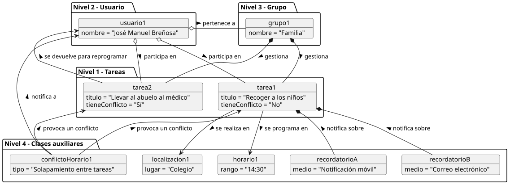
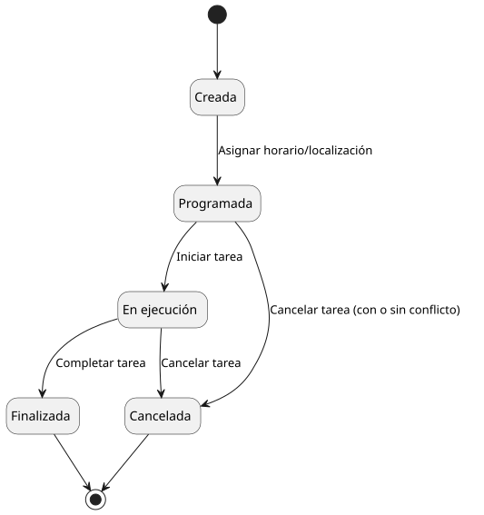

# Modelo del dominio

Artefactos conceptuales de SdR sobre las entidades principales de Breñotask,
organizados por tipo de diagrama.

## Secciones

- [mdd](./mdd/README.md): modelo del dominio principal.
- [diagrama-objetos](./diagrama-objetos/README.md): ejemplos de objetos y relaciones.
- [diagrama-estados](./diagrama-estados/README.md): estados de entidades relevantes.

## Vista rapida

### Modelo del dominio

Codigo fuente: [modelo-dominio.puml](./mdd/modelo-dominio.puml)

### Diagrama de objetos

Codigo fuente: [diagrama-objetos.puml](./diagrama-objetos/diagrama-objetos.puml)

### Diagrama de estados

Codigo fuente: [diagrama-estados-tarea.puml](./diagrama-estados/diagrama-estados-tarea.puml)
