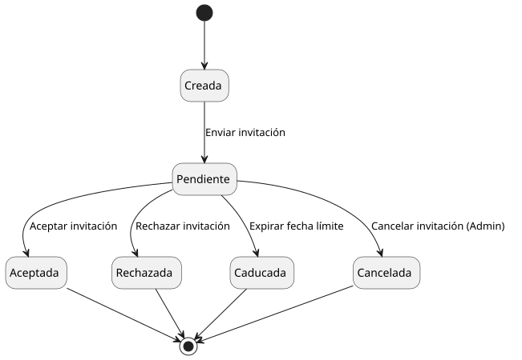
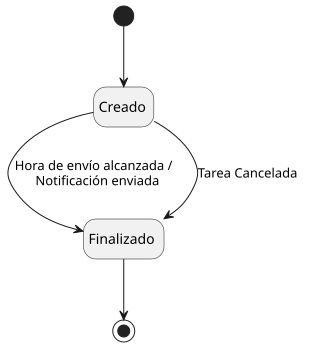
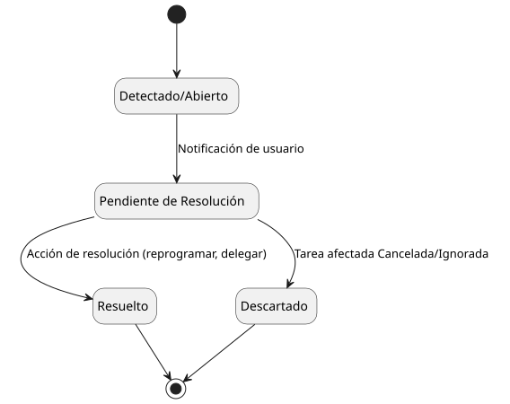

# Diagrama de estados

Diagramas de estados trasladados desde SdR para entidades con ciclo de vida
propio.

## Tarea

Codigo fuente: [diagrama-estados-tarea.puml](./diagrama-estados-tarea.puml)

## Invitacion

Codigo fuente: [diagrama-estados-invitacion.puml](./diagrama-estados-invitacion.puml)

## Recordatorio

Codigo fuente: [diagrama-estados-recordatorio.puml](./diagrama-estados-recordatorio.puml)

## Conflicto horario

Codigo fuente: [diagrama-estados-conflicto-horario.puml](./diagrama-estados-conflicto-horario.puml)
