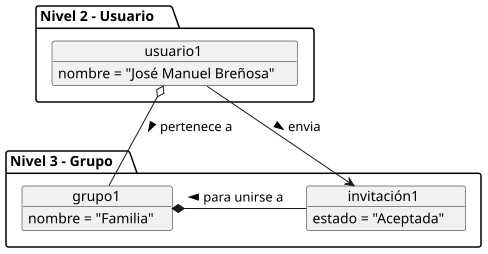
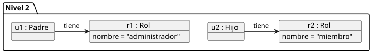

# Diagrama de objetos

Diagramas de objetos trasladados desde SdR para ilustrar instancias y relaciones
del modelo del dominio.

## General

Codigo fuente: [diagrama-objetos.puml](./diagrama-objetos.puml)

## Invitacion

Codigo fuente: [diagrama-objetos-invitacion.puml](./diagrama-objetos-invitacion.puml)

## Rol

Codigo fuente: [diagrama-objetos-rol.puml](./diagrama-objetos-rol.puml)
