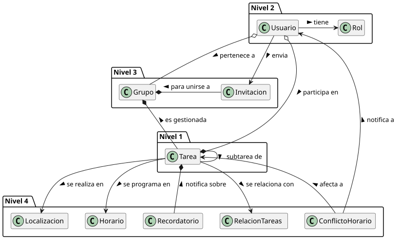

# MDD

Modelo del dominio principal de Breñotask trasladado desde SdR.

## Artefactos

- [modelo-dominio.svg](./modelo-dominio.svg)
- [modelo-dominio.puml](./modelo-dominio.puml)
- [modelo-dominio.md](./modelo-dominio.md)
