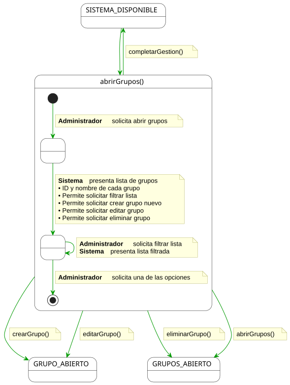
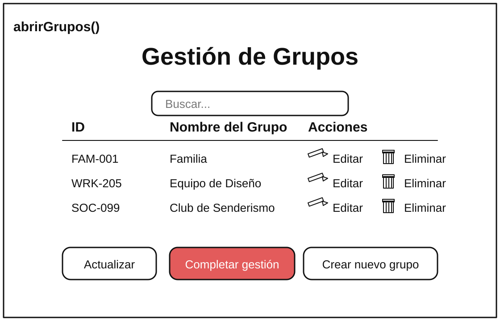

# abrirGrupos() -> Detalle y Prototipado

## Diagrama de Actividad
### Administrador

||
|-|
|Código fuente: [abrirGruposAdmin.puml](./especificacion.puml)|

 
## Prototipado

||
|-|
|[abrirGruposPrototipado.svg](./prototipo.svg)|

