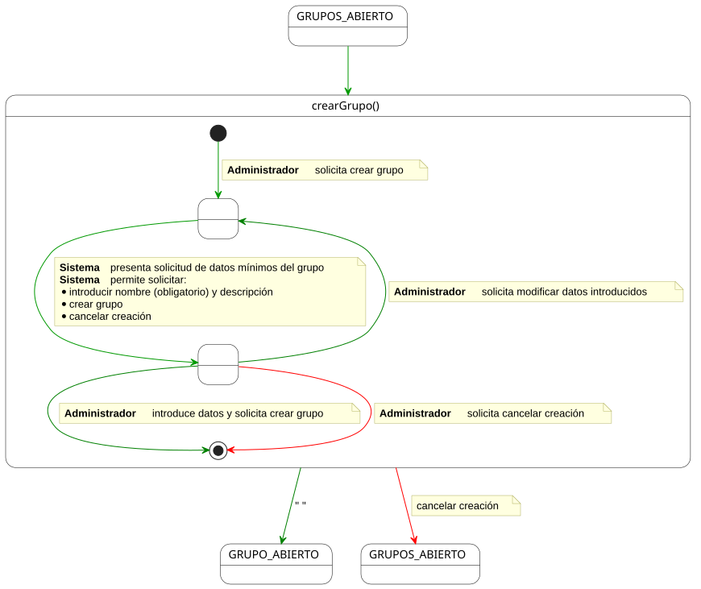
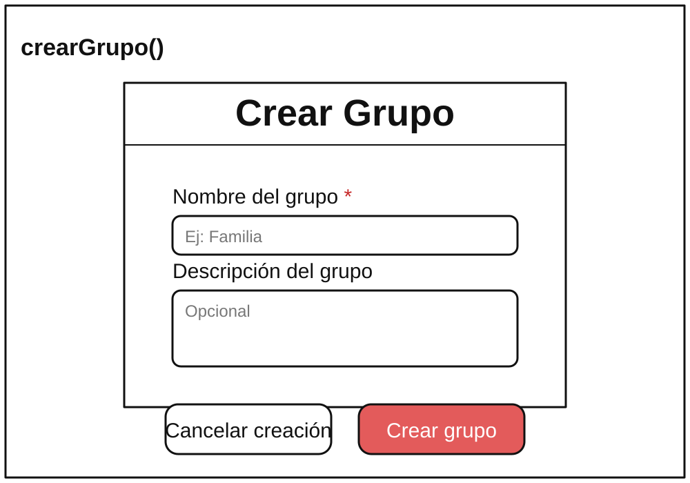

# crearGrupo() -> Detalle y Prototipado

## Diagrama de Actividad
### Administrador

||
|-|
|Código fuente: [crearGrupo.puml](./especificacion.puml)|

## Prototipado

[prototipo.svg](./prototipo.svg)

