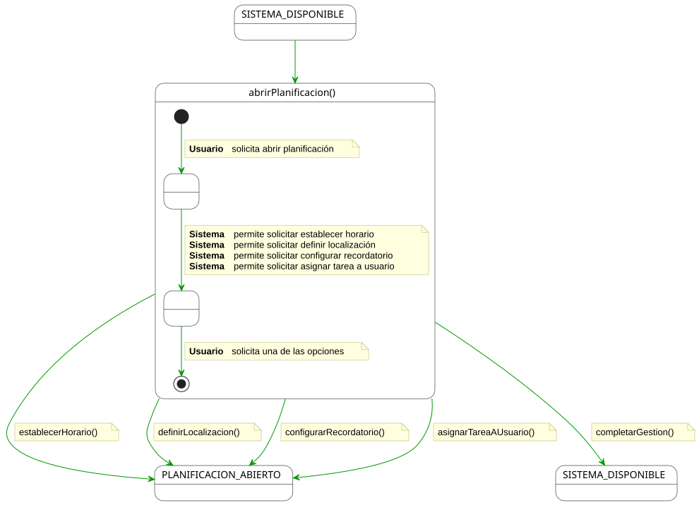
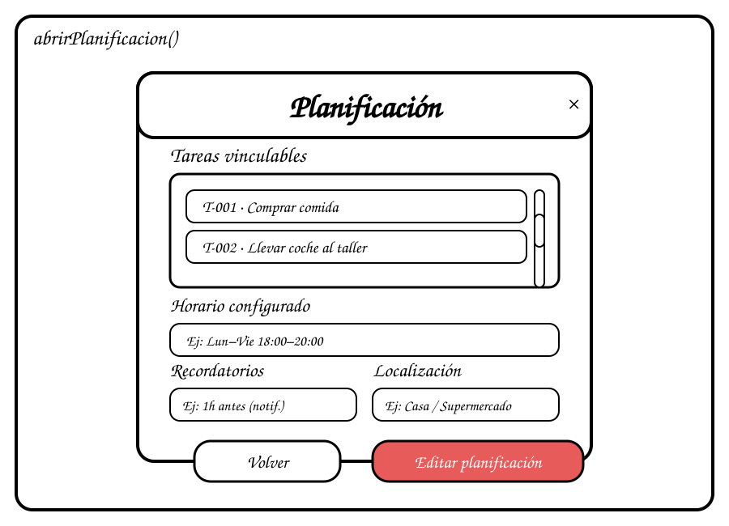

# abrirPlanificacion() -> Detalle y Prototipado

## Diagrama de Actividad

||
|-|
|Código fuente: [abrirPlanificacion.puml](./especificacion.puml)|

## Prototipado

[prototipo.svg](./prototipo.svg)

