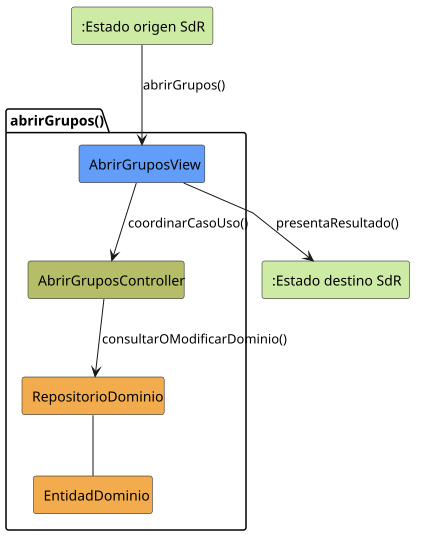
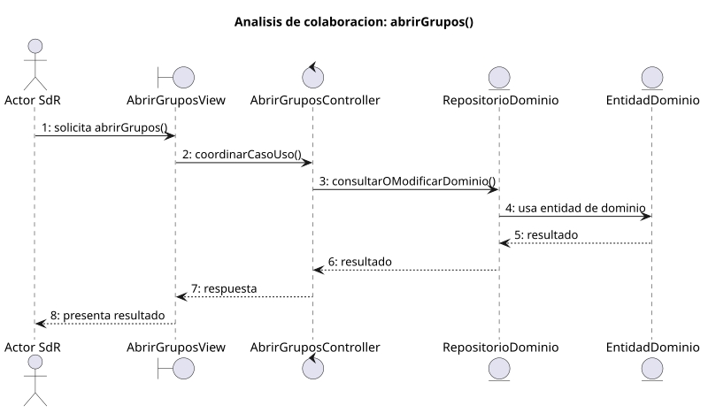

# abrirGrupos()

## Objetivo

Permitir que un usuario con permisos acceda desde `SISTEMA_DISPONIBLE` a la
gestion de grupos. El caso presenta la lista de grupos disponibles y sirve como
punto de entrada para crear, editar, eliminar o filtrar grupos.

## Actor principal

`Miembro`, `Miembro Administrador` o `Administrador`. El diagrama general
asigna `abrirGrupos()` al `Miembro`, mientras que los diagramas de contexto
solo dibujan la gestión administrativa. Para integrar ambas vistas, cualquier
usuario autenticado podrá consultar sus grupos y las mutaciones dependerán de
sus permisos.

## Precondiciones

- El usuario ha iniciado sesion.
- El sistema esta en `SISTEMA_DISPONIBLE`.
- El usuario pertenece a algún grupo o puede recibir una lista vacía.
- Existen datos de grupos que el sistema puede cargar o, al menos, una vista
  preparada para mostrar una lista vacia.

## Flujo principal

1. El usuario solicita abrir la gestion de grupos.
2. El sistema entra en el caso de uso `abrirGrupos()`.
3. El sistema presenta la lista de grupos con identificador y nombre.
4. El usuario puede filtrar la lista o seleccionar una accion relacionada.
5. El sistema permite volver mediante `completarGestion()` y, si el perfil
   tiene permisos, continuar hacia crear, editar o eliminar grupo.

## Flujos alternativos

- Usuario no autenticado: el sistema no debe abrir la gestion y debe mantener o
  redirigir a `SESION_CERRADA`.
- Usuario sin permisos: el sistema debe impedir el acceso a la gestion de
  grupos.
- Fallo al cargar grupos: el sistema debe informar del error y evitar mostrar
  datos incompletos como si fueran validos.
- Sin grupos disponibles: el sistema muestra la lista vacia y mantiene la
  posibilidad de crear un grupo si el perfil lo permite.
- Filtro sin resultados: el sistema presenta una lista filtrada vacia sin salir
  de `GRUPOS_ABIERTO`.

## Postcondiciones

El sistema queda en `GRUPOS_ABIERTO` con la lista de grupos visible o filtrada.
Desde ese estado el usuario puede iniciar operaciones de gestion de grupos o
volver a `SISTEMA_DISPONIBLE`.

## Elementos relacionados en SdR

- `documents/actoresYCasosDeUso/README.md`: enumera `abrirGrupos()` dentro de
  gestion de grupos y usuarios.
- `documents/actoresYCasosDeUso/detalladoYPrototipado/gestionDeGruposYUsuarios/README.md`:
  agrupa `abrirGrupos()` con los casos de uso de grupos.
- `documents/actoresYCasosDeUso/detalladoYPrototipado/gestionDeGruposYUsuarios/abrirGrupos/abrirGrupos.md`:
  presenta el caso de uso y enlaza su diagrama y prototipo.
- `documents/actoresYCasosDeUso/detalladoYPrototipado/gestionDeGruposYUsuarios/abrirGrupos/abrirGrupos.puml`:
  define el flujo principal, el filtrado y las salidas hacia otros casos de uso.
- `documents/actoresYCasosDeUso/detalladoYPrototipado/gestionDeGruposYUsuarios/abrirGrupos/abrirGrupos.svg`:
  version visual del flujo.
- `documents/actoresYCasosDeUso/detalladoYPrototipado/gestionDeGruposYUsuarios/abrirGrupos/abrirGruposPrototipado.svg`:
  prototipo asociado a la pantalla de grupos.
- `documents/actoresYCasosDeUso/diagramas/diagramaOrganizacionYGrupos/diagramaOrganizacionYGrupos.puml`:
  relaciona `abrirGrupos()` con la familia de organizacion y grupos.
- `documents/actoresYCasosDeUso/diagramaContexto/diagramaContextoAdmin.puml`:
  muestra la transicion `SISTEMA_DISPONIBLE -> GRUPOS_ABIERTO` mediante
  `abrirGrupos()`.
- `documents/actoresYCasosDeUso/diagramaContexto/diagramaContextoMiembroAdmin.puml`:
  confirma el acceso a `GRUPOS_ABIERTO` para el miembro administrador.
- `documents/modelosUML/modeloDeDominio/diagramaClases/diagramaClases.md`:
  describe `Grupo`, `Usuario` y `Rol`, que justifican la gestion de grupos y
  permisos.

No se ha localizado una implementacion directa en codigo dentro de SdR; el caso
de uso se ha inferido a partir de la documentacion, diagramas de actividad,
prototipos, diagramas de contexto y modelo de dominio.

## Diagramas de análisis

### Colaboración

Código fuente: [colaboracion.puml](./colaboracion.puml)

### Secuencia

Código fuente: [secuencia.puml](./secuencia.puml)

## Observaciones

SdR no alinea el diagrama general con los diagramas de contexto. Para diseño se
adopta una lista de grupos propios visible para cualquier usuario autenticado,
con acciones administrativas visibles solo para quien tenga permisos.
