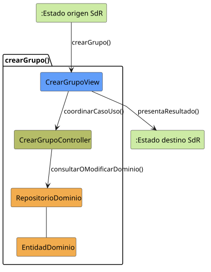
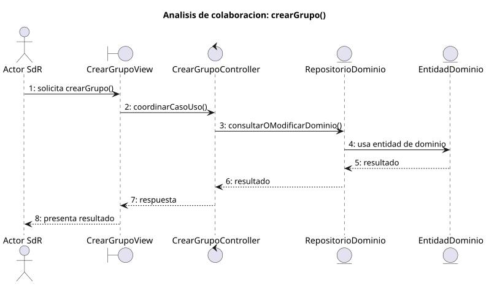

# crearGrupo()

## Objetivo

Permitir que el `Administrador` cree un nuevo grupo desde la gestion de grupos.
El caso recoge los datos minimos del grupo, valida la accion y deja abierto el
grupo creado para continuar su configuracion.

## Actor principal

`Administrador`.

## Precondiciones

- El usuario ha iniciado sesion.
- El sistema esta en `GRUPOS_ABIERTO`.
- El usuario tiene rol de `Administrador`.
- El sistema puede presentar el formulario de creacion de grupo.

## Flujo principal

1. El administrador solicita crear un grupo.
2. El sistema muestra la solicitud de datos minimos del grupo.
3. El administrador introduce el nombre obligatorio y, opcionalmente, una
   descripcion.
4. El administrador solicita crear el grupo.
5. El sistema guarda el nuevo grupo.
6. El sistema pasa a `GRUPO_ABIERTO`.

## Flujos alternativos

- Usuario no autenticado: el sistema no debe permitir la creacion y debe
  mantener o redirigir a `SESION_CERRADA`.
- Usuario sin permisos: el sistema impide crear el grupo porque la accion queda
  asociada al `Administrador`.
- Nombre vacio: el sistema debe impedir la creacion hasta introducir el nombre
  obligatorio.
- Datos invalidos: el sistema debe mostrar el error y permitir corregir los
  datos introducidos.
- Fallo al guardar: el sistema informa del problema y no debe dejar el grupo
  como creado.
- Cancelacion: el administrador cancela la creacion y el sistema vuelve a
  `GRUPOS_ABIERTO`.

## Postcondiciones

Si el proceso termina correctamente, queda creado un nuevo grupo y el sistema
queda en `GRUPO_ABIERTO`. Si se cancela o falla, no se crea el grupo y el
sistema permanece o vuelve a `GRUPOS_ABIERTO`.

## Elementos relacionados en SdR

- `documents/actoresYCasosDeUso/README.md`: enumera `crearGrupo()` dentro de
  gestion de grupos y usuarios y define que el `Administrador` puede crear
  grupos.
- `documents/actoresYCasosDeUso/detalladoYPrototipado/gestionDeGruposYUsuarios/README.md`:
  agrupa `crearGrupo()` con los casos de uso de grupos.
- `documents/actoresYCasosDeUso/detalladoYPrototipado/gestionDeGruposYUsuarios/crearGrupo/crearGrupo.md`:
  presenta el caso de uso y enlaza su diagrama.
- `documents/actoresYCasosDeUso/detalladoYPrototipado/gestionDeGruposYUsuarios/crearGrupo/crearGrupo.puml`:
  define el flujo desde `GRUPOS_ABIERTO`, los datos minimos, la modificacion de
  datos, la creacion y la cancelacion.
- `documents/actoresYCasosDeUso/detalladoYPrototipado/gestionDeGruposYUsuarios/crearGrupo/crearGrupo.svg`:
  version visual del flujo.
- `documents/actoresYCasosDeUso/detalladoYPrototipado/gestionDeGruposYUsuarios/crearGrupo/crearGrupoPrototipado.svg`:
  prototipo asociado a la pantalla de creacion.
- `documents/actoresYCasosDeUso/diagramas/diagramaOrganizacionYGrupos/diagramaOrganizacionYGrupos.puml`:
  relaciona `crearGrupo()` con el actor `Administrador`.
- `documents/actoresYCasosDeUso/diagramaContexto/diagramaContextoAdmin.puml`:
  muestra la transicion `GRUPOS_ABIERTO -> GRUPO_ABIERTO` mediante
  `crearGrupo()`.
- `documents/modelosUML/modeloDeDominio/diagramaClases/diagramaClases.md`:
  describe `Grupo`, `Usuario` y `Rol`, que justifican la existencia del grupo y
  los permisos de creacion.

No se ha localizado una implementacion directa en codigo dentro de SdR; el caso
de uso se ha inferido a partir de la documentacion, diagramas de actividad,
prototipos, diagramas de contexto y modelo de dominio.

## Diagramas de análisis

### Colaboración

Código fuente: [colaboracion.puml](./colaboracion.puml)

### Secuencia

Código fuente: [secuencia.puml](./secuencia.puml)

## Observaciones

SdR indica que el nombre es obligatorio y la descripcion opcional, pero no
precisa reglas como longitud maxima, nombres duplicados o mensajes de error.
