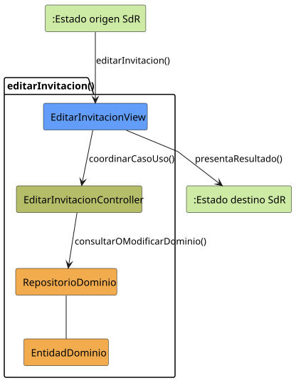

# editarInvitacion()

## Objetivo

Permitir que un miembro consulte una invitación concreta y cambie su estado
aceptándola o rechazándola. El caso completa la gestión iniciada desde la lista
de invitaciones y deja registrada la decisión del usuario.

## Actor principal

`Miembro`.

SdR sitúa este caso en el flujo operativo del miembro, ya que la acción consiste
en validar una invitación recibida o asociada al propio usuario.

## Precondiciones

- El usuario ha iniciado sesión.
- El sistema está en `INVITACIONES_ABIERTO` o `INVITACION_ABIERTO`.
- Existe una invitación seleccionada.
- La invitación pertenece o está dirigida al miembro que intenta gestionarla.
- La invitación se encuentra en un estado que permite decisión, preferiblemente
  `Pendiente`.

## Flujo principal

1. El miembro solicita editar una invitación desde la lista o desde el detalle.
2. El sistema muestra los datos actuales de la invitación.
3. El sistema permite cambiar el estado a aceptar o rechazar.
4. El miembro selecciona la decisión correspondiente.
5. El miembro solicita guardar los cambios.
6. El sistema registra el nuevo estado de la invitación.
7. El sistema queda en `INVITACION_ABIERTO`.

## Flujos alternativos

- Usuario no autenticado: el sistema bloquea la gestión y solicita iniciar
  sesión.
- Invitación inexistente: el sistema informa de que la invitación ya no está
  disponible y debe actualizar la lista.
- Falta de permisos: el sistema impide modificar una invitación que no
  corresponde al miembro.
- Invitación ya aceptada o rechazada: el sistema no debería permitir volver a
  cambiar su decisión si el estado ya es final.
- Invitación cancelada o caducada: el sistema debe mostrarla como no editable.
- Fallo al guardar: se conserva el estado anterior y se informa del error.
- Cancelación desde el detalle: no se aplican cambios y se mantiene
  `INVITACION_ABIERTO`.
- Cancelación desde la lista: no se aplican cambios y se vuelve a
  `INVITACIONES_ABIERTO`.

## Postcondiciones

Si el caso termina correctamente, la invitación queda actualizada como
`Aceptada` o `Rechazada` y el sistema mantiene visible el detalle en
`INVITACION_ABIERTO`. Si se cancela o falla el guardado, no cambia el estado de
la invitación.

## Elementos relacionados en SdR

- Caso detallado `editarInvitacion()`: muestra la visualización de datos, el
  cambio de estado aceptar/rechazar, el guardado y la cancelación.
- Diagrama de contexto de miembro: sitúa la entrada desde
  `INVITACIONES_ABIERTO` o `INVITACION_ABIERTO` y confirma que el resultado
  vuelve a `INVITACION_ABIERTO`.
- Diagrama de organización y grupos: asigna el caso al actor `Miembro`.
- Modelo de estados de invitación: justifica que la decisión normal parte de
  `Pendiente` y termina en `Aceptada` o `Rechazada`.
- Modelo de dominio de invitación: vincula la invitación con usuario y grupo,
  lo que justifica las comprobaciones de pertenencia y permisos.

El análisis se obtiene de los diagramas y documentación del SdR.

## Diagramas de análisis

### Colaboración

Código fuente: [colaboracion.puml](./colaboracion.puml)

### Secuencia

Código fuente: [secuencia.puml](./secuencia.puml)

## Observaciones

SdR permite cambiar el estado a aceptar o rechazar, pero no explicita si una
invitación ya resuelta puede modificarse. Como criterio de diseño, solo las
invitaciones `Pendiente` deberían ser editables por el miembro; los estados
`Aceptada`, `Rechazada`, `Cancelada` y `Caducada` deberían tratarse como
finales.
