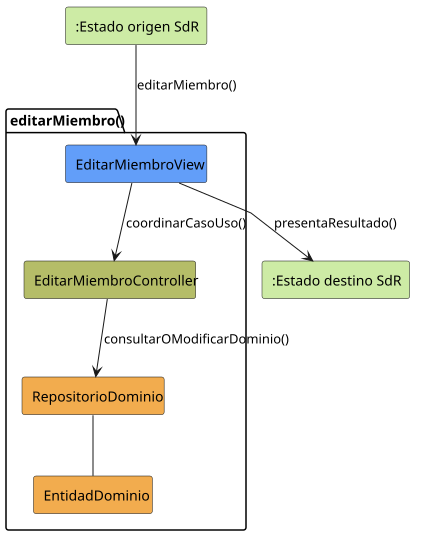

# editarMiembro()

## Objetivo
Permite modificar los datos de gestion de un miembro dentro de un grupo, especialmente su rol o permisos. El caso de uso sirve para mantener actualizada la organizacion interna del grupo sin salir del contexto de gestion de miembros.

## Actor principal
Miembro Administrador o Administrador.

## Precondiciones
- El usuario ha iniciado sesion.
- Existe un grupo abierto o seleccionado.
- Existe un miembro concreto sobre el que se quiere actuar.
- El actor tiene permisos para gestionar miembros del grupo.
- El sistema puede cargar los datos actuales del miembro, incluido su rol.

## Flujo principal
1. El actor solicita editar un miembro desde la gestion del grupo o desde la ficha del miembro.
2. El sistema muestra los datos actuales del miembro.
3. El actor introduce cambios en el rol o en los permisos.
4. El actor confirma la operacion guardando los cambios.
5. El sistema valida los datos introducidos.
6. El sistema registra la modificacion y vuelve al estado de miembro abierto.

## Flujos alternativos
- Usuario no autenticado: el sistema no permite editar miembros y debe pedir autenticacion.
- Grupo inexistente o no disponible: no se puede abrir la edicion porque falta el contexto del grupo.
- Miembro inexistente: el sistema informa de que el miembro ya no esta disponible o no pertenece al grupo.
- Falta de permisos: el actor puede ver el grupo, pero no modificar roles o permisos de otros miembros.
- Rol o permisos invalidos: el sistema rechaza los cambios antes de guardarlos.
- Fallo al guardar: se conserva la informacion anterior del miembro y se informa del error.
- Cancelacion desde la ficha del miembro: no se modifica nada y se mantiene el estado `MIEMBRO_ABIERTO`.
- Cancelacion desde la gestion del grupo: no se modifica nada y se vuelve al estado `GRUPO_ABIERTO`.

## Postcondiciones
Si el caso termina correctamente, el miembro queda actualizado con el rol o permisos indicados y el sistema queda situado en `MIEMBRO_ABIERTO`. Si se cancela o falla la validacion, no se aplican cambios sobre el miembro.

## Elementos relacionados en SdR
- `documents/actoresYCasosDeUso/detalladoYPrototipado/gestionDeGruposYUsuarios/editarMiembro/editarMiembro.md`
- `documents/actoresYCasosDeUso/detalladoYPrototipado/gestionDeGruposYUsuarios/editarMiembro/editarMiembro.puml`
- `documents/actoresYCasosDeUso/diagramaContexto/diagramaContextoAdmin.puml`
- `documents/actoresYCasosDeUso/diagramaContexto/diagramaContextoMiembroAdmin.puml`
- `documents/actoresYCasosDeUso/diagramaContexto/README.md`
- `documents/actoresYCasosDeUso/diagramas/diagramaOrganizacionYGrupos/diagramaOrganizacionYGrupos.puml`
- `documents/modelosUML/modeloDeDominio/diagramaObjetos/diagramaObjetosRol.puml`
- `documents/modelosUML/modeloDeDominio/diagramaClases/diagramaClases.md`

El analisis se ha inferido a partir de diagramas de actividad, diagramas de contexto, descripcion de roles y modelo de dominio del repositorio SdR.

## Diagramas de análisis

### Colaboración

Código fuente: [colaboracion.puml](./colaboracion.puml)

### Secuencia

Código fuente: [secuencia.puml](./secuencia.puml)

## Observaciones
Para el primer diseño se conservarán los roles `Administrador`, `Miembro
Administrador` y `Miembro`, asociados a la pertenencia `MiembroGrupo`. Así un
cambio dentro de un grupo no filtrará permisos a los demás. No se permitirá
retirar el último miembro capaz de administrarlo.
