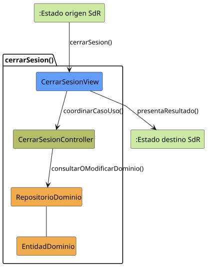

# cerrarSesion()

## Objetivo

Permitir que un usuario autenticado finalice su sesion y vuelva al estado
`SESION_CERRADA`. Sirve para abandonar de forma controlada el sistema y cerrar
el acceso a los modulos internos.

## Actor principal

`Usuario`, representado en SdR por los perfiles `Administrador`, `Miembro
Administrador` y `Miembro`.

## Precondiciones

- El sistema esta en estado `SISTEMA_DISPONIBLE`.
- El usuario ha iniciado sesion previamente.
- El usuario solicita cerrar la sesion actual.
- El sistema puede mostrar una confirmacion antes de cerrar.

## Flujo principal

1. El usuario solicita cerrar sesion.
2. El sistema muestra una solicitud de confirmacion.
3. El usuario confirma el cierre.
4. El sistema finaliza la sesion.
5. El sistema pasa a `SESION_CERRADA`.

## Flujos alternativos

- Cancelacion: el usuario cancela el cierre y permanece en
  `SISTEMA_DISPONIBLE`.
- Sesion ya expirada: el sistema deberia redirigir directamente a
  `SESION_CERRADA`.
- Usuario no autenticado: el cierre no aplica y el sistema deberia mantenerse o
  redirigir al estado `SESION_CERRADA`.
- Fallo al cerrar la sesion: el sistema deberia informar del error y evitar
  dejar una sesion en estado ambiguo.

## Postcondiciones

La sesion del usuario queda cerrada y el sistema vuelve a `SESION_CERRADA`. El
usuario deja de tener acceso a los modulos internos hasta ejecutar de nuevo
`iniciarSesion()`.

## Elementos relacionados en SdR

- `documents/actoresYCasosDeUso/README.md`: enumera `cerrarSesion()` dentro de
  gestion de sesion y navegacion.
- `documents/actoresYCasosDeUso/detalladoYPrototipado/gestionDeSesionYNavegacion/README.md`:
  agrupa `cerrarSesion()` junto a los casos de uso de sesion.
- `documents/actoresYCasosDeUso/detalladoYPrototipado/gestionDeSesionYNavegacion/cerrarSesion/cerrarSesion.puml`:
  define el flujo principal, la confirmacion y la cancelacion del cierre.
- `documents/actoresYCasosDeUso/detalladoYPrototipado/gestionDeSesionYNavegacion/cerrarSesion/cerrarSesion.md`:
  presenta el caso de uso y enlaza su diagrama.
- `documents/actoresYCasosDeUso/detalladoYPrototipado/gestionDeSesionYNavegacion/cerrarSesion/cerrarSesion.svg`:
  version visual del flujo de cierre.
- `documents/actoresYCasosDeUso/detalladoYPrototipado/gestionDeSesionYNavegacion/cerrarSesion/cerrarSesionPrototipado.svg`:
  prototipo asociado a la confirmacion de cierre.
- `documents/actoresYCasosDeUso/diagramas/diagramaGestionSesionYNavegacion/diagramaGestionSesionYNavegacion.puml`:
  relaciona `cerrarSesion()` con los actores de sesion.
- `documents/actoresYCasosDeUso/diagramaContexto/diagramaContextoAdmin.puml`:
  define la transicion `SISTEMA_DISPONIBLE -> SESION_CERRADA`.
- `documents/actoresYCasosDeUso/diagramaContexto/diagramaContextoMiembroAdmin.puml`:
  confirma el cierre de sesion para el miembro administrador.
- `documents/actoresYCasosDeUso/diagramaContexto/diagramaContextoMiembro.puml`:
  confirma el cierre de sesion para el miembro.
- `documents/actoresYCasosDeUso/diagramaContexto/README.md`: describe
  `SESION_CERRADA` y `SISTEMA_DISPONIBLE` como estados principales de
  navegacion.

No se ha localizado una implementacion directa en codigo dentro de SdR; el caso
de uso se ha inferido a partir de la documentacion, diagramas de actividad,
prototipos y diagramas de contexto.

## Diagramas de análisis

### Colaboración

Código fuente: [colaboracion.puml](./colaboracion.puml)

### Secuencia

Código fuente: [secuencia.puml](./secuencia.puml)

## Observaciones

SdR define correctamente la confirmacion antes del cierre. Como mejora, podria
precisar si al cerrar sesion se descartan cambios no guardados o si el sistema
debe avisar antes de abandonar una gestion en curso.
