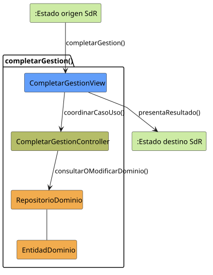
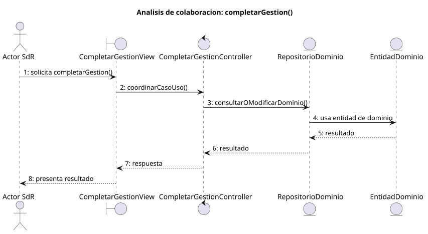

# completarGestion()

## Objetivo

Permitir que el usuario finalice una gestion secundaria y vuelva a la pantalla
principal `SISTEMA_DISPONIBLE`. Actua como mecanismo de retorno comun desde
modulos como tareas, grupos, invitaciones o planificacion.

## Actor principal

`Usuario`, representado en SdR por los perfiles `Administrador`, `Miembro
Administrador` y `Miembro`.

## Precondiciones

- El usuario ha iniciado sesion.
- El sistema se encuentra en un estado secundario de trabajo.
- El usuario ha terminado o quiere abandonar la gestion actual.
- El sistema puede volver a presentar la pantalla principal.

## Flujo principal

1. El usuario solicita completar la gestion.
2. El sistema finaliza el flujo secundario actual.
3. El sistema presenta la pantalla principal.
4. El sistema queda en `SISTEMA_DISPONIBLE`.

## Flujos alternativos

- Gestion incompleta: el sistema deberia avisar si quedan datos sin guardar.
- Datos pendientes: el sistema deberia pedir confirmacion antes de abandonar el
  flujo.
- Fallo de validacion: el sistema deberia impedir completar la gestion hasta
  corregir los datos afectados.
- Cancelacion del proceso: el usuario podria permanecer en el estado actual si
  decide no volver al menu principal.

## Postcondiciones

El usuario vuelve a `SISTEMA_DISPONIBLE`, manteniendo la sesion abierta. La
gestion secundaria queda finalizada o abandonada segun corresponda, y el usuario
puede acceder de nuevo a los modulos principales del sistema.

## Elementos relacionados en SdR

- `documents/actoresYCasosDeUso/README.md`: enumera `completarGestion()` dentro
  de gestion de sesion y navegacion.
- `documents/actoresYCasosDeUso/detalladoYPrototipado/gestionDeSesionYNavegacion/README.md`:
  agrupa `completarGestion()` junto a los casos de uso de sesion.
- `documents/actoresYCasosDeUso/detalladoYPrototipado/gestionDeSesionYNavegacion/completarGestion/completarGestion.puml`:
  define el retorno desde `TAREAS_ABIERTO`, `GRUPOS_ABIERTO` y
  `PLANIFICACION_ABIERTO` hacia `SISTEMA_DISPONIBLE`.
- `documents/actoresYCasosDeUso/detalladoYPrototipado/gestionDeSesionYNavegacion/completarGestion/completarGestion.md`:
  presenta el caso de uso y enlaza su diagrama.
- `documents/actoresYCasosDeUso/detalladoYPrototipado/gestionDeSesionYNavegacion/completarGestion/completarGestion.svg`:
  version visual del flujo.
- `documents/actoresYCasosDeUso/detalladoYPrototipado/gestionDeSesionYNavegacion/completarGestion/completarGestionPrototipado.svg`:
  prototipo asociado al retorno a la pantalla principal.
- `documents/actoresYCasosDeUso/diagramaContexto/diagramaContextoAdmin.puml`:
  muestra `completarGestion()` desde tareas, grupos y planificacion hacia el
  menu.
- `documents/actoresYCasosDeUso/diagramaContexto/diagramaContextoMiembroAdmin.puml`:
  confirma el mismo retorno para miembro administrador.
- `documents/actoresYCasosDeUso/diagramaContexto/diagramaContextoMiembro.puml`:
  muestra el retorno desde tareas e invitaciones hacia el menu.
- `documents/actoresYCasosDeUso/diagramaContexto/README.md`: describe
  `SISTEMA_DISPONIBLE` como hub central y `completarGestion()` como retorno al
  menu.

No se ha localizado una implementacion directa en codigo dentro de SdR; el caso
de uso se ha inferido a partir de la documentacion, diagramas de actividad,
prototipos y diagramas de contexto.

## Diagramas de análisis

### Colaboración

Código fuente: [colaboracion.puml](./colaboracion.puml)

### Secuencia

Código fuente: [secuencia.puml](./secuencia.puml)

## Observaciones

El caso de uso funciona como patron de navegacion comun. Seria conveniente que
SdR precisara si `completarGestion()` guarda automaticamente, descarta cambios o
solo permite salir cuando la gestion actual esta validada.
