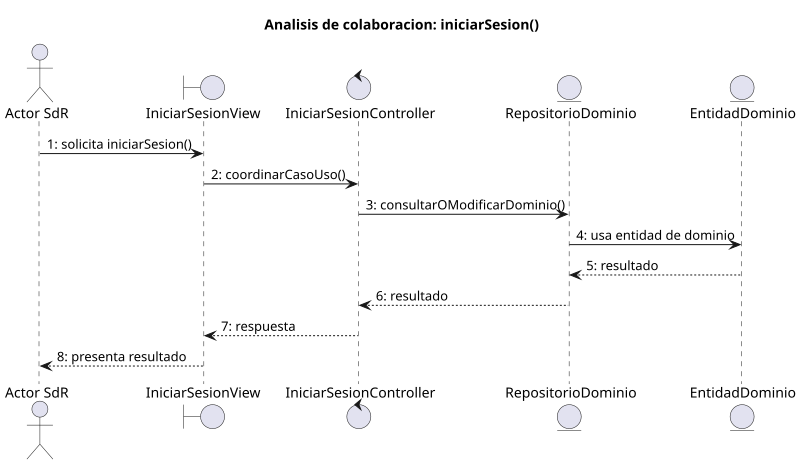

# iniciarSesion()

## Objetivo

Permitir que un usuario acceda al sistema desde `SESION_CERRADA` hasta
`SISTEMA_DISPONIBLE` mediante credenciales. Es el punto de entrada comun antes
de usar los modulos de tareas, grupos, planificacion o invitaciones.

## Actor principal

`Usuario`, representado en SdR por los perfiles `Administrador`, `Miembro
Administrador` y `Miembro`.

## Precondiciones

- El sistema esta en estado `SESION_CERRADA`.
- El usuario quiere acceder al sistema.
- El usuario dispone de email y contrasena.
- El sistema puede presentar el formulario de inicio de sesion.

## Flujo principal

1. El usuario solicita iniciar sesion.
2. El sistema muestra el formulario de inicio de sesion.
3. El usuario introduce email y contrasena.
4. El usuario confirma el inicio.
5. El sistema valida las credenciales.
6. El sistema permite el acceso y pasa a `SISTEMA_DISPONIBLE`.

## Flujos alternativos

- Credenciales incorrectas: el sistema comunica el error y permite volver al
  formulario.
- Campos vacios: el sistema debe impedir la confirmacion hasta completar los
  datos requeridos.
- Usuario no registrado: el sistema debe informar de que no puede iniciar
  sesion con esas credenciales.
- Cancelacion: el usuario cancela el proceso y el sistema permanece en
  `SESION_CERRADA`.

## Postcondiciones

El usuario queda autenticado y el sistema queda en `SISTEMA_DISPONIBLE`, desde
donde puede acceder a las funciones permitidas por su perfil. Si el proceso se
cancela o falla, el sistema continua en `SESION_CERRADA`.

## Elementos relacionados en SdR

- `documents/actoresYCasosDeUso/README.md`: enumera `iniciarSesion()` dentro de
  gestion de sesion y navegacion, y define los actores principales.
- `documents/actoresYCasosDeUso/detalladoYPrototipado/gestionDeSesionYNavegacion/iniciarSesion/iniciarSesion.puml`:
  describe el flujo principal, el error de credenciales y la cancelacion.
- `documents/actoresYCasosDeUso/detalladoYPrototipado/gestionDeSesionYNavegacion/iniciarSesion/iniciarSesion.md`:
  presenta el caso de uso y enlaza su diagrama.
- `documents/actoresYCasosDeUso/detalladoYPrototipado/gestionDeSesionYNavegacion/iniciarSesion/iniciarSesion.svg`:
  version visual del flujo.
- `documents/actoresYCasosDeUso/detalladoYPrototipado/gestionDeSesionYNavegacion/iniciarSesion/iniciarSesionPrototipado.svg`:
  prototipo asociado al inicio de sesion.
- `documents/actoresYCasosDeUso/diagramas/diagramaGestionSesionYNavegacion/diagramaGestionSesionYNavegacion.puml`:
  relaciona `iniciarSesion()` con los actores de sesion.
- `documents/actoresYCasosDeUso/diagramaContexto/diagramaContextoAdmin.puml`:
  define la transicion `SESION_CERRADA -> SISTEMA_DISPONIBLE`.
- `documents/actoresYCasosDeUso/diagramaContexto/diagramaContextoMiembro.puml`:
  confirma que el miembro tambien accede mediante `iniciarSesion()`.
- `documents/modelosUML/modeloDeDominio/diagramaClases/diagramaClases.puml`:
  aporta las clases `Usuario` y `Rol`, necesarias para entender la
  autenticacion y permisos.

## Diagramas de análisis

### Colaboración

Código fuente: [colaboracion.puml](./colaboracion.puml)

### Secuencia

Código fuente: [secuencia.puml](./secuencia.puml)

## Observaciones

El caso esta bien situado como puerta de entrada al sistema. Para mantener
coherencia con las invitaciones, el primer diseño utilizará email normalizado y
único como identificador. Queda por concretar el texto exacto de los errores.
