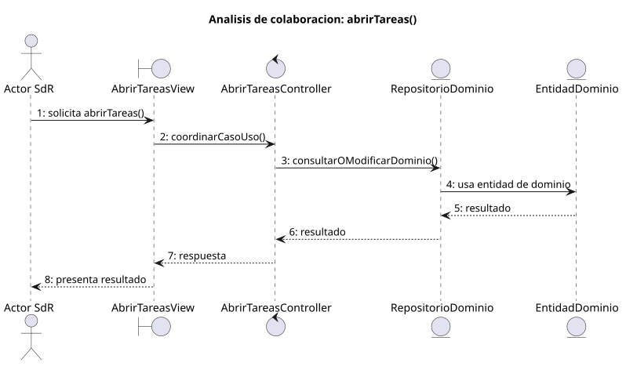

# abrirTareas()

## Objetivo

Permitir que el usuario consulte la lista de tareas disponible para su perfil
y contexto de grupo. El caso funciona como entrada a la gestión operativa de
tareas: filtrar, abrir una tarea, crearla, editarla, eliminarla o marcarla como
completada según permisos.

## Actor principal

`Miembro`, porque SdR le permite consultar tareas y marcar tareas como
completadas. `Administrador` y `Miembro Administrador` amplían ese uso con
acciones de gestión como crear, editar o eliminar tareas.

## Precondiciones

- El usuario ha iniciado sesión.
- El sistema está en `SISTEMA_DISPONIBLE`, `TAREAS_ABIERTO` o
  `GRUPO_ABIERTO`.
- El usuario pertenece al grupo o tiene permisos sobre las tareas que intenta
  consultar.
- El sistema puede cargar al menos identificador, título y estado de cada
  tarea.

## Flujo principal

1. El usuario solicita abrir tareas.
2. El sistema carga las tareas visibles para el usuario y su contexto.
3. El sistema muestra la lista con identificador, título y estado.
4. El usuario puede filtrar la lista.
5. El usuario selecciona una tarea o una acción disponible.
6. El sistema permite continuar hacia crear, editar, eliminar, marcar como
   completada o volver mediante `completarGestion()`.

## Flujos alternativos

- Usuario no autenticado: el sistema bloquea el acceso y solicita iniciar
  sesión.
- Usuario sin permisos: el sistema no muestra tareas fuera de su grupo o rol.
- Grupo no seleccionado: si el acceso requiere contexto de grupo, el sistema
  debe pedir seleccionarlo o volver a `SISTEMA_DISPONIBLE`.
- Fallo al cargar tareas: el sistema informa del error y evita mostrar una
  lista incompleta como válida.
- Sin tareas disponibles: el sistema muestra la lista vacía y mantiene
  `TAREAS_ABIERTO`.
- Filtro sin resultados: el sistema muestra una lista filtrada vacía y permite
  cambiar el filtro.

## Postcondiciones

El sistema queda en `TAREAS_ABIERTO` con la lista de tareas visible o filtrada.
Desde ahí el usuario puede abrir una tarea concreta, iniciar una acción
permitida por su rol o volver a `SISTEMA_DISPONIBLE`.

## Elementos relacionados en SdR

- Caso detallado `abrirTareas()`: define la lista con identificador, título y
  estado, el filtrado y las salidas hacia crear, editar, eliminar, marcar como
  completada o completar la gestión.
- Diagramas de contexto de administrador, miembro administrador y miembro:
  sitúan `TAREAS_ABIERTO` como estado accesible desde `SISTEMA_DISPONIBLE` y
  como retorno desde `TAREA_ABIERTO`.
- Diagrama de gestión de tareas: diferencia entre consultar tareas, permitido
  al `Miembro`, y gestionar tareas, reservado a perfiles administradores.
- Modelo de dominio de tareas: justifica que `Tarea` pertenece a un grupo,
  afecta a usuarios y se complementa con horario, localización, recordatorios,
  relaciones y conflictos.
- Diagrama de estados de tarea: aporta estados útiles para la lista, como
  `Creada`, `Programada`, `En ejecución`, `Finalizada` y `Cancelada`.

El análisis se obtiene de los diagramas y documentación del SdR.

## Diagramas de análisis

### Colaboración

Código fuente: [colaboracion.puml](./colaboracion.puml)

### Secuencia

Código fuente: [secuencia.puml](./secuencia.puml)

## Observaciones

El PUML de `abrirTareas()` en SdR contiene marcadores de conflicto de merge en
las transiciones de entrada y salida. Para la futura implementación se tomará
la navegación de los diagramas de contexto como referencia operativa hasta que
ese artefacto quede corregido en SdR.
