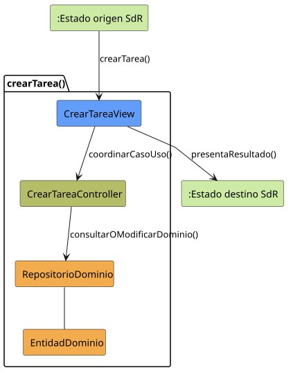

# crearTarea()

## Objetivo

Permitir que un perfil con permisos registre una nueva tarea dentro de un
grupo. El caso recoge sus datos iniciales, valida el horario y deja abierta la
tarea creada para continuar configurándola.

## Actor principal

`Administrador` o `Miembro Administrador`. El detalle de SdR menciona al
`Administrador`, mientras que el diagrama de gestión de tareas asigna
`crearTarea()` al `Miembro Administrador`, del que hereda el administrador.

## Precondiciones

- El usuario ha iniciado sesión.
- El sistema está en `TAREAS_ABIERTO`.
- El usuario tiene permisos de gestión sobre el grupo.
- Existe un grupo seleccionado al que asociar la tarea.

## Flujo principal

1. El usuario solicita crear una tarea desde la lista.
2. El sistema presenta el formulario de creación.
3. El usuario introduce título, descripción, fecha, hora de inicio y hora de
   fin.
4. El sistema valida los datos y comprueba si existe solapamiento horario.
5. El usuario puede corregir los datos introducidos o solicitar la creación.
6. El sistema registra la tarea dentro del grupo.
7. El sistema abre la tarea creada en `TAREA_ABIERTO`.

## Flujos alternativos

- Usuario no autenticado: el sistema bloquea la operación y solicita iniciar
  sesión.
- Usuario sin permisos: el sistema impide crear tareas en el grupo.
- Grupo no seleccionado: el sistema solicita seleccionar un grupo antes de
  crear la tarea.
- Datos obligatorios incompletos: el sistema no guarda la tarea hasta que
  existan al menos título, fecha, hora de inicio y hora de fin.
- Horario inválido: si la hora de inicio no es anterior a la hora de fin, el
  sistema solicita corregir el intervalo.
- Conflicto de horario: si existe solapamiento, el sistema registra o notifica
  el conflicto al usuario afectado, pero no bloquea la creación de la tarea.
- Fallo al guardar: el sistema informa del error y conserva los datos para
  permitir reintentar.
- Cancelación: el sistema descarta los datos introducidos y vuelve a
  `TAREAS_ABIERTO`.

## Postcondiciones

La tarea queda registrada dentro del grupo, visible en `TAREA_ABIERTO` y en
estado `Programada`, porque el horario válido es obligatorio al guardar. Sus
datos quedan disponibles para continuar con la configuración de asignaciones,
localización, relaciones o recordatorios.

## Elementos relacionados en SdR

- Caso detallado `crearTarea()`: define la entrada desde `TAREAS_ABIERTO`, el
  formulario, la modificación de datos y las salidas por creación o
  cancelación.
- Prototipo de `crearTarea()`: muestra los campos de código o identificador,
  título y descripción.
- Diagramas de contexto de administrador y miembro administrador: sitúan la
  creación desde `TAREAS_ABIERTO` y la salida correcta en `TAREA_ABIERTO`.
- Diagrama de gestión de tareas: asigna `crearTarea()` a perfiles
  administradores.
- Segunda reunión de requisitos: concreta que hora de inicio y hora de fin son
  obligatorias al crear y que un conflicto horario genera notificación.
- Modelo de dominio y estados de tarea: relacionan la tarea con grupo, horario,
  localización, usuarios y estado.

El análisis se obtiene de los diagramas y documentación del SdR.

## Diagramas de análisis

### Colaboración

Código fuente: [colaboracion.puml](./colaboracion.puml)

### Secuencia

Código fuente: [secuencia.puml](./secuencia.puml)

## Observaciones

El detalle y el prototipo de `crearTarea()` no reflejan todavía la aclaración
posterior sobre el horario obligatorio. Para la futura implementación se
exigirán hora de inicio y hora de fin, se validará que inicio sea anterior a
fin y la tarea persistida quedará `Programada`. Los conflictos se comprobarán
para los usuarios que ya estén asignados y se reevaluarán cuando cambien las
asignaciones; nunca bloquearán la creación.
