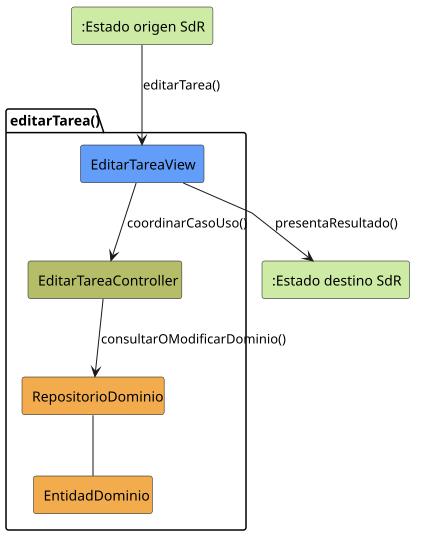

# editarTarea()

## Objetivo

Permitir que un perfil con permisos consulte y actualice una tarea existente.
El caso coordina la edición de sus datos base y el acceso a operaciones
relacionadas como asignación, horario, localización, recordatorios o relaciones.

## Actor principal

`Administrador` o `Miembro Administrador`. El detalle de SdR menciona al
`Administrador`, mientras que el diagrama de gestión de tareas asigna
`editarTarea()` al `Miembro Administrador`, del que hereda el administrador.

## Precondiciones

- El usuario ha iniciado sesión.
- El sistema está en `TAREAS_ABIERTO` o `TAREA_ABIERTO`.
- Existe una tarea seleccionada.
- El usuario tiene permisos de gestión sobre el grupo al que pertenece la
  tarea.

## Flujo principal

1. El usuario solicita editar una tarea.
2. El sistema presenta sus datos actuales: nombre, descripción, usuarios
   asignados, horario, localización, recordatorios, estado y relaciones.
3. El usuario modifica nombre o descripción, o solicita una operación
   relacionada.
4. El sistema aplica la operación y vuelve a mostrar los datos actualizados.
5. El usuario puede realizar más modificaciones o solicitar guardar y salir.
6. El sistema valida los datos y recalcula posibles conflictos horarios.
7. El sistema registra los cambios y mantiene `TAREA_ABIERTO`.

## Flujos alternativos

- Usuario no autenticado: el sistema bloquea la operación y solicita iniciar
  sesión.
- Tarea inexistente: el sistema informa del error y vuelve a la lista
  `TAREAS_ABIERTO`.
- Usuario sin permisos: el sistema impide modificar una tarea fuera de su
  ámbito de gestión.
- Datos inválidos: el sistema solicita corregir los campos antes de guardar.
- Horario inválido: si la hora de inicio no es anterior a la hora de fin, el
  sistema solicita corregir el intervalo.
- Conflicto de horario: el sistema registra o actualiza el conflicto del
  usuario afectado y genera el aviso correspondiente, pero no bloquea el
  guardado de cambios válidos.
- Fallo al guardar: el sistema informa del error y conserva los datos para
  permitir reintentar.
- Cancelación: el sistema descarta los cambios no guardados y mantiene
  `TAREA_ABIERTO`.

## Postcondiciones

La tarea queda actualizada y visible en `TAREA_ABIERTO`. Si el nuevo horario
genera solapamientos, los conflictos y avisos correspondientes quedan
registrados de forma paralela al ciclo de vida de la tarea.

## Elementos relacionados en SdR

- Caso detallado `editarTarea()`: presenta los datos actuales, las operaciones
  relacionadas, el bucle de modificaciones, la validación y las salidas por
  guardado o cancelación.
- Prototipo de `editarTarea()`: muestra código, título, descripción, usuarios
  asignados, horario, localización y recordatorios.
- Diagramas de contexto de administrador y miembro administrador: permiten
  editar desde `TAREAS_ABIERTO` o desde `TAREA_ABIERTO`.
- Diagrama de gestión de tareas: asigna la edición a perfiles administradores
  y relaciona `editarTarea()` con asignación, horario, localización,
  recordatorios, relaciones, conflictos y marcado como completada.
- Aclaraciones de la segunda reunión: establecen que el conflicto pertenece al
  usuario, no bloquea las tareas y es independiente de su ciclo de vida.
- Modelo de dominio y estados de conflicto horario: justifican registrar el
  conflicto como componente paralelo con resolución propia.

El análisis se obtiene de los diagramas y documentación del SdR.

## Diagramas de análisis

### Colaboración

Código fuente: [colaboracion.puml](./colaboracion.puml)

### Secuencia

Código fuente: [secuencia.puml](./secuencia.puml)

## Observaciones

El PUML de `editarTarea()` devuelve a edición cuando detecta un conflicto, pero
la aclaración posterior indica que el conflicto no debe bloquear el avance de
la tarea. Para la futura implementación prevalecerá la aclaración posterior:
los cambios válidos se guardarán y el conflicto se registrará para notificación
y resolución independiente.
