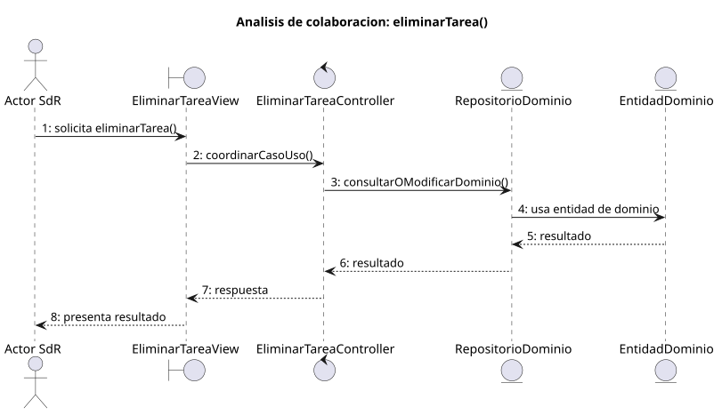

# eliminarTarea()

## Objetivo

Permitir que un perfil con permisos elimine de forma irreversible una tarea
existente. El caso solicita confirmación y, si se trata de una tarea padre,
incluye sus subtareas descendientes.

## Actor principal

`Administrador` o `Miembro Administrador`. El detalle de SdR menciona al
`Administrador`, mientras que el diagrama de gestión de tareas asigna
`eliminarTarea()` al `Miembro Administrador`, del que hereda el administrador.

## Precondiciones

- El usuario ha iniciado sesión.
- El sistema está en `TAREA_ABIERTO`.
- Existe una tarea abierta para eliminar.
- El usuario tiene permisos de gestión sobre la tarea.
- El sistema puede advertir si la eliminación afecta a subtareas.

## Flujo principal

1. El usuario solicita eliminar la tarea abierta.
2. El sistema presenta una solicitud de confirmación.
3. Si la tarea contiene subtareas, el sistema advierte de la eliminación en
   cascada.
4. El usuario confirma la operación.
5. El sistema elimina la tarea y sus subtareas descendientes.
6. El sistema retira las referencias asociadas que hayan dejado de ser
   válidas.
7. El sistema vuelve a la lista `TAREAS_ABIERTO`.

## Flujos alternativos

- Usuario no autenticado: el sistema bloquea la operación y solicita iniciar
  sesión.
- Usuario sin permisos: el sistema impide borrar la tarea.
- Tarea inexistente: el sistema informa del error y vuelve a
  `TAREAS_ABIERTO`.
- Cancelación: el sistema conserva la tarea y mantiene `TAREA_ABIERTO`.
- Fallo al borrar: el sistema informa del error y conserva la tarea sin
  aplicar una eliminación parcial.

## Postcondiciones

La tarea y sus subtareas descendientes dejan de estar disponibles. Las tareas
hermanas se conservan y la lista `TAREAS_ABIERTO` queda actualizada. También se
retiran las relaciones y datos auxiliares exclusivos que ya no sean válidos.

## Elementos relacionados en SdR

- Caso detallado y prototipo de `eliminarTarea()`: definen la confirmación, la
  cancelación y el carácter irreversible de la operación.
- Diagrama de actividad de `eliminarTarea()`: parte de `TAREA_ABIERTO`, vuelve
  a `TAREAS_ABIERTO` al confirmar y mantiene `TAREA_ABIERTO` al cancelar.
- Diagramas de contexto de administrador y miembro administrador: incluyen la
  eliminación dentro de la gestión de tareas.
- Diagrama de gestión de tareas: asigna el caso a perfiles administradores.
- Aclaraciones de la segunda reunión: establecen la eliminación en cascada de
  subtareas descendientes y la conservación de las tareas hermanas.
- Modelo de dominio: representa la jerarquía recursiva `subtarea de` y los
  datos auxiliares asociados a una tarea.

No hay implementación directa en código; el análisis se obtiene de los
diagramas, el prototipo y la documentación del SdR.

## Diagramas de análisis

### Colaboración

Código fuente: [colaboracion.puml](./colaboracion.puml)

### Secuencia

Código fuente: [secuencia.puml](./secuencia.puml)

## Observaciones

SdR modela además el estado `Cancelada`. Para la futura implementación se
tratará como un concepto distinto: cancelar una tarea conservará su registro y
eliminarla lo retirará de forma irreversible. Los conflictos se revisarán como
componente independiente del usuario, no se borrarán en cascada sin evaluar si
siguen siendo relevantes.
