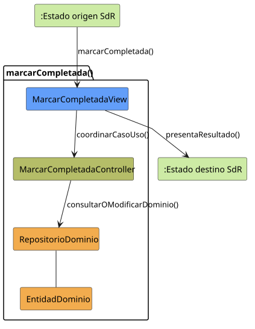

# marcarCompletada()

## Objetivo

Permitir que un usuario confirme la realización de una tarea asignada. El caso
actualiza su estado a `Finalizada`, registra la fecha de cierre y mantiene
visible la lista de tareas.

## Actor principal

`Miembro` asignado a la tarea o habilitado por el modo
`CUALQUIERA_DEL_GRUPO`. Los perfiles `Miembro Administrador` y `Administrador`
heredan esta capacidad y pueden aplicarla dentro de su ámbito de gestión.

## Precondiciones

- El usuario ha iniciado sesión.
- El sistema está en `TAREAS_ABIERTO`.
- Existe una tarea seleccionada.
- El usuario está asignado, pertenece al grupo de una tarea abierta a
  `CUALQUIERA_DEL_GRUPO` o tiene permisos de gestión sobre ella.
- La tarea está en estado `En ejecución`.
- Si es una tarea padre, no tiene subtareas descendientes pendientes.

## Flujo principal

1. El usuario solicita marcar una tarea como completada.
2. El sistema comprueba que la tarea admite la transición a `Finalizada`.
3. El sistema presenta una solicitud de confirmación.
4. El usuario confirma la finalización.
5. El sistema actualiza el estado de la tarea a `Finalizada`.
6. El sistema registra la fecha actual como fecha de finalización.
7. El sistema actualiza la lista y mantiene `TAREAS_ABIERTO`.

## Flujos alternativos

- Usuario no autenticado: el sistema bloquea la operación y solicita iniciar
  sesión.
- Usuario sin permisos: el sistema impide completar una tarea ajena.
- Tarea inexistente: el sistema informa del error y actualiza la lista.
- Estado incompatible: si la tarea no está `En ejecución`, el sistema no
  aplica la transición.
- Tarea ya finalizada: el sistema mantiene el estado y evita registrar de nuevo
  la finalización.
- Subtareas pendientes: el sistema impide finalizar la tarea padre hasta que
  sus descendientes queden resueltos.
- Cancelación: el sistema conserva el estado anterior y mantiene
  `TAREAS_ABIERTO`.
- Fallo al actualizar: el sistema informa del error y conserva el estado
  anterior.

## Postcondiciones

La tarea queda en estado `Finalizada` con su fecha de finalización registrada.
La lista `TAREAS_ABIERTO` muestra el nuevo estado. Los recordatorios aún
vigentes dejan de generar avisos, mientras que los conflictos del usuario se
mantienen como información independiente.

## Elementos relacionados en SdR

- Caso detallado y prototipo de `marcarCompletada()`: definen la confirmación,
  el registro de la fecha actual y el retorno a `TAREAS_ABIERTO`.
- Caso detallado `abrirTareas()`: incluye la acción de marcar una tarea como
  completada desde la lista.
- Diagramas de contexto: modelan `marcarCompletada()` como operación
  autorreflexiva sobre `TAREAS_ABIERTO`.
- Diagrama de gestión de tareas: asigna el caso al `Miembro`, con herencia para
  perfiles administradores, y lo relaciona con la edición de tarea.
- Diagrama de estados de tarea: define la transición de `En ejecución` a
  `Finalizada`.
- Aclaraciones de la segunda reunión: establecen que los conflictos pertenecen
  al usuario y pueden persistir aunque una tarea esté finalizada.

No hay implementación directa en código; el análisis se obtiene de los
diagramas, el prototipo y la documentación del SdR.

## Diagramas de análisis

### Colaboración

Código fuente: [colaboracion.puml](./colaboracion.puml)

### Secuencia

Código fuente: [secuencia.puml](./secuencia.puml)

## Observaciones

SdR no concreta cómo calcular el estado de una tarea padre a partir de sus
subtareas. Para evitar cierres inconsistentes, la futura implementación no
finalizará subtareas en cascada ni permitirá cerrar una tarea padre con
descendientes pendientes. Cuando todas estén resueltas, el padre seguirá
requiriendo confirmación explícita. El paso previo de `Programada` a
`En ejecución` se aplicará al alcanzar la hora de inicio, ya que SdR no define
un caso de uso manual para iniciarlo.
