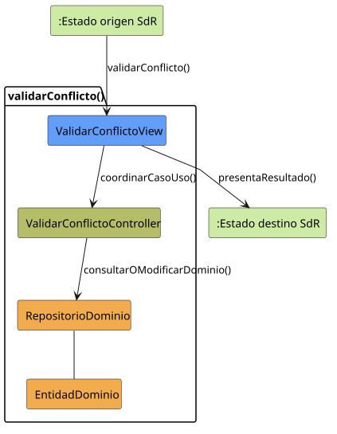

# validarConflicto()

## Objetivo

Detectar solapamientos entre las tareas de un mismo usuario cuando se crea o
modifica su planificación. El caso registra o actualiza el conflicto y genera
el aviso correspondiente sin bloquear el avance de las tareas.

## Actor principal

`Sistema`. La validación se ejecuta automáticamente cuando un perfil con
permisos crea una tarea o modifica su horario o sus asignaciones.

## Precondiciones

- El usuario que origina el cambio ha iniciado sesión.
- Existe una tarea que se está creando o modificando.
- La tarea dispone de hora de inicio y hora de fin.
- La hora de inicio es anterior a la hora de fin.
- El sistema conoce los usuarios afectados por la planificación.

## Flujo principal

1. El sistema recibe la tarea y su intervalo horario válido.
2. El sistema identifica a los usuarios afectados por la tarea.
3. Para cada usuario, compara el intervalo con sus demás tareas planificadas,
   aunque pertenezcan a grupos distintos.
4. Si dos intervalos se solapan durante cualquier periodo positivo, el sistema
   registra o actualiza un `ConflictoHorario`.
5. El sistema asocia el conflicto al usuario y a las tareas implicadas.
6. El sistema genera la notificación para que el usuario pueda resolverlo.
7. El sistema devuelve el resultado de la validación sin bloquear el guardado
   de los cambios válidos.

## Flujos alternativos

- Datos incompletos: el sistema no valida hasta que existan hora de inicio y
  hora de fin.
- Tarea inexistente: el sistema informa del error y no registra conflictos.
- Horario inválido: si el inicio no es anterior al fin, el sistema solicita
  corregir el intervalo antes de continuar.
- Sin conflicto: el sistema confirma que no existe solapamiento y permite
  continuar.
- Conflicto ya registrado: el sistema actualiza el conflicto existente para
  evitar duplicados.
- Fallo al validar: el sistema informa del error y no presenta como válida una
  comprobación incompleta.

## Postcondiciones

La planificación queda comprobada. Si existe solapamiento, el conflicto queda
registrado o actualizado para el usuario afectado y se genera su notificación.
La tarea conserva su ciclo de vida y los cambios válidos pueden guardarse.

## Elementos relacionados en SdR

- `documents/actoresYCasosDeUso/README.md`: incluye `validarConflicto()` en la
  gestión de tareas y enlaza el caso al detalle de `editarTarea()`.
- `documents/actoresYCasosDeUso/diagramas/diagramaGestionTareas/diagramaGestionTareas.puml`:
  modela `validarConflicto()` como inclusión de `editarTarea()`.
- `documents/actoresYCasosDeUso/detalladoYPrototipado/gestionDeTareas/editarTarea/editarTarea.puml`:
  ejecuta `validarConflicto()` antes de guardar y vuelve a edición si detecta
  solapamiento.
- `documents/glosario/segundaReunion/reunion_2.md`: concreta que cualquier
  superposición positiva genera conflicto y una notificación.
- `documents/minutas/segundaReunion/notasTomadas.md`: aclara que el conflicto
  pertenece al usuario, no a la tarea, y no bloquea su ciclo de vida.
- `documents/minutas/primeraReunion/notasTomadas.md`: exige detectar
  solapamientos entre tareas de grupos distintos.
- `documents/modelosUML/modeloDeDominio/diagramaClases/diagramaClases.puml` y
  `documents/modelosUML/modeloDeDominio/diagramaEstados/diagramaEstadosConflictoHorario.puml`:
  representan `ConflictoHorario`, las tareas afectadas, el usuario notificado
  y sus estados.

No hay implementación directa en código ni un detalle independiente para este
caso. El análisis se ha inferido desde la documentación, los diagramas y la
estructura del repositorio SdR. La reutilización al crear
una tarea se infiere de la obligatoriedad del horario y del requisito general
de detectar solapamientos.

## Diagramas de análisis

### Colaboración

Código fuente: [colaboracion.puml](./colaboracion.puml)

### Secuencia

Código fuente: [secuencia.puml](./secuencia.puml)

## Observaciones

El PUML de `editarTarea()` trata el conflicto como impedimento para guardar,
pero la aclaración posterior lo define como componente paralelo del usuario.
Para la futura implementación prevalecerá esta última: un horario inválido sí
bloqueará el guardado; un horario válido con solapamiento generará aviso y
conflicto, pero permitirá continuar.
