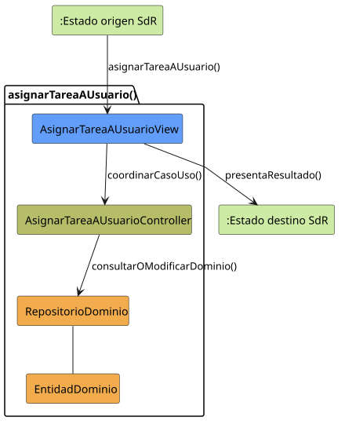

# asignarTareaAUsuario()

## Objetivo

Permitir que un perfil administrador asigne una tarea a uno o varios usuarios
del grupo responsable. La operación actualiza quién debe realizar la tarea y
mantiene abierta la planificación.

## Actor principal

El actor principal es `Miembro Administrador`. El perfil `Administrador`
también puede realizar la operación por herencia de permisos.

## Precondiciones

- El usuario ha iniciado sesión.
- La planificación está abierta en `PLANIFICACION_ABIERTO`.
- El usuario tiene permisos de gestión sobre la tarea.
- La tarea existe y pertenece a un grupo.
- El usuario destinatario existe y pertenece al grupo de la tarea.

## Flujo principal

1. El usuario solicita asignar una tarea.
2. El sistema muestra la tarea seleccionada y el formulario de asignación.
3. El usuario indica el destinatario.
4. El sistema valida la tarea, el destinatario y su pertenencia al grupo.
5. El usuario solicita guardar.
6. El sistema registra o actualiza la asignación.
7. El sistema mantiene abierta la planificación.

## Flujos alternativos

- Si el usuario no ha iniciado sesión, el sistema solicita autenticación sin
  guardar cambios.
- Si el usuario no tiene permisos de gestión, el sistema rechaza la operación.
- Si la tarea no existe, el sistema informa del problema y no registra la
  asignación.
- Si el destinatario no existe o no pertenece al grupo de la tarea, el sistema
  solicita seleccionar otro usuario.
- Si la asignación ya existe, el sistema evita crear un duplicado.
- Si el usuario cancela o falla el guardado, se conservan las asignaciones
  anteriores y continúa abierto `PLANIFICACION_ABIERTO`.

## Postcondiciones

La tarea queda asignada o actualizada con los destinatarios válidos del grupo.
Si cambia la disponibilidad de algún usuario, sus posibles conflictos de
horario deben reevaluarse sin bloquear una asignación válida.

## Elementos relacionados en SdR

- `documents/actoresYCasosDeUso/detalladoYPrototipado/planificacionYConfiguracion/asignarTareaAUsuario/`:
  contiene el detalle, el PUML, el SVG y el prototipo del caso.
- `documents/actoresYCasosDeUso/diagramas/diagramaPlanificaciónYDetalles/diagramaPlanificacionYDetalles.puml`:
  asigna la operación al `Miembro Administrador`, con herencia para
  `Administrador`.
- `documents/actoresYCasosDeUso/diagramaContexto/diagramaContextoAdmin.puml` y
  `documents/actoresYCasosDeUso/diagramaContexto/diagramaContextoMiembroAdmin.puml`:
  modelan la operación como transición autorreflexiva sobre
  `PLANIFICACION_ABIERTO`.
- `documents/actoresYCasosDeUso/detalladoYPrototipado/gestionDeTareas/editarTarea/editarTarea.puml`:
  incluye la asignación entre las operaciones relacionadas con la edición.
- `documents/modelosUML/modeloDeDominio/diagramaClases/diagramaClases.puml`:
  relaciona `Usuario` con `Tarea` y con `Grupo`.
- `documents/minutas/primeraReunion/notasTomadas.md`: indica que las tareas
  pueden ser individuales, compartidas o realizables por cualquiera del grupo.

No existe implementación directa en código. El caso de uso se ha inferido
exclusivamente desde los artefactos de SdR indicados.

## Diagramas de análisis

### Colaboración

Código fuente: [colaboracion.puml](./colaboracion.puml)

### Secuencia

Código fuente: [secuencia.puml](./secuencia.puml)

## Observaciones

El prototipo solo muestra un destinatario, pero las minutas admiten varios o
cualquiera del grupo. Para diseño se usarán asignaciones múltiples y un modo
`CUALQUIERA_DEL_GRUPO`, sin crear un usuario ficticio. Los conflictos solo se
evaluarán para destinatarios concretos.
