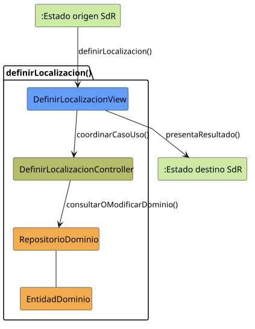
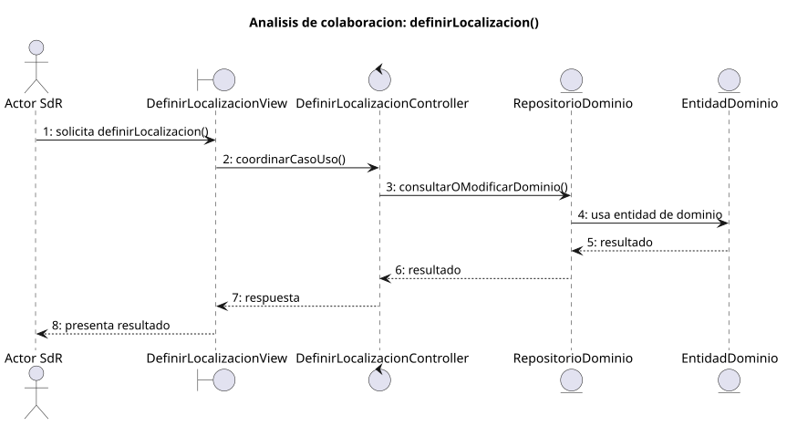

# definirLocalizacion()

## Objetivo

Permitir que un perfil con permisos defina o modifique el lugar asociado a una
tarea. El sistema valida la ubicación antes de guardarla y mantiene abierto el
módulo de planificación.

## Actor principal

`Miembro Administrador` o `Administrador`. El detalle de SdR utiliza el término
genérico `Usuario`, pero el diagrama de planificación asigna esta operación a
perfiles con permisos de gestión.

## Precondiciones

- El usuario ha iniciado sesión.
- El sistema está en `PLANIFICACION_ABIERTO`.
- El usuario tiene permisos para gestionar la planificación.
- Existe una tarea sobre la que definir o modificar la localización.

## Flujo principal

1. El usuario solicita definir la localización de una tarea.
2. El sistema presenta el campo de ubicación.
3. El usuario introduce o modifica la localización.
4. El sistema valida la localización indicada.
5. El usuario solicita guardar.
6. El sistema registra la localización y mantiene `PLANIFICACION_ABIERTO`.

## Flujos alternativos

- Usuario no autenticado: el sistema impide la operación y solicita iniciar
  sesión.
- Usuario sin permisos: el sistema no permite modificar la localización.
- Tarea inexistente: el sistema informa del error y mantiene la planificación.
- Localización incompleta o inválida: el sistema solicita corregir la
  ubicación antes de guardar.
- Cancelación: el sistema descarta los cambios y mantiene
  `PLANIFICACION_ABIERTO`.
- Fallo al guardar: el sistema informa del error y conserva la localización
  anterior.

## Postcondiciones

La localización válida queda definida o actualizada para la tarea y la
planificación permanece visible en `PLANIFICACION_ABIERTO`.

## Elementos relacionados en SdR

- `documents/actoresYCasosDeUso/README.md`: enumera `definirLocalizacion()`
  dentro de planificación y configuración.
- `documents/actoresYCasosDeUso/detalladoYPrototipado/planificacionYConfiguracion/definirLocalizacion/`:
  contiene el detalle, el PUML, el SVG y el prototipo del caso.
- `documents/actoresYCasosDeUso/diagramas/diagramaPlanificaciónYDetalles/diagramaPlanificacionYDetalles.puml`:
  asigna la operación al `Miembro Administrador`, con herencia para
  `Administrador`.
- `documents/actoresYCasosDeUso/diagramaContexto/diagramaContextoAdmin.puml` y
  `documents/actoresYCasosDeUso/diagramaContexto/diagramaContextoMiembroAdmin.puml`:
  modelan `definirLocalizacion()` como transición autorreflexiva sobre
  `PLANIFICACION_ABIERTO`.
- `documents/modelosUML/modeloDeDominio/diagramaClases/diagramaClases.puml`:
  relaciona `Tarea` con `Localizacion`.
- `documents/minutas/primeraReunion/notasTomadas.md`: menciona la ubicación de
  las tareas.

No se ha localizado implementación directa en código. El análisis se ha
inferido desde la documentación, los diagramas y la estructura del repositorio
SdR.

## Diagramas de análisis

### Colaboración

Código fuente: [colaboracion.puml](./colaboracion.puml)

### Secuencia

Código fuente: [secuencia.puml](./secuencia.puml)

## Observaciones

Para el primer diseño, `Localizacion` será un texto opcional asociado a la
tarea. La optimización por proximidad geográfica, la integración con mapas y el
cálculo de rutas quedan expresamente fuera del alcance de este proyecto.
