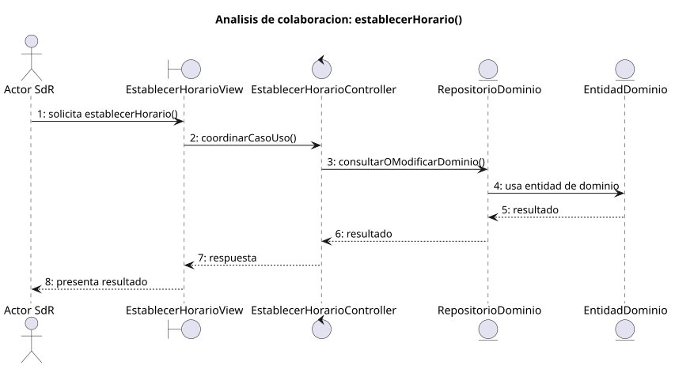

# establecerHorario()

## Objetivo

Permitir que un perfil con permisos defina o modifique el intervalo horario de
una tarea. El sistema valida los datos y comprueba la disponibilidad antes de
guardar, manteniendo la planificación abierta.

## Actor principal

`Miembro Administrador` o `Administrador`. El detalle de SdR utiliza el término
genérico `Usuario`, pero el diagrama de planificación asigna esta operación a
perfiles con permisos de gestión.

## Precondiciones

- El usuario ha iniciado sesión.
- El sistema está en `PLANIFICACION_ABIERTO`.
- El usuario tiene permisos para gestionar la planificación.
- Existe una tarea sobre la que establecer o modificar el horario.
- El sistema puede consultar la disponibilidad de los usuarios asignados.

## Flujo principal

1. El usuario solicita establecer el horario de una tarea.
2. El sistema presenta el calendario de disponibilidad.
3. El usuario introduce la fecha, la hora de inicio y la hora de fin.
4. El sistema comprueba que el intervalo es válido.
5. El sistema valida posibles solapamientos con otras tareas de los usuarios
   asignados.
6. El usuario solicita guardar.
7. El sistema registra el horario y mantiene `PLANIFICACION_ABIERTO`.

## Flujos alternativos

- Usuario no autenticado: el sistema impide la operación y solicita iniciar
  sesión.
- Usuario sin permisos: el sistema no permite modificar el horario.
- Tarea inexistente: el sistema informa del error y mantiene la planificación.
- Datos incompletos: el sistema solicita introducir fecha, inicio y fin.
- Horario inválido: si el inicio no es anterior al fin, el sistema solicita
  corregir el intervalo antes de guardar.
- Conflicto con otra tarea: el sistema registra o actualiza el conflicto y
  genera la notificación correspondiente sin bloquear el horario válido.
- Cancelación: el sistema descarta los cambios y mantiene
  `PLANIFICACION_ABIERTO`.
- Fallo al guardar: el sistema informa del error y conserva el horario
  anterior.

## Postcondiciones

El horario válido queda definido o actualizado para la tarea y la planificación
permanece visible en `PLANIFICACION_ABIERTO`. Si existe solapamiento, el
conflicto queda registrado de forma paralela para el usuario afectado.

## Elementos relacionados en SdR

- `documents/actoresYCasosDeUso/README.md`: enumera `establecerHorario()`
  dentro de planificación y configuración.
- `documents/actoresYCasosDeUso/detalladoYPrototipado/planificacionYConfiguracion/establecerHorario/`:
  contiene el detalle, el PUML, el SVG y el prototipo del caso.
- `documents/actoresYCasosDeUso/diagramas/diagramaPlanificaciónYDetalles/diagramaPlanificacionYDetalles.puml`:
  asigna la operación al `Miembro Administrador`, con herencia para
  `Administrador`.
- `documents/actoresYCasosDeUso/diagramaContexto/diagramaContextoAdmin.puml` y
  `documents/actoresYCasosDeUso/diagramaContexto/diagramaContextoMiembroAdmin.puml`:
  modelan `establecerHorario()` como transición autorreflexiva sobre
  `PLANIFICACION_ABIERTO`.
- `documents/glosario/segundaReunion/reunion_2.md` y
  `documents/minutas/segundaReunion/notasTomadas.md`: exigen inicio y fin,
  validan que el inicio sea anterior y definen el tratamiento del conflicto.
- `documents/modelosUML/modeloDeDominio/diagramaClases/diagramaClases.puml`:
  relaciona `Tarea` con `Horario` y `ConflictoHorario`.

No se ha localizado implementación directa en código. El análisis se ha
inferido desde la documentación, los diagramas y la estructura del repositorio
SdR.

## Diagramas de análisis

### Colaboración

Código fuente: [colaboracion.puml](./colaboracion.puml)

### Secuencia

Código fuente: [secuencia.puml](./secuencia.puml)

## Observaciones

El prototipo solo muestra `Fecha` y `Hora`, pero la aclaración posterior exige
inicio y fin. Para el primer diseño solo se admitirán intervalos cerrados con
fecha, inicio y fin. Los horarios flexibles o repetitivos quedan fuera del
primer incremento.
