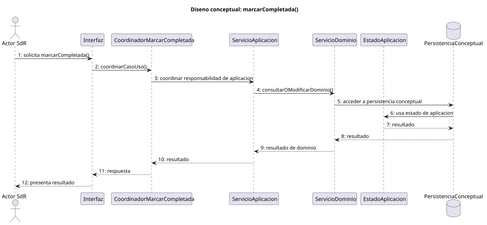
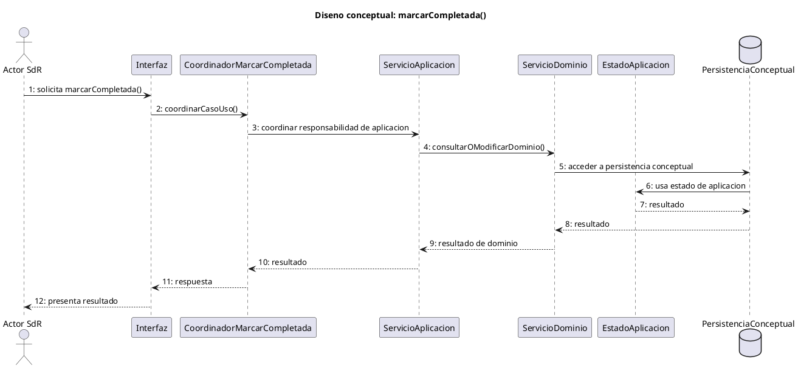

# marcarCompletada() > Diseno

## Informacion del artefacto

| Campo | Valor |
| --- | --- |
| Proyecto | BrenoTask |
| Fase RUP | Elaboracion |
| Disciplina | Diseno |
| Version | 1.1 |
| Autor | Equipo de desarrollo |
| Caso de uso relacionado | marcarCompletada() |
| Modulo funcional | Gestion de tareas |

## Proposito

Documentar el diseno conceptual de marcarCompletada() manteniendo trazabilidad directa con los diagramas de analisis. Este artefacto no introduce entidades concretas, ramas alternativas ni validaciones que no esten representadas en el analisis del caso.

## Participantes de diseno

| Participante | Tipo | Responsabilidad |
| --- | --- | --- |
| Actor SdR | Actor | Inicia el caso de uso y recibe el resultado. |
| Interfaz | Limite conceptual | Recibe la solicitud y presenta la respuesta. |
| CoordinadorMarcarCompletada | Control | Coordina el caso de uso y delega en servicios conceptuales. |
| ServicioAplicacion | Aplicacion | Ordena la responsabilidad de aplicacion sin fijar tecnologia. |
| ServicioDominio | Dominio | Representa la consulta o modificacion del dominio indicada por analisis. |
| PersistenciaConceptual | Persistencia conceptual | Representa el acceso conceptual a persistencia sin concretar repositorios reales. |
| EstadoAplicacion | Estado | Representa el estado de aplicacion usado como soporte conceptual. |

## Decisiones de diseno

- Se conserva el orden de interaccion definido por la secuencia de analisis.
- Se mantiene la separacion entre limite, control y dominio indicada por la colaboracion de analisis.
- No se modelan ramas `alt/else` porque el analisis solo fija el flujo principal.
- No se anclan entidades concretas si no aparecen como colaboraciones del analisis.
- El detalle de validaciones, permisos, almacenamiento y reglas concretas queda para especificaciones auxiliares o implementacion.

## Flujo de diseno

1. Actor SdR solicita marcarCompletada() en la interfaz.
2. Interfaz delega la coordinacion del caso de uso.
3. CoordinadorMarcarCompletada coordina la responsabilidad de aplicacion.
4. ServicioAplicacion consulta o modifica el dominio mediante ServicioDominio.
5. ServicioDominio accede a PersistenciaConceptual.
6. PersistenciaConceptual usa EstadoAplicacion como soporte conceptual.
7. EstadoAplicacion devuelve resultado.
8. PersistenciaConceptual devuelve resultado al dominio.
9. ServicioDominio devuelve resultado de dominio.
10. ServicioAplicacion devuelve resultado al coordinador.
11. CoordinadorMarcarCompletada devuelve respuesta a la interfaz.
12. Interfaz presenta resultado al Actor SdR.

## Estados afectados

- Estado origen SdR.
- Estado destino SdR.
- EstadoAplicacion como abstraccion conceptual de soporte en diseno.

## Validaciones

No se detallan validaciones concretas en este diagrama de diseno para mantener la trazabilidad directa con el analisis.

## Excepciones o errores

No se modelan ramas de error en la secuencia de diseno porque el analisis revisado solo establece el flujo principal.

## Resultado esperado

El Actor SdR recibe una respuesta coherente con el resultado conceptual del caso de uso.

## Trazabilidad

| Elemento de analisis usado | Decision de diseno derivada | Elemento de diseno afectado | Estado |
| --- | --- | --- | --- |
| [README de analisis](../../../../01-analisis/casos-uso/gestion-tareas/marcarCompletada/README.md) | Mantener el alcance funcional del caso sin anadir detalles no trazados. | Gestion de tareas | disenado |
| [Diagrama de colaboracion](../../../../01-analisis/casos-uso/gestion-tareas/marcarCompletada/colaboracion.puml) | Preservar la separacion entre vista, control y dominio. | Interfaz, CoordinadorMarcarCompletada, ServicioAplicacion, ServicioDominio | disenado |
| [Secuencia de analisis](../../../../01-analisis/casos-uso/gestion-tareas/marcarCompletada/secuencia.puml) | Preservar el orden principal de interaccion. | secuencia.puml, secuencia.svg | disenado |
| Revision integral de trazabilidad | Retirar ramas y concreciones no presentes en analisis. | PersistenciaConceptual, EstadoAplicacion | revisado |

## PlantUML del flujo de diseno

## Artefactos

- [secuencia.puml](./secuencia.puml)
- [secuencia.svg](./secuencia.svg)