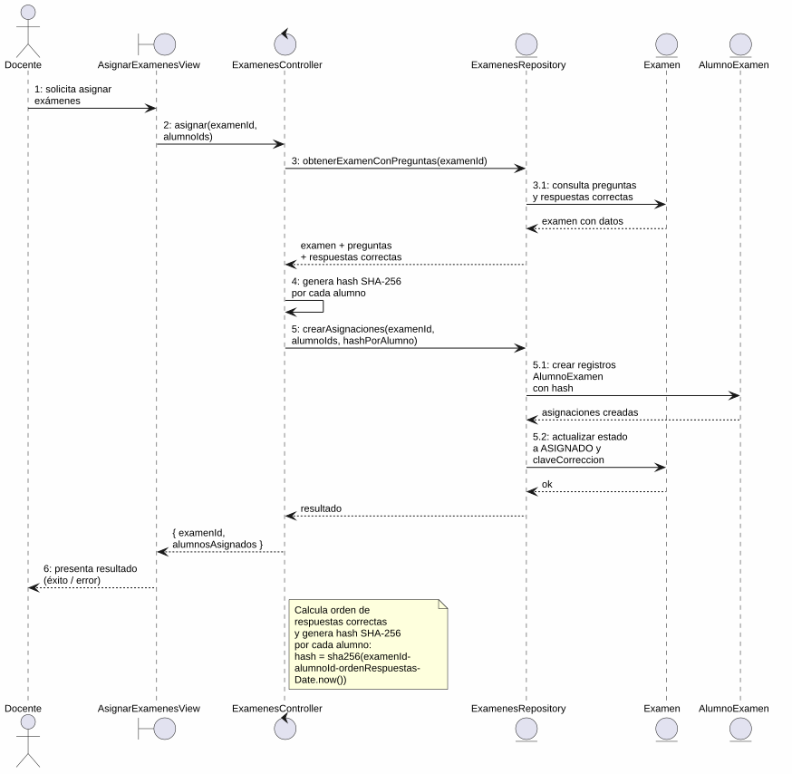
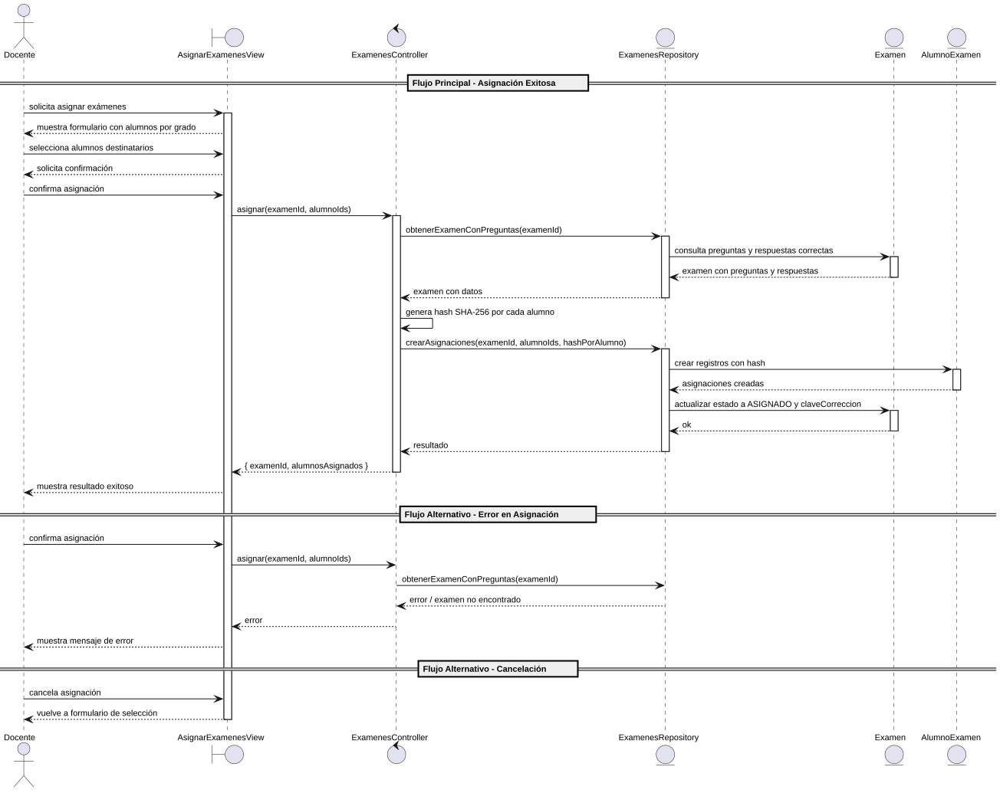

# 25-26-idsw2-sdVC > asignarExamenes > Análisis

## información del artefacto

- **Proyecto**: Sistema de Gestión de Exámenes Universitarios
- **Fase RUP**: Elaboration (Elaboración)
- **Disciplina**: Análisis y Diseño
- **Versión**: 1.0
- **Fecha**: 2026-05-29
- **Autor**: Marcos Gutierrez

## propósito

Análisis de colaboración del caso de uso `asignarExamenes()` mediante el patrón MVC, identificando las clases de análisis, sus responsabilidades y colaboraciones necesarias para cumplir con los requisitos especificados.

## diagrama de colaboración

||
|-|
|Código fuente: [colaboracion.puml](../../../modelosUML/analisis/asignarExamenes/colaboracion.puml)|

## clases de análisis identificadas

### clases de vista (boundary)

#### AsignarExamenesView
**Estereotipo**: Vista (Boundary)
**Responsabilidades**:
- Recibir la solicitud de asignación de exámenes desde el listado de exámenes generados (global o contextual)
- Presentar el listado de alumnos disponibles agrupados por grado, con búsqueda por nombre o DNI
- Permitir al docente seleccionar los alumnos destinatarios de los exámenes
- Mostrar el total de alumnos seleccionados por grado
- Presentar confirmación antes de ejecutar la asignación
- Informar que se generará una clave alfanumérica única por alumno
- Visualizar el resultado final (éxito o error)
- Manejar la navegación de salida y cancelación

**Colaboraciones**:
- **Entrada**: Recibe `asignarExamenes()` desde `EXAMENES_GENERADOS` o `EXAMENES_GENERADOS_CONTEXTUALES`
- **Control**: Se comunica con `ExamenesController`
- **Salida**: Navega a `EXAMENES_ASIGNADOS` o `EXAMENES_ASIGNADOS_CONTEXTUALES`

### clases de control

#### ExamenesController
**Estereotipo**: Control
**Responsabilidades**:
- Coordinar la lógica de asignación de exámenes a alumnos
- Validar los datos de entrada (examenId, alumnoIds)
- Obtener el examen con sus preguntas y respuestas correctas para generar la clave de corrección
- Generar un hash SHA-256 único por cada alumno como clave de verificación
- Crear los registros de asignación (AlumnoExamen) para cada alumno
- Actualizar el estado del examen de `GENERADO` a `ASIGNADO`
- Almacenar la clave de corrección (orden de respuestas correctas)

**Colaboraciones**:
- **Vista**: Responde a solicitudes de `AsignarExamenesView`
- **Repositorio**: Delega operaciones de datos a `ExamenesRepository`

### clases de entidad (entity)

#### ExamenesRepository
**Estereotipo**: Entidad
**Responsabilidades**:
- Abstraer el acceso a datos de exámenes, alumnos y asignaciones
- Proporcionar método para obtener el examen completo con preguntas y respuestas correctas
- Implementar la creación de asignaciones batch (AlumnoExamen) para múltiples alumnos
- Actualizar el estado del examen y almacenar la clave de corrección
- Mantener la consistencia en la asignación masiva

**Colaboraciones**:
- **Control**: Responde a `ExamenesController`
- **Entidad**: Gestiona instancias de `Examen`, `AlumnoExamen` y `Alumno`

#### Examen
**Estereotipo**: Entidad
**Responsabilidades**:
- Representar el examen que contiene las preguntas a asignar
- Encapsular atributos: id, evaluacion, claveCorreccion, estado
- Mantener el ciclo de vida del estado: `GENERADO` → `ASIGNADO` tras la asignación
- Almacenar la clave de corrección (orden de respuestas correctas) generada durante la asignación

**Atributos relevantes**:
| Campo | Tipo | Descripción |
|-------|------|-------------|
| `id` | Int (PK) | Identificador único del examen |
| `evaluacion` | Evaluacion (enum) | Tipo de evaluación |
| `claveCorreccion` | String? | JSON con ids de respuestas correctas ordenadas |
| `estado` | EstadoExamen (enum) | GENERADO → ASIGNADO |
| `asignaturaId` | Int (FK) | Referencia a la asignatura |

**Colaboraciones**:
- **ExamenesRepository**: Es gestionada por el repositorio
- **AlumnoExamen**: Relación de composición con las asignaciones de alumnos

#### AlumnoExamen
**Estereotipo**: Entidad
**Responsabilidades**:
- Representar la asignación de un alumno a un examen
- Almacenar el hash SHA-256 como clave de verificación única
- Mantener el estado pendiente de corrección (nota null, respuestas null)

**Atributos relevantes**:
| Campo | Tipo | Descripción |
|-------|------|-------------|
| `alumnoId` | Int (PK) | Identificador del alumno |
| `examenId` | Int (PK) | Identificador del examen |
| `hashAsignacion` | String? | Hash SHA-256 único de verificación |
| `respuestas` | String? | Null hasta que se corrija |
| `nota` | Float? | Null hasta que se corrija |

**Colaboraciones**:
- **ExamenesRepository**: Es gestionada por el repositorio
- **Examen**: Relación de composición con el examen padre

#### Alumno
**Estereotipo**: Entidad
**Responsabilidades**:
- Representar un alumno seleccionable para la asignación
- Encapsular atributos: id, nombre, apellidos, dni, email, gradoId
- Ser filtrable por búsqueda de nombre o DNI desde la vista

**Colaboraciones**:
- **ExamenesRepository**: Es consultada para obtener los alumnos disponibles
- **AlumnoExamen**: Relación con la asignación del examen

## diagrama de secuencia

||
|-|
|Código fuente: [secuencia.puml](../../../modelosUML/analisis/asignarExamenes/secuencia.puml)|

## flujo de colaboración

### secuencia de operaciones (flujo principal)

1. **Inicio**: `EXAMENES_GENERADOS` / `EXAMENES_GENERADOS_CONTEXTUALES` → `AsignarExamenesView.asignarExamenes()`
2. **Carga de alumnos**: `AsignarExamenesView` carga y muestra los alumnos disponibles agrupados por grado, con opciones de búsqueda y selección múltiple
3. **Selección**: Docente selecciona los alumnos destinatarios y confirma la asignación
4. **Asignación**: `AsignarExamenesView` → `ExamenesController.asignar(examenId, alumnoIds)`
5. **Acceso a datos**: `ExamenesController` → `ExamenesRepository.obtenerExamenConPreguntas(examenId)`
6. **Consulta de entidad**: `ExamenesRepository` → `Examen` → devuelve preguntas con respuestas correctas
7. **Generación de clave**: `ExamenesController` calcula el orden de respuestas correctas por pregunta
8. **Creación de asignaciones**: `ExamenesController` → `ExamenesRepository.crearAsignaciones(examenId, alumnoIds, hashPorAlumno)`
9. **Persistencia**: `ExamenesRepository` → `AlumnoExamen` → crea registros con hash SHA-256
10. **Actualización de estado**: `ExamenesRepository` → `Examen` → actualiza estado a `ASIGNADO` y almacena `claveCorreccion`
11. **Resultado**: `ExamenesRepository` → `ExamenesController` → `AsignarExamenesView` → `{ examenId, alumnosAsignados }`

### flujo alternativo — error en la asignación

- Paso 4 falla por examen no encontrado o datos inválidos
- `ExamenesController` retorna error a `AsignarExamenesView`
- `AsignarExamenesView` muestra mensaje de error al Docente
- El sistema regresa al estado `ProporcionandoAsignacion`

### flujo alternativo — cancelación

- Docente selecciona "Cancelar" en el diálogo de confirmación
- `AsignarExamenesView` regresa al formulario de selección de alumnos
- No se ejecuta ninguna asignación ni persistencia

### opciones de navegación disponibles

| Acción | Destino | Descripción |
|--------|---------|-------------|
| `Asignar exámenes` | `EXAMENES_ASIGNADOS` / `EXAMENES_ASIGNADOS_CONTEXTUALES` | Ejecuta la asignación y navega al listado de exámenes asignados |
| `Cancelar` | `ProporcionandoAsignacion` | Vuelve al formulario de selección sin ejecutar asignación |
| `Salir` | `EXAMENES_ASIGNADOS` / `EXAMENES_ASIGNADOS_CONTEXTUALES` | Sale de la asignación y navega al listado de exámenes asignados |

## estados de análisis

Los estados se corresponden con el diagrama de estados detallado en `contexto/casos-de-uso/detalladoCasosDeUso/asignarExamenes/asignarExamenes.puml`:

| Estado | Descripción |
|--------|-------------|
| `RequiriendoAsignacion` | El docente solicita asignar exámenes desde el listado de exámenes generados |
| `ProporcionandoAsignacion` | El sistema muestra el formulario con alumnos por grado y búsqueda; el docente selecciona destinatarios o solicita salir |
| `ProporcionandoConfirmacion` | El sistema presenta confirmación con resumen de selección; el docente confirma o cancela |
| `Asignando` (choice) | Punto de decisión: asignación exitosa → finaliza; error o cancelación → vuelve a `ProporcionandoAsignacion` |

**Transiciones clave:**
- `RequiriendoAsignacion` → `ProporcionandoAsignacion`: Sistema muestra formulario con listado de alumnos
- `ProporcionandoAsignacion` → `ProporcionandoConfirmacion`: Docente selecciona alumnos destinatarios
- `ProporcionandoConfirmacion` → `Asignando`: Docente confirma asignación
- `Asignando` → `ProporcionandoAsignacion`: Error en asignación o cancelación
- `Asignando` → `[*]`: Asignación exitosa (salida a `EXAMENES_ASIGNADOS` / `EXAMENES_ASIGNADOS_CONTEXTUALES`)
- `ProporcionandoAsignacion` → `[*]`: Docente solicita salir (salida a `EXAMENES_ASIGNADOS` / `EXAMENES_ASIGNADOS_CONTEXTUALES`)

## correspondencia con requisitos

### mapeado con especificación detallada

| Requisito del caso de uso | Clase responsable | Método/Colaboración |
|--------------------------|-------------------|---------------------|
| Mostrar listado de alumnos por grado con búsqueda | `AsignarExamenesView` | Presentación de alumnos agrupados con campo de búsqueda |
| Seleccionar alumnos destinatarios | `AsignarExamenesView` | Checkboxes de selección múltiple por alumno |
| Confirmar asignación | `AsignarExamenesView` | Diálogo de confirmación con resumen |
| Validar datos de entrada | `ExamenesController` | Validación de `examenId` y `alumnoIds` |
| Obtener examen con preguntas y respuestas correctas | `ExamenesRepository` | `obtenerExamenConPreguntas(examenId)` |
| Generar hash SHA-256 por alumno | `ExamenesController` | `crypto.createHash('sha256')` con datos únicos |
| Crear asignaciones batch | `ExamenesRepository` | `crearAsignaciones(examenId, alumnoIds, hashPorAlumno)` |
| Actualizar estado del examen a ASIGNADO | `ExamenesRepository` | `actualizarEstado(examenId, ASIGNADO)` |
| Almacenar clave de corrección | `ExamenesRepository` | Guardar orden de respuestas correctas en `claveCorreccion` |
| Mostrar resultado (éxito/error) | `AsignarExamenesView` | Presentación de alumnos asignados o mensaje de error |
| Salir de asignación | `AsignarExamenesView` | Navegación a `EXAMENES_ASIGNADOS` / `EXAMENES_ASIGNADOS_CONTEXTUALES` |

### patrón de colaboración establecido

Este análisis sigue el **patrón metodológico universal** establecido para el proyecto:
- **Entrada dual**: Desde `EXAMENES_GENERADOS` (listado global) o `EXAMENES_GENERADOS_CONTEXTUALES` (contextual)
- **Análisis MVC completo**: Vista, Control y Entidad claramente separados
- **Salida dual**: `EXAMENES_ASIGNADOS` o `EXAMENES_ASIGNADOS_CONTEXTUALES` según el punto de entrada
- **Flujo con transiciones**: Confirmación, cancelación y error contemplados en el análisis
- **Operación con hash**: Generación de clave SHA-256 por alumno como sello de verificación

### consideraciones de filtros

`asignarExamenes()` **no requiere filtros de búsqueda** sobre los exámenes. Sin embargo, **sí requiere filtrado de alumnos** en la interfaz: el prototipo muestra un campo de búsqueda por nombre o DNI para localizar alumnos dentro de cada grado. Este filtro es puramente de presentación y no afecta al controlador ni al repositorio.

## características del análisis

### separación de responsabilidades MVC

- **Vista**: Solo presentación del formulario de selección, búsqueda de alumnos, confirmación e interacción con el docente
- **Control**: Solo coordinación, validación, generación de hash y lógica de asignación
- **Entidad**: Solo datos, reglas de negocio de persistencia y ciclo de vida del examen

### agnóstico tecnológicamente

- No especifica tecnología de interfaz de usuario
- No asume implementación específica de base de datos
- Mantiene independencia de frameworks

### trazabilidad completa

- **Origen**: Caso de uso detallado `asignarExamenes()` y prototipos asociados
- **Destino**: Base para diseño arquitectónico e implementación
- **Conexión**: Diagrama de contexto → Análisis de colaboración → Implementación real

## trazabilidad con la implementación

| Capa | Artefacto real |
|------|----------------|
| Controlador | `src/apps/backend/src/examenes/examenes.controller.ts` (`POST /examenes/asignar`) |
| Servicio | `src/apps/backend/src/examenes/examenes.service.ts` (`asignar()`) |
| DTO | `src/apps/backend/src/examenes/dto/asignar-examenes.dto.ts` (`AsignarExamenesDto`) |
| Vista | `src/apps/frontend/src/views/ExamenesView.vue` (tab "Generar" o sección de asignación) |
| Modelo (BD) | `src/apps/backend/prisma/schema.prisma` (Examen, AlumnoExamen, Alumno) |

> **Nota:** Este caso de uso está priorizado como #9 y ya tiene implementación completa en el backend (`ExamenesService.asignar()` con generación de hash SHA-256, creación batch de `AlumnoExamen` y actualización de estado). El análisis se ha realizado a partir de los artefactos de requisitos (diagrama de estados detallado y prototipo de interfaz) y validado contra la implementación real.

## patrones aplicados

### repository pattern
`ExamenesRepository` abstrae el acceso a datos de exámenes, alumnos y asignaciones, encapsulando la operación batch de creación de asignaciones con hash.

### mvc pattern
Separación clara entre presentación (`AsignarExamenesView`), lógica de aplicación (`ExamenesController`) y datos (`Examen`, `AlumnoExamen`, `Alumno`, `ExamenesRepository`).

### factory pattern (hash)
La generación del hash SHA-256 por alumno se modela como una operación del controlador que produce identificadores únicos de asignación.

### navigation pattern
Las opciones de "Cancelar", "Asignar exámenes" y "Salir" permiten al docente controlar el flujo, con salida diferenciada según el punto de entrada.
