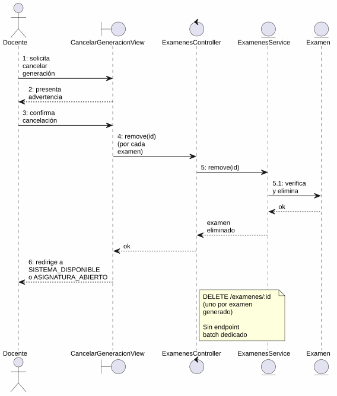
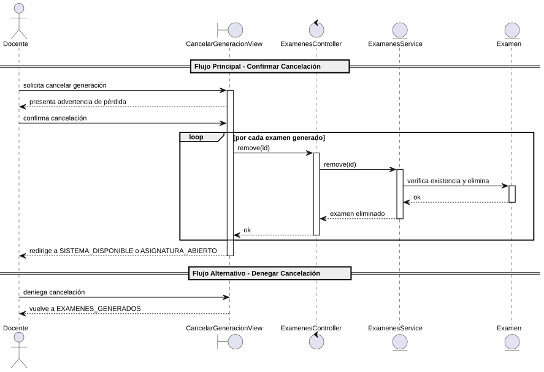

# 25-26-idsw2-sdVC > cancelarGeneracion > Análisis

## propósito

Análisis de colaboración del caso de uso `cancelarGeneracion()` mediante el patrón MVC.

## diagrama de colaboración

||
|-|
|Código fuente: [colaboracion.puml](../../../modelosUML/analisis/cancelarGeneracion/colaboracion.puml)|

## clases de análisis identificadas

### CancelarGeneracionView (Boundary)
- Recibir solicitud desde 2 orígenes (EXAMENES_GENERADOS, EXAMENES_GENERADOS_CONTEXTUALES)
- Presentar confirmación con advertencia de pérdida de datos
- Confirmar cancelación o denegar

### ExamenesController (Control)
- Coordinar la cancelación
- `remove(id)` → `ExamenesService` (por cada examen generado)

### ExamenesService (Entity)
- Abstraer acceso a datos de exámenes
- `remove(id)` con verificación de existencia
- Eliminar exámenes en estado GENERADO

### Examen (Entity)
- Atributos: id, evaluacion, asignaturaId, estado
- Estados: GENERADO, ASIGNADO, RESUELTO, CORREGIDO

## diagrama de secuencia

||
|-|
|Código fuente: [secuencia.puml](../../../modelosUML/analisis/cancelarGeneracion/secuencia.puml)|

## estados de análisis

| Estado | Descripción |
|--------|-------------|
| `RequiringCancelGeneration` | Presenta advertencia de pérdida de datos; espera decisión |
| `ProvidingConfirmation` | Procesa confirmación (elimina exámenes) o denegación (vuelve a listado) |

**Entradas:** EXAMENES_GENERADOS, EXAMENES_GENERADOS_CONTEXTUALES
**Salidas:** SISTEMA_DISPONIBLE / ASIGNATURA_ABIERTO (confirmado), EXAMENES_GENERADOS2 / EXAMENES_GENERADOS_CONTEXTUALES2 (denegado)

## trazabilidad con la implementación

| Capa | Artefacto |
|------|-----------|
| Controlador | `src/apps/backend/src/examenes/examenes.controller.ts` (`DELETE /examenes/:id`) |
| Servicio | `src/apps/backend/src/examenes/examenes.service.ts` (`remove()`) |
| Vista | `src/apps/frontend/src/views/ExamenesView.vue` |
| Modelo (BD) | `src/apps/backend/prisma/schema.prisma` (modelo `Examen`) |

> **Nota:** No existe un endpoint dedicado para cancelar generación. El análisis asume uso de `DELETE /examenes/:id` por cada examen generado, o bien un nuevo endpoint batch `POST /examenes/cancelar-generacion`.
