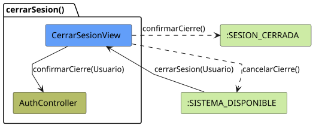
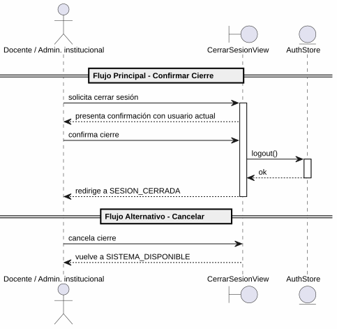

# 25-26-idsw2-sdVC > cerrarSesion > Análisis

## propósito

Análisis de colaboración del caso de uso `cerrarSesion()` mediante el patrón MVC.

## diagrama de colaboración

||
|-|
|Código fuente: [colaboracion.puml](../../../modelosUML/analisis/cerrarSesion/colaboracion.puml)|

## clases de análisis identificadas

### CerrarSesionView (Boundary)
- Recibir solicitud desde SISTEMA_DISPONIBLE
- Presentar confirmación con usuario actual
- Confirmar o cancelar cierre de sesión

### AuthStore (State)
- Gestionar estado de autenticación
- `logout()`: limpiar token y datos de usuario
- Eliminar token de `localStorage`

## diagrama de secuencia

||
|-|
|Código fuente: [secuencia.puml](../../../modelosUML/analisis/cerrarSesion/secuencia.puml)|

## estados de análisis

| Estado | Descripción |
|--------|-------------|
| `SolicitandoCierre` | Presenta confirmación con usuario actual; espera decidir |
| `ConfirmandoCierre` | Procesa decisión: confirmar → SESION_CERRADA, cancelar → SISTEMA_DISPONIBLE |

**Entrada:** SISTEMA_DISPONIBLE
**Salidas:** SESION_CERRADA (confirmado), SISTEMA_DISPONIBLE2 (cancelado)

## trazabilidad con la implementación

| Capa | Artefacto |
|------|-----------|
| Vista | `src/apps/frontend/src/views/DashboardView.vue` (barra superior con botón de cierre) |
| Store | `src/apps/frontend/src/stores/auth.ts` (`logout()`) |
