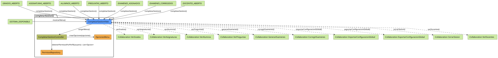

# Jorgestor > completarGestion > Análisis

> |[🏠️](/README.md)|[ 📊](../../../archivosEsenciales/casos-de-uso/diagramasDeContexto/diagramaDeContextoDocente/diagramaContexto.svg)|[Detalle](../../../archivosEsenciales/casos-de-uso/detalladoCasosDeUso/README.md#completar-gestión-docente-y-administrador-institucional)|**Análisis**|Diseño|Desarrollo|Pruebas|
> |-|-|-|-|-|-|-|

## información del artefacto

- **Proyecto**: Jorgestor - Sistema de Gestión de Exámenes
- **Fase RUP**: Elaboración
- **Disciplina**: Análisis y Diseño
- **Versión**: 1.3
- **Fecha**: 2026-05-27
- **Autor**: Gemini CLI

## propósito

Análisis de colaboración del caso de uso `completarGestion()` mediante el patrón MVC. En esta versión refinada, el controlador centraliza la lógica de seguridad y construcción del menú, desacoplando totalmente la vista de la gestión de la sesión del usuario.

## diagramas de análisis

### diagrama de colaboración

||
|-|
|Código fuente: [colaboracion.puml](colaboracion.puml)|

## clases de análisis identificadas

### clases de vista (boundary)

#### CompletarGestionView
**Estereotipo**: Vista (Boundary)  
**Responsabilidades**:
- Solicitar la carga del menú al controlador al activarse.
- Renderizar dinámicamente las opciones recibidas en el objeto `OpcionesMenu`.
- Gestionar la navegación hacia otros módulos.

**Colaboraciones**:
- **Control**: Llama a `cargarMenu()` y recibe `mostrarOpciones()`.

### clases de control

#### CompletarGestionController
**Estereotipo**: Control  
**Responsabilidades**:
- Coordinar la obtención de opciones de menú permitidas para el perfil de usuario.
- Instanciar y configurar el objeto `OpcionesMenu` para la vista.

**Colaboraciones**:
- **Entidad**: `PermisosRepository`, `OpcionesMenu`.

### clases de entidad (entity)

#### PermisosRepository
**Estereotipo**: Entidad (Repositorio)  
**Responsabilidades**: Mapear perfiles de usuario a listas de opciones de menú permitidas.

#### OpcionesMenu
**Estereotipo**: Entidad  
**Responsabilidades**: Actuar como un contenedor de datos estructurados (Data Transfer Object) para las opciones de navegación.

## flujo de colaboración principal

### secuencia: carga de menú centralizada

1. **Invocación**: La vista solicita `cargarMenu()` sin parámetros.
2. **Autorización**: Se obtienen las opciones permitidas del repositorio.
3. **Construcción**: El controlador ensambla el objeto `OpcionesMenu`.
4. **Respuesta**: El controlador inyecta el menú construido en la vista para su visualización.
