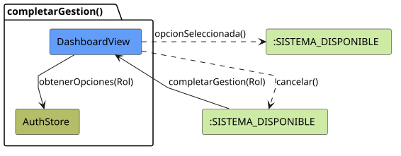
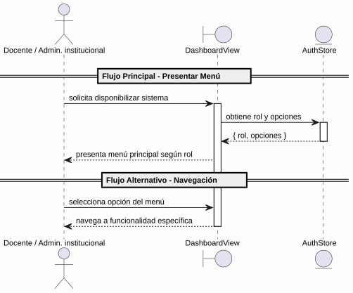

# 25-26-idsw2-sdVC > completarGestion > Análisis

## propósito

Análisis de colaboración del caso de uso `completarGestion()` mediante el patrón MVC.

## diagrama de colaboración

||
|-|
|Código fuente: [colaboracion.puml](../../../modelosUML/analisis/completarGestion/colaboracion.puml)|

## clases de análisis identificadas

### DashboardView (Boundary)
- Recibir solicitud desde 7 orígenes (listados de grados, asignaturas, alumnos, preguntas, exámenes, docentes)
- Presentar menú principal con opciones según el rol
- Navegar a las distintas funcionalidades del sistema

### AuthStore (State)
- Proveer información del usuario y rol
- Determinar opciones de menú disponibles (Docente vs Administrador)

## diagrama de secuencia

||
|-|
|Código fuente: [secuencia.puml](../../../modelosUML/analisis/completarGestion/secuencia.puml)|

## estados de análisis

| Estado | Descripción |
|--------|-------------|
| `PresentandoOpciones` | Muestra el menú principal con opciones específicas según el rol del usuario |

**Entradas:** GRADOS_ABIERTO, ASIGNATURAS_ABIERTO, ALUMNOS_ABIERTO, PREGUNTAS_ABIERTO, EXAMENES_ASIGNADOS, EXAMENES_CORREGIDOS, DOCENTES_ABIERTO
**Salida:** SISTEMA_DISPONIBLE

## trazabilidad con la implementación

| Capa | Artefacto |
|------|-----------|
| Vista | `src/apps/frontend/src/views/DashboardView.vue` |
| Store | `src/apps/frontend/src/stores/auth.ts` (rol del usuario) |
| Router | `src/apps/frontend/src/router/index.ts` (navegación) |
