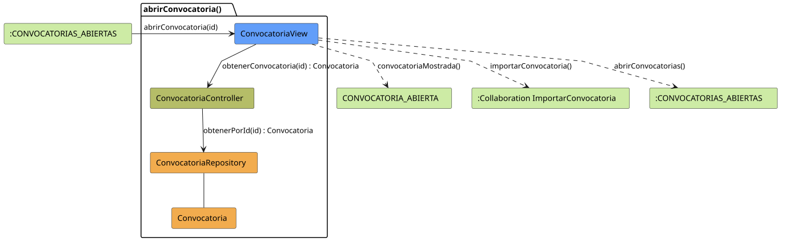

# FUNIBER GIPF > abrirConvocatoria > Análisis

## información del artefacto

- **Proyecto**: FUNIBER GIPF - Plataforma Interna de Investigación
- **Fase**: Análisis
- **Disciplina**: Análisis y Diseño
- **Versión**: 1.0
- **Fecha**: 2026-05-23
- **Autor**: Diego Martínez

## propósito

Análisis de colaboración del caso de uso `abrirConvocatoria()` mediante el patrón MVC, identificando las clases de análisis, sus responsabilidades y colaboraciones necesarias para que el coordinador consulte el detalle de una convocatoria concreta a partir del listado de convocatorias abiertas.

## diagrama de colaboración

||
|-|
|Código fuente: [abrirConvocatoria.puml](../../../modelosUML/analisis/coordinador/abrirConvocatoria.puml)|

## clases de análisis identificadas

### clases de vista (boundary)

#### ConvocatoriaView
**Estereotipo**: Vista (Boundary)  
**Responsabilidades**:
- Recibir la solicitud `abrirConvocatoria(id)` desde el estado `:CONVOCATORIAS_ABIERTAS`
- Solicitar al controlador los datos de la convocatoria seleccionada mediante `obtenerConvocatoria(id) : Convocatoria`
- Mostrar el detalle de la convocatoria al coordinador
- Ofrecer navegación: importar convocatoria o volver al listado de convocatorias

**Colaboraciones**:
- **Entrada**: Desde el estado `:CONVOCATORIAS_ABIERTAS` con `abrirConvocatoria(id)`
- **Control**: Se comunica con `ConvocatoriaController` mediante `obtenerConvocatoria(id) : Convocatoria`
- **Salida**: Transita a `CONVOCATORIA_ABIERTA` (`convocatoriaMostrada()`), a `:Collaboration ImportarConvocatoria` (`importarConvocatoria()`) o a `:CONVOCATORIAS_ABIERTAS` (`abrirConvocatorias()`)

### clases de control

#### ConvocatoriaController
**Estereotipo**: Control  
**Responsabilidades**:
- Recibir la petición `obtenerConvocatoria(id)` desde la vista
- Delegar la recuperación de la convocatoria al repositorio mediante `obtenerPorId(id)`

**Colaboraciones**:
- **Vista**: Responde a solicitudes de `ConvocatoriaView`
- **Repositorio**: Delega el acceso a datos a `ConvocatoriaRepository` mediante `obtenerPorId(id) : Convocatoria`

### clases de entidad (entity)

#### ConvocatoriaRepository
**Estereotipo**: Entidad  
**Responsabilidades**:
- Recuperar una convocatoria concreta por su identificador mediante `obtenerPorId(id) : Convocatoria`

**Colaboraciones**:
- **Control**: Responde a `ConvocatoriaController`
- **Entidad**: Gestiona instancias de `Convocatoria`

#### Convocatoria
**Estereotipo**: Entidad  
**Responsabilidades**:
- Representar los datos de una convocatoria de financiación

**Colaboraciones**:
- **Repositorio**: Es gestionado por `ConvocatoriaRepository`

## flujo de colaboración

### secuencia de operaciones

1. El sistema llega al estado `:CONVOCATORIAS_ABIERTAS` (listado visible)
2. El coordinador selecciona una convocatoria: `ConvocatoriaView` recibe `abrirConvocatoria(id)`
3. `ConvocatoriaView` invoca `obtenerConvocatoria(id)` en `ConvocatoriaController`
4. `ConvocatoriaController` delega en `ConvocatoriaRepository.obtenerPorId(id)` y obtiene un objeto `Convocatoria`
5. `ConvocatoriaView` muestra el detalle → estado `CONVOCATORIA_ABIERTA` con `convocatoriaMostrada()`
6. Desde la vista el coordinador puede:
   - Importar la convocatoria → `:Collaboration ImportarConvocatoria` con `importarConvocatoria()`
   - Volver al listado → `:CONVOCATORIAS_ABIERTAS` con `abrirConvocatorias()`

## correspondencia con requisitos

|Requisito del caso de uso|Clase responsable|Método/Colaboración|
|-|-|-|
|Mostrar detalle de una convocatoria|`ConvocatoriaView`|`abrirConvocatoria(id)`|
|Recuperar la convocatoria por id|`ConvocatoriaController`|`obtenerConvocatoria(id) : Convocatoria`|
|Acceder a datos de la convocatoria|`ConvocatoriaRepository`|`obtenerPorId(id) : Convocatoria`|
|Navegar a importar convocatoria|`ConvocatoriaView`|`importarConvocatoria()`|
|Volver al listado de convocatorias|`ConvocatoriaView`|`abrirConvocatorias()`|

## características del análisis

### separación de responsabilidades MVC

- **Vista**: Solo presentación e interacción con el coordinador
- **Control**: Solo coordinación y recuperación del objeto `Convocatoria`
- **Entidad**: Solo datos y reglas de negocio de las convocatorias

### agnóstico tecnológicamente

- No especifica tecnología de interfaz de usuario
- No asume implementación específica de base de datos
- Mantiene independencia de frameworks

### trazabilidad completa

- **Origen**: Caso de uso detallado `abrirConvocatoria()`
- **Destino**: Base para diseño arquitectónico
- **Conexión**: Diagrama de estados → Análisis de colaboración

## patrones aplicados

### repository pattern
`ConvocatoriaRepository` abstrae el acceso a datos, permitiendo diferentes implementaciones sin afectar al controlador.

### mvc pattern
Separación clara entre presentación (`ConvocatoriaView`), lógica de aplicación (`ConvocatoriaController`) y datos (`Convocatoria`, `ConvocatoriaRepository`).

## referencias

- [Especificación detallada: abrirConvocatoria()](../../../context/casosDeUso/detalle/coordinador/abrirConvocatoria/abrirConvocatoria.md)
- [Modelo del dominio](../../../context/modeloDelDominio/modeloDominio.md)
