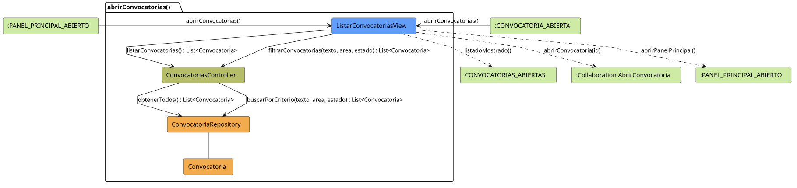

# FUNIBER GIPF > abrirConvocatorias > Análisis

## información del artefacto

- **Proyecto**: FUNIBER GIPF - Plataforma Interna de Investigación
- **Fase**: Análisis
- **Disciplina**: Análisis y Diseño
- **Versión**: 1.0
- **Fecha**: 2026-05-23
- **Autor**: Diego Martínez

## propósito

Análisis de colaboración del caso de uso `abrirConvocatorias()` mediante el patrón MVC, identificando las clases de análisis, sus responsabilidades y colaboraciones necesarias para que el coordinador consulte el listado completo de convocatorias, con opción de filtrado por texto, área y estado.

## diagrama de colaboración

||
|-|
|Código fuente: [abrirConvocatorias.puml](../../../modelosUML/analisis/coordinador/abrirConvocatorias.puml)|

## clases de análisis identificadas

### clases de vista (boundary)

#### ListarConvocatoriasView
**Estereotipo**: Vista (Boundary)  
**Responsabilidades**:
- Recibir la solicitud `abrirConvocatorias()` desde `:PANEL_PRINCIPAL_ABIERTO` o `:CONVOCATORIA_ABIERTA`
- Solicitar al controlador el listado completo de convocatorias mediante `listarConvocatorias()`
- Solicitar al controlador el listado filtrado mediante `filtrarConvocatorias(texto, area, estado)`
- Mostrar el listado resultante al coordinador
- Ofrecer navegación a una convocatoria concreta o al panel principal

**Colaboraciones**:
- **Entrada**: Desde `:PANEL_PRINCIPAL_ABIERTO` o `:CONVOCATORIA_ABIERTA` con `abrirConvocatorias()`
- **Control**: Se comunica con `ConvocatoriasController` mediante `listarConvocatorias() : List<Convocatoria>` y `filtrarConvocatorias(texto, area, estado) : List<Convocatoria>`
- **Salida**: Transita a `CONVOCATORIAS_ABIERTAS` (`listadoMostrado()`), a `:Collaboration AbrirConvocatoria` (`abrirConvocatoria(id)`) o a `:PANEL_PRINCIPAL_ABIERTO` (`abrirPanelPrincipal()`)

### clases de control

#### ConvocatoriasController
**Estereotipo**: Control  
**Responsabilidades**:
- Recibir `listarConvocatorias()` y devolver todas las convocatorias
- Recibir `filtrarConvocatorias(texto, area, estado)` y devolver la lista filtrada

**Colaboraciones**:
- **Vista**: Responde a solicitudes de `ListarConvocatoriasView`
- **Repositorio**: Delega en `ConvocatoriaRepository` mediante `obtenerTodos()` y `buscarPorCriterio(texto, area, estado)`

### clases de entidad (entity)

#### ConvocatoriaRepository
**Estereotipo**: Entidad  
**Responsabilidades**:
- Recuperar todas las convocatorias mediante `obtenerTodos() : List<Convocatoria>`
- Recuperar convocatorias filtradas mediante `buscarPorCriterio(texto, area, estado) : List<Convocatoria>`

**Colaboraciones**:
- **Control**: Responde a `ConvocatoriasController`
- **Entidad**: Gestiona instancias de `Convocatoria`

#### Convocatoria
**Estereotipo**: Entidad  
**Responsabilidades**:
- Representar los datos de una convocatoria de financiación

**Colaboraciones**:
- **Repositorio**: Es gestionado por `ConvocatoriaRepository`

## flujo de colaboración

### secuencia de operaciones

1. El sistema está en `:PANEL_PRINCIPAL_ABIERTO` o en `:CONVOCATORIA_ABIERTA`
2. El coordinador solicita el listado: `ListarConvocatoriasView` recibe `abrirConvocatorias()`
3. `ListarConvocatoriasView` invoca `listarConvocatorias()` en `ConvocatoriasController`
4. `ConvocatoriasController` delega en `ConvocatoriaRepository.obtenerTodos()` y obtiene `List<Convocatoria>`
5. El listado se muestra → estado `CONVOCATORIAS_ABIERTAS` con `listadoMostrado()`
6. El coordinador puede filtrar: `ListarConvocatoriasView` invoca `filtrarConvocatorias(texto, area, estado)` en `ConvocatoriasController`, que delega en `ConvocatoriaRepository.buscarPorCriterio(texto, area, estado)`
7. Desde la vista el coordinador puede:
   - Abrir una convocatoria → `:Collaboration AbrirConvocatoria` con `abrirConvocatoria(id)`
   - Volver al panel principal → `:PANEL_PRINCIPAL_ABIERTO` con `abrirPanelPrincipal()`

## correspondencia con requisitos

|Requisito del caso de uso|Clase responsable|Método/Colaboración|
|-|-|-|
|Mostrar listado de convocatorias|`ListarConvocatoriasView`|`listarConvocatorias() : List<Convocatoria>`|
|Filtrar por texto, área y estado|`ConvocatoriasController`|`filtrarConvocatorias(texto, area, estado) : List<Convocatoria>`|
|Acceder a todas las convocatorias|`ConvocatoriaRepository`|`obtenerTodos() : List<Convocatoria>`|
|Buscar convocatorias por criterio|`ConvocatoriaRepository`|`buscarPorCriterio(texto, area, estado) : List<Convocatoria>`|
|Navegar al detalle de una convocatoria|`ListarConvocatoriasView`|`abrirConvocatoria(id)`|
|Volver al panel principal|`ListarConvocatoriasView`|`abrirPanelPrincipal()`|

## características del análisis

### separación de responsabilidades MVC

- **Vista**: Solo presentación e interacción con el coordinador
- **Control**: Solo coordinación, obtención y filtrado del listado de convocatorias
- **Entidad**: Solo datos y reglas de negocio de las convocatorias

### agnóstico tecnológicamente

- No especifica tecnología de interfaz de usuario
- No asume implementación específica de base de datos
- Mantiene independencia de frameworks

### trazabilidad completa

- **Origen**: Caso de uso detallado `abrirConvocatorias()`
- **Destino**: Base para diseño arquitectónico
- **Conexión**: Diagrama de estados → Análisis de colaboración

## patrones aplicados

### repository pattern
`ConvocatoriaRepository` abstrae el acceso a datos, permitiendo diferentes implementaciones sin afectar al controlador.

### mvc pattern
Separación clara entre presentación (`ListarConvocatoriasView`), lógica de aplicación (`ConvocatoriasController`) y datos (`Convocatoria`, `ConvocatoriaRepository`).

## referencias

- [Especificación detallada: abrirConvocatorias()](../../../context/casosDeUso/detalle/coordinador/abrirConvocatorias/abrirConvocatorias.md)
- [Modelo del dominio](../../../context/modeloDelDominio/modeloDominio.md)
