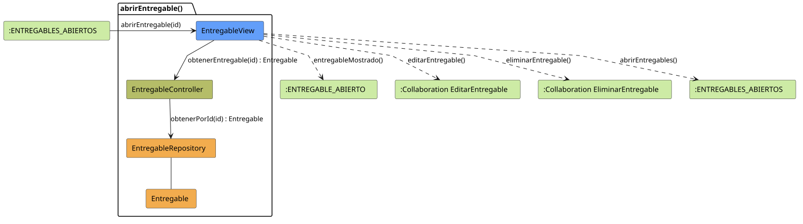

# FUNIBER GIPF > abrirEntregable > Análisis

## información del artefacto

- **Proyecto**: FUNIBER GIPF - Plataforma Interna de Investigación
- **Fase**: Análisis
- **Disciplina**: Análisis y Diseño
- **Versión**: 1.0
- **Fecha**: 2026-05-23
- **Autor**: Diego Martínez

## propósito

Análisis de colaboración del caso de uso `abrirEntregable()` mediante el patrón MVC, identificando las clases de análisis, sus responsabilidades y colaboraciones necesarias para que el coordinador consulte el detalle de un entregable concreto de un proyecto.

## diagrama de colaboración

||
|-|
|Código fuente: [abrirEntregable.puml](../../../modelosUML/analisis/coordinador/abrirEntregable.puml)|

## clases de análisis identificadas

### clases de vista (boundary)

#### EntregableView
**Estereotipo**: Vista (Boundary)  
**Responsabilidades**:
- Recibir la solicitud `abrirEntregable(id)` desde el estado `:ENTREGABLES_ABIERTOS`
- Solicitar al controlador los datos del entregable seleccionado mediante `obtenerEntregable(id) : Entregable`
- Mostrar el detalle del entregable al coordinador
- Ofrecer las opciones de editar entregable, eliminar entregable o volver al listado

**Colaboraciones**:
- **Entrada**: Desde el estado `:ENTREGABLES_ABIERTOS` con `abrirEntregable(id)`
- **Control**: Se comunica con `EntregableController` mediante `obtenerEntregable(id) : Entregable`
- **Salida**: Transita a `:ENTREGABLE_ABIERTO` (`entregableMostrado()`), a `:Collaboration EditarEntregable` (`editarEntregable()`), a `:Collaboration EliminarEntregable` (`eliminarEntregable()`) o a `:ENTREGABLES_ABIERTOS` (`abrirEntregables()`)

### clases de control

#### EntregableController
**Estereotipo**: Control  
**Responsabilidades**:
- Recibir la petición `obtenerEntregable(id)` desde la vista
- Delegar la recuperación del entregable al repositorio mediante `obtenerPorId(id)`

**Colaboraciones**:
- **Vista**: Responde a solicitudes de `EntregableView`
- **Repositorio**: Delega el acceso a datos a `EntregableRepository` mediante `obtenerPorId(id) : Entregable`

### clases de entidad (entity)

#### EntregableRepository
**Estereotipo**: Entidad  
**Responsabilidades**:
- Recuperar un entregable concreto por su identificador mediante `obtenerPorId(id) : Entregable`

**Colaboraciones**:
- **Control**: Responde a `EntregableController`
- **Entidad**: Gestiona instancias de `Entregable`

#### Entregable
**Estereotipo**: Entidad  
**Responsabilidades**:
- Representar los datos de un entregable asociado a un proyecto

**Colaboraciones**:
- **Repositorio**: Es gestionado por `EntregableRepository`

## flujo de colaboración

### secuencia de operaciones

1. El sistema llega al estado `:ENTREGABLES_ABIERTOS` (listado visible)
2. El coordinador selecciona un entregable: `EntregableView` recibe `abrirEntregable(id)`
3. `EntregableView` invoca `obtenerEntregable(id)` en `EntregableController`
4. `EntregableController` delega en `EntregableRepository.obtenerPorId(id)` y obtiene un objeto `Entregable`
5. `EntregableView` muestra el detalle → estado `:ENTREGABLE_ABIERTO` con `entregableMostrado()`
6. Desde la vista el coordinador puede:
   - Editar el entregable → `:Collaboration EditarEntregable` con `editarEntregable()`
   - Eliminar el entregable → `:Collaboration EliminarEntregable` con `eliminarEntregable()`
   - Volver al listado → `:ENTREGABLES_ABIERTOS` con `abrirEntregables()`

## correspondencia con requisitos

|Requisito del caso de uso|Clase responsable|Método/Colaboración|
|-|-|-|
|Mostrar detalle de un entregable|`EntregableView`|`abrirEntregable(id)`|
|Recuperar el entregable por id|`EntregableController`|`obtenerEntregable(id) : Entregable`|
|Acceder a datos del entregable|`EntregableRepository`|`obtenerPorId(id) : Entregable`|
|Navegar a editar entregable|`EntregableView`|`editarEntregable()`|
|Navegar a eliminar entregable|`EntregableView`|`eliminarEntregable()`|
|Volver al listado de entregables|`EntregableView`|`abrirEntregables()`|

## características del análisis

### separación de responsabilidades MVC

- **Vista**: Solo presentación e interacción con el coordinador
- **Control**: Solo coordinación y recuperación del objeto `Entregable`
- **Entidad**: Solo datos y reglas de negocio de los entregables

### agnóstico tecnológicamente

- No especifica tecnología de interfaz de usuario
- No asume implementación específica de base de datos
- Mantiene independencia de frameworks

### trazabilidad completa

- **Origen**: Caso de uso detallado `abrirEntregable()`
- **Destino**: Base para diseño arquitectónico
- **Conexión**: Diagrama de estados → Análisis de colaboración

## patrones aplicados

### repository pattern
`EntregableRepository` abstrae el acceso a datos, permitiendo diferentes implementaciones sin afectar al controlador.

### mvc pattern
Separación clara entre presentación (`EntregableView`), lógica de aplicación (`EntregableController`) y datos (`Entregable`, `EntregableRepository`).

## referencias

- [Especificación detallada: abrirEntregable()](../../../context/casosDeUso/detalle/coordinador/abrirEntregable/abrirEntregable.md)
- [Modelo del dominio](../../../context/modeloDelDominio/modeloDominio.md)
