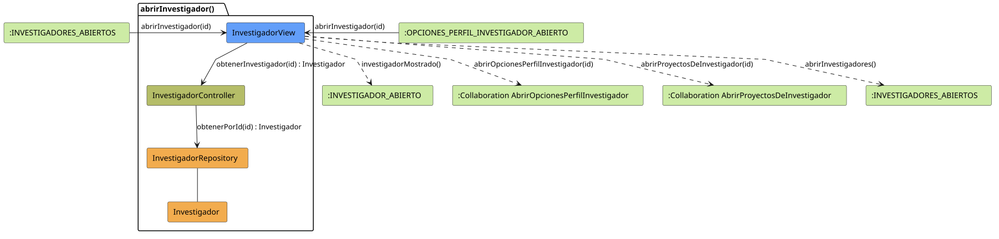

# FUNIBER GIPF > abrirInvestigador > Análisis

## información del artefacto

- **Proyecto**: FUNIBER GIPF - Plataforma Interna de Investigación
- **Fase**: Análisis
- **Disciplina**: Análisis y Diseño
- **Versión**: 1.0
- **Fecha**: 2026-05-23
- **Autor**: Diego Martínez

## propósito

Análisis de colaboración del caso de uso `abrirInvestigador()` mediante el patrón MVC, identificando las clases de análisis, sus responsabilidades y colaboraciones necesarias para que el coordinador consulte el perfil de un investigador concreto.

## diagrama de colaboración

||
|-|
|Código fuente: [abrirInvestigador.puml](../../../modelosUML/analisis/coordinador/abrirInvestigador.puml)|

## clases de análisis identificadas

### clases de vista (boundary)

#### InvestigadorView
**Estereotipo**: Vista (Boundary)  
**Responsabilidades**:
- Recibir la solicitud `abrirInvestigador(id)` desde `:INVESTIGADORES_ABIERTOS` o `:OPCIONES_PERFIL_INVESTIGADOR_ABIERTO`
- Solicitar al controlador los datos del investigador seleccionado mediante `obtenerInvestigador(id) : Investigador`
- Mostrar el perfil del investigador al coordinador
- Ofrecer navegación: abrir opciones de perfil del investigador, ver proyectos del investigador o volver al listado

**Colaboraciones**:
- **Entrada**: Desde `:INVESTIGADORES_ABIERTOS` o `:OPCIONES_PERFIL_INVESTIGADOR_ABIERTO` con `abrirInvestigador(id)`
- **Control**: Se comunica con `InvestigadorController` mediante `obtenerInvestigador(id) : Investigador`
- **Salida**: Transita a `:INVESTIGADOR_ABIERTO` (`investigadorMostrado()`), a `:Collaboration AbrirOpcionesPerfilInvestigador` (`abrirOpcionesPerfilInvestigador(id)`), a `:Collaboration AbrirProyectosDeInvestigador` (`abrirProyectosDeInvestigador(id)`) o a `:INVESTIGADORES_ABIERTOS` (`abrirInvestigadores()`)

### clases de control

#### InvestigadorController
**Estereotipo**: Control  
**Responsabilidades**:
- Recibir la petición `obtenerInvestigador(id)` desde la vista
- Delegar la recuperación del investigador al repositorio mediante `obtenerPorId(id)`

**Colaboraciones**:
- **Vista**: Responde a solicitudes de `InvestigadorView`
- **Repositorio**: Delega el acceso a datos a `InvestigadorRepository` mediante `obtenerPorId(id) : Investigador`

### clases de entidad (entity)

#### InvestigadorRepository
**Estereotipo**: Entidad  
**Responsabilidades**:
- Recuperar un investigador concreto por su identificador mediante `obtenerPorId(id) : Investigador`

**Colaboraciones**:
- **Control**: Responde a `InvestigadorController`
- **Entidad**: Gestiona instancias de `Investigador`

#### Investigador
**Estereotipo**: Entidad  
**Responsabilidades**:
- Representar los datos de un investigador de la red FUNIBER

**Colaboraciones**:
- **Repositorio**: Es gestionado por `InvestigadorRepository`

## flujo de colaboración

### secuencia de operaciones

1. El sistema está en `:INVESTIGADORES_ABIERTOS` o en `:OPCIONES_PERFIL_INVESTIGADOR_ABIERTO`
2. El coordinador selecciona un investigador: `InvestigadorView` recibe `abrirInvestigador(id)`
3. `InvestigadorView` invoca `obtenerInvestigador(id)` en `InvestigadorController`
4. `InvestigadorController` delega en `InvestigadorRepository.obtenerPorId(id)` y obtiene un objeto `Investigador`
5. `InvestigadorView` muestra el perfil → estado `:INVESTIGADOR_ABIERTO` con `investigadorMostrado()`
6. Desde la vista el coordinador puede:
   - Ver opciones de perfil → `:Collaboration AbrirOpcionesPerfilInvestigador` con `abrirOpcionesPerfilInvestigador(id)`
   - Ver proyectos del investigador → `:Collaboration AbrirProyectosDeInvestigador` con `abrirProyectosDeInvestigador(id)`
   - Volver al listado → `:INVESTIGADORES_ABIERTOS` con `abrirInvestigadores()`

## correspondencia con requisitos

|Requisito del caso de uso|Clase responsable|Método/Colaboración|
|-|-|-|
|Mostrar perfil de un investigador|`InvestigadorView`|`abrirInvestigador(id)`|
|Recuperar el investigador por id|`InvestigadorController`|`obtenerInvestigador(id) : Investigador`|
|Acceder a datos del investigador|`InvestigadorRepository`|`obtenerPorId(id) : Investigador`|
|Navegar a opciones de perfil del investigador|`InvestigadorView`|`abrirOpcionesPerfilInvestigador(id)`|
|Navegar a proyectos del investigador|`InvestigadorView`|`abrirProyectosDeInvestigador(id)`|
|Volver al listado de investigadores|`InvestigadorView`|`abrirInvestigadores()`|

## características del análisis

### separación de responsabilidades MVC

- **Vista**: Solo presentación e interacción con el coordinador
- **Control**: Solo coordinación y recuperación del objeto `Investigador`
- **Entidad**: Solo datos y reglas de negocio de los investigadores

### agnóstico tecnológicamente

- No especifica tecnología de interfaz de usuario
- No asume implementación específica de base de datos
- Mantiene independencia de frameworks

### trazabilidad completa

- **Origen**: Caso de uso detallado `abrirInvestigador()`
- **Destino**: Base para diseño arquitectónico
- **Conexión**: Diagrama de estados → Análisis de colaboración

## patrones aplicados

### repository pattern
`InvestigadorRepository` abstrae el acceso a datos, permitiendo diferentes implementaciones sin afectar al controlador.

### mvc pattern
Separación clara entre presentación (`InvestigadorView`), lógica de aplicación (`InvestigadorController`) y datos (`Investigador`, `InvestigadorRepository`).

## referencias

- [Especificación detallada: abrirInvestigador()](../../../context/casosDeUso/detalle/coordinador/abrirInvestigador/abrirInvestigador.md)
- [Modelo del dominio](../../../context/modeloDelDominio/modeloDominio.md)
